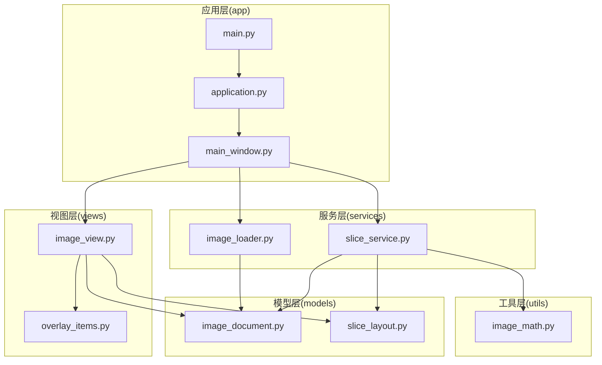
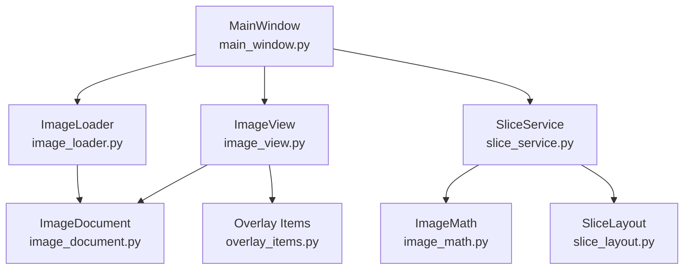
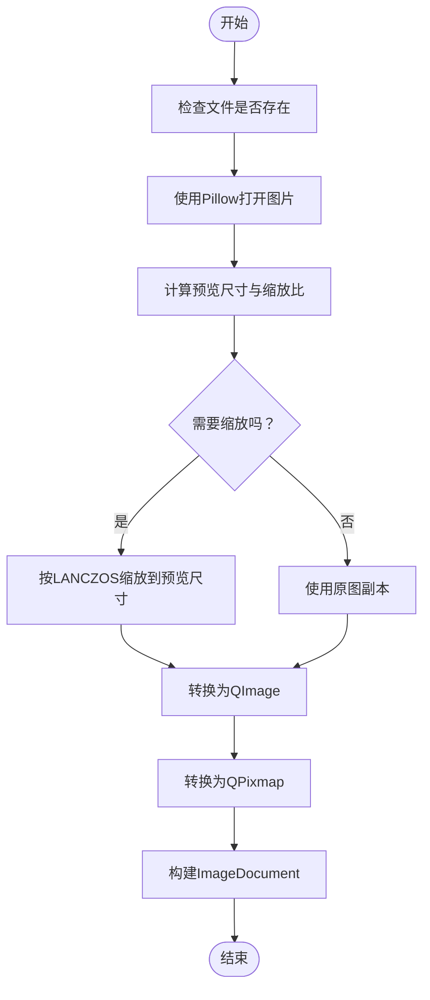
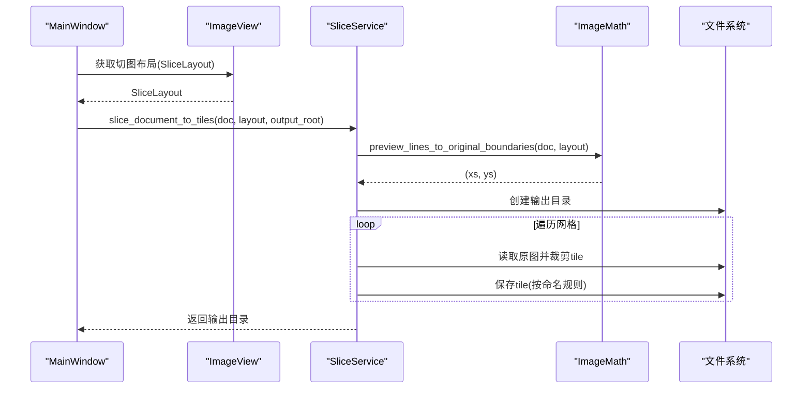
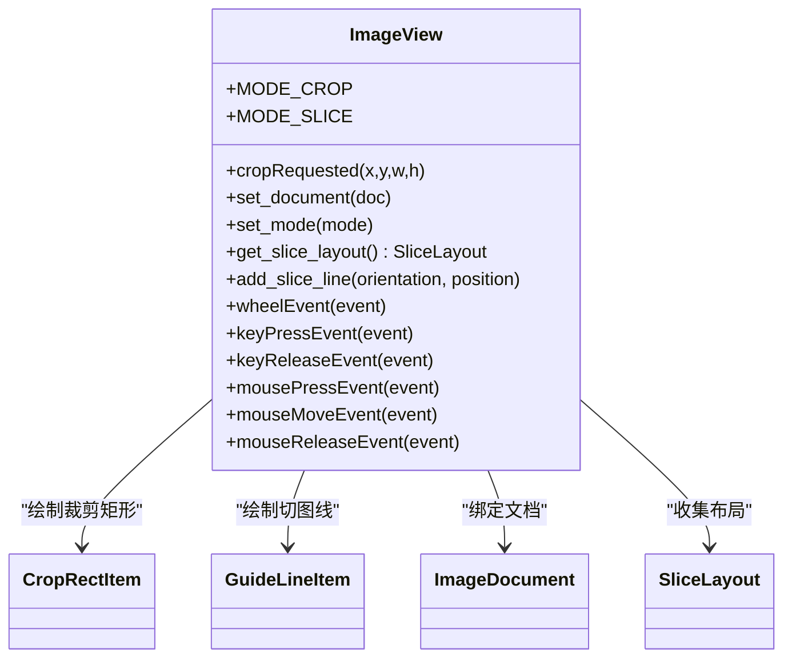
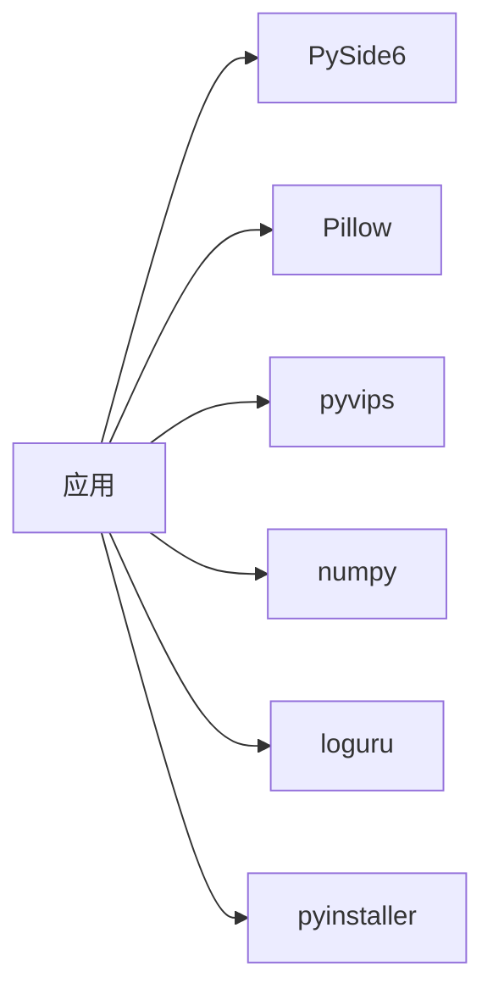

# 开发者指南

<cite>
**本文引用的文件**
- [main.py](file://img_slicer_tool/main.py)
- [application.py](file://img_slicer_tool/app/application.py)
- [main_window.py](file://img_slicer_tool/app/main_window.py)
- [image_view.py](file://img_slicer_tool/views/image_view.py)
- [overlay_items.py](file://img_slicer_tool/views/overlay_items.py)
- [image_document.py](file://img_slicer_tool/models/image_document.py)
- [slice_layout.py](file://img_slicer_tool/models/slice_layout.py)
- [image_loader.py](file://img_slicer_tool/services/image_loader.py)
- [slice_service.py](file://img_slicer_tool/services/slice_service.py)
- [image_math.py](file://img_slicer_tool/utils/image_math.py)
- [requirements.txt](file://img_slicer_tool/requirements.txt)
- [README.md](file://img_slicer_tool/README.md)
- [projectstart_task_card.md](file://task/projectstart_task_card.md)
- [sizecutting_task_card.md](file://task/sizecutting_task_card.md)
- [piccutting_task_card.md](file://task/piccutting_task_card.md)
</cite>

## 目录
1. [简介](#简介)
2. [项目结构](#项目结构)
3. [核心组件](#核心组件)
4. [架构总览](#架构总览)
5. [详细组件分析](#详细组件分析)
6. [依赖分析](#依赖分析)
7. [性能考虑](#性能考虑)
8. [故障排查](#故障排查)
9. [结论](#结论)
10. [附录](#附录)

## 简介
本指南面向二次开发者，帮助你在现有项目基础上进行扩展与定制。重点包括：
- 环境搭建与依赖管理
- 关键扩展点与最佳实践：图像后端替换、切图命名规则与输出格式扩展、滤镜能力接入
- 交互模式扩展：新增 ImageView 模式、自定义布局算法
- 结合任务卡的未来路线图建议与贡献指引

## 项目结构
项目采用按职责分层的组织方式：
- app 层：应用入口与主窗口
- views 层：UI 视图与交互元素
- models 层：数据模型
- services 层：业务服务（图像加载、裁剪、切图）
- utils 层：数学与工具函数
- task 目录：开发任务卡，指导功能演进

图表来源
- [main.py](file://img_slicer_tool/main.py#L1-L13)
- [application.py](file://img_slicer_tool/app/application.py#L1-L35)
- [main_window.py](file://img_slicer_tool/app/main_window.py#L1-L262)
- [image_view.py](file://img_slicer_tool/views/image_view.py#L1-L218)
- [overlay_items.py](file://img_slicer_tool/views/overlay_items.py#L1-L57)
- [image_document.py](file://img_slicer_tool/models/image_document.py#L1-L18)
- [slice_layout.py](file://img_slicer_tool/models/slice_layout.py#L1-L30)
- [image_loader.py](file://img_slicer_tool/services/image_loader.py#L1-L68)
- [slice_service.py](file://img_slicer_tool/services/slice_service.py#L1-L62)
- [image_math.py](file://img_slicer_tool/utils/image_math.py#L1-L76)

章节来源
- [main.py](file://img_slicer_tool/main.py#L1-L13)
- [application.py](file://img_slicer_tool/app/application.py#L1-L35)
- [main_window.py](file://img_slicer_tool/app/main_window.py#L1-L262)
- [README.md](file://img_slicer_tool/README.md#L1-L10)

## 核心组件
- 应用入口与生命周期：main.py 负责创建并运行应用；application.py 初始化 QApplication、图标与样式；main_window.py 构建菜单、连接信号、协调视图与服务。
- 视图与交互：image_view.py 提供缩放、平移、裁剪矩形绘制与切图线交互；overlay_items.py 提供裁剪矩形与切图线图元。
- 数据模型：image_document.py 描述图片文档（路径、尺寸、预览图、缩放比例）；slice_layout.py 描述切图线布局。
- 服务层：image_loader.py 负责加载与生成预览图；slice_service.py 负责将布局转换为切图并保存。
- 数学与工具：image_math.py 提供预览坐标与原图坐标的映射。

章节来源
- [main.py](file://img_slicer_tool/main.py#L1-L13)
- [application.py](file://img_slicer_tool/app/application.py#L1-L35)
- [main_window.py](file://img_slicer_tool/app/main_window.py#L1-L262)
- [image_view.py](file://img_slicer_tool/views/image_view.py#L1-L218)
- [overlay_items.py](file://img_slicer_tool/views/overlay_items.py#L1-L57)
- [image_document.py](file://img_slicer_tool/models/image_document.py#L1-L18)
- [slice_layout.py](file://img_slicer_tool/models/slice_layout.py#L1-L30)
- [image_loader.py](file://img_slicer_tool/services/image_loader.py#L1-L68)
- [slice_service.py](file://img_slicer_tool/services/slice_service.py#L1-L62)
- [image_math.py](file://img_slicer_tool/utils/image_math.py#L1-L76)

## 架构总览
应用采用“视图-模型-服务-工具”的分层架构，视图负责交互与展示，模型承载数据，服务负责业务逻辑，工具提供数学与辅助能力。主窗口作为控制器协调各层。

图表来源
- [main_window.py](file://img_slicer_tool/app/main_window.py#L1-L262)
- [image_view.py](file://img_slicer_tool/views/image_view.py#L1-L218)
- [overlay_items.py](file://img_slicer_tool/views/overlay_items.py#L1-L57)
- [image_loader.py](file://img_slicer_tool/services/image_loader.py#L1-L68)
- [slice_service.py](file://img_slicer_tool/services/slice_service.py#L1-L62)
- [image_math.py](file://img_slicer_tool/utils/image_math.py#L1-L76)
- [image_document.py](file://img_slicer_tool/models/image_document.py#L1-L18)
- [slice_layout.py](file://img_slicer_tool/models/slice_layout.py#L1-L30)

## 详细组件分析

### 图像加载与预览（image_loader）
- 职责：读取图片、生成预览图（最长边不超过阈值）、计算缩放比例、构建 ImageDocument。
- 关键点：
  - 预览尺寸计算与缩放比
  - Pillow 与 QImage/QPixmap 的互转
  - 异常处理与路径校验
- 扩展建议：
  - 用 pyvips 替代 Pillow 以提升大图处理性能（见“性能考虑”）
  - 支持更多输入格式（见“扩展点建议”）

图表来源
- [image_loader.py](file://img_slicer_tool/services/image_loader.py#L1-L68)

章节来源
- [image_loader.py](file://img_slicer_tool/services/image_loader.py#L1-L68)

### 切图服务（slice_service）
- 职责：将切图线布局转换为原图边界，打开原图并逐块裁剪，按命名规则保存。
- 关键点：
  - 输出目录以原图名为子目录
  - 文件名规则：原图名_rXX_cYY.ext
  - JPEG 保存质量参数
- 扩展建议：
  - 支持更多输出格式（PNG/JPEG/WebP等）
  - 支持自定义命名模板
  - 并行/流式处理以提升大图性能

图表来源
- [slice_service.py](file://img_slicer_tool/services/slice_service.py#L1-L62)
- [image_math.py](file://img_slicer_tool/utils/image_math.py#L50-L76)
- [main_window.py](file://img_slicer_tool/app/main_window.py#L230-L262)

章节来源
- [slice_service.py](file://img_slicer_tool/services/slice_service.py#L1-L62)
- [image_math.py](file://img_slicer_tool/utils/image_math.py#L50-L76)
- [main_window.py](file://img_slicer_tool/app/main_window.py#L230-L262)

### 视图与交互（image_view）
- 职责：缩放、平移、裁剪矩形绘制、切图线交互、模式切换。
- 关键点：
  - 模式常量：裁剪模式与切图模式
  - 信号：cropRequested
  - 键盘与鼠标事件处理
  - 切图线收集与归一化
- 扩展建议：
  - 新增交互模式（如旋转、自由形状裁剪）
  - 支持撤销/重做
  - 支持批量操作与快捷键

图表来源
- [image_view.py](file://img_slicer_tool/views/image_view.py#L1-L218)
- [overlay_items.py](file://img_slicer_tool/views/overlay_items.py#L1-L57)
- [image_document.py](file://img_slicer_tool/models/image_document.py#L1-L18)
- [slice_layout.py](file://img_slicer_tool/models/slice_layout.py#L1-L30)

章节来源
- [image_view.py](file://img_slicer_tool/views/image_view.py#L1-L218)
- [overlay_items.py](file://img_slicer_tool/views/overlay_items.py#L1-L57)

### 主窗口控制器（main_window）
- 职责：菜单、动作、状态栏、消息框、事件连接；协调加载、裁剪、切图流程。
- 关键点：
  - 动作与菜单项
  - 信号连接与回调
  - 错误提示与用户确认
- 扩展建议：
  - 导入/导出配置
  - 批量处理队列
  - 日志与进度反馈

章节来源
- [main_window.py](file://img_slicer_tool/app/main_window.py#L1-L262)

## 依赖分析
- GUI：PySide6
- 图像处理：Pillow（当前实现）、pyvips（预留）
- 打包：pyinstaller
- 日志：loguru（预留）

图表来源
- [requirements.txt](file://img_slicer_tool/requirements.txt#L1-L14)

章节来源
- [requirements.txt](file://img_slicer_tool/requirements.txt#L1-L14)

## 性能考虑
- 预览优先：始终以预览图驱动 UI，避免对原图频繁读写。
- 大图优化：在 image_loader 与 slice_service 中引入 pyvips 替代 Pillow，可显著降低内存占用与提升大图处理速度。
- I/O 优化：切图时复用同一原图句柄，减少重复打开；JPEG 保存使用高质量参数。
- 并行化：对多线程/异步处理进行评估，避免阻塞 UI。
- 缓存策略：对常用中间结果进行缓存（如预览图、映射表）。

章节来源
- [image_loader.py](file://img_slicer_tool/services/image_loader.py#L1-L68)
- [slice_service.py](file://img_slicer_tool/services/slice_service.py#L1-L62)
- [requirements.txt](file://img_slicer_tool/requirements.txt#L1-L14)

## 故障排查
- 图片加载失败：检查路径是否存在、格式是否受支持、权限是否足够。
- 切图异常：确认输出根路径有效、布局线数量充足、边界计算合法。
- UI 交互问题：检查模式切换、键盘修饰键、鼠标事件是否被正确转发。
- 性能问题：确认是否使用了预览图、是否启用了合适的缩放策略、是否避免了不必要的重复读写。

章节来源
- [main_window.py](file://img_slicer_tool/app/main_window.py#L76-L167)
- [main_window.py](file://img_slicer_tool/app/main_window.py#L230-L262)
- [image_loader.py](file://img_slicer_tool/services/image_loader.py#L24-L55)
- [slice_service.py](file://img_slicer_tool/services/slice_service.py#L12-L62)

## 结论
本项目提供了清晰的分层架构与明确的扩展点。通过替换图像后端、扩展命名规则与输出格式、增加交互模式与布局算法，你可以持续增强工具的功能与性能。建议优先从“预览优先 + pyvips 优化”入手，再逐步引入更丰富的交互与导出能力。

## 附录

### 环境搭建与安装
- Python 版本：3.10+
- 安装依赖：使用 requirements.txt 中的版本锁定
- 运行方式：python main.py
- 打包方式：pyinstaller（预留配置文件）

章节来源
- [requirements.txt](file://img_slicer_tool/requirements.txt#L1-L14)
- [README.md](file://img_slicer_tool/README.md#L1-L10)
- [main.py](file://img_slicer_tool/main.py#L1-L13)

### 关键扩展点与定制指南

- 替换图像后端（用 pyvips 替代 Pillow）
  - 适用场景：超大图处理、内存敏感、高性能需求
  - 实施要点：
    - 在 image_loader 中引入 pyvips 读取与缩放，保持 ImageDocument 结构不变
    - 在 slice_service 中以原图句柄复用的方式进行裁剪，避免重复解码
    - 逐步替换 Pillow 的 I/O 与滤镜调用
  - 参考实现位置：
    - [image_loader.py](file://img_slicer_tool/services/image_loader.py#L1-L68)
    - [slice_service.py](file://img_slicer_tool/services/slice_service.py#L1-L62)
    - [requirements.txt](file://img_slicer_tool/requirements.txt#L1-L14)

- 扩展切图命名规则与输出格式
  - 命名规则：当前为“原图名_rXX_cYY.ext”，可扩展为模板化命名（如带时间戳、行列索引、分辨率等）
  - 输出格式：当前支持 PNG/JPEG（JPEG 质量与子采样），可扩展 WebP/AVIF 等
  - 实施要点：
    - 在 slice_service 中增加命名模板解析与格式检测
    - 为不同格式设置合理的保存参数
  - 参考实现位置：
    - [slice_service.py](file://img_slicer_tool/services/slice_service.py#L27-L62)

- 添加新的图像处理滤镜
  - 实施要点：
    - 在服务层新增滤镜服务模块，统一管理滤镜链
    - 在主窗口增加滤镜菜单与参数面板
    - 与裁剪/切图流程集成，支持批量应用
  - 参考实现位置：
    - [main_window.py](file://img_slicer_tool/app/main_window.py#L1-L262)

- 扩展切图布局算法
  - 当前布局来源于用户绘制的切图线，可扩展为：
    - 基于内容的智能分割（如基于边缘/纹理）
    - 网格自动生成（行/列数、固定尺寸、黄金比例等）
  - 实施要点：
    - 在 slice_service 前置阶段增加布局生成器
    - 与 SliceLayout 兼容，保持坐标映射一致性
  - 参考实现位置：
    - [slice_layout.py](file://img_slicer_tool/models/slice_layout.py#L1-L30)
    - [image_math.py](file://img_slicer_tool/utils/image_math.py#L50-L76)

- 扩展 ImageView 交互模式
  - 当前模式：裁剪模式、切图模式
  - 可扩展：旋转、自由形状裁剪、多边形选择、撤销/重做
  - 实施要点：
    - 在 image_view.py 中新增模式常量与状态机
    - 扩展 overlay_items.py 以支持新的图形元素
  - 参考实现位置：
    - [image_view.py](file://img_slicer_tool/views/image_view.py#L1-L218)
    - [overlay_items.py](file://img_slicer_tool/views/overlay_items.py#L1-L57)

### 未来功能开发路线图（结合任务卡）
- 已完成功能
  - 项目初始化与大图预览（projectstart_task_card.md）
  - 裁剪功能（sizecutting_task_card.md）
  - 宫格切图功能（piccutting_task_card.md）
- 建议的下一步
  - 图像后端替换：引入 pyvips，优化大图处理
  - 导出增强：支持 WebP/AVIF、EXIF 保留、批处理队列
  - 交互增强：撤销/重做、多边形裁剪、智能布局
  - 性能优化：并行处理、内存池、增量渲染
  - 配置与插件：配置文件、滤镜插件接口
- 贡献指引
  - 请遵循现有分层与命名规范
  - 新增功能需提供最小可运行示例与测试
  - 提交前确保 README 与任务卡同步更新

章节来源
- [projectstart_task_card.md](file://task/projectstart_task_card.md#L1-L627)
- [sizecutting_task_card.md](file://task/sizecutting_task_card.md#L1-L496)
- [piccutting_task_card.md](file://task/piccutting_task_card.md#L1-L800)