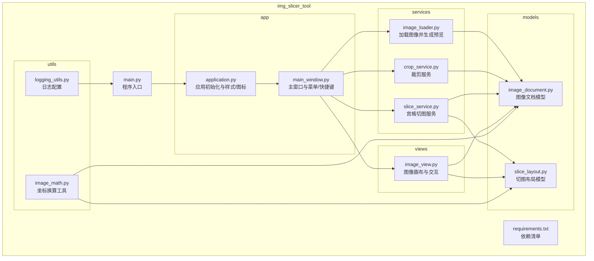
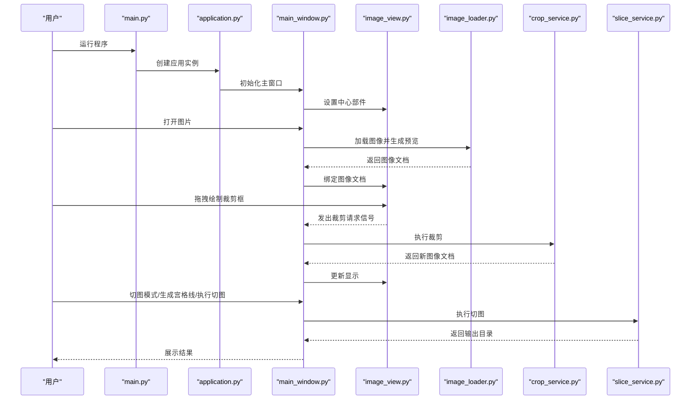
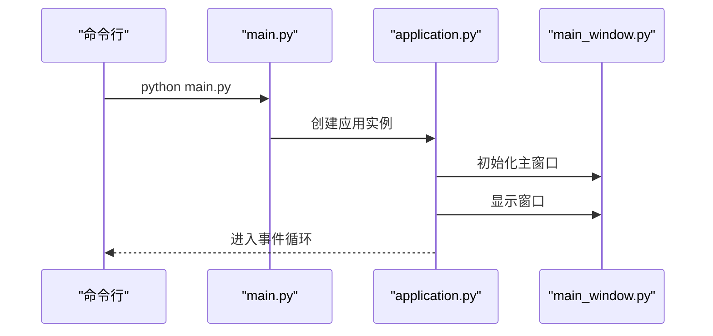
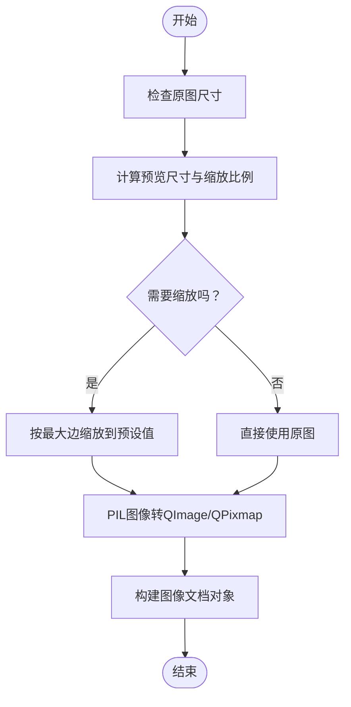
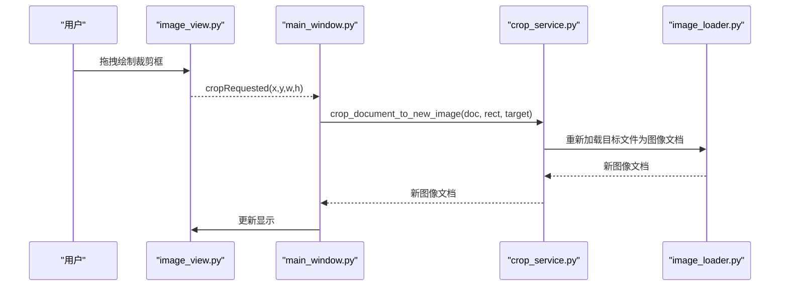
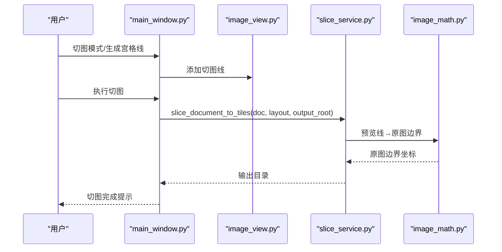
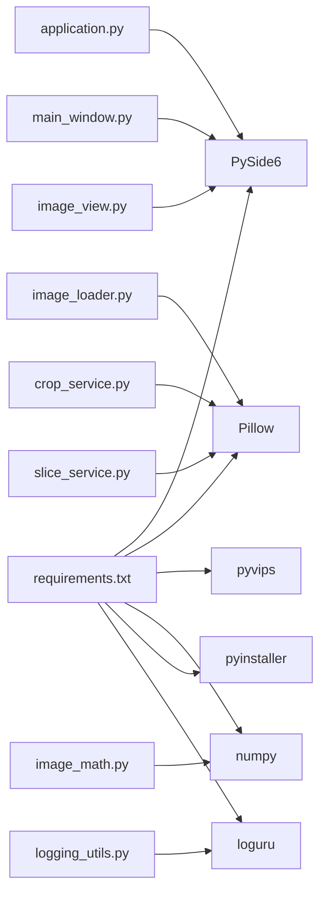

# 快速入门指南

<cite>
**本文引用的文件**
- [img_slicer_tool/main.py](file://img_slicer_tool/main.py)
- [img_slicer_tool/requirements.txt](file://img_slicer_tool/requirements.txt)
- [img_slicer_tool/README.md](file://img_slicer_tool/README.md)
- [img_slicer_tool/app/application.py](file://img_slicer_tool/app/application.py)
- [img_slicer_tool/app/main_window.py](file://img_slicer_tool/app/main_window.py)
- [img_slicer_tool/views/image_view.py](file://img_slicer_tool/views/image_view.py)
- [img_slicer_tool/services/image_loader.py](file://img_slicer_tool/services/image_loader.py)
- [img_slicer_tool/services/crop_service.py](file://img_slicer_tool/services/crop_service.py)
- [img_slicer_tool/services/slice_service.py](file://img_slicer_tool/services/slice_service.py)
- [img_slicer_tool/models/image_document.py](file://img_slicer_tool/models/image_document.py)
- [img_slicer_tool/models/slice_layout.py](file://img_slicer_tool/models/slice_layout.py)
- [img_slicer_tool/utils/image_math.py](file://img_slicer_tool/utils/image_math.py)
- [img_slicer_tool/utils/logging_utils.py](file://img_slicer_tool/utils/logging_utils.py)
</cite>

## 目录
1. [简介](#简介)
2. [项目结构](#项目结构)
3. [核心组件](#核心组件)
4. [架构总览](#架构总览)
5. [详细组件分析](#详细组件分析)
6. [依赖关系分析](#依赖关系分析)
7. [性能与使用建议](#性能与使用建议)
8. [故障排查指南](#故障排查指南)
9. [结论](#结论)
10. [附录：5分钟首次运行步骤](#附录5分钟首次运行步骤)

## 简介
本指南面向初学者，帮助你在本地环境快速搭建并运行 PictureMaster（图片裁剪与切图工具）。你将学会：
- 准备 Python 环境
- 安装依赖（PySide6、Pillow、pyvips、numpy、loguru 等）
- 运行主程序启动 GUI
- 在 5 分钟内完成“打开图片—浏览—裁剪—切图”的基本流程

该工具支持加载大图并以预览图方式显示，支持 Ctrl+滚轮缩放、空格+拖动平移视图，并提供裁剪与宫格切图功能。

**章节来源**
- [img_slicer_tool/README.md](file://img_slicer_tool/README.md#L1-L10)

## 项目结构
项目采用“功能分层 + 文件夹组织”的结构，主要目录与职责如下：
- img_slicer_tool/
  - app/：应用入口与主窗口逻辑
  - services/：图像加载、裁剪、切图等业务服务
  - models/：数据模型（图像文档、切图布局）
  - views/：图形视图与覆盖元素（图像画布、裁剪框、切图线）
  - utils/：图像数学计算与日志工具
  - resources/：样式表与图标资源
  - main.py：程序入口
  - requirements.txt：依赖清单

**图表来源**
- [img_slicer_tool/main.py](file://img_slicer_tool/main.py#L1-L13)
- [img_slicer_tool/app/application.py](file://img_slicer_tool/app/application.py#L1-L35)
- [img_slicer_tool/app/main_window.py](file://img_slicer_tool/app/main_window.py#L1-L262)
- [img_slicer_tool/views/image_view.py](file://img_slicer_tool/views/image_view.py#L1-L218)
- [img_slicer_tool/services/image_loader.py](file://img_slicer_tool/services/image_loader.py#L1-L68)
- [img_slicer_tool/services/crop_service.py](file://img_slicer_tool/services/crop_service.py#L1-L38)
- [img_slicer_tool/services/slice_service.py](file://img_slicer_tool/services/slice_service.py#L1-L62)
- [img_slicer_tool/models/image_document.py](file://img_slicer_tool/models/image_document.py#L1-L18)
- [img_slicer_tool/models/slice_layout.py](file://img_slicer_tool/models/slice_layout.py#L1-L30)
- [img_slicer_tool/utils/image_math.py](file://img_slicer_tool/utils/image_math.py#L1-L76)
- [img_slicer_tool/utils/logging_utils.py](file://img_slicer_tool/utils/logging_utils.py#L1-L6)
- [img_slicer_tool/requirements.txt](file://img_slicer_tool/requirements.txt#L1-L14)

**章节来源**
- [img_slicer_tool/main.py](file://img_slicer_tool/main.py#L1-L13)
- [img_slicer_tool/requirements.txt](file://img_slicer_tool/requirements.txt#L1-L14)

## 核心组件
- 应用入口与启动
  - 入口文件负责创建应用实例并运行事件循环。
  - 参考路径：[img_slicer_tool/main.py](file://img_slicer_tool/main.py#L1-L13)
- 应用初始化
  - 初始化 QApplication，设置应用名、组织名、图标与样式表。
  - 参考路径：[img_slicer_tool/app/application.py](file://img_slicer_tool/app/application.py#L1-L35)
- 主窗口
  - 负责菜单、动作、状态栏、快捷键与交互事件转发。
  - 参考路径：[img_slicer_tool/app/main_window.py](file://img_slicer_tool/app/main_window.py#L1-L262)
- 图像视图
  - 提供缩放、平移、裁剪框绘制、切图线绘制与交互信号。
  - 参考路径：[img_slicer_tool/views/image_view.py](file://img_slicer_tool/views/image_view.py#L1-L218)
- 图像加载
  - 将原图转为预览图，计算缩放比例，封装为图像文档。
  - 参考路径：[img_slicer_tool/services/image_loader.py](file://img_slicer_tool/services/image_loader.py#L1-L68)
- 裁剪服务
  - 将预览坐标映射到原图，执行裁剪并生成新文档。
  - 参考路径：[img_slicer_tool/services/crop_service.py](file://img_slicer_tool/services/crop_service.py#L1-L38)
- 切图服务
  - 将预览切图线映射到原图边界，批量导出切片。
  - 参考路径：[img_slicer_tool/services/slice_service.py](file://img_slicer_tool/services/slice_service.py#L1-L62)
- 数据模型
  - 图像文档与切图布局的数据结构。
  - 参考路径：
    - [img_slicer_tool/models/image_document.py](file://img_slicer_tool/models/image_document.py#L1-L18)
    - [img_slicer_tool/models/slice_layout.py](file://img_slicer_tool/models/slice_layout.py#L1-L30)
- 数学工具
  - 预览坐标与原图坐标的换算。
  - 参考路径：[img_slicer_tool/utils/image_math.py](file://img_slicer_tool/utils/image_math.py#L1-L76)
- 日志
  - 使用 loguru 输出日志到文件。
  - 参考路径：[img_slicer_tool/utils/logging_utils.py](file://img_slicer_tool/utils/logging_utils.py#L1-L6)

**章节来源**
- [img_slicer_tool/main.py](file://img_slicer_tool/main.py#L1-L13)
- [img_slicer_tool/app/application.py](file://img_slicer_tool/app/application.py#L1-L35)
- [img_slicer_tool/app/main_window.py](file://img_slicer_tool/app/main_window.py#L1-L262)
- [img_slicer_tool/views/image_view.py](file://img_slicer_tool/views/image_view.py#L1-L218)
- [img_slicer_tool/services/image_loader.py](file://img_slicer_tool/services/image_loader.py#L1-L68)
- [img_slicer_tool/services/crop_service.py](file://img_slicer_tool/services/crop_service.py#L1-L38)
- [img_slicer_tool/services/slice_service.py](file://img_slicer_tool/services/slice_service.py#L1-L62)
- [img_slicer_tool/models/image_document.py](file://img_slicer_tool/models/image_document.py#L1-L18)
- [img_slicer_tool/models/slice_layout.py](file://img_slicer_tool/models/slice_layout.py#L1-L30)
- [img_slicer_tool/utils/image_math.py](file://img_slicer_tool/utils/image_math.py#L1-L76)
- [img_slicer_tool/utils/logging_utils.py](file://img_slicer_tool/utils/logging_utils.py#L1-L6)

## 架构总览
下图展示了从入口到各模块的调用关系与职责分工。

**图表来源**
- [img_slicer_tool/main.py](file://img_slicer_tool/main.py#L1-L13)
- [img_slicer_tool/app/application.py](file://img_slicer_tool/app/application.py#L1-L35)
- [img_slicer_tool/app/main_window.py](file://img_slicer_tool/app/main_window.py#L1-L262)
- [img_slicer_tool/views/image_view.py](file://img_slicer_tool/views/image_view.py#L1-L218)
- [img_slicer_tool/services/image_loader.py](file://img_slicer_tool/services/image_loader.py#L1-L68)
- [img_slicer_tool/services/crop_service.py](file://img_slicer_tool/services/crop_service.py#L1-L38)
- [img_slicer_tool/services/slice_service.py](file://img_slicer_tool/services/slice_service.py#L1-L62)

## 详细组件分析

### 应用入口与启动流程
- 入口文件负责创建应用实例并运行事件循环。
- 应用初始化负责设置应用名、组织名、图标与样式表。
- 主窗口负责菜单、动作、状态栏与交互事件。

**图表来源**
- [img_slicer_tool/main.py](file://img_slicer_tool/main.py#L1-L13)
- [img_slicer_tool/app/application.py](file://img_slicer_tool/app/application.py#L1-L35)
- [img_slicer_tool/app/main_window.py](file://img_slicer_tool/app/main_window.py#L1-L262)

**章节来源**
- [img_slicer_tool/main.py](file://img_slicer_tool/main.py#L1-L13)
- [img_slicer_tool/app/application.py](file://img_slicer_tool/app/application.py#L1-L35)

### 图像加载与预览
- 读取原图尺寸，计算预览尺寸与缩放比例。
- 将 PIL 图像转为 QImage/QPixmap 并封装为图像文档。
- 用于后续缩放、平移与裁剪/切图坐标换算。

**图表来源**
- [img_slicer_tool/services/image_loader.py](file://img_slicer_tool/services/image_loader.py#L1-L68)
- [img_slicer_tool/models/image_document.py](file://img_slicer_tool/models/image_document.py#L1-L18)

**章节来源**
- [img_slicer_tool/services/image_loader.py](file://img_slicer_tool/services/image_loader.py#L1-L68)
- [img_slicer_tool/models/image_document.py](file://img_slicer_tool/models/image_document.py#L1-L18)

### 裁剪流程
- 用户在图像画布上拖拽绘制裁剪框，触发裁剪请求信号。
- 将预览坐标映射到原图坐标，执行裁剪并生成新图像文档。
- 更新视图与状态栏信息。

**图表来源**
- [img_slicer_tool/views/image_view.py](file://img_slicer_tool/views/image_view.py#L1-L218)
- [img_slicer_tool/app/main_window.py](file://img_slicer_tool/app/main_window.py#L1-L262)
- [img_slicer_tool/services/crop_service.py](file://img_slicer_tool/services/crop_service.py#L1-L38)
- [img_slicer_tool/services/image_loader.py](file://img_slicer_tool/services/image_loader.py#L1-L68)

**章节来源**
- [img_slicer_tool/views/image_view.py](file://img_slicer_tool/views/image_view.py#L1-L218)
- [img_slicer_tool/app/main_window.py](file://img_slicer_tool/app/main_window.py#L1-L262)
- [img_slicer_tool/services/crop_service.py](file://img_slicer_tool/services/crop_service.py#L1-L38)

### 宫格切图流程
- 进入切图模式后，用户在图像画布上点击生成水平/垂直切图线。
- 将预览切图线映射到原图边界，批量裁剪并导出切片到指定目录。

**图表来源**
- [img_slicer_tool/app/main_window.py](file://img_slicer_tool/app/main_window.py#L1-L262)
- [img_slicer_tool/views/image_view.py](file://img_slicer_tool/views/image_view.py#L1-L218)
- [img_slicer_tool/services/slice_service.py](file://img_slicer_tool/services/slice_service.py#L1-L62)
- [img_slicer_tool/utils/image_math.py](file://img_slicer_tool/utils/image_math.py#L1-L76)
- [img_slicer_tool/models/slice_layout.py](file://img_slicer_tool/models/slice_layout.py#L1-L30)

**章节来源**
- [img_slicer_tool/app/main_window.py](file://img_slicer_tool/app/main_window.py#L1-L262)
- [img_slicer_tool/services/slice_service.py](file://img_slicer_tool/services/slice_service.py#L1-L62)
- [img_slicer_tool/utils/image_math.py](file://img_slicer_tool/utils/image_math.py#L1-L76)
- [img_slicer_tool/models/slice_layout.py](file://img_slicer_tool/models/slice_layout.py#L1-L30)

## 依赖关系分析
- Python 版本要求：建议使用 Python 3.10 或以上（与依赖版本兼容性相关）。
- 关键依赖：
  - GUI：PySide6（用于 Qt 界面）
  - 图像处理：Pillow、pyvips、numpy
  - 打包：pyinstaller（可选）
  - 日志：loguru（可选）

**图表来源**
- [img_slicer_tool/requirements.txt](file://img_slicer_tool/requirements.txt#L1-L14)
- [img_slicer_tool/app/application.py](file://img_slicer_tool/app/application.py#L1-L35)
- [img_slicer_tool/app/main_window.py](file://img_slicer_tool/app/main_window.py#L1-L262)
- [img_slicer_tool/views/image_view.py](file://img_slicer_tool/views/image_view.py#L1-L218)
- [img_slicer_tool/services/image_loader.py](file://img_slicer_tool/services/image_loader.py#L1-L68)
- [img_slicer_tool/services/crop_service.py](file://img_slicer_tool/services/crop_service.py#L1-L38)
- [img_slicer_tool/services/slice_service.py](file://img_slicer_tool/services/slice_service.py#L1-L62)
- [img_slicer_tool/utils/image_math.py](file://img_slicer_tool/utils/image_math.py#L1-L76)
- [img_slicer_tool/utils/logging_utils.py](file://img_slicer_tool/utils/logging_utils.py#L1-L6)

**章节来源**
- [img_slicer_tool/requirements.txt](file://img_slicer_tool/requirements.txt#L1-L14)

## 性能与使用建议
- 大图预览：系统会自动将超过阈值的图像缩放为预览图，避免内存占用过高。
- 缩放与平移：使用 Ctrl+滚轮进行缩放，空格+拖动进行平移，提升浏览效率。
- 裁剪质量：JPG 裁剪时使用高质量参数，保证输出清晰度。
- 切图批量：宫格切图会生成多个切片，请确保目标目录有足够空间。

[本节为通用建议，不涉及具体文件分析]

## 故障排查指南
- 依赖安装失败或版本冲突
  - 确认 Python 版本满足依赖要求；优先使用虚拟环境隔离依赖。
  - 若安装 PySide6/Pillow/pyvips 失败，尝试更换镜像源或离线安装对应 wheel 包。
  - 参考路径：[img_slicer_tool/requirements.txt](file://img_slicer_tool/requirements.txt#L1-L14)
- GUI 无法显示或黑屏
  - 确保系统具备可用的图形显示环境（Windows/macOS/Linux）。
  - 若缺少图标或样式，确认 resources/icons 与 resources/qss 下的文件存在。
  - 参考路径：
    - [img_slicer_tool/app/application.py](file://img_slicer_tool/app/application.py#L1-L35)
    - [img_slicer_tool/app/main_window.py](file://img_slicer_tool/app/main_window.py#L1-L262)
- 打不开图片或报错
  - 确认文件存在且格式受支持（PNG/JPG/JPEG/BMP/GIF/TIFF）。
  - 查看状态栏错误提示，必要时查看日志文件。
  - 参考路径：
    - [img_slicer_tool/services/image_loader.py](file://img_slicer_tool/services/image_loader.py#L1-L68)
    - [img_slicer_tool/utils/logging_utils.py](file://img_slicer_tool/utils/logging_utils.py#L1-L6)
- 裁剪或切图失败
  - 检查裁剪区域是否有效（宽高需大于阈值），切图线是否在预览范围内。
  - 确认输出目录可写，磁盘空间充足。
  - 参考路径：
    - [img_slicer_tool/utils/image_math.py](file://img_slicer_tool/utils/image_math.py#L1-L76)
    - [img_slicer_tool/services/crop_service.py](file://img_slicer_tool/services/crop_service.py#L1-L38)
    - [img_slicer_tool/services/slice_service.py](file://img_slicer_tool/services/slice_service.py#L1-L62)

**章节来源**
- [img_slicer_tool/requirements.txt](file://img_slicer_tool/requirements.txt#L1-L14)
- [img_slicer_tool/app/application.py](file://img_slicer_tool/app/application.py#L1-L35)
- [img_slicer_tool/app/main_window.py](file://img_slicer_tool/app/main_window.py#L1-L262)
- [img_slicer_tool/services/image_loader.py](file://img_slicer_tool/services/image_loader.py#L1-L68)
- [img_slicer_tool/utils/logging_utils.py](file://img_slicer_tool/utils/logging_utils.py#L1-L6)
- [img_slicer_tool/utils/image_math.py](file://img_slicer_tool/utils/image_math.py#L1-L76)
- [img_slicer_tool/services/crop_service.py](file://img_slicer_tool/services/crop_service.py#L1-L38)
- [img_slicer_tool/services/slice_service.py](file://img_slicer_tool/services/slice_service.py#L1-L62)

## 结论
通过本指南，你可以在本地快速完成 PictureMaster 的环境准备与首次运行，并掌握“打开图片—浏览—裁剪—切图”的基本流程。若遇到问题，可参考故障排查部分定位原因并解决。

[本节为总结性内容，不涉及具体文件分析]

## 附录：5分钟首次运行步骤
- 步骤一：准备 Python 环境
  - 安装 Python 3.10 或以上版本。
  - 建议创建并激活虚拟环境，避免全局污染。
- 步骤二：安装依赖
  - 在项目根目录执行安装命令，安装 requirements.txt 中列出的依赖。
  - 参考路径：[img_slicer_tool/requirements.txt](file://img_slicer_tool/requirements.txt#L1-L14)
- 步骤三：运行程序
  - 在项目根目录执行入口脚本，启动 GUI。
  - 参考路径：[img_slicer_tool/main.py](file://img_slicer_tool/main.py#L1-L13)
- 步骤四：首次使用
  - 打开图片：菜单“文件”→“打开图片”，选择一张 PNG/JPG 等支持格式。
  - 浏览图片：使用鼠标滚轮缩放，按住空格键拖动平移。
  - 裁剪图片：在裁剪模式下拖拽绘制矩形，确认后选择覆盖原图或另存为。
  - 宫格切图：切换到切图模式，点击生成横线/竖线/十字线，设置切图保存路径，执行切图。
- 步骤五：常见问题
  - 依赖安装失败：检查网络与镜像源，或手动下载对应 wheel 包安装。
  - GUI 无显示：确认系统图形环境正常，检查图标与样式资源是否存在。
  - 裁剪/切图失败：检查裁剪区域与切图线范围，确认输出目录可写。

[本节为操作步骤汇总，不包含具体代码内容]