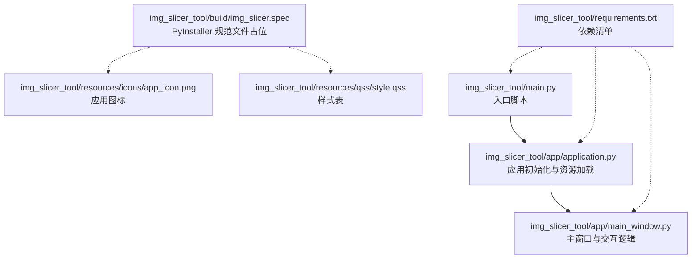
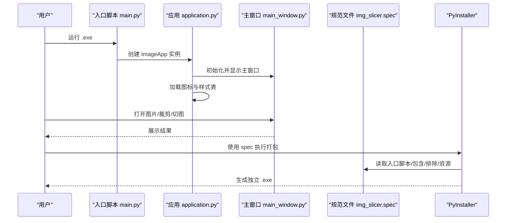
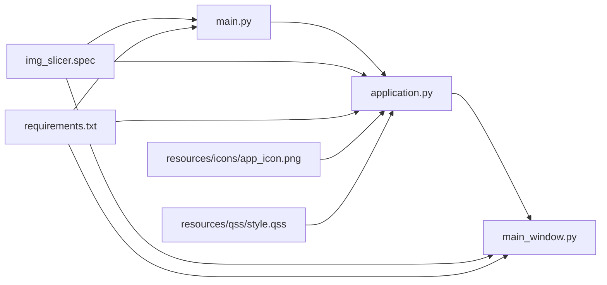

# 打包与分发

<cite>
**本文引用的文件**
- [img_slicer_tool/main.py](file://img_slicer_tool/main.py)
- [img_slicer_tool/app/application.py](file://img_slicer_tool/app/application.py)
- [img_slicer_tool/app/main_window.py](file://img_slicer_tool/app/main_window.py)
- [img_slicer_tool/build/img_slicer.spec](file://img_slicer_tool/build/img_slicer.spec)
- [img_slicer_tool/requirements.txt](file://img_slicer_tool/requirements.txt)
- [img_slicer_tool/resources/icons/app_icon.png](file://img_slicer_tool/resources/icons/app_icon.png)
- [img_slicer_tool/resources/qss/style.qss](file://img_slicer_tool/resources/qss/style.qss)
- [task/projectstart_task_card.md](file://task/projectstart_task_card.md)
</cite>

## 目录
1. [简介](#简介)
2. [项目结构](#项目结构)
3. [核心组件](#核心组件)
4. [架构总览](#架构总览)
5. [详细组件分析](#详细组件分析)
6. [依赖关系分析](#依赖关系分析)
7. [性能考虑](#性能考虑)
8. [故障排查指南](#故障排查指南)
9. [结论](#结论)
10. [附录](#附录)

## 简介
本指南面向使用 PyInstaller 将 Python 源码打包为独立可执行文件（.exe）的场景，结合本仓库的 img_slicer_tool 项目，系统讲解打包流程、img_slicer.spec 配置文件的关键项（入口脚本、依赖包含、图标设置、资源嵌入等），并提供常见问题的解决方案与分发建议。同时强调 requirements.txt 在构建干净虚拟环境中的作用，并建议在分发时附带必要的运行时依赖说明。

## 项目结构
img_slicer_tool 采用“功能模块化 + 资源分离”的组织方式：
- 入口脚本位于项目根目录，负责创建并运行应用。
- 应用主体由 application.py 和 main_window.py 组成，前者负责初始化 QApplication、图标与样式，后者承载主界面与交互逻辑。
- build 目录预留 img_slicer.spec 作为 PyInstaller 规范文件占位，后续由 PyInstaller 自动生成或补充。
- resources 目录存放图标与样式资源，便于打包时统一嵌入。
- requirements.txt 明确列出 GUI、图像处理、打包与日志等依赖，便于在干净环境中安装。

图表来源
- [img_slicer_tool/main.py](file://img_slicer_tool/main.py#L1-L13)
- [img_slicer_tool/app/application.py](file://img_slicer_tool/app/application.py#L1-L35)
- [img_slicer_tool/app/main_window.py](file://img_slicer_tool/app/main_window.py#L1-L262)
- [img_slicer_tool/build/img_slicer.spec](file://img_slicer_tool/build/img_slicer.spec#L1-L2)
- [img_slicer_tool/resources/icons/app_icon.png](file://img_slicer_tool/resources/icons/app_icon.png)
- [img_slicer_tool/resources/qss/style.qss](file://img_slicer_tool/resources/qss/style.qss)
- [img_slicer_tool/requirements.txt](file://img_slicer_tool/requirements.txt#L1-L14)

章节来源
- [img_slicer_tool/main.py](file://img_slicer_tool/main.py#L1-L13)
- [img_slicer_tool/app/application.py](file://img_slicer_tool/app/application.py#L1-L35)
- [img_slicer_tool/app/main_window.py](file://img_slicer_tool/app/main_window.py#L1-L262)
- [img_slicer_tool/build/img_slicer.spec](file://img_slicer_tool/build/img_slicer.spec#L1-L2)
- [img_slicer_tool/resources/icons/app_icon.png](file://img_slicer_tool/resources/icons/app_icon.png)
- [img_slicer_tool/resources/qss/style.qss](file://img_slicer_tool/resources/qss/style.qss)
- [img_slicer_tool/requirements.txt](file://img_slicer_tool/requirements.txt#L1-L14)

## 核心组件
- 入口脚本 main.py：定义程序入口函数，创建 ImageApp 并运行，随后退出码传递给系统。
- 应用层 application.py：初始化 QApplication，设置应用名与组织名，尝试加载图标与样式表；随后展示主窗口并进入事件循环。
- 主窗口 main_window.py：构建菜单与动作，连接信号槽，处理图片打开、裁剪、切图等业务逻辑。
- 资源层 resources：包含图标与样式表，打包时需通过 spec 文件显式包含，确保运行时可用。
- 规范文件 build/img_slicer.spec：占位文件，后续由 PyInstaller 生成或补充，用于声明入口脚本、包含/排除依赖、资源嵌入、图标与版本信息等。
- 依赖清单 requirements.txt：集中管理 GUI、图像处理、打包与日志等依赖，便于在干净虚拟环境中安装。

章节来源
- [img_slicer_tool/main.py](file://img_slicer_tool/main.py#L1-L13)
- [img_slicer_tool/app/application.py](file://img_slicer_tool/app/application.py#L1-L35)
- [img_slicer_tool/app/main_window.py](file://img_slicer_tool/app/main_window.py#L1-L262)
- [img_slicer_tool/build/img_slicer.spec](file://img_slicer_tool/build/img_slicer.spec#L1-L2)
- [img_slicer_tool/resources/icons/app_icon.png](file://img_slicer_tool/resources/icons/app_icon.png)
- [img_slicer_tool/resources/qss/style.qss](file://img_slicer_tool/resources/qss/style.qss)
- [img_slicer_tool/requirements.txt](file://img_slicer_tool/requirements.txt#L1-L14)

## 架构总览
下图展示了从入口到打包产物的关键流程：入口脚本创建应用实例，应用初始化并加载资源，最终生成独立可执行文件。

图表来源
- [img_slicer_tool/main.py](file://img_slicer_tool/main.py#L1-L13)
- [img_slicer_tool/app/application.py](file://img_slicer_tool/app/application.py#L1-L35)
- [img_slicer_tool/app/main_window.py](file://img_slicer_tool/app/main_window.py#L1-L262)
- [img_slicer_tool/build/img_slicer.spec](file://img_slicer_tool/build/img_slicer.spec#L1-L2)

## 详细组件分析

### 入口脚本 main.py
- 作用：作为程序入口，创建 ImageApp 并运行，将退出码传递给系统。
- 关键点：入口函数与 __main__ 分离，便于测试与打包。

章节来源
- [img_slicer_tool/main.py](file://img_slicer_tool/main.py#L1-L13)

### 应用层 application.py
- 作用：初始化 QApplication，设置应用名与组织名；尝试加载图标与样式表；展示主窗口并进入事件循环。
- 资源加载策略：通过相对路径定位 resources/icons 与 resources/qss 下的资源；若资源不存在则不报错，保证运行时容错性。
- 图标与样式：图标路径与样式表路径均采用相对路径拼接，打包时需通过 spec 显式包含，避免运行时找不到资源。

章节来源
- [img_slicer_tool/app/application.py](file://img_slicer_tool/app/application.py#L1-L35)

### 主窗口 main_window.py
- 作用：构建菜单与动作，连接信号槽，处理图片打开、裁剪、切图等业务逻辑。
- 用户交互：支持打开图片、设置切图输出目录、生成宫格线、执行切图等。
- 错误处理：对异常进行捕获并弹窗提示，提升用户体验。

章节来源
- [img_slicer_tool/app/main_window.py](file://img_slicer_tool/app/main_window.py#L1-L262)

### 规范文件 build/img_slicer.spec
- 当前状态：占位文件，后续由 PyInstaller 生成或补充。
- 建议配置项（基于项目现状与打包最佳实践）：
  - 入口脚本：指向 main.py，确保 PyInstaller 能正确识别程序入口。
  - 依赖包含：显式包含 PySide6、Pillow、pyvips、numpy、loguru 等依赖，避免遗漏。
  - 资源嵌入：将 resources/icons 与 resources/qss 目录作为数据文件包含，确保运行时可访问。
  - 图标设置：将 app_icon.png 设为可执行文件图标，提升辨识度。
  - 版本信息：可设置产品名称、版本号、公司名等，便于分发与管理。
  - 排除项：根据需要排除大型第三方库或开发工具，减小体积。
  - 生成器参数：可启用 --onefile 生成单文件可执行文件，或保持目录形式以便调试。

章节来源
- [img_slicer_tool/build/img_slicer.spec](file://img_slicer_tool/build/img_slicer.spec#L1-L2)
- [img_slicer_tool/requirements.txt](file://img_slicer_tool/requirements.txt#L1-L14)

### 依赖清单 requirements.txt
- 作用：集中管理 GUI、图像处理、打包与日志等依赖，便于在干净虚拟环境中安装。
- 建议：在构建前使用 requirements.txt 创建隔离的虚拟环境并安装依赖，确保打包环境与运行环境一致。

章节来源
- [img_slicer_tool/requirements.txt](file://img_slicer_tool/requirements.txt#L1-L14)

### 资源文件
- 图标：resources/icons/app_icon.png，用于设置应用图标。
- 样式：resources/qss/style.qss，用于加载样式表。
- 注意：打包时需通过 spec 将上述资源显式包含，否则运行时可能找不到资源导致异常。

章节来源
- [img_slicer_tool/resources/icons/app_icon.png](file://img_slicer_tool/resources/icons/app_icon.png)
- [img_slicer_tool/resources/qss/style.qss](file://img_slicer_tool/resources/qss/style.qss)

## 依赖关系分析
- 入口脚本依赖应用层；应用层依赖主窗口；应用层与主窗口共同依赖资源层。
- 规范文件与依赖清单分别影响打包阶段与运行阶段的依赖解析。
- 资源文件的包含与否直接影响运行时行为。

图表来源
- [img_slicer_tool/main.py](file://img_slicer_tool/main.py#L1-L13)
- [img_slicer_tool/app/application.py](file://img_slicer_tool/app/application.py#L1-L35)
- [img_slicer_tool/app/main_window.py](file://img_slicer_tool/app/main_window.py#L1-L262)
- [img_slicer_tool/build/img_slicer.spec](file://img_slicer_tool/build/img_slicer.spec#L1-L2)
- [img_slicer_tool/requirements.txt](file://img_slicer_tool/requirements.txt#L1-L14)
- [img_slicer_tool/resources/icons/app_icon.png](file://img_slicer_tool/resources/icons/app_icon.png)
- [img_slicer_tool/resources/qss/style.qss](file://img_slicer_tool/resources/qss/style.qss)

## 性能考虑
- 体积控制：通过排除不必要的第三方库、合并资源、使用单文件模式（可选）等方式控制体积。
- 启动速度：减少启动时的资源加载与初始化工作量，避免在入口处做重任务。
- 运行时依赖：确保分发时附带必要的运行时依赖说明，避免目标机器缺少必要组件导致启动失败。

## 故障排查指南
- 缺失 DLL 或运行时依赖
  - 症状：启动时报错或黑屏。
  - 处理：检查 requirements.txt 中的依赖是否完整安装；在目标机器上安装对应运行时（如 Visual C++ 运行库）；使用 spec 的隐藏导入与包含项确保所有依赖被正确打包。
  - 参考来源
    - [img_slicer_tool/requirements.txt](file://img_slicer_tool/requirements.txt#L1-L14)
- 启动黑屏或无界面
  - 症状：可执行文件启动但无窗口。
  - 处理：确认入口脚本 main.py 正确创建并显示主窗口；检查 application.py 是否成功加载图标与样式；在 spec 中显式包含资源目录；验证运行时路径与权限。
  - 参考来源
    - [img_slicer_tool/main.py](file://img_slicer_tool/main.py#L1-L13)
    - [img_slicer_tool/app/application.py](file://img_slicer_tool/app/application.py#L1-L35)
    - [img_slicer_tool/app/main_window.py](file://img_slicer_tool/app/main_window.py#L1-L262)
- 资源文件缺失
  - 症状：图标不显示、样式不生效。
  - 处理：在 spec 中将 resources/icons 与 resources/qss 目录作为数据文件包含；确保打包时资源路径与运行时路径一致。
  - 参考来源
    - [img_slicer_tool/resources/icons/app_icon.png](file://img_slicer_tool/resources/icons/app_icon.png)
    - [img_slicer_tool/resources/qss/style.qss](file://img_slicer_tool/resources/qss/style.qss)
- 切图或裁剪功能异常
  - 症状：切图/裁剪失败或报错。
  - 处理：检查 Pillow、pyvips、numpy 的版本兼容性；在 spec 中包含相关动态库；在目标机器上验证依赖完整性。
  - 参考来源
    - [img_slicer_tool/requirements.txt](file://img_slicer_tool/requirements.txt#L1-L14)

## 结论
通过明确入口脚本、应用层与主窗口的职责，配合规范的资源包含与依赖管理，可以稳定地使用 PyInstaller 将 Python 源码打包为独立可执行文件。建议在构建前使用 requirements.txt 创建干净虚拟环境，确保打包与运行环境一致；在分发时附带运行时依赖说明，降低目标机器的部署难度。

## 附录
- 打包命令示例（基于本项目结构）
  - 生成规范文件：使用 PyInstaller 生成占位的 img_slicer.spec，然后根据需要补充入口脚本、包含/排除项、资源嵌入与图标设置。
  - 执行打包：使用生成的 spec 文件执行打包，生成独立可执行文件。
  - 参考来源
    - [img_slicer_tool/build/img_slicer.spec](file://img_slicer_tool/build/img_slicer.spec#L1-L2)
    - [task/projectstart_task_card.md](file://task/projectstart_task_card.md#L29-L135)