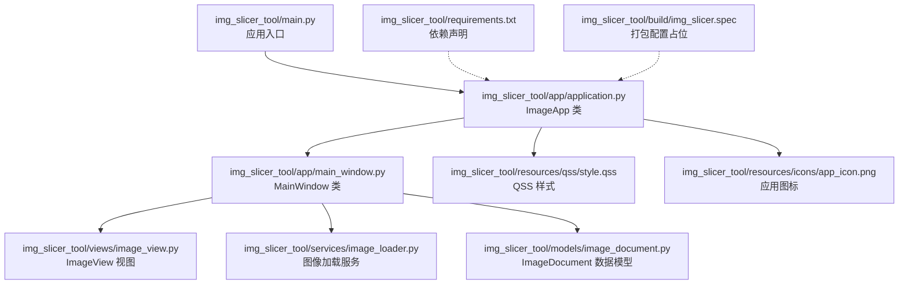
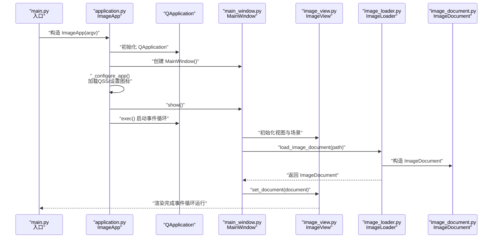
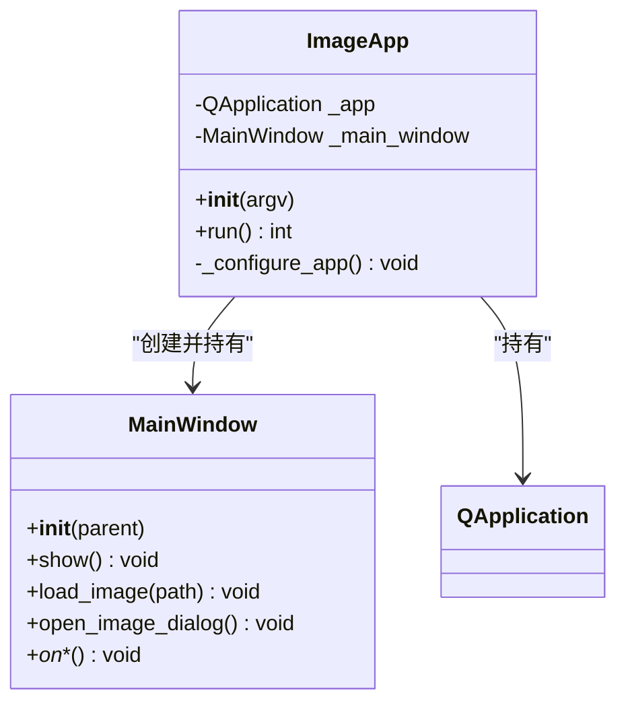
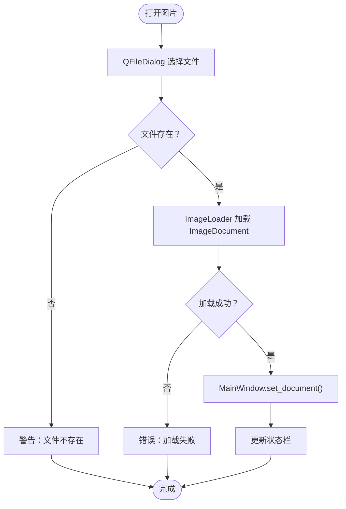
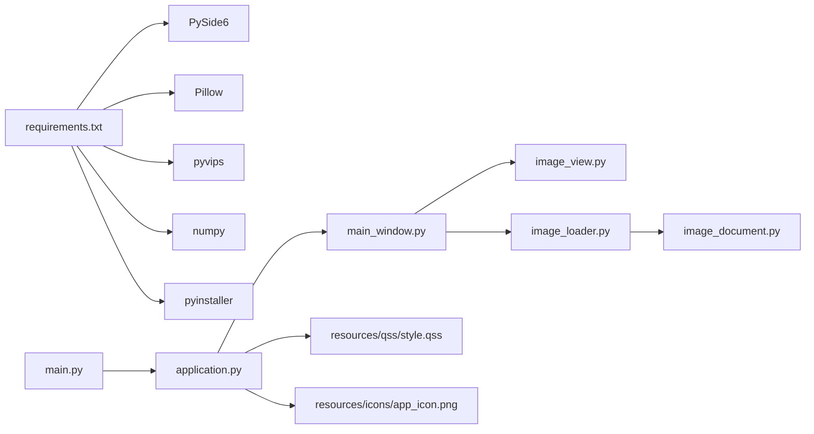

# 主应用流程

<cite>
**本文引用的文件列表**
- [main.py](file://img_slicer_tool/main.py)
- [application.py](file://img_slicer_tool/app/application.py)
- [main_window.py](file://img_slicer_tool/app/main_window.py)
- [image_view.py](file://img_slicer_tool/views/image_view.py)
- [image_loader.py](file://img_slicer_tool/services/image_loader.py)
- [image_document.py](file://img_slicer_tool/models/image_document.py)
- [style.qss](file://img_slicer_tool/resources/qss/style.qss)
- [requirements.txt](file://img_slicer_tool/requirements.txt)
- [img_slicer.spec](file://img_slicer_tool/build/img_slicer.spec)
</cite>

## 目录
1. [简介](#简介)
2. [项目结构](#项目结构)
3. [核心组件](#核心组件)
4. [架构总览](#架构总览)
5. [详细组件分析](#详细组件分析)
6. [依赖关系分析](#依赖关系分析)
7. [性能考量](#性能考量)
8. [故障排查指南](#故障排查指南)
9. [结论](#结论)
10. [附录](#附录)

## 简介
本技术文档聚焦 PictureMaster 的主应用流程，围绕 ImageApp 类作为程序入口点，阐述其如何初始化 QApplication 并创建 MainWindow 实例；解析 application.py 中 _configure_app 方法如何加载 QSS 样式表与设置应用图标；说明 run() 方法如何启动主事件循环。结合 main.py 的调用逻辑，完整梳理应用启动生命周期，包括命令行参数处理、资源初始化顺序与异常处理机制。最后通过流程图展示从 main() 函数到 GUI 渲染完成的执行路径，并给出扩展建议以支持多窗口或插件系统。

## 项目结构
项目采用“功能模块化 + 分层组织”的结构：
- 应用入口位于 img_slicer_tool/main.py，负责启动 ImageApp。
- 应用核心位于 img_slicer_tool/app/application.py，封装 QApplication 初始化、样式与图标配置、主窗口创建与事件循环启动。
- 主窗口位于 img_slicer_tool/app/main_window.py，承载菜单、动作、状态栏与业务交互。
- 视图层位于 img_slicer_tool/views/image_view.py，基于 QGraphicsView 展示图像与交互。
- 服务层位于 img_slicer_tool/services/*，包含图像加载、切图、裁剪等业务服务。
- 模型层位于 img_slicer_tool/models/*，定义数据结构（如 ImageDocument）。
- 资源位于 img_slicer_tool/resources，包含 QSS 样式与图标等静态资源。
- 构建配置位于 img_slicer_tool/build/img_slicer.spec，用于打包分发。

图表来源
- [main.py](file://img_slicer_tool/main.py#L1-L13)
- [application.py](file://img_slicer_tool/app/application.py#L1-L35)
- [main_window.py](file://img_slicer_tool/app/main_window.py#L1-L262)
- [image_view.py](file://img_slicer_tool/views/image_view.py#L1-L218)
- [image_loader.py](file://img_slicer_tool/services/image_loader.py#L1-L68)
- [image_document.py](file://img_slicer_tool/models/image_document.py#L1-L18)
- [style.qss](file://img_slicer_tool/resources/qss/style.qss#L1-L2)
- [requirements.txt](file://img_slicer_tool/requirements.txt#L1-L14)
- [img_slicer.spec](file://img_slicer_tool/build/img_slicer.spec#L1-L2)

章节来源
- [main.py](file://img_slicer_tool/main.py#L1-L13)
- [application.py](file://img_slicer_tool/app/application.py#L1-L35)
- [main_window.py](file://img_slicer_tool/app/main_window.py#L1-L262)
- [image_view.py](file://img_slicer_tool/views/image_view.py#L1-L218)
- [image_loader.py](file://img_slicer_tool/services/image_loader.py#L1-L68)
- [image_document.py](file://img_slicer_tool/models/image_document.py#L1-L18)
- [style.qss](file://img_slicer_tool/resources/qss/style.qss#L1-L2)
- [requirements.txt](file://img_slicer_tool/requirements.txt#L1-L14)
- [img_slicer.spec](file://img_slicer_tool/build/img_slicer.spec#L1-L2)

## 核心组件
- ImageApp：应用入口与生命周期管理器，负责初始化 QApplication、创建 MainWindow、加载样式与图标、启动事件循环。
- MainWindow：主窗口，负责菜单、动作、状态栏、用户交互与业务流程编排。
- ImageView：图形视图，承载图像预览、缩放、拖拽、裁剪框绘制与切图线叠加。
- ImageLoader：图像加载与预览图生成服务。
- ImageDocument：图像文档数据模型，封装原图尺寸、预览尺寸、缩放比例与预览图。
- QSS 样式与图标：通过 _configure_app 加载样式与设置窗口图标。

章节来源
- [application.py](file://img_slicer_tool/app/application.py#L1-L35)
- [main_window.py](file://img_slicer_tool/app/main_window.py#L1-L262)
- [image_view.py](file://img_slicer_tool/views/image_view.py#L1-L218)
- [image_loader.py](file://img_slicer_tool/services/image_loader.py#L1-L68)
- [image_document.py](file://img_slicer_tool/models/image_document.py#L1-L18)
- [style.qss](file://img_slicer_tool/resources/qss/style.qss#L1-L2)

## 架构总览
下图展示了从 main() 到 GUI 渲染完成的端到端执行路径，包括命令行参数传递、应用初始化、样式与图标加载、主窗口创建与显示、事件循环启动以及渲染完成信号。

图表来源
- [main.py](file://img_slicer_tool/main.py#L1-L13)
- [application.py](file://img_slicer_tool/app/application.py#L1-L35)
- [main_window.py](file://img_slicer_tool/app/main_window.py#L1-L262)
- [image_view.py](file://img_slicer_tool/views/image_view.py#L1-L218)
- [image_loader.py](file://img_slicer_tool/services/image_loader.py#L1-L68)
- [image_document.py](file://img_slicer_tool/models/image_document.py#L1-L18)

## 详细组件分析

### ImageApp 类与应用生命周期
- 入口构造：main() 调用 ImageApp(sys.argv)，将命令行参数传入。
- 初始化阶段：ImageApp.__init__ 创建 QApplication 实例，构造 MainWindow，并立即调用 _configure_app。
- 配置阶段：_configure_app 设置应用名称与组织名，尝试从资源目录加载图标与 QSS 文件，若资源存在则应用样式与图标。
- 运行阶段：run() 显示主窗口并启动 QApplication 的事件循环，返回值用于进程退出码。

图表来源
- [application.py](file://img_slicer_tool/app/application.py#L1-L35)
- [main_window.py](file://img_slicer_tool/app/main_window.py#L1-L262)

章节来源
- [main.py](file://img_slicer_tool/main.py#L1-L13)
- [application.py](file://img_slicer_tool/app/application.py#L1-L35)

### _configure_app 方法：样式与图标加载
- 应用名称与组织名设置：提升应用元数据可识别性。
- 图标加载：从资源目录定位图标文件，若存在则设置为窗口图标。
- 样式加载：从资源目录定位 QSS 文件，若存在则读取内容并设置为应用样式表。
- 资源路径策略：使用相对路径拼接，确保在不同工作目录下仍能正确加载资源。

章节来源
- [application.py](file://img_slicer_tool/app/application.py#L1-L35)
- [style.qss](file://img_slicer_tool/resources/qss/style.qss#L1-L2)

### run() 方法：事件循环与窗口显示
- 显示主窗口：调用 MainWindow.show() 将界面可见。
- 启动事件循环：调用 QApplication.exec() 进入事件驱动循环，等待用户交互与系统事件。
- 退出码：返回值用于 sys.exit()，保证进程退出码语义清晰。

章节来源
- [application.py](file://img_slicer_tool/app/application.py#L1-L35)

### MainWindow：菜单、动作与业务流程
- 组件初始化：设置标题、大小，创建 ImageView 作为中央部件，维护当前文档与切图输出根目录。
- 动作与菜单：定义打开图片、退出、切图模式切换、生成宫格线、执行切图、设置切图保存路径等动作与菜单项。
- 信号连接：将动作触发与视图裁剪请求绑定到对应处理函数。
- 图像加载：通过 QFileDialog 打开图片，调用 ImageLoader 加载 ImageDocument，并更新状态栏与视图。
- 裁剪流程：接收裁剪请求，弹窗确认，根据选择覆盖原图或另存为，调用裁剪服务并刷新视图。
- 切图流程：收集切图线，生成布局，调用切图服务导出切片，提示结果并更新状态栏。

图表来源
- [main_window.py](file://img_slicer_tool/app/main_window.py#L1-L262)
- [image_loader.py](file://img_slicer_tool/services/image_loader.py#L1-L68)

章节来源
- [main_window.py](file://img_slicer_tool/app/main_window.py#L1-L262)

### ImageView：交互与渲染
- 场景与视图：初始化 QGraphicsScene，将预览图作为场景项，设置视图渲染提示与缩放锚点。
- 缩放与平移：支持 Ctrl+滚轮缩放，空格键拖拽平移。
- 裁剪模式：鼠标拖拽绘制裁剪框，释放时发出裁剪请求信号。
- 切图模式：根据修饰键生成水平或垂直切图线，支持删除切图线。
- 切图布局提取：遍历场景中的切图线，归一化为 SliceLayout。

章节来源
- [image_view.py](file://img_slicer_tool/views/image_view.py#L1-L218)

### ImageLoader 与 ImageDocument：数据模型
- 预览尺寸计算：根据最大预览尺寸阈值计算预览宽高与缩放比。
- 图像转换：将 PIL 图像转换为 QImage 再转为 QPixmap，适配不同像素格式。
- 数据封装：ImageDocument 记录路径、原图与预览尺寸、缩放比与预览图。

章节来源
- [image_loader.py](file://img_slicer_tool/services/image_loader.py#L1-L68)
- [image_document.py](file://img_slicer_tool/models/image_document.py#L1-L18)

## 依赖关系分析
- 外部依赖：PySide6 提供 GUI 与事件循环；Pillow 用于图像解码与转换；pyvips、numpy 用于高性能图像处理；pyinstaller 用于打包。
- 内部耦合：main.py 仅依赖 application.py；application.py 依赖 main_window.py；main_window.py 依赖 views、services、models；views 依赖 models；services 依赖 models。

图表来源
- [requirements.txt](file://img_slicer_tool/requirements.txt#L1-L14)
- [main.py](file://img_slicer_tool/main.py#L1-L13)
- [application.py](file://img_slicer_tool/app/application.py#L1-L35)
- [main_window.py](file://img_slicer_tool/app/main_window.py#L1-L262)
- [image_view.py](file://img_slicer_tool/views/image_view.py#L1-L218)
- [image_loader.py](file://img_slicer_tool/services/image_loader.py#L1-L68)
- [image_document.py](file://img_slicer_tool/models/image_document.py#L1-L18)
- [style.qss](file://img_slicer_tool/resources/qss/style.qss#L1-L2)

章节来源
- [requirements.txt](file://img_slicer_tool/requirements.txt#L1-L14)
- [main.py](file://img_slicer_tool/main.py#L1-L13)
- [application.py](file://img_slicer_tool/app/application.py#L1-L35)

## 性能考量
- 预览图优化：通过预览尺寸阈值与 Lanczos 插值减少内存占用与渲染压力。
- 事件循环：QApplication.exec() 在主线程阻塞运行，避免额外线程开销；复杂任务建议异步或后台线程处理。
- 视图更新：批量操作（如添加多条切图线）应尽量减少场景重绘次数，必要时使用视图更新模式优化。
- 资源加载：QSS 与图标采用一次性加载，避免频繁 IO；可在应用启动时缓存样式字符串以降低重复读取成本。

## 故障排查指南
- 应用图标缺失：检查资源路径与文件是否存在；确认 _configure_app 中的图标路径拼接逻辑。
- 样式表未生效：确认 QSS 文件存在且编码正确；检查 _configure_app 是否成功读取并设置样式。
- 图像加载失败：查看 ImageLoader 抛出的异常类型与消息；确认文件路径与权限。
- 事件循环无响应：检查是否在主线程执行耗时操作；避免在事件回调中进行长时间阻塞。
- 打包问题：确认构建配置占位文件已由打包工具生成；核对依赖清单与入口脚本。

章节来源
- [application.py](file://img_slicer_tool/app/application.py#L1-L35)
- [main_window.py](file://img_slicer_tool/app/main_window.py#L1-L262)
- [image_loader.py](file://img_slicer_tool/services/image_loader.py#L1-L68)
- [img_slicer.spec](file://img_slicer_tool/build/img_slicer.spec#L1-L2)

## 结论
本项目以简洁清晰的入口与职责分离实现了完整的主应用流程：main() 仅负责启动，ImageApp 负责应用级初始化与事件循环，MainWindow 负责业务交互与视图编排。通过 _configure_app 统一加载样式与图标，配合服务层与模型层，形成稳定的启动与运行闭环。未来可在此基础上扩展多窗口与插件系统，以满足更复杂的业务需求。

## 附录

### 启动生命周期与命令行参数处理
- 命令行参数：main() 将 sys.argv 传入 ImageApp，便于后续扩展命令行开关或日志级别。
- 初始化顺序：QApplication → MainWindow → _configure_app → show → exec。
- 异常处理：MainWindow 在加载与操作过程中捕获异常并提示用户，避免崩溃；ImageApp 返回退出码交由系统处理。

章节来源
- [main.py](file://img_slicer_tool/main.py#L1-L13)
- [application.py](file://img_slicer_tool/app/application.py#L1-L35)
- [main_window.py](file://img_slicer_tool/app/main_window.py#L1-L262)

### 扩展建议：多窗口与插件系统
- 多窗口支持：在 ImageApp 中维护窗口集合，提供工厂方法创建新窗口实例；在 MainWindow 中引入窗口管理器以协调状态与资源共享。
- 插件系统：定义插件接口与注册机制，允许动态加载业务模块（如新的切图算法、导出格式），通过配置文件或命令行启用/禁用。
- 资源与样式：将样式与图标抽象为可插拔资源包，支持主题切换与动态加载。
- 依赖与打包：保持 requirements 清晰，使用构建配置统一打包；为插件预留独立模块与资源目录。