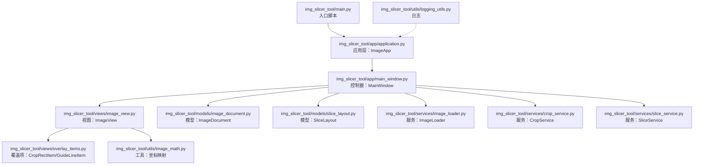
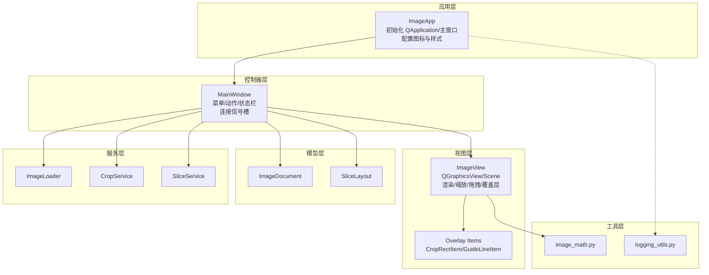
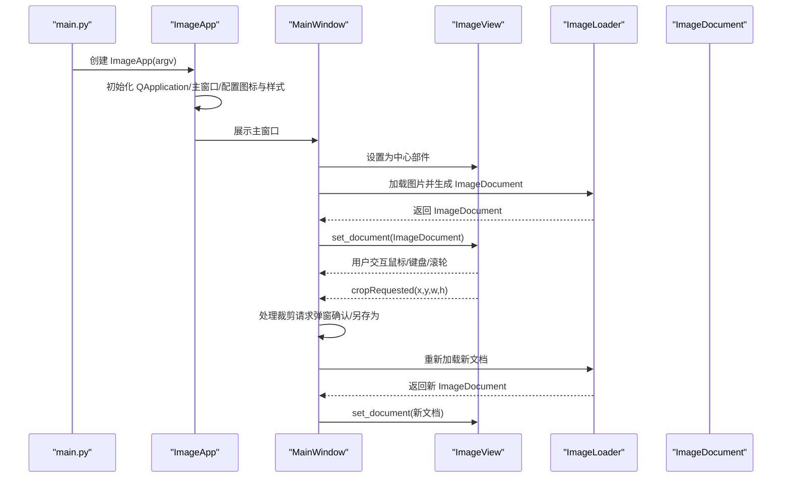
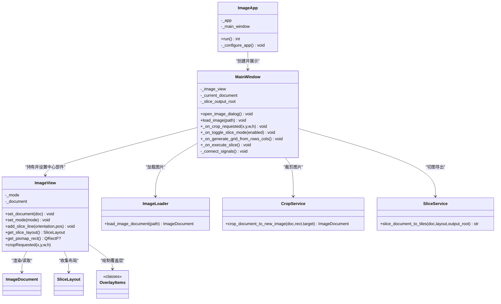
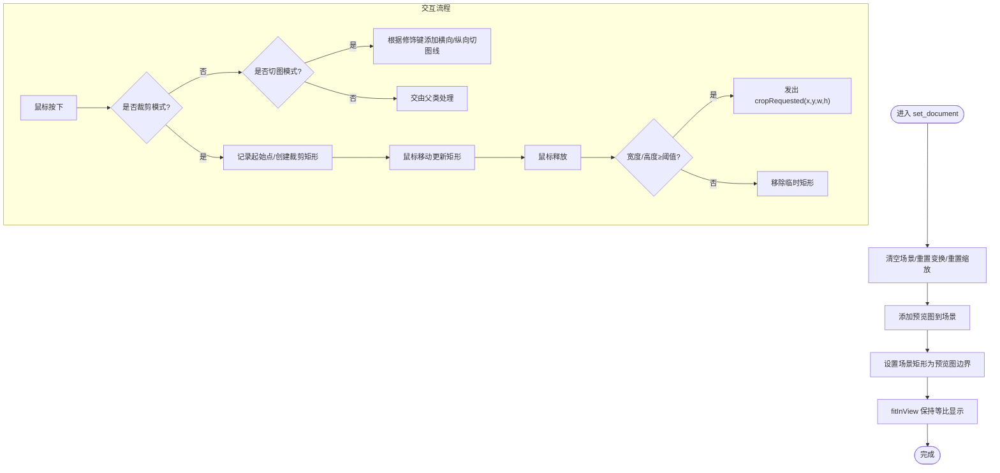
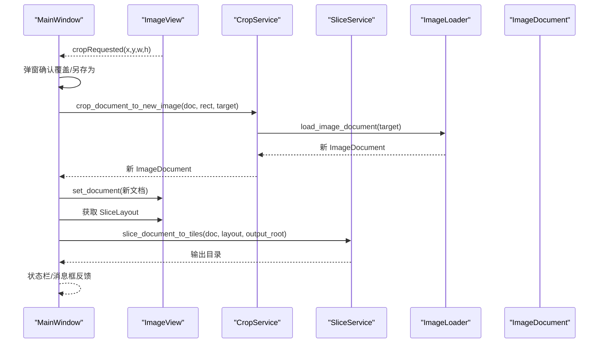
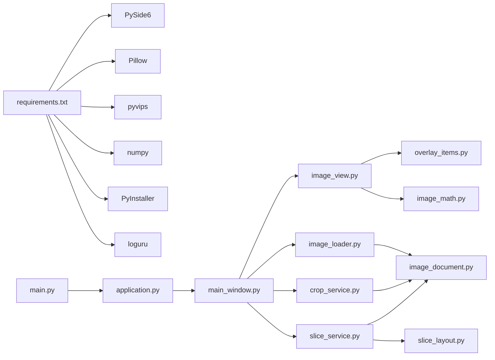

# 技术架构设计

<cite>
**本文引用的文件**
- [main.py](file://img_slicer_tool/main.py)
- [application.py](file://img_slicer_tool/app/application.py)
- [main_window.py](file://img_slicer_tool/app/main_window.py)
- [image_view.py](file://img_slicer_tool/views/image_view.py)
- [overlay_items.py](file://img_slicer_tool/views/overlay_items.py)
- [image_document.py](file://img_slicer_tool/models/image_document.py)
- [slice_layout.py](file://img_slicer_tool/models/slice_layout.py)
- [image_loader.py](file://img_slicer_tool/services/image_loader.py)
- [crop_service.py](file://img_slicer_tool/services/crop_service.py)
- [slice_service.py](file://img_slicer_tool/services/slice_service.py)
- [image_math.py](file://img_slicer_tool/utils/image_math.py)
- [logging_utils.py](file://img_slicer_tool/utils/logging_utils.py)
- [requirements.txt](file://img_slicer_tool/requirements.txt)
- [README.md](file://img_slicer_tool/README.md)
</cite>

## 目录
1. [引言](#引言)
2. [项目结构](#项目结构)
3. [核心组件](#核心组件)
4. [架构总览](#架构总览)
5. [详细组件分析](#详细组件分析)
6. [依赖关系分析](#依赖关系分析)
7. [性能考量](#性能考量)
8. [故障排查指南](#故障排查指南)
9. [结论](#结论)
10. [附录](#附录)

## 引言
本技术文档聚焦 PictureMaster（Img Slicer Tool）的架构设计，系统性阐述其如何在 PySide6 图形界面框架下实现 MVC 设计模式，并通过 Qt 信号槽机制实现模块间松耦合协作。文档从主进程入口开始，逐步解析 Application 初始化流程、MainWindow 控制器如何协调 Models（ImageDocument、SliceLayout）、Views（ImageView）与 Services（CropService、SliceService、ImageLoader）之间的数据流与控制流；同时深入说明 QGraphicsView 在图像渲染与图层叠加中的核心作用，以及模块间通过构造函数注入依赖的解耦策略。最后提供组件关系图与序列图，帮助开发者快速理解系统整体结构与扩展方式。

## 项目结构
项目采用按功能域分层的组织方式：入口脚本负责启动应用；应用层负责初始化 GUI 应用与主窗口；主窗口承担控制器职责，连接菜单与动作；视图层使用 QGraphicsView 承载图像与覆盖层；模型层封装数据结构；服务层提供业务逻辑；工具层提供数学映射与日志等辅助能力。

图表来源
- [main.py](file://img_slicer_tool/main.py#L1-L13)
- [application.py](file://img_slicer_tool/app/application.py#L1-L35)
- [main_window.py](file://img_slicer_tool/app/main_window.py#L1-L262)
- [image_view.py](file://img_slicer_tool/views/image_view.py#L1-L218)
- [overlay_items.py](file://img_slicer_tool/views/overlay_items.py#L1-L57)
- [image_document.py](file://img_slicer_tool/models/image_document.py#L1-L18)
- [slice_layout.py](file://img_slicer_tool/models/slice_layout.py#L1-L30)
- [image_loader.py](file://img_slicer_tool/services/image_loader.py#L1-L68)
- [crop_service.py](file://img_slicer_tool/services/crop_service.py#L1-L38)
- [slice_service.py](file://img_slicer_tool/services/slice_service.py#L1-L62)
- [image_math.py](file://img_slicer_tool/utils/image_math.py#L1-L76)
- [logging_utils.py](file://img_slicer_tool/utils/logging_utils.py#L1-L6)

章节来源
- [main.py](file://img_slicer_tool/main.py#L1-L13)
- [application.py](file://img_slicer_tool/app/application.py#L1-L35)
- [README.md](file://img_slicer_tool/README.md#L1-L10)

## 核心组件
- 入口与应用层
  - main.py：程序入口，创建并运行 ImageApp。
  - application.py：封装 QApplication 实例、主窗口实例、应用图标与样式表配置，并负责启动事件循环。
- 控制器层
  - main_window.py：继承自 QMainWindow，负责菜单、动作、状态栏、对话框与消息框；协调视图与服务；通过信号槽连接用户交互与业务逻辑。
- 视图层
  - image_view.py：继承自 QGraphicsView，承载 QGraphicsScene，负责图像渲染、缩放、平移、裁剪矩形绘制、切图线绘制与交互；通过信号向外发出裁剪请求。
  - overlay_items.py：覆盖层图形项，包括可拖拽可选中的红色虚线切图线与半透明裁剪矩形。
- 模型层
  - image_document.py：数据类，封装图片路径、原始尺寸、预览尺寸、缩放比例与预览 QPixmap。
  - slice_layout.py：数据类，保存预览坐标系下的水平/垂直切图线集合，并提供归一化与边界生成方法。
- 服务层
  - image_loader.py：加载图片，计算预览尺寸与缩放比，生成 ImageDocument。
  - crop_service.py：根据预览矩形与目标路径执行裁剪，返回新 ImageDocument。
  - slice_service.py：根据切图布局与输出目录生成宫格切片并返回输出目录。
- 工具层
  - image_math.py：提供预览坐标到原图坐标的映射函数，确保裁剪与切图的像素级精度。
  - logging_utils.py：配置日志输出。

章节来源
- [main.py](file://img_slicer_tool/main.py#L1-L13)
- [application.py](file://img_slicer_tool/app/application.py#L1-L35)
- [main_window.py](file://img_slicer_tool/app/main_window.py#L1-L262)
- [image_view.py](file://img_slicer_tool/views/image_view.py#L1-L218)
- [overlay_items.py](file://img_slicer_tool/views/overlay_items.py#L1-L57)
- [image_document.py](file://img_slicer_tool/models/image_document.py#L1-L18)
- [slice_layout.py](file://img_slicer_tool/models/slice_layout.py#L1-L30)
- [image_loader.py](file://img_slicer_tool/services/image_loader.py#L1-L68)
- [crop_service.py](file://img_slicer_tool/services/crop_service.py#L1-L38)
- [slice_service.py](file://img_slicer_tool/services/slice_service.py#L1-L62)
- [image_math.py](file://img_slicer_tool/utils/image_math.py#L1-L76)
- [logging_utils.py](file://img_slicer_tool/utils/logging_utils.py#L1-L6)

## 架构总览
本系统遵循 MVC 模式：
- Model：ImageDocument、SliceLayout 封装数据与业务规则。
- View：ImageView 使用 QGraphicsView/Scene 渲染图像与覆盖层，响应用户输入并发出信号。
- Controller：MainWindow 作为控制器，接收用户操作，调用服务层处理业务，更新视图与状态栏。

同时，系统广泛使用 Qt 信号槽机制实现解耦：
- View 通过信号向 Controller 发送裁剪请求。
- Controller 通过服务层执行业务逻辑，再将结果回传给 View 更新显示。
- 应用层负责全局资源（图标、样式）与事件循环。

图表来源
- [application.py](file://img_slicer_tool/app/application.py#L1-L35)
- [main_window.py](file://img_slicer_tool/app/main_window.py#L1-L262)
- [image_view.py](file://img_slicer_tool/views/image_view.py#L1-L218)
- [overlay_items.py](file://img_slicer_tool/views/overlay_items.py#L1-L57)
- [image_document.py](file://img_slicer_tool/models/image_document.py#L1-L18)
- [slice_layout.py](file://img_slicer_tool/models/slice_layout.py#L1-L30)
- [image_loader.py](file://img_slicer_tool/services/image_loader.py#L1-L68)
- [crop_service.py](file://img_slicer_tool/services/crop_service.py#L1-L38)
- [slice_service.py](file://img_slicer_tool/services/slice_service.py#L1-L62)
- [image_math.py](file://img_slicer_tool/utils/image_math.py#L1-L76)
- [logging_utils.py](file://img_slicer_tool/utils/logging_utils.py#L1-L6)

## 详细组件分析

### 组件关系与数据流（main.py → ImageApp → MainWindow → ImageView）
该路径体现了典型的 MVC 控制流：入口脚本创建应用对象，应用对象创建并显示主窗口，主窗口持有视图并协调模型与服务。

图表来源
- [main.py](file://img_slicer_tool/main.py#L1-L13)
- [application.py](file://img_slicer_tool/app/application.py#L1-L35)
- [main_window.py](file://img_slicer_tool/app/main_window.py#L1-L262)
- [image_view.py](file://img_slicer_tool/views/image_view.py#L1-L218)
- [image_loader.py](file://img_slicer_tool/services/image_loader.py#L1-L68)

章节来源
- [main.py](file://img_slicer_tool/main.py#L1-L13)
- [application.py](file://img_slicer_tool/app/application.py#L1-L35)
- [main_window.py](file://img_slicer_tool/app/main_window.py#L1-L262)
- [image_view.py](file://img_slicer_tool/views/image_view.py#L1-L218)
- [image_loader.py](file://img_slicer_tool/services/image_loader.py#L1-L68)

### MVC 与 Qt 信号槽结合的应用
- 控制器（MainWindow）通过 QAction 与菜单/快捷键建立用户意图入口，再通过信号槽连接到内部处理方法。
- 视图（ImageView）通过自定义信号（如裁剪请求）向外广播用户意图，避免控制器直接耦合底层图形交互细节。
- 服务层（ImageLoader/CropService/SliceService）专注于业务逻辑，不关心 UI 细节，通过纯函数与数据类进行解耦。

图表来源
- [application.py](file://img_slicer_tool/app/application.py#L1-L35)
- [main_window.py](file://img_slicer_tool/app/main_window.py#L1-L262)
- [image_view.py](file://img_slicer_tool/views/image_view.py#L1-L218)
- [overlay_items.py](file://img_slicer_tool/views/overlay_items.py#L1-L57)
- [image_document.py](file://img_slicer_tool/models/image_document.py#L1-L18)
- [slice_layout.py](file://img_slicer_tool/models/slice_layout.py#L1-L30)
- [image_loader.py](file://img_slicer_tool/services/image_loader.py#L1-L68)
- [crop_service.py](file://img_slicer_tool/services/crop_service.py#L1-L38)
- [slice_service.py](file://img_slicer_tool/services/slice_service.py#L1-L62)

章节来源
- [main_window.py](file://img_slicer_tool/app/main_window.py#L1-L262)
- [image_view.py](file://img_slicer_tool/views/image_view.py#L1-L218)
- [overlay_items.py](file://img_slicer_tool/views/overlay_items.py#L1-L57)

### QGraphicsView 在图像渲染与图层叠加中的核心作用
- 场景与视图分离：QGraphicsScene 负责管理所有图形项（图像、覆盖线、裁剪矩形），QGraphicsView 负责渲染与交互。
- 预览与缩放：ImageView 在 set_document 中清空场景、添加预览图、设置场景矩形并使用 fitInView 保持等比显示；通过滚轮与 Ctrl 键实现缩放。
- 平移与漫游：空格键切换为 ScrollHandDrag 模式，支持平移视图。
- 覆盖层绘制：通过 GuideLineItem 与 CropRectItem 实现可拖拽的红色虚线切图线与半透明裁剪矩形，二者均设置 Z 值以保证正确叠加顺序。
- 交互与信号：鼠标拖拽构建裁剪矩形，释放时若满足最小尺寸则发出 cropRequested 信号；Delete 键删除选中的切图线。

图表来源
- [image_view.py](file://img_slicer_tool/views/image_view.py#L1-L218)
- [overlay_items.py](file://img_slicer_tool/views/overlay_items.py#L1-L57)

章节来源
- [image_view.py](file://img_slicer_tool/views/image_view.py#L1-L218)
- [overlay_items.py](file://img_slicer_tool/views/overlay_items.py#L1-L57)

### 依赖注入与解耦设计
- 构造函数注入：MainWindow 在初始化时仅持有 ImageView，不直接依赖具体服务；服务通过函数调用注入，避免硬编码耦合。
- 数据驱动：ImageDocument 与 SliceLayout 作为纯数据载体，被 View 读取、被 Service 修改，形成清晰的数据边界。
- 信号解耦：View 通过信号对外广播用户意图，控制器统一处理，服务只关注业务执行，降低跨层耦合。

章节来源
- [main_window.py](file://img_slicer_tool/app/main_window.py#L1-L262)
- [image_view.py](file://img_slicer_tool/views/image_view.py#L1-L218)
- [image_document.py](file://img_slicer_tool/models/image_document.py#L1-L18)
- [slice_layout.py](file://img_slicer_tool/models/slice_layout.py#L1-L30)

### 关键业务流程：裁剪与切图
- 裁剪流程
  - 用户在 ImageView 上拖拽选择区域，释放后触发 cropRequested 信号。
  - MainWindow 弹窗确认覆盖原图或另存为，随后调用 CropService 执行裁剪，返回新 ImageDocument 并刷新视图。
- 切图流程
  - 用户在 ImageView 上添加切图线，或通过“按行列生成宫格线”自动添加。
  - MainWindow 读取 SliceLayout，调用 SliceService 生成切片并保存至指定目录，反馈结果到状态栏与消息框。

图表来源
- [main_window.py](file://img_slicer_tool/app/main_window.py#L1-L262)
- [image_view.py](file://img_slicer_tool/views/image_view.py#L1-L218)
- [crop_service.py](file://img_slicer_tool/services/crop_service.py#L1-L38)
- [slice_service.py](file://img_slicer_tool/services/slice_service.py#L1-L62)
- [image_loader.py](file://img_slicer_tool/services/image_loader.py#L1-L68)

章节来源
- [main_window.py](file://img_slicer_tool/app/main_window.py#L1-L262)
- [image_view.py](file://img_slicer_tool/views/image_view.py#L1-L218)
- [crop_service.py](file://img_slicer_tool/services/crop_service.py#L1-L38)
- [slice_service.py](file://img_slicer_tool/services/slice_service.py#L1-L62)
- [image_loader.py](file://img_slicer_tool/services/image_loader.py#L1-L68)

## 依赖关系分析
- 运行时依赖
  - GUI：PySide6
  - 图像处理：Pillow、pyvips、numpy
  - 打包：PyInstaller
  - 日志：loguru
- 内部依赖
  - main.py 依赖 application.py
  - application.py 依赖 main_window.py
  - main_window.py 依赖 models、services、views
  - views 依赖 models 与 overlay_items
  - services 依赖 models 与 utils
  - utils 依赖 models

图表来源
- [requirements.txt](file://img_slicer_tool/requirements.txt#L1-L14)
- [main.py](file://img_slicer_tool/main.py#L1-L13)
- [application.py](file://img_slicer_tool/app/application.py#L1-L35)
- [main_window.py](file://img_slicer_tool/app/main_window.py#L1-L262)
- [image_view.py](file://img_slicer_tool/views/image_view.py#L1-L218)
- [overlay_items.py](file://img_slicer_tool/views/overlay_items.py#L1-L57)
- [image_loader.py](file://img_slicer_tool/services/image_loader.py#L1-L68)
- [crop_service.py](file://img_slicer_tool/services/crop_service.py#L1-L38)
- [slice_service.py](file://img_slicer_tool/services/slice_service.py#L1-L62)
- [image_document.py](file://img_slicer_tool/models/image_document.py#L1-L18)
- [slice_layout.py](file://img_slicer_tool/models/slice_layout.py#L1-L30)
- [image_math.py](file://img_slicer_tool/utils/image_math.py#L1-L76)

章节来源
- [requirements.txt](file://img_slicer_tool/requirements.txt#L1-L14)
- [main.py](file://img_slicer_tool/main.py#L1-L13)
- [application.py](file://img_slicer_tool/app/application.py#L1-L35)
- [main_window.py](file://img_slicer_tool/app/main_window.py#L1-L262)

## 性能考量
- 预览尺寸控制：ImageLoader 在加载时根据最大预览尺寸计算缩放比，避免超大图直接渲染导致内存与渲染压力过大。
- 缩放与视口更新：ImageView 使用 SmartViewportUpdate 提升滚动与缩放时的视口更新效率。
- 图像格式与质量：保存 JPG/JPEG 时设置高质量参数，兼顾体积与质量。
- 事件处理：通过修饰键组合减少重复逻辑分支，提升交互响应速度。

章节来源
- [image_loader.py](file://img_slicer_tool/services/image_loader.py#L1-L68)
- [image_view.py](file://img_slicer_tool/views/image_view.py#L1-L218)
- [slice_service.py](file://img_slicer_tool/services/slice_service.py#L1-L62)
- [crop_service.py](file://img_slicer_tool/services/crop_service.py#L1-L38)

## 故障排查指南
- 图片加载失败
  - 现象：打开图片时报错或状态栏提示失败。
  - 排查：确认文件存在且格式受支持；检查 ImageLoader 的异常处理与错误信息提示。
- 裁剪失败
  - 现象：裁剪后报错或无响应。
  - 排查：确认 cropRequested 参数有效；检查 CropService 的输入校验与 PIL 保存参数；查看 MainWindow 的错误弹窗。
- 切图失败
  - 现象：切图完成后无输出或报错。
  - 排查：确认输出目录存在且可写；检查 SliceService 的边界计算与 PIL 保存参数；核对 SliceLayout 是否包含有效边界。
- 覆盖线不可见或越界
  - 现象：添加的切图线不在预览范围内或无法拖动。
  - 排查：确认 GuideLineItem 的场景坐标与预览图边界一致；检查 add_slice_line 的边界约束逻辑。

章节来源
- [main_window.py](file://img_slicer_tool/app/main_window.py#L1-L262)
- [image_loader.py](file://img_slicer_tool/services/image_loader.py#L1-L68)
- [crop_service.py](file://img_slicer_tool/services/crop_service.py#L1-L38)
- [slice_service.py](file://img_slicer_tool/services/slice_service.py#L1-L62)
- [image_view.py](file://img_slicer_tool/views/image_view.py#L1-L218)
- [overlay_items.py](file://img_slicer_tool/views/overlay_items.py#L1-L57)

## 结论
PictureMaster 通过清晰的 MVC 分层与 Qt 信号槽机制实现了良好的模块解耦与可扩展性。入口脚本、应用层、控制器、视图、模型与服务各司其职，配合 QGraphicsView 的场景/视图分离与覆盖层绘制能力，形成了稳定高效的图像裁剪与切图工作流。未来可在现有基础上进一步完善日志体系、错误恢复与批量处理能力，以提升用户体验与工程稳定性。

## 附录
- 快速安装与运行
  - 安装依赖：使用 requirements.txt 中列出的包版本。
  - 运行入口：执行 main.py。
- 开发建议
  - 保持服务层纯函数特性，便于单元测试与复用。
  - 通过信号槽传递高层意图，避免控制器直接耦合底层图形细节。
  - 对外暴露清晰的数据类接口，便于扩展更多切图规则与导出格式。

章节来源
- [requirements.txt](file://img_slicer_tool/requirements.txt#L1-L14)
- [main.py](file://img_slicer_tool/main.py#L1-L13)
- [README.md](file://img_slicer_tool/README.md#L1-L10)