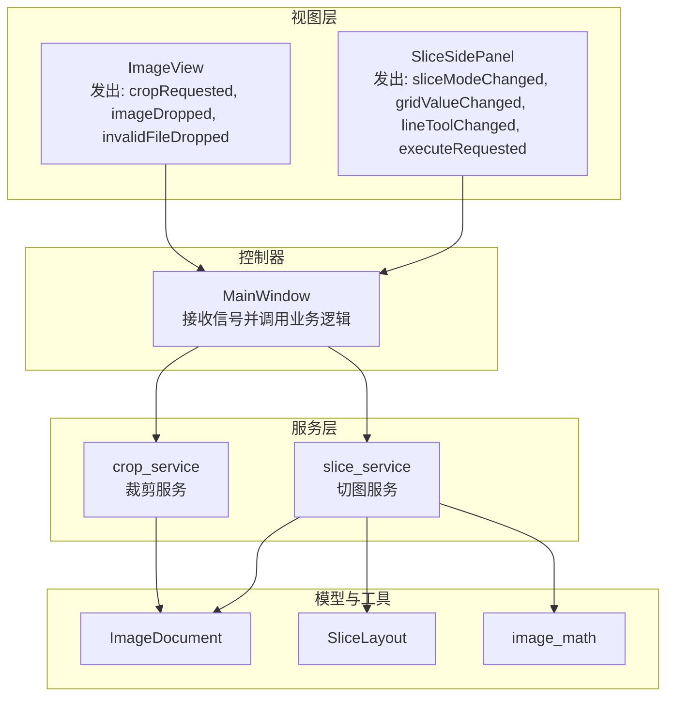
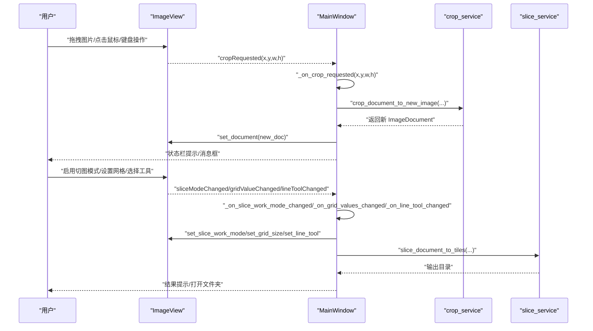
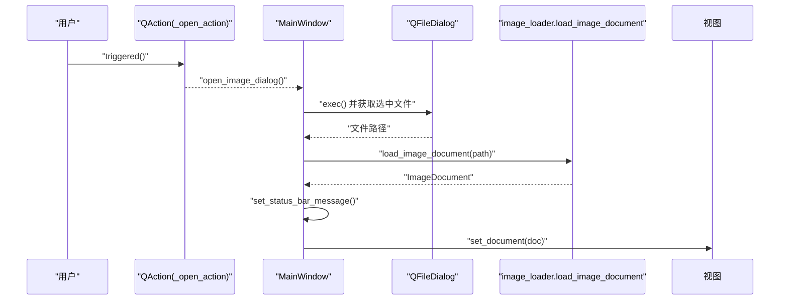
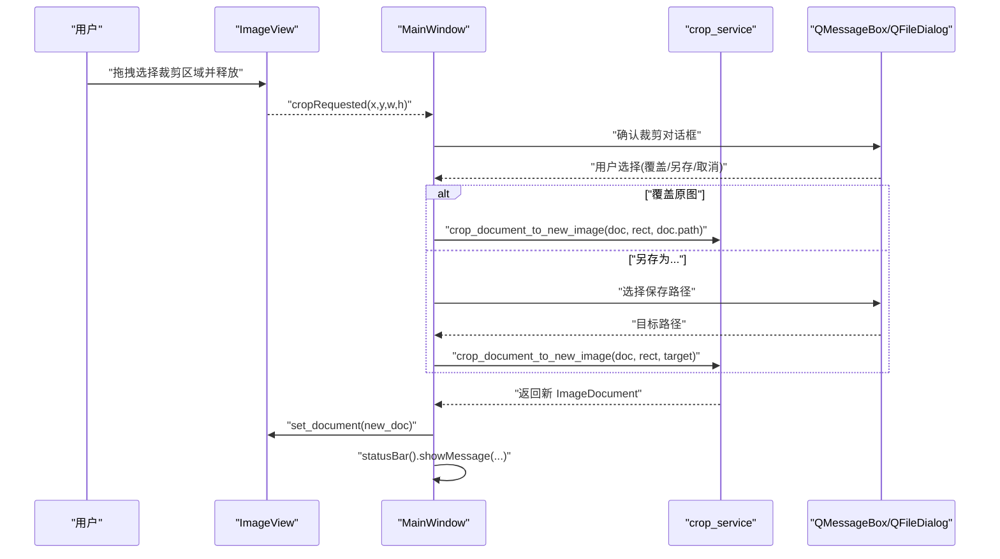
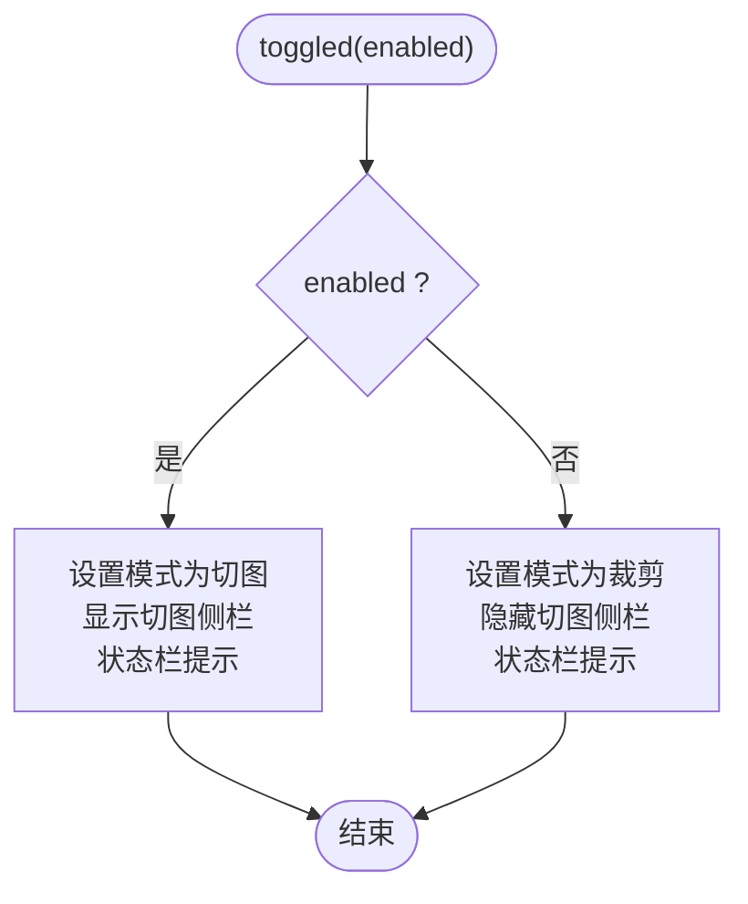
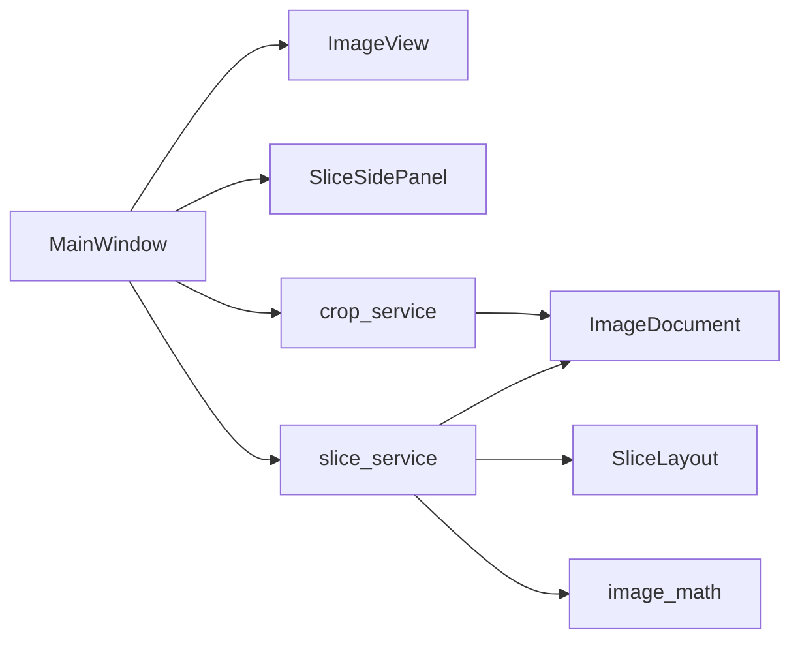

# 信号与槽机制

<cite>
**本文引用的文件**
- [main_window.py](file://img_slicer_tool/app/main_window.py)
- [image_view.py](file://img_slicer_tool/views/image_view.py)
- [slice_side_panel.py](file://img_slicer_tool/views/slice_side_panel.py)
- [crop_service.py](file://img_slicer_tool/services/crop_service.py)
- [slice_service.py](file://img_slicer_tool/services/slice_service.py)
- [image_document.py](file://img_slicer_tool/models/image_document.py)
- [slice_layout.py](file://img_slicer_tool/models/slice_layout.py)
- [image_math.py](file://img_slicer_tool/utils/image_math.py)
</cite>

## 目录
1. [引言](#引言)
2. [项目结构](#项目结构)
3. [核心组件](#核心组件)
4. [架构总览](#架构总览)
5. [详细组件分析](#详细组件分析)
6. [依赖关系分析](#依赖关系分析)
7. [性能考量](#性能考量)
8. [故障排查指南](#故障排查指南)
9. [结论](#结论)
10. [附录](#附录)

## 引言
本技术文档聚焦于 MainWindow 中的信号与槽机制，系统性解析 _connect_signals 方法内的信号连接逻辑，阐明以下关键点：
- _open_action.triggered 如何连接到 open_image_dialog
- _image_view.cropRequested 如何触发 _on_crop_requested 处理函数
- _toggle_slice_mode_action.toggled 如何控制切图模式切换
同时，文档解释信号槽在解耦 UI 组件与业务逻辑方面的价值，给出信号传递的数据类型说明与错误处理策略，并提供信号连接的最佳实践示例路径。

## 项目结构
该应用采用分层设计：视图层（ImageView、SliceSidePanel）、模型层（ImageDocument、SliceLayout）、服务层（crop_service、slice_service、image_loader）、工具层（image_math），以及主窗口控制器（MainWindow）。信号主要分布在视图层向外发出事件，由 MainWindow 接收并协调服务层执行业务操作。

图表来源
- [main_window.py](file://img_slicer_tool/app/main_window.py#L87-L112)
- [image_view.py](file://img_slicer_tool/views/image_view.py#L24-L31)
- [slice_side_panel.py](file://img_slicer_tool/views/slice_side_panel.py#L22-L25)
- [crop_service.py](file://img_slicer_tool/services/crop_service.py#L13-L38)
- [slice_service.py](file://img_slicer_tool/services/slice_service.py#L12-L62)
- [image_document.py](file://img_slicer_tool/models/image_document.py#L8-L18)
- [slice_layout.py](file://img_slicer_tool/models/slice_layout.py#L7-L30)
- [image_math.py](file://img_slicer_tool/utils/image_math.py#L17-L76)

章节来源
- [main_window.py](file://img_slicer_tool/app/main_window.py#L26-L112)
- [image_view.py](file://img_slicer_tool/views/image_view.py#L24-L31)
- [slice_side_panel.py](file://img_slicer_tool/views/slice_side_panel.py#L22-L25)

## 核心组件
- MainWindow：负责创建动作、菜单、视图与面板；在 _connect_signals 中建立信号与槽的连接；作为业务协调者，调用服务层执行具体任务。
- ImageView：图形视图组件，负责用户交互（拖拽、鼠标事件、键盘快捷键等），并向外发出信号（如裁剪请求、拖入图片、无效文件拖入）。
- SliceSidePanel：切图模式左侧工作栏，提供切图方式切换、网格行列设置、手动工具选择等功能，并发出相应信号。
- 服务层：crop_service 和 slice_service 封装具体的业务逻辑（裁剪、切图），并与模型层协作。
- 模型与工具：ImageDocument 描述图片元信息；SliceLayout 描述切图线布局；image_math 提供坐标换算工具。

章节来源
- [main_window.py](file://img_slicer_tool/app/main_window.py#L26-L112)
- [image_view.py](file://img_slicer_tool/views/image_view.py#L24-L31)
- [slice_side_panel.py](file://img_slicer_tool/views/slice_side_panel.py#L22-L25)
- [crop_service.py](file://img_slicer_tool/services/crop_service.py#L13-L38)
- [slice_service.py](file://img_slicer_tool/services/slice_service.py#L12-L62)
- [image_document.py](file://img_slicer_tool/models/image_document.py#L8-L18)
- [slice_layout.py](file://img_slicer_tool/models/slice_layout.py#L7-L30)
- [image_math.py](file://img_slicer_tool/utils/image_math.py#L17-L76)

## 架构总览
信号从视图层发出，经 MainWindow 的槽函数进行业务判断与状态更新，再调用服务层执行具体操作，最终更新视图层显示或状态栏提示。这种设计实现了 UI 与业务逻辑的解耦，便于扩展与维护。

图表来源
- [main_window.py](file://img_slicer_tool/app/main_window.py#L87-L112)
- [image_view.py](file://img_slicer_tool/views/image_view.py#L24-L31)
- [slice_side_panel.py](file://img_slicer_tool/views/slice_side_panel.py#L22-L25)
- [crop_service.py](file://img_slicer_tool/services/crop_service.py#L13-L38)
- [slice_service.py](file://img_slicer_tool/services/slice_service.py#L12-L62)

## 详细组件分析

### 信号与槽连接清单（来自 _connect_signals）
- _open_action.triggered 连接到 open_image_dialog：用于打开图片对话框并加载图片。
- _exit_action.triggered 连接到 close：用于退出应用。
- _image_view.cropRequested 连接到 _on_crop_requested：用于响应裁剪区域选择后的处理。
- _image_view.imageDropped 连接到 _on_image_dropped：用于响应拖入有效图片文件。
- _image_view.invalidFileDropped 连接到 _on_invalid_drop：用于响应拖入无效文件。
- _toggle_slice_mode_action.toggled 连接到 _on_toggle_slice_mode：用于切换切图模式。
- _generate_grid_action.triggered 连接到 _on_generate_grid_from_rows_cols：用于按行列生成宫格线。
- _execute_slice_action.triggered 连接到 _on_execute_slice：用于执行切图。
- _set_slice_output_dir_action.triggered 连接到 _on_set_slice_output_dir：用于设置切图输出目录。
- _slice_panel.sliceModeChanged 连接到 _on_slice_work_mode_changed：用于同步切图工作模式。
- _slice_panel.gridValueChanged 连接到 _on_grid_values_changed：用于同步网格行列值。
- _slice_panel.lineToolChanged 连接到 _on_line_tool_changed：用于同步手动工具。
- _slice_panel.executeRequested 连接到 _on_execute_slice：用于触发执行切图。

章节来源
- [main_window.py](file://img_slicer_tool/app/main_window.py#L87-L112)

### _open_action.triggered → open_image_dialog
- 触发条件：用户点击“打开图片”菜单项或按下快捷键。
- 连接方式：_open_action.triggered.connect(open_image_dialog)。
- 执行流程：打开文件对话框，选择图片路径后调用 load_image，加载成功后更新视图与状态栏。

图表来源
- [main_window.py](file://img_slicer_tool/app/main_window.py#L87-L112)
- [main_window.py](file://img_slicer_tool/app/main_window.py#L102-L135)

章节来源
- [main_window.py](file://img_slicer_tool/app/main_window.py#L87-L112)
- [main_window.py](file://img_slicer_tool/app/main_window.py#L102-L135)

### _image_view.cropRequested → _on_crop_requested
- 发出信号：ImageView 在裁剪矩形完成后发出 cropRequested(x, y, w, h)。
- 连接方式：_image_view.cropRequested.connect(_on_crop_requested)。
- 处理流程：弹出确认对话框，根据用户选择决定覆盖原图或另存为，调用 crop_service 执行裁剪，更新当前文档并刷新视图与状态栏。

图表来源
- [image_view.py](file://img_slicer_tool/views/image_view.py#L24-L31)
- [main_window.py](file://img_slicer_tool/app/main_window.py#L87-L112)
- [main_window.py](file://img_slicer_tool/app/main_window.py#L136-L193)
- [crop_service.py](file://img_slicer_tool/services/crop_service.py#L13-L38)

章节来源
- [image_view.py](file://img_slicer_tool/views/image_view.py#L24-L31)
- [main_window.py](file://img_slicer_tool/app/main_window.py#L87-L112)
- [main_window.py](file://img_slicer_tool/app/main_window.py#L136-L193)
- [crop_service.py](file://img_slicer_tool/services/crop_service.py#L13-L38)

### _toggle_slice_mode_action.toggled → 切图模式切换
- 触发条件：用户点击“切图模式”菜单项，动作可勾选。
- 连接方式：_toggle_slice_mode_action.toggled.connect(_on_toggle_slice_mode)。
- 处理流程：当启用时进入切图模式，显示切图侧栏；当禁用时回到裁剪模式，隐藏侧栏；同时更新状态栏提示。

图表来源
- [main_window.py](file://img_slicer_tool/app/main_window.py#L87-L112)
- [main_window.py](file://img_slicer_tool/app/main_window.py#L194-L203)

章节来源
- [main_window.py](file://img_slicer_tool/app/main_window.py#L87-L112)
- [main_window.py](file://img_slicer_tool/app/main_window.py#L194-L203)

### 其他关键信号连接
- _image_view.imageDropped / invalidFileDropped：分别连接到 _on_image_dropped 与 _on_invalid_drop，用于处理拖拽图片文件。
- _slice_panel.sliceModeChanged / gridValueChanged / lineToolChanged：连接到 _on_slice_work_mode_changed、_on_grid_values_changed、_on_line_tool_changed，用于同步切图工作模式、网格行列与手动工具。
- _slice_panel.executeRequested：连接到 _on_execute_slice，用于触发切图执行。

章节来源
- [main_window.py](file://img_slicer_tool/app/main_window.py#L87-L112)
- [image_view.py](file://img_slicer_tool/views/image_view.py#L24-L31)
- [slice_side_panel.py](file://img_slicer_tool/views/slice_side_panel.py#L22-L25)

## 依赖关系分析
- MainWindow 依赖 ImageView 与 SliceSidePanel 的信号，以驱动业务流程。
- MainWindow 通过服务层（crop_service、slice_service）执行具体操作，服务层依赖模型层（ImageDocument、SliceLayout）与工具层（image_math）。
- ImageView 与 SliceSidePanel 内部通过内部状态与方法控制 UI 行为，对外仅通过信号暴露事件。

图表来源
- [main_window.py](file://img_slicer_tool/app/main_window.py#L87-L112)
- [image_view.py](file://img_slicer_tool/views/image_view.py#L24-L31)
- [slice_side_panel.py](file://img_slicer_tool/views/slice_side_panel.py#L22-L25)
- [crop_service.py](file://img_slicer_tool/services/crop_service.py#L13-L38)
- [slice_service.py](file://img_slicer_tool/services/slice_service.py#L12-L62)
- [image_document.py](file://img_slicer_tool/models/image_document.py#L8-L18)
- [slice_layout.py](file://img_slicer_tool/models/slice_layout.py#L7-L30)
- [image_math.py](file://img_slicer_tool/utils/image_math.py#L17-L76)

章节来源
- [main_window.py](file://img_slicer_tool/app/main_window.py#L87-L112)
- [image_view.py](file://img_slicer_tool/views/image_view.py#L24-L31)
- [slice_side_panel.py](file://img_slicer_tool/views/slice_side_panel.py#L22-L25)
- [crop_service.py](file://img_slicer_tool/services/crop_service.py#L13-L38)
- [slice_service.py](file://img_slicer_tool/services/slice_service.py#L12-L62)
- [image_document.py](file://img_slicer_tool/models/image_document.py#L8-L18)
- [slice_layout.py](file://img_slicer_tool/models/slice_layout.py#L7-L30)
- [image_math.py](file://img_slicer_tool/utils/image_math.py#L17-L76)

## 性能考量
- 信号连接应尽量保持轻量：槽函数只做必要的状态更新与调用服务层，避免在信号回调中执行耗时操作。
- 图像加载与切图涉及 IO 与像素处理，应在后台线程或异步任务中执行，避免阻塞 UI。
- 对于频繁触发的信号（如网格行列变化），可在 UI 层做节流或防抖，减少不必要的业务调用。
- 使用状态栏与消息框进行反馈，有助于提升用户体验，但应避免过度弹窗。

## 故障排查指南
- 文件加载失败：检查文件是否存在与格式是否受支持；捕获异常并提示用户。
- 裁剪失败：检查裁剪参数（宽高必须为正数，区域有效）；捕获异常并提示错误。
- 切图失败：检查输出目录与边界计算；确保预览坐标与原图坐标的映射正确。
- 拖拽无效：确认 MIME 数据包含本地文件 URL，且文件扩展名在支持集合内。

章节来源
- [main_window.py](file://img_slicer_tool/app/main_window.py#L114-L135)
- [main_window.py](file://img_slicer_tool/app/main_window.py#L136-L193)
- [main_window.py](file://img_slicer_tool/app/main_window.py#L230-L262)
- [image_view.py](file://img_slicer_tool/views/image_view.py#L141-L153)
- [image_view.py](file://img_slicer_tool/views/image_view.py#L526-L529)
- [image_math.py](file://img_slicer_tool/utils/image_math.py#L17-L48)
- [image_math.py](file://img_slicer_tool/utils/image_math.py#L50-L76)

## 结论
MainWindow 的 _connect_signals 将视图层与业务逻辑紧密耦合在一起，通过信号与槽实现了清晰的职责分离：视图层专注交互与事件发出，控制器负责协调与调度，服务层承担具体业务实现。该设计提升了系统的可维护性与可扩展性，便于未来新增功能或替换实现。

## 附录

### 信号与槽最佳实践示例路径
- 动作触发连接：[main_window.py](file://img_slicer_tool/app/main_window.py#L87-L112)
- 裁剪请求处理：[image_view.py](file://img_slicer_tool/views/image_view.py#L24-L31)，[main_window.py](file://img_slicer_tool/app/main_window.py#L136-L193)，[crop_service.py](file://img_slicer_tool/services/crop_service.py#L13-L38)
- 切图模式切换：[main_window.py](file://img_slicer_tool/app/main_window.py#L194-L203)
- 切图工作模式同步：[slice_side_panel.py](file://img_slicer_tool/views/slice_side_panel.py#L22-L25)，[main_window.py](file://img_slicer_tool/app/main_window.py#L263-L289)
- 网格行列同步：[slice_side_panel.py](file://img_slicer_tool/views/slice_side_panel.py#L22-L25)，[main_window.py](file://img_slicer_tool/app/main_window.py#L289-L294)
- 手动工具同步：[slice_side_panel.py](file://img_slicer_tool/views/slice_side_panel.py#L22-L25)，[main_window.py](file://img_slicer_tool/app/main_window.py#L295-L310)
- 执行切图：[slice_side_panel.py](file://img_slicer_tool/views/slice_side_panel.py#L22-L25)，[main_window.py](file://img_slicer_tool/app/main_window.py#L230-L262)，[slice_service.py](file://img_slicer_tool/services/slice_service.py#L12-L62)，[image_math.py](file://img_slicer_tool/utils/image_math.py#L50-L76)