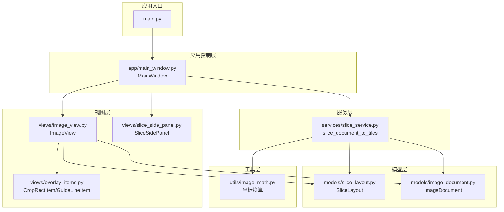
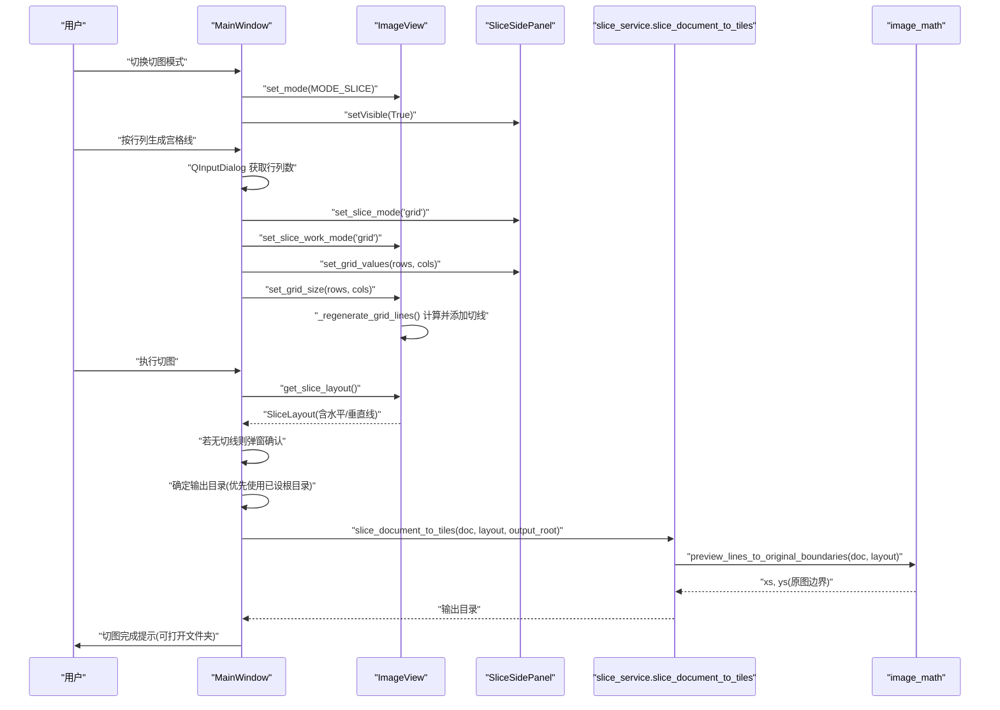
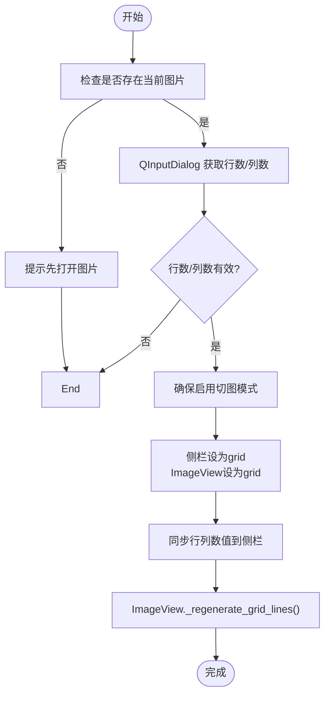
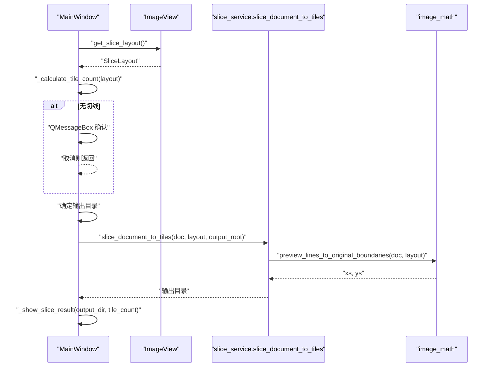
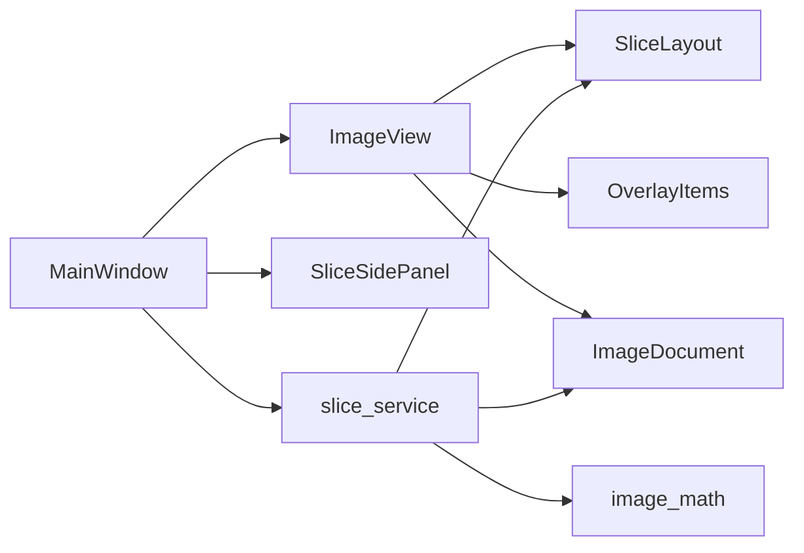

# 切图功能实现

<cite>
**本文引用的文件**
- [main.py](file://img_slicer_tool/main.py)
- [main_window.py](file://img_slicer_tool/app/main_window.py)
- [image_view.py](file://img_slicer_tool/views/image_view.py)
- [slice_layout.py](file://img_slicer_tool/models/slice_layout.py)
- [slice_service.py](file://img_slicer_tool/services/slice_service.py)
- [image_math.py](file://img_slicer_tool/utils/image_math.py)
- [image_document.py](file://img_slicer_tool/models/image_document.py)
- [overlay_items.py](file://img_slicer_tool/views/overlay_items.py)
- [slice_side_panel.py](file://img_slicer_tool/views/slice_side_panel.py)
</cite>

## 目录
1. [简介](#简介)
2. [项目结构](#项目结构)
3. [核心组件](#核心组件)
4. [架构总览](#架构总览)
5. [详细组件分析](#详细组件分析)
6. [依赖关系分析](#依赖关系分析)
7. [性能考量](#性能考量)
8. [故障排查指南](#故障排查指南)
9. [结论](#结论)

## 简介
本技术文档围绕“宫格切图”功能，系统阐述从界面交互到切图执行的完整实现流程。重点解析以下关键点：
- 如何通过菜单动作切换 ImageView 的显示模式（切图模式/裁剪模式）
- 如何设置切图输出目录
- 如何通过 QInputDialog 获取行列数并在预览坐标系中计算并添加宫格切线
- 执行切图时的布局获取、输出目录确定、服务调用与结果反馈流程，以及无切线时的用户确认机制

## 项目结构
该功能位于 img_slicer_tool 子工程内，采用分层组织：应用入口、主窗口控制器、视图层、模型层、服务层与工具层。

图表来源
- [main.py](file://img_slicer_tool/main.py#L1-L13)
- [main_window.py](file://img_slicer_tool/app/main_window.py#L1-L120)
- [image_view.py](file://img_slicer_tool/views/image_view.py#L1-L120)
- [slice_side_panel.py](file://img_slicer_tool/views/slice_side_panel.py#L1-L80)
- [overlay_items.py](file://img_slicer_tool/views/overlay_items.py#L1-L64)
- [slice_layout.py](file://img_slicer_tool/models/slice_layout.py#L1-L30)
- [image_document.py](file://img_slicer_tool/models/image_document.py#L1-L18)
- [slice_service.py](file://img_slicer_tool/services/slice_service.py#L1-L62)
- [image_math.py](file://img_slicer_tool/utils/image_math.py#L1-L76)

章节来源
- [main.py](file://img_slicer_tool/main.py#L1-L13)
- [main_window.py](file://img_slicer_tool/app/main_window.py#L1-L120)

## 核心组件
- 主窗口控制器：负责菜单动作绑定、状态管理、与服务层交互、消息提示与输出目录确定
- 视图组件：承载 ImageView 与切图侧栏，处理鼠标事件、键盘快捷键、渲染切线与网格
- 切图布局模型：封装预览坐标系下的水平/垂直切线集合，并提供标准化与边界扩展
- 切图服务：根据布局与原图尺寸，将预览坐标换算为原图边界并批量裁剪保存
- 数学工具：提供预览坐标到原图坐标的换算，确保切线落在有效像素范围内

章节来源
- [main_window.py](file://img_slicer_tool/app/main_window.py#L120-L220)
- [image_view.py](file://img_slicer_tool/views/image_view.py#L1-L120)
- [slice_layout.py](file://img_slicer_tool/models/slice_layout.py#L1-L30)
- [slice_service.py](file://img_slicer_tool/services/slice_service.py#L1-L62)
- [image_math.py](file://img_slicer_tool/utils/image_math.py#L1-L76)

## 架构总览
下图展示从用户触发到切图完成的关键交互序列。

图表来源
- [main_window.py](file://img_slicer_tool/app/main_window.py#L194-L262)
- [image_view.py](file://img_slicer_tool/views/image_view.py#L236-L304)
- [slice_service.py](file://img_slicer_tool/services/slice_service.py#L12-L62)
- [image_math.py](file://img_slicer_tool/utils/image_math.py#L50-L76)

## 详细组件分析

### 切图模式切换：_on_toggle_slice_mode
- 功能目标：在“切图模式”与“裁剪模式”之间切换，同时控制侧栏可见性与状态提示。
- 关键行为：
  - 进入切图模式：将 ImageView 切换到切图模式，显示切图侧栏，提示用户使用侧栏配置切图方式与工具
  - 退出切图模式：回到裁剪模式，隐藏侧栏，提示回到裁剪模式
- 模式常量与状态：
  - ImageView 内部维护 MODE_CROP 与 MODE_SLICE 两种模式
  - 切图模式下，侧栏提供“网格/手动”两种工作方式与工具按钮

章节来源
- [main_window.py](file://img_slicer_tool/app/main_window.py#L194-L203)
- [image_view.py](file://img_slicer_tool/views/image_view.py#L24-L31)

### 设置切图输出目录：_on_set_slice_output_dir
- 功能目标：允许用户选择切图输出根目录；若未设置，则在执行切图时回退到原图所在目录。
- 关键行为：
  - 弹出“选择文件夹”对话框
  - 成功选择后保存到 MainWindow 的内部字段，用于后续切图输出目录推导

章节来源
- [main_window.py](file://img_slicer_tool/app/main_window.py#L204-L209)

### 通过行列生成宫格线：_on_generate_grid_from_rows_cols
- 输入来源：通过 QInputDialog 分别获取行数与列数（范围限制在合理区间）
- 工作流程：
  - 确保已进入切图模式（必要时自动勾选）
  - 将侧栏切图模式切换为“grid”，同时通知 ImageView 切图工作模式也为“grid”
  - 同步侧栏的行列数值，驱动 ImageView 更新网格大小
  - ImageView 在网格模式下重新生成切线：按预览图高度/宽度等分，生成水平与垂直切线
- 预览坐标系算法要点：
  - 通过预览图矩形的高度/宽度除以行数/列数得到步长
  - 在每条分割线上插入一条切线，保证位置落在预览图边界内
  - 切线以 GuideLineItem 渲染，存储于 ImageView 的切线列表中

图表来源
- [main_window.py](file://img_slicer_tool/app/main_window.py#L210-L229)
- [image_view.py](file://img_slicer_tool/views/image_view.py#L441-L466)

章节来源
- [main_window.py](file://img_slicer_tool/app/main_window.py#L210-L229)
- [image_view.py](file://img_slicer_tool/views/image_view.py#L441-L466)

### 执行切图：_on_execute_slice
- 输入来源：当前图片文档、ImageView 中的切图布局（由切线集合构成）
- 关键步骤：
  - 获取布局：调用 ImageView.get_slice_layout() 收集当前切线，形成 SliceLayout
  - 计算切片数量：通过布局的边界计算与预览图尺寸估算切片总数
  - 无切线确认：若水平/垂直切线均为空，弹窗提示仅导出整张图为一个切片，等待用户确认
  - 输出目录确定：优先使用 MainWindow 中已设置的根目录；若未设置则回退到原图所在目录
  - 调用切图服务：slice_document_to_tiles(doc, layout, output_root)
  - 结果反馈：弹窗显示切片数量与输出目录，支持一键打开输出文件夹
- 错误处理：捕获服务层异常并提示用户

图表来源
- [main_window.py](file://img_slicer_tool/app/main_window.py#L230-L262)
- [main_window.py](file://img_slicer_tool/app/main_window.py#L325-L341)
- [main_window.py](file://img_slicer_tool/app/main_window.py#L342-L359)
- [slice_service.py](file://img_slicer_tool/services/slice_service.py#L12-L62)
- [image_math.py](file://img_slicer_tool/utils/image_math.py#L50-L76)

章节来源
- [main_window.py](file://img_slicer_tool/app/main_window.py#L230-L262)
- [main_window.py](file://img_slicer_tool/app/main_window.py#L325-L359)
- [slice_service.py](file://img_slicer_tool/services/slice_service.py#L12-L62)
- [image_math.py](file://img_slicer_tool/utils/image_math.py#L50-L76)

### 切图布局模型：SliceLayout
- 数据结构：包含水平与垂直两条切线列表
- 标准化与边界扩展：
  - normalize：去重、排序，并过滤掉超出预览图范围的无效切线
  - get_boundaries：在 xs 与 ys 两端分别加入 0 与对应边长，形成闭区间边界序列
- 使用场景：被 ImageView 收集切线后传给切图服务，作为原图边界换算的输入

章节来源
- [slice_layout.py](file://img_slicer_tool/models/slice_layout.py#L1-L30)

### 预览坐标到原图边界的换算：image_math
- 功能：将 SliceLayout 的预览坐标边界转换为原图像素边界
- 算法要点：
  - 先对预览坐标进行四舍五入并裁剪到原图有效范围
  - 对 xs 与 ys 分别去重、排序，确保至少产生两个边界以形成有效切片
  - 返回可用于 PIL 裁剪的整型边界列表

章节来源
- [image_math.py](file://img_slicer_tool/utils/image_math.py#L50-L76)

### 切图服务：slice_document_to_tiles
- 输入：ImageDocument、SliceLayout、输出根目录
- 处理流程：
  - 校验原图存在与输出目录有效性
  - 创建以原图为名的子目录用于存放切片
  - 调用换算函数得到原图边界
  - 遍历边界对生成切片，逐个保存（针对 JPEG 提供质量参数）
- 输出：返回输出目录路径

章节来源
- [slice_service.py](file://img_slicer_tool/services/slice_service.py#L12-L62)

### 视图层：ImageView 与 OverlayItems
- ImageView：
  - 维护当前模式（裁剪/切图）、切线集合、网格行列数、当前所选/拖拽的切线索引
  - 提供 set_mode、set_slice_work_mode、set_line_tool、set_grid_size、clear_cut_lines、get_slice_layout 等接口
  - _regenerate_grid_lines：在网格模式下按行列数生成等间距切线
  - _update_line_geometry/_clamp_position：保证切线位置在预览图边界内
  - 鼠标事件处理：支持手动绘制、选择、拖拽切线；键盘快捷键生成切线
- OverlayItems：
  - GuideLineItem：渲染红色虚线，支持高亮（橙色实线加粗）
  - CropRectItem：裁剪选择矩形，半透明填充与虚线边框

章节来源
- [image_view.py](file://img_slicer_tool/views/image_view.py#L1-L120)
- [image_view.py](file://img_slicer_tool/views/image_view.py#L236-L304)
- [image_view.py](file://img_slicer_tool/views/image_view.py#L306-L383)
- [image_view.py](file://img_slicer_tool/views/image_view.py#L441-L466)
- [overlay_items.py](file://img_slicer_tool/views/overlay_items.py#L1-L64)

### 切图侧栏：SliceSidePanel
- 提供“网格/手动”两种工作方式的单选切换
- 网格模式下提供行数/列数输入框，实时同步到 ImageView
- 手动模式下提供“水平线/垂直线/十字线/选择”工具按钮，切换当前工具
- 发出信号：sliceModeChanged、gridValueChanged、lineToolChanged、executeRequested

章节来源
- [slice_side_panel.py](file://img_slicer_tool/views/slice_side_panel.py#L1-L174)

## 依赖关系分析
- 控制器依赖：
  - MainWindow 依赖 ImageView、SliceSidePanel、SliceLayout、ImageDocument、slice_service
  - ImageView 依赖 SliceLayout、OverlayItems、ImageDocument
  - 切图服务依赖 SliceLayout、ImageDocument、image_math
- 数据流向：
  - 用户操作触发 MainWindow 的槽函数
  - MainWindow 调用 ImageView 的接口更新切线与模式
  - 切线集合经由 SliceLayout 标准化后传递给切图服务
  - image_math 负责坐标换算，确保切片边界合法

图表来源
- [main_window.py](file://img_slicer_tool/app/main_window.py#L1-L120)
- [image_view.py](file://img_slicer_tool/views/image_view.py#L1-L120)
- [slice_service.py](file://img_slicer_tool/services/slice_service.py#L1-L62)
- [image_math.py](file://img_slicer_tool/utils/image_math.py#L1-L76)

章节来源
- [main_window.py](file://img_slicer_tool/app/main_window.py#L1-L120)
- [image_view.py](file://img_slicer_tool/views/image_view.py#L1-L120)
- [slice_service.py](file://img_slicer_tool/services/slice_service.py#L1-L62)
- [image_math.py](file://img_slicer_tool/utils/image_math.py#L1-L76)

## 性能考量
- 切线生成复杂度：网格模式下生成 O(rows + cols) 条切线，渲染与几何更新为 O(n)
- 边界换算复杂度：对 xs/ys 各做一次线性扫描与排序，整体 O(n log n)，n 为切线数量
- 切图保存：按边界对遍历生成切片，时间复杂度 O(r*c)，r/c 为切片行列数
- 建议：
  - 大图预览缩放时，建议在合适分辨率下生成网格，避免过多切线导致渲染卡顿
  - 手动模式下频繁拖拽切线时，注意避免重复更新几何，可通过节流策略优化

## 故障排查指南
- 无法生成宫格线
  - 检查是否已打开图片且已启用切图模式
  - 确认行列数输入有效（范围限制在 UI 层已设定）
- 执行切图无响应或报错
  - 若无任何切线，需确认“仅导出整张图”的提示是否已确认
  - 检查输出目录是否正确设置，或回退到原图所在目录
  - 查看服务层异常信息，确认原图路径与输出目录有效性
- 切线位置异常
  - 确认预览图缩放比例与拖拽位置是否在预览图边界内
  - 手动模式下删除无效切线后重新生成

章节来源
- [main_window.py](file://img_slicer_tool/app/main_window.py#L230-L262)
- [main_window.py](file://img_slicer_tool/app/main_window.py#L240-L249)
- [image_view.py](file://img_slicer_tool/views/image_view.py#L306-L383)

## 结论
本功能通过清晰的分层设计与明确的职责划分，实现了从用户交互到切图执行的完整闭环。MainWindow 作为协调者，ImageView 负责可视化与交互，SliceLayout 与 image_math 提供数据与换算支撑，slice_service 完成最终的切图与落盘。网格模式下通过 QInputDialog 快速生成等间距切线，手动模式下提供灵活的交互体验；执行切图时具备完善的边界校验与用户确认机制，确保结果符合预期。