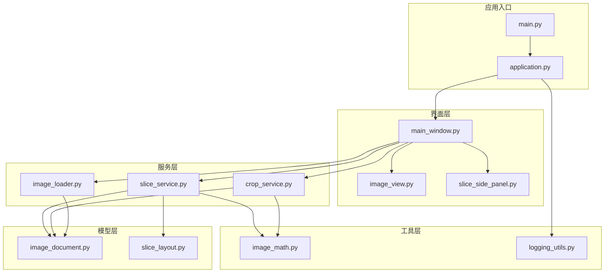
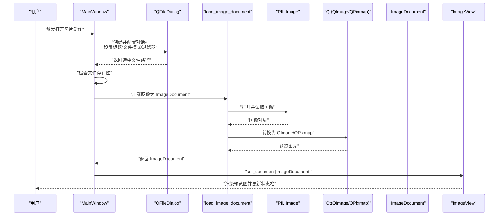
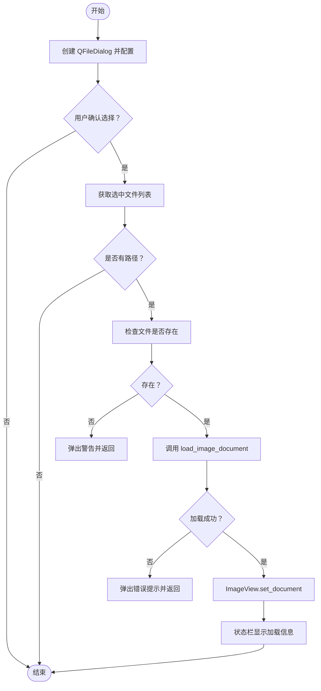
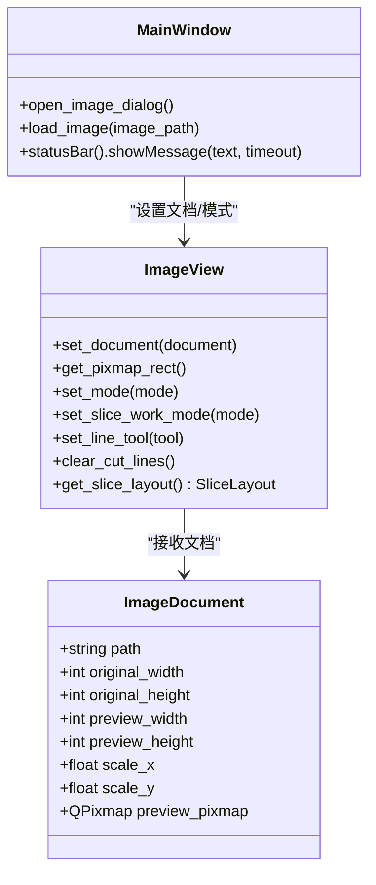
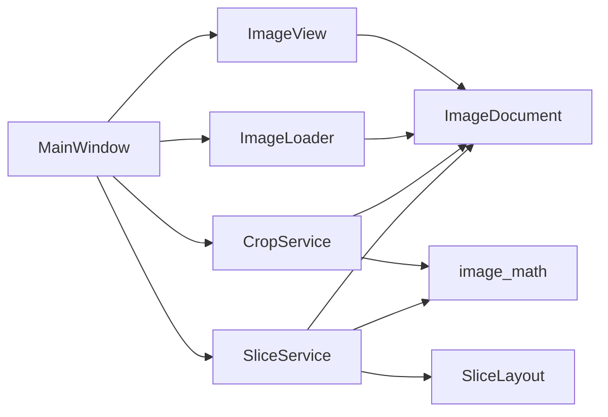

# 图像加载与处理

<cite>
**本文引用的文件**
- [main.py](file://img_slicer_tool/main.py)
- [application.py](file://img_slicer_tool/app/application.py)
- [main_window.py](file://img_slicer_tool/app/main_window.py)
- [image_loader.py](file://img_slicer_tool/services/image_loader.py)
- [image_document.py](file://img_slicer_tool/models/image_document.py)
- [image_view.py](file://img_slicer_tool/views/image_view.py)
- [slice_service.py](file://img_slicer_tool/services/slice_service.py)
- [crop_service.py](file://img_slicer_tool/services/crop_service.py)
- [slice_layout.py](file://img_slicer_tool/models/slice_layout.py)
- [image_math.py](file://img_slicer_tool/utils/image_math.py)
- [slice_side_panel.py](file://img_slicer_tool/views/slice_side_panel.py)
- [logging_utils.py](file://img_slicer_tool/utils/logging_utils.py)
</cite>

## 目录
1. [简介](#简介)
2. [项目结构](#项目结构)
3. [核心组件](#核心组件)
4. [架构总览](#架构总览)
5. [详细组件分析](#详细组件分析)
6. [依赖关系分析](#依赖关系分析)
7. [性能考量](#性能考量)
8. [故障排查指南](#故障排查指南)
9. [结论](#结论)
10. [附录](#附录)

## 简介
本技术文档聚焦于图像加载与处理流程，围绕以下关键点展开：
- open_image_dialog 与 load_image 方法的实现细节与调用链路
- QFileDialog 的配置与使用，包括文件过滤器设置、单文件选择行为与多文件选择扩展思路
- 图像加载过程中的异常处理机制与用户反馈策略
- ImageDocument 对象的创建过程及其与 ImageView 组件的数据传递方式
- 状态栏消息显示的实现细节与用户体验优化建议

## 项目结构
项目采用分层组织：应用入口负责启动应用；主窗口负责菜单、动作与事件连接；服务层负责图像加载、裁剪与切图；模型层封装数据结构；视图层负责渲染与交互；工具层提供坐标映射等数学工具。

图表来源
- [main.py](file://img_slicer_tool/main.py#L1-L13)
- [application.py](file://img_slicer_tool/app/application.py#L1-L35)
- [main_window.py](file://img_slicer_tool/app/main_window.py#L1-L364)
- [image_loader.py](file://img_slicer_tool/services/image_loader.py#L1-L68)
- [image_document.py](file://img_slicer_tool/models/image_document.py#L1-L18)
- [image_view.py](file://img_slicer_tool/views/image_view.py#L1-L542)
- [slice_service.py](file://img_slicer_tool/services/slice_service.py#L1-L62)
- [crop_service.py](file://img_slicer_tool/services/crop_service.py#L1-L38)
- [slice_layout.py](file://img_slicer_tool/models/slice_layout.py#L1-L30)
- [image_math.py](file://img_slicer_tool/utils/image_math.py#L1-L76)
- [slice_side_panel.py](file://img_slicer_tool/views/slice_side_panel.py#L1-L174)
- [logging_utils.py](file://img_slicer_tool/utils/logging_utils.py#L1-L6)

章节来源
- [main.py](file://img_slicer_tool/main.py#L1-L13)
- [application.py](file://img_slicer_tool/app/application.py#L1-L35)

## 核心组件
- 应用入口与启动：通过 main.py 启动 ImageApp，再由 Application 配置样式与图标并展示主窗口。
- 主窗口：负责菜单、动作、信号连接以及图像加载与状态栏消息显示。
- 图像加载服务：将本地图像文件转换为 ImageDocument，包含原图尺寸、预览尺寸、缩放比例与预览 QPixmap。
- 视图组件：ImageView 负责渲染预览图、处理拖拽、裁剪与切图交互，并与主窗口进行数据传递。
- 裁剪与切图服务：基于预览坐标映射到原图坐标，执行裁剪与切图并生成新文档。
- 数学工具：提供预览坐标与原图坐标的双向映射，确保裁剪与切图的精度。
- 日志工具：统一日志输出，便于问题定位。

章节来源
- [main.py](file://img_slicer_tool/main.py#L1-L13)
- [application.py](file://img_slicer_tool/app/application.py#L1-L35)
- [main_window.py](file://img_slicer_tool/app/main_window.py#L1-L364)
- [image_loader.py](file://img_slicer_tool/services/image_loader.py#L1-L68)
- [image_document.py](file://img_slicer_tool/models/image_document.py#L1-L18)
- [image_view.py](file://img_slicer_tool/views/image_view.py#L1-L542)
- [crop_service.py](file://img_slicer_tool/services/crop_service.py#L1-L38)
- [slice_service.py](file://img_slicer_tool/services/slice_service.py#L1-L62)
- [image_math.py](file://img_slicer_tool/utils/image_math.py#L1-L76)
- [logging_utils.py](file://img_slicer_tool/utils/logging_utils.py#L1-L6)

## 架构总览
下图展示了从用户触发“打开图片”到图像在视图中渲染的关键调用序列。

图表来源
- [main_window.py](file://img_slicer_tool/app/main_window.py#L102-L135)
- [image_loader.py](file://img_slicer_tool/services/image_loader.py#L24-L55)
- [image_document.py](file://img_slicer_tool/models/image_document.py#L8-L18)
- [image_view.py](file://img_slicer_tool/views/image_view.py#L65-L82)

## 详细组件分析

### 组件一：open_image_dialog 与 load_image 的实现细节
- open_image_dialog
  - 创建 QFileDialog，设置窗口标题、文件模式为“现有文件”，并配置图像文件过滤器。
  - 执行对话框，若返回选中文件列表且非空，则调用 load_image 加载首项。
  - 当前实现为单文件选择；如需扩展多文件选择，可在 selectedFiles() 上循环处理并依次加载。
- load_image
  - 先检查文件是否存在，不存在则弹出警告并终止。
  - 使用 load_image_document 将文件转为 ImageDocument；捕获异常并以致命错误提示。
  - 成功后通过 ImageView.set_document 更新视图，并在状态栏显示加载结果信息（文件名、原图尺寸、预览尺寸）。

图表来源
- [main_window.py](file://img_slicer_tool/app/main_window.py#L102-L135)
- [image_loader.py](file://img_slicer_tool/services/image_loader.py#L24-L55)

章节来源
- [main_window.py](file://img_slicer_tool/app/main_window.py#L102-L135)

### 组件二：QFileDialog 的配置与使用
- 配置要点
  - 窗口标题：用于明确操作意图
  - 文件模式：ExistingFile 限制为现有文件
  - 过滤器：限定图像类型，避免无关文件被误选
- 多文件选择扩展
  - 可将文件模式改为 QFileDialog.ExistingFiles 或 MultiSelection
  - 在 selectedFiles() 返回的列表上循环调用 load_image 或批量处理
  - 注意：当前 open_image_dialog 仅取首个路径，扩展时应保持一致的错误处理与状态栏反馈

章节来源
- [main_window.py](file://img_slicer_tool/app/main_window.py#L102-L113)

### 组件三：图像加载过程中的异常处理与用户反馈
- 文件不存在
  - 在 load_image 中先行判断，避免不必要的 IO 开销
  - 通过警告框提示用户，保证操作可回退
- 加载失败
  - 捕获异常并以致命错误提示，包含异常信息
  - 建议：在日志中记录异常详情，便于排查
- 状态栏消息
  - 加载成功：显示文件名、原图尺寸、预览尺寸
  - 裁剪/切图成功：显示目标文件名、尺寸与输出目录
  - 模式切换：提示当前工作模式与操作指引

章节来源
- [main_window.py](file://img_slicer_tool/app/main_window.py#L114-L135)
- [logging_utils.py](file://img_slicer_tool/utils/logging_utils.py#L1-L6)

### 组件四：ImageDocument 的创建与数据传递
- ImageDocument 字段
  - 路径、原图宽高、预览宽高、缩放比例、预览 QPixmap
- 创建流程
  - 读取原图尺寸
  - 计算预览尺寸与缩放比例（预览最大边不超过阈值）
  - 若需要缩放则使用高质量重采样生成预览图
  - 转换为 QImage/QPixmap
  - 构造 ImageDocument 并返回
- 与 ImageView 的传递
  - MainWindow.load_image 成功后调用 ImageView.set_document
  - set_document 清理场景、重置变换、将预览图作为场景矩形并自适应显示
  - 切图/切图模式下根据当前模式与网格参数重新生成切图线

图表来源
- [image_document.py](file://img_slicer_tool/models/image_document.py#L8-L18)
- [image_view.py](file://img_slicer_tool/views/image_view.py#L65-L82)
- [main_window.py](file://img_slicer_tool/app/main_window.py#L102-L135)

章节来源
- [image_loader.py](file://img_slicer_tool/services/image_loader.py#L14-L55)
- [image_document.py](file://img_slicer_tool/models/image_document.py#L8-L18)
- [image_view.py](file://img_slicer_tool/views/image_view.py#L65-L82)
- [main_window.py](file://img_slicer_tool/app/main_window.py#L102-L135)

### 组件五：拖拽加载与有效性校验
- ImageView 支持拖拽本地文件，仅接受支持的图像扩展名
- 支持的扩展名集合定义在视图层，与服务层裁剪/切图的扩展名保持一致
- 有效文件：触发 imageDropped 信号，交由主窗口 load_image 处理
- 无效文件：触发 invalidFileDropped 信号，弹出警告提示

章节来源
- [image_view.py](file://img_slicer_tool/views/image_view.py#L141-L153)
- [main_window.py](file://img_slicer_tool/app/main_window.py#L311-L320)

### 组件六：裁剪与切图的坐标映射
- 预览坐标到原图坐标的映射
  - 通过 ImageDocument 的 scale_x/scale_y 将预览矩形映射到原图像素坐标
  - 裁剪服务据此生成 crop box 并保存新图像，随后重新加载为新 ImageDocument
- 切图边界映射
  - SliceLayout 提供预览坐标系下的水平/垂直线集合
  - image_math 将其转换为原图边界坐标，确保切图区域合法

章节来源
- [image_math.py](file://img_slicer_tool/utils/image_math.py#L17-L76)
- [slice_layout.py](file://img_slicer_tool/models/slice_layout.py#L7-L30)
- [crop_service.py](file://img_slicer_tool/services/crop_service.py#L13-L38)
- [slice_service.py](file://img_slicer_tool/services/slice_service.py#L12-L62)

## 依赖关系分析
- 组件耦合
  - MainWindow 依赖 ImageView、ImageLoader、CropService、SliceService、SliceLayout、ImageDocument
  - ImageView 依赖 ImageDocument、SliceLayout 与 OverlayItems（未在此列出），并与 MainWindow 通过信号交互
  - ImageLoader 依赖 PIL 与 Qt 图像类型
  - CropService/SliceService 依赖 PIL 与 image_math
- 可能的循环依赖
  - 未发现直接循环导入；各层职责清晰，通过数据类与服务函数解耦
- 外部依赖
  - PySide6（Qt）、Pillow（PIL）

图表来源
- [main_window.py](file://img_slicer_tool/app/main_window.py#L1-L120)
- [image_view.py](file://img_slicer_tool/views/image_view.py#L1-L120)
- [image_loader.py](file://img_slicer_tool/services/image_loader.py#L1-L68)
- [crop_service.py](file://img_slicer_tool/services/crop_service.py#L1-L38)
- [slice_service.py](file://img_slicer_tool/services/slice_service.py#L1-L62)
- [slice_layout.py](file://img_slicer_tool/models/slice_layout.py#L1-L30)
- [image_math.py](file://img_slicer_tool/utils/image_math.py#L1-L76)

## 性能考量
- 预览尺寸控制
  - 通过最大预览边长限制，避免超大图导致内存与渲染压力
- 缩放质量
  - 使用高质量重采样算法生成预览图，兼顾清晰度与性能
- 批量处理
  - 当前 open_image_dialog 仅处理单文件；多文件场景建议异步加载与进度反馈
- I/O 与异常
  - 文件存在性前置检查减少无效 I/O
  - 异常捕获避免主线程阻塞，同时建议记录日志以便后续优化

## 故障排查指南
- 打开图片无响应
  - 检查 QFileDialog 是否正确返回路径
  - 确认文件存在性与权限
- 加载失败
  - 查看错误提示中的异常信息
  - 检查图像格式是否受支持（当前支持 PNG/JPG/JPEG/BMP/GIF/TIFF）
- 预览图不显示或空白
  - 确认 ImageDocument 已成功创建并传入 ImageView
  - 检查 set_document 是否被调用
- 裁剪/切图失败
  - 确认预览矩形与切图线映射正确
  - 检查输出路径与权限
- 日志定位
  - 使用日志工具记录关键步骤与异常堆栈，便于快速定位问题

章节来源
- [main_window.py](file://img_slicer_tool/app/main_window.py#L114-L135)
- [logging_utils.py](file://img_slicer_tool/utils/logging_utils.py#L1-L6)

## 结论
本系统通过清晰的分层设计与严格的异常处理，实现了从文件选择到图像渲染、再到裁剪与切图的完整流程。MainWindow 作为协调者，结合 ImageView 的交互能力与服务层的图像处理逻辑，提供了良好的用户体验。未来可在多文件选择、异步加载与更丰富的状态栏反馈方面进一步优化。

## 附录
- 用户体验优化建议
  - 多文件选择：在对话框中启用多选，并在状态栏显示批量处理进度
  - 模式提示：在进入切图模式时提供简短帮助文本与快捷键提示
  - 错误恢复：对失败的操作提供重试按钮或撤销机制
  - 性能监控：在日志中记录关键耗时节点，辅助性能优化