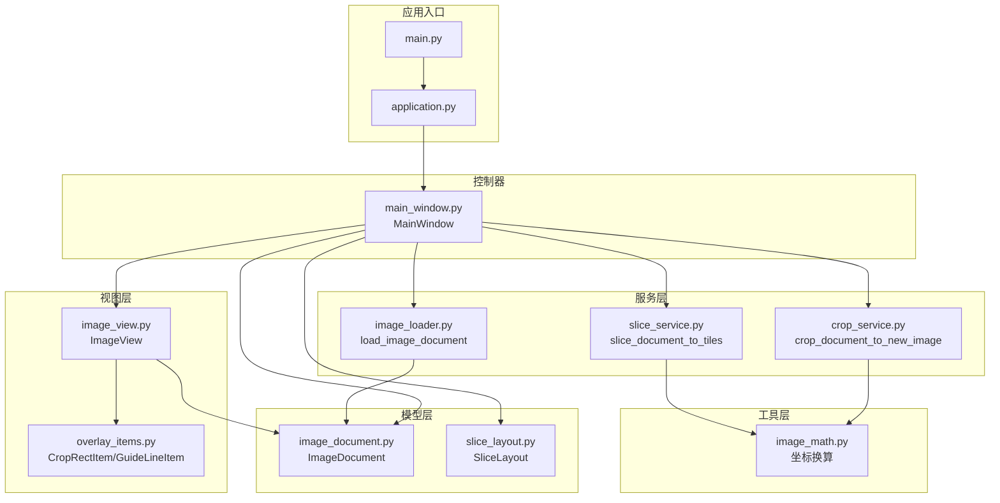
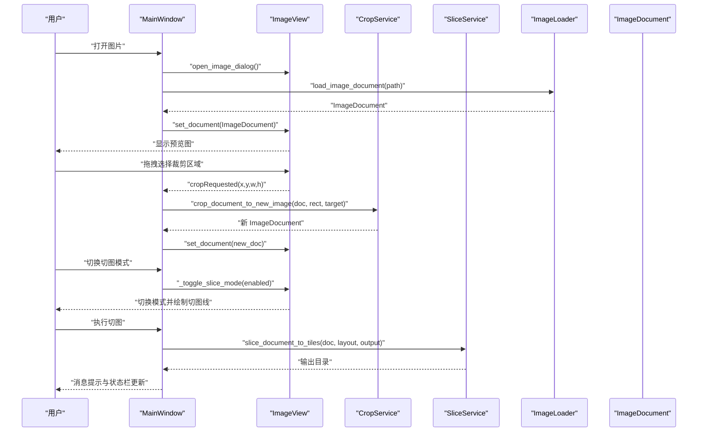
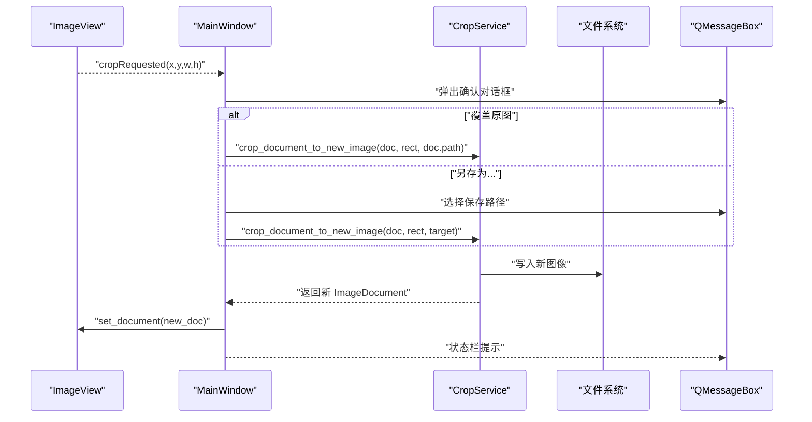
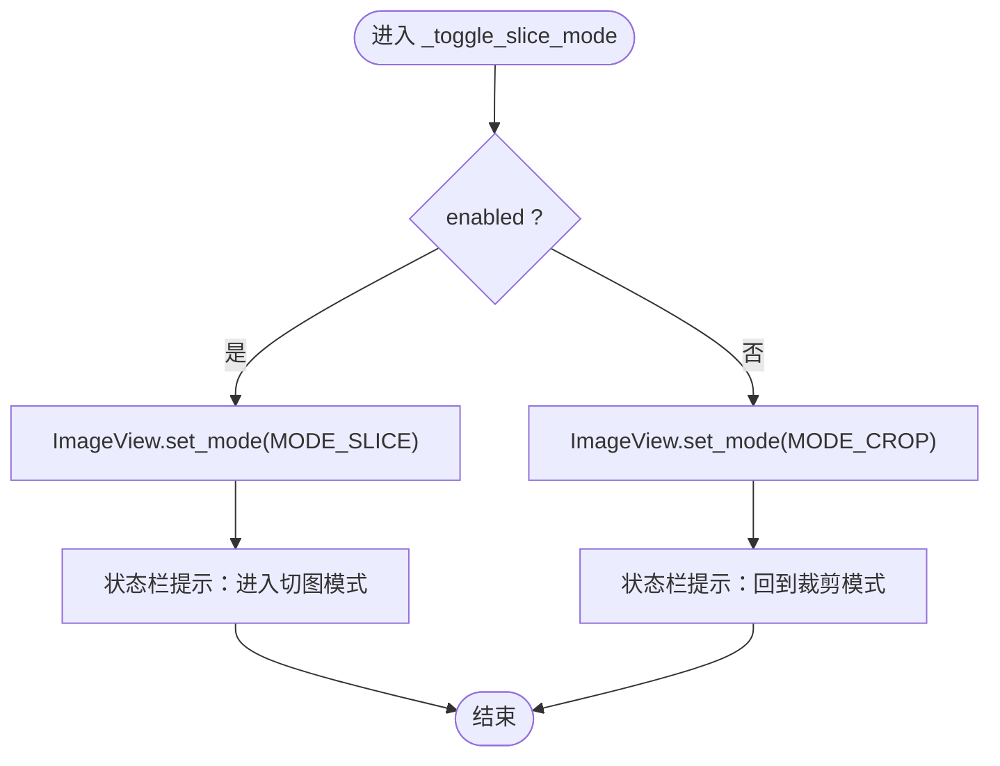
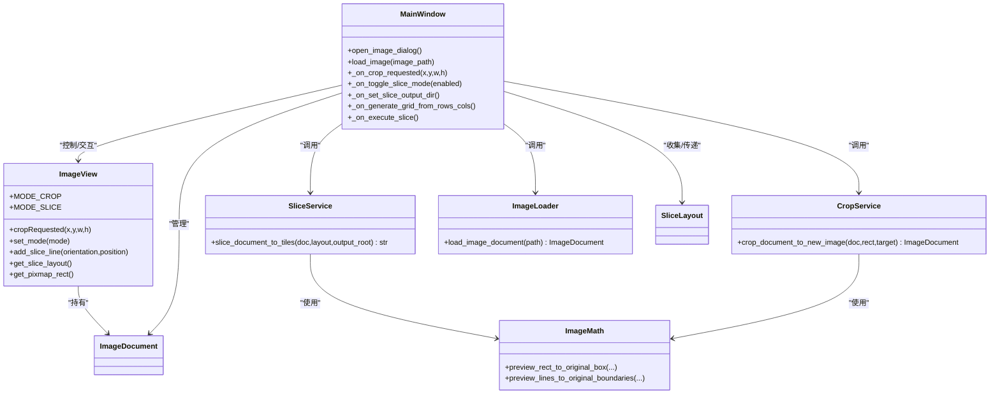
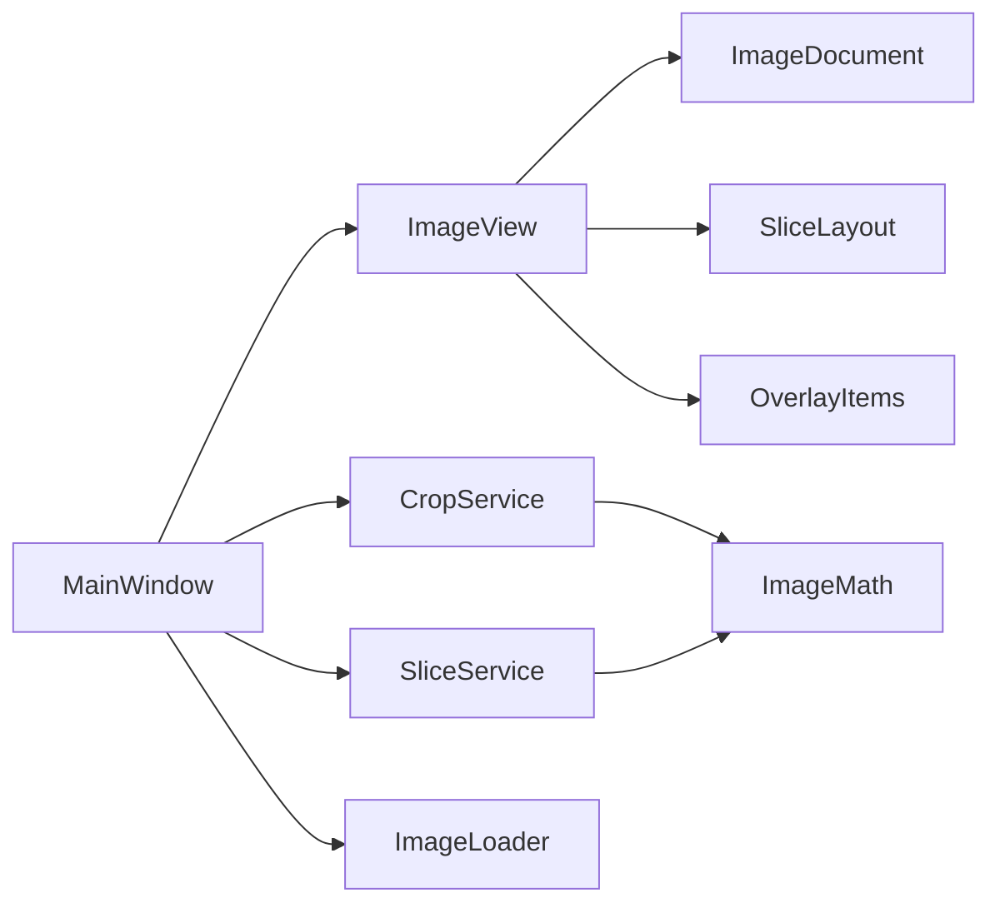

# 控制器逻辑

<cite>
**本文引用的文件**
- [main_window.py](file://img_slicer_tool/app/main_window.py)
- [image_view.py](file://img_slicer_tool/views/image_view.py)
- [overlay_items.py](file://img_slicer_tool/views/overlay_items.py)
- [crop_service.py](file://img_slicer_tool/services/crop_service.py)
- [slice_service.py](file://img_slicer_tool/services/slice_service.py)
- [image_loader.py](file://img_slicer_tool/services/image_loader.py)
- [image_document.py](file://img_slicer_tool/models/image_document.py)
- [slice_layout.py](file://img_slicer_tool/models/slice_layout.py)
- [image_math.py](file://img_slicer_tool/utils/image_math.py)
- [application.py](file://img_slicer_tool/app/application.py)
- [main.py](file://img_slicer_tool/main.py)
</cite>

## 目录
1. [简介](#简介)
2. [项目结构](#项目结构)
3. [核心组件](#核心组件)
4. [架构总览](#架构总览)
5. [详细组件分析](#详细组件分析)
6. [依赖关系分析](#依赖关系分析)
7. [性能考量](#性能考量)
8. [故障排查指南](#故障排查指南)
9. [结论](#结论)

## 简介
本技术文档聚焦于应用的控制器层，重点剖析 MainWindow 控制器如何在 MVC 模式中承担协调者角色，将用户界面操作（打开图片、执行切图等）映射到具体的业务逻辑。文档围绕以下关键点展开：
- 三私有方法协作：_create_actions、_create_menus、_connect_signals 如何共同构建 UI 行为与业务逻辑之间的桥梁
- 信号槽机制：cropRequested 信号如何触发 _on_crop_requested 处理函数
- 切图模式切换：_toggle_slice_mode 如何驱动 ImageView 的模式切换
- 快捷键设计、文件对话框集成与用户交互反馈（QMessageBox）
- 状态转换图：裁剪与切图模式之间的切换逻辑

## 项目结构
应用采用典型的 MVC 分层组织：
- 视图层：MainWindow（窗口）、ImageView（图形视图）、OverlayItems（覆盖元素）
- 模型层：ImageDocument（图像文档）、SliceLayout（切图布局）
- 服务层：CropService（裁剪）、SliceService（切图）、ImageLoader（图像加载）
- 工具层：ImageMath（坐标换算）
- 应用入口：Application（应用封装）、Main（入口）

图表来源
- [main.py](file://img_slicer_tool/main.py#L1-L13)
- [application.py](file://img_slicer_tool/app/application.py#L1-L35)
- [main_window.py](file://img_slicer_tool/app/main_window.py#L1-L248)
- [image_view.py](file://img_slicer_tool/views/image_view.py#L1-L218)
- [overlay_items.py](file://img_slicer_tool/views/overlay_items.py#L1-L57)
- [image_loader.py](file://img_slicer_tool/services/image_loader.py#L1-L68)
- [crop_service.py](file://img_slicer_tool/services/crop_service.py#L1-L38)
- [slice_service.py](file://img_slicer_tool/services/slice_service.py#L1-L62)
- [image_document.py](file://img_slicer_tool/models/image_document.py#L1-L18)
- [slice_layout.py](file://img_slicer_tool/models/slice_layout.py#L1-L30)
- [image_math.py](file://img_slicer_tool/utils/image_math.py#L1-L76)

章节来源
- [main.py](file://img_slicer_tool/main.py#L1-L13)
- [application.py](file://img_slicer_tool/app/application.py#L1-L35)
- [main_window.py](file://img_slicer_tool/app/main_window.py#L1-L248)
- [image_view.py](file://img_slicer_tool/views/image_view.py#L1-L218)

## 核心组件
- MainWindow（控制器）：负责动作创建、菜单装配、信号槽连接；协调图像加载、裁剪、切图与用户反馈
- ImageView（视图）：承载图像预览、绘制覆盖元素、发射 cropRequested 信号
- OverlayItems（视图元素）：CropRectItem（半透明矩形）、GuideLineItem（可拖拽红虚线）
- ImageDocument（模型）：封装原图与预览图尺寸、缩放比例与预览 QPixmap
- SliceLayout（模型）：记录预览坐标系下的水平/垂直切图线
- Services：CropService、SliceService、ImageLoader 封装业务逻辑与数据读写
- ImageMath：预览坐标与原图坐标的双向换算

章节来源
- [main_window.py](file://img_slicer_tool/app/main_window.py#L1-L248)
- [image_view.py](file://img_slicer_tool/views/image_view.py#L1-L218)
- [overlay_items.py](file://img_slicer_tool/views/overlay_items.py#L1-L57)
- [image_document.py](file://img_slicer_tool/models/image_document.py#L1-L18)
- [slice_layout.py](file://img_slicer_tool/models/slice_layout.py#L1-L30)
- [image_loader.py](file://img_slicer_tool/services/image_loader.py#L1-L68)
- [crop_service.py](file://img_slicer_tool/services/crop_service.py#L1-L38)
- [slice_service.py](file://img_slicer_tool/services/slice_service.py#L1-L62)
- [image_math.py](file://img_slicer_tool/utils/image_math.py#L1-L76)

## 架构总览
控制器在 MVC 中扮演“粘合层”：接收用户事件（菜单、快捷键、鼠标），调用服务层执行业务，更新视图层显示，并向用户反馈结果。

图表来源
- [main_window.py](file://img_slicer_tool/app/main_window.py#L1-L248)
- [image_view.py](file://img_slicer_tool/views/image_view.py#L1-L218)
- [crop_service.py](file://img_slicer_tool/services/crop_service.py#L1-L38)
- [slice_service.py](file://img_slicer_tool/services/slice_service.py#L1-L62)
- [image_loader.py](file://img_slicer_tool/services/image_loader.py#L1-L68)
- [image_document.py](file://img_slicer_tool/models/image_document.py#L1-L18)

## 详细组件分析

### MainWindow 控制器：三私有方法协作
- _create_actions：定义菜单项与快捷键，包括打开图片、退出、切图模式切换、按行列生成宫格线、执行切图、设置切图保存路径
- _create_menus：将动作装配到菜单栏（文件、编辑、切图）
- _connect_signals：建立动作触发与处理函数的连接，以及 ImageView 的 cropRequested 信号与控制器处理函数的连接

这三者共同确保：
- 用户通过菜单/快捷键发起操作
- 控制器根据上下文决定是否允许操作（如未加载图片时禁止切图）
- 控制器调用服务层执行业务，并更新视图与状态栏

章节来源
- [main_window.py](file://img_slicer_tool/app/main_window.py#L1-L248)

### 信号槽机制：cropRequested 与 _on_crop_requested
- ImageView 在鼠标释放时，若满足最小尺寸要求，会发出 cropRequested(x, y, w, h) 信号
- MainWindow 在 _connect_signals 中将该信号连接到 _on_crop_requested
- _on_crop_requested 弹出确认对话框，让用户选择覆盖原图或另存为，随后调用 CropService 执行裁剪，更新当前文档与视图

图表来源
- [image_view.py](file://img_slicer_tool/views/image_view.py#L1-L218)
- [main_window.py](file://img_slicer_tool/app/main_window.py#L1-L248)
- [crop_service.py](file://img_slicer_tool/services/crop_service.py#L1-L38)

章节来源
- [image_view.py](file://img_slicer_tool/views/image_view.py#L1-L218)
- [main_window.py](file://img_slicer_tool/app/main_window.py#L1-L248)
- [crop_service.py](file://img_slicer_tool/services/crop_service.py#L1-L38)

### 切图模式切换：_toggle_slice_mode 与 ImageView 模式
- MainWindow 提供 _toggle_slice_mode(enabled)，当启用时设置 ImageView 模式为切图模式，禁用时回到裁剪模式
- ImageView 内部维护 MODE_CROP 与 MODE_SLICE 两种模式，set_mode(mode) 会清理裁剪矩形、重置拖拽状态
- 在切图模式下，鼠标点击会在当前位置添加水平/垂直切图线（支持 Shift/Ctrl 组合控制方向）

图表来源
- [main_window.py](file://img_slicer_tool/app/main_window.py#L1-L248)
- [image_view.py](file://img_slicer_tool/views/image_view.py#L1-L218)

章节来源
- [main_window.py](file://img_slicer_tool/app/main_window.py#L1-L248)
- [image_view.py](file://img_slicer_tool/views/image_view.py#L1-L218)

### 文件对话框与用户交互反馈
- 打开图片：使用 QFileDialog 选择文件，调用 ImageLoader 加载为 ImageDocument，设置到 ImageView 并更新状态栏
- 设置切图保存路径：使用 QFileDialog 获取目录，保存到 MainWindow 的 _slice_output_root
- 裁剪确认：QMessageBox 提供覆盖原图、另存为、取消三种选项，分别走不同分支
- 切图前检查：若无切图线，询问是否仅导出整张图片为一个切片
- 错误处理：对文件不存在、加载失败、裁剪/切图异常统一弹出警告或错误对话框

章节来源
- [main_window.py](file://img_slicer_tool/app/main_window.py#L1-L248)

### 快捷键设计
- 打开图片：Ctrl+O
- 退出：Ctrl+Q
- 切图模式切换：S（可重复切换）
- 按行列生成宫格线：Ctrl+G
- 执行切图：Ctrl+Shift+X
- 设置切图保存路径：菜单项无快捷键

章节来源
- [main_window.py](file://img_slicer_tool/app/main_window.py#L1-L248)

### 数据流与业务逻辑
- 图像加载：ImageLoader 将原图缩放为预览图，计算缩放比例，生成 ImageDocument
- 裁剪：ImageView 发出 cropRequested，控制器调用 CropService，后者将预览矩形映射到原图坐标，执行裁剪并保存，重新加载新文档
- 切图：从 ImageView 收集切图线，转换为 SliceLayout，再由 SliceService 计算原图边界，批量裁剪并保存到目标目录

图表来源
- [main_window.py](file://img_slicer_tool/app/main_window.py#L1-L248)
- [image_view.py](file://img_slicer_tool/views/image_view.py#L1-L218)
- [crop_service.py](file://img_slicer_tool/services/crop_service.py#L1-L38)
- [slice_service.py](file://img_slicer_tool/services/slice_service.py#L1-L62)
- [image_loader.py](file://img_slicer_tool/services/image_loader.py#L1-L68)
- [image_document.py](file://img_slicer_tool/models/image_document.py#L1-L18)
- [slice_layout.py](file://img_slicer_tool/models/slice_layout.py#L1-L30)
- [image_math.py](file://img_slicer_tool/utils/image_math.py#L1-L76)

## 依赖关系分析
- 控制器依赖视图（ImageView）以获取用户输入与布局信息
- 控制器依赖服务层（CropService、SliceService、ImageLoader）执行业务
- 视图依赖模型（ImageDocument、SliceLayout）与覆盖元素（CropRectItem、GuideLineItem）
- 服务层依赖工具层（ImageMath）进行坐标换算

图表来源
- [main_window.py](file://img_slicer_tool/app/main_window.py#L1-L248)
- [image_view.py](file://img_slicer_tool/views/image_view.py#L1-L218)
- [overlay_items.py](file://img_slicer_tool/views/overlay_items.py#L1-L57)
- [image_loader.py](file://img_slicer_tool/services/image_loader.py#L1-L68)
- [crop_service.py](file://img_slicer_tool/services/crop_service.py#L1-L38)
- [slice_service.py](file://img_slicer_tool/services/slice_service.py#L1-L62)
- [image_document.py](file://img_slicer_tool/models/image_document.py#L1-L18)
- [slice_layout.py](file://img_slicer_tool/models/slice_layout.py#L1-L30)
- [image_math.py](file://img_slicer_tool/utils/image_math.py#L1-L76)

## 性能考量
- 预览图尺寸限制：ImageLoader 对超大图进行缩放，避免内存与渲染压力
- 仅在必要时重建场景：ImageView.set_document 清空场景并重置缩放，减少冗余绘制
- 切图批量保存：SliceService 一次性遍历网格并保存，避免多次 IO 开销
- 坐标换算：ImageMath 使用整数四舍五入与边界裁剪，保证稳定性与效率

[本节为通用建议，不直接分析具体文件]

## 故障排查指南
- 无法打开图片
  - 检查文件是否存在与可读
  - 查看状态栏与错误对话框提示
- 裁剪无效
  - 确认裁剪矩形尺寸大于最小阈值
  - 确认已加载有效图像文档
- 切图失败
  - 检查切图线是否有效（至少两条水平/垂直线）
  - 确认输出目录存在且可写
- 模式切换无效
  - 确认已启用切图模式动作
  - 检查 ImageView 是否处于正确模式

章节来源
- [main_window.py](file://img_slicer_tool/app/main_window.py#L1-L248)
- [image_view.py](file://img_slicer_tool/views/image_view.py#L1-L218)
- [slice_service.py](file://img_slicer_tool/services/slice_service.py#L1-L62)

## 结论
MainWindow 控制器通过三私有方法将 UI 行为与业务逻辑紧密耦合：_create_actions/_create_menus 提供用户入口，_connect_signals 建立信号槽桥接，配合 ImageView 的事件与 OverlayItems 的可视化反馈，实现了从“打开图片—选择裁剪/切图—执行业务—更新视图”的完整闭环。cropRequested 信号与 _on_crop_requested 的配合体现了 MVC 中控制器对视图事件的集中处理；_toggle_slice_mode 则清晰地展示了模式切换的职责划分。整体设计层次清晰、职责单一，便于扩展与维护。