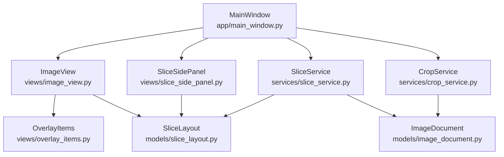
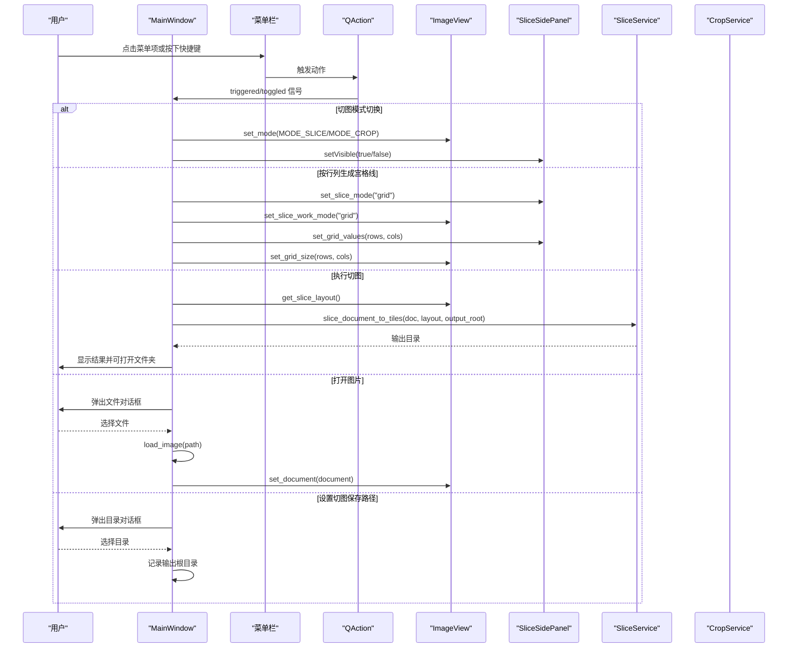
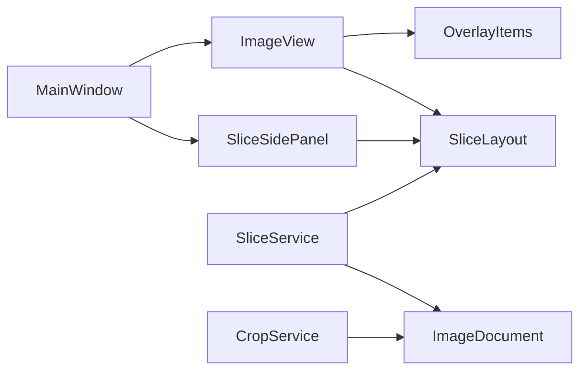

# 菜单与动作管理

<cite>
**本文引用的文件**
- [main_window.py](file://img_slicer_tool/app/main_window.py)
- [image_view.py](file://img_slicer_tool/views/image_view.py)
- [slice_side_panel.py](file://img_slicer_tool/views/slice_side_panel.py)
- [slice_layout.py](file://img_slicer_tool/models/slice_layout.py)
- [slice_service.py](file://img_slicer_tool/services/slice_service.py)
- [crop_service.py](file://img_slicer_tool/services/crop_service.py)
- [overlay_items.py](file://img_slicer_tool/views/overlay_items.py)
- [image_document.py](file://img_slicer_tool/models/image_document.py)
</cite>

## 目录
1. [引言](#引言)
2. [项目结构](#项目结构)
3. [核心组件](#核心组件)
4. [架构总览](#架构总览)
5. [详细组件分析](#详细组件分析)
6. [依赖关系分析](#依赖关系分析)
7. [性能考虑](#性能考虑)
8. [故障排查指南](#故障排查指南)
9. [结论](#结论)

## 引言
本技术文档聚焦于 MainWindow 的菜单与动作管理，系统性阐述以下内容：
- _create_actions 与 _create_menus 如何协同工作，构建菜单栏与动作集合
- QAction 对象的创建流程，包括文本、快捷键与可检查状态的设置
- 菜单栏结构设计，重点解析“文件”、“编辑”、“切图”三类菜单的组织逻辑
- 动作与 UI 元素的关联机制，以及这些 UI 元素如何触发后续业务逻辑
- 提供代码示例的路径定位，帮助读者快速定位实现细节

## 项目结构
围绕菜单与动作管理的关键文件与职责如下：
- app/main_window.py：主窗口类，负责动作创建、菜单构建与信号连接
- views/image_view.py：图像视图，承载裁剪与切图交互，并发出业务信号
- views/slice_side_panel.py：切图侧边栏，提供切图方式与工具选择，发出切图相关信号
- models/slice_layout.py：切图布局数据模型，描述预览坐标系下的切线集合
- services/slice_service.py：切图服务，执行切图并将结果写入磁盘
- services/crop_service.py：裁剪服务，基于预览矩形执行裁剪
- views/overlay_items.py：覆盖层图形项，用于绘制裁剪矩形与切图线
- models/image_document.py：图像文档数据模型，封装图像元信息与预览图

图表来源
- [main_window.py](file://img_slicer_tool/app/main_window.py#L32-L112)
- [image_view.py](file://img_slicer_tool/views/image_view.py#L24-L120)
- [slice_side_panel.py](file://img_slicer_tool/views/slice_side_panel.py#L19-L60)
- [slice_layout.py](file://img_slicer_tool/models/slice_layout.py#L7-L30)
- [slice_service.py](file://img_slicer_tool/services/slice_service.py#L12-L62)
- [crop_service.py](file://img_slicer_tool/services/crop_service.py#L13-L38)
- [overlay_items.py](file://img_slicer_tool/views/overlay_items.py#L8-L64)
- [image_document.py](file://img_slicer_tool/models/image_document.py#L8-L18)

章节来源
- [main_window.py](file://img_slicer_tool/app/main_window.py#L32-L112)

## 核心组件
- MainWindow：初始化主窗口、创建动作、构建菜单、连接信号；处理打开图片、设置切图输出目录、执行切图等业务逻辑
- QAction 集合：包含打开图片、退出、切图模式切换、按行列生成宫格线、执行切图、设置切图保存路径等动作
- 菜单栏：由“文件”、“编辑”、“切图”三个菜单组成，分别挂载相应动作
- ImageView：承载裁剪与切图交互，发出裁剪请求、图像拖放等信号
- SliceSidePanel：切图侧边栏，提供切图方式与工具选择，发出切图相关信号
- SliceLayout：切图布局数据模型，用于描述预览坐标系下的切线集合
- SliceService/CropService：切图与裁剪的服务实现，负责实际的图像处理与文件写入

章节来源
- [main_window.py](file://img_slicer_tool/app/main_window.py#L52-L101)
- [image_view.py](file://img_slicer_tool/views/image_view.py#L24-L120)
- [slice_side_panel.py](file://img_slicer_tool/views/slice_side_panel.py#L19-L60)
- [slice_layout.py](file://img_slicer_tool/models/slice_layout.py#L7-L30)
- [slice_service.py](file://img_slicer_tool/services/slice_service.py#L12-L62)
- [crop_service.py](file://img_slicer_tool/services/crop_service.py#L13-L38)

## 架构总览
MainWindow 通过 _create_actions 创建一组 QAction 对象，再通过 _create_menus 将这些动作组织到菜单栏的不同菜单下。随后，_connect_signals 将动作与 UI 事件、视图信号进行绑定，形成从用户交互到业务逻辑的完整链路。

图表来源
- [main_window.py](file://img_slicer_tool/app/main_window.py#L52-L101)
- [main_window.py](file://img_slicer_tool/app/main_window.py#L102-L135)
- [main_window.py](file://img_slicer_tool/app/main_window.py#L194-L210)
- [main_window.py](file://img_slicer_tool/app/main_window.py#L230-L262)
- [main_window.py](file://img_slicer_tool/app/main_window.py#L204-L209)
- [image_view.py](file://img_slicer_tool/views/image_view.py#L236-L254)
- [slice_service.py](file://img_slicer_tool/services/slice_service.py#L12-L62)

## 详细组件分析

### QAction 创建与属性设置
- 文本与快捷键：每个动作均设置明确的显示文本与快捷键，便于用户快速操作
- 可检查状态：切图模式动作被设置为可检查，以支持切换状态
- 动作集合：包含打开图片、退出、切图模式切换、按行列生成宫格线、执行切图、设置切图保存路径

代码示例路径
- [动作创建与属性设置](file://img_slicer_tool/app/main_window.py#L52-L70)

章节来源
- [main_window.py](file://img_slicer_tool/app/main_window.py#L52-L70)

### 菜单栏结构设计
- 文件菜单：包含“打开图片”“设置切图保存路径”“退出”，用于文件操作与环境配置
- 编辑菜单：包含“切图模式”，用于切换切图与裁剪模式
- 切图菜单：包含“按行列生成宫格线”“执行切图”，用于切图工作流

代码示例路径
- [菜单创建与动作挂载](file://img_slicer_tool/app/main_window.py#L71-L87)

章节来源
- [main_window.py](file://img_slicer_tool/app/main_window.py#L71-L87)

### 动作与 UI 元素的关联机制
- MainWindow 初始化时调用 _create_actions 与 _create_menus，随后在 _connect_signals 中建立信号连接
- ImageView 与 SliceSidePanel 发出多种业务信号，MainWindow 作为中枢进行响应与协调
- 通过信号槽机制，动作触发与视图交互解耦，提升模块内聚与可维护性

代码示例路径
- [信号连接](file://img_slicer_tool/app/main_window.py#L87-L101)
- [ImageView 信号定义](file://img_slicer_tool/views/image_view.py#L24-L31)
- [SliceSidePanel 信号定义](file://img_slicer_tool/views/slice_side_panel.py#L22-L26)

章节来源
- [main_window.py](file://img_slicer_tool/app/main_window.py#L87-L101)
- [image_view.py](file://img_slicer_tool/views/image_view.py#L24-L31)
- [slice_side_panel.py](file://img_slicer_tool/views/slice_side_panel.py#L22-L26)

### “文件”菜单：打开图片与退出
- 打开图片：通过文件对话框选择图片，加载成功后更新状态栏与视图
- 退出：直接关闭窗口

代码示例路径
- [打开图片对话框与加载流程](file://img_slicer_tool/app/main_window.py#L102-L135)
- [退出动作连接](file://img_slicer_tool/app/main_window.py#L87-L91)

章节来源
- [main_window.py](file://img_slicer_tool/app/main_window.py#L102-L135)
- [main_window.py](file://img_slicer_tool/app/main_window.py#L87-L91)

### “编辑”菜单：切图模式切换
- 切图模式切换：切换 ImageView 的模式与 SliceSidePanel 的可见性，并更新状态栏提示
- 切换逻辑：当切换到切图模式时，确保切图面板可见；退出切图模式时恢复裁剪模式

代码示例路径
- [切图模式切换处理](file://img_slicer_tool/app/main_window.py#L194-L203)

章节来源
- [main_window.py](file://img_slicer_tool/app/main_window.py#L194-L203)

### “切图”菜单：按行列生成宫格线与执行切图
- 按行列生成宫格线：弹出输入对话框获取行数与列数，设置切图工作模式为网格，更新 ImageView 与 SliceSidePanel 的网格值
- 执行切图：收集当前布局，计算切片数量，调用切图服务，显示结果并可打开输出文件夹

代码示例路径
- [生成宫格线流程](file://img_slicer_tool/app/main_window.py#L210-L229)
- [执行切图流程](file://img_slicer_tool/app/main_window.py#L230-L262)
- [切图布局数据模型](file://img_slicer_tool/models/slice_layout.py#L7-L30)
- [切图服务实现](file://img_slicer_tool/services/slice_service.py#L12-L62)

章节来源
- [main_window.py](file://img_slicer_tool/app/main_window.py#L210-L229)
- [main_window.py](file://img_slicer_tool/app/main_window.py#L230-L262)
- [slice_layout.py](file://img_slicer_tool/models/slice_layout.py#L7-L30)
- [slice_service.py](file://img_slicer_tool/services/slice_service.py#L12-L62)

### 切图侧边栏与视图的协作
- 切图侧边栏：提供“网格模式”“手动模式”切换，以及“水平线”“垂直线”“十字线”“选择”工具
- 视图交互：ImageView 根据模式与工具绘制覆盖层图形项（裁剪矩形与切图线），并通过信号向 MainWindow 传递业务事件

代码示例路径
- [切图侧边栏 UI 与信号](file://img_slicer_tool/views/slice_side_panel.py#L19-L60)
- [覆盖层图形项](file://img_slicer_tool/views/overlay_items.py#L8-L64)
- [视图中的切图逻辑](file://img_slicer_tool/views/image_view.py#L236-L254)

章节来源
- [slice_side_panel.py](file://img_slicer_tool/views/slice_side_panel.py#L19-L60)
- [overlay_items.py](file://img_slicer_tool/views/overlay_items.py#L8-L64)
- [image_view.py](file://img_slicer_tool/views/image_view.py#L236-L254)

### 裁剪功能与动作联动
- 裁剪请求：当用户在 ImageView 中完成裁剪矩形选择后，发出裁剪请求信号，MainWindow 进行确认与执行
- 裁剪服务：根据预览坐标转换到原图坐标，执行裁剪并保存新图像，更新当前文档与视图

代码示例路径
- [裁剪请求处理](file://img_slicer_tool/app/main_window.py#L136-L193)
- [裁剪服务实现](file://img_slicer_tool/services/crop_service.py#L13-L38)

章节来源
- [main_window.py](file://img_slicer_tool/app/main_window.py#L136-L193)
- [crop_service.py](file://img_slicer_tool/services/crop_service.py#L13-L38)

## 依赖关系分析
- MainWindow 依赖 ImageView 与 SliceSidePanel 的信号，以驱动业务流程
- ImageView 依赖 OverlayItems 绘制覆盖层图形项，并依赖 SliceLayout 描述切图布局
- SliceService 依赖 SliceLayout 与 ImageDocument，执行切图并将结果写入磁盘
- CropService 依赖 ImageDocument 与图像加载器，执行裁剪并返回新文档

图表来源
- [main_window.py](file://img_slicer_tool/app/main_window.py#L32-L112)
- [image_view.py](file://img_slicer_tool/views/image_view.py#L24-L120)
- [slice_side_panel.py](file://img_slicer_tool/views/slice_side_panel.py#L19-L60)
- [overlay_items.py](file://img_slicer_tool/views/overlay_items.py#L8-L64)
- [slice_layout.py](file://img_slicer_tool/models/slice_layout.py#L7-L30)
- [slice_service.py](file://img_slicer_tool/services/slice_service.py#L12-L62)
- [crop_service.py](file://img_slicer_tool/services/crop_service.py#L13-L38)
- [image_document.py](file://img_slicer_tool/models/image_document.py#L8-L18)

章节来源
- [main_window.py](file://img_slicer_tool/app/main_window.py#L32-L112)
- [image_view.py](file://img_slicer_tool/views/image_view.py#L24-L120)
- [slice_side_panel.py](file://img_slicer_tool/views/slice_side_panel.py#L19-L60)
- [overlay_items.py](file://img_slicer_tool/views/overlay_items.py#L8-L64)
- [slice_layout.py](file://img_slicer_tool/models/slice_layout.py#L7-L30)
- [slice_service.py](file://img_slicer_tool/services/slice_service.py#L12-L62)
- [crop_service.py](file://img_slicer_tool/services/crop_service.py#L13-L38)
- [image_document.py](file://img_slicer_tool/models/image_document.py#L8-L18)

## 性能考虑
- 动作与菜单的创建与连接发生在主窗口初始化阶段，避免运行时重复构造
- 切图执行前会进行布局校验与提示，减少无效操作带来的资源浪费
- 切图服务采用批量写入策略，按网格遍历生成切片，避免不必要的内存占用
- 裁剪服务在执行前进行路径与格式校验，降低异常处理成本

## 故障排查指南
- 打开图片失败：检查文件是否存在与格式是否受支持；查看状态栏提示与错误对话框
- 切图未生成任何切片：确认已设置切图保存路径或允许使用默认路径；检查是否有切图线
- 切图模式切换异常：确认切图模式动作处于正确状态；检查切图面板与视图的可见性同步
- 裁剪后无响应：确认裁剪请求信号是否被正确发出；检查裁剪服务执行日志

章节来源
- [main_window.py](file://img_slicer_tool/app/main_window.py#L114-L135)
- [main_window.py](file://img_slicer_tool/app/main_window.py#L230-L262)
- [main_window.py](file://img_slicer_tool/app/main_window.py#L194-L203)

## 结论
MainWindow 的菜单与动作管理通过清晰的动作创建、规范的菜单组织与稳定的信号连接，实现了从用户交互到业务逻辑的顺畅流转。切图模式与裁剪模式的切换、网格与手动两种切图方式的协作，以及服务层对图像处理的封装，共同构成了高效、易用的切图工具链。建议在后续迭代中进一步增强错误提示与日志记录，以提升用户体验与可维护性。