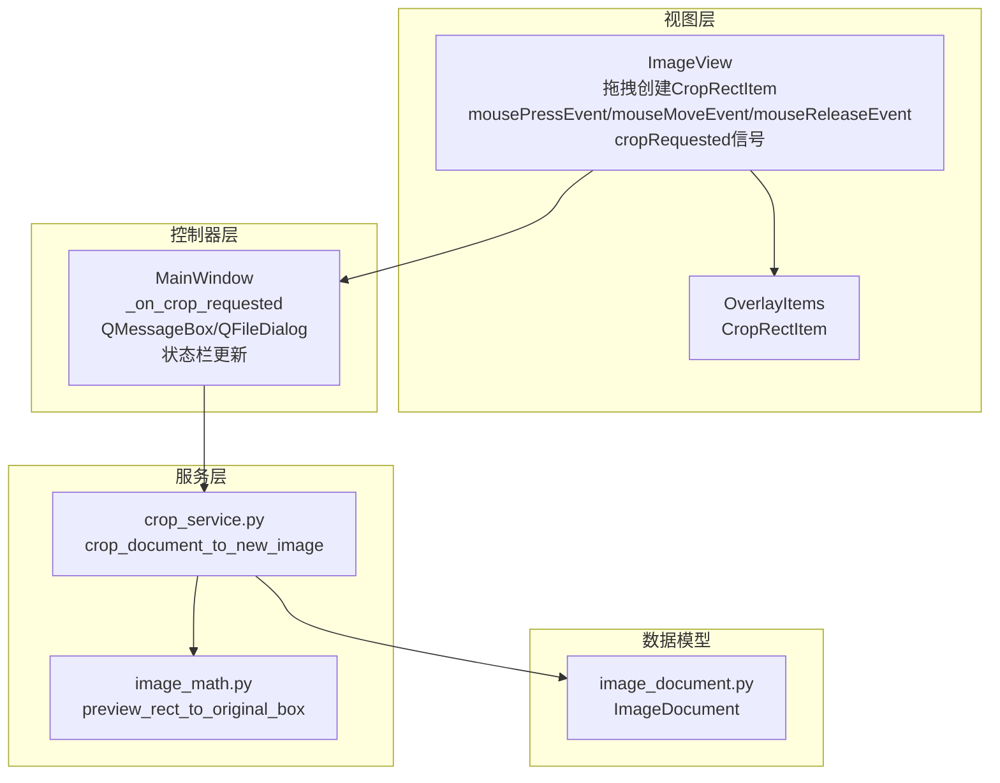
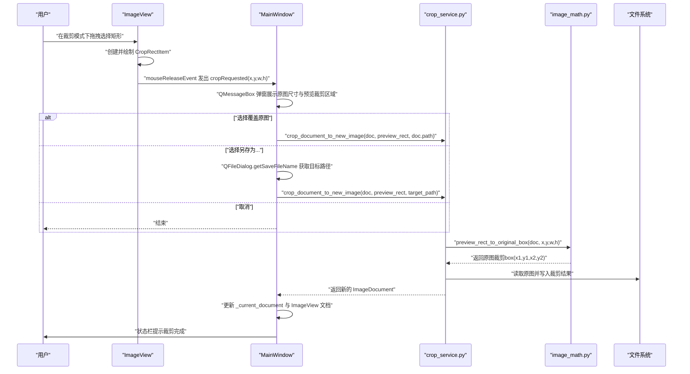
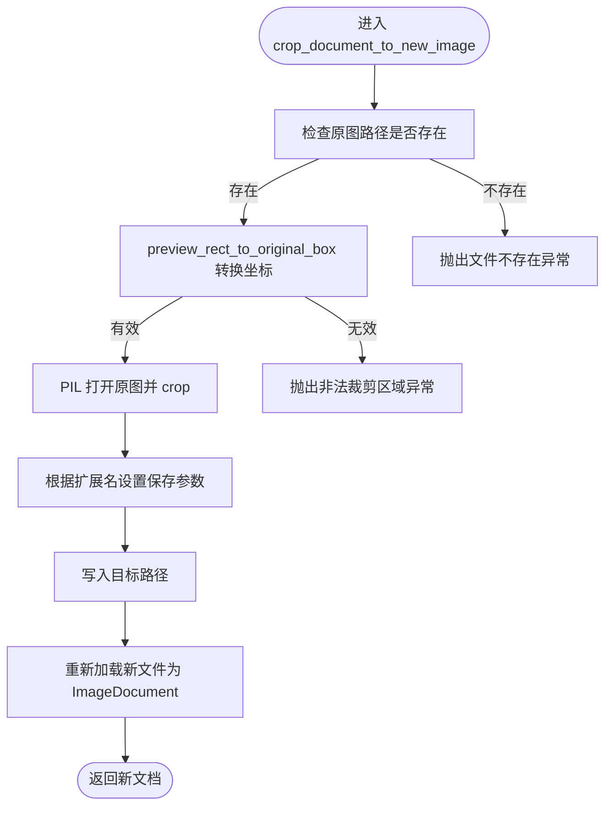
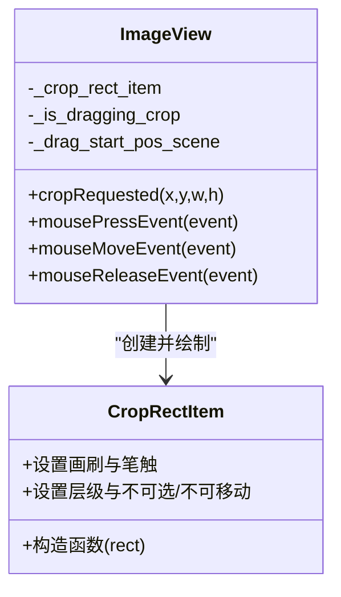
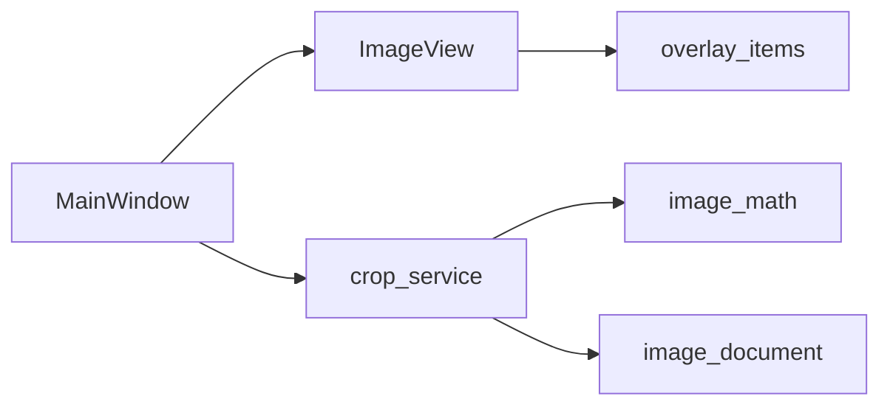

# 裁剪操作实现

<cite>
**本文引用的文件**
- [main_window.py](file://img_slicer_tool/app/main_window.py)
- [image_view.py](file://img_slicer_tool/views/image_view.py)
- [overlay_items.py](file://img_slicer_tool/views/overlay_items.py)
- [crop_service.py](file://img_slicer_tool/services/crop_service.py)
- [image_math.py](file://img_slicer_tool/utils/image_math.py)
- [image_document.py](file://img_slicer_tool/models/image_document.py)
</cite>

## 目录
1. [简介](#简介)
2. [项目结构](#项目结构)
3. [核心组件](#核心组件)
4. [架构总览](#架构总览)
5. [详细组件分析](#详细组件分析)
6. [依赖关系分析](#依赖关系分析)
7. [性能考量](#性能考量)
8. [故障排查指南](#故障排查指南)
9. [结论](#结论)

## 简介
本技术文档围绕“图像裁剪”功能展开，重点解析从用户在视图中拖拽选择裁剪区域，到接收裁剪请求信号、弹窗确认、执行裁剪并更新UI的完整流程。文档详细说明：
- 如何通过 QMessageBox 展示原图尺寸与预览裁剪区域信息，并提供“覆盖原图”、“另存为”、“取消”三种选项；
- QFileDialog.getSaveFileName 在“另存为”场景下的使用；
- 裁剪参数如何通过 crop_document_to_new_image 服务进行坐标转换与实际裁剪；
- 错误处理机制与裁剪完成后的 UI 状态更新。

## 项目结构
裁剪功能涉及以下模块：
- 视图层：负责交互与裁剪矩形绘制、信号发射；
- 控制器层：主窗口响应裁剪请求，组织对话框与业务流程；
- 服务层：执行裁剪与文件写入；
- 数学工具：预览坐标到原图坐标的转换；
- 数据模型：封装图像文档元数据。

图表来源
- [image_view.py](file://img_slicer_tool/views/image_view.py#L150-L235)
- [overlay_items.py](file://img_slicer_tool/views/overlay_items.py#L8-L26)
- [main_window.py](file://img_slicer_tool/app/main_window.py#L136-L193)
- [crop_service.py](file://img_slicer_tool/services/crop_service.py#L13-L38)
- [image_math.py](file://img_slicer_tool/utils/image_math.py#L17-L48)
- [image_document.py](file://img_slicer_tool/models/image_document.py#L8-L18)

章节来源
- [main_window.py](file://img_slicer_tool/app/main_window.py#L87-L146)
- [image_view.py](file://img_slicer_tool/views/image_view.py#L150-L235)

## 核心组件
- MainWindow._on_crop_requested：接收裁剪请求信号，弹窗确认，处理覆盖原图或另存为，调用服务执行裁剪并更新UI。
- ImageView：在裁剪模式下捕获鼠标事件，绘制 CropRectItem，释放时发射 cropRequested 信号。
- CropRectItem：用于在场景中绘制半透明虚线矩形，表示预览裁剪区域。
- crop_document_to_new_image：服务函数，负责坐标转换与实际裁剪写入。
- preview_rect_to_original_box：将预览坐标转换为原图像素坐标。
- ImageDocument：承载图像的原始尺寸、预览尺寸、缩放比例与预览图等元数据。

章节来源
- [main_window.py](file://img_slicer_tool/app/main_window.py#L136-L193)
- [image_view.py](file://img_slicer_tool/views/image_view.py#L150-L235)
- [overlay_items.py](file://img_slicer_tool/views/overlay_items.py#L8-L26)
- [crop_service.py](file://img_slicer_tool/services/crop_service.py#L13-L38)
- [image_math.py](file://img_slicer_tool/utils/image_math.py#L17-L48)
- [image_document.py](file://img_slicer_tool/models/image_document.py#L8-L18)

## 架构总览
裁剪流程采用“视图-控制器-服务-模型”的分层设计：
- 视图层负责用户交互与裁剪区域可视化；
- 控制器层负责业务流程编排与错误处理；
- 服务层负责具体裁剪逻辑与文件写入；
- 模型层提供图像元数据支撑坐标转换。

图表来源
- [image_view.py](file://img_slicer_tool/views/image_view.py#L150-L235)
- [main_window.py](file://img_slicer_tool/app/main_window.py#L136-L193)
- [crop_service.py](file://img_slicer_tool/services/crop_service.py#L13-L38)
- [image_math.py](file://img_slicer_tool/utils/image_math.py#L17-L48)

## 详细组件分析

### 组件A：裁剪请求信号与弹窗确认
- 信号发射：在 mouseReleaseEvent 中，当裁剪矩形宽度与高度均达到最小阈值时，发射 cropRequested(x, y, w, h)，其中坐标来自 CropRectItem 的矩形。
- 弹窗展示：在 _on_crop_requested 中，拼接原图尺寸与预览裁剪区域信息，使用 QMessageBox 提示用户选择“覆盖原图”、“另存为”、“取消”。
- 选择分支：
  - 覆盖原图：直接使用当前文档路径作为目标路径；
  - 另存为：调用 QFileDialog.getSaveFileName，传入默认保存路径与过滤器，若未选择则终止；
  - 取消：直接返回，不执行裁剪。

章节来源
- [image_view.py](file://img_slicer_tool/views/image_view.py#L150-L235)
- [main_window.py](file://img_slicer_tool/app/main_window.py#L136-L193)

### 组件B：坐标转换与实际裁剪
- 坐标转换：crop_document_to_new_image 接收预览坐标 (x, y, w, h)，调用 preview_rect_to_original_box 将其映射到原图像素坐标 (x1, y1, x2, y2)。该函数根据 ImageDocument 的 scale_x/scale_y 进行缩放，并对边界进行安全校验。
- 实际裁剪：使用 PIL 打开原图，按转换得到的 box 进行 crop，针对 JPEG/JPG 写入时设置质量与子采样参数，随后重新加载新文件为 ImageDocument 返回。

图表来源
- [crop_service.py](file://img_slicer_tool/services/crop_service.py#L13-L38)
- [image_math.py](file://img_slicer_tool/utils/image_math.py#L17-L48)
- [image_document.py](file://img_slicer_tool/models/image_document.py#L8-L18)

章节来源
- [crop_service.py](file://img_slicer_tool/services/crop_service.py#L13-L38)
- [image_math.py](file://img_slicer_tool/utils/image_math.py#L17-L48)

### 组件C：UI状态更新与错误处理
- 错误处理：
  - 文件不存在：在 _on_crop_requested 中捕获异常并弹出错误提示；
  - 坐标转换异常：preview_rect_to_original_box 对宽高与边界进行校验，非法时抛出异常；
  - 裁剪过程异常：统一捕获并提示“裁剪失败”。
- UI更新：
  - 成功后：更新 _current_document 与 ImageView 的文档；
  - 状态栏：显示新文件名、原始尺寸与预览尺寸，持续时间较短以便用户关注。

章节来源
- [main_window.py](file://img_slicer_tool/app/main_window.py#L136-L193)
- [crop_service.py](file://img_slicer_tool/services/crop_service.py#L13-L38)
- [image_math.py](file://img_slicer_tool/utils/image_math.py#L17-L48)

### 组件D：裁剪矩形绘制与交互
- 创建与绘制：在 mousePressEvent 中，若处于裁剪模式且点击落在预览图内，则创建 CropRectItem 并加入场景。
- 拖拽更新：在 mouseMoveEvent 中，限制拖拽范围在预览图边界内，实时更新 CropRectItem 的矩形。
- 释放发射：在 mouseReleaseEvent 中，若矩形尺寸超过阈值，则发射 cropRequested 信号；同时移除临时矩形。

图表来源
- [image_view.py](file://img_slicer_tool/views/image_view.py#L150-L235)
- [overlay_items.py](file://img_slicer_tool/views/overlay_items.py#L8-L26)

章节来源
- [image_view.py](file://img_slicer_tool/views/image_view.py#L150-L235)
- [overlay_items.py](file://img_slicer_tool/views/overlay_items.py#L8-L26)

## 依赖关系分析
- MainWindow 依赖 ImageView 的 cropRequested 信号；
- MainWindow 调用 crop_service.crop_document_to_new_image；
- crop_service 依赖 image_math.preview_rect_to_original_box；
- crop_service 与 image_document 共同作用于裁剪结果的生成与返回；
- ImageView 依赖 OverlayItems 绘制裁剪矩形。

图表来源
- [main_window.py](file://img_slicer_tool/app/main_window.py#L87-L101)
- [image_view.py](file://img_slicer_tool/views/image_view.py#L240-L253)
- [crop_service.py](file://img_slicer_tool/services/crop_service.py#L13-L38)
- [image_math.py](file://img_slicer_tool/utils/image_math.py#L17-L48)
- [overlay_items.py](file://img_slicer_tool/views/overlay_items.py#L8-L26)
- [image_document.py](file://img_slicer_tool/models/image_document.py#L8-L18)

章节来源
- [main_window.py](file://img_slicer_tool/app/main_window.py#L87-L101)
- [image_view.py](file://img_slicer_tool/views/image_view.py#L240-L253)

## 性能考量
- 坐标转换复杂度：O(1)，仅进行乘法与取整，开销极低；
- 裁剪写入：PIL crop 与保存为 O(W×H) 级别，受裁剪区域大小影响；
- UI更新：仅更新状态栏与文档指针，成本低；
- 建议：
  - 对大图裁剪时，建议限制预览区域大小或提前提示；
  - JPEG 写入参数已针对质量与压缩做优化，避免额外处理。

## 故障排查指南
- 无法弹出“另存为”对话框：
  - 检查 QFileDialog.getSaveFileName 是否被取消或未返回有效路径；
  - 确认 MainWindow 的父窗口句柄有效。
- 裁剪失败：
  - 查看异常信息，确认原图路径是否存在；
  - 检查预览裁剪区域是否过小或越界；
  - 确认目标路径可写。
- 裁剪后UI未更新：
  - 确认 crop_document_to_new_image 返回的新文档已被赋值给 _current_document；
  - 确认 ImageView.set_document 已被调用。

章节来源
- [main_window.py](file://img_slicer_tool/app/main_window.py#L136-L193)
- [crop_service.py](file://img_slicer_tool/services/crop_service.py#L13-L38)
- [image_math.py](file://img_slicer_tool/utils/image_math.py#L17-L48)

## 结论
本裁剪流程通过清晰的分层设计实现了从用户交互到文件写入的完整闭环：视图层负责直观的裁剪区域选择与信号发射，控制器层负责弹窗确认与错误处理，服务层完成坐标转换与裁剪写入，模型层提供必要的元数据支撑。整体流程简洁可靠，具备良好的扩展性与可维护性。