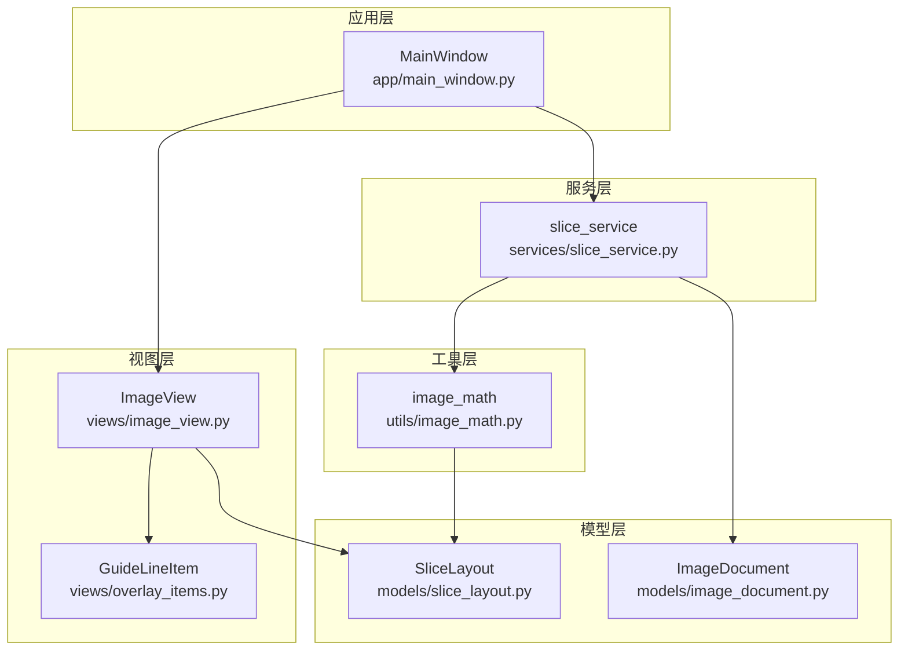
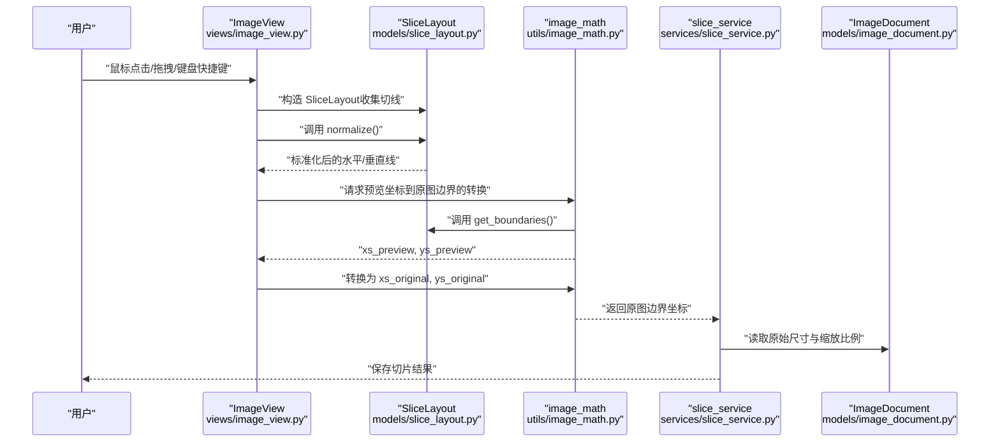
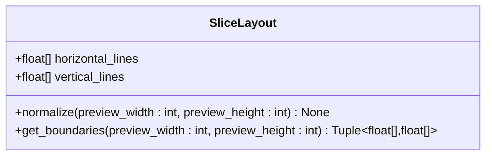
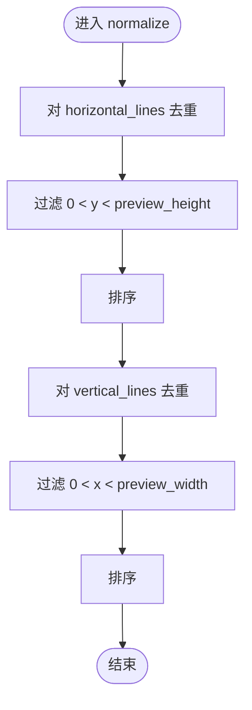
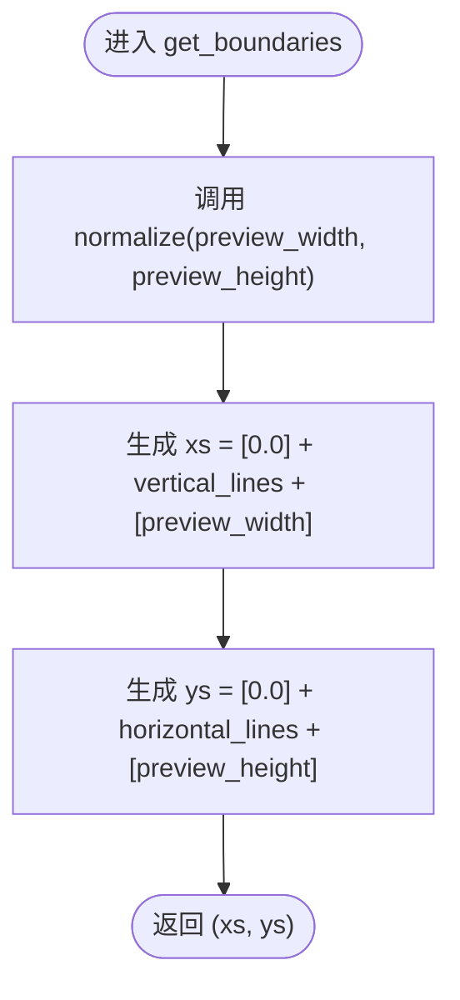
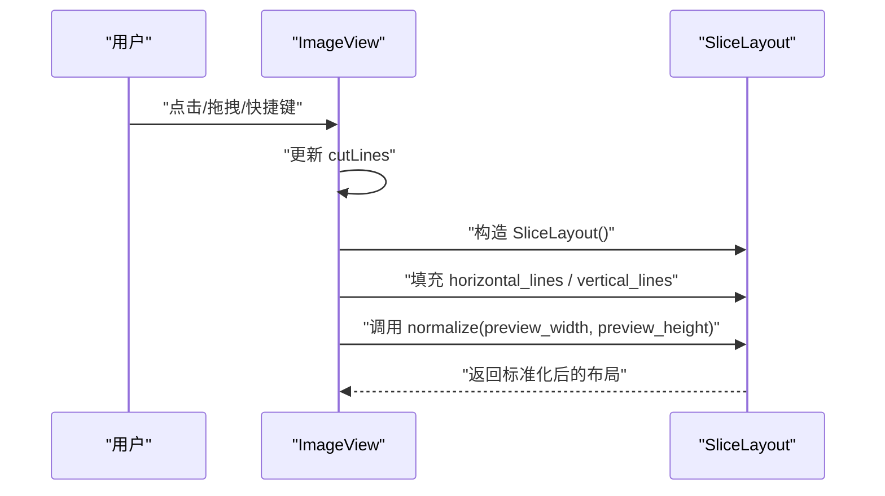
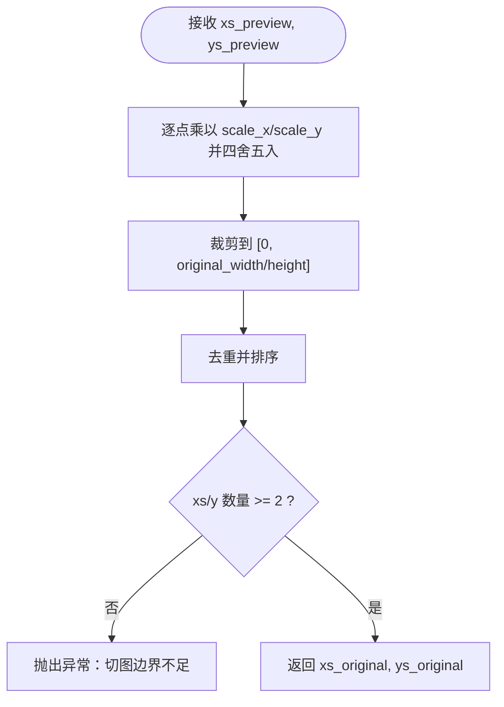
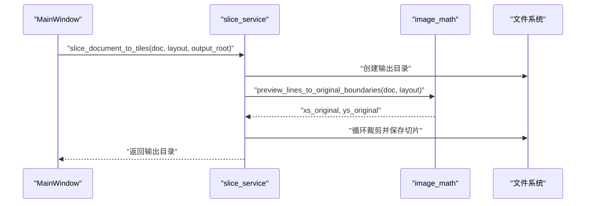
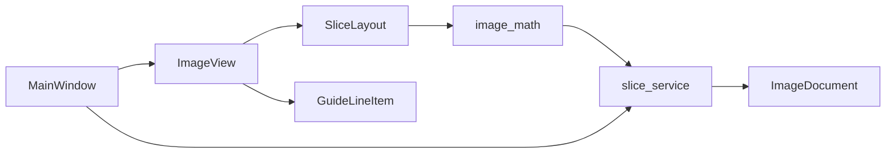

# 切图布局模型设计

<cite>
**本文引用的文件**
- [models/slice_layout.py](file://img_slicer_tool/models/slice_layout.py)
- [utils/image_math.py](file://img_slicer_tool/utils/image_math.py)
- [services/slice_service.py](file://img_slicer_tool/services/slice_service.py)
- [views/image_view.py](file://img_slicer_tool/views/image_view.py)
- [views/overlay_items.py](file://img_slicer_tool/views/overlay_items.py)
- [models/image_document.py](file://img_slicer_tool/models/image_document.py)
- [app/main_window.py](file://img_slicer_tool/app/main_window.py)
</cite>

## 目录
1. [引言](#引言)
2. [项目结构](#项目结构)
3. [核心组件](#核心组件)
4. [架构总览](#架构总览)
5. [详细组件分析](#详细组件分析)
6. [依赖关系分析](#依赖关系分析)
7. [性能考量](#性能考量)
8. [故障排查指南](#故障排查指南)
9. [结论](#结论)

## 引言
本文件围绕 PictureMaster 中的 SliceLayout 数据模型展开，系统性阐述其在预览坐标系下对切图线布局的管理机制，重点覆盖以下方面：
- SliceLayout 如何以不可变数据结构承载水平线与垂直线坐标列表；
- normalize 方法如何通过集合去重与边界过滤确保有效性与有序性；
- get_boundaries 方法如何调用 normalize 并生成包含图像边界的完整分割坐标列表；
- 该模型如何保证切图配置一致性，并由 slice_service.slice_document_to_tiles 进行消费；
- 结合 image_view.py 用户交互流程，展示 SliceLayout 在视图与服务层之间的数据流转；
- 提供方法调用示例与边界处理的异常情况说明。

## 项目结构
本项目采用“模型-视图-服务-工具-应用窗口”的分层组织方式，其中与 SliceLayout 相关的关键文件如下：
- 模型层：slice_layout.py（数据模型）、image_document.py（图像文档信息）
- 视图层：image_view.py（用户交互与切线收集）、overlay_items.py（切线渲染）
- 工具层：image_math.py（预览坐标到原图坐标的边界转换）
- 服务层：slice_service.py（切图执行与保存）
- 应用层：app/main_window.py（菜单触发与流程编排）

图表来源
- [models/slice_layout.py](file://img_slicer_tool/models/slice_layout.py#L1-L30)
- [models/image_document.py](file://img_slicer_tool/models/image_document.py#L1-L18)
- [views/image_view.py](file://img_slicer_tool/views/image_view.py#L1-L542)
- [views/overlay_items.py](file://img_slicer_tool/views/overlay_items.py#L1-L64)
- [utils/image_math.py](file://img_slicer_tool/utils/image_math.py#L1-L76)
- [services/slice_service.py](file://img_slicer_tool/services/slice_service.py#L1-L62)
- [app/main_window.py](file://img_slicer_tool/app/main_window.py#L63-L287)

章节来源
- [models/slice_layout.py](file://img_slicer_tool/models/slice_layout.py#L1-L30)
- [models/image_document.py](file://img_slicer_tool/models/image_document.py#L1-L18)
- [views/image_view.py](file://img_slicer_tool/views/image_view.py#L1-L542)
- [views/overlay_items.py](file://img_slicer_tool/views/overlay_items.py#L1-L64)
- [utils/image_math.py](file://img_slicer_tool/utils/image_math.py#L1-L76)
- [services/slice_service.py](file://img_slicer_tool/services/slice_service.py#L1-L62)
- [app/main_window.py](file://img_slicer_tool/app/main_window.py#L63-L287)

## 核心组件
- SliceLayout：不可变数据结构，保存预览坐标系下的水平线与垂直线坐标列表；提供 normalize 与 get_boundaries 两个关键方法，确保坐标有效、有序且包含图像边界。
- ImageDocument：封装图像的原始尺寸、预览尺寸与缩放比例等元信息，为坐标转换提供依据。
- ImageView：负责用户交互，收集切线并构建 SliceLayout；在网格模式与手动模式之间切换。
- image_math：提供预览坐标到原图坐标的边界转换，确保切图落在有效范围内。
- slice_service：消费 SliceLayout 与 ImageDocument，执行切图并将结果保存到指定目录。
- MainWindow：菜单触发执行切图流程，组装参数并处理异常。

章节来源
- [models/slice_layout.py](file://img_slicer_tool/models/slice_layout.py#L1-L30)
- [models/image_document.py](file://img_slicer_tool/models/image_document.py#L1-L18)
- [views/image_view.py](file://img_slicer_tool/views/image_view.py#L1-L542)
- [utils/image_math.py](file://img_slicer_tool/utils/image_math.py#L1-L76)
- [services/slice_service.py](file://img_slicer_tool/services/slice_service.py#L1-L62)
- [app/main_window.py](file://img_slicer_tool/app/main_window.py#L63-L287)

## 架构总览
SliceLayout 作为数据模型，贯穿“视图采集 -> 工具转换 -> 服务执行”的主链路：
- 视图层通过用户交互收集切线，构建 SliceLayout；
- 工具层将预览坐标转换为原图边界；
- 服务层读取原图并按边界裁剪保存；
- 应用层编排菜单与对话框，驱动整个流程。

图表来源
- [views/image_view.py](file://img_slicer_tool/views/image_view.py#L236-L253)
- [models/slice_layout.py](file://img_slicer_tool/models/slice_layout.py#L14-L29)
- [utils/image_math.py](file://img_slicer_tool/utils/image_math.py#L50-L76)
- [services/slice_service.py](file://img_slicer_tool/services/slice_service.py#L12-L62)
- [models/image_document.py](file://img_slicer_tool/models/image_document.py#L1-L18)

## 详细组件分析

### SliceLayout 类设计与职责
- 字段
  - horizontal_lines：预览坐标系下的水平线 y 坐标列表（浮点数）。
  - vertical_lines：预览坐标系下的垂直线 x 坐标列表（浮点数）。
- 方法
  - normalize(preview_width, preview_height)：对两条列表分别进行集合去重与边界过滤（0 < x < preview_width，0 < y < preview_height），并排序，确保坐标有效、有序。
  - get_boundaries(preview_width, preview_height)：先调用 normalize，再拼接图像边界，返回 xs = [0.0] + vertical_lines + [preview_width] 与 ys = [0.0] + horizontal_lines + [preview_height]，形成完整的分割坐标序列。

图表来源
- [models/slice_layout.py](file://img_slicer_tool/models/slice_layout.py#L7-L29)

章节来源
- [models/slice_layout.py](file://img_slicer_tool/models/slice_layout.py#L7-L29)

### normalize 方法实现逻辑
- 集合去重：利用集合去除重复坐标，避免冗余边界导致的无效区域。
- 边界过滤：仅保留位于图像内部的坐标（严格大于 0，小于对应维度），确保不会越界。
- 排序：对两条列表分别排序，保证后续边界序列的顺序性与可预测性。
- 不可变性：该方法在原对象上就地修改字段，保持 SliceLayout 的不可变语义（对外表现为不可变，内部通过就地更新维持高效性）。

图表来源
- [models/slice_layout.py](file://img_slicer_tool/models/slice_layout.py#L14-L18)

章节来源
- [models/slice_layout.py](file://img_slicer_tool/models/slice_layout.py#L14-L18)

### get_boundaries 方法与边界生成
- 调用链：先调用 normalize，确保坐标有效、有序且无越界。
- 边界拼接：在水平方向拼接 [0.0] + vertical_lines + [preview_width]，在垂直方向拼接 [0.0] + horizontal_lines + [preview_height]，从而形成完整的分割坐标序列。
- 返回值：返回 xs 与 ys 两组坐标列表，作为后续切图的边界划分依据。

图表来源
- [models/slice_layout.py](file://img_slicer_tool/models/slice_layout.py#L19-L29)

章节来源
- [models/slice_layout.py](file://img_slicer_tool/models/slice_layout.py#L19-L29)

### 视图层交互与 SliceLayout 的构建
- ImageView 在切图模式下维护切线集合（cutLines），每条记录包含 type（horizontal/vertical）、pos（预览坐标）与 selected 状态。
- 用户交互包括：
  - 网格模式：根据行/列自动生成切线；
  - 手动模式：通过鼠标点击或快捷键生成横线/竖线/十字线；
  - 拖拽：移动已选中的切线；
  - 选择与删除：通过选择工具与 Delete 键删除。
- 构建 SliceLayout：
  - 从 cutLines 中提取水平/垂直线的 pos；
  - 调用 normalize，传入当前预览图的 width/height；
  - 返回标准化后的 SliceLayout。

图表来源
- [views/image_view.py](file://img_slicer_tool/views/image_view.py#L236-L253)
- [views/overlay_items.py](file://img_slicer_tool/views/overlay_items.py#L27-L64)

章节来源
- [views/image_view.py](file://img_slicer_tool/views/image_view.py#L236-L253)
- [views/overlay_items.py](file://img_slicer_tool/views/overlay_items.py#L27-L64)

### 工具层坐标转换与边界去重
- 预览坐标到原图坐标的映射：将预览边界乘以 scale_x 或 scale_y 并四舍五入，同时限制在 [0, original_width] 或 [0, original_height] 范围内。
- 去重与排序：对转换后的坐标再次去重并排序，确保生成的边界序列不含重复点。
- 异常保护：若转换后边界数量不足（xs/y 少于 2），抛出异常，防止产生无效切片。

图表来源
- [utils/image_math.py](file://img_slicer_tool/utils/image_math.py#L50-L76)

章节来源
- [utils/image_math.py](file://img_slicer_tool/utils/image_math.py#L50-L76)

### 服务层切图执行与保存
- 参数校验：检查原图是否存在、输出根目录是否为空。
- 目录准备：以原图名为子目录创建输出目录。
- 边界获取：调用 image_math.preview_lines_to_original_boundaries 获取 xs_original 与 ys_original。
- 循环裁剪：遍历相邻边界对，生成 box 并裁剪保存，注意跳过无效区域（x2 <= x1 或 y2 <= y1）。
- 输出命名：按 rRow_cCol 命名，保持一致性。

图表来源
- [services/slice_service.py](file://img_slicer_tool/services/slice_service.py#L12-L62)
- [utils/image_math.py](file://img_slicer_tool/utils/image_math.py#L50-L76)
- [app/main_window.py](file://img_slicer_tool/app/main_window.py#L230-L262)

章节来源
- [services/slice_service.py](file://img_slicer_tool/services/slice_service.py#L12-L62)
- [app/main_window.py](file://img_slicer_tool/app/main_window.py#L230-L262)

## 依赖关系分析
- SliceLayout 依赖 ImageDocument 的预览尺寸与缩放比例，用于坐标转换；
- ImageView 依赖 OverlayItems 渲染切线，并通过 get_slice_layout 构造 SliceLayout；
- image_math 依赖 SliceLayout 的 get_boundaries 与 ImageDocument 的 scale_x/scale_y；
- slice_service 依赖 image_math 的边界转换与 ImageDocument 的原始尺寸；
- MainWindow 编排视图与服务层交互，触发执行切图。

图表来源
- [views/image_view.py](file://img_slicer_tool/views/image_view.py#L236-L253)
- [views/overlay_items.py](file://img_slicer_tool/views/overlay_items.py#L27-L64)
- [models/slice_layout.py](file://img_slicer_tool/models/slice_layout.py#L19-L29)
- [utils/image_math.py](file://img_slicer_tool/utils/image_math.py#L50-L76)
- [services/slice_service.py](file://img_slicer_tool/services/slice_service.py#L12-L62)
- [models/image_document.py](file://img_slicer_tool/models/image_document.py#L1-L18)
- [app/main_window.py](file://img_slicer_tool/app/main_window.py#L230-L262)

章节来源
- [views/image_view.py](file://img_slicer_tool/views/image_view.py#L236-L253)
- [views/overlay_items.py](file://img_slicer_tool/views/overlay_items.py#L27-L64)
- [models/slice_layout.py](file://img_slicer_tool/models/slice_layout.py#L19-L29)
- [utils/image_math.py](file://img_slicer_tool/utils/image_math.py#L50-L76)
- [services/slice_service.py](file://img_slicer_tool/services/slice_service.py#L12-L62)
- [models/image_document.py](file://img_slicer_tool/models/image_document.py#L1-L18)
- [app/main_window.py](file://img_slicer_tool/app/main_window.py#L230-L262)

## 性能考量
- normalize 的时间复杂度约为 O(n log n)，其中 n 为每条线的数量，主要消耗在排序；集合去重与过滤均为 O(n)。
- get_boundaries 为 O(n log n)，受 normalize 影响。
- image_math 的转换与去重为 O(m)，m 为边界数量；整体仍以排序为主。
- slice_service 的循环为 O(r*c)，r 与 c 分别为行/列数，注意跳过无效区域可减少无效 IO。
- 建议：在大量切线场景下，尽量减少重复 normalize 调用，优先在视图层一次性标准化后再传递给服务层。

[本节为通用性能讨论，不直接分析具体文件]

## 故障排查指南
- 切图边界不足
  - 现象：执行切图时报错提示边界不足。
  - 原因：预览坐标转换后 xs_original 或 ys_original 数量少于 2。
  - 处理：确认切线数量与分布，确保至少形成一个有效区域。
  - 参考路径：[utils/image_math.py](file://img_slicer_tool/utils/image_math.py#L70-L76)
- 输出路径为空
  - 现象：执行切图时报错提示输出根路径不能为空。
  - 原因：未设置切图保存根路径。
  - 处理：在应用层设置输出根路径后再执行。
  - 参考路径：[services/slice_service.py](file://img_slicer_tool/services/slice_service.py#L22-L24)
- 原始图片不存在
  - 现象：执行切图时报错提示原始图片不存在。
  - 原因：ImageDocument.path 指向的文件不存在。
  - 处理：检查文件路径与权限。
  - 参考路径：[services/slice_service.py](file://img_slicer_tool/services/slice_service.py#L19-L21)
- 切线越界或无效
  - 现象：切线位置超出图像范围或重复导致无效区域。
  - 原因：用户拖拽位置越界或重复添加。
  - 处理：依赖 normalize 的边界过滤与去重，确保只保留有效坐标。
  - 参考路径：[models/slice_layout.py](file://img_slicer_tool/models/slice_layout.py#L14-L18)

章节来源
- [utils/image_math.py](file://img_slicer_tool/utils/image_math.py#L70-L76)
- [services/slice_service.py](file://img_slicer_tool/services/slice_service.py#L19-L24)

## 结论
SliceLayout 通过不可变数据结构与标准化方法，确保了切图配置在预览坐标系下的有效性与一致性；配合 image_math 的坐标转换与 slice_service 的切图执行，形成了从视图交互到结果保存的完整闭环。其设计兼顾易用性与健壮性：视图层负责直观的交互体验，工具层保障坐标映射的准确性，服务层确保切图过程的稳定与可扩展。对于大规模切图场景，建议在视图层提前进行坐标去重与边界过滤，以降低后续处理成本。