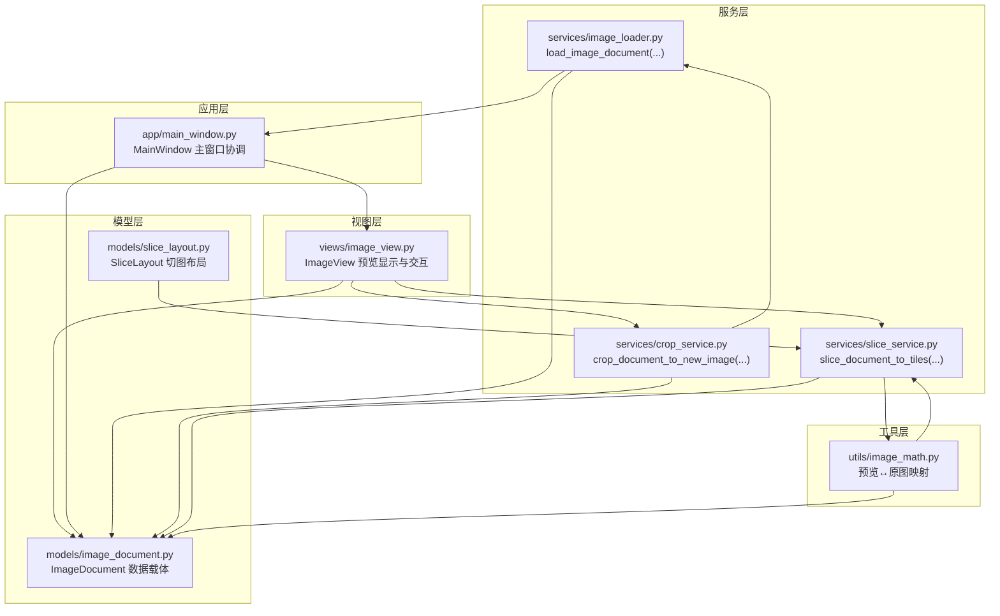
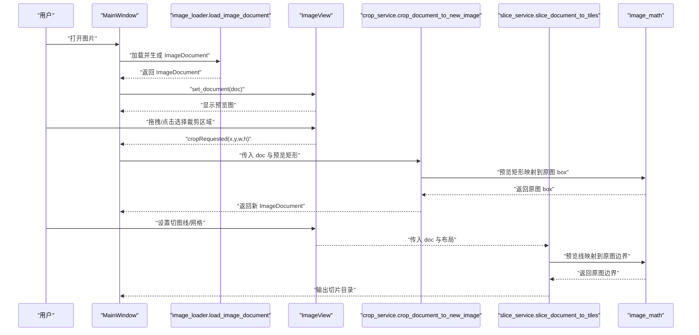
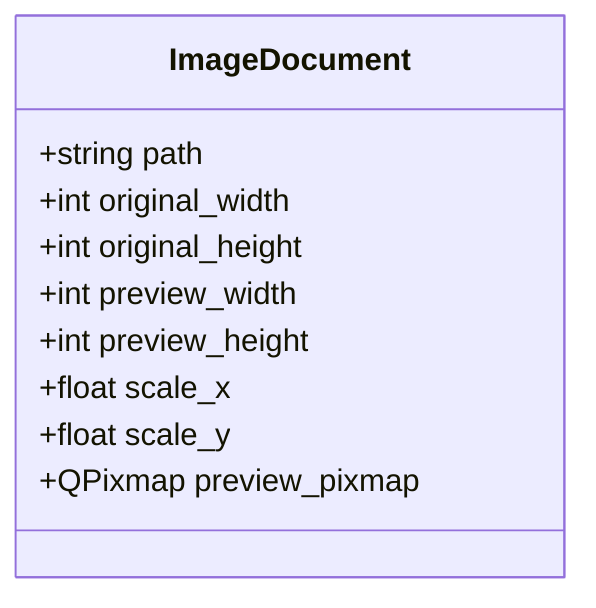
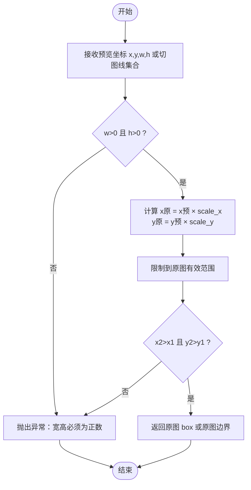
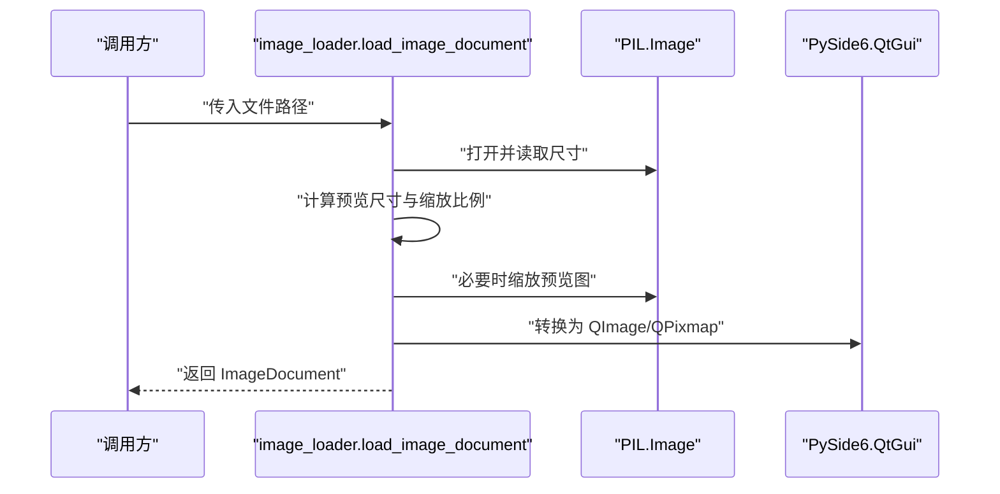
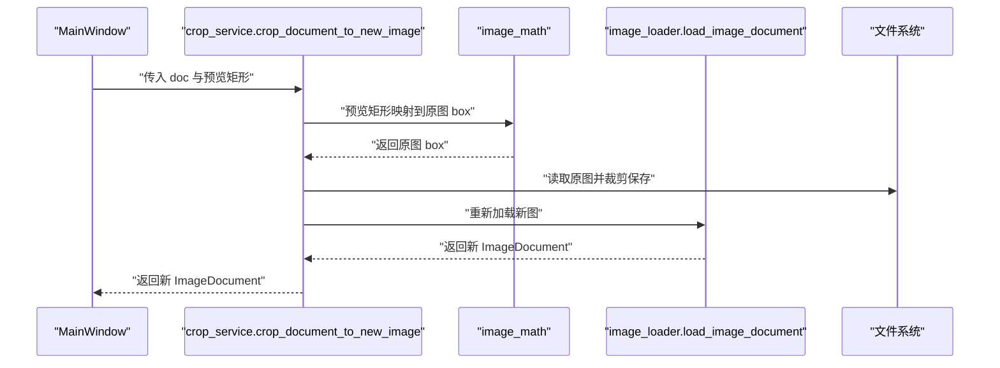
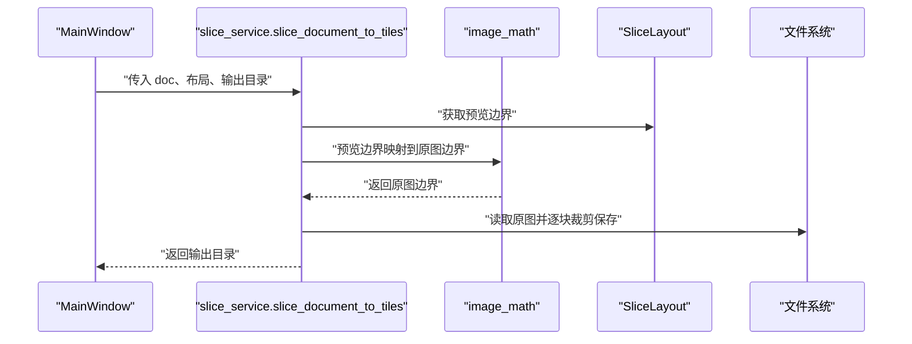
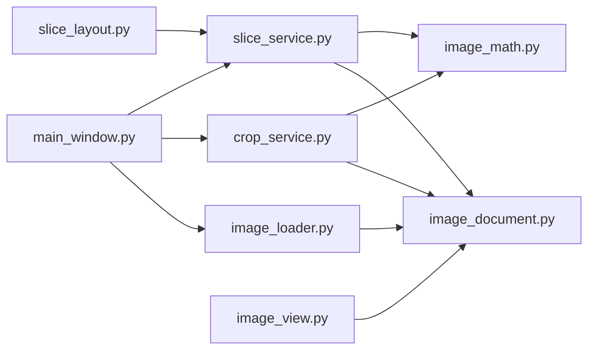

# 图像文档模型设计

<cite>
**本文引用的文件**
- [img_slicer_tool/models/image_document.py](file://img_slicer_tool/models/image_document.py)
- [img_slicer_tool/services/image_loader.py](file://img_slicer_tool/services/image_loader.py)
- [img_slicer_tool/services/crop_service.py](file://img_slicer_tool/services/crop_service.py)
- [img_slicer_tool/services/slice_service.py](file://img_slicer_tool/services/slice_service.py)
- [img_slicer_tool/utils/image_math.py](file://img_slicer_tool/utils/image_math.py)
- [img_slicer_tool/views/image_view.py](file://img_slicer_tool/views/image_view.py)
- [img_slicer_tool/app/main_window.py](file://img_slicer_tool/app/main_window.py)
- [img_slicer_tool/models/slice_layout.py](file://img_slicer_tool/models/slice_layout.py)
</cite>

## 目录
1. [简介](#简介)
2. [项目结构](#项目结构)
3. [核心组件](#核心组件)
4. [架构总览](#架构总览)
5. [详细组件分析](#详细组件分析)
6. [依赖关系分析](#依赖关系分析)
7. [性能考量](#性能考量)
8. [故障排查指南](#故障排查指南)
9. [结论](#结论)
10. [附录](#附录)

## 简介
本文件围绕 PictureMaster 中的图像文档模型 ImageDocument 进行系统化技术文档梳理。重点解释该 dataclass 如何封装图像元数据（原始路径、原始尺寸、预览尺寸、缩放比例、预览像素图），并阐述其在图像坐标映射中的关键作用，特别是如何通过 scale_x 和 scale_y 将预览坐标转换为原图坐标，从而支撑裁剪与切图操作。同时说明 dataclass(slots=True) 在内存优化与状态一致性方面的优势，并结合 image_loader.py 与 crop_service.py 的实际调用示例，展示 ImageDocument 在主窗口与服务层之间的安全传递机制。

## 项目结构
本项目采用“模型-服务-视图-应用”分层组织，其中：
- 模型层：image_document.py 定义数据载体；slice_layout.py 定义切图布局。
- 服务层：image_loader.py 负责加载与生成预览；crop_service.py 执行裁剪；slice_service.py 执行切图。
- 工具层：image_math.py 提供预览坐标与原图坐标的映射工具。
- 视图层：image_view.py 展示预览图并收集用户交互；overlay_items.py 提供覆盖元素。
- 应用层：main_window.py 组织菜单、动作与事件流，协调各模块。

图表来源
- [img_slicer_tool/models/image_document.py](file://img_slicer_tool/models/image_document.py#L1-L18)
- [img_slicer_tool/services/image_loader.py](file://img_slicer_tool/services/image_loader.py#L1-L68)
- [img_slicer_tool/services/crop_service.py](file://img_slicer_tool/services/crop_service.py#L1-L38)
- [img_slicer_tool/services/slice_service.py](file://img_slicer_tool/services/slice_service.py#L1-L62)
- [img_slicer_tool/utils/image_math.py](file://img_slicer_tool/utils/image_math.py#L1-L76)
- [img_slicer_tool/views/image_view.py](file://img_slicer_tool/views/image_view.py#L1-L542)
- [img_slicer_tool/app/main_window.py](file://img_slicer_tool/app/main_window.py#L1-L364)
- [img_slicer_tool/models/slice_layout.py](file://img_slicer_tool/models/slice_layout.py#L1-L30)

章节来源
- [img_slicer_tool/models/image_document.py](file://img_slicer_tool/models/image_document.py#L1-L18)
- [img_slicer_tool/services/image_loader.py](file://img_slicer_tool/services/image_loader.py#L1-L68)
- [img_slicer_tool/services/crop_service.py](file://img_slicer_tool/services/crop_service.py#L1-L38)
- [img_slicer_tool/services/slice_service.py](file://img_slicer_tool/services/slice_service.py#L1-L62)
- [img_slicer_tool/utils/image_math.py](file://img_slicer_tool/utils/image_math.py#L1-L76)
- [img_slicer_tool/views/image_view.py](file://img_slicer_tool/views/image_view.py#L1-L542)
- [img_slicer_tool/app/main_window.py](file://img_slicer_tool/app/main_window.py#L1-L364)
- [img_slicer_tool/models/slice_layout.py](file://img_slicer_tool/models/slice_layout.py#L1-L30)

## 核心组件
- ImageDocument：以 dataclass(slots=True) 形式承载图像元数据，包含路径、原始尺寸、预览尺寸、缩放比例与预览像素图。
- image_loader.load_image_document：从磁盘读取图像，计算预览尺寸与缩放比例，构建 ImageDocument。
- image_math：提供预览坐标到原图坐标的映射函数，保障裁剪与切图的几何正确性。
- crop_service：基于预览矩形执行裁剪，返回新的 ImageDocument。
- slice_service：根据切图布局与映射规则生成切片并保存。
- ImageView：在 UI 中展示预览图，收集用户交互（裁剪框、切图线）。
- MainWindow：负责菜单、动作与事件连接，协调加载、裁剪、切图流程。

章节来源
- [img_slicer_tool/models/image_document.py](file://img_slicer_tool/models/image_document.py#L1-L18)
- [img_slicer_tool/services/image_loader.py](file://img_slicer_tool/services/image_loader.py#L23-L53)
- [img_slicer_tool/utils/image_math.py](file://img_slicer_tool/utils/image_math.py#L17-L76)
- [img_slicer_tool/services/crop_service.py](file://img_slicer_tool/services/crop_service.py#L13-L38)
- [img_slicer_tool/services/slice_service.py](file://img_slicer_tool/services/slice_service.py#L12-L62)
- [img_slicer_tool/views/image_view.py](file://img_slicer_tool/views/image_view.py#L65-L82)
- [img_slicer_tool/app/main_window.py](file://img_slicer_tool/app/main_window.py#L114-L134)

## 架构总览
下图展示了从用户打开图片到裁剪/切图完成的端到端流程，以及 ImageDocument 在各层之间的传递与使用。

图表来源
- [img_slicer_tool/app/main_window.py](file://img_slicer_tool/app/main_window.py#L114-L134)
- [img_slicer_tool/services/image_loader.py](file://img_slicer_tool/services/image_loader.py#L23-L53)
- [img_slicer_tool/views/image_view.py](file://img_slicer_tool/views/image_view.py#L223-L231)
- [img_slicer_tool/services/crop_service.py](file://img_slicer_tool/services/crop_service.py#L13-L38)
- [img_slicer_tool/utils/image_math.py](file://img_slicer_tool/utils/image_math.py#L17-L76)
- [img_slicer_tool/services/slice_service.py](file://img_slicer_tool/services/slice_service.py#L12-L62)

## 详细组件分析

### ImageDocument 数据模型
- 字段定义与职责
  - path：图像文件路径，用于后续读写与保存。
  - original_width/original_height：原图真实像素尺寸，用于精确裁剪与切图。
  - preview_width/preview_height：预览图尺寸，用于 UI 渲染与交互。
  - scale_x/scale_y：预览到原图的缩放比例，保证预览坐标与原图坐标的等比映射。
  - preview_pixmap：预览像素图，用于快速渲染与交互。
- 设计要点
  - 使用 dataclass(slots=True)：减少实例内存占用，提升属性访问效率；slots 使对象属性固定，避免意外新增字段导致状态漂移，增强数据一致性。
  - 不可变性：dataclass 默认可变，但在此项目中作为纯数据载体被服务层构造后直接传递，未见修改行为，天然满足“只读传递”的使用约束。
- 复杂度与性能
  - 字段数量固定且均为标量，内存开销极低；slots 降低字典查找成本，适合高频 UI 渲染场景。

图表来源
- [img_slicer_tool/models/image_document.py](file://img_slicer_tool/models/image_document.py#L7-L16)

章节来源
- [img_slicer_tool/models/image_document.py](file://img_slicer_tool/models/image_document.py#L1-L18)

### 坐标映射与数学原理
- 预览坐标到原图坐标的转换
  - 数学关系：原图坐标 = 预览坐标 × 对应缩放比例
  - 公式：x原 = x预 × scale_x；y原 = y预 × scale_y
  - 边界约束：转换后的坐标需在原图有效范围内，防止越界。
- 实现与验证
  - image_math.preview_rect_to_original_box：将预览矩形映射为原图裁剪 box，并进行有效性校验（宽高为正、矩形有效）。
  - image_math.preview_lines_to_original_boundaries：将预览切图线映射为原图边界，再排序去重，确保可生成有效宫格。
- 错误处理
  - 当预览矩形无效或越界时抛出异常，避免生成非法裁剪结果。

图表来源
- [img_slicer_tool/utils/image_math.py](file://img_slicer_tool/utils/image_math.py#L17-L76)

章节来源
- [img_slicer_tool/utils/image_math.py](file://img_slicer_tool/utils/image_math.py#L17-L76)

### 加载与构造：image_loader.load_image_document
- 流程概览
  - 校验文件存在性
  - 读取原图尺寸
  - 计算预览尺寸与缩放比例（保持纵横比）
  - 将预览图转为 QImage/QPixmap
  - 构造 ImageDocument 并返回
- 关键点
  - 预览尺寸上限控制，避免超大图像占用过多内存
  - 缩放比例由原图尺寸与预览尺寸直接推导，保证映射精度

图表来源
- [img_slicer_tool/services/image_loader.py](file://img_slicer_tool/services/image_loader.py#L23-L53)

章节来源
- [img_slicer_tool/services/image_loader.py](file://img_slicer_tool/services/image_loader.py#L14-L21)
- [img_slicer_tool/services/image_loader.py](file://img_slicer_tool/services/image_loader.py#L23-L53)

### 裁剪流程：crop_service.crop_document_to_new_image
- 流程概览
  - 校验原图路径存在性
  - 从预览矩形计算原图裁剪 box
  - 读取原图并裁剪，按目标格式保存
  - 重新加载新图生成新的 ImageDocument 返回
- 关键点
  - 使用 image_math 将预览矩形映射到原图 box，确保裁剪精度
  - 保存参数针对 JPEG/JPG 进行质量优化

图表来源
- [img_slicer_tool/services/crop_service.py](file://img_slicer_tool/services/crop_service.py#L13-L38)
- [img_slicer_tool/utils/image_math.py](file://img_slicer_tool/utils/image_math.py#L17-L48)
- [img_slicer_tool/services/image_loader.py](file://img_slicer_tool/services/image_loader.py#L23-L53)

章节来源
- [img_slicer_tool/services/crop_service.py](file://img_slicer_tool/services/crop_service.py#L13-L38)

### 切图流程：slice_service.slice_document_to_tiles
- 流程概览
  - 校验原图与输出目录
  - 通过 image_math 将预览切图线映射为原图边界
  - 遍历边界生成切片并保存
- 关键点
  - SliceLayout 保存预览坐标系下的切图线，normalize 过滤无效值
  - preview_lines_to_original_boundaries 将布局转换为原图边界，确保切图几何正确

图表来源
- [img_slicer_tool/services/slice_service.py](file://img_slicer_tool/services/slice_service.py#L12-L62)
- [img_slicer_tool/utils/image_math.py](file://img_slicer_tool/utils/image_math.py#L50-L76)
- [img_slicer_tool/models/slice_layout.py](file://img_slicer_tool/models/slice_layout.py#L11-L30)

章节来源
- [img_slicer_tool/services/slice_service.py](file://img_slicer_tool/services/slice_service.py#L12-L62)
- [img_slicer_tool/models/slice_layout.py](file://img_slicer_tool/models/slice_layout.py#L11-L30)

### UI 展示与交互：ImageView
- 负责将 ImageDocument 的预览像素图渲染到场景，维持当前缩放状态，并响应用户交互（拖拽生成裁剪框、添加/移动切图线等）。
- set_document：清空历史状态，重置缩放，加载预览图并自适应显示。
- 交互信号：cropRequested(x,y,w,h) 将预览矩形传递给服务层。

章节来源
- [img_slicer_tool/views/image_view.py](file://img_slicer_tool/views/image_view.py#L65-L82)
- [img_slicer_tool/views/image_view.py](file://img_slicer_tool/views/image_view.py#L223-L231)

### 主窗口协调：MainWindow
- 负责菜单、动作与信号连接，统一调度加载、裁剪、切图流程。
- 加载图片：调用 image_loader.load_image_document，更新状态栏与当前文档。
- 裁剪：接收 ImageView 的裁剪请求，调用 crop_service，更新当前文档与 UI。
- 切图：从 ImageView 收集布局，调用 slice_service，展示结果并打开输出目录。

章节来源
- [img_slicer_tool/app/main_window.py](file://img_slicer_tool/app/main_window.py#L114-L134)
- [img_slicer_tool/app/main_window.py](file://img_slicer_tool/app/main_window.py#L136-L192)
- [img_slicer_tool/app/main_window.py](file://img_slicer_tool/app/main_window.py#L230-L261)

## 依赖关系分析
- 模块耦合
  - image_loader 与 ImageDocument 强耦合：构造函数注入所有字段。
  - crop_service 与 slice_service 均依赖 ImageDocument 与 image_math，形成“数据载体 + 映射工具”的协作关系。
  - ImageView 仅依赖 ImageDocument 与 SliceLayout，不直接参与业务逻辑，职责清晰。
- 可能的循环依赖
  - 未发现循环导入；各模块方向单向：UI -> 服务 -> 工具 -> 模型。
- 外部依赖
  - PIL：图像读取与缩放
  - PySide6：Qt GUI 与像素图转换

图表来源
- [img_slicer_tool/services/image_loader.py](file://img_slicer_tool/services/image_loader.py#L23-L53)
- [img_slicer_tool/services/crop_service.py](file://img_slicer_tool/services/crop_service.py#L13-L38)
- [img_slicer_tool/services/slice_service.py](file://img_slicer_tool/services/slice_service.py#L12-L62)
- [img_slicer_tool/utils/image_math.py](file://img_slicer_tool/utils/image_math.py#L17-L76)
- [img_slicer_tool/views/image_view.py](file://img_slicer_tool/views/image_view.py#L65-L82)
- [img_slicer_tool/app/main_window.py](file://img_slicer_tool/app/main_window.py#L114-L134)
- [img_slicer_tool/models/slice_layout.py](file://img_slicer_tool/models/slice_layout.py#L11-L30)

章节来源
- [img_slicer_tool/services/image_loader.py](file://img_slicer_tool/services/image_loader.py#L23-L53)
- [img_slicer_tool/services/crop_service.py](file://img_slicer_tool/services/crop_service.py#L13-L38)
- [img_slicer_tool/services/slice_service.py](file://img_slicer_tool/services/slice_service.py#L12-L62)
- [img_slicer_tool/utils/image_math.py](file://img_slicer_tool/utils/image_math.py#L17-L76)
- [img_slicer_tool/views/image_view.py](file://img_slicer_tool/views/image_view.py#L65-L82)
- [img_slicer_tool/app/main_window.py](file://img_slicer_tool/app/main_window.py#L114-L134)
- [img_slicer_tool/models/slice_layout.py](file://img_slicer_tool/models/slice_layout.py#L11-L30)

## 性能考量
- 内存优化
  - dataclass(slots=True)：减少每实例的字典存储与属性查找开销，适合大量 UI 预览与频繁传递的场景。
  - 预览图尺寸上限控制：避免加载超大图像造成内存峰值过高。
- 计算复杂度
  - 坐标映射为 O(1) 基本运算，开销极低。
  - 切图与裁剪为 O(n) 遍历与 IO，主要瓶颈在磁盘写入与图像解码。
- 建议
  - 对于超大图，优先使用预览尺寸进行交互，原图仅在最终保存阶段读取。
  - 合理设置预览尺寸上限，平衡交互流畅性与精度。

## 故障排查指南
- 常见问题与定位
  - 文件不存在：image_loader 在加载前校验路径，若不存在会抛出异常；MainWindow 捕获并提示。
  - 预览矩形无效：image_math 对宽高与矩形有效性进行校验，异常信息明确。
  - 输出目录为空：slice_service 对输出根路径进行校验，避免空路径导致保存失败。
- 排查步骤
  - 确认路径存在且为受支持格式
  - 检查预览尺寸与缩放比例是否合理
  - 校验裁剪/切图边界是否在原图范围内
  - 查看 UI 状态栏与消息框提示，定位具体环节

章节来源
- [img_slicer_tool/services/image_loader.py](file://img_slicer_tool/services/image_loader.py#L23-L30)
- [img_slicer_tool/utils/image_math.py](file://img_slicer_tool/utils/image_math.py#L26-L48)
- [img_slicer_tool/services/slice_service.py](file://img_slicer_tool/services/slice_service.py#L19-L24)
- [img_slicer_tool/app/main_window.py](file://img_slicer_tool/app/main_window.py#L119-L124)

## 结论
ImageDocument 作为图像数据的核心载体，通过 dataclass(slots=True) 实现了高效、稳定的内存管理与清晰的数据契约。配合 image_loader 的构造流程与 image_math 的坐标映射，系统在裁剪与切图场景中实现了从预览到原图的准确转换。MainWindow 与 ImageView 将用户交互与业务流程有机串联，形成完整的图像处理闭环。建议在扩展功能时继续保持“只读传递、纯数据载体”的设计原则，确保状态一致性与可维护性。

## 附录
- 字段类型定义与构造注入方式
  - 类型：path(str)、original_width/height(int)、preview_width/height(int)、scale_x/y(float)、preview_pixmap(QPixmap)
  - 注入：由 image_loader.load_image_document 一次性构造并返回
- 常见使用场景
  - 加载图片：MainWindow 调用 image_loader.load_image_document，随后 set_document 到 ImageView
  - 裁剪：ImageView 发出 cropRequested 信号，MainWindow 调用 crop_service，内部使用 image_math 将预览矩形映射到原图 box
  - 切图：MainWindow 从 ImageView 获取 SliceLayout，slice_service 调用 image_math 将预览线映射到原图边界，再批量裁剪保存

章节来源
- [img_slicer_tool/models/image_document.py](file://img_slicer_tool/models/image_document.py#L7-L16)
- [img_slicer_tool/services/image_loader.py](file://img_slicer_tool/services/image_loader.py#L23-L53)
- [img_slicer_tool/utils/image_math.py](file://img_slicer_tool/utils/image_math.py#L17-L76)
- [img_slicer_tool/services/crop_service.py](file://img_slicer_tool/services/crop_service.py#L13-L38)
- [img_slicer_tool/services/slice_service.py](file://img_slicer_tool/services/slice_service.py#L12-L62)
- [img_slicer_tool/views/image_view.py](file://img_slicer_tool/views/image_view.py#L65-L82)
- [img_slicer_tool/app/main_window.py](file://img_slicer_tool/app/main_window.py#L114-L134)