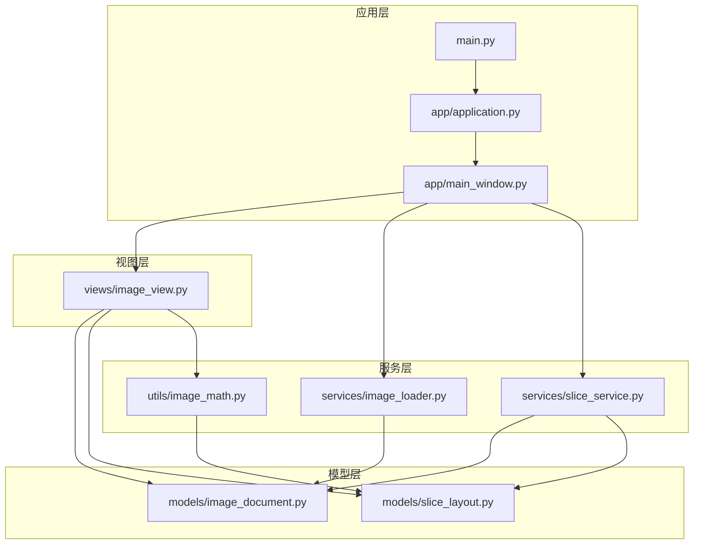
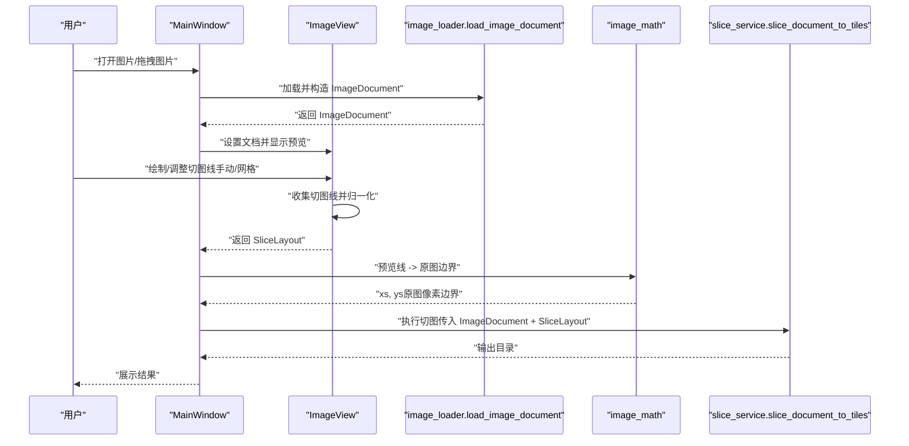
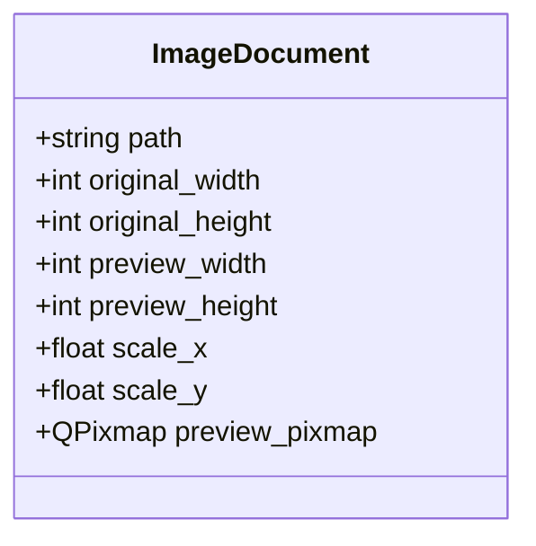
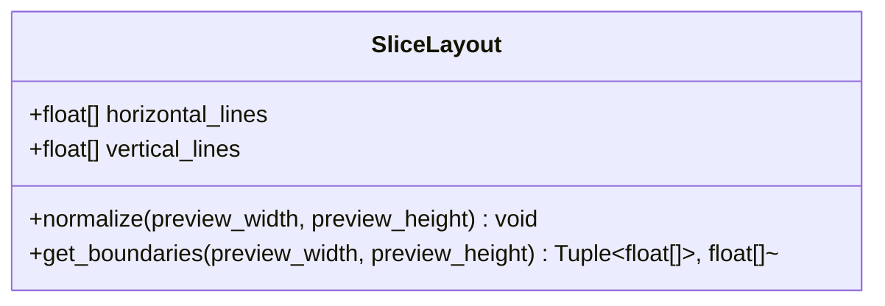
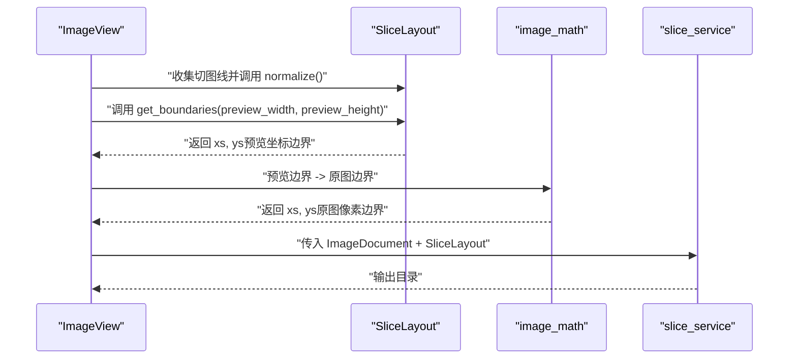
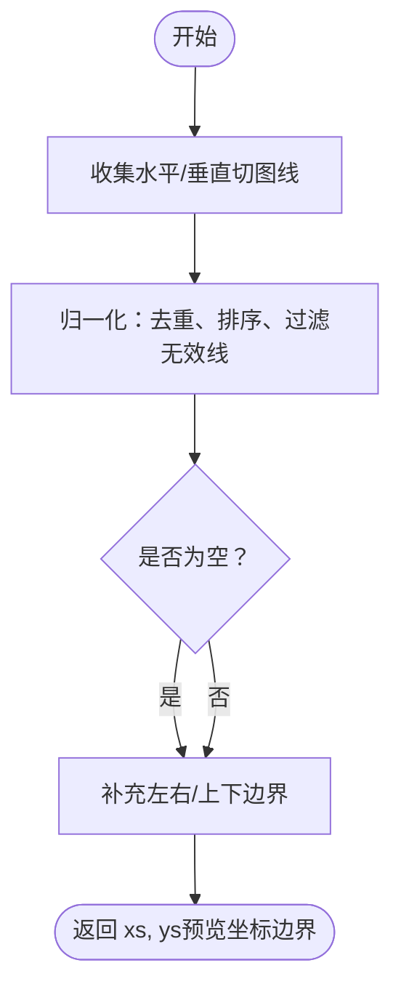
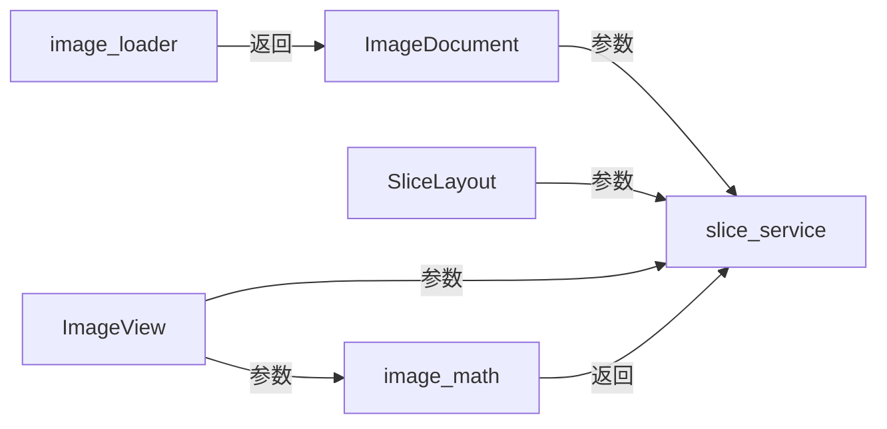

# 模型设计

<cite>
**本文引用的文件**
- [img_slicer_tool/models/image_document.py](file://img_slicer_tool/models/image_document.py)
- [img_slicer_tool/models/slice_layout.py](file://img_slicer_tool/models/slice_layout.py)
- [img_slicer_tool/services/image_loader.py](file://img_slicer_tool/services/image_loader.py)
- [img_slicer_tool/utils/image_math.py](file://img_slicer_tool/utils/image_math.py)
- [img_slicer_tool/services/slice_service.py](file://img_slicer_tool/services/slice_service.py)
- [img_slicer_tool/views/image_view.py](file://img_slicer_tool/views/image_view.py)
- [img_slicer_tool/app/main_window.py](file://img_slicer_tool/app/main_window.py)
- [img_slicer_tool/main.py](file://img_slicer_tool/main.py)
</cite>

## 目录
1. [简介](#简介)
2. [项目结构](#项目结构)
3. [核心组件](#核心组件)
4. [架构总览](#架构总览)
5. [详细组件分析](#详细组件分析)
6. [依赖关系分析](#依赖关系分析)
7. [性能考量](#性能考量)
8. [故障排查指南](#故障排查指南)
9. [结论](#结论)

## 简介
本技术文档聚焦于 PictureMaster 的数据模型设计，重点解析两个核心不可变数据结构：
- ImageDocument：使用 dataclass 封装图像元数据（路径、原始尺寸、预览尺寸、缩放比）与预览图资源，支撑坐标映射与渲染。
- SliceLayout：保存预览坐标系下的切图线布局，提供归一化与边界提取能力，用于生成宫格切图的原图边界。

文档将说明这两个结构如何通过构造函数注入的方式在服务层之间安全传递，如何保证状态一致性，并解释它们在坐标映射与宫格切图算法中的关键作用。

## 项目结构
该模块采用“模型-服务-视图-应用”分层组织，数据模型位于 models 层，服务层负责业务流程（如加载、切图），视图层负责用户交互与坐标采集，应用层负责启动与事件调度。

图表来源
- [img_slicer_tool/main.py](file://img_slicer_tool/main.py#L1-L13)
- [img_slicer_tool/app/application.py](file://img_slicer_tool/app/application.py#L1-L35)
- [img_slicer_tool/app/main_window.py](file://img_slicer_tool/app/main_window.py#L1-L364)
- [img_slicer_tool/views/image_view.py](file://img_slicer_tool/views/image_view.py#L1-L542)
- [img_slicer_tool/models/image_document.py](file://img_slicer_tool/models/image_document.py#L1-L18)
- [img_slicer_tool/models/slice_layout.py](file://img_slicer_tool/models/slice_layout.py#L1-L30)
- [img_slicer_tool/services/image_loader.py](file://img_slicer_tool/services/image_loader.py#L1-L67)
- [img_slicer_tool/utils/image_math.py](file://img_slicer_tool/utils/image_math.py#L1-L76)
- [img_slicer_tool/services/slice_service.py](file://img_slicer_tool/services/slice_service.py#L1-L62)

章节来源
- [img_slicer_tool/main.py](file://img_slicer_tool/main.py#L1-L13)
- [img_slicer_tool/app/application.py](file://img_slicer_tool/app/application.py#L1-L35)
- [img_slicer_tool/app/main_window.py](file://img_slicer_tool/app/main_window.py#L1-L364)
- [img_slicer_tool/views/image_view.py](file://img_slicer_tool/views/image_view.py#L1-L542)
- [img_slicer_tool/models/image_document.py](file://img_slicer_tool/models/image_document.py#L1-L18)
- [img_slicer_tool/models/slice_layout.py](file://img_slicer_tool/models/slice_layout.py#L1-L30)
- [img_slicer_tool/services/image_loader.py](file://img_slicer_tool/services/image_loader.py#L1-L67)
- [img_slicer_tool/utils/image_math.py](file://img_slicer_tool/utils/image_math.py#L1-L76)
- [img_slicer_tool/services/slice_service.py](file://img_slicer_tool/services/slice_service.py#L1-L62)

## 核心组件
本节对两个核心数据结构进行深入剖析，解释其字段语义、不变性保障、构造注入方式及在坐标映射中的作用。

- ImageDocument（图像文档）
  - 字段语义
    - path：原始图像文件路径
    - original_width/original_height：原图像素尺寸
    - preview_width/preview_height：预览图像素尺寸
    - scale_x/scale_y：预览到原图的缩放比（原图尺寸/预览尺寸）
    - preview_pixmap：预览图资源（Qt QPixmap）
  - 不变性与构造注入
    - 使用 dataclass 并启用 slots，确保字段只读且内存紧凑；通过服务层的构造函数一次性注入，避免运行期修改，保证状态一致性
  - 在坐标映射中的作用
    - 提供预览与原图之间的等比缩放参数，用于将预览坐标转换为原图坐标，或反向映射

- SliceLayout（切图布局）
  - 字段语义
    - horizontal_lines：预览坐标系下水平切图线集合
    - vertical_lines：预览坐标系下垂直切图线集合
  - 归一化逻辑（normalize 方法）
    - 去重、排序、过滤无效线（超出预览范围或非正值），确保后续边界提取稳定可靠
  - 边界提取（get_boundaries 方法）
    - 基于归一化后的水平/垂直线，补充左右边界与上下边界，形成闭区间网格，用于生成宫格切图的原图边界

章节来源
- [img_slicer_tool/models/image_document.py](file://img_slicer_tool/models/image_document.py#L1-L18)
- [img_slicer_tool/models/slice_layout.py](file://img_slicer_tool/models/slice_layout.py#L1-L30)

## 架构总览
下图展示了从用户交互到切图执行的数据流，强调不可变数据结构在各层之间的传递与职责分工。

图表来源
- [img_slicer_tool/app/main_window.py](file://img_slicer_tool/app/main_window.py#L1-L364)
- [img_slicer_tool/views/image_view.py](file://img_slicer_tool/views/image_view.py#L1-L542)
- [img_slicer_tool/services/image_loader.py](file://img_slicer_tool/services/image_loader.py#L1-L67)
- [img_slicer_tool/utils/image_math.py](file://img_slicer_tool/utils/image_math.py#L1-L76)
- [img_slicer_tool/services/slice_service.py](file://img_slicer_tool/services/slice_service.py#L1-L62)

## 详细组件分析

### ImageDocument 数据结构分析
- 设计要点
  - 使用 dataclass(slots=True) 实现轻量、只读、内存友好的不可变对象
  - 字段涵盖路径、尺寸与缩放比，以及预览图资源，便于视图层直接渲染与服务层进行坐标映射
- 构造与注入
  - 由服务层统一构造，包含预览尺寸计算与缩放比推导，随后作为参数在服务层之间传递
- 坐标映射中的作用
  - 提供 scale_x 与 scale_y，用于将预览坐标转换为原图坐标，或反向映射，确保预览与原图的一致性

图表来源
- [img_slicer_tool/models/image_document.py](file://img_slicer_tool/models/image_document.py#L1-L18)

章节来源
- [img_slicer_tool/models/image_document.py](file://img_slicer_tool/models/image_document.py#L1-L18)
- [img_slicer_tool/services/image_loader.py](file://img_slicer_tool/services/image_loader.py#L1-L67)

### SliceLayout 数据结构分析
- 设计要点
  - 两个字段分别存储水平/垂直切图线，均为预览坐标系下的浮点值
  - 提供 normalize 与 get_boundaries 两个关键方法，确保线位置有效并生成闭区间网格
- 归一化逻辑（normalize）
  - 去重、排序、过滤无效线（0 < 线值 < 预览对应维度），保证后续边界提取稳定
- 边界提取（get_boundaries）
  - 在归一化基础上，自动补充左右边界与上下边界，形成 xs 与 ys 两组有序边界序列
- 在宫格切图中的作用
  - 与预览尺寸配合，通过 image_math 模块转换为原图边界，驱动切图服务生成切片

图表来源
- [img_slicer_tool/models/slice_layout.py](file://img_slicer_tool/models/slice_layout.py#L1-L30)

章节来源
- [img_slicer_tool/models/slice_layout.py](file://img_slicer_tool/models/slice_layout.py#L1-L30)
- [img_slicer_tool/utils/image_math.py](file://img_slicer_tool/utils/image_math.py#L1-L76)

### 坐标映射与切图流程（Sequence）
以下序列图展示从预览线到原图边界的转换过程，以及切图服务如何消费这些边界。

图表来源
- [img_slicer_tool/views/image_view.py](file://img_slicer_tool/views/image_view.py#L1-L542)
- [img_slicer_tool/models/slice_layout.py](file://img_slicer_tool/models/slice_layout.py#L1-L30)
- [img_slicer_tool/utils/image_math.py](file://img_slicer_tool/utils/image_math.py#L1-L76)
- [img_slicer_tool/services/slice_service.py](file://img_slicer_tool/services/slice_service.py#L1-L62)

### 归一化与边界提取算法（Flowchart）
以下流程图直观展示 SliceLayout 的归一化与边界提取步骤，帮助理解有效性校验与边界闭合策略。

图表来源
- [img_slicer_tool/models/slice_layout.py](file://img_slicer_tool/models/slice_layout.py#L1-L30)

## 依赖关系分析
- 组件耦合
  - ImageDocument 与 SliceLayout 本身无直接依赖，通过服务层函数参数传递实现松耦合
  - 视图层负责收集切图线并归一化，服务层负责坐标映射与切图执行
- 外部依赖
  - 图像加载依赖 PIL 与 Qt（QImage/QPixmap）
  - 切图服务依赖 PIL Image 进行裁剪与保存
- 可能的循环依赖
  - 当前结构清晰，未发现循环依赖；若未来扩展，应避免在模型层引入 UI 逻辑

图表来源
- [img_slicer_tool/models/image_document.py](file://img_slicer_tool/models/image_document.py#L1-L18)
- [img_slicer_tool/models/slice_layout.py](file://img_slicer_tool/models/slice_layout.py#L1-L30)
- [img_slicer_tool/services/image_loader.py](file://img_slicer_tool/services/image_loader.py#L1-L67)
- [img_slicer_tool/utils/image_math.py](file://img_slicer_tool/utils/image_math.py#L1-L76)
- [img_slicer_tool/services/slice_service.py](file://img_slicer_tool/services/slice_service.py#L1-L62)
- [img_slicer_tool/views/image_view.py](file://img_slicer_tool/views/image_view.py#L1-L542)

章节来源
- [img_slicer_tool/services/slice_service.py](file://img_slicer_tool/services/slice_service.py#L1-L62)
- [img_slicer_tool/utils/image_math.py](file://img_slicer_tool/utils/image_math.py#L1-L76)
- [img_slicer_tool/views/image_view.py](file://img_slicer_tool/views/image_view.py#L1-L542)

## 性能考量
- 不可变数据结构的优势
  - dataclass(slots=True) 减少内存占用，提升访问效率；只读特性避免并发修改带来的额外开销
- 预览尺寸与缩放比
  - 通过预览尺寸限制与缩放比计算，降低渲染与交互成本，同时保持与原图的精确映射
- 归一化与边界提取
  - 去重与排序在小规模切图线场景下开销极低；建议在视图层及时清理无效线，减少后续处理压力
- 切图执行
  - 切片数量与图像大小呈线性关系；JPEG 保存参数优化可平衡质量与体积

## 故障排查指南
- 常见问题与定位
  - 切图边界不足：当预览线数量不足以形成有效网格时，坐标映射会抛出异常。检查视图层是否正确收集切图线并调用归一化
  - 预览坐标越界：若切图线超出预览图范围，会被归一化过滤。确认视图层的线位置钳制逻辑与归一化阈值
  - 原始图片不存在：切图服务在执行前会校验文件存在性。检查文件路径与权限
- 关键检查点
  - 预览到原图的缩放比是否正确（由加载器计算）
  - 切图线是否在预览坐标系内有效（视图层收集与钳制）
  - 边界序列是否单调递增且闭合（归一化与边界提取）

章节来源
- [img_slicer_tool/utils/image_math.py](file://img_slicer_tool/utils/image_math.py#L1-L76)
- [img_slicer_tool/services/slice_service.py](file://img_slicer_tool/services/slice_service.py#L1-L62)
- [img_slicer_tool/views/image_view.py](file://img_slicer_tool/views/image_view.py#L1-L542)

## 结论
ImageDocument 与 SliceLayout 通过 dataclass 的不可变设计与服务层的构造注入，实现了清晰的状态一致性与跨层安全传递。前者提供预览与原图的精确映射参数，后者提供稳定的切图线归一化与边界提取能力。二者协同工作，支撑了从用户交互到切图执行的完整流程，既保证了功能正确性，也兼顾了性能与可维护性。