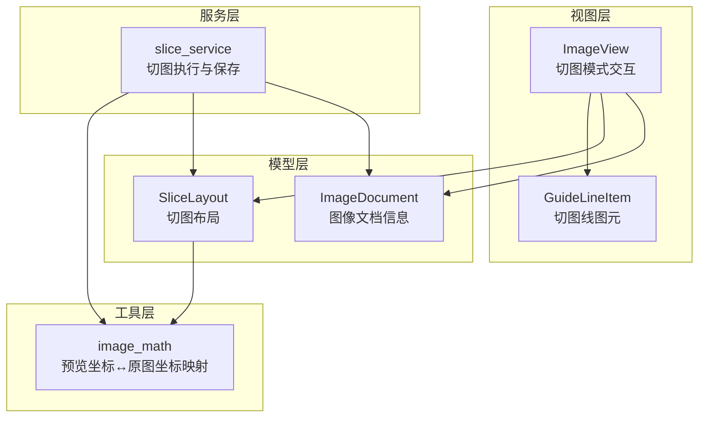
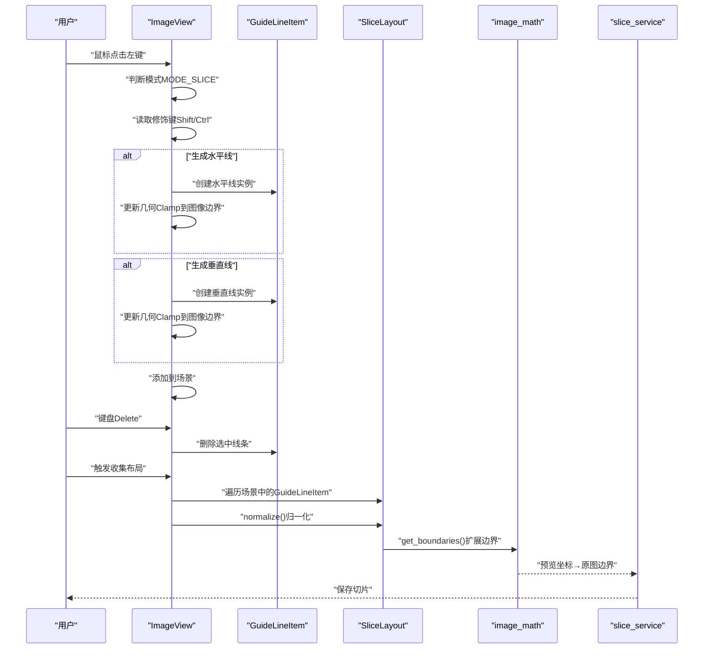
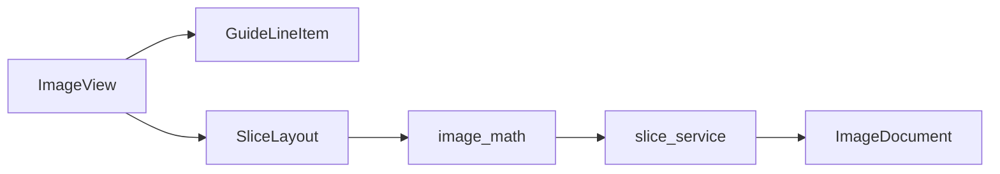

# 切图交互实现

<cite>
**本文引用的文件**
- [img_slicer_tool/views/image_view.py](file://img_slicer_tool/views/image_view.py)
- [img_slicer_tool/views/overlay_items.py](file://img_slicer_tool/views/overlay_items.py)
- [img_slicer_tool/models/slice_layout.py](file://img_slicer_tool/models/slice_layout.py)
- [img_slicer_tool/utils/image_math.py](file://img_slicer_tool/utils/image_math.py)
- [img_slicer_tool/services/slice_service.py](file://img_slicer_tool/services/slice_service.py)
- [img_slicer_tool/models/image_document.py](file://img_slicer_tool/models/image_document.py)
- [task/piccutting_task_card.md](file://task/piccutting_task_card.md)
</cite>

## 目录
1. [引言](#引言)
2. [项目结构](#项目结构)
3. [核心组件](#核心组件)
4. [架构总览](#架构总览)
5. [详细组件分析](#详细组件分析)
6. [依赖关系分析](#依赖关系分析)
7. [性能考量](#性能考量)
8. [故障排查指南](#故障排查指南)
9. [结论](#结论)

## 引言
本文面向PictureMaster的切图功能，聚焦ImageView在MODE_SLICE模式下的交互行为，系统性解析以下要点：
- 鼠标事件如何依据键盘修饰键（Shift、Ctrl）决定生成水平线、垂直线或十字线，并最终调用添加切图线的方法。
- 添加切图线时如何创建GuideLineItem并将其加入场景，保证线条位于图像边界内。
- GuideLineItem的实现细节：红色虚线样式、Z值层级、不可移动/不可选中标志位，以及scene_coordinate_value()如何通过映射场景坐标计算线条中心位置。
- 键盘事件中Delete键如何删除选中的GuideLineItem。
- get_slice_layout()如何遍历场景中的所有GuideLineItem，收集其坐标并构建SliceLayout对象，以及归一化处理的时机与作用。

## 项目结构
本项目采用分层组织：视图层负责用户交互与可视化（ImageView、Overlay Items），模型层负责数据结构（SliceLayout、ImageDocument），工具层提供坐标映射（image_math），服务层负责切图执行（slice_service）。

图表来源
- [img_slicer_tool/views/image_view.py](file://img_slicer_tool/views/image_view.py#L1-L120)
- [img_slicer_tool/views/overlay_items.py](file://img_slicer_tool/views/overlay_items.py#L1-L64)
- [img_slicer_tool/models/slice_layout.py](file://img_slicer_tool/models/slice_layout.py#L1-L30)
- [img_slicer_tool/utils/image_math.py](file://img_slicer_tool/utils/image_math.py#L1-L76)
- [img_slicer_tool/services/slice_service.py](file://img_slicer_tool/services/slice_service.py#L1-L62)
- [img_slicer_tool/models/image_document.py](file://img_slicer_tool/models/image_document.py#L1-L18)

章节来源
- [img_slicer_tool/views/image_view.py](file://img_slicer_tool/views/image_view.py#L1-L120)
- [img_slicer_tool/views/overlay_items.py](file://img_slicer_tool/views/overlay_items.py#L1-L64)
- [img_slicer_tool/models/slice_layout.py](file://img_slicer_tool/models/slice_layout.py#L1-L30)
- [img_slicer_tool/utils/image_math.py](file://img_slicer_tool/utils/image_math.py#L1-L76)
- [img_slicer_tool/services/slice_service.py](file://img_slicer_tool/services/slice_service.py#L1-L62)
- [img_slicer_tool/models/image_document.py](file://img_slicer_tool/models/image_document.py#L1-L18)

## 核心组件
- ImageView：承载图像预览与交互，负责MODE_SLICE模式下的鼠标/键盘事件处理、切图线的添加与拖拽、布局收集等。
- GuideLineItem：切图线图元，定义线条样式、Z值、可选中/可移动标志位，提供scene_coordinate_value()用于计算中心坐标。
- SliceLayout：保存预览坐标系下的切图线布局，提供normalize()与get_boundaries()进行归一化与边界扩展。
- image_math：提供预览坐标到原图坐标的映射函数preview_lines_to_original_boundaries()。
- slice_service：将布局转换为原图切片并保存。
- ImageDocument：封装图像的原始尺寸、预览尺寸、缩放比例与预览图。

章节来源
- [img_slicer_tool/views/image_view.py](file://img_slicer_tool/views/image_view.py#L1-L120)
- [img_slicer_tool/views/overlay_items.py](file://img_slicer_tool/views/overlay_items.py#L1-L64)
- [img_slicer_tool/models/slice_layout.py](file://img_slicer_tool/models/slice_layout.py#L1-L30)
- [img_slicer_tool/utils/image_math.py](file://img_slicer_tool/utils/image_math.py#L1-L76)
- [img_slicer_tool/services/slice_service.py](file://img_slicer_tool/services/slice_service.py#L1-L62)
- [img_slicer_tool/models/image_document.py](file://img_slicer_tool/models/image_document.py#L1-L18)

## 架构总览
下图展示切图交互的关键流程：用户在ImageView上点击，根据修饰键生成对应切图线，GuideLineItem被添加到场景；随后通过get_slice_layout()收集所有有效线条，交由SliceLayout进行归一化，再经image_math映射到原图坐标，最终由slice_service执行切图保存。

图表来源
- [img_slicer_tool/views/image_view.py](file://img_slicer_tool/views/image_view.py#L154-L214)
- [img_slicer_tool/views/overlay_items.py](file://img_slicer_tool/views/overlay_items.py#L27-L64)
- [img_slicer_tool/models/slice_layout.py](file://img_slicer_tool/models/slice_layout.py#L14-L30)
- [img_slicer_tool/utils/image_math.py](file://img_slicer_tool/utils/image_math.py#L50-L76)
- [img_slicer_tool/services/slice_service.py](file://img_slicer_tool/services/slice_service.py#L12-L62)

## 详细组件分析

### ImageView在MODE_SLICE模式下的行为
- 模式切换：set_mode()将模式切换为MODE_SLICE后，会清理裁剪框并更新光标。
- 鼠标按下（mousePressEvent）：
  - 若处于空格拖动模式，交由父类处理。
  - 若左键点击且落在图像范围内：
    - 在裁剪模式下拖出选择矩形。
    - 在切图模式下，根据修饰键决定生成水平线、垂直线或十字线，并调用内部方法添加到场景。
- 鼠标移动（mouseMoveEvent）：
  - 若正在拖拽某条切图线，则更新该线的位置并Clamp至图像边界。
  - 裁剪模式下拖动矩形时，限制矩形在图像范围内。
- 鼠标释放（mouseReleaseEvent）：
  - 切图模式下结束拖拽，恢复光标。
  - 裁剪模式下当矩形达到最小尺寸时发出裁剪请求。
- 键盘事件（keyPressEvent）：
  - Space：切换手拖模式。
  - Delete：删除选中的GuideLineItem（在手动模式下）。
  - H/V：在默认场景位置插入水平/垂直线。
- 布局收集（get_slice_layout）：
  - 遍历场景中的GuideLineItem，收集其坐标，过滤掉超出图像范围的线。
  - 调用SliceLayout.normalize()进行去重、排序与范围过滤。
  - 返回SliceLayout供后续映射与切图。

章节来源
- [img_slicer_tool/views/image_view.py](file://img_slicer_tool/views/image_view.py#L94-L115)
- [img_slicer_tool/views/image_view.py](file://img_slicer_tool/views/image_view.py#L154-L214)
- [img_slicer_tool/views/image_view.py](file://img_slicer_tool/views/image_view.py#L236-L253)
- [task/piccutting_task_card.md](file://task/piccutting_task_card.md#L358-L417)

### mousePressEvent如何根据修饰键生成切图线
- 修饰键判定：
  - 按住Shift：生成水平线。
  - 按住Ctrl：生成垂直线。
  - 无修饰键：生成十字线（同时生成水平与垂直线）。
- 生成逻辑：
  - 计算场景坐标scene_pos，确定y（水平线）或x（垂直线）。
  - 创建GuideLineItem并设置线段两端坐标，使其位于图像边界内。
  - 将GuideLineItem添加到场景，更新几何与高亮状态。
- 关键路径参考：
  - 修饰键判定与生成：[mousePressEvent](file://task/piccutting_task_card.md#L386-L414)
  - 几何设置与添加到场景：[mousePressEvent](file://task/piccutting_task_card.md#L400-L414)

章节来源
- [task/piccutting_task_card.md](file://task/piccutting_task_card.md#L358-L417)

### add_slice_line()与GuideLineItem的创建与场景添加
- add_slice_line()：
  - 作为手动模式的便捷入口，委托内部_add_manual_line()完成实际添加。
- _add_manual_line()：
  - 校验模式与方向有效性。
  - Clamp位置到图像边界，构造数据结构与GuideLineItem。
  - 将item加入场景并更新几何，同时清除选中状态。
- GuideLineItem：
  - 红色虚线样式、Z值为9、禁用ItemIsMovable与ItemIsSelectable。
  - 提供scene_coordinate_value()计算中心坐标（水平线取y均值，竖直线取x均值）。

章节来源
- [img_slicer_tool/views/image_view.py](file://img_slicer_tool/views/image_view.py#L261-L304)
- [img_slicer_tool/views/image_view.py](file://img_slicer_tool/views/image_view.py#L343-L357)
- [img_slicer_tool/views/overlay_items.py](file://img_slicer_tool/views/overlay_items.py#L27-L64)

### GuideLineItem实现细节
- 样式与层级：
  - 红色虚线（非高亮），宽度1；高亮时为实线且宽度3。
  - Z值为9，确保覆盖在图像之上。
- 可交互性：
  - 禁用ItemIsMovable与ItemIsSelectable，避免与ImageView的自定义拖拽冲突。
- 坐标计算：
  - scene_coordinate_value()通过mapToScene获取线段两端的场景坐标，再按方向取均值作为中心位置，便于后续定位与Clamp。

章节来源
- [img_slicer_tool/views/overlay_items.py](file://img_slicer_tool/views/overlay_items.py#L27-L64)

### 键盘事件Delete删除选中GuideLineItem
- Delete键触发时，ImageView在切图模式且手动模式下，若存在选中索引，则调用_remove_line_at()删除对应GuideLineItem。
- 删除后同步清理内部列表与选中状态，并更新光标。

章节来源
- [img_slicer_tool/views/image_view.py](file://img_slicer_tool/views/image_view.py#L94-L115)
- [img_slicer_tool/views/image_view.py](file://img_slicer_tool/views/image_view.py#L358-L366)

### get_slice_layout()遍历与归一化
- 遍历策略：
  - 遍历场景中的GuideLineItem，调用scene_coordinate_value()获取中心坐标。
  - 根据方向判断是否在图像范围内，分别加入horizontal_lines或vertical_lines。
- 归一化与边界扩展：
  - 调用SliceLayout.normalize()去重、排序并过滤越界值。
  - SliceLayout.get_boundaries()在normalize后自动加入0与最大边界，形成完整的栅格边界。
- 时机说明：
  - 预览坐标系内的归一化发生在ImageView侧，确保后续映射到原图时的稳定性。

章节来源
- [img_slicer_tool/views/image_view.py](file://img_slicer_tool/views/image_view.py#L236-L253)
- [img_slicer_tool/models/slice_layout.py](file://img_slicer_tool/models/slice_layout.py#L14-L30)

## 依赖关系分析
- ImageView依赖：
  - Overlay Items：GuideLineItem用于绘制切图线。
  - Model：SliceLayout用于存储与归一化切图线。
  - Utils：image_math用于预览坐标到原图坐标的映射。
  - Services：slice_service用于执行切图与保存。
- 数据流：
  - 用户交互 → ImageView → GuideLineItem → SliceLayout → image_math → slice_service → 文件系统。

图表来源
- [img_slicer_tool/views/image_view.py](file://img_slicer_tool/views/image_view.py#L1-L120)
- [img_slicer_tool/views/overlay_items.py](file://img_slicer_tool/views/overlay_items.py#L1-L64)
- [img_slicer_tool/models/slice_layout.py](file://img_slicer_tool/models/slice_layout.py#L1-L30)
- [img_slicer_tool/utils/image_math.py](file://img_slicer_tool/utils/image_math.py#L1-L76)
- [img_slicer_tool/services/slice_service.py](file://img_slicer_tool/services/slice_service.py#L1-L62)
- [img_slicer_tool/models/image_document.py](file://img_slicer_tool/models/image_document.py#L1-L18)

## 性能考量
- 场景几何更新：
  - 每次添加或拖拽切图线都会重新计算几何并Clamp到图像边界，建议在批量操作时减少频繁更新，或在UI层合并刷新。
- 归一化成本：
  - SliceLayout.normalize()对列表进行去重与排序，复杂度约O(n log n)，在大量线条时需注意。
- 图像映射：
  - 预览坐标到原图坐标的映射为线性变换，成本较低；但在大图场景下仍需避免重复计算。
- 切图执行：
  - slice_service使用PIL一次性打开原图并循环裁剪，内存占用与IO开销与切片数量成正比，建议控制输出质量参数以平衡体积与速度。

[本节为通用指导，不直接分析具体文件]

## 故障排查指南
- 无法生成切图线：
  - 确认当前模式为MODE_SLICE且sliceMode为manual。
  - 检查鼠标点击位置是否在图像范围内。
- 修饰键无效：
  - 确认修饰键（Shift/Ctrl）在点击时被正确识别。
- 线条无法删除：
  - 确认Delete键触发时存在选中线条，且处于手动模式。
- 布局为空或切图失败：
  - 检查get_slice_layout()是否正确收集线条，确认normalize()与get_boundaries()调用顺序。
  - 确认输出根路径有效，且原图文件存在。

章节来源
- [img_slicer_tool/views/image_view.py](file://img_slicer_tool/views/image_view.py#L94-L115)
- [img_slicer_tool/views/image_view.py](file://img_slicer_tool/views/image_view.py#L236-L253)
- [img_slicer_tool/services/slice_service.py](file://img_slicer_tool/services/slice_service.py#L12-L62)

## 结论
本文围绕ImageView在MODE_SLICE模式下的交互进行了系统解析，明确了修饰键驱动的切图线生成、GuideLineItem的样式与坐标计算、Delete键删除机制，以及布局收集与归一化的完整流程。通过清晰的职责划分与数据流设计，系统实现了从预览坐标到原图坐标的稳定映射，并支持大图场景下的高效切图执行。