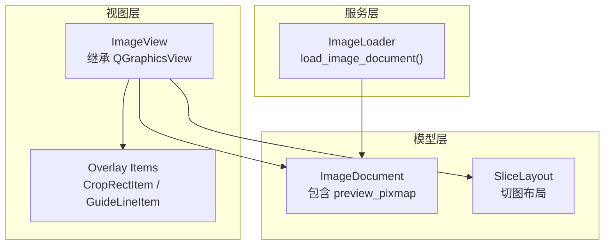
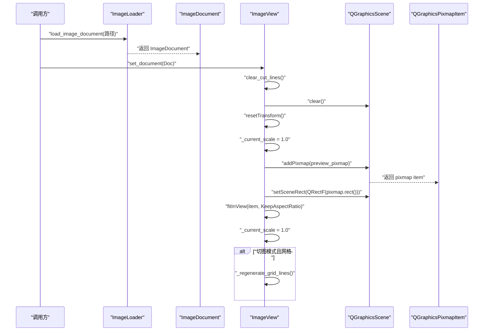
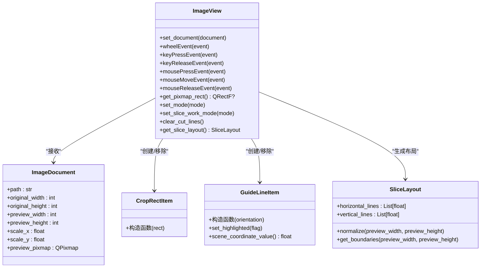
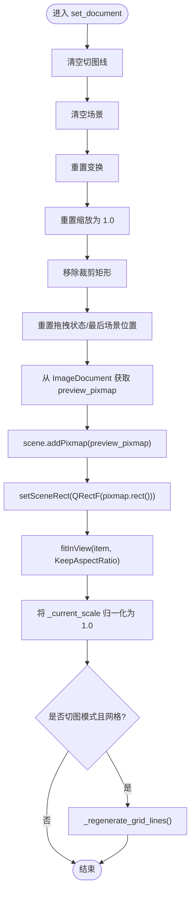
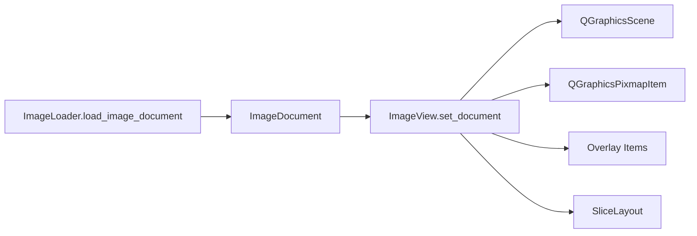

# 图像显示与场景管理

<cite>
**本文引用的文件**
- [img_slicer_tool/views/image_view.py](file://img_slicer_tool/views/image_view.py)
- [img_slicer_tool/views/overlay_items.py](file://img_slicer_tool/views/overlay_items.py)
- [img_slicer_tool/models/image_document.py](file://img_slicer_tool/models/image_document.py)
- [img_slicer_tool/services/image_loader.py](file://img_slicer_tool/services/image_loader.py)
- [img_slicer_tool/models/slice_layout.py](file://img_slicer_tool/models/slice_layout.py)
</cite>

## 目录
1. [简介](#简介)
2. [项目结构](#项目结构)
3. [核心组件](#核心组件)
4. [架构总览](#架构总览)
5. [详细组件分析](#详细组件分析)
6. [依赖关系分析](#依赖关系分析)
7. [性能考量](#性能考量)
8. [故障排查指南](#故障排查指南)
9. [结论](#结论)
10. [附录](#附录)

## 简介
本技术文档聚焦 PictureMaster 中的图像显示模块，系统性解析 ImageView 如何继承 QGraphicsView 并集成 QGraphicsScene 进行图像渲染与交互。重点覆盖：
- set_document() 加载 ImageDocument 预览图并添加到场景的完整流程
- _pixmap_item 生命周期管理策略
- fitInView 实现图像自适应显示的机制
- _init_view() 设置渲染提示、变换锚点与视口更新模式对性能的影响
- get_pixmap_rect() 返回预览图场景坐标矩形，为后续交互提供边界依据
- 结合调用序列说明图像加载后的缩放重置与场景清理流程

## 项目结构
图像显示模块位于 img_slicer_tool/views/image_view.py，配套的图元项定义在 overlay_items.py，图像文档数据模型在 models/image_document.py，图像加载服务在 services/image_loader.py，切图布局模型在 models/slice_layout.py。

图表来源
- [img_slicer_tool/views/image_view.py](file://img_slicer_tool/views/image_view.py#L24-L120)
- [img_slicer_tool/views/overlay_items.py](file://img_slicer_tool/views/overlay_items.py#L8-L64)
- [img_slicer_tool/models/image_document.py](file://img_slicer_tool/models/image_document.py#L8-L18)
- [img_slicer_tool/services/image_loader.py](file://img_slicer_tool/services/image_loader.py#L24-L54)
- [img_slicer_tool/models/slice_layout.py](file://img_slicer_tool/models/slice_layout.py#L7-L30)

章节来源
- [img_slicer_tool/views/image_view.py](file://img_slicer_tool/views/image_view.py#L24-L120)
- [img_slicer_tool/views/overlay_items.py](file://img_slicer_tool/views/overlay_items.py#L8-L64)
- [img_slicer_tool/models/image_document.py](file://img_slicer_tool/models/image_document.py#L8-L18)
- [img_slicer_tool/services/image_loader.py](file://img_slicer_tool/services/image_loader.py#L24-L54)
- [img_slicer_tool/models/slice_layout.py](file://img_slicer_tool/models/slice_layout.py#L7-L30)

## 核心组件
- ImageView：继承 QGraphicsView，负责图像渲染、交互、缩放与切图/裁剪模式切换；内部持有 QGraphicsScene 与当前预览图的 QGraphicsPixmapItem。
- ImageDocument：承载图像路径、原始尺寸、预览尺寸、缩放比例与预览 QPixmap。
- ImageLoader：从本地文件加载图像，计算预览尺寸与缩放比，生成 ImageDocument。
- Overlay Items：CropRectItem（半透明矩形）与 GuideLineItem（横/竖切图线），用于用户交互绘制与高亮。
- SliceLayout：保存预览坐标系下的切图线集合，并提供标准化与边界生成能力。

章节来源
- [img_slicer_tool/views/image_view.py](file://img_slicer_tool/views/image_view.py#L24-L120)
- [img_slicer_tool/models/image_document.py](file://img_slicer_tool/models/image_document.py#L8-L18)
- [img_slicer_tool/services/image_loader.py](file://img_slicer_tool/services/image_loader.py#L24-L54)
- [img_slicer_tool/views/overlay_items.py](file://img_slicer_tool/views/overlay_items.py#L8-L64)
- [img_slicer_tool/models/slice_layout.py](file://img_slicer_tool/models/slice_layout.py#L7-L30)

## 架构总览
ImageView 通过 set_document() 接收 ImageDocument，完成场景清理、预览图添加、场景矩形设定与自适应缩放。随后根据当前模式（裁剪/切图）与网格/手动模式生成相应的叠加图元（裁剪矩形或切图线）。

图表来源
- [img_slicer_tool/views/image_view.py](file://img_slicer_tool/views/image_view.py#L65-L85)
- [img_slicer_tool/services/image_loader.py](file://img_slicer_tool/services/image_loader.py#L24-L54)
- [img_slicer_tool/models/image_document.py](file://img_slicer_tool/models/image_document.py#L8-L18)

## 详细组件分析

### ImageView 类与 QGraphicsView/QGraphicsScene 集成
- 场景与视图初始化
  - 构造函数创建 QGraphicsScene 并设置到视图，同时初始化内部状态（当前缩放、模式、拖拽状态等）。
  - _init_view() 设置渲染提示、拖拽模式、变换锚点与视口更新模式，提升交互体验与性能。
- 文档加载与场景重建
  - set_document() 完整流程包括：清空切图线、清空场景、重置变换、重置缩放、移除裁剪矩形、更新最后场景位置等。
  - 将 ImageDocument.preview_pixmap 作为 QGraphicsPixmapItem 添加到场景，并设置场景矩形为 pixmap 的矩形。
  - 使用 fitInView(item, KeepAspectRatio) 实现图像自适应显示，随后将 _current_scale 归一化为 1.0。
  - 若当前处于切图模式且为网格模式，则重新生成网格线。
- 交互与缩放
  - Ctrl+滚轮缩放：按 1.1/0.9 因子调整当前缩放系数并调用 scale()。
  - 空格+左键拖动：切换为 ScrollHandDrag 模式实现平移。
- 边界与坐标
  - get_pixmap_rect() 返回当前预览图的 boundingRect()，即场景坐标矩形，用于后续裁剪/切图的边界约束与命中检测。

图表来源
- [img_slicer_tool/views/image_view.py](file://img_slicer_tool/views/image_view.py#L24-L120)
- [img_slicer_tool/views/overlay_items.py](file://img_slicer_tool/views/overlay_items.py#L8-L64)
- [img_slicer_tool/models/image_document.py](file://img_slicer_tool/models/image_document.py#L8-L18)
- [img_slicer_tool/models/slice_layout.py](file://img_slicer_tool/models/slice_layout.py#L7-L30)

章节来源
- [img_slicer_tool/views/image_view.py](file://img_slicer_tool/views/image_view.py#L24-L120)
- [img_slicer_tool/views/overlay_items.py](file://img_slicer_tool/views/overlay_items.py#L8-L64)
- [img_slicer_tool/models/image_document.py](file://img_slicer_tool/models/image_document.py#L8-L18)
- [img_slicer_tool/models/slice_layout.py](file://img_slicer_tool/models/slice_layout.py#L7-L30)

### set_document() 流程与场景重建
- 清理与重置
  - 清空切图线、清空场景、重置变换、重置缩放、移除裁剪矩形、重置拖拽状态与最后场景位置。
- 预览图加载
  - 从 ImageDocument 获取 preview_pixmap，添加为 QGraphicsPixmapItem，并设置场景矩形为 pixmap 的矩形。
- 自适应显示
  - 调用 fitInView(item, KeepAspectRatio) 使图像完全可见，随后将 _current_scale 归一化为 1.0。
- 模式联动
  - 若当前为切图模式且网格模式，则重新生成网格线。

图表来源
- [img_slicer_tool/views/image_view.py](file://img_slicer_tool/views/image_view.py#L65-L85)

章节来源
- [img_slicer_tool/views/image_view.py](file://img_slicer_tool/views/image_view.py#L65-L85)

### _pixmap_item 生命周期管理
- 创建与绑定
  - set_document() 中创建并绑定到场景，作为后续 fitInView、边界计算与交互的基础。
- 释放与替换
  - set_document() 在新文档到来时会先清理旧状态，随后重新添加新的 pixmap item。
  - 裁剪模式下，拖拽结束后移除临时裁剪矩形；切图模式下，网格线与手动线均通过 addItem()/removeItem() 动态管理。
- 可见性与层级
  - CropRectItem 设置 Z 值高于切图线，确保裁剪矩形在最上层显示；GuideLineItem 设置 Z 值略低，避免遮挡裁剪矩形。

章节来源
- [img_slicer_tool/views/image_view.py](file://img_slicer_tool/views/image_view.py#L65-L85)
- [img_slicer_tool/views/overlay_items.py](file://img_slicer_tool/views/overlay_items.py#L8-L64)

### fitInView 自适应显示机制
- 触发时机
  - set_document() 完成 pixmap item 添加后立即调用，确保图像首次显示时完全可见。
- 参数与行为
  - 使用 KeepAspectRatio 保持宽高比不变，避免拉伸；fitInView 会自动计算合适的缩放与平移。
- 缩放基准
  - fitInView 后将 _current_scale 归一化为 1.0，作为后续 Ctrl+滚轮缩放的基准。

章节来源
- [img_slicer_tool/views/image_view.py](file://img_slicer_tool/views/image_view.py#L76-L85)

### _init_view() 性能与交互影响
- 渲染提示
  - 保留默认渲染提示，兼顾清晰度与性能。
- 拖拽模式
  - 默认 NoDrag，避免误触发拖拽；空格按下时切换为 ScrollHandDrag，实现平移。
- 变换锚点
  - 变换与重绘锚点均设为 AnchorUnderMouse，使缩放/旋转围绕鼠标位置，提升直观性。
- 视口更新模式
  - SmartViewportUpdate 在大场景中减少不必要的重绘，提高滚动与缩放流畅度。

章节来源
- [img_slicer_tool/views/image_view.py](file://img_slicer_tool/views/image_view.py#L58-L64)

### get_pixmap_rect() 场景坐标边界
- 返回值
  - 当前预览图的 boundingRect()，即场景坐标矩形，用于裁剪/切图的边界约束与命中检测。
- 使用场景
  - 裁剪矩形拖拽时限制在 pixmap 矩形内；切图线位置钳制在 pixmap 矩形范围内；网格线生成基于 pixmap 矩形按行列步进。

章节来源
- [img_slicer_tool/views/image_view.py](file://img_slicer_tool/views/image_view.py#L255-L259)

### 图像加载后的缩放重置与场景清理流程
- 缩放重置
  - set_document() 中 resetTransform() 重置变换，随后 fitInView() 重置缩放为 1.0，保证后续 Ctrl+滚轮缩放从统一基准开始。
- 场景清理
  - 清空场景与切图线，移除裁剪矩形，重置拖拽状态，避免残留元素影响新文档显示。
- 模式切换
  - set_mode() 会在切换模式时移除裁剪矩形并重置拖拽状态，确保不同模式间的状态隔离。

章节来源
- [img_slicer_tool/views/image_view.py](file://img_slicer_tool/views/image_view.py#L65-L85)
- [img_slicer_tool/views/image_view.py](file://img_slicer_tool/views/image_view.py#L117-L128)

## 依赖关系分析
- ImageView 依赖
  - 模型：ImageDocument（提供预览图与尺寸信息）
  - 视图图元：CropRectItem、GuideLineItem（用于交互绘制）
  - 布局：SliceLayout（用于导出切图布局）
- 数据流
  - ImageLoader 生成 ImageDocument，ImageView 接收并渲染；Overlay Items 作为场景图元参与交互；SliceLayout 由 ImageView 生成并用于后续处理。

图表来源
- [img_slicer_tool/services/image_loader.py](file://img_slicer_tool/services/image_loader.py#L24-L54)
- [img_slicer_tool/models/image_document.py](file://img_slicer_tool/models/image_document.py#L8-L18)
- [img_slicer_tool/views/image_view.py](file://img_slicer_tool/views/image_view.py#L65-L85)
- [img_slicer_tool/views/overlay_items.py](file://img_slicer_tool/views/overlay_items.py#L8-L64)
- [img_slicer_tool/models/slice_layout.py](file://img_slicer_tool/models/slice_layout.py#L7-L30)

章节来源
- [img_slicer_tool/services/image_loader.py](file://img_slicer_tool/services/image_loader.py#L24-L54)
- [img_slicer_tool/models/image_document.py](file://img_slicer_tool/models/image_document.py#L8-L18)
- [img_slicer_tool/views/image_view.py](file://img_slicer_tool/views/image_view.py#L65-L85)
- [img_slicer_tool/views/overlay_items.py](file://img_slicer_tool/views/overlay_items.py#L8-L64)
- [img_slicer_tool/models/slice_layout.py](file://img_slicer_tool/models/slice_layout.py#L7-L30)

## 性能考量
- 视口更新模式
  - SmartViewportUpdate 在场景较大或频繁更新时减少重绘次数，提升滚动与缩放流畅度。
- 变换锚点
  - AnchorUnderMouse 使缩放围绕鼠标位置，避免额外的平移计算，提升交互响应速度。
- 场景清理
  - set_document() 中的 clear() 与 resetTransform() 有助于避免累积的变换与残留图元导致的性能退化。
- 预览尺寸
  - ImageLoader 在加载时根据最大尺寸阈值生成预览图，降低场景渲染压力，提升初次显示速度。

章节来源
- [img_slicer_tool/views/image_view.py](file://img_slicer_tool/views/image_view.py#L58-L64)
- [img_slicer_tool/services/image_loader.py](file://img_slicer_tool/services/image_loader.py#L14-L22)

## 故障排查指南
- 图像未显示或显示异常
  - 检查 set_document() 是否被正确调用，确认 preview_pixmap 是否有效。
  - 确认场景矩形已设置为 pixmap.rect()，fitInView 是否执行。
- 缩放异常
  - 确认 Ctrl+滚轮事件处理逻辑生效，_current_scale 是否被正确更新。
  - 若多次 set_document() 后缩放异常，检查是否重复叠加缩放因子。
- 裁剪/切图边界错误
  - 检查 get_pixmap_rect() 返回值是否为 None 或不正确。
  - 确认裁剪矩形与切图线的坐标钳制逻辑（_clamp_position）是否生效。
- 拖拽/平移问题
  - 空格拖动模式需在 keyPressEvent/keyReleaseEvent 中正确切换 DragMode。
- 切图线未显示
  - 确认切图模式与网格/手动模式设置正确，_regenerate_grid_lines() 是否被调用。

章节来源
- [img_slicer_tool/views/image_view.py](file://img_slicer_tool/views/image_view.py#L86-L116)
- [img_slicer_tool/views/image_view.py](file://img_slicer_tool/views/image_view.py#L255-L259)
- [img_slicer_tool/views/image_view.py](file://img_slicer_tool/views/image_view.py#L433-L440)
- [img_slicer_tool/views/image_view.py](file://img_slicer_tool/views/image_view.py#L441-L466)

## 结论
ImageView 通过简洁而稳健的流程实现了图像的加载、渲染与交互：set_document() 负责场景重建与自适应显示，_pixmap_item 生命周期管理确保资源有序释放与替换，fitInView 提供一致的缩放基准，_init_view() 的参数配置兼顾性能与交互体验。Overlay Items 与 SliceLayout 为后续的裁剪与切图功能提供了基础支撑。

## 附录
- 关键方法与职责速览
  - set_document()：加载 ImageDocument，重建场景，自适应显示，按需生成网格线
  - get_pixmap_rect()：返回预览图场景矩形，用于边界与命中检测
  - wheelEvent()：Ctrl+滚轮缩放
  - keyPressEvent/keyReleaseEvent()：空格拖动模式切换
  - mousePressEvent/mouseMoveEvent/mouseReleaseEvent()：裁剪/切图交互
  - clear_cut_lines()：清理切图线
  - set_slice_work_mode()：切换网格/手动模式
  - get_slice_layout()：生成 SliceLayout 供后续处理

章节来源
- [img_slicer_tool/views/image_view.py](file://img_slicer_tool/views/image_view.py#L65-L85)
- [img_slicer_tool/views/image_view.py](file://img_slicer_tool/views/image_view.py#L255-L259)
- [img_slicer_tool/views/image_view.py](file://img_slicer_tool/views/image_view.py#L86-L116)
- [img_slicer_tool/views/image_view.py](file://img_slicer_tool/views/image_view.py#L236-L254)
- [img_slicer_tool/views/image_view.py](file://img_slicer_tool/views/image_view.py#L295-L305)
- [img_slicer_tool/views/image_view.py](file://img_slicer_tool/views/image_view.py#L261-L282)
- [img_slicer_tool/views/image_view.py](file://img_slicer_tool/views/image_view.py#L441-L466)