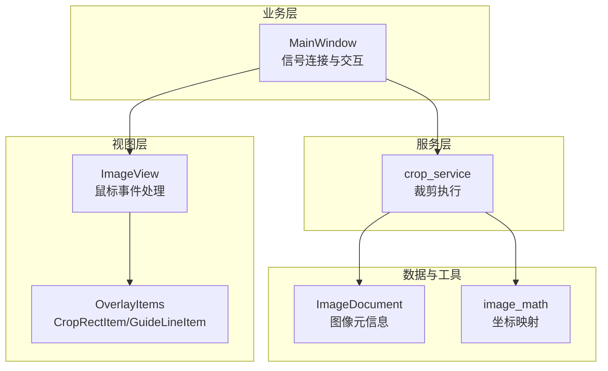
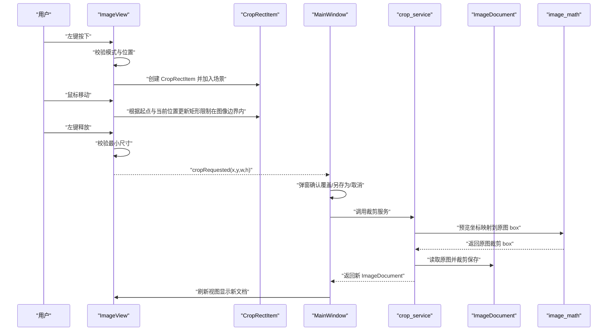
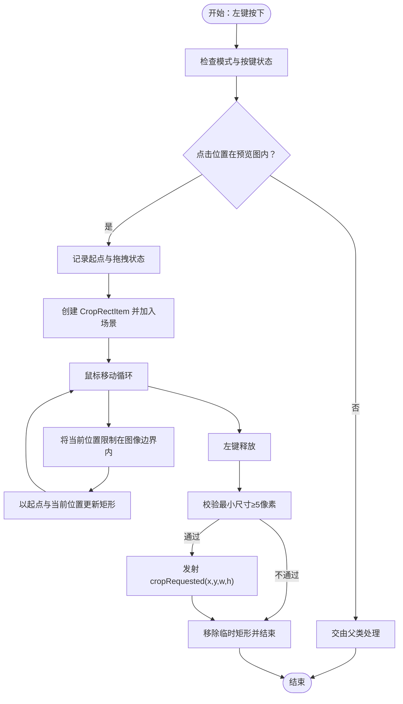
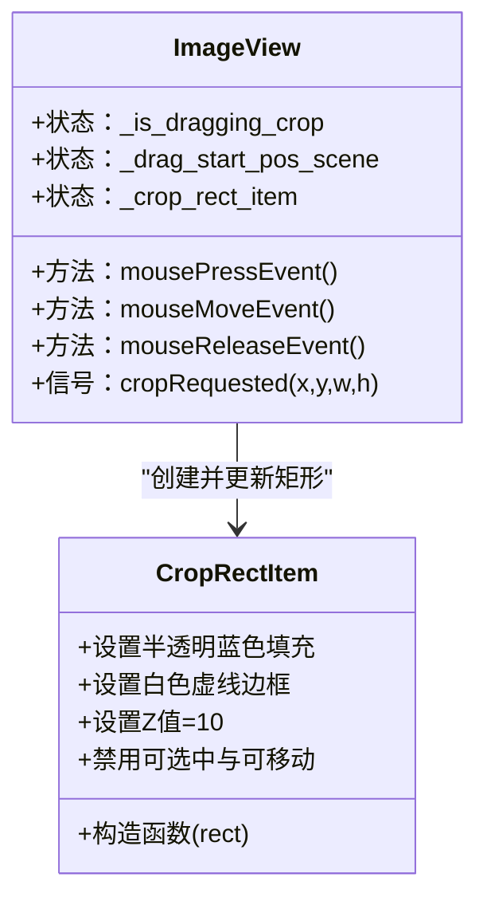
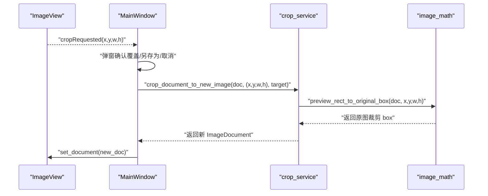
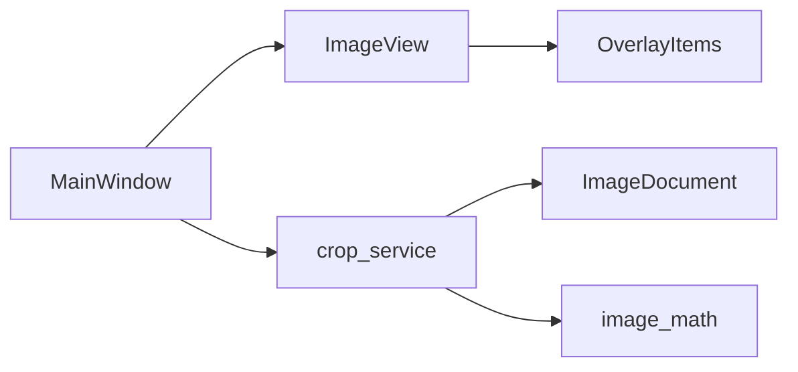

# 裁剪交互实现

<cite>
**本文引用的文件**
- [img_slicer_tool/views/image_view.py](file://img_slicer_tool/views/image_view.py)
- [img_slicer_tool/views/overlay_items.py](file://img_slicer_tool/views/overlay_items.py)
- [img_slicer_tool/services/crop_service.py](file://img_slicer_tool/services/crop_service.py)
- [img_slicer_tool/app/main_window.py](file://img_slicer_tool/app/main_window.py)
- [img_slicer_tool/models/image_document.py](file://img_slicer_tool/models/image_document.py)
- [img_slicer_tool/utils/image_math.py](file://img_slicer_tool/utils/image_math.py)
</cite>

## 目录
1. [简介](#简介)
2. [项目结构](#项目结构)
3. [核心组件](#核心组件)
4. [架构总览](#架构总览)
5. [详细组件分析](#详细组件分析)
6. [依赖关系分析](#依赖关系分析)
7. [性能考量](#性能考量)
8. [故障排查指南](#故障排查指南)
9. [结论](#结论)

## 简介
本技术文档聚焦于 PictureMaster 在 MODE_CROP 模式下的裁剪交互实现，系统性解析 ImageView 的鼠标事件处理链路、CropRectItem 的视觉与行为特性、以及裁剪结果从视图层到服务层的信号传递与落地流程。重点包括：
- mousePressEvent 如何捕获左键点击并创建 CropRectItem
- mouseMoveEvent 如何动态更新矩形大小并限制在图像边界内
- mouseReleaseEvent 如何验证最小尺寸后通过 cropRequested 发射裁剪区域坐标
- CropRectItem 的半透明蓝色填充、白色虚线边框、Z 值层级（10）及不可移动/不可选中的设计原理
- _is_dragging_crop 和 _drag_start_pos_scene 状态变量如何协同保证拖拽连续性
- 信号连接示例：cropRequested 如何被 MainWindow 捕获并调用 crop_service

## 项目结构
裁剪功能涉及以下关键模块：
- 视图层：ImageView（鼠标事件处理）、OverlayItems（CropRectItem/GuideLineItem）
- 业务层：MainWindow（信号连接与交互决策）
- 服务层：crop_service（实际裁剪逻辑）
- 数据模型与工具：ImageDocument（图像元信息）、image_math（坐标映射）

图表来源
- [img_slicer_tool/views/image_view.py](file://img_slicer_tool/views/image_view.py#L154-L235)
- [img_slicer_tool/views/overlay_items.py](file://img_slicer_tool/views/overlay_items.py#L8-L26)
- [img_slicer_tool/app/main_window.py](file://img_slicer_tool/app/main_window.py#L87-L101)
- [img_slicer_tool/services/crop_service.py](file://img_slicer_tool/services/crop_service.py#L13-L38)
- [img_slicer_tool/models/image_document.py](file://img_slicer_tool/models/image_document.py#L8-L18)
- [img_slicer_tool/utils/image_math.py](file://img_slicer_tool/utils/image_math.py#L17-L48)

章节来源
- [img_slicer_tool/views/image_view.py](file://img_slicer_tool/views/image_view.py#L1-L120)
- [img_slicer_tool/views/overlay_items.py](file://img_slicer_tool/views/overlay_items.py#L1-L64)
- [img_slicer_tool/app/main_window.py](file://img_slicer_tool/app/main_window.py#L1-L120)

## 核心组件
- ImageView（裁剪模式）
  - 提供 MODE_CROP 模式与 MODE_SLICE 模式的切换
  - 处理鼠标事件：mousePressEvent/mouseMoveEvent/mouseReleaseEvent
  - 维护裁剪状态：_is_dragging_crop、_drag_start_pos_scene、_crop_rect_item
  - 发射 cropRequested 信号，携带预览坐标系下的矩形参数
- OverlayItems
  - CropRectItem：半透明蓝色填充、白色虚线边框、Z 值 10、禁用可选中/可移动
  - GuideLineItem：用于切图模式的辅助线
- MainWindow
  - 连接 cropRequested 信号，弹窗确认后调用 crop_service
- crop_service
  - 将预览坐标映射到原图坐标，执行裁剪并返回新 ImageDocument
- ImageDocument 与 image_math
  - ImageDocument：包含原始尺寸、预览尺寸、缩放比例等
  - image_math：提供预览坐标到原图坐标的映射函数

章节来源
- [img_slicer_tool/views/image_view.py](file://img_slicer_tool/views/image_view.py#L24-L53)
- [img_slicer_tool/views/overlay_items.py](file://img_slicer_tool/views/overlay_items.py#L8-L26)
- [img_slicer_tool/app/main_window.py](file://img_slicer_tool/app/main_window.py#L87-L101)
- [img_slicer_tool/services/crop_service.py](file://img_slicer_tool/services/crop_service.py#L13-L38)
- [img_slicer_tool/models/image_document.py](file://img_slicer_tool/models/image_document.py#L8-L18)
- [img_slicer_tool/utils/image_math.py](file://img_slicer_tool/utils/image_math.py#L17-L48)

## 架构总览
裁剪交互的端到端流程如下：

图表来源
- [img_slicer_tool/views/image_view.py](file://img_slicer_tool/views/image_view.py#L154-L235)
- [img_slicer_tool/views/overlay_items.py](file://img_slicer_tool/views/overlay_items.py#L8-L26)
- [img_slicer_tool/app/main_window.py](file://img_slicer_tool/app/main_window.py#L136-L193)
- [img_slicer_tool/services/crop_service.py](file://img_slicer_tool/services/crop_service.py#L13-L38)
- [img_slicer_tool/utils/image_math.py](file://img_slicer_tool/utils/image_math.py#L17-L48)

## 详细组件分析

### ImageView 在 MODE_CROP 下的完整工作流
- 初始化与模式
  - 设置场景、预览图、初始缩放；初始化裁剪相关状态变量
  - set_mode 切换模式时清理裁剪状态，避免残留矩形影响
- 鼠标事件处理
  - mousePressEvent
    - 若按下空格则交由父类处理（平移模式）
    - 左键点击且点击位置在预览图范围内时：
      - 记录拖拽起点 _drag_start_pos_scene
      - 创建 CropRectItem 并加入场景
  - mouseMoveEvent
    - 当处于裁剪拖拽状态时：
      - 将鼠标位置映射到场景坐标
      - 将坐标限制在预览图矩形内（防止越界）
      - 以起点与当前位置构造矩形并规范化，更新 CropRectItem
  - mouseReleaseEvent
    - 左键释放时：
      - 结束拖拽状态
      - 获取 CropRectItem 的矩形，若宽高均≥5像素则发射 cropRequested
      - 移除临时矩形，等待下次交互
- 状态变量协作
  - _is_dragging_crop：标记是否处于拖拽创建矩形阶段
  - _drag_start_pos_scene：记录拖拽起点，确保矩形方向正确
  - _crop_rect_item：当前场景中的裁剪矩形项
  - _last_scene_pos：用于热键与默认位置计算

图表来源
- [img_slicer_tool/views/image_view.py](file://img_slicer_tool/views/image_view.py#L154-L235)

章节来源
- [img_slicer_tool/views/image_view.py](file://img_slicer_tool/views/image_view.py#L154-L235)

### CropRectItem 的实现与设计原理
- 视觉样式
  - 半透明蓝色填充：提升覆盖层的可见度但不过分遮挡图像
  - 白色虚线边框：清晰区分裁剪区域边界
- 层级与交互
  - Z 值设为 10，确保覆盖在预览图之上
  - 禁用 ItemIsSelectable 与 ItemIsMovable，避免误操作与场景级拖拽冲突
- 与 ImageView 的协作
  - 由 ImageView 在拖拽过程中动态 setRect 更新尺寸
  - 释放后由 ImageView 决定是否发射信号

图表来源
- [img_slicer_tool/views/overlay_items.py](file://img_slicer_tool/views/overlay_items.py#L8-L26)
- [img_slicer_tool/views/image_view.py](file://img_slicer_tool/views/image_view.py#L154-L235)

章节来源
- [img_slicer_tool/views/overlay_items.py](file://img_slicer_tool/views/overlay_items.py#L8-L26)

### 信号连接示例：cropRequested → MainWindow → crop_service
- MainWindow 在初始化时连接 ImageView 的 cropRequested 信号
- 收到信号后弹窗确认（覆盖原图/另存为/取消），再调用 crop_service
- crop_service 使用 image_math 将预览坐标映射到原图 box，执行裁剪并返回新文档
- MainWindow 刷新视图并更新状态栏

图表来源
- [img_slicer_tool/app/main_window.py](file://img_slicer_tool/app/main_window.py#L87-L101)
- [img_slicer_tool/app/main_window.py](file://img_slicer_tool/app/main_window.py#L136-L193)
- [img_slicer_tool/services/crop_service.py](file://img_slicer_tool/services/crop_service.py#L13-L38)
- [img_slicer_tool/utils/image_math.py](file://img_slicer_tool/utils/image_math.py#L17-L48)

章节来源
- [img_slicer_tool/app/main_window.py](file://img_slicer_tool/app/main_window.py#L87-L101)
- [img_slicer_tool/app/main_window.py](file://img_slicer_tool/app/main_window.py#L136-L193)
- [img_slicer_tool/services/crop_service.py](file://img_slicer_tool/services/crop_service.py#L13-L38)
- [img_slicer_tool/utils/image_math.py](file://img_slicer_tool/utils/image_math.py#L17-L48)

## 依赖关系分析
- ImageView 依赖 OverlayItems（CropRectItem/GuideLineItem）
- MainWindow 依赖 ImageView（信号）、crop_service（裁剪）、ImageDocument（数据）
- crop_service 依赖 ImageDocument 与 image_math（坐标映射）
- image_math 依赖 ImageDocument

图表来源
- [img_slicer_tool/views/image_view.py](file://img_slicer_tool/views/image_view.py#L1-L60)
- [img_slicer_tool/views/overlay_items.py](file://img_slicer_tool/views/overlay_items.py#L1-L64)
- [img_slicer_tool/app/main_window.py](file://img_slicer_tool/app/main_window.py#L1-L60)
- [img_slicer_tool/services/crop_service.py](file://img_slicer_tool/services/crop_service.py#L1-L20)
- [img_slicer_tool/models/image_document.py](file://img_slicer_tool/models/image_document.py#L8-L18)
- [img_slicer_tool/utils/image_math.py](file://img_slicer_tool/utils/image_math.py#L1-L20)

章节来源
- [img_slicer_tool/views/image_view.py](file://img_slicer_tool/views/image_view.py#L1-L60)
- [img_slicer_tool/views/overlay_items.py](file://img_slicer_tool/views/overlay_items.py#L1-L64)
- [img_slicer_tool/app/main_window.py](file://img_slicer_tool/app/main_window.py#L1-L60)
- [img_slicer_tool/services/crop_service.py](file://img_slicer_tool/services/crop_service.py#L1-L20)
- [img_slicer_tool/models/image_document.py](file://img_slicer_tool/models/image_document.py#L8-L18)
- [img_slicer_tool/utils/image_math.py](file://img_slicer_tool/utils/image_math.py#L1-L20)

## 性能考量
- 事件处理轻量：鼠标移动仅更新矩形，不进行昂贵计算
- 边界裁剪在移动阶段即时完成，避免无效绘制
- 信号发射仅在满足最小尺寸后触发，减少不必要的服务调用
- 坐标映射与裁剪在服务层执行，避免 UI 线程阻塞

## 故障排查指南
- 无法创建裁剪矩形
  - 检查是否处于 MODE_CROP 模式
  - 确认点击位置在预览图范围内
  - 参考路径：[img_slicer_tool/views/image_view.py](file://img_slicer_tool/views/image_view.py#L154-L184)
- 矩形越界或无法拖拽
  - 确认 mouseMoveEvent 中对场景坐标的边界裁剪逻辑
  - 参考路径：[img_slicer_tool/views/image_view.py](file://img_slicer_tool/views/image_view.py#L185-L208)
- 最小尺寸限制导致未发射信号
  - 确认 mouseReleaseEvent 的最小尺寸校验
  - 参考路径：[img_slicer_tool/views/image_view.py](file://img_slicer_tool/views/image_view.py#L209-L235)
- 裁剪结果异常
  - 检查 cropRequested 参数是否正确传入
  - 确认 MainWindow 的确认流程与目标路径选择
  - 参考路径：[img_slicer_tool/app/main_window.py](file://img_slicer_tool/app/main_window.py#L136-L193)
- 原图坐标映射错误
  - 检查 image_math 的预览到原图映射逻辑
  - 参考路径：[img_slicer_tool/utils/image_math.py](file://img_slicer_tool/utils/image_math.py#L17-L48)

章节来源
- [img_slicer_tool/views/image_view.py](file://img_slicer_tool/views/image_view.py#L154-L235)
- [img_slicer_tool/app/main_window.py](file://img_slicer_tool/app/main_window.py#L136-L193)
- [img_slicer_tool/utils/image_math.py](file://img_slicer_tool/utils/image_math.py#L17-L48)

## 结论
本实现通过明确的状态管理与事件链路，将用户在 ImageView 上的拖拽行为转化为精确的裁剪区域，并以信号形式安全地传递到业务层。CropRectItem 的视觉与交互约束确保了良好的用户体验，而服务层的坐标映射与裁剪执行则保障了结果的准确性与稳定性。整体设计具备清晰的职责分离与可维护性，便于后续扩展与优化。