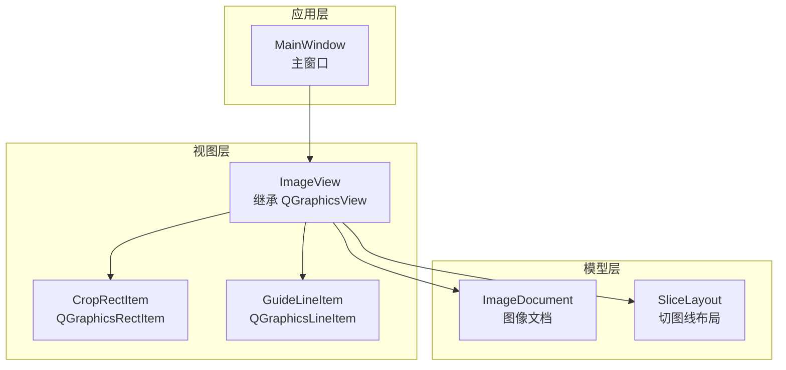
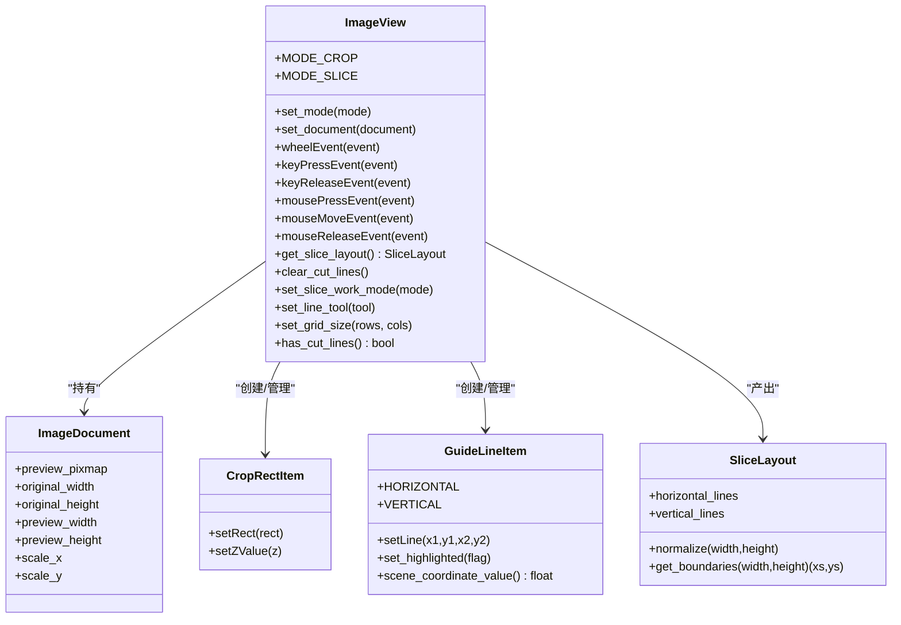
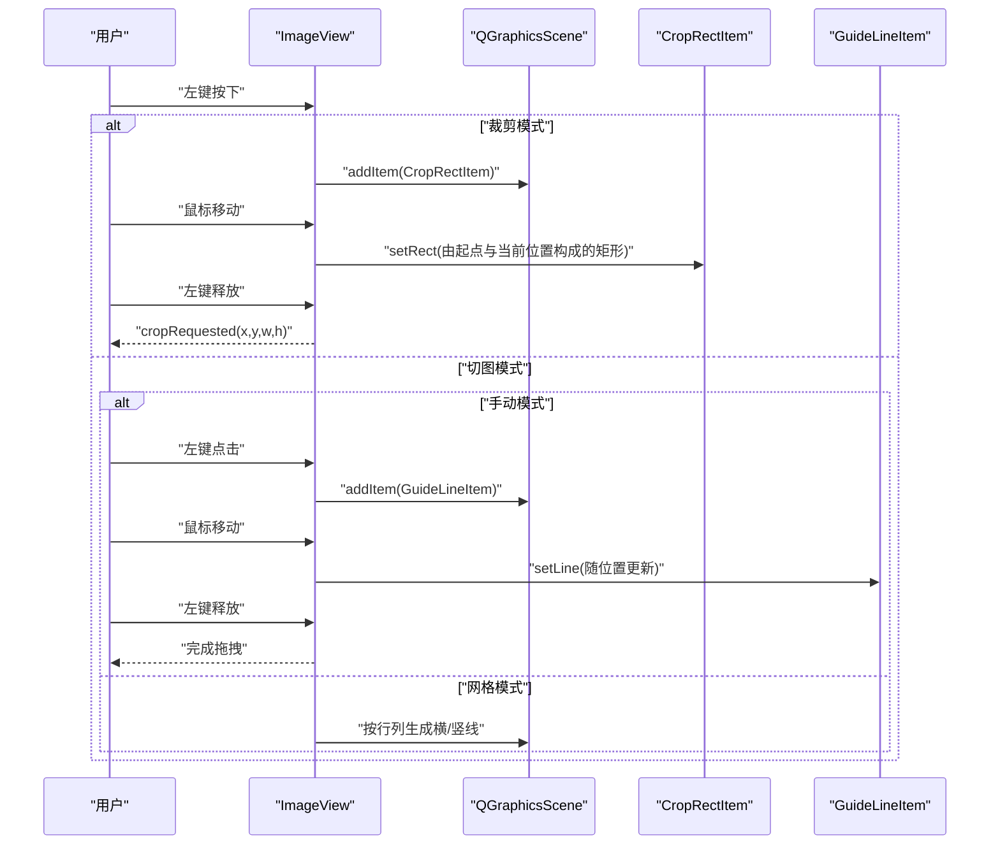
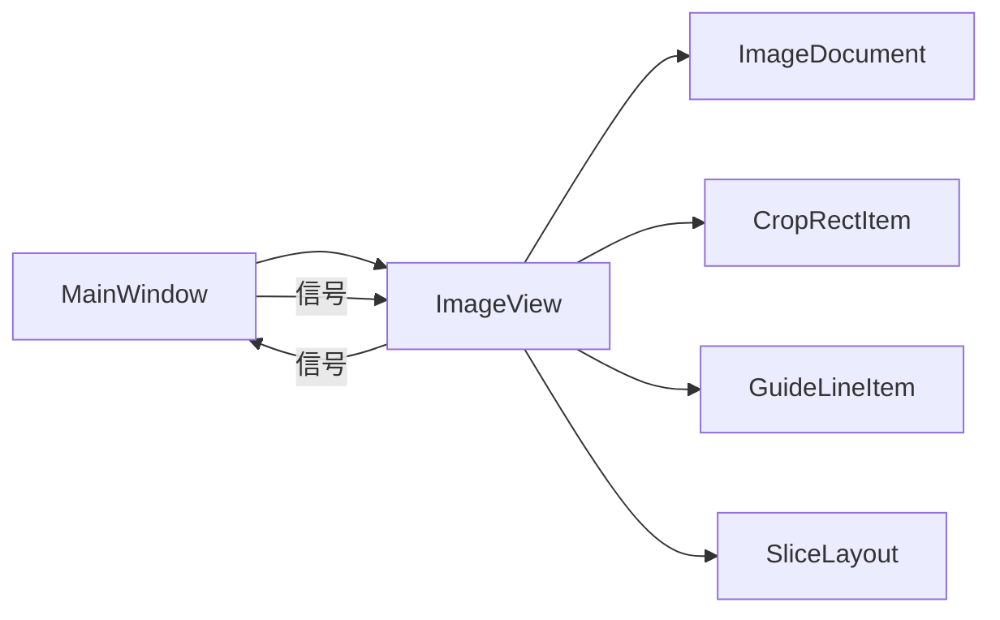

# 视图架构

<cite>
**本文引用的文件**
- [img_slicer_tool/views/image_view.py](file://img_slicer_tool/views/image_view.py)
- [img_slicer_tool/views/overlay_items.py](file://img_slicer_tool/views/overlay_items.py)
- [img_slicer_tool/models/slice_layout.py](file://img_slicer_tool/models/slice_layout.py)
- [img_slicer_tool/models/image_document.py](file://img_slicer_tool/models/image_document.py)
- [img_slicer_tool/app/main_window.py](file://img_slicer_tool/app/main_window.py)
</cite>

## 目录
1. [简介](#简介)
2. [项目结构](#项目结构)
3. [核心组件](#核心组件)
4. [架构总览](#架构总览)
5. [详细组件分析](#详细组件分析)
6. [依赖关系分析](#依赖关系分析)
7. [性能考量](#性能考量)
8. [故障排查指南](#故障排查指南)
9. [结论](#结论)

## 简介
本技术文档聚焦 PictureMaster 的视图层，系统性解析 ImageView 组件对 QGraphicsView 的继承与扩展，阐述 QGraphicsScene 如何承载图像渲染与图层叠加，以及 _pixmap_item、CropRectItem、GuideLineItem 之间的层级关系。文档还深入说明鼠标事件（mousePressEvent、mouseMoveEvent）如何实现裁剪框绘制与切图线生成，键盘事件（空格平移、Delete 删除）的响应逻辑，以及滚轮缩放的坐标变换计算。最后，解释 MODE_CROP 与 MODE_SLICE 两种工作模式的状态管理，以及 get_slice_layout() 方法如何从场景中收集切图线数据并标准化为 SliceLayout。

## 项目结构
- 视图层位于 img_slicer_tool/views，包含 ImageView 和 overlay_items（裁剪矩形与切图线图元）。
- 模型层位于 img_slicer_tool/models，包含 ImageDocument（图像文档信息）与 SliceLayout（切图线布局）。
- 应用层位于 img_slicer_tool/app，包含主窗口 MainWindow，负责模式切换、面板交互与信号连接。
- 服务层位于 img_slicer_tool/services，提供图像加载、裁剪与切图服务（由 MainWindow 连接调用）。

图表来源
- [img_slicer_tool/app/main_window.py](file://img_slicer_tool/app/main_window.py#L26-L101)
- [img_slicer_tool/views/image_view.py](file://img_slicer_tool/views/image_view.py#L24-L82)
- [img_slicer_tool/views/overlay_items.py](file://img_slicer_tool/views/overlay_items.py#L8-L64)
- [img_slicer_tool/models/image_document.py](file://img_slicer_tool/models/image_document.py#L8-L18)
- [img_slicer_tool/models/slice_layout.py](file://img_slicer_tool/models/slice_layout.py#L7-L30)

章节来源
- [img_slicer_tool/app/main_window.py](file://img_slicer_tool/app/main_window.py#L26-L101)
- [img_slicer_tool/views/image_view.py](file://img_slicer_tool/views/image_view.py#L24-L82)
- [img_slicer_tool/views/overlay_items.py](file://img_slicer_tool/views/overlay_items.py#L8-L64)
- [img_slicer_tool/models/image_document.py](file://img_slicer_tool/models/image_document.py#L8-L18)
- [img_slicer_tool/models/slice_layout.py](file://img_slicer_tool/models/slice_layout.py#L7-L30)

## 核心组件
- ImageView：继承 QGraphicsView，作为视图控制中心，负责场景管理、事件处理、模式切换、切图线管理与坐标转换。
- CropRectItem：继承 QGraphicsRectItem，用于裁剪模式下的半透明矩形选择框。
- GuideLineItem：继承 QGraphicsLineItem，用于切图模式下的横/竖切图线，支持高亮与自定义样式。
- ImageDocument：数据模型，封装预览图与原图尺寸、缩放比例等信息。
- SliceLayout：数据模型，保存预览坐标系下的切图线集合，并提供标准化与边界提取能力。

章节来源
- [img_slicer_tool/views/image_view.py](file://img_slicer_tool/views/image_view.py#L24-L82)
- [img_slicer_tool/views/overlay_items.py](file://img_slicer_tool/views/overlay_items.py#L8-L64)
- [img_slicer_tool/models/image_document.py](file://img_slicer_tool/models/image_document.py#L8-L18)
- [img_slicer_tool/models/slice_layout.py](file://img_slicer_tool/models/slice_layout.py#L7-L30)

## 架构总览
ImageView 将图像以 QGraphicsPixmapItem 形式加入 QGraphicsScene，作为底层图层；裁剪矩形与切图线以独立图元叠加在场景之上，通过 z-value 控制层级。主窗口 MainWindow 通过信号与 ImageView 交互，驱动模式切换、工作栏联动与切图执行。

图表来源
- [img_slicer_tool/views/image_view.py](file://img_slicer_tool/views/image_view.py#L24-L542)
- [img_slicer_tool/views/overlay_items.py](file://img_slicer_tool/views/overlay_items.py#L8-L64)
- [img_slicer_tool/models/image_document.py](file://img_slicer_tool/models/image_document.py#L8-L18)
- [img_slicer_tool/models/slice_layout.py](file://img_slicer_tool/models/slice_layout.py#L7-L30)

## 详细组件分析

### ImageView：视图控制与事件处理
- 场景与图像渲染
  - 使用 QGraphicsScene 管理图元，将 ImageDocument.preview_pixmap 包装为 QGraphicsPixmapItem 并设置场景矩形，初始 fitInView 以适配视口。
  - 通过 resetTransform 与 _current_scale 记录缩放状态，配合滚轮缩放事件实现 Ctrl+滚轮缩放。
- 层级关系
  - _pixmap_item 为底层图像图元；GuideLineItem 设置 z=9，CropRectItem 设置 z=10，确保裁剪矩形覆盖切图线之上。
- 鼠标事件
  - 空格按下：切换为 ScrollHandDrag，实现平移；松开恢复 NoDrag。
  - 左键按下：裁剪模式下开始拖拽绘制矩形；切图模式下根据工具与模式生成/拖拽切图线。
  - 左键移动：裁剪模式下动态更新矩形；切图模式下拖拽选中线段。
  - 左键释放：裁剪模式下若满足最小尺寸则发出 cropRequested；切图模式下结束拖拽。
- 键盘事件
  - Delete：在切图手动模式下删除选中线。
  - H/V：快速生成水平/垂直切图线。
- 滚轮缩放
  - Ctrl+滚轮：按方向放大/缩小，更新 _current_scale 并调用 scale 缩放。
- 模式管理
  - set_mode：切换 MODE_CROP/MODE_SLICE，清理裁剪矩形与拖拽状态，更新光标。
  - set_slice_work_mode：切换 grid/manual，清空切图线，必要时重新生成网格线。
  - set_line_tool：切换手动工具（horizontal/vertical/cross/select），并更新光标。
  - set_grid_size：更新网格行列数并重生成网格线。
- 切图线收集
  - get_slice_layout：遍历 cutLines，过滤超出图像范围的线，标准化后返回 SliceLayout；normalize 去重并按范围过滤，get_boundaries 返回含边界的坐标序列。

图表来源
- [img_slicer_tool/views/image_view.py](file://img_slicer_tool/views/image_view.py#L154-L235)
- [img_slicer_tool/views/overlay_items.py](file://img_slicer_tool/views/overlay_items.py#L8-L64)

章节来源
- [img_slicer_tool/views/image_view.py](file://img_slicer_tool/views/image_view.py#L58-L82)
- [img_slicer_tool/views/image_view.py](file://img_slicer_tool/views/image_view.py#L86-L116)
- [img_slicer_tool/views/image_view.py](file://img_slicer_tool/views/image_view.py#L154-L235)
- [img_slicer_tool/views/image_view.py](file://img_slicer_tool/views/image_view.py#L236-L254)
- [img_slicer_tool/views/image_view.py](file://img_slicer_tool/views/image_view.py#L255-L305)
- [img_slicer_tool/views/image_view.py](file://img_slicer_tool/views/image_view.py#L306-L389)
- [img_slicer_tool/views/image_view.py](file://img_slicer_tool/views/image_view.py#L390-L542)

### CropRectItem：裁剪矩形图元
- 样式：半透明填充与白色虚线边框，z=10，禁用可选/可拖动标志，避免与视图交互冲突。
- 作用：在裁剪模式下实时反馈用户拖拽区域，最终作为裁剪请求参数。

章节来源
- [img_slicer_tool/views/overlay_items.py](file://img_slicer_tool/views/overlay_items.py#L8-L26)

### GuideLineItem：切图线图元
- 方向常量：HORIZONTAL/VERTICAL。
- 样式：默认红色虚线，高亮时变为橙色实线且加粗，z=9。
- 辅助：scene_coordinate_value 返回场景中线段的关键坐标（水平线取 y，竖直线取 x），便于坐标一致性校验与更新。

章节来源
- [img_slicer_tool/views/overlay_items.py](file://img_slicer_tool/views/overlay_items.py#L27-L64)

### ImageDocument：图像文档模型
- 字段：路径、原图宽高、预览宽高、缩放比例、预览图象素图。
- 用途：ImageView 初始化场景矩形、fitInView、坐标约束与切图线标准化时的尺寸参考。

章节来源
- [img_slicer_tool/models/image_document.py](file://img_slicer_tool/models/image_document.py#L8-L18)

### SliceLayout：切图线布局模型
- 字段：horizontal_lines、vertical_lines。
- 方法：normalize 去重并过滤越界线；get_boundaries 返回含边界的坐标序列（含 0 与宽/高）。

章节来源
- [img_slicer_tool/models/slice_layout.py](file://img_slicer_tool/models/slice_layout.py#L7-L30)

## 依赖关系分析
- ImageView 依赖
  - 模型：ImageDocument（场景矩形、fitInView）、SliceLayout（产出）。
  - 视图图元：CropRectItem、GuideLineItem（层级与样式）。
  - 主窗口：通过信号连接（cropRequested、imageDropped、invalidFileDropped）实现业务闭环。
- 事件耦合
  - 模式切换与工作栏联动：MainWindow 根据 ImageView 的状态更新侧边栏与消息提示。
  - 切图执行：MainWindow 读取 ImageView 的切图线集合，调用服务层生成切片。

图表来源
- [img_slicer_tool/app/main_window.py](file://img_slicer_tool/app/main_window.py#L87-L101)
- [img_slicer_tool/views/image_view.py](file://img_slicer_tool/views/image_view.py#L24-L542)

章节来源
- [img_slicer_tool/app/main_window.py](file://img_slicer_tool/app/main_window.py#L87-L101)
- [img_slicer_tool/views/image_view.py](file://img_slicer_tool/views/image_view.py#L24-L542)

## 性能考量
- 视口更新策略：启用 SmartViewportUpdate，减少不必要的重绘。
- 场景清理：切换文档或模式时清理切图线与裁剪矩形，避免累积图元导致性能下降。
- 坐标约束：在移动裁剪矩形与拖拽切图线时，始终限制在图像边界内，避免无效计算。
- 缩放与 fitInView：初始化时 fitInView，避免频繁全量重算；滚轮缩放按比例调整，减少复杂变换次数。

章节来源
- [img_slicer_tool/views/image_view.py](file://img_slicer_tool/views/image_view.py#L58-L82)
- [img_slicer_tool/views/image_view.py](file://img_slicer_tool/views/image_view.py#L255-L305)
- [img_slicer_tool/views/image_view.py](file://img_slicer_tool/views/image_view.py#L390-L440)

## 故障排查指南
- 无法拖拽裁剪矩形
  - 检查是否处于裁剪模式，左键点击位置是否在图像范围内。
  - 确认未被空格平移模式接管。
- 切图线不显示或不可拖拽
  - 确认切图模式已启用，且工作模式为 manual 或 grid。
  - 手动模式下需先选择工具（horizontal/vertical/cross/select）。
- 删除无效
  - Delete 仅在切图手动模式且有选中线时生效。
- 缩放异常
  - 确认未同时按下 Ctrl 以外的修饰键；滚轮缩放需在 Ctrl 下触发。
- 切图结果为空
  - 检查 get_slice_layout 是否正确收集切图线；确认 normalize 后仍有有效线段。

章节来源
- [img_slicer_tool/views/image_view.py](file://img_slicer_tool/views/image_view.py#L94-L116)
- [img_slicer_tool/views/image_view.py](file://img_slicer_tool/views/image_view.py#L154-L235)
- [img_slicer_tool/views/image_view.py](file://img_slicer_tool/views/image_view.py#L236-L254)
- [img_slicer_tool/views/image_view.py](file://img_slicer_tool/views/image_view.py#L306-L389)
- [img_slicer_tool/views/image_view.py](file://img_slicer_tool/views/image_view.py#L441-L542)

## 结论
ImageView 通过 QGraphicsView/QGraphicsScene 构建了清晰的分层视图体系：底层为预览图像，上层叠加裁剪矩形与切图线。通过 MODE_CROP 与 MODE_SLICE 的状态机管理，结合鼠标/键盘事件与滚轮缩放，实现了直观高效的图像裁剪与切图工作流。get_slice_layout 将场景中的切图线标准化为 SliceLayout，为后续切图服务提供可靠的数据基础。建议在后续迭代中进一步优化事件吞吐与图元复用，以提升大图场景下的交互流畅度。