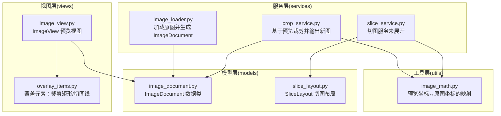
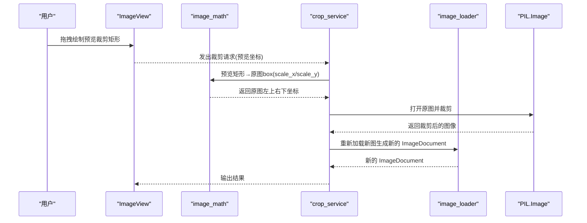
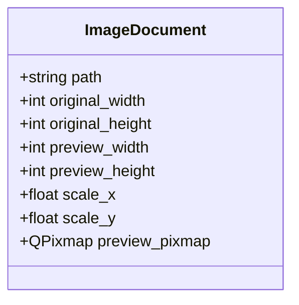
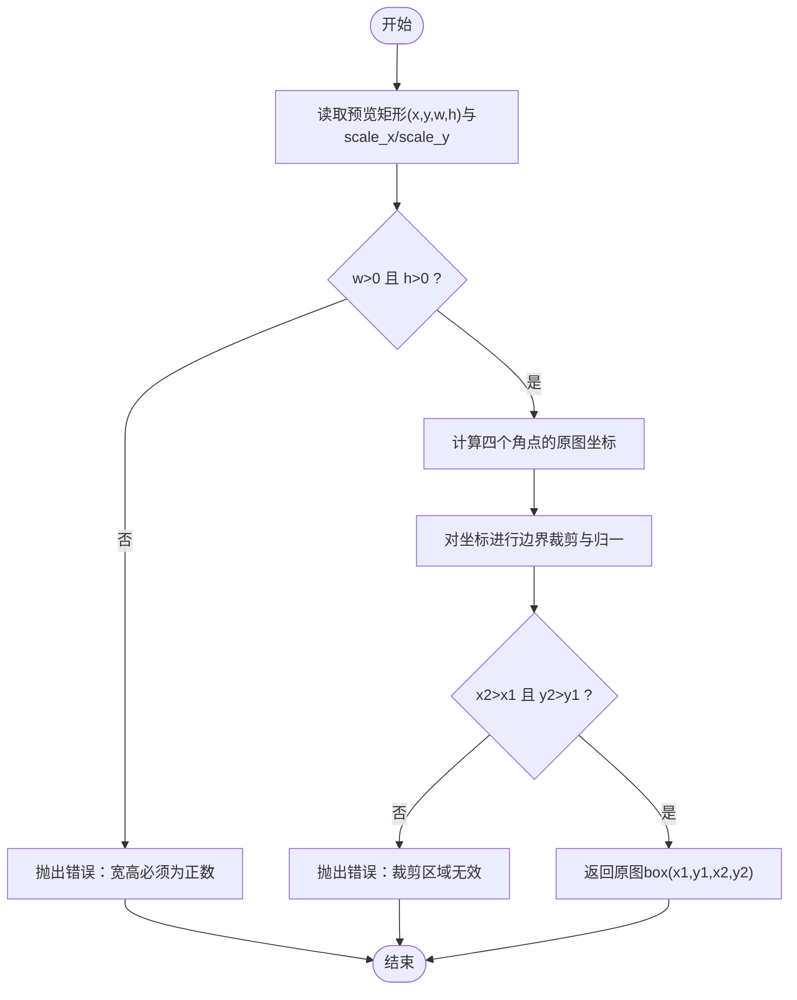
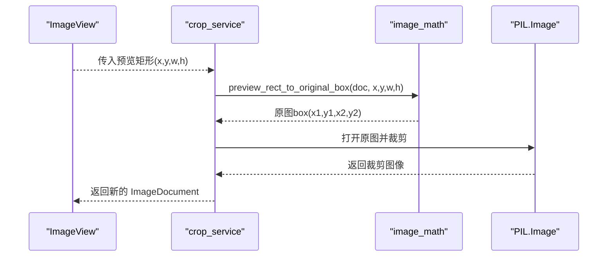
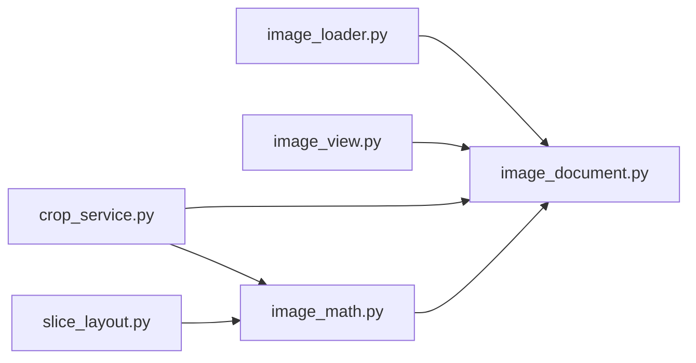

# ImageDocument 数据模型

<cite>
**本文引用的文件**
- [img_slicer_tool/models/image_document.py](file://img_slicer_tool/models/image_document.py)
- [img_slicer_tool/services/image_loader.py](file://img_slicer_tool/services/image_loader.py)
- [img_slicer_tool/utils/image_math.py](file://img_slicer_tool/utils/image_math.py)
- [img_slicer_tool/services/crop_service.py](file://img_slicer_tool/services/crop_service.py)
- [img_slicer_tool/views/image_view.py](file://img_slicer_tool/views/image_view.py)
- [img_slicer_tool/models/slice_layout.py](file://img_slicer_tool/models/slice_layout.py)
</cite>

## 目录
1. [简介](#简介)
2. [项目结构](#项目结构)
3. [核心组件](#核心组件)
4. [架构总览](#架构总览)
5. [详细组件分析](#详细组件分析)
6. [依赖关系分析](#依赖关系分析)
7. [性能考量](#性能考量)
8. [故障排查指南](#故障排查指南)
9. [结论](#结论)

## 简介
本文件围绕 ImageDocument 数据类进行系统化文档化，重点说明其字段语义、在图像加载流程中的生成与传递、以及在视图渲染与裁剪/切图服务之间的桥梁作用。特别强调 scale_x 与 scale_y 在将预览界面中的选择坐标转换为原图真实像素坐标时的关键作用，并通过序列图展示从用户交互到最终裁剪输出的完整流程。

## 项目结构
本项目采用按功能分层的组织方式：
- models：数据模型与布局定义
- services：业务服务（图像加载、裁剪、切图）
- views：UI 视图与覆盖元素
- utils：通用数学与日志工具
- app：应用入口与主窗口

图表来源
- [img_slicer_tool/models/image_document.py](file://img_slicer_tool/models/image_document.py#L1-L18)
- [img_slicer_tool/services/image_loader.py](file://img_slicer_tool/services/image_loader.py#L1-L68)
- [img_slicer_tool/utils/image_math.py](file://img_slicer_tool/utils/image_math.py#L1-L76)
- [img_slicer_tool/services/crop_service.py](file://img_slicer_tool/services/crop_service.py#L1-L38)
- [img_slicer_tool/views/image_view.py](file://img_slicer_tool/views/image_view.py#L1-L218)
- [img_slicer_tool/models/slice_layout.py](file://img_slicer_tool/models/slice_layout.py#L1-L30)

章节来源
- [img_slicer_tool/models/image_document.py](file://img_slicer_tool/models/image_document.py#L1-L18)
- [img_slicer_tool/services/image_loader.py](file://img_slicer_tool/services/image_loader.py#L1-L68)
- [img_slicer_tool/utils/image_math.py](file://img_slicer_tool/utils/image_math.py#L1-L76)
- [img_slicer_tool/services/crop_service.py](file://img_slicer_tool/services/crop_service.py#L1-L38)
- [img_slicer_tool/views/image_view.py](file://img_slicer_tool/views/image_view.py#L1-L218)
- [img_slicer_tool/models/slice_layout.py](file://img_slicer_tool/models/slice_layout.py#L1-L30)

## 核心组件
- ImageDocument：不可变数据容器，承载图像路径、原图与预览图尺寸、预览图像对象及坐标缩放因子。
- image_loader：负责读取原图、生成预览图、计算缩放因子并构造 ImageDocument。
- image_math：提供预览坐标到原图坐标的映射工具。
- crop_service：消费 ImageDocument 的缩放信息，将预览裁剪区域转换为原图裁剪 box 并输出新图。
- views：ImageView 与覆盖元素负责用户交互与可视化，最终将预览坐标事件传递给业务层。

章节来源
- [img_slicer_tool/models/image_document.py](file://img_slicer_tool/models/image_document.py#L1-L18)
- [img_slicer_tool/services/image_loader.py](file://img_slicer_tool/services/image_loader.py#L1-L68)
- [img_slicer_tool/utils/image_math.py](file://img_slicer_tool/utils/image_math.py#L1-L76)
- [img_slicer_tool/services/crop_service.py](file://img_slicer_tool/services/crop_service.py#L1-L38)
- [img_slicer_tool/views/image_view.py](file://img_slicer_tool/views/image_view.py#L1-L218)

## 架构总览
下图展示了从图像加载到裁剪输出的端到端流程，以及 ImageDocument 在其中的传递与作用。

图表来源
- [img_slicer_tool/views/image_view.py](file://img_slicer_tool/views/image_view.py#L155-L174)
- [img_slicer_tool/utils/image_math.py](file://img_slicer_tool/utils/image_math.py#L17-L48)
- [img_slicer_tool/services/crop_service.py](file://img_slicer_tool/services/crop_service.py#L13-L38)
- [img_slicer_tool/services/image_loader.py](file://img_slicer_tool/services/image_loader.py#L24-L55)

## 详细组件分析

### ImageDocument 数据类
- 字段语义
  - path：原图文件路径，用于后续读取与保存。
  - original_width/original_height：原图像素尺寸，决定坐标映射上限。
  - preview_width/preview_height：预览图像素尺寸，用于 UI 渲染与交互。
  - scale_x/scale_y：预览坐标到原图坐标的缩放因子，用于将预览矩形/线转换为原图 box。
  - preview_pixmap：Qt 中的预览图像对象，用于视图渲染。
- 不可变性与安全性
  - 使用 dataclass(slots=True) 提供不可变的数据容器语义，避免意外修改；同时 slots 优化内存占用与属性访问速度。
- 传递边界
  - 由 image_loader 生成后，在视图渲染与裁剪/切图服务之间安全传递，确保各层仅读取必要信息。

图表来源
- [img_slicer_tool/models/image_document.py](file://img_slicer_tool/models/image_document.py#L8-L18)

章节来源
- [img_slicer_tool/models/image_document.py](file://img_slicer_tool/models/image_document.py#L1-L18)

### 图像加载与 ImageDocument 生成
- 流程要点
  - 读取原图尺寸 original_width/original_height。
  - 计算预览尺寸 preview_width/preview_height 与缩放因子 scale_x/scale_y。
  - 将预览图转为 Qt 的 QImage/QPixmap，封装为 ImageDocument。
- 关键实现参考
  - 预览尺寸计算与缩放因子设置
  - 预览图生成与 Qt 对象创建
  - 返回 ImageDocument 实例

章节来源
- [img_slicer_tool/services/image_loader.py](file://img_slicer_tool/services/image_loader.py#L14-L55)

### 预览坐标到原图坐标的映射
- 核心算法
  - 将预览矩形的四个角点分别乘以 scale_x/scale_y，得到原图坐标。
  - 进行边界裁剪与有效性校验，确保返回的 box 合法。
- 典型用法
  - crop_service 在收到预览矩形后调用映射函数，得到原图裁剪 box。
  - 切图服务使用类似逻辑将预览线转换为原图边界。

图表来源
- [img_slicer_tool/utils/image_math.py](file://img_slicer_tool/utils/image_math.py#L17-L48)

章节来源
- [img_slicer_tool/utils/image_math.py](file://img_slicer_tool/utils/image_math.py#L17-L48)

### 裁剪服务中的使用示例
- 输入：ImageDocument（包含缩放信息）+ 预览矩形（x,y,w,h）
- 处理：
  - 校验原图路径存在性。
  - 调用映射函数得到原图 box。
  - 使用 PIL 打开原图并裁剪，按目标格式保存。
  - 重新加载新图生成新的 ImageDocument 返回。
- 输出：新的 ImageDocument，可用于后续视图渲染或进一步处理。

图表来源
- [img_slicer_tool/services/crop_service.py](file://img_slicer_tool/services/crop_service.py#L13-L38)
- [img_slicer_tool/utils/image_math.py](file://img_slicer_tool/utils/image_math.py#L17-L48)

章节来源
- [img_slicer_tool/services/crop_service.py](file://img_slicer_tool/services/crop_service.py#L13-L38)

### 视图层与交互
- ImageView 负责：
  - 设置 ImageDocument 并渲染预览图。
  - 响应鼠标拖拽绘制裁剪矩形，发布 cropRequested 信号。
  - 支持切图模式，添加水平/垂直切图线并收集布局。
- 覆盖元素：
  - CropRectItem：半透明填充与虚线边框的裁剪矩形。
  - GuideLineItem：可移动的红色虚线切图线，支持选择与拖动。

章节来源
- [img_slicer_tool/views/image_view.py](file://img_slicer_tool/views/image_view.py#L14-L218)
- [img_slicer_tool/views/overlay_items.py](file://img_slicer_tool/views/overlay_items.py#L1-L57)

### 切图布局与坐标映射
- SliceLayout 保存预览坐标系下的切图线集合，并提供标准化与边界扩展方法。
- image_math 提供将预览线转换为原图边界的函数，同样依赖 scale_x/scale_y。

章节来源
- [img_slicer_tool/models/slice_layout.py](file://img_slicer_tool/models/slice_layout.py#L1-L30)
- [img_slicer_tool/utils/image_math.py](file://img_slicer_tool/utils/image_math.py#L50-L76)

## 依赖关系分析
- ImageDocument 作为跨层数据载体，被以下模块直接依赖：
  - image_loader：生成并填充字段。
  - image_view：读取 preview_pixmap 进行渲染。
  - crop_service：读取 scale_x/scale_y 与 original_* 尺寸进行坐标映射。
  - image_math：提供坐标转换工具函数。
  - slice_layout：配合切图服务进行布局管理。

图表来源
- [img_slicer_tool/services/image_loader.py](file://img_slicer_tool/services/image_loader.py#L24-L55)
- [img_slicer_tool/views/image_view.py](file://img_slicer_tool/views/image_view.py#L43-L58)
- [img_slicer_tool/services/crop_service.py](file://img_slicer_tool/services/crop_service.py#L13-L38)
- [img_slicer_tool/utils/image_math.py](file://img_slicer_tool/utils/image_math.py#L17-L76)
- [img_slicer_tool/models/slice_layout.py](file://img_slicer_tool/models/slice_layout.py#L1-L30)
- [img_slicer_tool/models/image_document.py](file://img_slicer_tool/models/image_document.py#L8-L18)

章节来源
- [img_slicer_tool/services/image_loader.py](file://img_slicer_tool/services/image_loader.py#L24-L55)
- [img_slicer_tool/views/image_view.py](file://img_slicer_tool/views/image_view.py#L43-L58)
- [img_slicer_tool/services/crop_service.py](file://img_slicer_tool/services/crop_service.py#L13-L38)
- [img_slicer_tool/utils/image_math.py](file://img_slicer_tool/utils/image_math.py#L17-L76)
- [img_slicer_tool/models/slice_layout.py](file://img_slicer_tool/models/slice_layout.py#L1-L30)
- [img_slicer_tool/models/image_document.py](file://img_slicer_tool/models/image_document.py#L8-L18)

## 性能考量
- dataclass(slots=True) 的优势
  - 内存占用更低：slots 禁止动态属性创建，减少每实例的字典存储开销。
  - 属性访问更快：通过紧凑布局提升属性查找效率。
  - 不可变语义：避免意外修改，降低并发与状态管理风险。
- 缩放因子的复用
  - scale_x/scale_y 在多处被复用（裁剪、切图），避免重复计算，提高整体性能。
- 预览图尺寸控制
  - image_loader 限制最大预览尺寸，平衡 UI 流畅度与内存占用。

章节来源
- [img_slicer_tool/models/image_document.py](file://img_slicer_tool/models/image_document.py#L8-L18)
- [img_slicer_tool/services/image_loader.py](file://img_slicer_tool/services/image_loader.py#L11-L21)

## 故障排查指南
- 常见问题与定位
  - 预览矩形无效：当 w<=0 或 h<=0，或映射后 x2<=x1 或 y2<=y1 时会抛出错误。检查视图层是否正确绘制矩形并满足最小尺寸。
  - 原图路径不存在：裁剪服务在打开原图前会校验路径，若不存在则抛出异常。确认 ImageDocument.path 是否正确。
  - 切图边界不足：当预览线数量不足以形成有效宫格时会报错。检查切图线数量与分布。
- 排查步骤建议
  - 在视图层确认 cropRequested 信号是否发出正确的预览坐标。
  - 在 image_math 中验证 scale_x/scale_y 是否与预览尺寸一致。
  - 在 crop_service 中核对 PIL 裁剪 box 的边界是否越界。

章节来源
- [img_slicer_tool/utils/image_math.py](file://img_slicer_tool/utils/image_math.py#L17-L48)
- [img_slicer_tool/services/crop_service.py](file://img_slicer_tool/services/crop_service.py#L20-L38)
- [img_slicer_tool/views/image_view.py](file://img_slicer_tool/views/image_view.py#L155-L174)

## 结论
ImageDocument 作为图像处理流水线中的关键数据载体，通过 dataclass(slots=True) 提供了高性能、低内存占用的不可变数据结构。它在图像加载阶段生成，贯穿视图渲染与裁剪/切图服务，借助 scale_x/scale_y 实现预览坐标到原图坐标的可靠映射。该设计保证了跨层数据传递的一致性与安全性，是实现高质量图像编辑体验的基础。