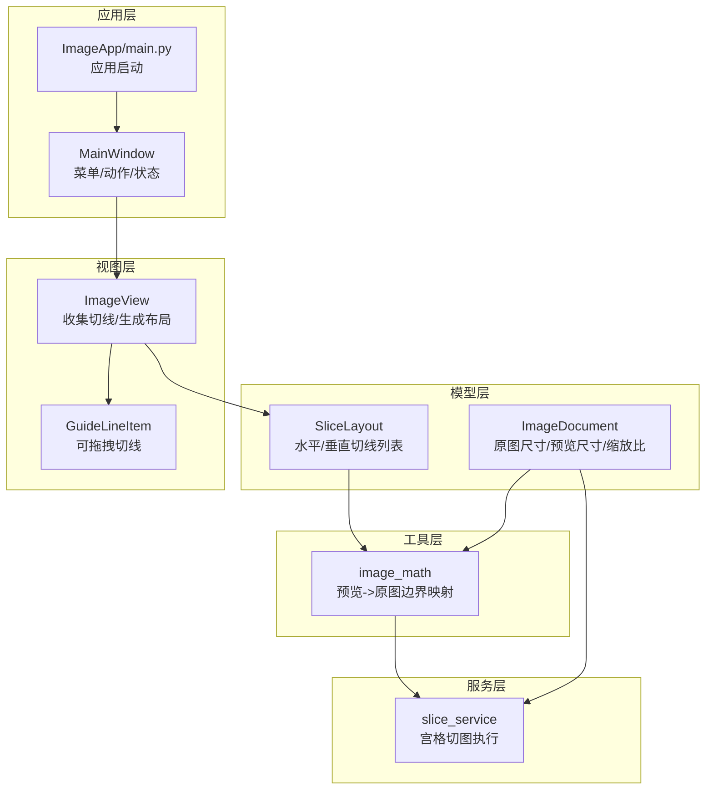
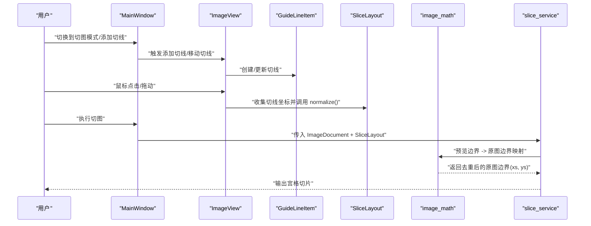
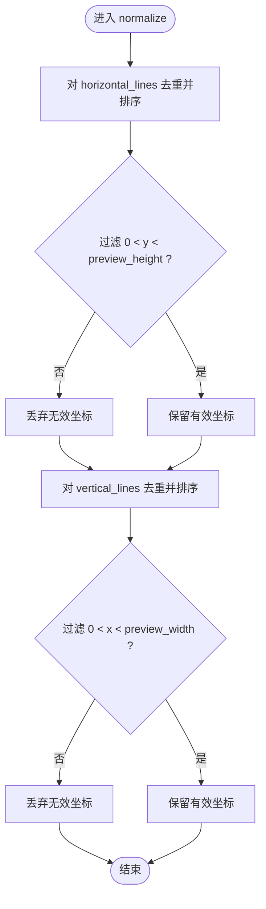
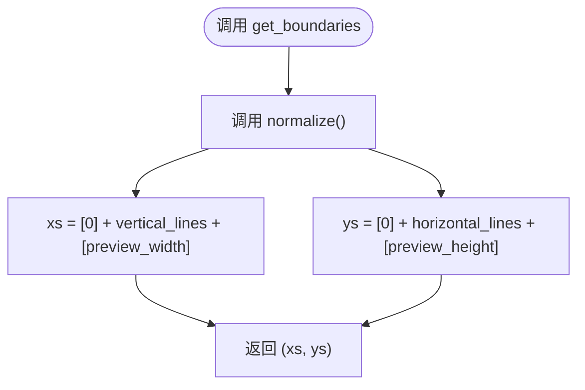
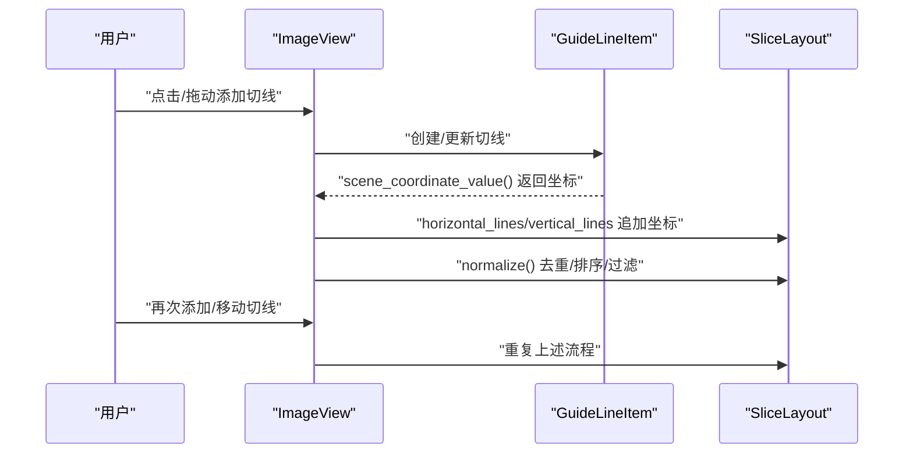
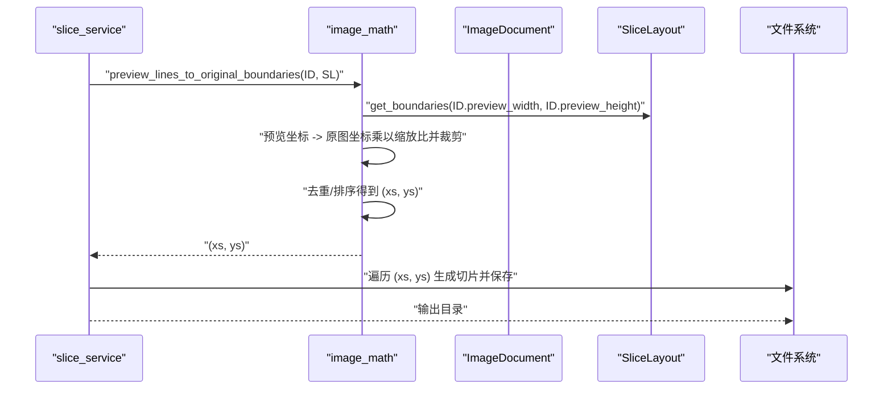
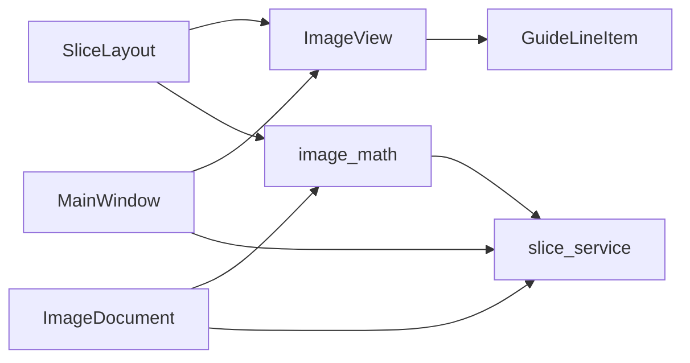

# SliceLayout 数据模型

<cite>
**本文引用的文件**
- [slice_layout.py](file://img_slicer_tool/models/slice_layout.py)
- [image_math.py](file://img_slicer_tool/utils/image_math.py)
- [slice_service.py](file://img_slicer_tool/services/slice_service.py)
- [image_view.py](file://img_slicer_tool/views/image_view.py)
- [overlay_items.py](file://img_slicer_tool/views/overlay_items.py)
- [image_document.py](file://img_slicer_tool/models/image_document.py)
- [main_window.py](file://img_slicer_tool/app/main_window.py)
- [application.py](file://img_slicer_tool/app/application.py)
- [main.py](file://img_slicer_tool/main.py)
</cite>

## 目录
1. [简介](#简介)
2. [项目结构](#项目结构)
3. [核心组件](#核心组件)
4. [架构总览](#架构总览)
5. [详细组件分析](#详细组件分析)
6. [依赖关系分析](#依赖关系分析)
7. [性能考量](#性能考量)
8. [故障排查指南](#故障排查指南)
9. [结论](#结论)

## 简介
本文件围绕 SliceLayout 数据类展开，系统性阐述其设计目标、字段语义、规范化处理逻辑、边界生成机制，以及在用户交互与切图服务中的角色定位。SliceLayout 以“预览坐标系”为基准，使用归一化坐标存储水平与垂直切图线，通过标准化与边界合并，形成可用于宫格切图的完整边界序列；随后由切图服务将其映射回原图坐标并执行裁剪输出。

## 项目结构
与 SliceLayout 直接相关的核心模块分布如下：
- 模型层：SliceLayout（数据类）、ImageDocument（图像元信息）
- 视图层：ImageView（用户交互）、GuideLineItem（切图线可视化）
- 工具层：image_math（坐标映射与边界去重）
- 服务层：slice_service（执行切图）
- 应用层：main_window（菜单与动作）、application（应用入口）、main（程序入口）

图表来源
- [slice_layout.py](file://img_slicer_tool/models/slice_layout.py#L1-L30)
- [image_document.py](file://img_slicer_tool/models/image_document.py#L1-L18)
- [image_view.py](file://img_slicer_tool/views/image_view.py#L1-L218)
- [overlay_items.py](file://img_slicer_tool/views/overlay_items.py#L1-L57)
- [image_math.py](file://img_slicer_tool/utils/image_math.py#L1-L76)
- [slice_service.py](file://img_slicer_tool/services/slice_service.py#L1-L62)
- [main_window.py](file://img_slicer_tool/app/main_window.py#L1-L248)
- [application.py](file://img_slicer_tool/app/application.py#L1-L35)
- [main.py](file://img_slicer_tool/main.py#L1-L13)

章节来源
- [slice_layout.py](file://img_slicer_tool/models/slice_layout.py#L1-L30)
- [image_view.py](file://img_slicer_tool/views/image_view.py#L1-L218)
- [overlay_items.py](file://img_slicer_tool/views/overlay_items.py#L1-L57)
- [image_math.py](file://img_slicer_tool/utils/image_math.py#L1-L76)
- [slice_service.py](file://img_slicer_tool/services/slice_service.py#L1-L62)
- [image_document.py](file://img_slicer_tool/models/image_document.py#L1-L18)
- [main_window.py](file://img_slicer_tool/app/main_window.py#L1-L248)
- [application.py](file://img_slicer_tool/app/application.py#L1-L35)
- [main.py](file://img_slicer_tool/main.py#L1-L13)

## 核心组件
- SliceLayout：轻量级数据容器，包含两个列表字段 horizontal_lines 与 vertical_lines，分别存储预览坐标系下水平与垂直方向的切线位置。这些坐标采用归一化形式（0..preview_height 或 0..preview_width），便于跨不同预览尺寸复用。
- normalize 方法：对两条列表进行去重、排序，并仅保留位于图像内部的有效坐标（排除边界值），确保后续边界生成的合法性与稳定性。
- get_boundaries 方法：在 normalize 的基础上，将图像的左右边界（0 与预览宽度）和上下边界（0 与预览高度）加入，形成完整的切分边界序列（xs, ys），作为宫格切图的输入基础。

章节来源
- [slice_layout.py](file://img_slicer_tool/models/slice_layout.py#L1-L30)

## 架构总览
从用户交互到切图输出的端到端流程如下：

图表来源
- [main_window.py](file://img_slicer_tool/app/main_window.py#L168-L248)
- [image_view.py](file://img_slicer_tool/views/image_view.py#L176-L218)
- [overlay_items.py](file://img_slicer_tool/views/overlay_items.py#L1-L57)
- [slice_layout.py](file://img_slicer_tool/models/slice_layout.py#L1-L30)
- [image_math.py](file://img_slicer_tool/utils/image_math.py#L50-L76)
- [slice_service.py](file://img_slicer_tool/services/slice_service.py#L1-L62)

## 详细组件分析

### SliceLayout 类与字段语义
- 字段
  - horizontal_lines：预览坐标系下水平切线的归一化坐标列表（0..preview_height）
  - vertical_lines：预览坐标系下垂直切线的归一化坐标列表（0..preview_width）
- 设计要点
  - 归一化坐标避免了因预览缩放导致的坐标漂移，保证布局在不同缩放级别下的一致性
  - 列表元素为浮点数，便于平滑移动与精确计算
  - 作为轻量级状态容器，不包含复杂业务逻辑，职责单一且易于测试

章节来源
- [slice_layout.py](file://img_slicer_tool/models/slice_layout.py#L1-L30)

### normalize 方法：去重、排序与边界过滤
- 功能概述
  - 对 horizontal_lines 进行去重、排序，并仅保留满足 0 < y < preview_height 的有效坐标
  - 对 vertical_lines 进行去重、排序，并仅保留满足 0 < x < preview_width 的有效坐标
- 复杂度分析
  - 去重使用集合操作，时间复杂度近似 O(n)，排序为 O(m log m)（m 为去重后长度）
  - 整体复杂度约 O(n + m log m)，其中 n 为输入长度，m 为去重后长度
- 边界处理
  - 显式排除边界值（0 与最大宽高），避免生成无效切片
  - 保证后续边界列表至少包含两个有效值（起止边界），否则无法形成有效宫格

图表来源
- [slice_layout.py](file://img_slicer_tool/models/slice_layout.py#L14-L18)

章节来源
- [slice_layout.py](file://img_slicer_tool/models/slice_layout.py#L14-L18)

### get_boundaries 方法：合并图像边界与生成完整边界序列
- 功能概述
  - 先调用 normalize，确保内部坐标合法
  - 将图像左右边界（0 与预览宽度）合并到 vertical_lines，得到 xs
  - 将图像上下边界（0 与预览高度）合并到 horizontal_lines，得到 ys
  - 返回 (xs, ys) 作为宫格切图的完整边界序列
- 关键点
  - xs 与 ys 均为升序排列，且包含起止边界，确保覆盖整幅预览图
  - 该序列是后续原图坐标映射与切图执行的基础

图表来源
- [slice_layout.py](file://img_slicer_tool/models/slice_layout.py#L19-L30)

章节来源
- [slice_layout.py](file://img_slicer_tool/models/slice_layout.py#L19-L30)

### 用户交互更新 SliceLayout 的过程
- 添加/移动切线
  - ImageView 在切图模式下接收鼠标事件，根据修饰键决定添加水平或垂直切线
  - GuideLineItem 提供场景坐标值，ImageView 收集为 SliceLayout 的 horizontal_lines 或 vertical_lines
  - 添加完成后调用 normalize，确保坐标合法
- 生成宫格线
  - MainWindow 提供“按行列生成宫格线”的菜单项，通过等间距在预览图上添加多条切线
- 执行切图
  - MainWindow 调用 ImageView.get_slice_layout 获取 SliceLayout
  - 传入 slice_service，开始切图流程

图表来源
- [image_view.py](file://img_slicer_tool/views/image_view.py#L176-L218)
- [overlay_items.py](file://img_slicer_tool/views/overlay_items.py#L48-L57)
- [slice_layout.py](file://img_slicer_tool/models/slice_layout.py#L14-L18)

章节来源
- [image_view.py](file://img_slicer_tool/views/image_view.py#L116-L134)
- [image_view.py](file://img_slicer_tool/views/image_view.py#L176-L218)
- [overlay_items.py](file://img_slicer_tool/views/overlay_items.py#L27-L57)
- [main_window.py](file://img_slicer_tool/app/main_window.py#L185-L215)

### 从 SliceLayout 到原图切片：坐标映射与执行
- 坐标映射
  - image_math.preview_lines_to_original_boundaries 接收 ImageDocument 与 SliceLayout
  - 先通过 SliceLayout.get_boundaries 获取预览边界 (xs_preview, ys_preview)
  - 将每个预览坐标乘以对应缩放比（scale_x/scale_y）并四舍五入，同时限制在原图范围内
  - 再次去重与排序，得到原图边界 (xs_original, ys_original)
  - 若边界数量不足，抛出异常，防止无效切图
- 切图执行
  - slice_service.slice_document_to_tiles 读取原图，遍历边界对生成矩形区域并裁剪保存
  - 输出目录按原图名建立子目录，按行列编号命名切片文件

图表来源
- [slice_service.py](file://img_slicer_tool/services/slice_service.py#L1-L62)
- [image_math.py](file://img_slicer_tool/utils/image_math.py#L50-L76)
- [slice_layout.py](file://img_slicer_tool/models/slice_layout.py#L19-L30)
- [image_document.py](file://img_slicer_tool/models/image_document.py#L1-L18)

章节来源
- [slice_service.py](file://img_slicer_tool/services/slice_service.py#L1-L62)
- [image_math.py](file://img_slicer_tool/utils/image_math.py#L50-L76)
- [image_document.py](file://img_slicer_tool/models/image_document.py#L1-L18)

## 依赖关系分析
- SliceLayout 与 View 层
  - ImageView 通过 GuideLineItem 的场景坐标值填充 SliceLayout，并在每次更新后调用 normalize
- SliceLayout 与工具层
  - image_math 使用 SliceLayout 的边界生成结果，完成预览到原图的坐标映射
- SliceLayout 与服务层
  - slice_service 依赖 image_math 的映射结果，执行实际的切图与保存
- 应用层协调
  - MainWindow 统一调度菜单动作，驱动 View 层与 Service 层协作

图表来源
- [slice_layout.py](file://img_slicer_tool/models/slice_layout.py#L1-L30)
- [image_view.py](file://img_slicer_tool/views/image_view.py#L176-L218)
- [overlay_items.py](file://img_slicer_tool/views/overlay_items.py#L1-L57)
- [image_math.py](file://img_slicer_tool/utils/image_math.py#L50-L76)
- [slice_service.py](file://img_slicer_tool/services/slice_service.py#L1-L62)
- [image_document.py](file://img_slicer_tool/models/image_document.py#L1-L18)
- [main_window.py](file://img_slicer_tool/app/main_window.py#L168-L248)

章节来源
- [image_view.py](file://img_slicer_tool/views/image_view.py#L176-L218)
- [overlay_items.py](file://img_slicer_tool/views/overlay_items.py#L1-L57)
- [image_math.py](file://img_slicer_tool/utils/image_math.py#L50-L76)
- [slice_service.py](file://img_slicer_tool/services/slice_service.py#L1-L62)
- [main_window.py](file://img_slicer_tool/app/main_window.py#L168-L248)

## 性能考量
- 去重与排序
  - 使用集合去重与内置排序，时间复杂度近似 O(n + m log m)，在切线数量较少时开销可控
- 边界过滤
  - 过滤条件简单，常数时间判断，整体影响较小
- 原图映射
  - 遍历边界列表进行缩放与裁剪，时间复杂度 O(k)，k 为边界数量
- 建议
  - 在高频交互场景下，可考虑延迟批量更新 SliceLayout，减少 normalize 调用次数
  - 对于大量切线，建议在 UI 层做输入约束，避免一次性添加过多切线导致排序成本上升

## 故障排查指南
- 切图失败或无输出
  - 检查 SliceLayout 是否为空：若水平/垂直切线均为空，可能仅导出整张图片为一个切片
  - 确认 MainWindow 在空布局时的确认提示是否被忽略
- 坐标越界或无效切片
  - 确保所有切线位置位于预览图内部（0..width/height），normalize 已自动过滤边界值
  - 检查 image_math 的映射逻辑，确认缩放比与边界裁剪是否正确
- 文件保存异常
  - 确认输出目录存在且有写权限
  - 检查图片格式特定参数（如 JPEG 的 subsampling）是否正确

章节来源
- [main_window.py](file://img_slicer_tool/app/main_window.py#L216-L248)
- [slice_service.py](file://img_slicer_tool/services/slice_service.py#L1-L62)
- [image_math.py](file://img_slicer_tool/utils/image_math.py#L50-L76)
- [slice_layout.py](file://img_slicer_tool/models/slice_layout.py#L14-L18)

## 结论
SliceLayout 以极简的数据结构承载了预览坐标系下的切图布局，通过 normalize 与 get_boundaries 实现了对无效坐标与边界外切线的清理与补全，从而为后续的原图坐标映射与切图执行提供了稳定、一致的输入。它在用户交互与服务层之间扮演了关键桥梁的角色，既保持了低耦合与高内聚，又确保了算法流程的可维护性与可扩展性。