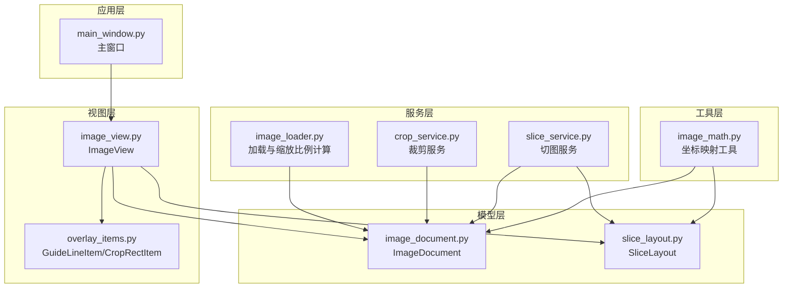
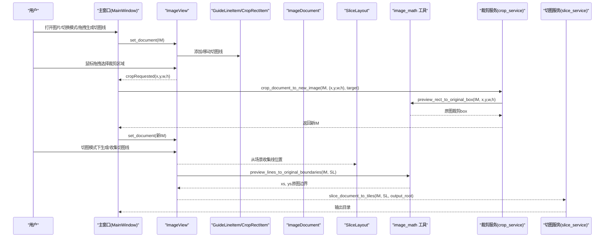
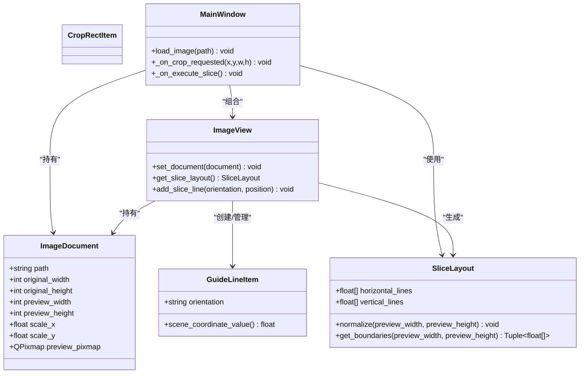
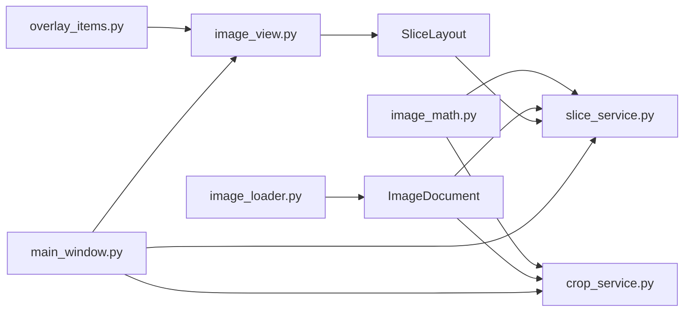
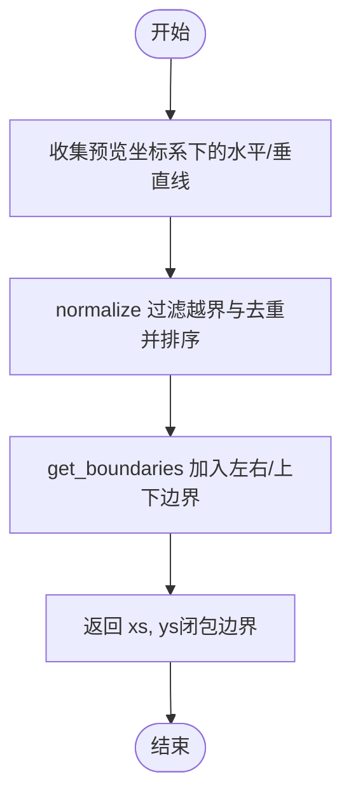

# 数据模型设计

<cite>
**本文引用的文件**
- [img_slicer_tool/models/image_document.py](file://img_slicer_tool/models/image_document.py)
- [img_slicer_tool/models/slice_layout.py](file://img_slicer_tool/models/slice_layout.py)
- [img_slicer_tool/utils/image_math.py](file://img_slicer_tool/utils/image_math.py)
- [img_slicer_tool/services/image_loader.py](file://img_slicer_tool/services/image_loader.py)
- [img_slicer_tool/services/crop_service.py](file://img_slicer_tool/services/crop_service.py)
- [img_slicer_tool/services/slice_service.py](file://img_slicer_tool/services/slice_service.py)
- [img_slicer_tool/views/image_view.py](file://img_slicer_tool/views/image_view.py)
- [img_slicer_tool/views/overlay_items.py](file://img_slicer_tool/views/overlay_items.py)
- [img_slicer_tool/app/main_window.py](file://img_slicer_tool/app/main_window.py)
</cite>

## 目录
1. [简介](#简介)
2. [项目结构](#项目结构)
3. [核心组件](#核心组件)
4. [架构总览](#架构总览)
5. [详细组件分析](#详细组件分析)
6. [依赖关系分析](#依赖关系分析)
7. [性能考量](#性能考量)
8. [故障排查指南](#故障排查指南)
9. [结论](#结论)
10. [附录](#附录)

## 简介
本文件系统性梳理 PictureMaster 中的核心数据模型：ImageDocument 与 SliceLayout。重点说明：
- ImageDocument 的字段语义与坐标映射关系，尤其是缩放比例 scale_x、scale_y 在预览坐标与原图坐标之间的桥梁作用；
- SliceLayout 如何以“预览坐标系”的归一化坐标存储水平线与垂直线，并通过标准化与边界扩展实现安全的边界检查与动态更新；
- 二者作为不可变数据结构在各模块间传递的机制，如何避免状态混乱；
- 实际使用示例：从 ImageView 获取裁剪区域并转换为原图坐标；SliceLayout 参与切图算法计算的流程。

## 项目结构
本项目采用分层组织：models（数据模型）、utils（数学工具）、services（业务服务）、views（视图与覆盖层）、app（应用入口与主窗口）。数据模型位于 models 层，是跨层传递的稳定契约。

图表来源
- [img_slicer_tool/models/image_document.py](file://img_slicer_tool/models/image_document.py#L1-L18)
- [img_slicer_tool/models/slice_layout.py](file://img_slicer_tool/models/slice_layout.py#L1-L30)
- [img_slicer_tool/utils/image_math.py](file://img_slicer_tool/utils/image_math.py#L1-L76)
- [img_slicer_tool/services/image_loader.py](file://img_slicer_tool/services/image_loader.py#L1-L68)
- [img_slicer_tool/services/crop_service.py](file://img_slicer_tool/services/crop_service.py#L1-L38)
- [img_slicer_tool/services/slice_service.py](file://img_slicer_tool/services/slice_service.py#L1-L62)
- [img_slicer_tool/views/image_view.py](file://img_slicer_tool/views/image_view.py#L1-L218)
- [img_slicer_tool/views/overlay_items.py](file://img_slicer_tool/views/overlay_items.py#L1-L57)
- [img_slicer_tool/app/main_window.py](file://img_slicer_tool/app/main_window.py#L1-L262)

章节来源
- [img_slicer_tool/app/main_window.py](file://img_slicer_tool/app/main_window.py#L1-L262)
- [img_slicer_tool/views/image_view.py](file://img_slicer_tool/views/image_view.py#L1-L218)
- [img_slicer_tool/views/overlay_items.py](file://img_slicer_tool/views/overlay_items.py#L1-L57)
- [img_slicer_tool/models/image_document.py](file://img_slicer_tool/models/image_document.py#L1-L18)
- [img_slicer_tool/models/slice_layout.py](file://img_slicer_tool/models/slice_layout.py#L1-L30)
- [img_slicer_tool/utils/image_math.py](file://img_slicer_tool/utils/image_math.py#L1-L76)
- [img_slicer_tool/services/image_loader.py](file://img_slicer_tool/services/image_loader.py#L1-L68)
- [img_slicer_tool/services/crop_service.py](file://img_slicer_tool/services/crop_service.py#L1-L38)
- [img_slicer_tool/services/slice_service.py](file://img_slicer_tool/services/slice_service.py#L1-L62)

## 核心组件
- ImageDocument：描述一张图片的“原图尺寸”“预览尺寸”“预览图象素”以及“缩放比例”，用于在预览坐标与原图坐标之间进行精确映射。
- SliceLayout：描述预览坐标系下的切图线集合（水平线与垂直线），提供标准化与边界扩展能力，确保后续切图边界合法且闭包完整。

章节来源
- [img_slicer_tool/models/image_document.py](file://img_slicer_tool/models/image_document.py#L1-L18)
- [img_slicer_tool/models/slice_layout.py](file://img_slicer_tool/models/slice_layout.py#L1-L30)

## 架构总览
下图展示从用户交互到数据模型再到业务服务的整体流程，强调数据模型在其中的“契约”地位。

图表来源
- [img_slicer_tool/app/main_window.py](file://img_slicer_tool/app/main_window.py#L1-L262)
- [img_slicer_tool/views/image_view.py](file://img_slicer_tool/views/image_view.py#L1-L218)
- [img_slicer_tool/views/overlay_items.py](file://img_slicer_tool/views/overlay_items.py#L1-L57)
- [img_slicer_tool/utils/image_math.py](file://img_slicer_tool/utils/image_math.py#L1-L76)
- [img_slicer_tool/services/crop_service.py](file://img_slicer_tool/services/crop_service.py#L1-L38)
- [img_slicer_tool/services/slice_service.py](file://img_slicer_tool/services/slice_service.py#L1-L62)

## 详细组件分析

### ImageDocument 数据模型
- 字段语义
  - path：原始图片路径
  - original_width/original_height：原图像素尺寸
  - preview_width/preview_height：预览图像素尺寸
  - scale_x/scale_y：预览坐标到原图坐标的缩放因子（scale_x = original_width / preview_width）
  - preview_pixmap：用于预览显示的 QPixmap
- 坐标映射要点
  - 预览坐标系中的点 (x_preview, y_preview)，通过乘以 scale_x/scale_y 即可映射到原图坐标 (x_orig, y_orig)
  - 由于预览尺寸可能小于原图，scale_x/scale_y ≥ 1，因此预览坐标更精细，原图坐标更粗略
- 不可变性与传递
  - 使用 dataclass 并启用 slots，减少内存占用，提升访问效率
  - 作为纯数据载体，在各模块间传递时不会被意外修改，避免状态混乱

章节来源
- [img_slicer_tool/models/image_document.py](file://img_slicer_tool/models/image_document.py#L1-L18)
- [img_slicer_tool/services/image_loader.py](file://img_slicer_tool/services/image_loader.py#L1-L68)

### SliceLayout 数据模型
- 字段语义
  - horizontal_lines：预览坐标系下的水平线位置列表（归一化）
  - vertical_lines：预览坐标系下的垂直线位置列表（归一化）
- 标准化与边界扩展
  - normalize(preview_width, preview_height)：去重、排序、过滤越界值，仅保留 (0, preview_height) 和 (0, preview_width) 区间内的有效线
  - get_boundaries(preview_width, preview_height)：在标准化基础上，自动加入左右边界（0 与 width）与上下边界（0 与 height），形成闭包边界序列
- 不可变性与传递
  - 同样使用 dataclass，作为只读数据容器，避免在业务逻辑中被意外修改
  - 通过标准化与边界扩展，保证后续切图算法输入稳定可靠

章节来源
- [img_slicer_tool/models/slice_layout.py](file://img_slicer_tool/models/slice_layout.py#L1-L30)

### 坐标映射与转换工具
- preview_rect_to_original_box：将预览矩形 (x,y,w,h) 映射为原图裁剪 box，并进行边界裁剪与有效性校验
- preview_lines_to_original_boundaries：将 SliceLayout 的预览线转换为原图边界序列 xs、ys，并进行去重、排序与最小数量校验

章节来源
- [img_slicer_tool/utils/image_math.py](file://img_slicer_tool/utils/image_math.py#L1-L76)

### 视图与覆盖层
- ImageView：负责接收用户输入（鼠标拖拽、键盘快捷键），在预览坐标系内生成裁剪矩形与切图线，并将这些信息汇总为 SliceLayout
- GuideLineItem：可移动、可选中的红色虚线，提供 scene_coordinate_value() 获取其在场景中的关键坐标
- CropRectItem：半透明填充、虚线边框的临时选择矩形

章节来源
- [img_slicer_tool/views/image_view.py](file://img_slicer_tool/views/image_view.py#L1-L218)
- [img_slicer_tool/views/overlay_items.py](file://img_slicer_tool/views/overlay_items.py#L1-L57)

### 业务服务
- crop_service：基于预览矩形调用 image_math 的映射函数，执行原图裁剪并返回新的 ImageDocument
- slice_service：基于 ImageDocument 与 SliceLayout，调用 image_math 将预览线转换为原图边界，遍历网格生成切片并保存

章节来源
- [img_slicer_tool/services/crop_service.py](file://img_slicer_tool/services/crop_service.py#L1-L38)
- [img_slicer_tool/services/slice_service.py](file://img_slicer_tool/services/slice_service.py#L1-L62)

### 类关系图（代码级）

图表来源
- [img_slicer_tool/models/image_document.py](file://img_slicer_tool/models/image_document.py#L1-L18)
- [img_slicer_tool/models/slice_layout.py](file://img_slicer_tool/models/slice_layout.py#L1-L30)
- [img_slicer_tool/views/overlay_items.py](file://img_slicer_tool/views/overlay_items.py#L1-L57)
- [img_slicer_tool/views/image_view.py](file://img_slicer_tool/views/image_view.py#L1-L218)
- [img_slicer_tool/app/main_window.py](file://img_slicer_tool/app/main_window.py#L1-L262)

## 依赖关系分析
- 模型层
  - ImageDocument 由 image_loader 生成，包含原图与预览图尺寸及缩放比例
  - SliceLayout 由 ImageView 收集 GuideLineItem 的位置后生成
- 工具层
  - image_math 提供预览坐标与原图坐标的双向映射
- 服务层
  - crop_service 依赖 image_loader 与 image_math，将预览矩形转换为原图裁剪 box
  - slice_service 依赖 image_loader 与 image_math，将 SliceLayout 转换为原图边界并生成切片
- 视图层
  - ImageView 与 overlay_items 共同完成用户交互与可视化
- 应用层
  - main_window 组织用户操作与业务流程，协调各层

图表来源
- [img_slicer_tool/services/image_loader.py](file://img_slicer_tool/services/image_loader.py#L1-L68)
- [img_slicer_tool/views/image_view.py](file://img_slicer_tool/views/image_view.py#L1-L218)
- [img_slicer_tool/views/overlay_items.py](file://img_slicer_tool/views/overlay_items.py#L1-L57)
- [img_slicer_tool/utils/image_math.py](file://img_slicer_tool/utils/image_math.py#L1-L76)
- [img_slicer_tool/services/crop_service.py](file://img_slicer_tool/services/crop_service.py#L1-L38)
- [img_slicer_tool/services/slice_service.py](file://img_slicer_tool/services/slice_service.py#L1-L62)
- [img_slicer_tool/app/main_window.py](file://img_slicer_tool/app/main_window.py#L1-L262)

## 性能考量
- 预览尺寸控制：image_loader 通过最大预览尺寸限制，避免超大图直接渲染导致内存与绘制压力过大
- 缩放比例计算：scale_x/scale_y 一次性计算并缓存在 ImageDocument 中，避免重复计算
- SliceLayout 标准化：normalize 对线列表进行去重与排序，降低后续切图循环次数与边界处理复杂度
- 原图裁剪与切图：PIL 直接按 box 裁剪，切片保存时根据扩展名设置质量参数，兼顾体积与清晰度

[本节为通用性能建议，不直接分析具体文件]

## 故障排查指南
- 预览矩形无效
  - 症状：裁剪区域过小或无效
  - 排查：检查预览矩形宽高是否为正数，以及映射后的原图 box 是否有效
  - 参考路径：[预览矩形到原图 box 的映射与校验](file://img_slicer_tool/utils/image_math.py#L17-L48)
- 切图边界不足
  - 症状：切图时报错边界不足
  - 排查：确认 SliceLayout 是否至少包含一条水平线与一条垂直线，或是否已通过 normalize 与 get_boundaries 生成闭包边界
  - 参考路径：[预览线到原图边界的转换与校验](file://img_slicer_tool/utils/image_math.py#L50-L76)
- 图片路径不存在
  - 症状：加载或切图时报错文件不存在
  - 排查：确认 ImageDocument.path 是否正确，以及输出目录是否存在
  - 参考路径：[裁剪服务与切图服务的路径校验](file://img_slicer_tool/services/crop_service.py#L20-L22), [切图服务的输出目录创建](file://img_slicer_tool/services/slice_service.py#L25-L31)
- 预览坐标越界
  - 症状：切图线超出预览图范围
  - 排查：确认 add_slice_line 与 get_slice_layout 的边界约束是否生效
  - 参考路径：[ImageView 添加切图线与收集切图线](file://img_slicer_tool/views/image_view.py#L202-L218), [ImageView 收集切图线并标准化](file://img_slicer_tool/views/image_view.py#L176-L194)

章节来源
- [img_slicer_tool/utils/image_math.py](file://img_slicer_tool/utils/image_math.py#L1-L76)
- [img_slicer_tool/services/crop_service.py](file://img_slicer_tool/services/crop_service.py#L1-L38)
- [img_slicer_tool/services/slice_service.py](file://img_slicer_tool/services/slice_service.py#L1-L62)
- [img_slicer_tool/views/image_view.py](file://img_slicer_tool/views/image_view.py#L1-L218)

## 结论
- ImageDocument 与 SliceLayout 作为不可变数据模型，承担了预览坐标与原图坐标之间的桥梁与契约职责，确保跨模块传递的一致性与安全性
- 通过 image_loader 计算缩放比例，通过 image_math 进行坐标映射，最终由 crop_service 与 slice_service 完成业务目标
- SliceLayout 的标准化与边界扩展机制，显著降低了切图算法的复杂度与错误率
- 建议在新增功能时保持数据模型的纯粹性，尽量通过工具函数进行坐标变换，避免在业务层直接修改模型字段

[本节为总结性内容，不直接分析具体文件]

## 附录

### 使用示例与流程

- 从 ImageView 获取裁剪区域并转换为原图坐标
  1) 用户在 ImageView 上拖拽选择裁剪区域，触发 cropRequested 信号
  2) 主窗口接收 (x, y, w, h)，调用裁剪服务
  3) 裁剪服务调用 image_math.preview_rect_to_original_box 将预览矩形映射为原图 box
  4) 保存裁剪结果并加载新 ImageDocument，更新视图

  参考路径
  - [裁剪请求信号与处理](file://img_slicer_tool/views/image_view.py#L155-L174)
  - [主窗口裁剪处理](file://img_slicer_tool/app/main_window.py#L110-L167)
  - [预览矩形到原图 box 的映射](file://img_slicer_tool/utils/image_math.py#L17-L48)
  - [裁剪服务实现](file://img_slicer_tool/services/crop_service.py#L13-L38)

- SliceLayout 参与切图算法计算
  1) 用户在切图模式下添加水平/垂直切图线，ImageView 收集为 SliceLayout
  2) ImageView 调用 get_boundaries 生成闭包边界 xs、ys
  3) 主窗口调用切图服务，传入 ImageDocument 与 SliceLayout
  4) 切图服务调用 image_math.preview_lines_to_original_boundaries 得到原图边界
  5) 遍历网格生成切片并保存

  参考路径
  - [收集切图线与标准化](file://img_slicer_tool/views/image_view.py#L176-L194)
  - [主窗口执行切图](file://img_slicer_tool/app/main_window.py#L230-L262)
  - [预览线到原图边界的转换](file://img_slicer_tool/utils/image_math.py#L50-L76)
  - [切图服务实现](file://img_slicer_tool/services/slice_service.py#L12-L62)

- SliceLayout 标准化与边界扩展流程图

图表来源
- [img_slicer_tool/models/slice_layout.py](file://img_slicer_tool/models/slice_layout.py#L14-L30)
- [img_slicer_tool/views/image_view.py](file://img_slicer_tool/views/image_view.py#L176-L194)