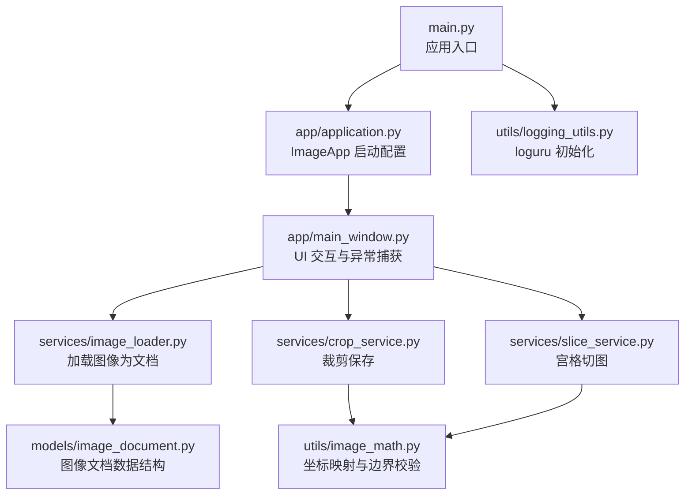
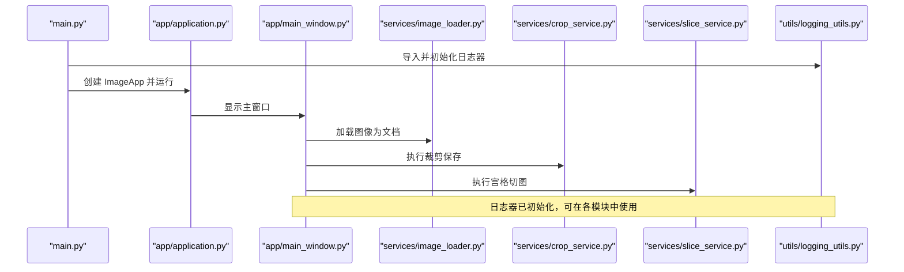
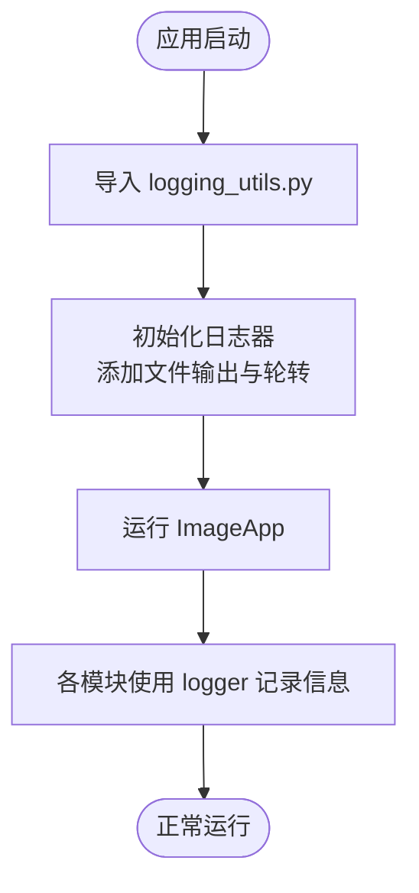
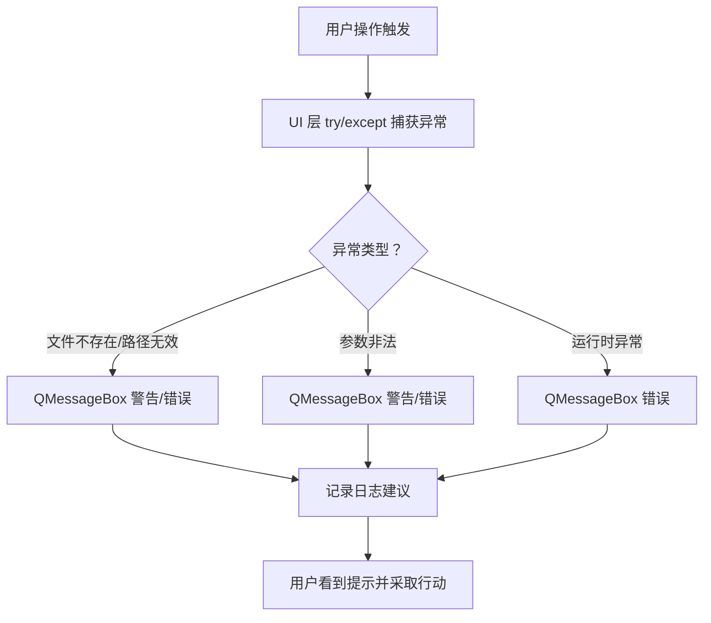
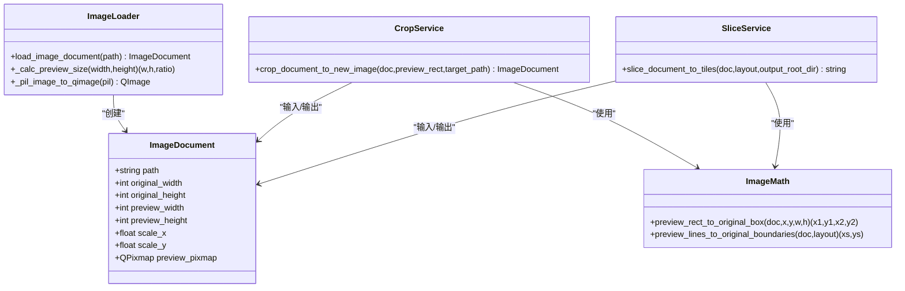
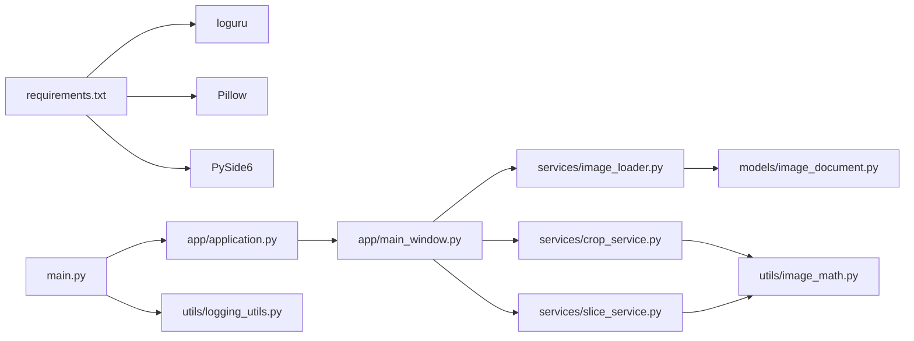

# 日志与错误处理

<cite>
**本文引用的文件**
- [main.py](file://img_slicer_tool/main.py)
- [application.py](file://img_slicer_tool/app/application.py)
- [main_window.py](file://img_slicer_tool/app/main_window.py)
- [logging_utils.py](file://img_slicer_tool/utils/logging_utils.py)
- [image_loader.py](file://img_slicer_tool/services/image_loader.py)
- [crop_service.py](file://img_slicer_tool/services/crop_service.py)
- [slice_service.py](file://img_slicer_tool/services/slice_service.py)
- [image_math.py](file://img_slicer_tool/utils/image_math.py)
- [image_document.py](file://img_slicer_tool/models/image_document.py)
- [requirements.txt](file://task/requirements.txt)
</cite>

## 目录
1. [简介](#简介)
2. [项目结构](#项目结构)
3. [核心组件](#核心组件)
4. [架构总览](#架构总览)
5. [详细组件分析](#详细组件分析)
6. [依赖关系分析](#依赖关系分析)
7. [性能与日志特性](#性能与日志特性)
8. [故障排查指南](#故障排查指南)
9. [结论](#结论)

## 简介
本文件聚焦于项目中的日志系统与错误处理机制，目标如下：
- 解释如何通过 loguru 实现全局日志记录，包括日志级别、输出格式与文件保存路径。
- 说明 logging_utils.py 中封装的日志初始化函数及其在应用中的调用时机。
- 列举常见错误场景（如图像加载失败、保存路径无效、内存不足等），并给出对应的异常捕获与用户提示机制。
- 提供日志文件位置指引与问题排查方法，帮助用户与开发者快速定位运行时问题。

## 项目结构
围绕日志与错误处理的关键文件组织如下：
- 入口与应用启动：main.py、app/application.py
- 日志初始化：utils/logging_utils.py
- 图像加载与文档模型：services/image_loader.py、models/image_document.py
- 裁剪与切图服务：services/crop_service.py、services/slice_service.py
- 数学工具与参数校验：utils/image_math.py
- 主窗口交互与用户提示：app/main_window.py

图表来源
- [main.py](file://img_slicer_tool/main.py#L1-L13)
- [application.py](file://img_slicer_tool/app/application.py#L1-L35)
- [main_window.py](file://img_slicer_tool/app/main_window.py#L67-L97)
- [image_loader.py](file://img_slicer_tool/services/image_loader.py#L1-L68)
- [crop_service.py](file://img_slicer_tool/services/crop_service.py#L1-L38)
- [slice_service.py](file://img_slicer_tool/services/slice_service.py#L1-L62)
- [image_math.py](file://img_slicer_tool/utils/image_math.py#L1-L76)
- [image_document.py](file://img_slicer_tool/models/image_document.py#L1-L18)
- [logging_utils.py](file://img_slicer_tool/utils/logging_utils.py#L1-L6)

章节来源
- [main.py](file://img_slicer_tool/main.py#L1-L13)
- [application.py](file://img_slicer_tool/app/application.py#L1-L35)

## 核心组件
- 日志系统（loguru）
  - 在 utils/logging_utils.py 中初始化日志器，将日志写入项目根目录下的 img_slicer.log 文件，并启用自动轮转与 UTF-8 编码。
  - 当前未显式设置日志级别；默认级别由 loguru 决定。若需调整，请在初始化处增加 level 参数。
- 错误处理与用户提示
  - 在 app/main_window.py 的多个交互流程中使用 try/except 捕获异常，并通过 QMessageBox 给出友好提示。
  - 服务层（image_loader.py、crop_service.py、slice_service.py、image_math.py）通过抛出 FileNotFoundError、ValueError 等异常表达错误状态。
  - 入口 main.py 与应用启动 application.py 未直接进行日志初始化，建议在入口处导入 logging_utils.py 以确保全局日志可用。

章节来源
- [logging_utils.py](file://img_slicer_tool/utils/logging_utils.py#L1-L6)
- [main_window.py](file://img_slicer_tool/app/main_window.py#L67-L97)
- [image_loader.py](file://img_slicer_tool/services/image_loader.py#L24-L26)
- [crop_service.py](file://img_slicer_tool/services/crop_service.py#L20-L21)
- [slice_service.py](file://img_slicer_tool/services/slice_service.py#L19-L23)
- [image_math.py](file://img_slicer_tool/utils/image_math.py#L26-L26)

## 架构总览
下图展示从入口到服务层的调用链路，以及日志初始化的位置与时机。

图表来源
- [main.py](file://img_slicer_tool/main.py#L1-L13)
- [application.py](file://img_slicer_tool/app/application.py#L1-L35)
- [main_window.py](file://img_slicer_tool/app/main_window.py#L67-L97)
- [image_loader.py](file://img_slicer_tool/services/image_loader.py#L24-L54)
- [crop_service.py](file://img_slicer_tool/services/crop_service.py#L13-L38)
- [slice_service.py](file://img_slicer_tool/services/slice_service.py#L12-L62)
- [logging_utils.py](file://img_slicer_tool/utils/logging_utils.py#L1-L6)

## 详细组件分析

### 日志系统与初始化
- 初始化位置与内容
  - 在 utils/logging_utils.py 中，通过 loguru.logger.add 将日志写入项目根目录的 img_slicer.log 文件，采用“5 MB 自动轮转”和“UTF-8 编码”，并开启异步队列 enqueue=True。
- 日志级别与输出格式
  - 当前未显式设置 level，因此遵循 loguru 默认级别；如需自定义级别，可在 logger.add 中添加 level 参数。
  - 输出格式默认由 loguru 控制台与文件格式决定；如需定制格式，可在 logger.add 中传入 format 参数。
- 调用时机
  - main.py 是应用入口，建议在此处导入 logging_utils.py，以确保在应用生命周期内所有模块均可使用日志器。
  - application.py 仅负责应用图标与样式表加载，不包含日志初始化逻辑。

图表来源
- [logging_utils.py](file://img_slicer_tool/utils/logging_utils.py#L1-L6)
- [main.py](file://img_slicer_tool/main.py#L1-L13)

章节来源
- [logging_utils.py](file://img_slicer_tool/utils/logging_utils.py#L1-L6)
- [main.py](file://img_slicer_tool/main.py#L1-L13)
- [application.py](file://img_slicer_tool/app/application.py#L1-L35)

### 错误处理与用户提示
- 图像加载失败
  - UI 层：在 main_window.py 的 load_image 流程中，先检查文件是否存在，再尝试加载为 ImageDocument。若加载异常，捕获异常并通过 QMessageBox 给出“加载失败”的提示。
  - 服务层：image_loader.py 对不存在的路径抛出 FileNotFoundError，便于上层统一处理。
- 保存路径无效
  - 裁剪保存：crop_service.py 在执行裁剪前检查源路径有效性，无效则抛出 FileNotFoundError。
  - 宫格切图：slice_service.py 在执行切图前检查输出根路径是否为空，空则抛出 ValueError。
- 裁剪参数非法
  - image_math.py 将预览坐标映射到原图坐标时，对宽高非正数、裁剪区域过小或无效等情况抛出 ValueError。
- 内存不足等运行时异常
  - 服务层（Pillow、PIL）可能在读取或写入大图时抛出异常。建议在调用处使用 try/except 捕获并提示用户，同时记录日志以便排查。

图表来源
- [main_window.py](file://img_slicer_tool/app/main_window.py#L67-L97)
- [image_loader.py](file://img_slicer_tool/services/image_loader.py#L24-L26)
- [crop_service.py](file://img_slicer_tool/services/crop_service.py#L20-L21)
- [slice_service.py](file://img_slicer_tool/services/slice_service.py#L19-L23)
- [image_math.py](file://img_slicer_tool/utils/image_math.py#L26-L26)

章节来源
- [main_window.py](file://img_slicer_tool/app/main_window.py#L67-L97)
- [image_loader.py](file://img_slicer_tool/services/image_loader.py#L24-L26)
- [crop_service.py](file://img_slicer_tool/services/crop_service.py#L20-L21)
- [slice_service.py](file://img_slicer_tool/services/slice_service.py#L19-L23)
- [image_math.py](file://img_slicer_tool/utils/image_math.py#L26-L26)

### 数据模型与服务层
- ImageDocument
  - 用于承载图像的原始尺寸、预览尺寸、缩放比例与预览图象素图等信息，便于 UI 与服务层共享。
- 服务层职责
  - image_loader.py：将磁盘图像加载为 ImageDocument，含预览尺寸计算与 QImage/Pixmap 转换。
  - crop_service.py：根据预览矩形计算原图裁剪框并保存新图，返回新的 ImageDocument。
  - slice_service.py：根据布局生成宫格并保存切片，返回输出目录。
  - image_math.py：提供预览坐标与原图坐标的双向映射与边界校验。

图表来源
- [image_document.py](file://img_slicer_tool/models/image_document.py#L1-L18)
- [image_loader.py](file://img_slicer_tool/services/image_loader.py#L24-L54)
- [crop_service.py](file://img_slicer_tool/services/crop_service.py#L13-L38)
- [slice_service.py](file://img_slicer_tool/services/slice_service.py#L12-L62)
- [image_math.py](file://img_slicer_tool/utils/image_math.py#L17-L76)

章节来源
- [image_document.py](file://img_slicer_tool/models/image_document.py#L1-L18)
- [image_loader.py](file://img_slicer_tool/services/image_loader.py#L24-L54)
- [crop_service.py](file://img_slicer_tool/services/crop_service.py#L13-L38)
- [slice_service.py](file://img_slicer_tool/services/slice_service.py#L12-L62)
- [image_math.py](file://img_slicer_tool/utils/image_math.py#L17-L76)

## 依赖关系分析
- 外部依赖
  - loguru：用于全局日志记录。
  - Pillow：用于图像读取、裁剪与保存。
  - PySide6：用于 GUI 与消息框提示。
- 内部依赖
  - main.py 依赖 application.py。
  - application.py 依赖 main_window.py。
  - main_window.py 依赖 services 与 models。
  - services 依赖 utils 工具与 models。
  - logging_utils.py 为独立日志初始化模块，建议在入口处导入。

图表来源
- [requirements.txt](file://task/requirements.txt#L76-L97)
- [main.py](file://img_slicer_tool/main.py#L1-L13)
- [application.py](file://img_slicer_tool/app/application.py#L1-L35)
- [main_window.py](file://img_slicer_tool/app/main_window.py#L67-L97)
- [image_loader.py](file://img_slicer_tool/services/image_loader.py#L1-L68)
- [crop_service.py](file://img_slicer_tool/services/crop_service.py#L1-L38)
- [slice_service.py](file://img_slicer_tool/services/slice_service.py#L1-L62)
- [image_document.py](file://img_slicer_tool/models/image_document.py#L1-L18)
- [image_math.py](file://img_slicer_tool/utils/image_math.py#L1-L76)
- [logging_utils.py](file://img_slicer_tool/utils/logging_utils.py#L1-L6)

章节来源
- [requirements.txt](file://task/requirements.txt#L76-L97)
- [main.py](file://img_slicer_tool/main.py#L1-L13)
- [application.py](file://img_slicer_tool/app/application.py#L1-L35)
- [main_window.py](file://img_slicer_tool/app/main_window.py#L67-L97)
- [image_loader.py](file://img_slicer_tool/services/image_loader.py#L1-L68)
- [crop_service.py](file://img_slicer_tool/services/crop_service.py#L1-L38)
- [slice_service.py](file://img_slicer_tool/services/slice_service.py#L1-L62)
- [image_document.py](file://img_slicer_tool/models/image_document.py#L1-L18)
- [image_math.py](file://img_slicer_tool/utils/image_math.py#L1-L76)
- [logging_utils.py](file://img_slicer_tool/utils/logging_utils.py#L1-L6)

## 性能与日志特性
- 日志轮转与编码
  - 使用“5 MB 自动轮转”与 UTF-8 编码，有助于控制日志文件大小并保证中文字符正确显示。
- 异步队列
  - enqueue=True 提升日志写入吞吐量，避免阻塞主线程。
- 建议
  - 如需更细粒度的日志级别控制，可在 logger.add 中设置 level。
  - 对高频操作（如切图）可考虑减少日志频率或使用结构化字段，避免日志膨胀。

章节来源
- [logging_utils.py](file://img_slicer_tool/utils/logging_utils.py#L1-L6)

## 故障排查指南
- 日志文件位置
  - 日志文件位于项目根目录，文件名为 img_slicer.log。
- 常见错误与排查步骤
  - 图像加载失败
    - 现象：打开图片后弹出“加载失败”提示。
    - 排查：确认文件路径存在；查看 img_slicer.log 是否有异常堆栈；检查 Pillow 支持的格式列表。
  - 保存路径无效
    - 现象：裁剪或切图时报错或无输出。
    - 排查：确认目标路径存在且可写；查看 slice_service 的输出目录构建逻辑；检查权限问题。
  - 裁剪参数非法
    - 现象：拖拽裁剪框后无响应或报错。
    - 排查：检查预览矩形宽高是否为正数；确认裁剪区域有效；查看 image_math 的参数校验。
  - 内存不足
    - 现象：处理大图时崩溃或卡顿。
    - 排查：降低预览最大尺寸或关闭高分辨率预览；查看系统内存占用；必要时分块处理或优化算法。
- 用户提示与日志结合
  - 建议在 UI 层捕获异常后，同时记录日志（例如记录异常类型、参数、时间戳），以便后续定位问题。

章节来源
- [logging_utils.py](file://img_slicer_tool/utils/logging_utils.py#L1-L6)
- [main_window.py](file://img_slicer_tool/app/main_window.py#L67-L97)
- [image_loader.py](file://img_slicer_tool/services/image_loader.py#L24-L26)
- [crop_service.py](file://img_slicer_tool/services/crop_service.py#L20-L21)
- [slice_service.py](file://img_slicer_tool/services/slice_service.py#L19-L23)
- [image_math.py](file://img_slicer_tool/utils/image_math.py#L26-L26)

## 结论
- 日志系统
  - 通过 loguru 在项目根目录输出 img_slicer.log，并启用轮转与异步写入，满足日常排障需求。
  - 建议在入口 main.py 导入 logging_utils.py，确保全局可用。
- 错误处理
  - UI 层通过 try/except 与 QMessageBox 提供用户友好的提示。
  - 服务层通过明确的异常类型（FileNotFoundError、ValueError）表达错误状态，便于统一处理。
- 建议
  - 在关键路径补充日志记录，结合用户提示，提升可观测性与可维护性。
  - 如需更精细的日志级别与格式，可在初始化处扩展 logger.add 参数。