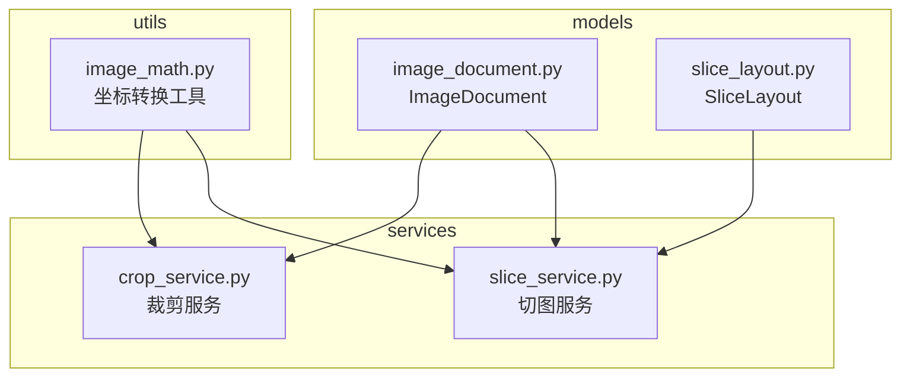
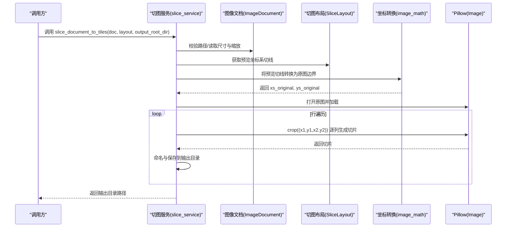
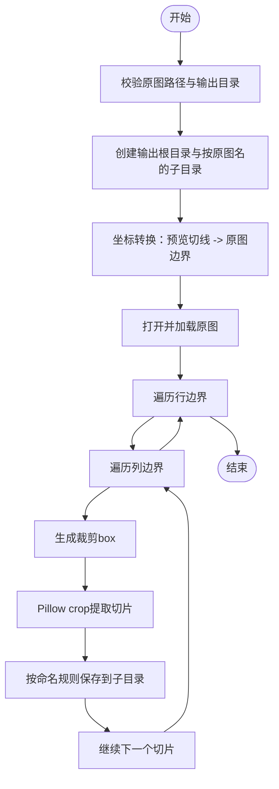
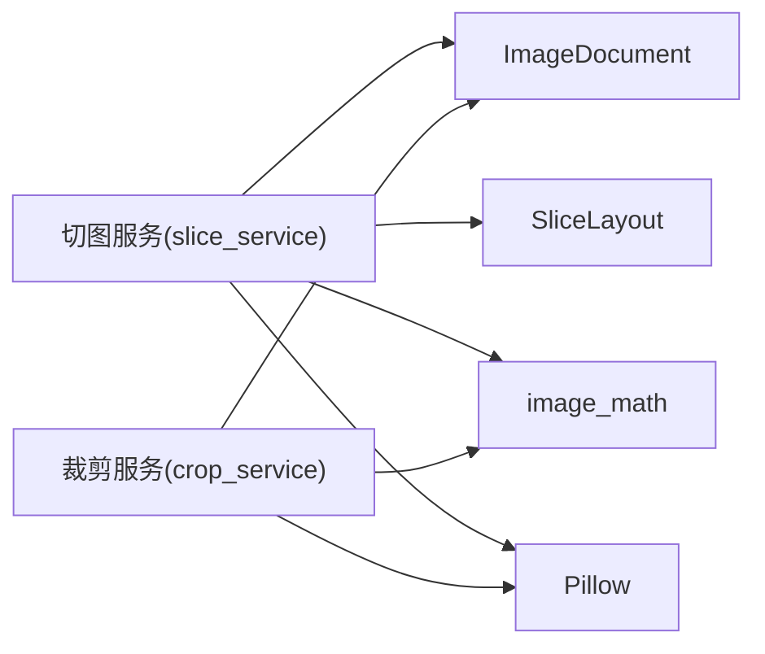

# 切图服务

<cite>
**本文引用的文件**
- [slice_service.py](file://img_slicer_tool/services/slice_service.py)
- [slice_layout.py](file://img_slicer_tool/models/slice_layout.py)
- [image_math.py](file://img_slicer_tool/utils/image_math.py)
- [image_document.py](file://img_slicer_tool/models/image_document.py)
- [crop_service.py](file://img_slicer_tool/services/crop_service.py)
</cite>

## 目录
1. [引言](#引言)
2. [项目结构](#项目结构)
3. [核心组件](#核心组件)
4. [架构总览](#架构总览)
5. [详细组件分析](#详细组件分析)
6. [依赖关系分析](#依赖关系分析)
7. [性能考虑](#性能考虑)
8. [故障排查指南](#故障排查指南)
9. [结论](#结论)

## 引言
本文件围绕 img_slicer_tool 中的切图服务，系统性剖析 slice_service.py 的 slice_document_to_tiles 函数，重点说明其如何基于 SliceLayout 提供的预览坐标系切线，经由 image_math 模块的坐标转换函数映射到原图像素边界；随后通过二维循环遍历生成每个切片的裁剪 box，并使用 Pillow 的 crop 方法高效提取图像块；同时解释命名规则与输出目录结构的设计考量、不同图像格式下的保存参数适配策略，以及在无切线情况下仍可导出完整图像的健壮性设计，并给出性能调优建议（内存管理与并发写入优化）。

## 项目结构
该项目采用“功能分层 + 数据模型”的组织方式：
- models 层：定义数据模型（如 ImageDocument、SliceLayout），承载图像与切图布局的元数据。
- utils 层：提供图像数学工具（如坐标转换）。
- services 层：封装业务服务（如切图服务、裁剪服务、图像加载器等）。
- views 与 app：界面与应用入口（与本文主题关联较小）。

图表来源
- [image_document.py](file://img_slicer_tool/models/image_document.py#L1-L18)
- [slice_layout.py](file://img_slicer_tool/models/slice_layout.py#L1-L30)
- [image_math.py](file://img_slicer_tool/utils/image_math.py#L1-L76)
- [slice_service.py](file://img_slicer_tool/services/slice_service.py#L1-L62)
- [crop_service.py](file://img_slicer_tool/services/crop_service.py#L1-L38)

章节来源
- [slice_service.py](file://img_slicer_tool/services/slice_service.py#L1-L62)
- [slice_layout.py](file://img_slicer_tool/models/slice_layout.py#L1-L30)
- [image_math.py](file://img_slicer_tool/utils/image_math.py#L1-L76)
- [image_document.py](file://img_slicer_tool/models/image_document.py#L1-L18)
- [crop_service.py](file://img_slicer_tool/services/crop_service.py#L1-L38)

## 核心组件
- 切图服务（slice_service.py）：负责执行批量切图，生成切片并保存。
- 切图布局（slice_layout.py）：维护预览坐标系下的水平/垂直切线，提供标准化与边界生成能力。
- 图像数学工具（image_math.py）：提供预览坐标到原图坐标的转换，确保切线映射到实际像素边界。
- 图像文档（image_document.py）：承载原图尺寸、预览尺寸及缩放因子等关键信息。
- 裁剪服务（crop_service.py）：面向单个矩形裁剪的通用实现，与批量切图共享坐标转换逻辑。

章节来源
- [slice_service.py](file://img_slicer_tool/services/slice_service.py#L1-L62)
- [slice_layout.py](file://img_slicer_tool/models/slice_layout.py#L1-L30)
- [image_math.py](file://img_slicer_tool/utils/image_math.py#L1-L76)
- [image_document.py](file://img_slicer_tool/models/image_document.py#L1-L18)
- [crop_service.py](file://img_slicer_tool/services/crop_service.py#L1-L38)

## 架构总览
下图展示了从输入到输出的关键流程：输入 ImageDocument 与 SliceLayout，经由坐标转换得到原图边界，再通过二维遍历生成切片并保存。

图表来源
- [slice_service.py](file://img_slicer_tool/services/slice_service.py#L12-L62)
- [slice_layout.py](file://img_slicer_tool/models/slice_layout.py#L19-L30)
- [image_math.py](file://img_slicer_tool/utils/image_math.py#L50-L76)
- [image_document.py](file://img_slicer_tool/models/image_document.py#L8-L18)

## 详细组件分析

### 切图服务：slice_document_to_tiles
- 输入输出与前置校验
  - 校验原图路径存在性与输出根目录非空。
  - 创建输出根目录与以原图名为名的子目录，保证按原图组织输出。
- 坐标转换
  - 使用 preview_lines_to_original_boundaries 将 SliceLayout 的预览切线映射到原图像素边界，得到 xs_original 与 ys_original。
- 二维遍历与裁剪
  - 外层循环遍历行（y 方向），内层循环遍历列（x 方向），以相邻边界生成 box 并调用 crop 提取切片。
  - 对无效 box（如宽度或高度非正）进行跳过，提升健壮性。
- 命名规则与输出目录
  - 文件名包含原图名与行列索引（从 1 开始编号，两位零填充），便于排序与定位。
  - 输出目录按原图名建立子目录，避免多图输出时的文件名冲突。
- 保存参数适配
  - 针对 JPEG/JPG 格式设置高质量参数，兼顾体积与质量。
- 健壮性设计
  - 当切线数量不足时，坐标转换会抛出异常，防止生成无效宫格。
  - 若未提供切线，坐标转换会检测边界数量不足并报错，从而避免错误地导出不完整或不可用的切片。

图表来源
- [slice_service.py](file://img_slicer_tool/services/slice_service.py#L12-L62)
- [image_math.py](file://img_slicer_tool/utils/image_math.py#L50-L76)

章节来源
- [slice_service.py](file://img_slicer_tool/services/slice_service.py#L12-L62)

### 切图布局：SliceLayout
- 维护水平与垂直切线列表，支持去重、过滤与标准化。
- 提供 get_boundaries，返回含边界的坐标序列（包含起点与终点），用于生成宫格网格。

章节来源
- [slice_layout.py](file://img_slicer_tool/models/slice_layout.py#L7-L30)

### 坐标转换：preview_lines_to_original_boundaries
- 将预览坐标系的边界点按缩放因子映射到原图像素坐标，并进行裁剪与去重排序。
- 若最终边界数量不足，抛出异常，防止生成无效宫格。

章节来源
- [image_math.py](file://img_slicer_tool/utils/image_math.py#L50-L76)
- [image_document.py](file://img_slicer_tool/models/image_document.py#L8-L18)

### 图像文档：ImageDocument
- 记录原图尺寸、预览尺寸与缩放因子，是坐标转换与渲染的基础数据。

章节来源
- [image_document.py](file://img_slicer_tool/models/image_document.py#L8-L18)

### 单矩形裁剪服务：crop_document_to_new_image
- 作为单次裁剪的通用实现，复用预览坐标到原图坐标的转换逻辑，展示与批量切图一致的参数适配策略。

章节来源
- [crop_service.py](file://img_slicer_tool/services/crop_service.py#L13-L38)
- [image_math.py](file://img_slicer_tool/utils/image_math.py#L17-L48)

## 依赖关系分析
- 切图服务依赖：
  - ImageDocument：提供缩放因子与尺寸信息。
  - SliceLayout：提供预览坐标系切线与边界生成。
  - image_math：提供坐标转换工具。
  - Pillow：提供图像打开与裁剪能力。
- 裁剪服务与切图服务共享坐标转换逻辑，体现代码复用与一致性。

图表来源
- [slice_service.py](file://img_slicer_tool/services/slice_service.py#L12-L62)
- [crop_service.py](file://img_slicer_tool/services/crop_service.py#L13-L38)
- [image_document.py](file://img_slicer_tool/models/image_document.py#L8-L18)
- [slice_layout.py](file://img_slicer_tool/models/slice_layout.py#L19-L30)
- [image_math.py](file://img_slicer_tool/utils/image_math.py#L50-L76)

章节来源
- [slice_service.py](file://img_slicer_tool/services/slice_service.py#L12-L62)
- [crop_service.py](file://img_slicer_tool/services/crop_service.py#L13-L38)
- [image_document.py](file://img_slicer_tool/models/image_document.py#L8-L18)
- [slice_layout.py](file://img_slicer_tool/models/slice_layout.py#L19-L30)
- [image_math.py](file://img_slicer_tool/utils/image_math.py#L50-L76)

## 性能考虑
- 内存管理
  - 在打开图像后立即调用加载，有助于将图像数据解码并驻留内存，减少后续多次 IO。
  - 建议在大规模批量导出时控制并发写入，避免磁盘写入抖动与内存峰值过高。
- 并发写入优化
  - 可采用生产者-消费者模式，将切片生成与保存分离：先在 CPU 密集阶段生成切片，再在 I/O 密集阶段批量写入磁盘。
  - 对于高分辨率图像，可考虑分批保存（例如每 N 张切片后 flush 或分批提交），降低内存占用。
- I/O 与格式选择
  - JPEG/JPG 保存时设置高质量参数，兼顾体积与质量；PNG 等无损格式可保持透明度与细节。
  - 输出目录按原图名分组，有利于后续并行处理与归档。
- 健壮性与容错
  - 对无效 box 进行跳过，避免无效输出。
  - 切线不足时提前抛错，防止生成不可用的切片。

[本节为通用性能建议，不直接分析具体文件，故不附“章节来源”]

## 故障排查指南
- 常见问题与定位
  - 原图路径不存在：检查输入路径是否正确。
  - 输出目录为空：确认传入的输出根目录非空。
  - 切图边界不足：当切线数量不足以形成有效网格时，坐标转换会抛出异常，需检查 SliceLayout 的切线配置。
  - 生成空切片：若相邻边界相等或无效，会被跳过；请检查预览坐标与缩放因子。
- 排查步骤
  - 先验证 ImageDocument 的缩放因子与尺寸是否合理。
  - 检查 SliceLayout 的水平/垂直切线是否在预览范围内且去重后数量足够。
  - 确认输出目录权限与磁盘空间充足。
  - 如需导出完整图像，请确保至少有一条水平与一条垂直切线，否则坐标转换会拒绝生成。

章节来源
- [slice_service.py](file://img_slicer_tool/services/slice_service.py#L19-L24)
- [image_math.py](file://img_slicer_tool/utils/image_math.py#L72-L76)

## 结论
slice_document_to_tiles 通过清晰的数据流与稳健的坐标转换，实现了从预览坐标到原图像素的可靠映射，并以二维遍历的方式高效生成宫格切片。命名规则与输出目录结构提升了可读性与可维护性；针对不同图像格式的保存参数适配体现了实用性；在无切线场景下仍能导出完整图像的健壮性设计，确保了服务的可用性。结合本文的性能建议，可在大规模批量导出时进一步提升吞吐与稳定性。