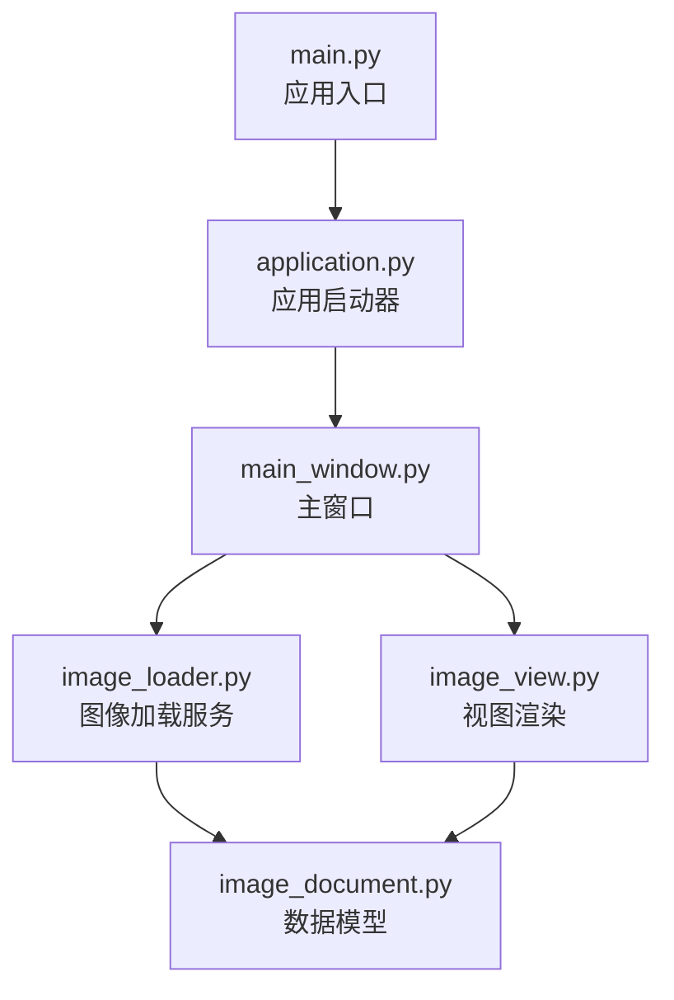
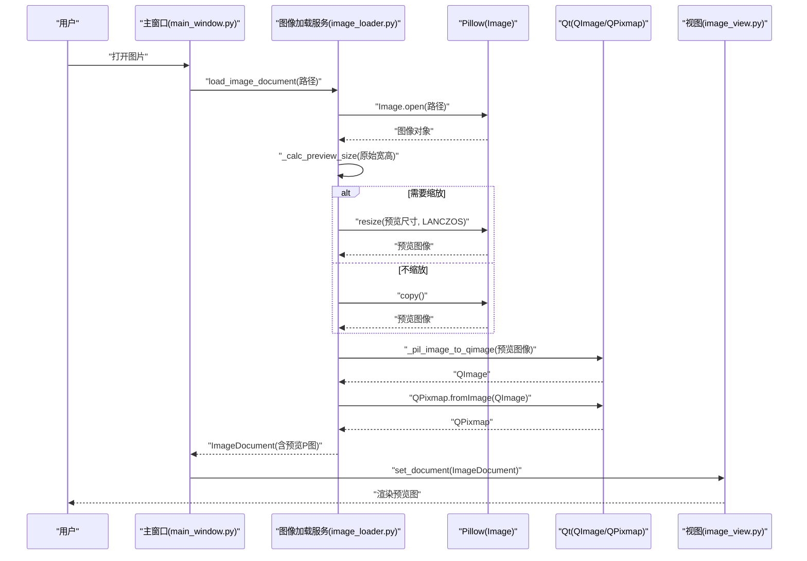
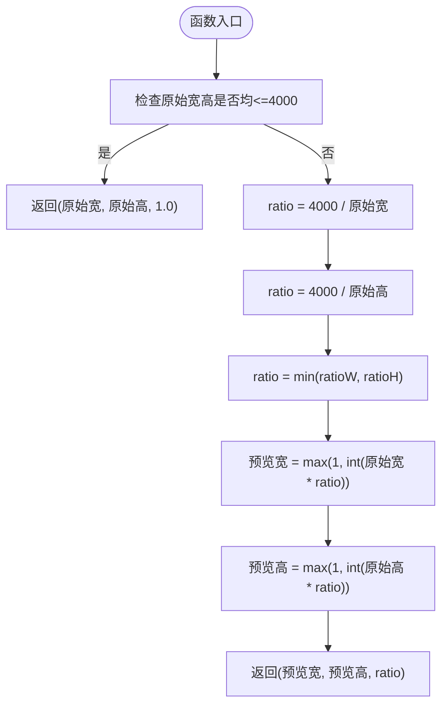
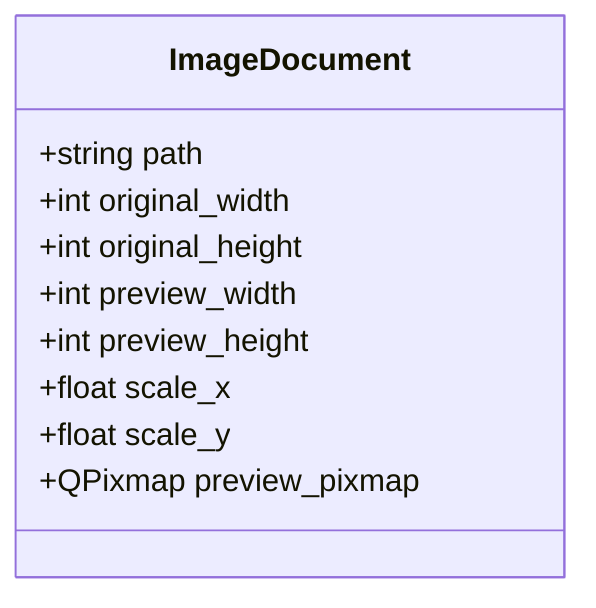
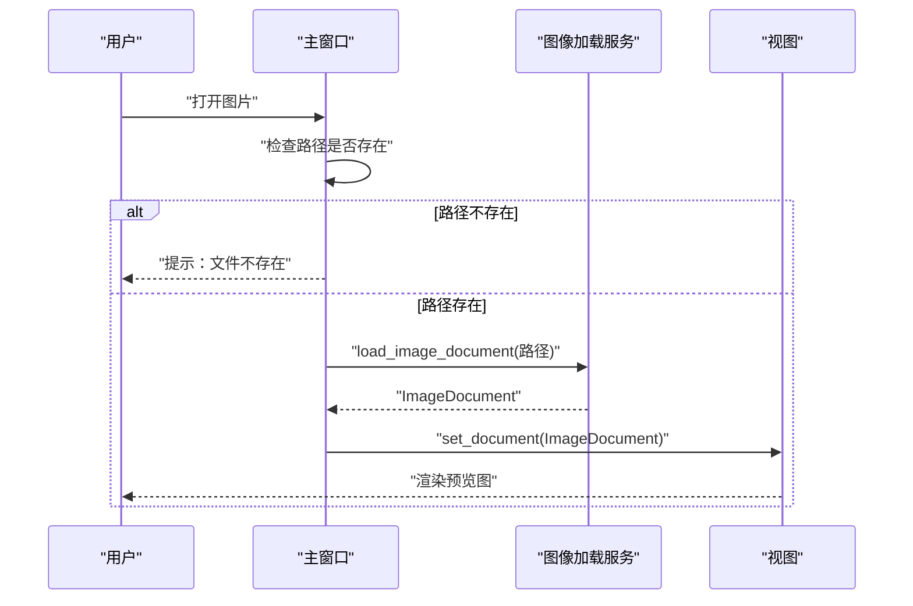
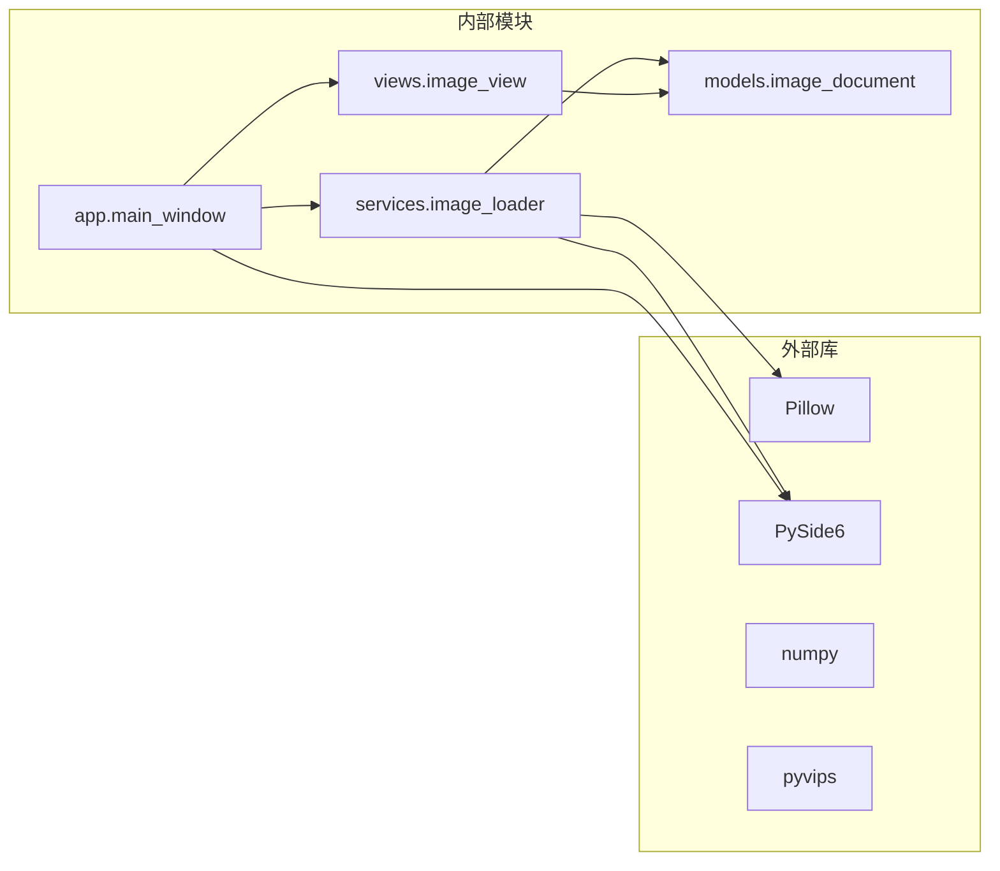

# 图像加载服务

<cite>
**本文引用的文件列表**
- [image_loader.py](file://img_slicer_tool/services/image_loader.py)
- [image_document.py](file://img_slicer_tool/models/image_document.py)
- [main_window.py](file://img_slicer_tool/app/main_window.py)
- [image_view.py](file://img_slicer_tool/views/image_view.py)
- [application.py](file://img_slicer_tool/app/application.py)
- [main.py](file://img_slicer_tool/main.py)
- [requirements.txt](file://img_slicer_tool/requirements.txt)
- [logging_utils.py](file://img_slicer_tool/utils/logging_utils.py)
</cite>

## 目录
1. [简介](#简介)
2. [项目结构](#项目结构)
3. [核心组件](#核心组件)
4. [架构总览](#架构总览)
5. [详细组件分析](#详细组件分析)
6. [依赖关系分析](#依赖关系分析)
7. [性能考量](#性能考量)
8. [故障排查指南](#故障排查指南)
9. [结论](#结论)
10. [附录](#附录)

## 简介
本文件聚焦于图像加载服务，深入解析服务端点 load_image_document 的实现机制，阐明其如何通过 Pillow 加载原始图像并生成最大边不超过 4000 像素的预览图，以保障 UI 性能；同时详解 _calc_preview_size 的缩放比例计算逻辑，以及 _pil_image_to_qimage 如何将 Pillow 图像转换为 Qt 可用的 QImage 格式。文档还解释 ImageDocument 对象的构建过程，包括原始尺寸、预览尺寸与缩放比（scale_x/scale_y）的计算方法，并结合代码示例说明该服务在主流程中的调用时机与异常处理策略（如文件不存在时的 FileNotFoundError）。最后给出性能优化建议，例如未来可引入 pyvips 替代 Pillow 处理超大图像。

## 项目结构
该项目采用功能模块化组织，图像加载服务位于 services 子目录，模型定义位于 models，界面交互位于 views，应用入口位于 app，顶层入口脚本位于根目录。核心调用链如下：
- 应用入口 main.py 调用应用启动器 application.py
- 主窗口 main_window.py 提供菜单与对话框，触发图像加载
- 图像加载服务 image_loader.py 执行实际加载与预览图生成
- 视图层 image_view.py 接收 ImageDocument 并渲染到 QGraphicsView

图表来源
- [main.py](file://img_slicer_tool/main.py#L1-L13)
- [application.py](file://img_slicer_tool/app/application.py#L1-L35)
- [main_window.py](file://img_slicer_tool/app/main_window.py#L1-L262)
- [image_loader.py](file://img_slicer_tool/services/image_loader.py#L1-L68)
- [image_document.py](file://img_slicer_tool/models/image_document.py#L1-L18)
- [image_view.py](file://img_slicer_tool/views/image_view.py#L1-L218)

章节来源
- [main.py](file://img_slicer_tool/main.py#L1-L13)
- [application.py](file://img_slicer_tool/app/application.py#L1-L35)
- [main_window.py](file://img_slicer_tool/app/main_window.py#L1-L262)
- [image_loader.py](file://img_slicer_tool/services/image_loader.py#L1-L68)
- [image_document.py](file://img_slicer_tool/models/image_document.py#L1-L18)
- [image_view.py](file://img_slicer_tool/views/image_view.py#L1-L218)

## 核心组件
- 图像加载服务（image_loader.py）
  - 导出常量 MAX_PREVIEW_SIZE（最大预览边长）
  - 导出函数 load_image_document(path): ImageDocument
  - 辅助函数 _calc_preview_size(width, height) -> (w, h, ratio)
  - 辅助函数 _pil_image_to_qimage(pil_image) -> QImage
- 数据模型（image_document.py）
  - 使用 dataclass 定义 ImageDocument 字段：路径、原始宽高、预览宽高、缩放比、预览 QPixmap
- 视图层（image_view.py）
  - 接收 ImageDocument.preview_pixmap 并在 QGraphicsView 中展示
- 应用层（main_window.py）
  - 通过 QFileDialog 选择文件，调用 load_image_document 并处理异常
  - 将返回的 ImageDocument 设置到视图层

章节来源
- [image_loader.py](file://img_slicer_tool/services/image_loader.py#L1-L68)
- [image_document.py](file://img_slicer_tool/models/image_document.py#L1-L18)
- [image_view.py](file://img_slicer_tool/views/image_view.py#L1-L218)
- [main_window.py](file://img_slicer_tool/app/main_window.py#L1-L262)

## 架构总览
下图展示了从用户选择文件到 UI 渲染的关键调用序列：

图表来源
- [main_window.py](file://img_slicer_tool/app/main_window.py#L76-L109)
- [image_loader.py](file://img_slicer_tool/services/image_loader.py#L24-L55)
- [image_view.py](file://img_slicer_tool/views/image_view.py#L43-L58)

## 详细组件分析

### load_image_document 函数实现机制
- 输入校验与异常处理
  - 若路径不存在，抛出 FileNotFoundError，由上层捕获并提示“文件不存在”
- 原始图像加载
  - 使用 Pillow 的 Image.open 打开文件，调用 load() 预加载像素数据
  - 获取原始宽高 original_width/original_height
- 预览尺寸计算
  - 调用 _calc_preview_size 计算预览尺寸与缩放比 ratio
  - 当原始尺寸均不超过 4000 时，ratio=1.0，不缩放；否则按较小方向缩放到 4000
- 预览图像生成
  - 若 ratio!=1.0，使用 LANCZOS 插值进行缩放；否则直接 copy 原图
  - 将 Pillow 图像转换为 QImage，再转为 QPixmap
- ImageDocument 构建
  - 计算 scale_x = original_width / preview_width
  - 计算 scale_y = original_height / preview_height
  - 返回包含路径、原始尺寸、预览尺寸、缩放比与预览 QPixmap 的数据对象

章节来源
- [image_loader.py](file://img_slicer_tool/services/image_loader.py#L24-L55)

### _calc_preview_size 缩放比例计算逻辑
- 输入：原始宽度与高度
- 输出：预览宽度、预览高度与缩放比
- 计算规则
  - 若两者均不大于 4000，则直接返回原尺寸与 ratio=1.0
  - 否则分别计算与 4000 的比值，取较小者作为缩放比 ratio
  - 预览尺寸 = max(1, int(原始尺寸 × ratio))，确保至少为 1
- 复杂度
  - 时间复杂度 O(1)，空间复杂度 O(1)

图表来源
- [image_loader.py](file://img_slicer_tool/services/image_loader.py#L14-L21)

章节来源
- [image_loader.py](file://img_slicer_tool/services/image_loader.py#L14-L21)

### _pil_image_to_qimage 转换逻辑
- 模式判断与转换
  - 若 Pillow 图像为 RGB，直接以 RGB 格式构造 QImage
  - 若为 RGBA，直接以 RGBA 格式构造 QImage
  - 其他模式（如灰度、P 等），先 convert 到 RGBA 再构造 QImage
- 数据来源
  - 使用 tobytes("raw", ...) 获取连续字节数据，保证与 QImage 的像素布局一致
- 注意事项
  - QImage 的像素格式与 Pillow 的模式需匹配，避免颜色通道顺序或透明度丢失

章节来源
- [image_loader.py](file://img_slicer_tool/services/image_loader.py#L57-L68)

### ImageDocument 对象构建与字段含义
- 字段
  - path：图像文件路径
  - original_width/original_height：原始图像宽高
  - preview_width/preview_height：预览图像宽高
  - scale_x/scale_y：原始尺寸与预览尺寸的缩放比
  - preview_pixmap：用于 UI 渲染的 QPixmap
- 计算方法
  - scale_x = original_width / preview_width
  - scale_y = original_height / preview_height
- 用途
  - 用于 UI 层根据预览图进行缩放与坐标换算
  - 用于后续裁剪与切图时将预览坐标映射回原图坐标

图表来源
- [image_document.py](file://img_slicer_tool/models/image_document.py#L8-L18)

章节来源
- [image_document.py](file://img_slicer_tool/models/image_document.py#L8-L18)
- [image_loader.py](file://img_slicer_tool/services/image_loader.py#L42-L54)

### 主流程中的调用时机与异常处理
- 调用时机
  - 用户通过菜单“打开图片”触发 QFileDialog
  - 选择文件后，主窗口调用 load_image_document
  - 成功后将返回的 ImageDocument 传给视图层 set_document 进行渲染
- 异常处理
  - 文件不存在：服务抛出 FileNotFoundError，主窗口捕获并弹出警告
  - 其他加载异常：捕获通用异常并弹出错误提示
- UI 反馈
  - 成功后状态栏显示原始尺寸与预览尺寸

图表来源
- [main_window.py](file://img_slicer_tool/app/main_window.py#L76-L109)
- [image_loader.py](file://img_slicer_tool/services/image_loader.py#L24-L55)

章节来源
- [main_window.py](file://img_slicer_tool/app/main_window.py#L76-L109)
- [image_loader.py](file://img_slicer_tool/services/image_loader.py#L24-L55)

## 依赖关系分析
- 外部库依赖
  - Pillow：图像解码、缩放、模式转换
  - PySide6：Qt 图像与 UI 组件（QImage/QPixmap/QGraphicsView）
  - numpy：数值计算支持（间接）
  - pyvips：高性能图像处理库（可选，用于未来替代 Pillow 处理超大图）
- 内部模块依赖
  - services.image_loader 依赖 models.image_document
  - app.main_window 依赖 services.image_loader 与 views.image_view
  - views.image_view 依赖 models.image_document

图表来源
- [requirements.txt](file://img_slicer_tool/requirements.txt#L1-L14)
- [image_loader.py](file://img_slicer_tool/services/image_loader.py#L1-L68)
- [image_document.py](file://img_slicer_tool/models/image_document.py#L1-L18)
- [main_window.py](file://img_slicer_tool/app/main_window.py#L1-L262)
- [image_view.py](file://img_slicer_tool/views/image_view.py#L1-L218)

章节来源
- [requirements.txt](file://img_slicer_tool/requirements.txt#L1-L14)
- [image_loader.py](file://img_slicer_tool/services/image_loader.py#L1-L68)
- [image_document.py](file://img_slicer_tool/models/image_document.py#L1-L18)
- [main_window.py](file://img_slicer_tool/app/main_window.py#L1-L262)
- [image_view.py](file://img_slicer_tool/views/image_view.py#L1-L218)

## 性能考量
- 预览尺寸限制
  - 通过 MAX_PREVIEW_SIZE=4000 控制预览图最大边，降低 UI 渲染与内存占用
- 缩放算法
  - 使用 LANCZOS 插值进行高质量缩放，兼顾清晰度与性能
- 模式转换
  - 在 _pil_image_to_qimage 中优先使用 RGB888 或 RGBA8888，避免额外转换
- 未来优化建议
  - 对于超大图像（例如数万像素级），可考虑引入 pyvips 替代 Pillow，利用其内存映射与高效内核加速图像处理
  - 结合多线程异步加载，避免阻塞 UI 线程
  - 预览图缓存策略：对同一文件的多次打开复用已生成的预览图

章节来源
- [image_loader.py](file://img_slicer_tool/services/image_loader.py#L11-L13)
- [image_loader.py](file://img_slicer_tool/services/image_loader.py#L34-L37)
- [image_loader.py](file://img_slicer_tool/services/image_loader.py#L57-L68)
- [requirements.txt](file://img_slicer_tool/requirements.txt#L1-L14)

## 故障排查指南
- 常见问题
  - 文件不存在：服务会抛出 FileNotFoundError，主窗口捕获并提示“文件不存在”
  - 其他加载异常：捕获通用异常并弹出错误提示，便于定位问题
- 日志建议
  - 已配置 loguru 日志输出至本地文件，可用于记录异常堆栈与运行轨迹
- 诊断步骤
  - 确认文件路径正确且可访问
  - 检查图像格式是否受 Pillow 支持
  - 查看日志文件获取更详细的错误信息

章节来源
- [main_window.py](file://img_slicer_tool/app/main_window.py#L88-L109)
- [logging_utils.py](file://img_slicer_tool/utils/logging_utils.py#L1-L6)

## 结论
本服务通过严格的预览尺寸控制与高效的 Pillow+Qt 转换链路，实现了对大图的快速预览与 UI 流畅渲染。_calc_preview_size 的最小边缩放策略确保了预览图不会超过 4000 像素的最大边；_pil_image_to_qimage 的模式适配保证了颜色与透明度的正确性；ImageDocument 的 scale_x/scale_y 字段为后续裁剪与切图提供了可靠的坐标换算基础。未来可在超大图场景引入 pyvips 以进一步提升性能与稳定性。

## 附录
- 关键实现参考路径
  - 预览尺寸计算：[image_loader.py](file://img_slicer_tool/services/image_loader.py#L14-L21)
  - 图像加载与预览生成：[image_loader.py](file://img_slicer_tool/services/image_loader.py#L24-L55)
  - Pillow 到 QImage 转换：[image_loader.py](file://img_slicer_tool/services/image_loader.py#L57-L68)
  - 数据模型定义：[image_document.py](file://img_slicer_tool/models/image_document.py#L8-L18)
  - 主窗口调用时机与异常处理：[main_window.py](file://img_slicer_tool/app/main_window.py#L76-L109)
  - 视图层接收与渲染：[image_view.py](file://img_slicer_tool/views/image_view.py#L43-L58)
  - 应用入口与启动流程：[main.py](file://img_slicer_tool/main.py#L1-L13)、[application.py](file://img_slicer_tool/app/application.py#L1-L35)
  - 依赖声明与可选库：[requirements.txt](file://img_slicer_tool/requirements.txt#L1-L14)
  - 日志配置：[logging_utils.py](file://img_slicer_tool/utils/logging_utils.py#L1-L6)