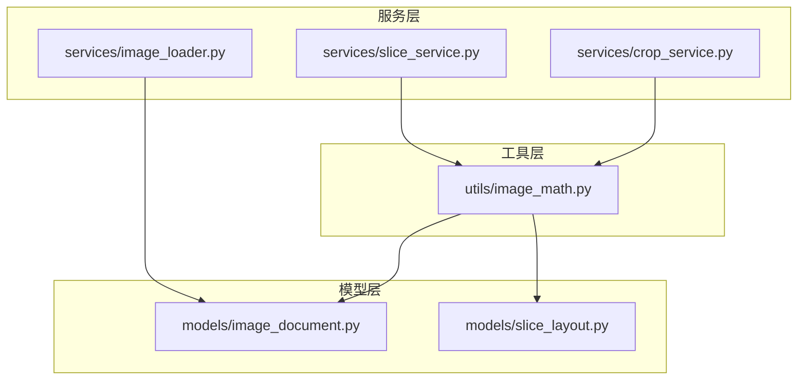
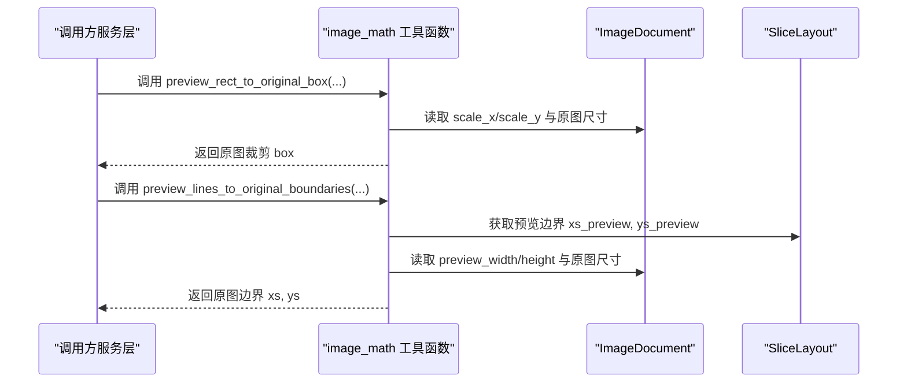
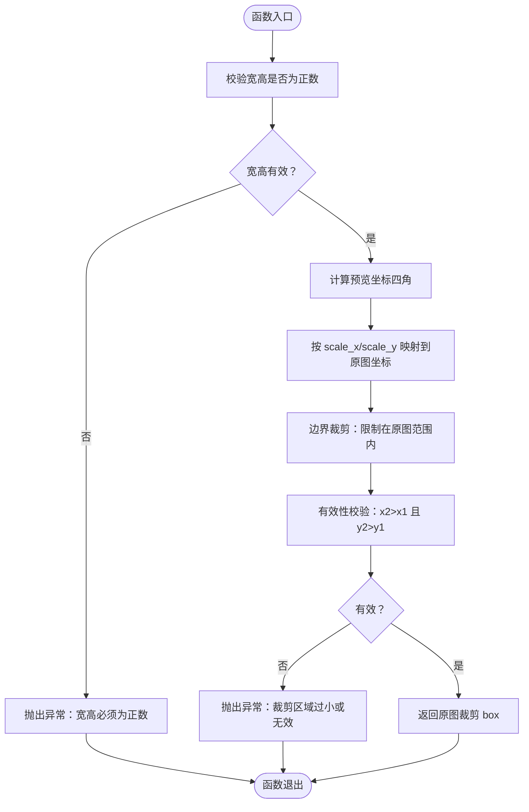
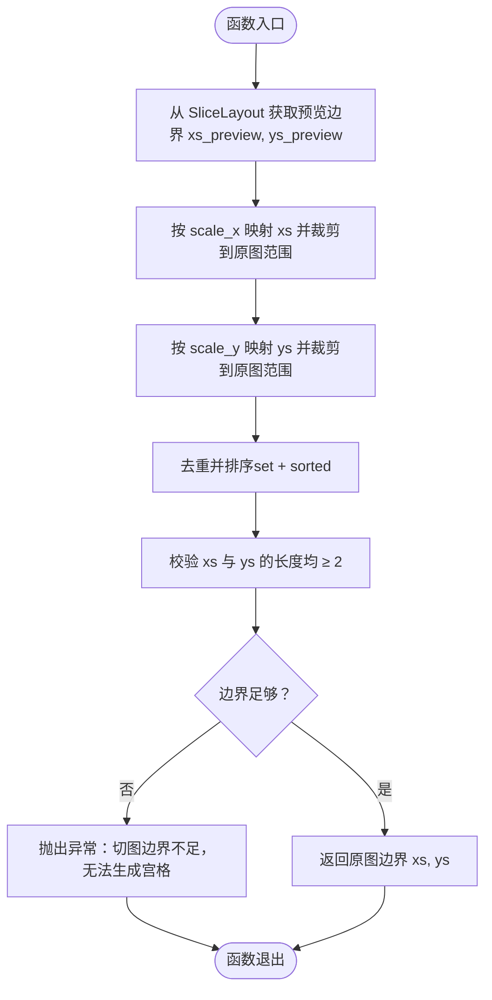
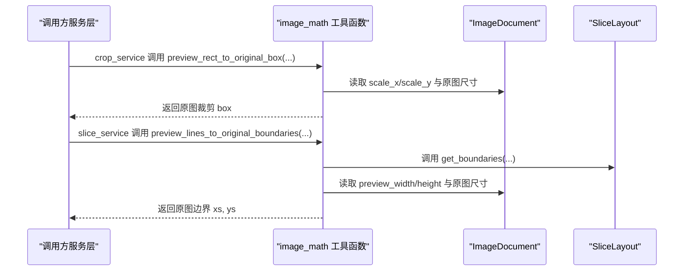
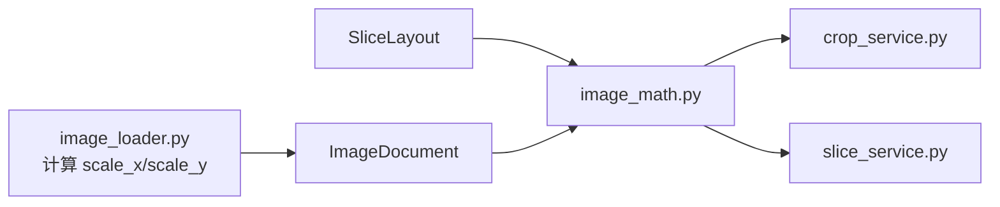

# 图像数学工具

<cite>
**本文引用的文件**
- [img_slicer_tool/utils/image_math.py](file://img_slicer_tool/utils/image_math.py)
- [img_slicer_tool/models/image_document.py](file://img_slicer_tool/models/image_document.py)
- [img_slicer_tool/models/slice_layout.py](file://img_slicer_tool/models/slice_layout.py)
- [img_slicer_tool/services/crop_service.py](file://img_slicer_tool/services/crop_service.py)
- [img_slicer_tool/services/slice_service.py](file://img_slicer_tool/services/slice_service.py)
- [img_slicer_tool/services/image_loader.py](file://img_slicer_tool/services/image_loader.py)
</cite>

## 目录
1. [简介](#简介)
2. [项目结构](#项目结构)
3. [核心组件](#核心组件)
4. [架构总览](#架构总览)
5. [详细组件分析](#详细组件分析)
6. [依赖关系分析](#依赖关系分析)
7. [性能考量](#性能考量)
8. [故障排查指南](#故障排查指南)
9. [结论](#结论)

## 简介
本文系统化文档化两个图像数学工具函数：preview_rect_to_original_box 与 preview_lines_to_original_boundaries。前者负责将预览坐标系中的矩形选择框映射到原图像素坐标，并进行边界裁剪与有效性校验；后者负责将 SliceLayout 的归一化切线位置转换为原图像素边界，包含去重与排序等工程实践。这两个函数作为服务层的基石，解耦了坐标转换逻辑，显著提升了 crop_service 与 slice_service 的可维护性与健壮性。

## 项目结构
围绕“图像数学工具”的相关文件组织如下：
- 工具函数模块：utils/image_math.py
- 数据模型：models/image_document.py、models/slice_layout.py
- 业务服务：services/crop_service.py、services/slice_service.py
- 模型构造：services/image_loader.py（负责计算缩放比例）

图表来源
- [img_slicer_tool/utils/image_math.py](file://img_slicer_tool/utils/image_math.py#L1-L76)
- [img_slicer_tool/models/image_document.py](file://img_slicer_tool/models/image_document.py#L1-L18)
- [img_slicer_tool/models/slice_layout.py](file://img_slicer_tool/models/slice_layout.py#L1-L30)
- [img_slicer_tool/services/crop_service.py](file://img_slicer_tool/services/crop_service.py#L1-L38)
- [img_slicer_tool/services/slice_service.py](file://img_slicer_tool/services/slice_service.py#L1-L62)
- [img_slicer_tool/services/image_loader.py](file://img_slicer_tool/services/image_loader.py#L42-L54)

章节来源
- [img_slicer_tool/utils/image_math.py](file://img_slicer_tool/utils/image_math.py#L1-L76)
- [img_slicer_tool/models/image_document.py](file://img_slicer_tool/models/image_document.py#L1-L18)
- [img_slicer_tool/models/slice_layout.py](file://img_slicer_tool/models/slice_layout.py#L1-L30)
- [img_slicer_tool/services/crop_service.py](file://img_slicer_tool/services/crop_service.py#L1-L38)
- [img_slicer_tool/services/slice_service.py](file://img_slicer_tool/services/slice_service.py#L1-L62)
- [img_slicer_tool/services/image_loader.py](file://img_slicer_tool/services/image_loader.py#L42-L54)

## 核心组件
- preview_rect_to_original_box：将预览坐标系矩形映射到原图裁剪 box，包含宽高正数校验、坐标映射、边界裁剪与有效性校验。
- preview_lines_to_original_boundaries：将预览线布局转换为原图边界坐标，包含坐标映射、边界裁剪、去重与排序、最小边界数量校验。

章节来源
- [img_slicer_tool/utils/image_math.py](file://img_slicer_tool/utils/image_math.py#L17-L48)
- [img_slicer_tool/utils/image_math.py](file://img_slicer_tool/utils/image_math.py#L50-L76)

## 架构总览
这两个工具函数位于“工具层”，被“服务层”调用，同时依赖“模型层”的数据结构。缩放比例 scale_x/scale_y 来自 ImageDocument，而 SliceLayout 提供预览坐标系下的切线位置。

图表来源
- [img_slicer_tool/utils/image_math.py](file://img_slicer_tool/utils/image_math.py#L17-L48)
- [img_slicer_tool/utils/image_math.py](file://img_slicer_tool/utils/image_math.py#L50-L76)
- [img_slicer_tool/models/image_document.py](file://img_slicer_tool/models/image_document.py#L8-L18)
- [img_slicer_tool/models/slice_layout.py](file://img_slicer_tool/models/slice_layout.py#L19-L30)

## 详细组件分析

### 组件A：preview_rect_to_original_box
职责与流程
- 输入：预览坐标系的矩形参数（x, y, w, h）与 ImageDocument。
- 步骤：
  1) 宽高正数校验，防止无效输入。
  2) 计算矩形四个顶点的预览坐标。
  3) 使用 scale_x/scale_y 将预览坐标映射到原图像素坐标。
  4) 对映射结果进行边界裁剪，确保落在原图有效范围内。
  5) 有效性校验：确保 x2 > x1 且 y2 > y1，否则抛出异常。
  6) 返回原图裁剪 box（左上右下）。

边界裁剪与有效性校验
- 边界裁剪：对每个映射后的坐标取最大 0 与最小原图尺寸，避免越界。
- 有效性校验：若宽或高为非正值，或映射后出现 x2 ≤ x1 或 y2 ≤ y1，则判定为无效裁剪区域并抛出异常。

复杂度与性能
- 时间复杂度：O(1)，常数次运算。
- 空间复杂度：O(1)。
- 性能要点：round 与 int 的组合可减少浮点误差累积；边界裁剪在映射后立即执行，避免后续处理越界。

适用场景
- 由用户在预览界面拖拽选择矩形区域，随后在服务层调用该函数完成最终裁剪。

图表来源
- [img_slicer_tool/utils/image_math.py](file://img_slicer_tool/utils/image_math.py#L17-L48)
- [img_slicer_tool/models/image_document.py](file://img_slicer_tool/models/image_document.py#L8-L18)

章节来源
- [img_slicer_tool/utils/image_math.py](file://img_slicer_tool/utils/image_math.py#L17-L48)
- [img_slicer_tool/services/crop_service.py](file://img_slicer_tool/services/crop_service.py#L13-L38)

### 组件B：preview_lines_to_original_boundaries
职责与流程
- 输入：SliceLayout（包含水平/垂直切线位置）与 ImageDocument。
- 步骤：
  1) 通过 SliceLayout.get_boundaries 获取含边界的预览坐标列表（xs_preview, ys_preview）。
  2) 对每个预览坐标乘以对应的 scale_x/scale_y，得到原图坐标。
  3) 对每个原图坐标进行边界裁剪，确保在原图范围内。
  4) 对坐标集合去重（set）并排序（sorted），消除浮点误差导致的重复与无序。
  5) 校验：xs 与 ys 至少各需两个元素才能形成有效网格，否则抛出异常。
  6) 返回原图边界坐标列表（xs, ys）。

工程实践要点
- 去重与排序：通过 set + sorted 的组合，消除浮点误差带来的微小差异，确保相邻边界严格递增。
- 边界裁剪：在映射后立即裁剪，避免越界。
- 最小边界数量：至少需要 2 个边界形成一个区域，因此 xs 与 ys 的长度都必须 ≥ 2。

复杂度与性能
- 时间复杂度：O(n log n)，主要来自排序步骤；n 为预览边界数量。
- 空间复杂度：O(n)。
- 性能要点：去重与排序在映射后一次性完成，避免后续多次重复处理。

适用场景
- 用户在预览界面绘制切图线，服务层调用该函数生成原图边界，再进行宫格切图。

图表来源
- [img_slicer_tool/utils/image_math.py](file://img_slicer_tool/utils/image_math.py#L50-L76)
- [img_slicer_tool/models/slice_layout.py](file://img_slicer_tool/models/slice_layout.py#L19-L30)
- [img_slicer_tool/models/image_document.py](file://img_slicer_tool/models/image_document.py#L8-L18)

章节来源
- [img_slicer_tool/utils/image_math.py](file://img_slicer_tool/utils/image_math.py#L50-L76)
- [img_slicer_tool/services/slice_service.py](file://img_slicer_tool/services/slice_service.py#L12-L62)

### 服务层集成与调用关系
- crop_service：在裁剪流程中调用 preview_rect_to_original_box，将预览矩形转换为原图裁剪 box，然后执行裁剪与保存。
- slice_service：在宫格切图流程中调用 preview_lines_to_original_boundaries，生成原图边界，再遍历相邻边界生成多个 tile 并保存。

图表来源
- [img_slicer_tool/services/crop_service.py](file://img_slicer_tool/services/crop_service.py#L13-L38)
- [img_slicer_tool/services/slice_service.py](file://img_slicer_tool/services/slice_service.py#L12-L62)
- [img_slicer_tool/utils/image_math.py](file://img_slicer_tool/utils/image_math.py#L17-L76)
- [img_slicer_tool/models/slice_layout.py](file://img_slicer_tool/models/slice_layout.py#L19-L30)
- [img_slicer_tool/models/image_document.py](file://img_slicer_tool/models/image_document.py#L8-L18)

章节来源
- [img_slicer_tool/services/crop_service.py](file://img_slicer_tool/services/crop_service.py#L13-L38)
- [img_slicer_tool/services/slice_service.py](file://img_slicer_tool/services/slice_service.py#L12-L62)

## 依赖关系分析
- 工具函数依赖：
  - preview_rect_to_original_box 依赖 ImageDocument 的 scale_x/scale_y 与原图尺寸。
  - preview_lines_to_original_boundaries 依赖 SliceLayout 的边界生成方法与 ImageDocument 的缩放与尺寸信息。
- 服务层依赖：
  - crop_service 依赖 preview_rect_to_original_box。
  - slice_service 依赖 preview_lines_to_original_boundaries。
- 缩放比例来源：
  - image_loader 在加载原图时计算 scale_x 与 scale_y，并填充到 ImageDocument 中。

图表来源
- [img_slicer_tool/services/image_loader.py](file://img_slicer_tool/services/image_loader.py#L42-L54)
- [img_slicer_tool/models/image_document.py](file://img_slicer_tool/models/image_document.py#L8-L18)
- [img_slicer_tool/models/slice_layout.py](file://img_slicer_tool/models/slice_layout.py#L1-L30)
- [img_slicer_tool/utils/image_math.py](file://img_slicer_tool/utils/image_math.py#L17-L76)
- [img_slicer_tool/services/crop_service.py](file://img_slicer_tool/services/crop_service.py#L13-L38)
- [img_slicer_tool/services/slice_service.py](file://img_slicer_tool/services/slice_service.py#L12-L62)

章节来源
- [img_slicer_tool/services/image_loader.py](file://img_slicer_tool/services/image_loader.py#L42-L54)
- [img_slicer_tool/utils/image_math.py](file://img_slicer_tool/utils/image_math.py#L17-L76)
- [img_slicer_tool/services/crop_service.py](file://img_slicer_tool/services/crop_service.py#L13-L38)
- [img_slicer_tool/services/slice_service.py](file://img_slicer_tool/services/slice_service.py#L12-L62)

## 性能考量
- 映射与裁剪：两次乘法与若干比较操作，常数时间，开销极低。
- 去重与排序：对边界列表进行 set + sorted，时间复杂度 O(n log n)，通常 n 不会很大（切线数量有限）。
- 浮点误差处理：通过 round + set + sorted 的组合，有效降低浮点误差带来的重复与无序问题。
- I/O 与内存：服务层在调用工具函数后进行图像裁剪与保存，整体性能瓶颈在 PIL 的读写与裁剪操作，而非坐标转换。

## 故障排查指南
常见错误与定位
- 宽高非正数：当传入的 w 或 h 为非正值时，preview_rect_to_original_box 会抛出异常。检查调用处传参是否正确。
- 无效裁剪区域：当映射后出现 x2 ≤ x1 或 y2 ≤ y1，或边界裁剪后不满足要求时，会抛出异常。检查预览矩形是否有效。
- 切图边界不足：当去重与排序后 xs 或 ys 的长度小于 2，preview_lines_to_original_boundaries 会抛出异常。检查 SliceLayout 的水平/垂直线条是否合理。
- 路径不存在：服务层在执行裁剪或切图前会检查原图路径是否存在，不存在则抛出异常。检查 doc.path 是否正确。

调试建议
- 在调用工具函数前后打印关键变量（如预览坐标、scale_x/scale_y、映射后的原图坐标、边界列表等），快速定位问题。
- 对于浮点误差导致的边界重复，优先检查 SliceLayout 的 normalize 与工具函数的去重逻辑。
- 对于越界问题，重点检查边界裁剪步骤是否生效，以及原图尺寸与预览尺寸的比例关系。

章节来源
- [img_slicer_tool/utils/image_math.py](file://img_slicer_tool/utils/image_math.py#L17-L48)
- [img_slicer_tool/utils/image_math.py](file://img_slicer_tool/utils/image_math.py#L50-L76)
- [img_slicer_tool/services/crop_service.py](file://img_slicer_tool/services/crop_service.py#L13-L38)
- [img_slicer_tool/services/slice_service.py](file://img_slicer_tool/services/slice_service.py#L12-L62)

## 结论
preview_rect_to_original_box 与 preview_lines_to_original_boundaries 通过清晰的职责划分与严格的边界处理，将预览坐标到原图坐标的转换逻辑从服务层剥离出来，显著提升了 crop_service 与 slice_service 的可维护性与健壮性。它们在工程实践中采用去重、排序与边界裁剪等手段，有效规避了浮点误差与越界问题，是图像处理流程中的关键基础设施。