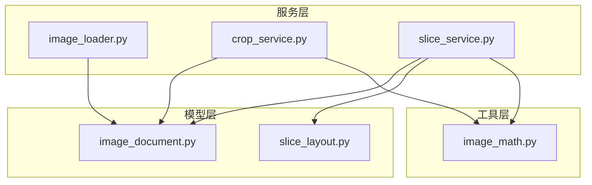
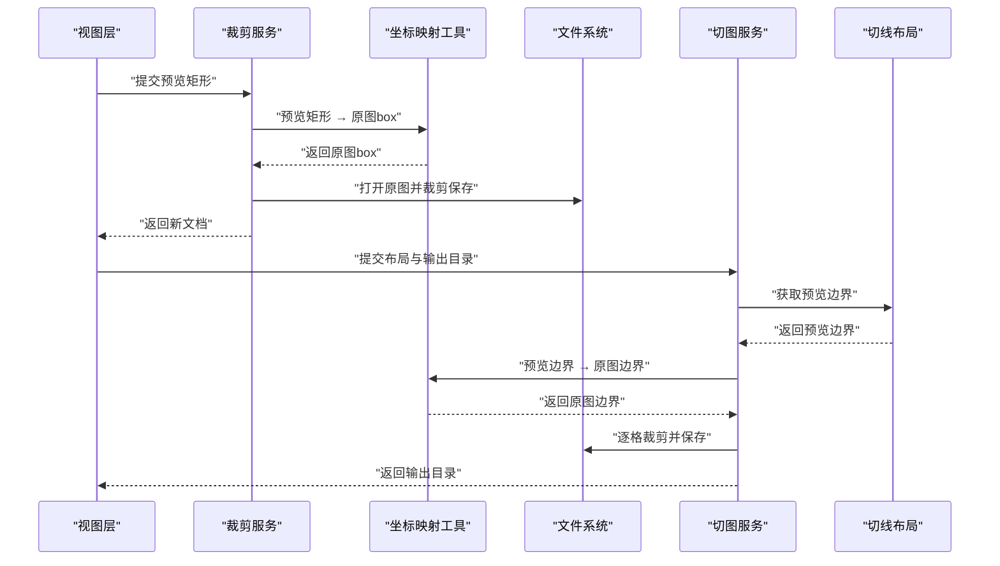
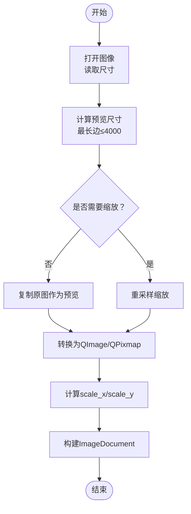
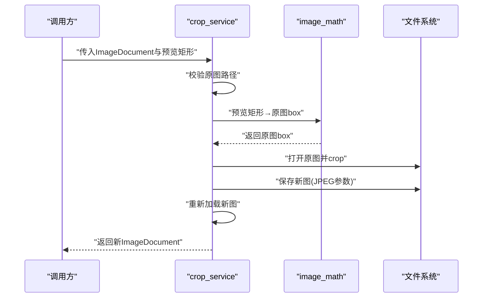
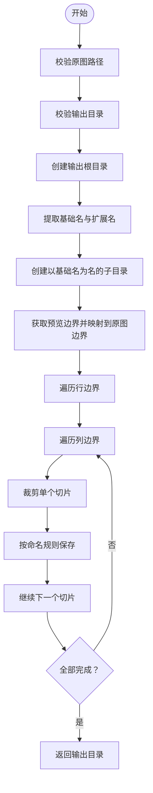
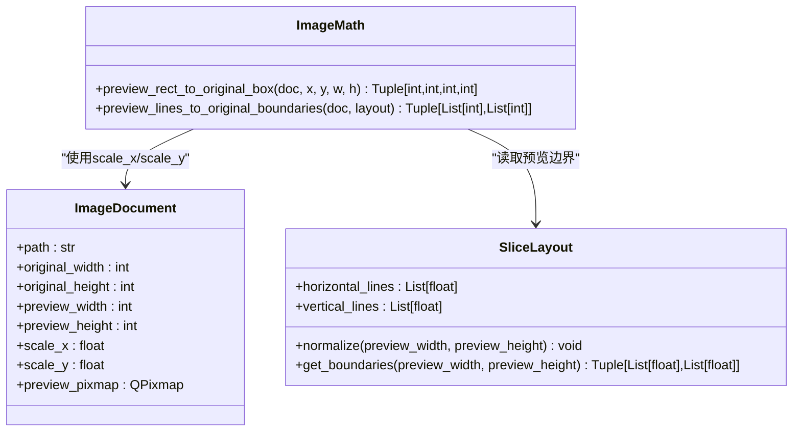
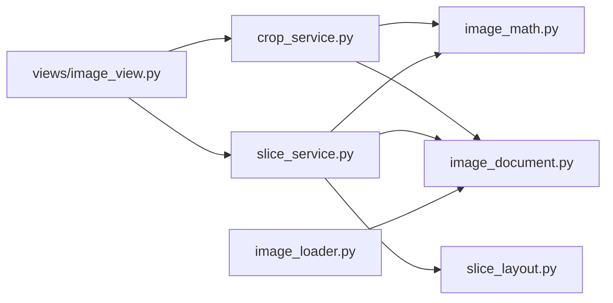

# 服务模块技术设计

<cite>
**本文引用的文件**
- [img_slicer_tool/services/image_loader.py](file://img_slicer_tool/services/image_loader.py)
- [img_slicer_tool/services/crop_service.py](file://img_slicer_tool/services/crop_service.py)
- [img_slicer_tool/services/slice_service.py](file://img_slicer_tool/services/slice_service.py)
- [img_slicer_tool/utils/image_math.py](file://img_slicer_tool/utils/image_math.py)
- [img_slicer_tool/models/image_document.py](file://img_slicer_tool/models/image_document.py)
- [img_slicer_tool/models/slice_layout.py](file://img_slicer_tool/models/slice_layout.py)
- [img_slicer_tool/views/image_view.py](file://img_slicer_tool/views/image_view.py)
</cite>

## 目录
1. [引言](#引言)
2. [项目结构](#项目结构)
3. [核心组件](#核心组件)
4. [架构总览](#架构总览)
5. [详细组件分析](#详细组件分析)
6. [依赖关系分析](#依赖关系分析)
7. [性能考量](#性能考量)
8. [故障排查指南](#故障排查指南)
9. [结论](#结论)

## 引言
本文件聚焦于 PictureMaster 的服务层实现，围绕三大核心服务展开：image_loader、crop_service、slice_service。文档旨在阐明以下要点：
- image_loader 如何利用 Pillow 加载多格式图像并生成最大边不超过 4000px 的预览图，兼顾性能与兼容性；
- crop_service 如何调用 image_math 中的坐标转换函数，将预览坐标映射回原图并执行精确裁剪；
- slice_service 如何依据 SliceLayout 的切线信息批量生成切片图像，并支持命名规则与输出路径配置；
- 强调 image_math.py 提供的坐标映射与边界计算工具函数在服务层的关键支撑作用。

## 项目结构
服务层位于 img_slicer_tool/services，配合 models 与 utils 模块协同工作：
- services：提供业务服务接口（图像加载、裁剪、切图）
- models：定义数据模型（ImageDocument、SliceLayout）
- utils：提供数学工具（坐标映射、边界计算）

图表来源
- [img_slicer_tool/services/image_loader.py](file://img_slicer_tool/services/image_loader.py#L1-L68)
- [img_slicer_tool/services/crop_service.py](file://img_slicer_tool/services/crop_service.py#L1-L38)
- [img_slicer_tool/services/slice_service.py](file://img_slicer_tool/services/slice_service.py#L1-L62)
- [img_slicer_tool/utils/image_math.py](file://img_slicer_tool/utils/image_math.py#L1-L76)
- [img_slicer_tool/models/image_document.py](file://img_slicer_tool/models/image_document.py#L1-L18)
- [img_slicer_tool/models/slice_layout.py](file://img_slicer_tool/models/slice_layout.py#L1-L30)

章节来源
- [img_slicer_tool/services/image_loader.py](file://img_slicer_tool/services/image_loader.py#L1-L68)
- [img_slicer_tool/services/crop_service.py](file://img_slicer_tool/services/crop_service.py#L1-L38)
- [img_slicer_tool/services/slice_service.py](file://img_slicer_tool/services/slice_service.py#L1-L62)
- [img_slicer_tool/utils/image_math.py](file://img_slicer_tool/utils/image_math.py#L1-L76)
- [img_slicer_tool/models/image_document.py](file://img_slicer_tool/models/image_document.py#L1-L18)
- [img_slicer_tool/models/slice_layout.py](file://img_slicer_tool/models/slice_layout.py#L1-L30)

## 核心组件
- ImageDocument：承载原图路径、尺寸、预览尺寸与坐标映射比例，以及预览图 QPixmap，是服务层与视图层交互的数据载体。
- SliceLayout：保存预览坐标系下的水平/垂直切线集合，提供标准化与边界生成能力，用于切图布局。
- image_loader：负责加载图像、生成预览图、构建 ImageDocument。
- crop_service：基于预览矩形进行裁剪，调用坐标映射函数将预览坐标转换为原图 box 并保存新图。
- slice_service：基于 SliceLayout 的切线信息批量生成切片，按命名规则写入目标目录。
- image_math：提供预览坐标与原图坐标的双向映射与边界计算工具函数。

章节来源
- [img_slicer_tool/models/image_document.py](file://img_slicer_tool/models/image_document.py#L1-L18)
- [img_slicer_tool/models/slice_layout.py](file://img_slicer_tool/models/slice_layout.py#L1-L30)
- [img_slicer_tool/services/image_loader.py](file://img_slicer_tool/services/image_loader.py#L1-L68)
- [img_slicer_tool/services/crop_service.py](file://img_slicer_tool/services/crop_service.py#L1-L38)
- [img_slicer_tool/services/slice_service.py](file://img_slicer_tool/services/slice_service.py#L1-L62)
- [img_slicer_tool/utils/image_math.py](file://img_slicer_tool/utils/image_math.py#L1-L76)

## 架构总览
服务层通过统一的数据模型与数学工具，将用户在预览图上的操作（拖拽选择、布局线设置）映射到原图坐标空间，从而实现高精度的裁剪与切图。

图表来源
- [img_slicer_tool/services/crop_service.py](file://img_slicer_tool/services/crop_service.py#L1-L38)
- [img_slicer_tool/utils/image_math.py](file://img_slicer_tool/utils/image_math.py#L1-L76)
- [img_slicer_tool/services/slice_service.py](file://img_slicer_tool/services/slice_service.py#L1-L62)
- [img_slicer_tool/models/slice_layout.py](file://img_slicer_tool/models/slice_layout.py#L1-L30)

## 详细组件分析

### image_loader：预览图生成与数据封装
职责
- 使用 Pillow 打开任意格式图像；
- 计算预览尺寸，确保最长边不超过 4000px；
- 生成预览图并转换为 QImage/QPixmap；
- 计算 scale_x 与 scale_y，构造 ImageDocument 返回。

实现要点
- 预览尺寸计算：当任一边超过阈值时，按比例缩小，避免超大图像影响 UI 性能。
- 缩放算法：使用高质量重采样，保证预览质量。
- 模式转换：将非 RGB/RGBA 模式的图像转换为 RGBA，确保 QImage/QPixmap 转换稳定。
- 数据封装：包含原图尺寸、预览尺寸、缩放比例与预览图对象，便于后续服务层使用。

图表来源
- [img_slicer_tool/services/image_loader.py](file://img_slicer_tool/services/image_loader.py#L1-L68)

章节来源
- [img_slicer_tool/services/image_loader.py](file://img_slicer_tool/services/image_loader.py#L1-L68)

### crop_service：预览坐标到原图的精确裁剪
职责
- 接收预览矩形（x, y, w, h），将其映射到原图坐标；
- 打开原图并执行裁剪；
- 保存新图并重新加载为 ImageDocument 返回。

关键流程
- 输入校验：确保原图存在；
- 坐标映射：调用 image_math 的预览矩形到原图 box 的转换函数；
- 裁剪保存：根据扩展名设置 JPEG 保存参数；
- 新文档重建：调用 image_loader 重新加载新图，返回新文档。

图表来源
- [img_slicer_tool/services/crop_service.py](file://img_slicer_tool/services/crop_service.py#L1-L38)
- [img_slicer_tool/utils/image_math.py](file://img_slicer_tool/utils/image_math.py#L1-L76)

章节来源
- [img_slicer_tool/services/crop_service.py](file://img_slicer_tool/services/crop_service.py#L1-L38)
- [img_slicer_tool/utils/image_math.py](file://img_slicer_tool/utils/image_math.py#L1-L76)

### slice_service：基于 SliceLayout 的批量切图
职责
- 接收 ImageDocument 与 SliceLayout，计算原图边界；
- 遍历网格，逐格裁剪并按命名规则保存；
- 支持输出目录与文件扩展名配置。

关键流程
- 输入校验：原图存在、输出目录有效；
- 创建输出根目录与以原图名为基础的子目录；
- 获取预览边界并映射到原图边界；
- 遍历网格生成切片，按“r行号_c列号”命名；
- JPEG 保存参数优化质量与子采样。

图表来源
- [img_slicer_tool/services/slice_service.py](file://img_slicer_tool/services/slice_service.py#L1-L62)
- [img_slicer_tool/utils/image_math.py](file://img_slicer_tool/utils/image_math.py#L1-L76)
- [img_slicer_tool/models/slice_layout.py](file://img_slicer_tool/models/slice_layout.py#L1-L30)

章节来源
- [img_slicer_tool/services/slice_service.py](file://img_slicer_tool/services/slice_service.py#L1-L62)
- [img_slicer_tool/utils/image_math.py](file://img_slicer_tool/utils/image_math.py#L1-L76)
- [img_slicer_tool/models/slice_layout.py](file://img_slicer_tool/models/slice_layout.py#L1-L30)

### image_math：坐标映射与边界计算的核心工具
职责
- 预览矩形到原图 box 的映射：将预览坐标乘以 scale_x/scale_y 并做边界约束；
- 预览边界到原图边界的映射：将布局线按比例映射并排序去重，确保有效网格；
- 提供错误校验：非法宽高、无效区域、边界不足等。

图表来源
- [img_slicer_tool/utils/image_math.py](file://img_slicer_tool/utils/image_math.py#L1-L76)
- [img_slicer_tool/models/image_document.py](file://img_slicer_tool/models/image_document.py#L1-L18)
- [img_slicer_tool/models/slice_layout.py](file://img_slicer_tool/models/slice_layout.py#L1-L30)

章节来源
- [img_slicer_tool/utils/image_math.py](file://img_slicer_tool/utils/image_math.py#L1-L76)
- [img_slicer_tool/models/image_document.py](file://img_slicer_tool/models/image_document.py#L1-L18)
- [img_slicer_tool/models/slice_layout.py](file://img_slicer_tool/models/slice_layout.py#L1-L30)

## 依赖关系分析
- 低耦合高内聚：各服务仅依赖必要的模型与工具函数，避免循环依赖；
- 关键依赖链：
  - crop_service 依赖 image_math 的预览矩形映射；
  - slice_service 依赖 image_math 的边界映射与 SliceLayout 的预览边界；
  - image_loader 产出 ImageDocument，被裁剪与切图服务复用；
  - 视图层通过事件触发裁剪与切图请求，最终由服务层落地到文件系统。

图表来源
- [img_slicer_tool/views/image_view.py](file://img_slicer_tool/views/image_view.py#L137-L167)
- [img_slicer_tool/services/crop_service.py](file://img_slicer_tool/services/crop_service.py#L1-L38)
- [img_slicer_tool/services/slice_service.py](file://img_slicer_tool/services/slice_service.py#L1-L62)
- [img_slicer_tool/utils/image_math.py](file://img_slicer_tool/utils/image_math.py#L1-L76)
- [img_slicer_tool/models/slice_layout.py](file://img_slicer_tool/models/slice_layout.py#L1-L30)
- [img_slicer_tool/models/image_document.py](file://img_slicer_tool/models/image_document.py#L1-L18)
- [img_slicer_tool/services/image_loader.py](file://img_slicer_tool/services/image_loader.py#L1-L68)

章节来源
- [img_slicer_tool/views/image_view.py](file://img_slicer_tool/views/image_view.py#L137-L167)
- [img_slicer_tool/services/crop_service.py](file://img_slicer_tool/services/crop_service.py#L1-L38)
- [img_slicer_tool/services/slice_service.py](file://img_slicer_tool/services/slice_service.py#L1-L62)
- [img_slicer_tool/utils/image_math.py](file://img_slicer_tool/utils/image_math.py#L1-L76)
- [img_slicer_tool/models/slice_layout.py](file://img_slicer_tool/models/slice_layout.py#L1-L30)
- [img_slicer_tool/models/image_document.py](file://img_slicer_tool/models/image_document.py#L1-L18)
- [img_slicer_tool/services/image_loader.py](file://img_slicer_tool/services/image_loader.py#L1-L68)

## 性能考量
- 预览图尺寸控制：通过最大边长限制，降低 UI 渲染与交互成本，同时减少内存占用。
- 重采样策略：使用高质量重采样算法，平衡清晰度与性能。
- I/O 优化：JPEG 保存时设置质量与子采样参数，兼顾体积与视觉效果。
- 批处理与顺序：切图采用网格遍历，避免不必要的中间对象，减少内存抖动。

## 故障排查指南
常见问题与定位建议
- 原图路径不存在：检查输入路径与权限，确认文件存在后再调用服务。
- 预览矩形无效：确认宽高为正数，且映射后形成有效 box。
- 切图边界不足：检查 SliceLayout 的水平/垂直线数量与范围，确保至少形成一个有效网格。
- 输出目录为空：确保传入合法目录并具备写权限。
- 图像模式不兼容：image_loader 已自动转换为 RGBA，如仍出现异常，检查 Pillow 版本与安装。

章节来源
- [img_slicer_tool/services/crop_service.py](file://img_slicer_tool/services/crop_service.py#L1-L38)
- [img_slicer_tool/services/slice_service.py](file://img_slicer_tool/services/slice_service.py#L1-L62)
- [img_slicer_tool/utils/image_math.py](file://img_slicer_tool/utils/image_math.py#L1-L76)

## 结论
本服务层通过统一的数据模型与数学工具，实现了从预览图到原图的高保真坐标映射，保障了裁剪与切图的准确性与性能。image_loader 的预览图策略、crop_service 的精确映射与保存、slice_service 的批量切图与命名规范，共同构成了高效稳定的图像处理流水线。image_math 在其中扮演了关键的桥梁角色，确保所有服务都能以一致的坐标体系进行运算。