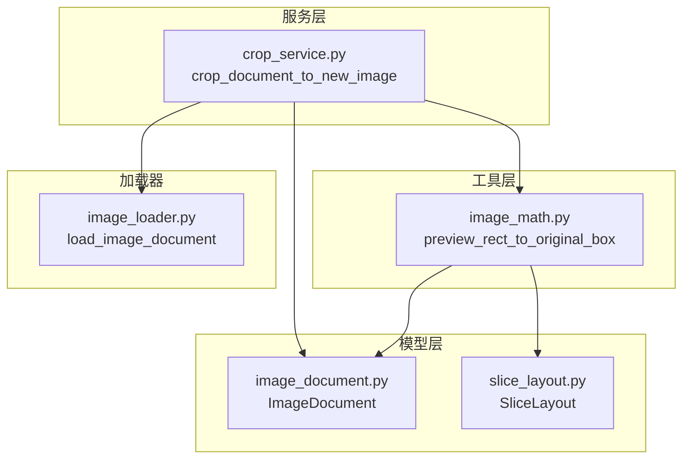
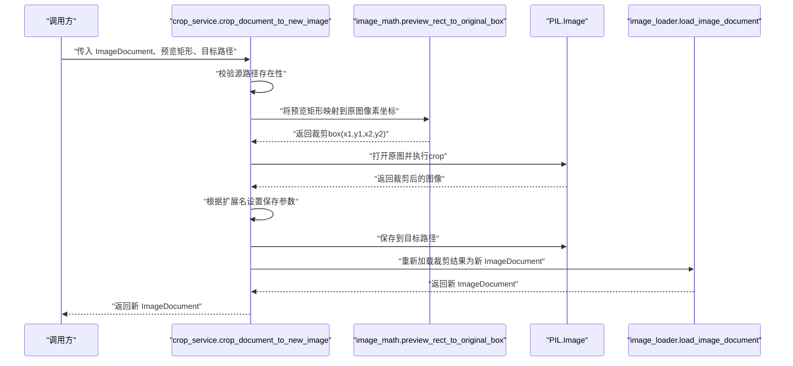
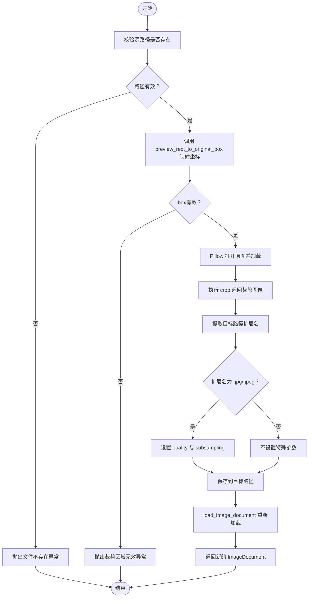
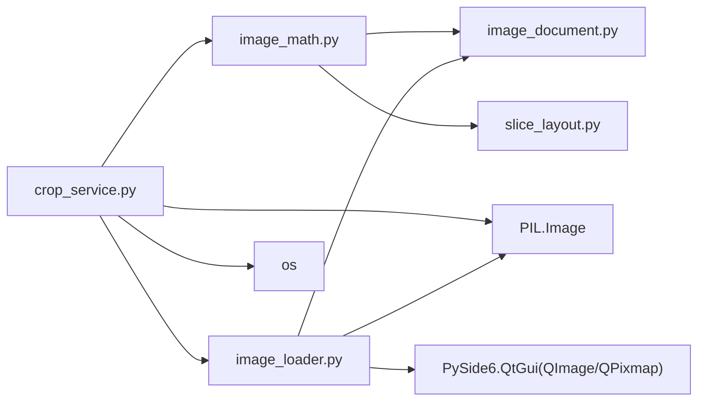

# 裁剪服务

<cite>
**本文引用的文件**
- [crop_service.py](file://img_slicer_tool/services/crop_service.py)
- [image_math.py](file://img_slicer_tool/utils/image_math.py)
- [image_document.py](file://img_slicer_tool/models/image_document.py)
- [image_loader.py](file://img_slicer_tool/services/image_loader.py)
- [slice_layout.py](file://img_slicer_tool/models/slice_layout.py)
</cite>

## 目录
1. [简介](#简介)
2. [项目结构](#项目结构)
3. [核心组件](#核心组件)
4. [架构总览](#架构总览)
5. [详细组件分析](#详细组件分析)
6. [依赖关系分析](#依赖关系分析)
7. [性能考量](#性能考量)
8. [故障排查指南](#故障排查指南)
9. [结论](#结论)

## 简介
本文件围绕 crop_service.py 中的 crop_document_to_new_image 函数进行深入解析，系统阐述其工作流程、坐标映射机制、保存参数策略、数据闭环设计，以及在覆盖保存与另存为两种使用场景中的差异。文档同时提供常见问题排查建议，帮助开发者快速定位与解决典型问题。

## 项目结构
本功能位于 img_slicer_tool 项目的业务服务层，涉及以下关键模块：
- 服务层：crop_service.py 提供裁剪入口
- 工具层：image_math.py 提供预览坐标到原图坐标的映射
- 模型层：image_document.py 描述图像文档元信息；slice_layout.py 描述切图布局
- 加载器：image_loader.py 将磁盘图像加载为 ImageDocument 实例

图表来源
- [crop_service.py](file://img_slicer_tool/services/crop_service.py#L1-L38)
- [image_math.py](file://img_slicer_tool/utils/image_math.py#L1-L76)
- [image_document.py](file://img_slicer_tool/models/image_document.py#L1-L18)
- [image_loader.py](file://img_slicer_tool/services/image_loader.py#L1-L68)
- [slice_layout.py](file://img_slicer_tool/models/slice_layout.py#L1-L30)

章节来源
- [crop_service.py](file://img_slicer_tool/services/crop_service.py#L1-L38)
- [image_math.py](file://img_slicer_tool/utils/image_math.py#L1-L76)
- [image_document.py](file://img_slicer_tool/models/image_document.py#L1-L18)
- [image_loader.py](file://img_slicer_tool/services/image_loader.py#L1-L68)
- [slice_layout.py](file://img_slicer_tool/models/slice_layout.py#L1-L30)

## 核心组件
- crop_document_to_new_image：接收 ImageDocument、预览坐标下的裁剪矩形与目标路径，完成坐标映射、裁剪、保存与重新加载，返回新的 ImageDocument。
- preview_rect_to_original_box：将预览坐标系的矩形映射到原图像素坐标，并做边界与有效性校验。
- ImageDocument：承载原图尺寸、预览尺寸、缩放因子与预览位图等元信息。
- load_image_document：从磁盘加载图像，构建 ImageDocument 并生成预览 QPixmap。

章节来源
- [crop_service.py](file://img_slicer_tool/services/crop_service.py#L13-L38)
- [image_math.py](file://img_slicer_tool/utils/image_math.py#L17-L48)
- [image_document.py](file://img_slicer_tool/models/image_document.py#L8-L18)
- [image_loader.py](file://img_slicer_tool/services/image_loader.py#L24-L54)

## 架构总览
下图展示 crop_document_to_new_image 的端到端调用链路，包括坐标映射、裁剪、保存与重新加载。

图表来源
- [crop_service.py](file://img_slicer_tool/services/crop_service.py#L13-L38)
- [image_math.py](file://img_slicer_tool/utils/image_math.py#L17-L48)
- [image_loader.py](file://img_slicer_tool/services/image_loader.py#L24-L54)

## 详细组件分析

### crop_document_to_new_image 流程详解
- 输入参数
  - doc：包含原图路径、预览尺寸、缩放因子等的 ImageDocument
  - preview_rect：预览坐标系下的矩形(x, y, w, h)
  - target_path：输出图像的目标路径
- 关键步骤
  1) 路径校验：确保源路径存在，否则抛出异常
  2) 坐标映射：调用 preview_rect_to_original_box 将预览矩形映射到原图像素坐标，并进行宽高与区域有效性检查
  3) 打开与裁剪：使用 Pillow 打开原图并执行精确裁剪
  4) 保存参数：根据目标路径扩展名自动配置 JPEG 保存参数（如质量与子采样）
  5) 重新加载：调用 load_image_document 读取保存后的图像，返回新的 ImageDocument
- 数据闭环：通过 load_image_document 重建 ImageDocument，使上层逻辑可直接复用同一数据结构

图表来源
- [crop_service.py](file://img_slicer_tool/services/crop_service.py#L13-L38)
- [image_math.py](file://img_slicer_tool/utils/image_math.py#L17-L48)
- [image_loader.py](file://img_slicer_tool/services/image_loader.py#L24-L54)

章节来源
- [crop_service.py](file://img_slicer_tool/services/crop_service.py#L13-L38)

### 坐标映射：preview_rect_to_original_box
- 输入：预览坐标系的矩形(x, y, w, h)与 ImageDocument
- 输出：原图像素坐标下的裁剪 box(x1, y1, x2, y2)
- 核心逻辑
  - 计算预览矩形的四个顶点坐标
  - 使用 scale_x 与 scale_y 将预览坐标映射到原图像素坐标
  - 对边界进行截断，确保不越界
  - 校验 x2 > x1 且 y2 > y1，否则判定为无效区域
- 复杂度：O(1)，常数时间与空间
- 错误处理：宽高非正或映射后区域过小会抛出异常

章节来源
- [image_math.py](file://img_slicer_tool/utils/image_math.py#L17-L48)
- [image_document.py](file://img_slicer_tool/models/image_document.py#L8-L18)

### 保存参数机制：save_kwargs 与扩展名
- 触发条件：当目标路径扩展名为 .jpg 或 .jpeg 时，自动设置 JPEG 保存参数
- 参数策略
  - quality：用于控制 JPEG 压缩质量
  - subsampling：用于控制色度子采样
- 其他格式：未匹配到上述扩展名时，不设置特殊参数，采用 Pillow 默认行为
- 影响：在 JPEG 输出时提升质量一致性与压缩效率

章节来源
- [crop_service.py](file://img_slicer_tool/services/crop_service.py#L29-L34)

### 数据闭环：load_image_document 重新加载
- 作用：将磁盘上的裁剪结果重新加载为新的 ImageDocument，包含原图尺寸、预览尺寸、缩放因子与预览 QPixmap
- 价值：保证上层逻辑与后续处理统一使用相同的模型结构，避免重复适配

章节来源
- [image_loader.py](file://img_slicer_tool/services/image_loader.py#L24-L54)
- [crop_service.py](file://img_slicer_tool/services/crop_service.py#L36-L37)

### 应用场景差异：覆盖保存 vs 另存为
- 覆盖保存
  - target_path 指向原图路径
  - 优点：无需额外存储空间，便于快速回退
  - 风险：覆盖前需确认备份策略，避免不可逆修改
- 另存为
  - target_path 指向新文件路径（通常不同扩展名）
  - 优点：保留原始文件不变，便于对比与版本管理
  - 注意：确保目标路径具备写权限与可用目录

章节来源
- [crop_service.py](file://img_slicer_tool/services/crop_service.py#L13-L38)
- [image_loader.py](file://img_slicer_tool/services/image_loader.py#L24-L54)

## 依赖关系分析
- crop_service.py 依赖
  - image_math.preview_rect_to_original_box：坐标映射
  - image_loader.load_image_document：重新加载
  - PIL.Image：图像打开与裁剪
  - os：路径与扩展名处理
- image_math.py 依赖
  - ImageDocument：读取缩放因子与原图尺寸
  - SliceLayout：辅助计算原图边界（在其他函数中使用）
- image_loader.py 依赖
  - PIL.Image、PySide6.QImage/QPixmap：图像与预览图转换
  - ImageDocument：构造返回对象

图表来源
- [crop_service.py](file://img_slicer_tool/services/crop_service.py#L1-L38)
- [image_math.py](file://img_slicer_tool/utils/image_math.py#L1-L76)
- [image_loader.py](file://img_slicer_tool/services/image_loader.py#L1-L68)
- [image_document.py](file://img_slicer_tool/models/image_document.py#L1-L18)
- [slice_layout.py](file://img_slicer_tool/models/slice_layout.py#L1-L30)

章节来源
- [crop_service.py](file://img_slicer_tool/services/crop_service.py#L1-L38)
- [image_math.py](file://img_slicer_tool/utils/image_math.py#L1-L76)
- [image_loader.py](file://img_slicer_tool/services/image_loader.py#L1-L68)
- [image_document.py](file://img_slicer_tool/models/image_document.py#L1-L18)
- [slice_layout.py](file://img_slicer_tool/models/slice_layout.py#L1-L30)

## 性能考量
- 坐标映射：O(1)，无额外内存分配
- 图像打开与裁剪：受图像尺寸影响，裁剪本身为 O(w*h)（取决于内部实现），但通常按像素拷贝，受内存带宽限制
- 保存参数：仅在扩展名为 .jpg/.jpeg 时设置参数，其余格式保持默认，避免不必要的分支判断
- 预览尺寸：image_loader 在加载时会根据最大尺寸阈值生成预览，避免在大图上进行不必要的预览渲染

章节来源
- [crop_service.py](file://img_slicer_tool/services/crop_service.py#L26-L34)
- [image_loader.py](file://img_slicer_tool/services/image_loader.py#L14-L21)

## 故障排查指南
- 裁剪区域无效
  - 现象：抛出“裁剪宽高必须为正数”或“裁剪区域过小或无效”
  - 排查要点：确认预览矩形的宽高为正值；检查 scale_x 与 scale_y 是否合理；确保映射后 x2 > x1 且 y2 > y1
  - 参考路径
    - [image_math.py](file://img_slicer_tool/utils/image_math.py#L26-L47)
- 路径不存在或无权限
  - 现象：抛出“原始图片路径不存在”或保存失败
  - 排查要点：确认 doc.path 存在；检查目标路径所在目录是否可写；确认扩展名正确
  - 参考路径
    - [crop_service.py](file://img_slicer_tool/services/crop_service.py#L20-L21)
    - [crop_service.py](file://img_slicer_tool/services/crop_service.py#L36-L37)
- JPEG 保存参数未生效
  - 现象：目标扩展名非 .jpg/.jpeg 导致未设置 quality 与 subsampling
  - 排查要点：确认目标路径扩展名；若需高质量 JPEG，应使用 .jpg/.jpeg
  - 参考路径
    - [crop_service.py](file://img_slicer_tool/services/crop_service.py#L29-L34)
- 预览与原图尺寸不一致导致的越界
  - 现象：映射后坐标越界或被截断
  - 排查要点：核对 doc.original_width/height 与 doc.preview_width/height 的比例；确认 scale_x 与 scale_y 的计算逻辑
  - 参考路径
    - [image_loader.py](file://img_slicer_tool/services/image_loader.py#L42-L53)
    - [image_math.py](file://img_slicer_tool/utils/image_math.py#L34-L43)

## 结论
crop_document_to_new_image 通过清晰的职责划分与严格的边界校验，实现了从预览坐标到原图像素的精确映射、稳定的裁剪与保存、以及数据闭环的重新加载。其在覆盖保存与另存为两种模式下均可高效运行，配合合理的参数策略与完善的错误处理，能够满足大多数图像裁剪场景的需求。建议在生产环境中结合备份策略与权限检查，确保操作安全与可追溯。