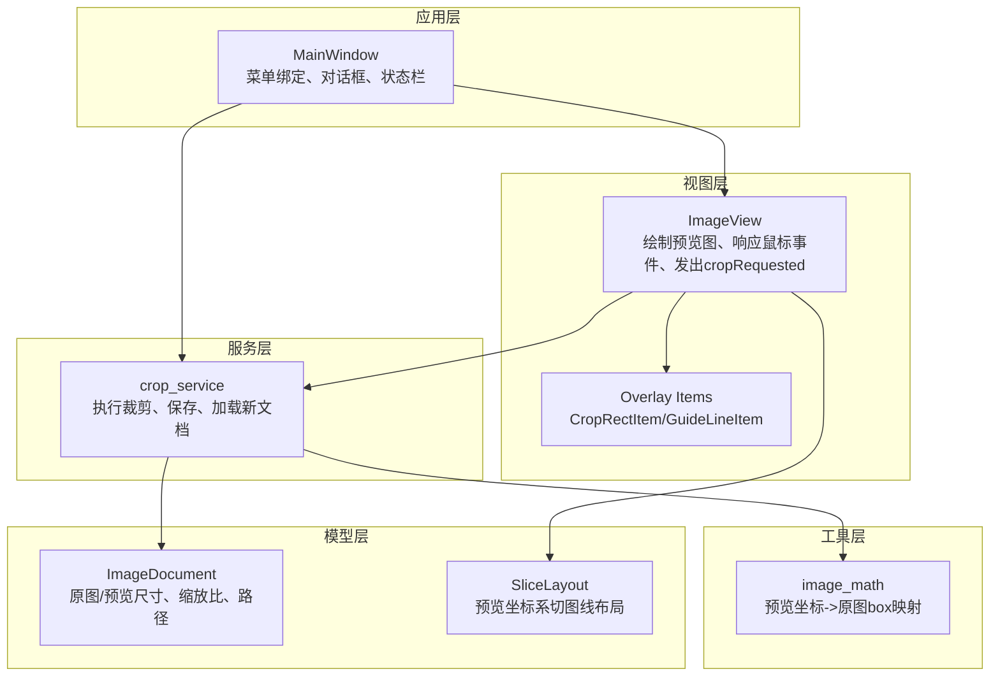
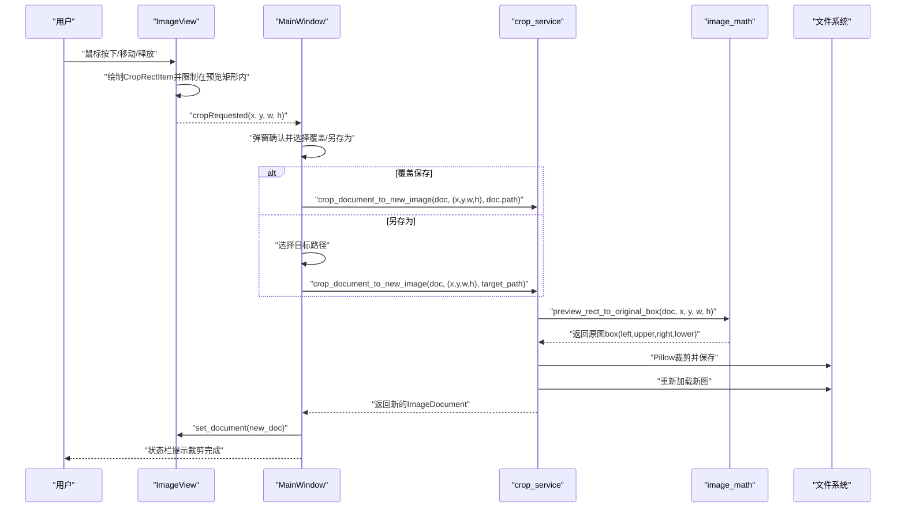
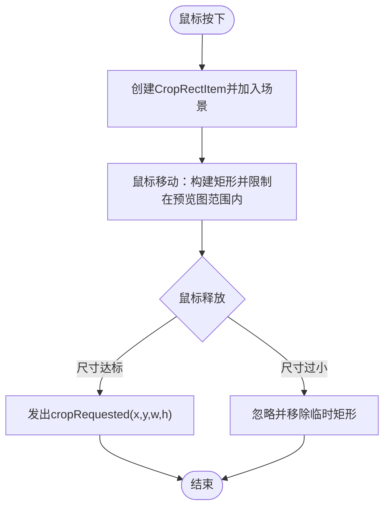
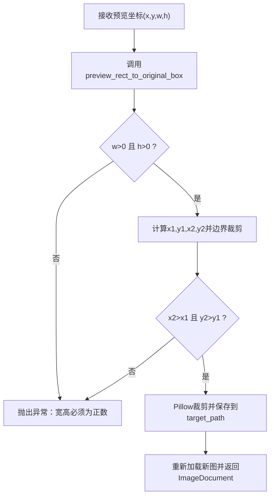
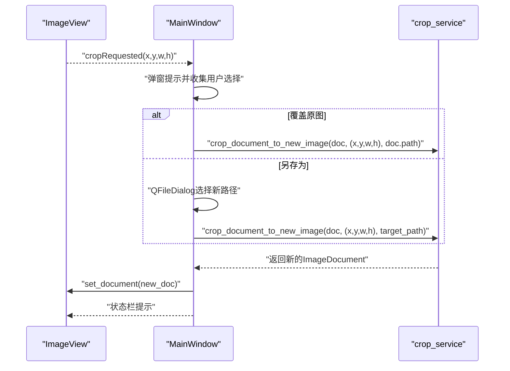
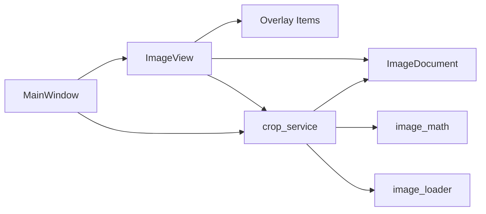

# 区域裁剪功能

<cite>
**本文引用的文件**
- [img_slicer_tool/views/image_view.py](file://img_slicer_tool/views/image_view.py)
- [img_slicer_tool/views/overlay_items.py](file://img_slicer_tool/views/overlay_items.py)
- [img_slicer_tool/services/crop_service.py](file://img_slicer_tool/services/crop_service.py)
- [img_slicer_tool/utils/image_math.py](file://img_slicer_tool/utils/image_math.py)
- [img_slicer_tool/app/main_window.py](file://img_slicer_tool/app/main_window.py)
- [img_slicer_tool/models/image_document.py](file://img_slicer_tool/models/image_document.py)
- [img_slicer_tool/services/image_loader.py](file://img_slicer_tool/services/image_loader.py)
- [img_slicer_tool/models/slice_layout.py](file://img_slicer_tool/models/slice_layout.py)
</cite>

## 目录
1. [简介](#简介)
2. [项目结构](#项目结构)
3. [核心组件](#核心组件)
4. [架构总览](#架构总览)
5. [详细组件分析](#详细组件分析)
6. [依赖关系分析](#依赖关系分析)
7. [性能考量](#性能考量)
8. [故障排查指南](#故障排查指南)
9. [结论](#结论)
10. [附录](#附录)

## 简介
本文件系统性解析“区域裁剪”功能的实现原理与使用方式，重点说明：
- ImageView 上如何绘制并交互可拖拽的裁剪框；
- cropRequested 信号的触发机制；
- crop_service 如何通过 image_math 将预览坐标映射到原图坐标并执行裁剪；
- 在主窗口中覆盖保存与另存为两种模式的实现差异；
- 裁剪精度、边界溢出处理、错误处理与用户体验优化建议。

## 项目结构
裁剪功能涉及视图层、覆盖项、服务层、工具函数与模型层的协同：
- 视图层负责交互与事件分发；
- 覆盖项用于渲染裁剪框与辅助线；
- 服务层负责业务流程与文件 IO；
- 工具函数负责坐标映射与边界校验；
- 模型层承载图像元数据与缩放比例。

图表来源
- [img_slicer_tool/views/image_view.py](file://img_slicer_tool/views/image_view.py#L1-L542)
- [img_slicer_tool/views/overlay_items.py](file://img_slicer_tool/views/overlay_items.py#L1-L64)
- [img_slicer_tool/services/crop_service.py](file://img_slicer_tool/services/crop_service.py#L1-L38)
- [img_slicer_tool/utils/image_math.py](file://img_slicer_tool/utils/image_math.py#L1-L76)
- [img_slicer_tool/models/image_document.py](file://img_slicer_tool/models/image_document.py#L1-L18)
- [img_slicer_tool/models/slice_layout.py](file://img_slicer_tool/models/slice_layout.py#L1-L30)
- [img_slicer_tool/app/main_window.py](file://img_slicer_tool/app/main_window.py#L1-L364)

章节来源
- [img_slicer_tool/views/image_view.py](file://img_slicer_tool/views/image_view.py#L1-L542)
- [img_slicer_tool/views/overlay_items.py](file://img_slicer_tool/views/overlay_items.py#L1-L64)
- [img_slicer_tool/services/crop_service.py](file://img_slicer_tool/services/crop_service.py#L1-L38)
- [img_slicer_tool/utils/image_math.py](file://img_slicer_tool/utils/image_math.py#L1-L76)
- [img_slicer_tool/models/image_document.py](file://img_slicer_tool/models/image_document.py#L1-L18)
- [img_slicer_tool/models/slice_layout.py](file://img_slicer_tool/models/slice_layout.py#L1-L30)
- [img_slicer_tool/app/main_window.py](file://img_slicer_tool/app/main_window.py#L1-L364)

## 核心组件
- ImageView：负责鼠标事件、裁剪框绘制、裁剪区域发射 cropRequested 信号。
- CropRectItem：在场景中绘制半透明填充、虚线边框的矩形，作为裁剪框。
- crop_service：接收预览坐标裁剪框，调用 image_math 进行坐标映射，使用 Pillow 执行裁剪并保存，再加载新文档返回。
- image_math：提供预览坐标到原图 box 的映射与边界裁剪校验。
- ImageDocument：承载原图尺寸、预览尺寸、缩放比与预览图象素图。
- MainWindow：菜单绑定、弹窗确认裁剪、覆盖保存/另存为分支、状态栏反馈。

章节来源
- [img_slicer_tool/views/image_view.py](file://img_slicer_tool/views/image_view.py#L1-L542)
- [img_slicer_tool/views/overlay_items.py](file://img_slicer_tool/views/overlay_items.py#L1-L64)
- [img_slicer_tool/services/crop_service.py](file://img_slicer_tool/services/crop_service.py#L1-L38)
- [img_slicer_tool/utils/image_math.py](file://img_slicer_tool/utils/image_math.py#L1-L76)
- [img_slicer_tool/models/image_document.py](file://img_slicer_tool/models/image_document.py#L1-L18)
- [img_slicer_tool/app/main_window.py](file://img_slicer_tool/app/main_window.py#L1-L364)

## 架构总览
裁剪流程从用户在 ImageView 中拖拽选择区域开始，经由 cropRequested 信号传递到 MainWindow，再调用 crop_service 执行裁剪，最终更新视图与状态栏。

图表来源
- [img_slicer_tool/views/image_view.py](file://img_slicer_tool/views/image_view.py#L154-L235)
- [img_slicer_tool/app/main_window.py](file://img_slicer_tool/app/main_window.py#L136-L193)
- [img_slicer_tool/services/crop_service.py](file://img_slicer_tool/services/crop_service.py#L13-L38)
- [img_slicer_tool/utils/image_math.py](file://img_slicer_tool/utils/image_math.py#L17-L48)

## 详细组件分析

### ImageView 与 CropRectItem：可拖拽裁剪框的绘制与交互
- 事件处理
  - 鼠标按下：记录起始场景坐标，创建 CropRectItem 并加入场景。
  - 鼠标移动：根据起始点与当前位置构建矩形，同时将坐标限制在预览图矩形范围内，保证裁剪框不越界。
  - 鼠标释放：若裁剪框宽度/高度达到最小阈值，则发出 cropRequested 信号，携带预览坐标 (x, y, w, h)。
- 裁剪框样式
  - CropRectItem 使用半透明填充与虚线边框，z-index 较高，确保覆盖在预览图之上。
- 辅助线
  - GuideLineItem 支持高亮与场景坐标读取，便于切图模式下的辅助参考（与裁剪功能同属视图层）。

图表来源
- [img_slicer_tool/views/image_view.py](file://img_slicer_tool/views/image_view.py#L154-L235)
- [img_slicer_tool/views/overlay_items.py](file://img_slicer_tool/views/overlay_items.py#L8-L26)

章节来源
- [img_slicer_tool/views/image_view.py](file://img_slicer_tool/views/image_view.py#L154-L235)
- [img_slicer_tool/views/overlay_items.py](file://img_slicer_tool/views/overlay_items.py#L8-L26)

### cropRequested 信号的触发机制
- 触发条件
  - 仅当裁剪框宽度与高度均大于等于最小尺寸阈值时才触发。
- 信号参数
  - 以预览坐标系的矩形 (x, y, w, h) 传递，单位为像素，对应预览图尺寸。
- 发送方与接收方
  - 发送方：ImageView 在鼠标释放时发出。
  - 接收方：MainWindow 通过连接捕获该信号并弹窗确认。

章节来源
- [img_slicer_tool/views/image_view.py](file://img_slicer_tool/views/image_view.py#L216-L235)
- [img_slicer_tool/app/main_window.py](file://img_slicer_tool/app/main_window.py#L87-L101)

### crop_service 如何通过 image_math 进行坐标映射与裁剪
- 输入
  - ImageDocument：包含原图尺寸、预览尺寸与缩放比 scale_x/scale_y。
  - 预览坐标 (x, y, w, h)。
  - 目标路径 target_path。
- 映射步骤
  - 将预览坐标 (x, y, w, h) 转换为原图坐标 (x1, y1, x2, y2)，其中 x1/y1 为左上角，x2/y2 为右下角。
  - 对 x1/x2/y1/y2 进行边界裁剪，确保落入 [0, 原图宽/高]。
  - 校验 x2 > x1 且 y2 > y1，否则抛出异常。
- 裁剪与保存
  - 使用 Pillow 打开原图，执行 crop(box=(x1, y1, x2, y2))。
  - 根据目标路径后缀自动设置 JPEG 保存质量与子采样参数。
  - 保存完成后重新加载为新的 ImageDocument 并返回。

图表来源
- [img_slicer_tool/services/crop_service.py](file://img_slicer_tool/services/crop_service.py#L13-L38)
- [img_slicer_tool/utils/image_math.py](file://img_slicer_tool/utils/image_math.py#L17-L48)
- [img_slicer_tool/services/image_loader.py](file://img_slicer_tool/services/image_loader.py#L24-L55)

章节来源
- [img_slicer_tool/services/crop_service.py](file://img_slicer_tool/services/crop_service.py#L13-L38)
- [img_slicer_tool/utils/image_math.py](file://img_slicer_tool/utils/image_math.py#L17-L48)
- [img_slicer_tool/services/image_loader.py](file://img_slicer_tool/services/image_loader.py#L24-L55)

### 主窗口菜单绑定：覆盖保存与另存为的实现差异
- 绑定逻辑
  - MainWindow 在初始化时连接 ImageView 的 cropRequested 信号到内部处理方法。
- 覆盖保存
  - 选择“覆盖原图”，直接将目标路径设为当前文档路径，随后调用裁剪服务。
- 另存为
  - 选择“另存为...”，弹出文件对话框让用户指定新路径，若未选择则取消。
- 错误处理
  - 裁剪过程中捕获异常并弹出错误提示，避免崩溃。
- 用户反馈
  - 成功后更新当前文档与视图，并在状态栏显示新文档的尺寸信息。

图表来源
- [img_slicer_tool/app/main_window.py](file://img_slicer_tool/app/main_window.py#L87-L101)
- [img_slicer_tool/app/main_window.py](file://img_slicer_tool/app/main_window.py#L136-L193)
- [img_slicer_tool/services/crop_service.py](file://img_slicer_tool/services/crop_service.py#L13-L38)

章节来源
- [img_slicer_tool/app/main_window.py](file://img_slicer_tool/app/main_window.py#L87-L101)
- [img_slicer_tool/app/main_window.py](file://img_slicer_tool/app/main_window.py#L136-L193)

### 数据模型与缩放比：ImageDocument 与 SliceLayout
- ImageDocument
  - 保存原图与预览图的宽高，以及 scale_x = original_width / preview_width、scale_y = original_height / preview_height。
  - 提供预览图象素图 preview_pixmap，用于 ImageView 渲染。
- SliceLayout
  - 存储预览坐标系下的水平/垂直切图线，normalize 会过滤越界与重复值，并在 get_boundaries 中自动加上边界的 0 与宽/高。

章节来源
- [img_slicer_tool/models/image_document.py](file://img_slicer_tool/models/image_document.py#L8-L18)
- [img_slicer_tool/models/slice_layout.py](file://img_slicer_tool/models/slice_layout.py#L7-L30)
- [img_slicer_tool/services/image_loader.py](file://img_slicer_tool/services/image_loader.py#L14-L55)

## 依赖关系分析
- ImageView 依赖 Overlay Items 渲染裁剪框与辅助线；依赖 ImageDocument 获取预览图与缩放比；发出 cropRequested 信号。
- crop_service 依赖 ImageDocument、image_math、image_loader；负责文件 IO 与新文档加载。
- image_math 依赖 ImageDocument；提供坐标映射与边界校验。
- MainWindow 依赖 ImageView 与 crop_service；负责 UI 交互与错误提示。

图表来源
- [img_slicer_tool/views/image_view.py](file://img_slicer_tool/views/image_view.py#L1-L542)
- [img_slicer_tool/views/overlay_items.py](file://img_slicer_tool/views/overlay_items.py#L1-L64)
- [img_slicer_tool/services/crop_service.py](file://img_slicer_tool/services/crop_service.py#L1-L38)
- [img_slicer_tool/utils/image_math.py](file://img_slicer_tool/utils/image_math.py#L1-L76)
- [img_slicer_tool/services/image_loader.py](file://img_slicer_tool/services/image_loader.py#L1-L68)
- [img_slicer_tool/models/image_document.py](file://img_slicer_tool/models/image_document.py#L1-L18)
- [img_slicer_tool/app/main_window.py](file://img_slicer_tool/app/main_window.py#L1-L364)

章节来源
- [img_slicer_tool/views/image_view.py](file://img_slicer_tool/views/image_view.py#L1-L542)
- [img_slicer_tool/services/crop_service.py](file://img_slicer_tool/services/crop_service.py#L1-L38)
- [img_slicer_tool/utils/image_math.py](file://img_slicer_tool/utils/image_math.py#L1-L76)
- [img_slicer_tool/services/image_loader.py](file://img_slicer_tool/services/image_loader.py#L1-L68)
- [img_slicer_tool/models/image_document.py](file://img_slicer_tool/models/image_document.py#L1-L18)
- [img_slicer_tool/app/main_window.py](file://img_slicer_tool/app/main_window.py#L1-L364)

## 性能考量
- 预览尺寸与缩放比
  - 预览图最大尺寸受控，避免大图导致内存与渲染压力；缩放比用于将预览坐标映射到原图。
- 裁剪精度
  - 坐标映射采用 round 与边界裁剪，确保 box 有效且不越界。
- 文件 IO
  - Pillow 裁剪与保存在主线程执行，建议在 UI 线程外异步执行或使用进度条提示，避免阻塞。
- 缩略图与大图
  - 若需处理超大图，可考虑引入更高效的图像库或分块处理策略（当前实现基于 Pillow）。

[本节为通用性能讨论，不直接分析具体文件]

## 故障排查指南
- 常见错误与定位
  - 预览坐标宽高非正：检查调用方是否传入有效矩形。
  - 原图路径不存在：确认 ImageDocument.path 是否正确。
  - 裁剪区域过小或无效：确认最小尺寸阈值与矩形归一化。
  - 文件保存失败：检查目标路径权限与后缀支持。
- 用户体验优化建议
  - 在裁剪前显示预览区域与原图尺寸对比，增强确认感。
  - 对于大图裁剪，提供异步执行与进度反馈。
  - 增加撤销/重做机制或临时预览图层，减少误操作风险。

章节来源
- [img_slicer_tool/utils/image_math.py](file://img_slicer_tool/utils/image_math.py#L17-L48)
- [img_slicer_tool/services/crop_service.py](file://img_slicer_tool/services/crop_service.py#L13-L38)
- [img_slicer_tool/app/main_window.py](file://img_slicer_tool/app/main_window.py#L136-L193)

## 结论
- ImageView 通过 CropRectItem 提供直观的可拖拽裁剪框，并在满足尺寸阈值后发出 cropRequested 信号。
- crop_service 依赖 image_math 将预览坐标精确映射到原图坐标，执行裁剪并保存，最后加载新文档。
- MainWindow 负责菜单绑定、覆盖保存与另存为两种模式的分支逻辑、错误处理与状态栏反馈。
- 通过 ImageDocument 的缩放比与 SliceLayout 的预览坐标系，系统实现了从 UI 交互到文件 IO 的完整闭环。

[本节为总结性内容，不直接分析具体文件]

## 附录
- 关键实现路径参考
  - 裁剪框绘制与信号触发：[img_slicer_tool/views/image_view.py](file://img_slicer_tool/views/image_view.py#L154-L235)
  - 裁剪框样式定义：[img_slicer_tool/views/overlay_items.py](file://img_slicer_tool/views/overlay_items.py#L8-L26)
  - 坐标映射与边界校验：[img_slicer_tool/utils/image_math.py](file://img_slicer_tool/utils/image_math.py#L17-L48)
  - 裁剪服务与文件保存：[img_slicer_tool/services/crop_service.py](file://img_slicer_tool/services/crop_service.py#L13-L38)
  - 主窗口菜单绑定与模式分支：[img_slicer_tool/app/main_window.py](file://img_slicer_tool/app/main_window.py#L87-L101), [img_slicer_tool/app/main_window.py](file://img_slicer_tool/app/main_window.py#L136-L193)
  - 文档模型与缩放比：[img_slicer_tool/models/image_document.py](file://img_slicer_tool/models/image_document.py#L8-L18), [img_slicer_tool/services/image_loader.py](file://img_slicer_tool/services/image_loader.py#L14-L55)
  - 切图布局（预览坐标系）：[img_slicer_tool/models/slice_layout.py](file://img_slicer_tool/models/slice_layout.py#L7-L30)