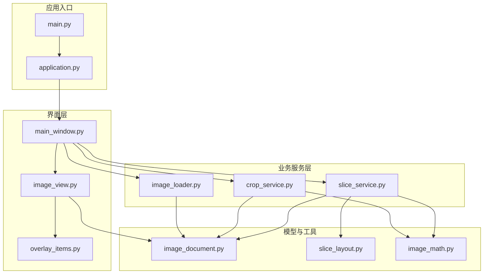
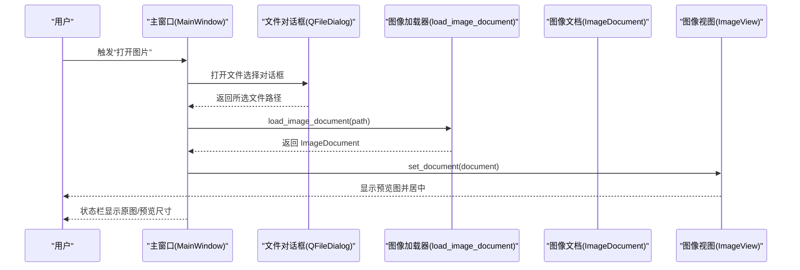
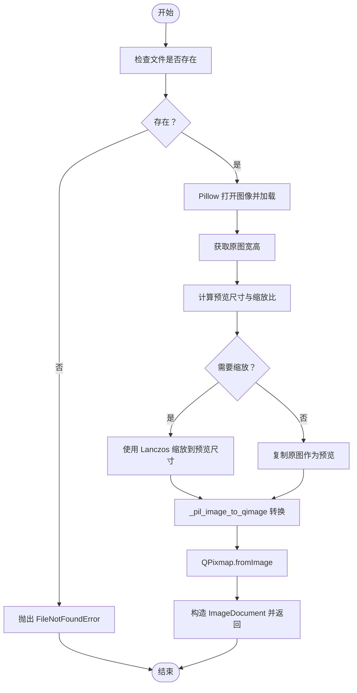
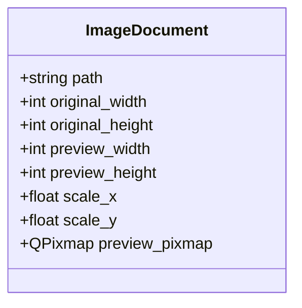
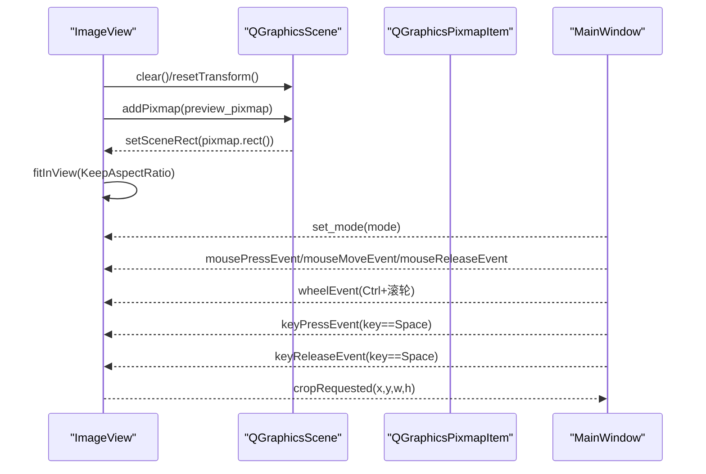
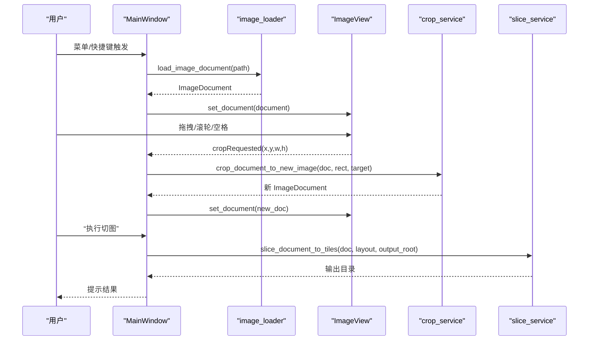
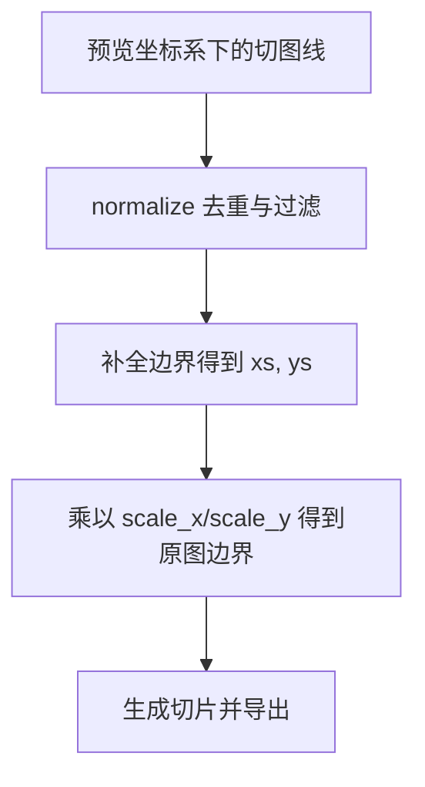
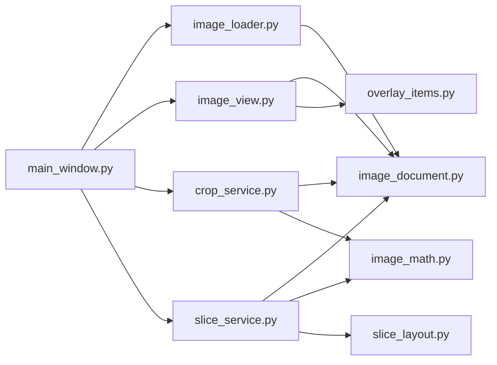

# 图像加载与预览

<cite>
**本文引用的文件**
- [img_slicer_tool/services/image_loader.py](file://img_slicer_tool/services/image_loader.py)
- [img_slicer_tool/models/image_document.py](file://img_slicer_tool/models/image_document.py)
- [img_slicer_tool/views/image_view.py](file://img_slicer_tool/views/image_view.py)
- [img_slicer_tool/app/main_window.py](file://img_slicer_tool/app/main_window.py)
- [img_slicer_tool/utils/image_math.py](file://img_slicer_tool/utils/image_math.py)
- [img_slicer_tool/services/crop_service.py](file://img_slicer_tool/services/crop_service.py)
- [img_slicer_tool/services/slice_service.py](file://img_slicer_tool/services/slice_service.py)
- [img_slicer_tool/views/overlay_items.py](file://img_slicer_tool/views/overlay_items.py)
- [img_slicer_tool/models/slice_layout.py](file://img_slicer_tool/models/slice_layout.py)
- [img_slicer_tool/app/application.py](file://img_slicer_tool/app/application.py)
- [img_slicer_tool/main.py](file://img_slicer_tool/main.py)
</cite>

## 目录
1. [简介](#简介)
2. [项目结构](#项目结构)
3. [核心组件](#核心组件)
4. [架构总览](#架构总览)
5. [详细组件分析](#详细组件分析)
6. [依赖关系分析](#依赖关系分析)
7. [性能考虑](#性能考虑)
8. [故障排查指南](#故障排查指南)
9. [结论](#结论)
10. [附录](#附录)

## 简介
本文件系统性阐述图像加载与预览功能的实现机制，围绕以下目标展开：
- 解释 image_loader 如何使用 Pillow 加载多种格式图像，并依据“最大边≤4000px”的规则生成适配显示的预览图；
- 描述 ImageDocument 类如何封装原图路径、尺寸、缩放比和预览图数据；
- 说明 ImageView 如何渲染预览图并支持高质量缩放显示；
- 结合 main_window 的菜单触发逻辑，梳理从文件选择到图像显示的完整流程；
- 提供异常处理示例（如加载失败）与性能优化策略（内存占用控制）；
- 指出未来集成 pyvips 提升大图加载性能的扩展路径。

## 项目结构
该功能由多层模块协同完成：应用入口负责启动 GUI；主窗口负责菜单与交互；服务层负责图像加载、裁剪与切图；模型层封装文档元数据；视图层负责预览渲染与用户交互；工具模块提供坐标换算。

图表来源
- [img_slicer_tool/main.py](file://img_slicer_tool/main.py#L1-L13)
- [img_slicer_tool/app/application.py](file://img_slicer_tool/app/application.py#L1-L35)
- [img_slicer_tool/app/main_window.py](file://img_slicer_tool/app/main_window.py#L1-L262)
- [img_slicer_tool/views/image_view.py](file://img_slicer_tool/views/image_view.py#L1-L218)
- [img_slicer_tool/views/overlay_items.py](file://img_slicer_tool/views/overlay_items.py#L1-L57)
- [img_slicer_tool/services/image_loader.py](file://img_slicer_tool/services/image_loader.py#L1-L68)
- [img_slicer_tool/services/crop_service.py](file://img_slicer_tool/services/crop_service.py#L1-L38)
- [img_slicer_tool/services/slice_service.py](file://img_slicer_tool/services/slice_service.py#L1-L62)
- [img_slicer_tool/models/image_document.py](file://img_slicer_tool/models/image_document.py#L1-L18)
- [img_slicer_tool/models/slice_layout.py](file://img_slicer_tool/models/slice_layout.py#L1-L30)
- [img_slicer_tool/utils/image_math.py](file://img_slicer_tool/utils/image_math.py#L1-L76)

章节来源
- [img_slicer_tool/main.py](file://img_slicer_tool/main.py#L1-L13)
- [img_slicer_tool/app/application.py](file://img_slicer_tool/app/application.py#L1-L35)
- [img_slicer_tool/app/main_window.py](file://img_slicer_tool/app/main_window.py#L1-L262)

## 核心组件
- 图像加载器：负责加载原图、计算预览尺寸、生成预览图并封装为 ImageDocument。
- 图像文档：承载原图路径、尺寸、缩放比与预览图对象。
- 图像视图：渲染预览图、支持滚轮缩放、空格拖拽、裁剪框绘制与切图线管理。
- 主窗口：提供菜单与快捷键，触发文件选择与加载，协调裁剪与切图流程。
- 数学工具：提供预览坐标到原图坐标的映射，保障裁剪与切图的像素级精度。
- 裁剪与切图服务：基于预览坐标与缩放比，对原图进行裁剪与导出切片。

章节来源
- [img_slicer_tool/services/image_loader.py](file://img_slicer_tool/services/image_loader.py#L1-L68)
- [img_slicer_tool/models/image_document.py](file://img_slicer_tool/models/image_document.py#L1-L18)
- [img_slicer_tool/views/image_view.py](file://img_slicer_tool/views/image_view.py#L1-L218)
- [img_slicer_tool/app/main_window.py](file://img_slicer_tool/app/main_window.py#L1-L262)
- [img_slicer_tool/utils/image_math.py](file://img_slicer_tool/utils/image_math.py#L1-L76)
- [img_slicer_tool/services/crop_service.py](file://img_slicer_tool/services/crop_service.py#L1-L38)
- [img_slicer_tool/services/slice_service.py](file://img_slicer_tool/services/slice_service.py#L1-L62)

## 架构总览
下图展示从用户选择图片到图像显示与交互的端到端流程，包括异常处理与状态更新。

图表来源
- [img_slicer_tool/app/main_window.py](file://img_slicer_tool/app/main_window.py#L76-L109)
- [img_slicer_tool/services/image_loader.py](file://img_slicer_tool/services/image_loader.py#L24-L55)
- [img_slicer_tool/views/image_view.py](file://img_slicer_tool/views/image_view.py#L43-L58)

## 详细组件分析

### 图像加载器：Pillow 多格式加载与预览生成
- 多格式支持：通过 Pillow 的 Image.open 支持常见格式（PNG/JPG/JPEG/BMP/GIF/TIFF 等），由文件对话框的过滤器限定。
- 最大边约束：当原图任一边大于 4000px 时，按比例缩小至不超过 4000px 的预览尺寸，保持纵横比一致。
- 高质量缩放：使用 Lanczos 重采样算法生成预览图，兼顾清晰度与性能。
- 数据封装：将预览图转换为 QImage/QPixmap，同时计算缩放比 scale_x/scale_y，用于预览坐标到原图坐标的映射。
- 异常处理：若路径不存在，抛出 FileNotFoundError；调用方捕获并提示用户。

图表来源
- [img_slicer_tool/services/image_loader.py](file://img_slicer_tool/services/image_loader.py#L14-L68)

章节来源
- [img_slicer_tool/services/image_loader.py](file://img_slicer_tool/services/image_loader.py#L1-L68)

### 图像文档：数据结构与职责
- 字段包含：原图路径、原宽高、预览宽高、缩放比（x/y）、预览图对象（QPixmap）。
- 作用：作为跨模块传递的统一载体，确保预览与原图之间的坐标映射准确可靠。

图表来源
- [img_slicer_tool/models/image_document.py](file://img_slicer_tool/models/image_document.py#L8-L18)

章节来源
- [img_slicer_tool/models/image_document.py](file://img_slicer_tool/models/image_document.py#L1-L18)

### 图像视图：渲染与交互
- 渲染：接收 ImageDocument，创建 QGraphicsScene/PixmapItem，自动 fitInView 居中显示。
- 缩放：支持 Ctrl+滚轮进行高质量缩放，记录当前缩放倍率，便于后续坐标换算。
- 拖拽：空格键切换为“手拖”模式，平移预览图以便观察细节。
- 裁剪：左键拖拽绘制半透明矩形，松开后发出裁剪信号，最小尺寸限制避免误操作。
- 切图：在切图模式下，支持添加水平/垂直辅助线，支持 Shift/Ctrl 组合键控制线类型，支持删除选中线。
- 线条收集：遍历场景中的 GuideLineItem，转换为 SliceLayout，再由工具模块换算为原图边界。

图表来源
- [img_slicer_tool/views/image_view.py](file://img_slicer_tool/views/image_view.py#L43-L175)
- [img_slicer_tool/views/overlay_items.py](file://img_slicer_tool/views/overlay_items.py#L1-L57)
- [img_slicer_tool/app/main_window.py](file://img_slicer_tool/app/main_window.py#L168-L178)

章节来源
- [img_slicer_tool/views/image_view.py](file://img_slicer_tool/views/image_view.py#L1-L218)
- [img_slicer_tool/views/overlay_items.py](file://img_slicer_tool/views/overlay_items.py#L1-L57)

### 主窗口：菜单触发与流程编排
- 菜单与快捷键：提供“打开图片”“切图模式”“按行列生成宫格线”“执行切图”“设置切图保存路径”等。
- 文件选择：使用 QFileDialog 过滤图片格式，返回路径后调用加载器生成 ImageDocument。
- 加载异常：捕获加载异常并弹窗提示，不中断应用运行。
- 状态栏：显示文件名、原图尺寸与预览尺寸，便于用户感知。
- 裁剪确认：根据预览矩形弹窗确认，支持覆盖原图或另存为，调用裁剪服务生成新文档并刷新视图。
- 切图执行：收集切图线，转换为原图边界，批量导出切片，异常时提示并记录。

图表来源
- [img_slicer_tool/app/main_window.py](file://img_slicer_tool/app/main_window.py#L76-L167)
- [img_slicer_tool/services/crop_service.py](file://img_slicer_tool/services/crop_service.py#L13-L38)
- [img_slicer_tool/services/slice_service.py](file://img_slicer_tool/services/slice_service.py#L12-L62)

章节来源
- [img_slicer_tool/app/main_window.py](file://img_slicer_tool/app/main_window.py#L1-L262)

### 坐标映射与切图布局
- 预览到原图：利用 ImageDocument 的 scale_x/scale_y 将预览坐标换算为原图像素坐标，保证裁剪与切图的像素级精度。
- 切图布局：SliceLayout 在预览坐标系下维护水平/垂直线集合，normalize 过滤无效线并补全边界，最终生成原图边界序列。

图表来源
- [img_slicer_tool/models/slice_layout.py](file://img_slicer_tool/models/slice_layout.py#L1-L30)
- [img_slicer_tool/utils/image_math.py](file://img_slicer_tool/utils/image_math.py#L50-L76)

章节来源
- [img_slicer_tool/utils/image_math.py](file://img_slicer_tool/utils/image_math.py#L1-L76)
- [img_slicer_tool/models/slice_layout.py](file://img_slicer_tool/models/slice_layout.py#L1-L30)

## 依赖关系分析
- 模块耦合：
  - main_window 依赖 image_loader、crop_service、slice_service 与 ImageView；
  - image_loader 仅依赖 Pillow 与 Qt 的图像类型；
  - crop_service/slice_service 依赖 Pillow、ImageMath 与 ImageDocument；
  - image_view 依赖 ImageDocument 与 OverlayItems；
  - image_math 依赖 ImageDocument 与 SliceLayout。
- 关键依赖链：
  - 文件选择 → 加载器 → 文档 → 视图渲染；
  - 裁剪请求 → 数学映射 → 原图裁剪 → 新文档 → 视图刷新；
  - 切图请求 → 数学映射 → 原图分块 → 导出切片。

图表来源
- [img_slicer_tool/app/main_window.py](file://img_slicer_tool/app/main_window.py#L1-L262)
- [img_slicer_tool/services/image_loader.py](file://img_slicer_tool/services/image_loader.py#L1-L68)
- [img_slicer_tool/views/image_view.py](file://img_slicer_tool/views/image_view.py#L1-L218)
- [img_slicer_tool/services/crop_service.py](file://img_slicer_tool/services/crop_service.py#L1-L38)
- [img_slicer_tool/services/slice_service.py](file://img_slicer_tool/services/slice_service.py#L1-L62)
- [img_slicer_tool/utils/image_math.py](file://img_slicer_tool/utils/image_math.py#L1-L76)
- [img_slicer_tool/models/image_document.py](file://img_slicer_tool/models/image_document.py#L1-L18)
- [img_slicer_tool/models/slice_layout.py](file://img_slicer_tool/models/slice_layout.py#L1-L30)
- [img_slicer_tool/views/overlay_items.py](file://img_slicer_tool/views/overlay_items.py#L1-L57)

章节来源
- [img_slicer_tool/app/main_window.py](file://img_slicer_tool/app/main_window.py#L1-L262)
- [img_slicer_tool/services/image_loader.py](file://img_slicer_tool/services/image_loader.py#L1-L68)
- [img_slicer_tool/views/image_view.py](file://img_slicer_tool/views/image_view.py#L1-L218)
- [img_slicer_tool/services/crop_service.py](file://img_slicer_tool/services/crop_service.py#L1-L38)
- [img_slicer_tool/services/slice_service.py](file://img_slicer_tool/services/slice_service.py#L1-L62)
- [img_slicer_tool/utils/image_math.py](file://img_slicer_tool/utils/image_math.py#L1-L76)
- [img_slicer_tool/models/image_document.py](file://img_slicer_tool/models/image_document.py#L1-L18)
- [img_slicer_tool/models/slice_layout.py](file://img_slicer_tool/models/slice_layout.py#L1-L30)
- [img_slicer_tool/views/overlay_items.py](file://img_slicer_tool/views/overlay_items.py#L1-L57)

## 性能考虑
- 预览尺寸控制：通过最大边 4000px 的限制，显著降低 Qt 场景渲染与缩放成本，避免超大图直接渲染导致的卡顿与内存峰值。
- 高质量缩放：使用 Lanczos 重采样生成预览图，兼顾清晰度与性能，适合交互式缩放。
- 内存占用控制：
  - Pillow 使用 img.load() 预加载，避免延迟解码带来的 UI 卡顿；
  - 预览图仅在内存中持有 QImage/QPixmap，避免保留原图副本；
  - 切图与裁剪均基于原图路径重新打开，避免重复缓存。
- 可选优化方向：
  - 对于超大图，可引入 pyvips 的 libvips 后端，利用其内存映射与高效重采样能力，进一步降低内存峰值与提升加载速度；
  - 在 Qt 层面，可启用智能视口更新与合适的渲染提示，减少不必要的重绘。

[本节为通用性能建议，无需特定文件引用]

## 故障排查指南
- 加载失败
  - 现象：打开图片后弹出错误提示。
  - 原因：文件不存在或格式不受支持。
  - 处理：检查路径有效性与文件格式；确认 Pillow 支持的格式列表；必要时转换为 PNG/JPEG。
  - 参考路径：[加载异常处理](file://img_slicer_tool/app/main_window.py#L93-L98)
- 裁剪失败
  - 现象：裁剪弹窗后执行失败。
  - 原因：原图路径不存在、裁剪区域非法或保存失败。
  - 处理：确认原图路径有效；检查裁剪区域是否过大或过小；选择合适的保存格式与质量参数。
  - 参考路径：[裁剪服务与异常处理](file://img_slicer_tool/services/crop_service.py#L13-L38)，[主窗口裁剪回调](file://img_slicer_tool/app/main_window.py#L110-L159)
- 切图失败
  - 现象：执行切图后弹出错误提示。
  - 原因：原图不存在、输出目录为空、切图线不足或边界计算异常。
  - 处理：设置切图保存根目录；确保至少两条水平线与两条垂直线；检查预览尺寸与缩放比。
  - 参考路径：[切图服务与异常处理](file://img_slicer_tool/services/slice_service.py#L12-L62)，[主窗口切图执行](file://img_slicer_tool/app/main_window.py#L230-L262)
- 预览图不清晰或卡顿
  - 现象：缩放时模糊或滚动卡顿。
  - 原因：预览图尺寸过大或缩放比过高。
  - 处理：确认最大边限制生效；使用 Ctrl+滚轮进行高质量缩放；必要时降低预览图质量或改用 pyvips。

章节来源
- [img_slicer_tool/app/main_window.py](file://img_slicer_tool/app/main_window.py#L93-L109)
- [img_slicer_tool/services/crop_service.py](file://img_slicer_tool/services/crop_service.py#L13-L38)
- [img_slicer_tool/services/slice_service.py](file://img_slicer_tool/services/slice_service.py#L12-L62)

## 结论
本功能通过“预览优先”的设计，将大图加载与交互体验分离：Pillow 负责高质量预览生成，Qt 负责流畅交互，数学工具确保预览与原图的像素级一致性。主窗口以菜单与快捷键串联各环节，形成从加载、缩放、裁剪到切图的完整工作流。未来可在保持现有架构稳定性的前提下，引入 pyvips 以进一步优化超大图的加载与缩放性能。

[本节为总结性内容，无需特定文件引用]

## 附录

### 从文件选择到图像显示的完整流程（代码级）
- 用户触发“打开图片”，主窗口弹出文件对话框并过滤图片格式；
- 选择文件后，主窗口调用加载器生成 ImageDocument；
- 加载器内部使用 Pillow 打开图像，计算预览尺寸与缩放比，生成 QImage/QPixmap；
- 主窗口将文档传入 ImageView，视图清空场景、重置变换并居中显示预览图；
- 状态栏显示原图与预览尺寸，供用户确认。

章节来源
- [img_slicer_tool/app/main_window.py](file://img_slicer_tool/app/main_window.py#L76-L109)
- [img_slicer_tool/services/image_loader.py](file://img_slicer_tool/services/image_loader.py#L24-L55)
- [img_slicer_tool/views/image_view.py](file://img_slicer_tool/views/image_view.py#L43-L58)

### 未来扩展：集成 pyvips
- 目标：在不改变上层接口的前提下，替换 Pillow 的底层解码与重采样，以获得更低内存占用与更快的大图加载速度。
- 方案要点：
  - 保持 ImageDocument 字段不变，仅替换加载与缩放实现；
  - 通过 Qt 的 QImage/QPixmap 接口桥接 pyvips 的图像数据；
  - 逐步迁移裁剪与切图服务，确保坐标映射与导出流程不受影响。
- 影响范围：image_loader、crop_service、slice_service 可能需要适配新接口；其余模块保持兼容。

[本节为概念性扩展建议，无需特定文件引用]