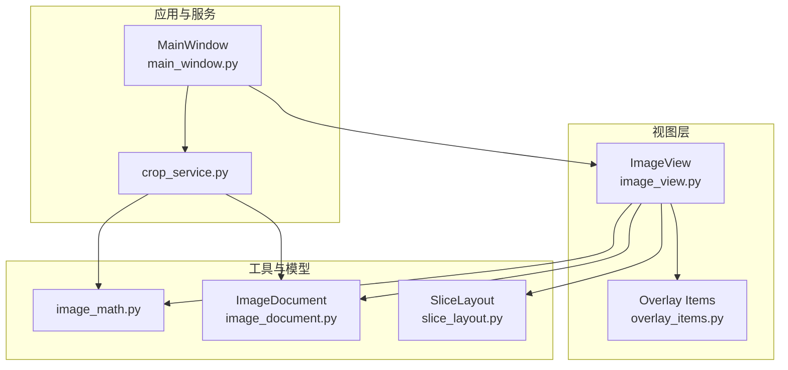
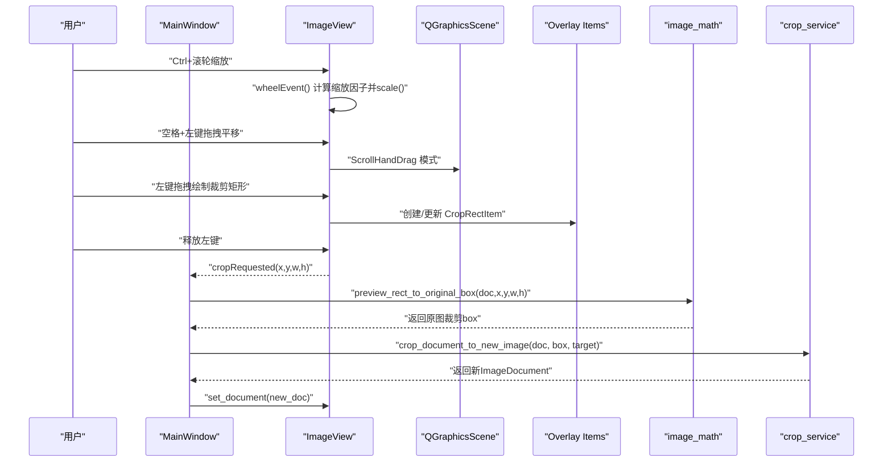
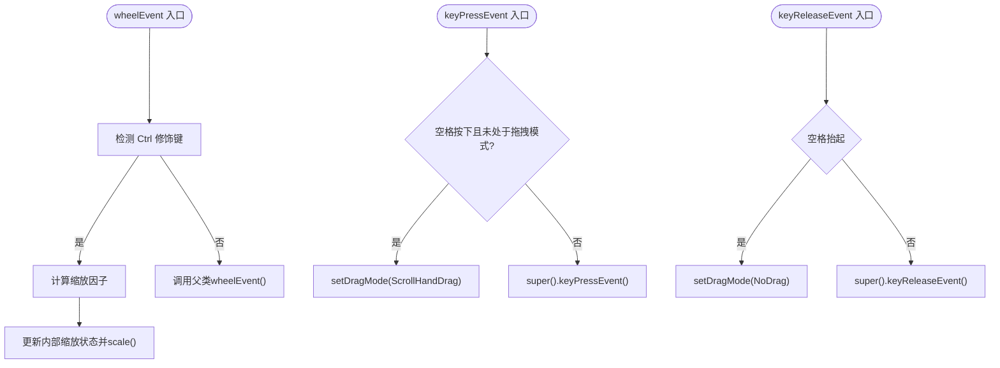
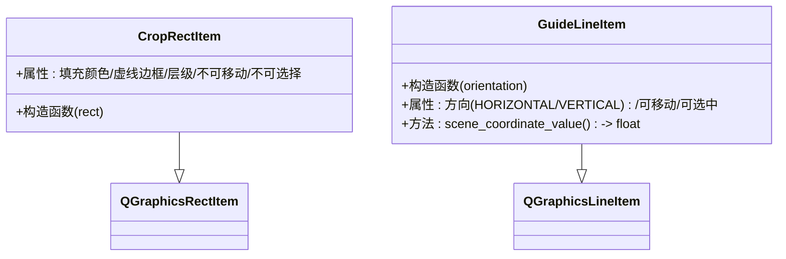
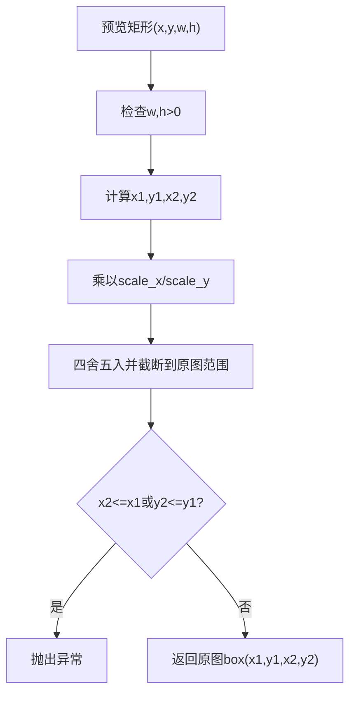
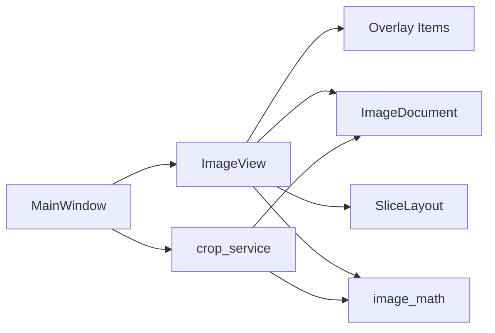

# 图像浏览操作

<cite>
**本文引用的文件**
- [img_slicer_tool/views/image_view.py](file://img_slicer_tool/views/image_view.py)
- [img_slicer_tool/views/overlay_items.py](file://img_slicer_tool/views/overlay_items.py)
- [img_slicer_tool/utils/image_math.py](file://img_slicer_tool/utils/image_math.py)
- [img_slicer_tool/models/image_document.py](file://img_slicer_tool/models/image_document.py)
- [img_slicer_tool/models/slice_layout.py](file://img_slicer_tool/models/slice_layout.py)
- [img_slicer_tool/app/main_window.py](file://img_slicer_tool/app/main_window.py)
- [img_slicer_tool/services/crop_service.py](file://img_slicer_tool/services/crop_service.py)
</cite>

## 目录
1. [简介](#简介)
2. [项目结构](#项目结构)
3. [核心组件](#核心组件)
4. [架构总览](#架构总览)
5. [详细组件分析](#详细组件分析)
6. [依赖关系分析](#依赖关系分析)
7. [性能考量](#性能考量)
8. [故障排查指南](#故障排查指南)
9. [结论](#结论)

## 简介
本文件围绕图像浏览交互功能展开，重点解析 ImageView 类如何通过重写鼠标与键盘事件实现“Ctrl+滚轮缩放”和“空格+拖拽平移”，解释基于 QGraphicsView 的坐标系转换机制，说明 image_math.py 中坐标映射函数在视图与场景坐标转换中的作用，并结合 overlay_items.py 的图形项渲染逻辑，阐述在高帧率下保障流畅交互的措施。同时提供用户操作流程示例、快捷键说明、边界限制处理与缩放级别控制策略，并分析常见问题（如卡顿、偏移错位）的原因与解决方案，最后给出性能调优建议。

## 项目结构
该功能主要分布在以下模块：
- 视图层：views/image_view.py（继承 QGraphicsView，负责交互与渲染）
- 图形项：views/overlay_items.py（裁剪矩形、辅助线等）
- 数学映射：utils/image_math.py（预览坐标到原图坐标的映射）
- 数据模型：models/image_document.py（包含预览与原图尺寸、缩放比例等）
- 切图布局：models/slice_layout.py（预览坐标系下的切图线集合）
- 应用入口：app/main_window.py（菜单、动作、信号连接）
- 裁剪服务：services/crop_service.py（基于映射执行实际裁剪）

图表来源
- [img_slicer_tool/views/image_view.py](file://img_slicer_tool/views/image_view.py#L1-L218)
- [img_slicer_tool/views/overlay_items.py](file://img_slicer_tool/views/overlay_items.py#L1-L57)
- [img_slicer_tool/utils/image_math.py](file://img_slicer_tool/utils/image_math.py#L1-L76)
- [img_slicer_tool/models/image_document.py](file://img_slicer_tool/models/image_document.py#L1-L18)
- [img_slicer_tool/models/slice_layout.py](file://img_slicer_tool/models/slice_layout.py#L1-L30)
- [img_slicer_tool/app/main_window.py](file://img_slicer_tool/app/main_window.py#L1-L248)
- [img_slicer_tool/services/crop_service.py](file://img_slicer_tool/services/crop_service.py#L1-L38)

章节来源
- [img_slicer_tool/views/image_view.py](file://img_slicer_tool/views/image_view.py#L1-L218)
- [img_slicer_tool/views/overlay_items.py](file://img_slicer_tool/views/overlay_items.py#L1-L57)
- [img_slicer_tool/utils/image_math.py](file://img_slicer_tool/utils/image_math.py#L1-L76)
- [img_slicer_tool/models/image_document.py](file://img_slicer_tool/models/image_document.py#L1-L18)
- [img_slicer_tool/models/slice_layout.py](file://img_slicer_tool/models/slice_layout.py#L1-L30)
- [img_slicer_tool/app/main_window.py](file://img_slicer_tool/app/main_window.py#L1-L248)
- [img_slicer_tool/services/crop_service.py](file://img_slicer_tool/services/crop_service.py#L1-L38)

## 核心组件
- ImageView：继承自 QGraphicsView，负责图像预览、交互事件处理、缩放与平移、裁剪矩形绘制、切图线管理、坐标映射触发等。
- Overlay Items：CropRectItem（半透明填充+虚线边框）、GuideLineItem（可移动可选中红色虚线）。
- image_math：提供预览坐标到原图坐标的映射函数，确保裁剪与切图线能正确落到原图像素边界上。
- ImageDocument：封装预览图与原图的尺寸、缩放比例、预览图象素等。
- SliceLayout：保存预览坐标系下的切图线集合，并提供归一化与边界扩展。
- MainWindow：菜单与动作绑定，连接 ImageView 的信号，协调裁剪与切图流程。
- crop_service：基于映射函数执行实际裁剪，生成新文档并刷新视图。

章节来源
- [img_slicer_tool/views/image_view.py](file://img_slicer_tool/views/image_view.py#L1-L218)
- [img_slicer_tool/views/overlay_items.py](file://img_slicer_tool/views/overlay_items.py#L1-L57)
- [img_slicer_tool/utils/image_math.py](file://img_slicer_tool/utils/image_math.py#L1-L76)
- [img_slicer_tool/models/image_document.py](file://img_slicer_tool/models/image_document.py#L1-L18)
- [img_slicer_tool/models/slice_layout.py](file://img_slicer_tool/models/slice_layout.py#L1-L30)
- [img_slicer_tool/app/main_window.py](file://img_slicer_tool/app/main_window.py#L1-L248)
- [img_slicer_tool/services/crop_service.py](file://img_slicer_tool/services/crop_service.py#L1-L38)

## 架构总览
下图展示用户交互到最终裁剪/切图的关键调用链路与数据流。

图表来源
- [img_slicer_tool/views/image_view.py](file://img_slicer_tool/views/image_view.py#L59-L175)
- [img_slicer_tool/views/overlay_items.py](file://img_slicer_tool/views/overlay_items.py#L8-L25)
- [img_slicer_tool/utils/image_math.py](file://img_slicer_tool/utils/image_math.py#L17-L47)
- [img_slicer_tool/app/main_window.py](file://img_slicer_tool/app/main_window.py#L110-L167)
- [img_slicer_tool/services/crop_service.py](file://img_slicer_tool/services/crop_service.py#L13-L38)

## 详细组件分析

### ImageView：交互与坐标转换
- 初始化与视图锚点
  - 设置渲染提示、拖拽模式、变换锚点与重绘模式，提升交互性能与视觉一致性。
  - 场景矩形与 fitInView 使初始显示适配视图比例。
- 缩放（Ctrl+滚轮）
  - 通过 wheelEvent 检测 Ctrl 键修饰，根据滚轮方向计算缩放因子，更新内部缩放状态并调用 scale 进行变换。
- 平移（空格+拖拽）
  - keyPressEvent 捕获空格按下，切换为 ScrollHandDrag 拖拽模式；keyReleaseEvent 捕获空格抬起，恢复 NoDrag。
- 裁剪矩形绘制
  - mousePressEvent：在图片范围内开始拖拽，创建 CropRectItem；mouseMoveEvent：限制在图片范围内更新矩形；mouseReleaseEvent：满足最小尺寸后发射 cropRequested(x,y,w,h)。
- 切图线管理
  - set_mode 控制模式；add_slice_line 在图片范围内添加水平/垂直辅助线；get_slice_layout 收集场景中的 GuideLineItem，过滤超出图片范围的线，再由 SliceLayout.normalize 归一化与扩展边界。
- 坐标映射触发
  - cropRequested 由 MainWindow 接收，随后调用 image_math.preview_rect_to_original_box 将预览坐标映射到原图像素坐标，再交由 crop_service 执行实际裁剪。

图表来源
- [img_slicer_tool/views/image_view.py](file://img_slicer_tool/views/image_view.py#L59-L81)

章节来源
- [img_slicer_tool/views/image_view.py](file://img_slicer_tool/views/image_view.py#L36-L58)
- [img_slicer_tool/views/image_view.py](file://img_slicer_tool/views/image_view.py#L59-L81)
- [img_slicer_tool/views/image_view.py](file://img_slicer_tool/views/image_view.py#L93-L175)
- [img_slicer_tool/views/image_view.py](file://img_slicer_tool/views/image_view.py#L176-L218)

### Overlay Items：图形项渲染与交互
- CropRectItem
  - 半透明填充与虚线边框，不可移动/不可选择，用于实时预览裁剪区域。
- GuideLineItem
  - 红色虚线，可移动、可选中；scene_coordinate_value 返回场景中关键坐标（水平取 y 均值，垂直取 x 均值），便于在预览坐标系中收集与归一化。

图表来源
- [img_slicer_tool/views/overlay_items.py](file://img_slicer_tool/views/overlay_items.py#L8-L25)
- [img_slicer_tool/views/overlay_items.py](file://img_slicer_tool/views/overlay_items.py#L27-L57)

章节来源
- [img_slicer_tool/views/overlay_items.py](file://img_slicer_tool/views/overlay_items.py#L1-L57)

### 坐标映射：预览坐标到原图坐标
- 预览矩形到原图 box
  - 输入预览坐标 (x,y,w,h)，乘以 scale_x/scale_y 得到原图坐标，四舍五入并截断到原图有效范围，确保输出为合法像素矩形。
- 切图线到原图边界
  - 先从 SliceLayout 获取预览坐标系下的边界序列，再乘以 scale_x/scale_y 截断到原图范围并去重排序，得到原图边界序列。

图表来源
- [img_slicer_tool/utils/image_math.py](file://img_slicer_tool/utils/image_math.py#L17-L47)

章节来源
- [img_slicer_tool/utils/image_math.py](file://img_slicer_tool/utils/image_math.py#L17-L47)
- [img_slicer_tool/utils/image_math.py](file://img_slicer_tool/utils/image_math.py#L50-L76)

### 数据模型与布局
- ImageDocument
  - 包含原图宽高、预览宽高、缩放比例 scale_x/scale_y、预览图象素等，为坐标映射提供基础数据。
- SliceLayout
  - 存储预览坐标系下的水平/垂直线集合；normalize 去重并过滤无效线；get_boundaries 返回含边界的坐标列表，便于后续生成宫格。

章节来源
- [img_slicer_tool/models/image_document.py](file://img_slicer_tool/models/image_document.py#L8-L18)
- [img_slicer_tool/models/slice_layout.py](file://img_slicer_tool/models/slice_layout.py#L7-L30)

### 应用入口与业务流程
- MainWindow
  - 菜单与动作绑定，连接 ImageView 的 cropRequested 信号；在裁剪确认后调用 crop_service，基于 image_math 的映射生成新文档并刷新视图。
  - 切图模式：根据 Shift/Ctrl 修饰键决定生成横线/竖线，默认十字线；通过 get_slice_layout 与 SliceLayout.normalize 获取原图边界序列，交由切图服务执行。

章节来源
- [img_slicer_tool/app/main_window.py](file://img_slicer_tool/app/main_window.py#L67-L109)
- [img_slicer_tool/app/main_window.py](file://img_slicer_tool/app/main_window.py#L168-L248)
- [img_slicer_tool/services/crop_service.py](file://img_slicer_tool/services/crop_service.py#L13-L38)

## 依赖关系分析
- ImageView 依赖
  - QGraphicsView/QGraphicsScene：提供视图与场景、坐标转换、渲染更新。
  - Overlay Items：用于绘制裁剪矩形与辅助线。
  - ImageDocument：提供缩放比例与尺寸信息，支撑坐标映射。
  - SliceLayout：存储与归一化切图线。
- MainWindow 依赖
  - ImageView：接收 cropRequested 信号并驱动裁剪流程。
  - crop_service：执行实际裁剪。
  - image_math：坐标映射。
- crop_service 依赖
  - image_math：预览到原图映射。
  - ImageDocument：读取原图路径与尺寸。

图表来源
- [img_slicer_tool/views/image_view.py](file://img_slicer_tool/views/image_view.py#L1-L218)
- [img_slicer_tool/views/overlay_items.py](file://img_slicer_tool/views/overlay_items.py#L1-L57)
- [img_slicer_tool/utils/image_math.py](file://img_slicer_tool/utils/image_math.py#L1-L76)
- [img_slicer_tool/models/image_document.py](file://img_slicer_tool/models/image_document.py#L1-L18)
- [img_slicer_tool/models/slice_layout.py](file://img_slicer_tool/models/slice_layout.py#L1-L30)
- [img_slicer_tool/app/main_window.py](file://img_slicer_tool/app/main_window.py#L1-L248)
- [img_slicer_tool/services/crop_service.py](file://img_slicer_tool/services/crop_service.py#L1-L38)

## 性能考量
- 视图更新策略
  - 使用 SmartViewportUpdate，减少不必要的全量重绘，提高滚动与缩放时的帧率稳定性。
- 渲染质量与速度平衡
  - setRenderHints 保留抗锯齿等渲染提示，有助于视觉效果；在极高缩放或复杂场景下可考虑按需关闭部分渲染提示以换取更顺滑的交互。
- 事件处理粒度
  - 裁剪矩形绘制与辅助线移动均在场景内进行，避免频繁创建/销毁对象；仅在必要时更新矩形与线条几何，降低开销。
- 坐标映射与 I/O
  - image_math 的映射计算为纯数值运算，成本极低；实际裁剪涉及磁盘 I/O，应避免在高频事件中直接触发大图写入，采用异步或延迟策略。
- 大图支持
  - 通过预览图象素与缩放比例分离，用户可在预览坐标系中进行精确操作，避免直接对原图进行高分辨率渲染。

章节来源
- [img_slicer_tool/views/image_view.py](file://img_slicer_tool/views/image_view.py#L36-L58)
- [img_slicer_tool/utils/image_math.py](file://img_slicer_tool/utils/image_math.py#L17-L76)
- [img_slicer_tool/services/crop_service.py](file://img_slicer_tool/services/crop_service.py#L13-L38)

## 故障排查指南
- 卡顿现象
  - 现象：缩放/拖拽时掉帧明显。
  - 可能原因：场景内元素过多、未启用 SmartViewportUpdate、渲染提示过高。
  - 解决方案：确认已设置 SmartViewportUpdate；减少场景内临时项数量；在需要时关闭部分渲染提示；避免在高频事件中执行耗时操作（如立即写盘）。
- 偏移错位
  - 现象：裁剪框与预期位置有偏差。
  - 可能原因：坐标转换未严格限制在图片范围内、映射函数未截断到原图边界。
  - 解决方案：确保 mouseMoveEvent 对场景坐标进行边界限制；确认 image_math 的映射结果被截断到原图有效范围；核对 scale_x/scale_y 是否与预览图尺寸一致。
- 缩放级别异常
  - 现象：多次 Ctrl+滚轮后缩放倍率异常。
  - 可能原因：内部缩放状态未重置或 fitInView 后未同步。
  - 解决方案：set_document 时重置缩放状态并调用 fitInView；在 wheelEvent 中仅按滚轮方向调整倍率，避免累积误差。
- 切图线无效
  - 现象：导出宫格为空或不完整。
  - 可能原因：切图线超出图片范围未过滤、归一化后边界不足。
  - 解决方案：在 get_slice_layout 中过滤超出图片范围的线；确保 SliceLayout.normalize 后至少包含两个边界；必要时在 MainWindow 中提示用户确认。

章节来源
- [img_slicer_tool/views/image_view.py](file://img_slicer_tool/views/image_view.py#L93-L175)
- [img_slicer_tool/views/image_view.py](file://img_slicer_tool/views/image_view.py#L176-L218)
- [img_slicer_tool/utils/image_math.py](file://img_slicer_tool/utils/image_math.py#L17-L76)
- [img_slicer_tool/app/main_window.py](file://img_slicer_tool/app/main_window.py#L168-L248)

## 结论
本功能以 QGraphicsView 为核心，通过重写鼠标与键盘事件实现了“Ctrl+滚轮缩放”和“空格+拖拽平移”的直观交互；借助 Overlay Items 实现了裁剪矩形与辅助线的实时渲染；通过 image_math 的坐标映射，将预览坐标精确映射到原图像素边界，从而支持超大图的裁剪与切图。配合 SmartViewportUpdate 等性能优化手段，可在高帧率下保持流畅体验。建议在高频事件中避免阻塞操作，使用异步或延迟策略处理磁盘 I/O，并严格进行边界限制与归一化处理，确保交互稳定与结果准确。