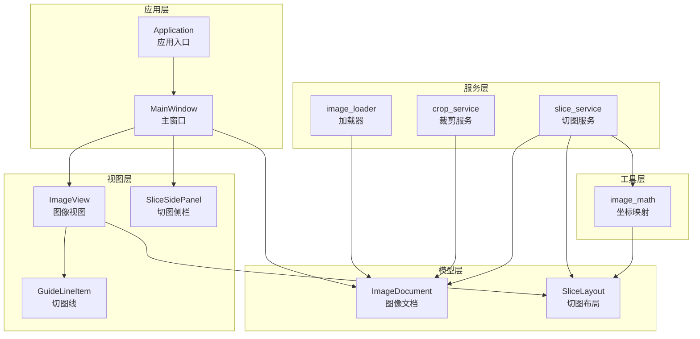
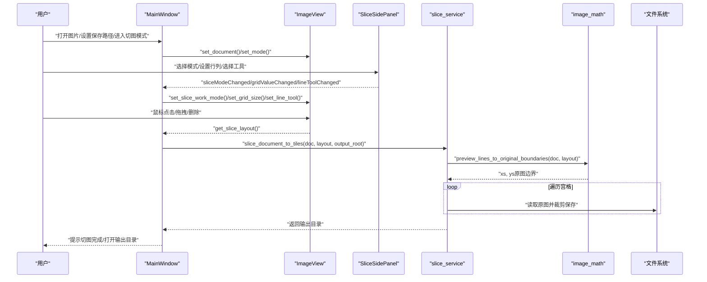
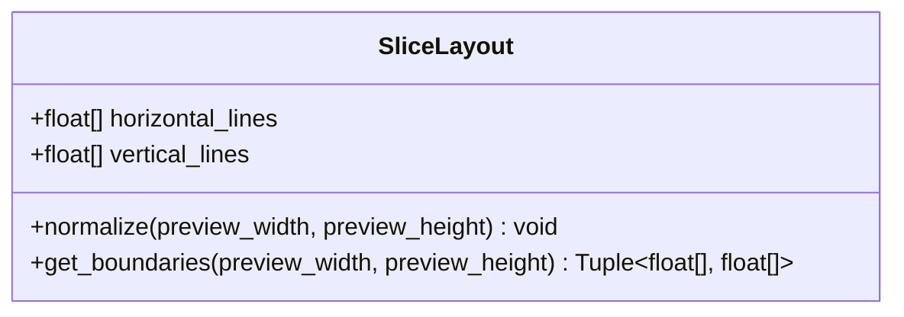
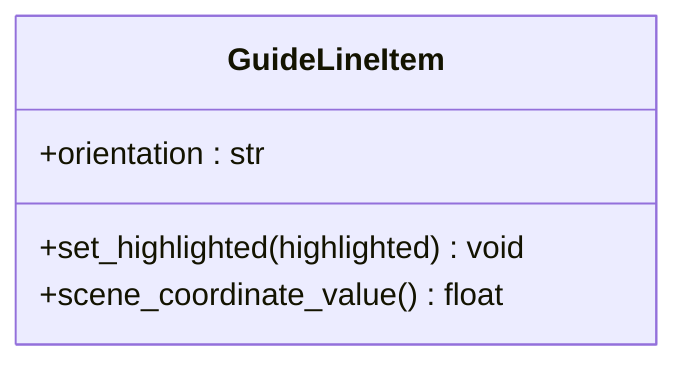
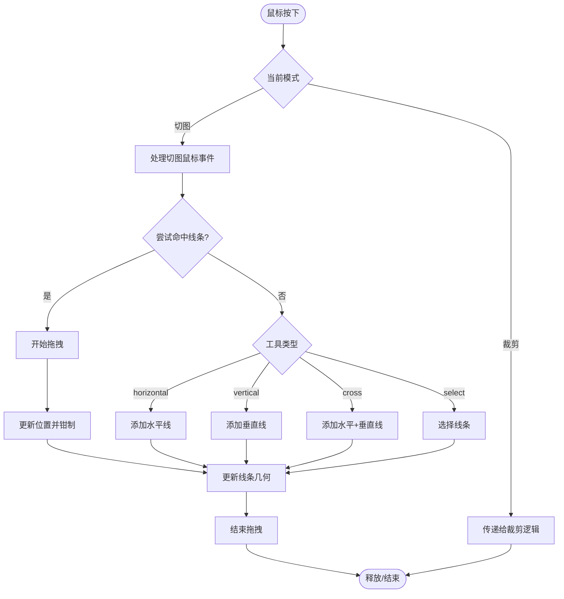
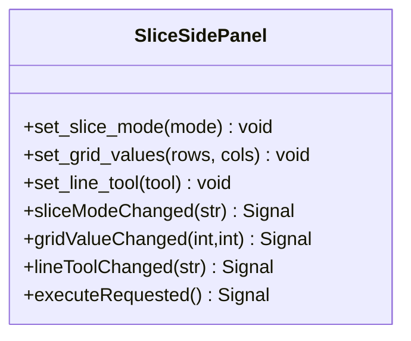
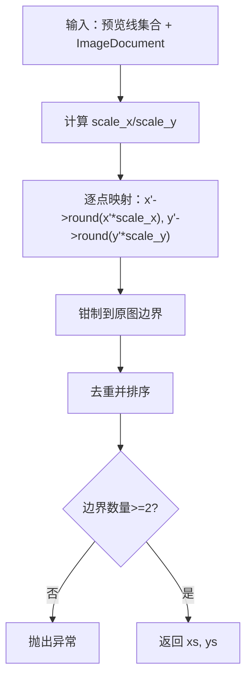
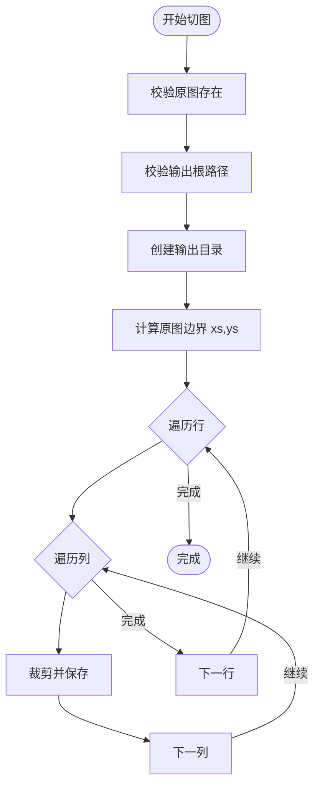
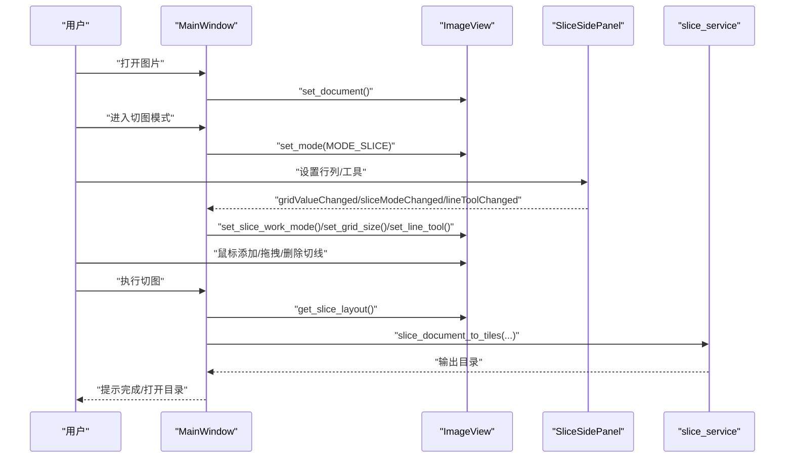
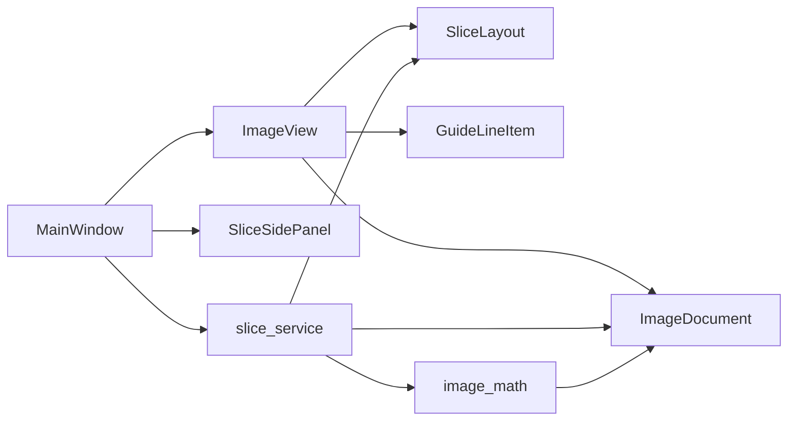

# 宫格切图功能

<cite>
**本文引用的文件**
- [main.py](file://img_slicer_tool/main.py)
- [application.py](file://img_slicer_tool/app/application.py)
- [main_window.py](file://img_slicer_tool/app/main_window.py)
- [image_view.py](file://img_slicer_tool/views/image_view.py)
- [overlay_items.py](file://img_slicer_tool/views/overlay_items.py)
- [slice_side_panel.py](file://img_slicer_tool/views/slice_side_panel.py)
- [image_document.py](file://img_slicer_tool/models/image_document.py)
- [slice_layout.py](file://img_slicer_tool/models/slice_layout.py)
- [image_math.py](file://img_slicer_tool/utils/image_math.py)
- [slice_service.py](file://img_slicer_tool/services/slice_service.py)
- [image_loader.py](file://img_slicer_tool/services/image_loader.py)
- [crop_service.py](file://img_slicer_tool/services/crop_service.py)
</cite>

## 目录
1. [简介](#简介)
2. [项目结构](#项目结构)
3. [核心组件](#核心组件)
4. [架构总览](#架构总览)
5. [详细组件分析](#详细组件分析)
6. [依赖关系分析](#依赖关系分析)
7. [性能考虑](#性能考虑)
8. [故障排查指南](#故障排查指南)
9. [结论](#结论)
10. [附录](#附录)

## 简介
本文件系统性讲解“宫格切图功能”的设计与实现，围绕以下目标展开：
- 解释 SliceLayout 如何管理预览坐标系下的水平线与垂直线，并进行归一化与边界扩展。
- 描述 GuideLineItem 的拖拽、添加与删除交互逻辑。
- 阐述 slice_service.slice_document_to_tiles 如何根据切线位置批量生成切片并保存至指定目录。
- 解释 image_math 在预览坐标到原图坐标的映射与边界计算中的作用。
- 结合 main_window.py 的功能入口，说明均匀宫格生成、自定义切线编辑与执行导出的完整工作流。
- 提供切片命名规则、输出格式配置、性能瓶颈分析及优化方向（如异步处理）的详细说明。

## 项目结构
该功能位于 img_slicer_tool 子项目中，采用分层组织：应用入口、模型、视图、服务与工具函数。核心模块职责如下：
- 应用入口与主窗口：负责菜单、动作、状态栏与事件路由。
- 视图层：图像预览、切图线绘制与交互、侧边栏控制。
- 模型层：图像文档信息与切图布局数据结构。
- 服务层：切图执行、图像加载、裁剪等业务逻辑。
- 工具层：坐标映射与几何计算。

图表来源
- [main.py](file://img_slicer_tool/main.py#L1-L13)
- [main_window.py](file://img_slicer_tool/app/main_window.py#L1-L120)
- [image_view.py](file://img_slicer_tool/views/image_view.py#L1-L120)
- [overlay_items.py](file://img_slicer_tool/views/overlay_items.py#L1-L64)
- [slice_side_panel.py](file://img_slicer_tool/views/slice_side_panel.py#L1-L80)
- [image_document.py](file://img_slicer_tool/models/image_document.py#L1-L18)
- [slice_layout.py](file://img_slicer_tool/models/slice_layout.py#L1-L30)
- [image_loader.py](file://img_slicer_tool/services/image_loader.py#L1-L68)
- [crop_service.py](file://img_slicer_tool/services/crop_service.py#L1-L38)
- [slice_service.py](file://img_slicer_tool/services/slice_service.py#L1-L62)
- [image_math.py](file://img_slicer_tool/utils/image_math.py#L1-L76)

章节来源
- [main.py](file://img_slicer_tool/main.py#L1-L13)
- [main_window.py](file://img_slicer_tool/app/main_window.py#L1-L120)

## 核心组件
- SliceLayout：保存预览坐标系下的切图线集合，提供去重、过滤与边界扩展能力。
- GuideLineItem：用于在场景中渲染与高亮切图线，支持水平/垂直两种方向。
- ImageView：承载图像与切图线，处理鼠标交互（添加、拖拽、删除、选择）、网格生成与布局收集。
- SliceSidePanel：提供切图模式切换、网格行列设置、工具选择与执行按钮。
- ImageDocument：封装原图尺寸、预览尺寸与缩放比例，以及预览位图。
- image_math：提供预览坐标到原图坐标的映射与边界计算。
- slice_service：执行切图，生成切片并保存到指定目录。
- image_loader：加载原图，生成预览图与缩放比例。
- crop_service：基于预览矩形执行裁剪并返回新的 ImageDocument。

章节来源
- [slice_layout.py](file://img_slicer_tool/models/slice_layout.py#L1-L30)
- [overlay_items.py](file://img_slicer_tool/views/overlay_items.py#L1-L64)
- [image_view.py](file://img_slicer_tool/views/image_view.py#L1-L120)
- [slice_side_panel.py](file://img_slicer_tool/views/slice_side_panel.py#L1-L80)
- [image_document.py](file://img_slicer_tool/models/image_document.py#L1-L18)
- [image_math.py](file://img_slicer_tool/utils/image_math.py#L1-L76)
- [slice_service.py](file://img_slicer_tool/services/slice_service.py#L1-L62)
- [image_loader.py](file://img_slicer_tool/services/image_loader.py#L1-L68)
- [crop_service.py](file://img_slicer_tool/services/crop_service.py#L1-L38)

## 架构总览
从用户操作到切图落盘的端到端流程如下：

图表来源
- [main_window.py](file://img_slicer_tool/app/main_window.py#L120-L260)
- [image_view.py](file://img_slicer_tool/views/image_view.py#L236-L305)
- [slice_service.py](file://img_slicer_tool/services/slice_service.py#L12-L62)
- [image_math.py](file://img_slicer_tool/utils/image_math.py#L50-L76)

## 详细组件分析

### SliceLayout：预览坐标系切线管理与归一化
- 数据结构：维护水平线与垂直线列表。
- 归一化策略：
  - 过滤无效值（超出预览范围或非正值）。
  - 去重并排序。
- 边界扩展：
  - 在预览坐标系下自动加入左上角与右下角边界，形成闭区间。
- 复杂度：归一化为 O(n log n)，边界扩展为 O(1)。

图表来源
- [slice_layout.py](file://img_slicer_tool/models/slice_layout.py#L1-L30)

章节来源
- [slice_layout.py](file://img_slicer_tool/models/slice_layout.py#L1-L30)

### GuideLineItem：切图线渲染与高亮
- 方向枚举：水平/垂直。
- 渲染样式：支持高亮与普通态的笔触差异。
- 场景坐标：通过场景变换获取中心坐标值，便于拖拽定位。
- 不可选中/不可拖动：避免与场景级选择冲突，统一由 ImageView 控制。

图表来源
- [overlay_items.py](file://img_slicer_tool/views/overlay_items.py#L1-L64)

章节来源
- [overlay_items.py](file://img_slicer_tool/views/overlay_items.py#L1-L64)

### ImageView：切图线的添加、拖拽、删除与布局收集
- 添加切线：
  - 手动模式下，根据工具类型（横/竖/十字）生成对应线条。
  - 将线条位置钳制在预览矩形内。
- 拖拽切线：
  - 通过查找附近线条命中，开始拖拽后更新位置并钳制。
- 删除切线：
  - 支持 Delete 键删除选中线条。
- 选择与高亮：
  - 通过距离阈值选择最近线条，更新高亮状态。
- 网格生成：
  - 根据行/列数等分生成水平与垂直线条。
- 布局收集：
  - 将当前切线收集为 SliceLayout，并调用归一化。

图表来源
- [image_view.py](file://img_slicer_tool/views/image_view.py#L154-L235)
- [image_view.py](file://img_slicer_tool/views/image_view.py#L319-L383)
- [image_view.py](file://img_slicer_tool/views/image_view.py#L384-L418)
- [image_view.py](file://img_slicer_tool/views/image_view.py#L441-L466)
- [image_view.py](file://img_slicer_tool/views/image_view.py#L467-L487)
- [image_view.py](file://img_slicer_tool/views/image_view.py#L488-L508)

章节来源
- [image_view.py](file://img_slicer_tool/views/image_view.py#L154-L235)
- [image_view.py](file://img_slicer_tool/views/image_view.py#L319-L383)
- [image_view.py](file://img_slicer_tool/views/image_view.py#L384-L418)
- [image_view.py](file://img_slicer_tool/views/image_view.py#L441-L466)
- [image_view.py](file://img_slicer_tool/views/image_view.py#L467-L487)
- [image_view.py](file://img_slicer_tool/views/image_view.py#L488-L508)

### SliceSidePanel：切图模式与工具控制
- 切图方式：网格生成与手动生成互斥切换。
- 网格参数：行列数值变化触发 ImageView 更新网格。
- 工具选择：横线/竖线/十字线/选择工具。
- 执行按钮：触发切图执行信号。

图表来源
- [slice_side_panel.py](file://img_slicer_tool/views/slice_side_panel.py#L1-L174)

章节来源
- [slice_side_panel.py](file://img_slicer_tool/views/slice_side_panel.py#L1-L174)

### image_math：预览坐标到原图坐标的映射与边界计算
- 预览矩形到原图 box 的映射：乘以 scale_x/scale_y 并四舍五入，再钳制到原图边界。
- 预览线集合到原图边界：
  - 将预览线集合转换为原图坐标，去重并排序。
  - 校验至少存在两条边界线，否则抛出异常。

图表来源
- [image_math.py](file://img_slicer_tool/utils/image_math.py#L17-L48)
- [image_math.py](file://img_slicer_tool/utils/image_math.py#L50-L76)

章节来源
- [image_math.py](file://img_slicer_tool/utils/image_math.py#L1-L76)

### slice_service：批量切片与保存
- 输入校验：原图存在性与输出根路径有效性。
- 输出目录：以原图名为子目录，若未指定则使用原图所在目录。
- 切片命名：原图名_r{row}_c{col}.ext，行列从 1 开始编号。
- 输出格式：若为 JPEG/JPG，设置质量与子采样参数。
- 性能：逐宫格裁剪并保存，复杂度 O(R*C)。

图表来源
- [slice_service.py](file://img_slicer_tool/services/slice_service.py#L12-L62)

章节来源
- [slice_service.py](file://img_slicer_tool/services/slice_service.py#L1-L62)

### 主窗口工作流：均匀宫格生成、自定义切线编辑与执行导出
- 打开图片：加载原图与预览图，记录缩放比例。
- 切图模式：切换到切图模式，显示侧边栏。
- 均匀宫格：输入行/列，生成网格线。
- 自定义切线：选择工具（横/竖/十字/选择），鼠标点击添加，拖拽调整，Delete 删除。
- 执行导出：收集布局，计算切片数量，确认无切线时的提示，调用切图服务，展示结果并打开输出目录。

图表来源
- [main_window.py](file://img_slicer_tool/app/main_window.py#L120-L260)
- [image_view.py](file://img_slicer_tool/views/image_view.py#L236-L305)
- [slice_service.py](file://img_slicer_tool/services/slice_service.py#L12-L62)

章节来源
- [main_window.py](file://img_slicer_tool/app/main_window.py#L120-L260)
- [image_view.py](file://img_slicer_tool/views/image_view.py#L236-L305)

## 依赖关系分析
- 组件耦合：
  - MainWindow 依赖 ImageView、SliceSidePanel、slice_service。
  - ImageView 依赖 SliceLayout、GuideLineItem、ImageDocument。
  - slice_service 依赖 ImageDocument、SliceLayout、image_math。
  - image_math 依赖 ImageDocument、SliceLayout。
  - image_loader 与 crop_service 为独立服务，分别负责加载与裁剪。
- 关键依赖链：
  - 切图执行链：MainWindow -> ImageView.get_slice_layout() -> slice_service -> image_math -> 文件系统。
  - 预览到原图映射链：image_math -> PIL.Image -> 文件系统。

图表来源
- [main_window.py](file://img_slicer_tool/app/main_window.py#L1-L120)
- [image_view.py](file://img_slicer_tool/views/image_view.py#L1-L120)
- [slice_service.py](file://img_slicer_tool/services/slice_service.py#L1-L30)
- [image_math.py](file://img_slicer_tool/utils/image_math.py#L1-L30)

章节来源
- [main_window.py](file://img_slicer_tool/app/main_window.py#L1-L120)
- [image_view.py](file://img_slicer_tool/views/image_view.py#L1-L120)
- [slice_service.py](file://img_slicer_tool/services/slice_service.py#L1-L30)
- [image_math.py](file://img_slicer_tool/utils/image_math.py#L1-L30)

## 性能考虑
- 时间复杂度：
  - 切图主循环为 O(R*C)，R/C 分别为行/列数，通常较小，但在大图上仍需注意。
- 内存与IO：
  - 原图一次性加载并裁剪，内存峰值与原图大小相关。
  - 保存时针对 JPEG/JPG 设置质量与子采样参数，平衡体积与质量。
- 优化建议（异步处理）：
  - 使用后台线程执行切图，主线程保持响应。
  - 进度回调与取消机制，避免长时间阻塞。
  - 对于超大图，可考虑分块处理或外部库（如 pyvips）替代 PIL，减少内存峰值。
- I/O 优化：
  - 批量写入前先创建输出目录，避免重复 IO。
  - 合理设置 Pillow 保存参数，减少磁盘写入时间。

[本节为通用性能讨论，不直接分析具体文件]

## 故障排查指南
- 常见问题与处理：
  - 切图线不足：当预览坐标系下边界不足时，image_math 会抛出异常，需确保至少两条边界线。
  - 输出路径为空：slice_service 会拒绝空路径，需先设置切图保存根路径。
  - 原图不存在：slice_service 会抛出文件不存在异常，检查路径。
  - 导出整张图：若无切线，会提示仅导出整张图，确认后再继续。
- 用户交互提示：
  - 切图完成会弹窗显示切片数量与输出目录，可一键打开文件夹。
  - 切图失败会弹窗提示错误信息。

章节来源
- [slice_service.py](file://img_slicer_tool/services/slice_service.py#L12-L62)
- [image_math.py](file://img_slicer_tool/utils/image_math.py#L50-L76)
- [main_window.py](file://img_slicer_tool/app/main_window.py#L230-L262)

## 结论
本功能通过清晰的分层设计与职责分离，实现了从用户交互到切图落盘的完整闭环。SliceLayout 负责预览坐标系的归一化与边界扩展，GuideLineItem 提供直观的渲染与交互，ImageView 统一管理切线生命周期，slice_service 以稳定的命名规则与输出格式保障结果一致性。配合 image_math 的坐标映射，系统在大图场景下也能稳定运行。未来可在异步处理与外部高性能库方面进一步优化。

[本节为总结性内容，不直接分析具体文件]

## 附录

### 切片命名规则与输出格式
- 命名规则：原图名_r{row}_c{col}.ext，行列从 1 开始编号。
- 输出目录：以原图名为子目录，位于用户指定的根路径下。
- 输出格式：若扩展名为 .jpg/.jpeg，保存时设置质量与子采样参数；其他格式默认保存。

章节来源
- [slice_service.py](file://img_slicer_tool/services/slice_service.py#L27-L61)

### 异步处理与性能优化建议
- 异步执行：将切图主循环放入后台线程，主线程仅负责 UI 更新与进度反馈。
- 取消与中断：提供取消按钮，中断后清理临时文件。
- 大图优化：考虑使用 pyvips 等库进行零拷贝与分块处理，降低内存峰值。
- I/O 吞吐：合并写入批次，减少磁盘写入次数。

[本节为通用优化建议，不直接分析具体文件]