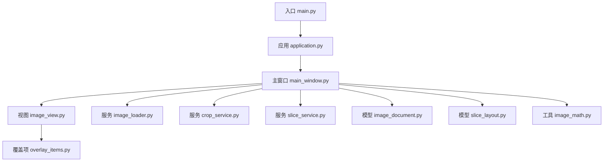
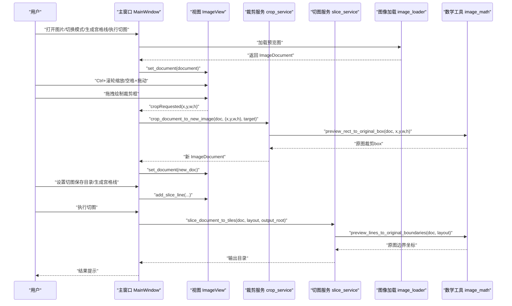
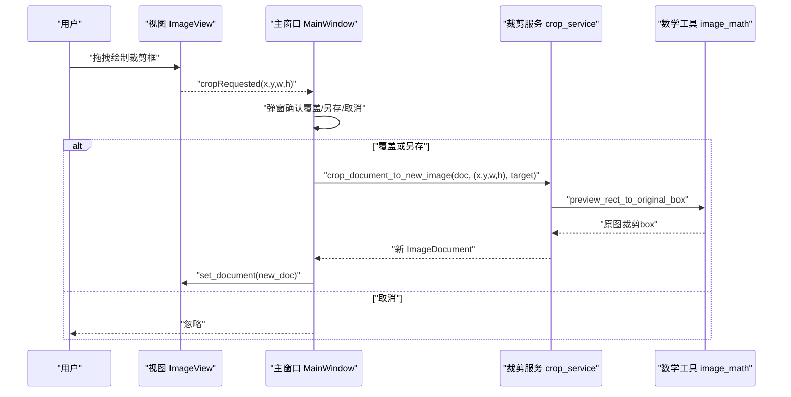
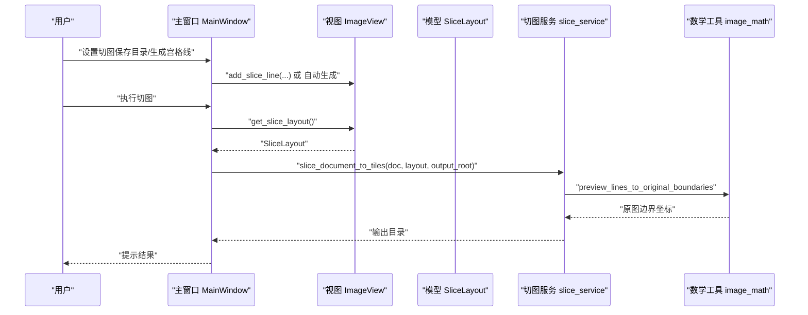
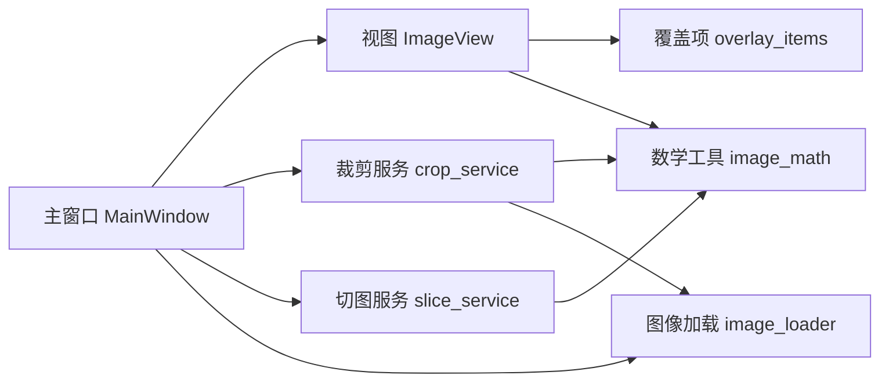

# 核心功能详解

<cite>
**本文引用的文件**
- [main.py](file://img_slicer_tool/main.py)
- [application.py](file://img_slicer_tool/app/application.py)
- [main_window.py](file://img_slicer_tool/app/main_window.py)
- [image_loader.py](file://img_slicer_tool/services/image_loader.py)
- [image_document.py](file://img_slicer_tool/models/image_document.py)
- [image_view.py](file://img_slicer_tool/views/image_view.py)
- [overlay_items.py](file://img_slicer_tool/views/overlay_items.py)
- [crop_service.py](file://img_slicer_tool/services/crop_service.py)
- [slice_service.py](file://img_slicer_tool/services/slice_service.py)
- [slice_layout.py](file://img_slicer_tool/models/slice_layout.py)
- [image_math.py](file://img_slicer_tool/utils/image_math.py)
- [README.md](file://img_slicer_tool/README.md)
</cite>

## 目录
1. [引言](#引言)
2. [项目结构](#项目结构)
3. [核心组件](#核心组件)
4. [架构总览](#架构总览)
5. [详细功能分析](#详细功能分析)
6. [依赖关系分析](#依赖关系分析)
7. [性能考量](#性能考量)
8. [故障排查指南](#故障排查指南)
9. [结论](#结论)

## 引言
本文件围绕 PictureMaster 的核心图像处理能力进行系统化解读，重点覆盖以下四大功能：
- 图像加载与预览：通过 image_loader 生成适配显示的预览图，并在 ImageView 中以 QGraphicsView 场景展示。
- 交互式浏览：在 ImageView 中实现 Ctrl+滚轮缩放与空格+拖动平移，提升大图浏览体验。
- 区域裁剪：通过 CropRectItem 绘制裁剪框，利用 crop_service 将预览坐标映射到原图坐标并执行裁剪。
- 宫格切图：通过 SliceLayout 定义切线位置，借助 slice_service 批量导出切片。

文档同时解释信号槽机制（如 cropRequested）如何将用户操作与后台服务解耦，以及各功能在实际工作流中的应用场景。

## 项目结构
项目采用“模型-视图-服务-工具”分层组织，入口程序负责启动应用，主窗口协调用户交互与业务流程，视图层负责渲染与交互，服务层封装图像处理逻辑，工具层提供坐标换算等数学辅助。

图表来源
- [main.py](file://img_slicer_tool/main.py#L1-L13)
- [application.py](file://img_slicer_tool/app/application.py#L1-L35)
- [main_window.py](file://img_slicer_tool/app/main_window.py#L1-L262)
- [image_view.py](file://img_slicer_tool/views/image_view.py#L1-L218)
- [overlay_items.py](file://img_slicer_tool/views/overlay_items.py#L1-L57)
- [image_loader.py](file://img_slicer_tool/services/image_loader.py#L1-L68)
- [crop_service.py](file://img_slicer_tool/services/crop_service.py#L1-L38)
- [slice_service.py](file://img_slicer_tool/services/slice_service.py#L1-L62)
- [image_document.py](file://img_slicer_tool/models/image_document.py#L1-L18)
- [slice_layout.py](file://img_slicer_tool/models/slice_layout.py#L1-L30)
- [image_math.py](file://img_slicer_tool/utils/image_math.py#L1-L76)

章节来源
- [main.py](file://img_slicer_tool/main.py#L1-L13)
- [application.py](file://img_slicer_tool/app/application.py#L1-L35)
- [README.md](file://img_slicer_tool/README.md#L1-L10)

## 核心组件
- 应用入口与启动：main.py 创建 ImageApp 并运行事件循环。
- 应用配置：application.py 设置应用名、图标与样式表。
- 主窗口：main_window.py 提供菜单、快捷键与信号连接，协调图像加载、裁剪与切图流程。
- 视图层：image_view.py 基于 QGraphicsView 实现预览图展示、交互缩放与裁剪框绘制；overlay_items.py 提供裁剪矩形与切图线的图形元素。
- 数据模型：image_document.py 描述图像文档元数据；slice_layout.py 表达预览坐标系下的切线布局。
- 服务层：image_loader.py 负责加载与生成预览；crop_service.py 执行裁剪；slice_service.py 执行宫格切图。
- 数学工具：image_math.py 提供预览坐标到原图坐标的映射。

章节来源
- [main.py](file://img_slicer_tool/main.py#L1-L13)
- [application.py](file://img_slicer_tool/app/application.py#L1-L35)
- [main_window.py](file://img_slicer_tool/app/main_window.py#L1-L262)
- [image_view.py](file://img_slicer_tool/views/image_view.py#L1-L218)
- [overlay_items.py](file://img_slicer_tool/views/overlay_items.py#L1-L57)
- [image_loader.py](file://img_slicer_tool/services/image_loader.py#L1-L68)
- [image_document.py](file://img_slicer_tool/models/image_document.py#L1-L18)
- [slice_layout.py](file://img_slicer_tool/models/slice_layout.py#L1-L30)
- [crop_service.py](file://img_slicer_tool/services/crop_service.py#L1-L38)
- [slice_service.py](file://img_slicer_tool/services/slice_service.py#L1-L62)
- [image_math.py](file://img_slicer_tool/utils/image_math.py#L1-L76)

## 架构总览
下图展示了从用户操作到后台服务的调用链路，突出 MainWindow 如何通过信号槽将用户意图传递给服务层。

图表来源
- [main_window.py](file://img_slicer_tool/app/main_window.py#L67-L167)
- [image_view.py](file://img_slicer_tool/views/image_view.py#L18-L175)
- [crop_service.py](file://img_slicer_tool/services/crop_service.py#L13-L38)
- [slice_service.py](file://img_slicer_tool/services/slice_service.py#L12-L62)
- [image_loader.py](file://img_slicer_tool/services/image_loader.py#L24-L55)
- [image_math.py](file://img_slicer_tool/utils/image_math.py#L17-L76)

## 详细功能分析

### 功能一：图像加载与预览
- 实现机制
  - image_loader 在加载原图后，计算最大预览尺寸阈值，按比例生成预览图，并将其转换为 QImage/QPixmap，随后构造 ImageDocument 返回。该文档包含原始尺寸、预览尺寸与缩放因子，用于后续坐标映射。
  - MainWindow 调用 load_image_document 加载图片，再将返回的 ImageDocument 传入 ImageView.set_document，后者清空场景、重置变换并将预览图作为场景元素居中显示。
- 关键点
  - 预览尺寸上限与缩放因子确保大图也能流畅预览。
  - 预览图与原图尺寸比值用于将预览坐标映射到原图坐标。
- 使用流程示例
  1) 用户选择图片文件。
  2) MainWindow 调用 image_loader 生成 ImageDocument。
  3) MainWindow 将文档交给 ImageView 渲染。
- 应用场景
  - 大图浏览与快速定位目标区域，避免直接加载原图导致内存压力。

章节来源
- [image_loader.py](file://img_slicer_tool/services/image_loader.py#L14-L68)
- [image_document.py](file://img_slicer_tool/models/image_document.py#L8-L18)
- [main_window.py](file://img_slicer_tool/app/main_window.py#L76-L109)
- [image_view.py](file://img_slicer_tool/views/image_view.py#L43-L58)

### 功能二：交互式浏览（缩放与平移）
- 实现机制
  - ImageView 重写滚轮事件：当按下 Ctrl 时，根据滚轮方向按比例放大/缩小，并更新当前缩放系数；否则交由父类处理。
  - 键盘事件：空格键按下时启用 ScrollHandDrag 模式，松开则恢复 NoDrag，实现平移。
  - fitInView 将预览图适配到视口，初始缩放为 1.0。
- 使用流程示例
  - Ctrl+滚轮：在不改变视图锚点的情况下进行缩放。
  - 空格键+鼠标拖动：平移视图以查看不同区域。
- 应用场景
  - 高分辨率图片的局部精修与整体概览。

章节来源
- [image_view.py](file://img_slicer_tool/views/image_view.py#L59-L81)
- [image_view.py](file://img_slicer_tool/views/image_view.py#L56-L58)

### 功能三：区域裁剪
- 实现机制
  - ImageView 在裁剪模式下允许用户在预览图上拖拽绘制矩形，释放鼠标时若满足最小尺寸要求，发出 cropRequested 信号，携带预览坐标 (x, y, w, h)。
  - MainWindow 接收信号后弹出确认对话框，询问覆盖原图或另存为，随后调用 crop_service 执行裁剪。
  - crop_service 内部通过 image_math 的 preview_rect_to_original_box 将预览坐标映射到原图像素坐标，读取原图并裁剪，保存到目标路径，再重新加载生成新的 ImageDocument。
- 信号槽机制
  - cropRequested 是自定义信号，由 ImageView 发出；MainWindow 在 _connect_signals 中连接到 _on_crop_requested，形成解耦的事件驱动。
- 使用流程示例
  1) 在 ImageView 上拖拽绘制裁剪框。
  2) 释放鼠标触发 cropRequested。
  3) MainWindow 弹窗确认并调用 crop_service。
  4) 成功后刷新视图并更新状态栏。
- 应用场景
  - 快速截取感兴趣区域，支持覆盖原图或导出新文件。

图表来源
- [image_view.py](file://img_slicer_tool/views/image_view.py#L105-L171)
- [main_window.py](file://img_slicer_tool/app/main_window.py#L110-L167)
- [crop_service.py](file://img_slicer_tool/services/crop_service.py#L13-L38)
- [image_math.py](file://img_slicer_tool/utils/image_math.py#L17-L48)

章节来源
- [image_view.py](file://img_slicer_tool/views/image_view.py#L105-L171)
- [main_window.py](file://img_slicer_tool/app/main_window.py#L110-L167)
- [crop_service.py](file://img_slicer_tool/services/crop_service.py#L13-L38)
- [image_math.py](file://img_slicer_tool/utils/image_math.py#L17-L48)

### 功能四：宫格切图
- 实现机制
  - 切图模式下，用户可在 ImageView 上点击生成水平/垂直切线，或通过“按行列生成宫格线”菜单项一键生成网格线。这些线以 GuideLineItem 形式加入场景。
  - ImageView 将场景中的 GuideLineItem 收集为 SliceLayout（仅保留预览坐标系内的有效线段），并提供 normalize 与 get_boundaries 方法生成含边界的坐标序列。
  - slice_service 接收 ImageDocument 与 SliceLayout，调用 image_math 的 preview_lines_to_original_boundaries 将预览线映射到原图边界，遍历相邻边界围成的矩形区域进行裁剪并批量导出。
- 使用流程示例
  1) 切图模式下点击生成切线，或使用“按行列生成宫格线”。
  2) 确认切图保存目录。
  3) 执行切图，等待批量导出完成。
- 应用场景
  - 网页背景、UI 精灵图、瓦片地图等需要按固定规则拆分的场景。

图表来源
- [main_window.py](file://img_slicer_tool/app/main_window.py#L168-L262)
- [image_view.py](file://img_slicer_tool/views/image_view.py#L176-L218)
- [slice_layout.py](file://img_slicer_tool/models/slice_layout.py#L7-L30)
- [slice_service.py](file://img_slicer_tool/services/slice_service.py#L12-L62)
- [image_math.py](file://img_slicer_tool/utils/image_math.py#L50-L76)

章节来源
- [main_window.py](file://img_slicer_tool/app/main_window.py#L168-L262)
- [image_view.py](file://img_slicer_tool/views/image_view.py#L176-L218)
- [slice_layout.py](file://img_slicer_tool/models/slice_layout.py#L7-L30)
- [slice_service.py](file://img_slicer_tool/services/slice_service.py#L12-L62)
- [image_math.py](file://img_slicer_tool/utils/image_math.py#L50-L76)

## 依赖关系分析
- 组件耦合与内聚
  - MainWindow 对视图、服务与模型有直接依赖，但通过信号槽与方法调用保持行为解耦。
  - ImageView 仅依赖模型与视图覆盖项，不直接访问服务层，职责清晰。
  - 服务层依赖模型与工具层，避免重复计算，提高复用性。
- 关键依赖链
  - MainWindow -> ImageView（信号槽）、crop_service、slice_service、image_loader
  - ImageView -> OverlayItems（图形元素）、image_math（坐标映射）
  - crop_service/slice_service -> image_math（坐标映射）、image_loader（重新加载）

图表来源
- [main_window.py](file://img_slicer_tool/app/main_window.py#L67-L167)
- [image_view.py](file://img_slicer_tool/views/image_view.py#L18-L175)
- [overlay_items.py](file://img_slicer_tool/views/overlay_items.py#L1-L57)
- [image_math.py](file://img_slicer_tool/utils/image_math.py#L1-L76)
- [crop_service.py](file://img_slicer_tool/services/crop_service.py#L1-L38)
- [slice_service.py](file://img_slicer_tool/services/slice_service.py#L1-L62)
- [image_loader.py](file://img_slicer_tool/services/image_loader.py#L1-L68)

章节来源
- [main_window.py](file://img_slicer_tool/app/main_window.py#L67-L167)
- [image_view.py](file://img_slicer_tool/views/image_view.py#L18-L175)
- [overlay_items.py](file://img_slicer_tool/views/overlay_items.py#L1-L57)
- [image_math.py](file://img_slicer_tool/utils/image_math.py#L1-L76)
- [crop_service.py](file://img_slicer_tool/services/crop_service.py#L1-L38)
- [slice_service.py](file://img_slicer_tool/services/slice_service.py#L1-L62)
- [image_loader.py](file://img_slicer_tool/services/image_loader.py#L1-L68)

## 性能考量
- 预览图策略
  - image_loader 限制预览最大尺寸，避免超大图占用过多内存与带宽，保证交互流畅。
- 缩放与平移
  - QGraphicsView 的 SmartViewportUpdate 与合理的锚点设置有助于减少重绘成本。
- 裁剪与切图
  - 裁剪与切图均基于原图文件，尽量避免重复解码；批量导出时注意磁盘写入性能，建议选择合适的输出目录与格式参数（如 JPEG 的质量与子采样）。
- 坐标映射
  - image_math 的映射计算为纯数值运算，复杂度低；注意边界裁剪与最小尺寸校验，避免无效区域导致的异常。

## 故障排查指南
- 图片加载失败
  - 现象：打开图片时报错或无响应。
  - 排查：确认文件存在且格式受支持；检查 image_loader 是否抛出异常；查看 MainWindow 的错误提示。
- 裁剪无效
  - 现象：释放鼠标后未触发裁剪。
  - 排查：确认裁剪框尺寸大于最小阈值；检查 cropRequested 是否被正确发出；确认 MainWindow 的 _on_crop_requested 已连接。
- 切图无输出
  - 现象：执行切图后无文件生成。
  - 排查：确认已设置切图保存目录；检查 SliceLayout 是否包含有效切线；查看 slice_service 的输出目录是否创建成功。
- 坐标映射异常
  - 现象：裁剪或切图位置偏移。
  - 排查：核对 ImageDocument 的 scale_x/scale_y 是否正确；检查 image_math 的映射函数是否被调用；确认预览图与原图尺寸一致。

章节来源
- [image_loader.py](file://img_slicer_tool/services/image_loader.py#L24-L55)
- [main_window.py](file://img_slicer_tool/app/main_window.py#L93-L109)
- [image_view.py](file://img_slicer_tool/views/image_view.py#L161-L171)
- [crop_service.py](file://img_slicer_tool/services/crop_service.py#L13-L38)
- [slice_service.py](file://img_slicer_tool/services/slice_service.py#L12-L62)
- [image_math.py](file://img_slicer_tool/utils/image_math.py#L17-L76)

## 结论
PictureMaster 通过清晰的分层设计与信号槽机制，实现了从图像加载、交互浏览到裁剪与宫格切图的完整工作流。image_loader 与 ImageView 提供了高效的预览与交互体验，crop_service 与 slice_service 则以稳定的数学映射保障裁剪与切图的准确性。该架构便于扩展更多图像处理能力，适合在资源有限的环境中进行大图处理与批量导出。