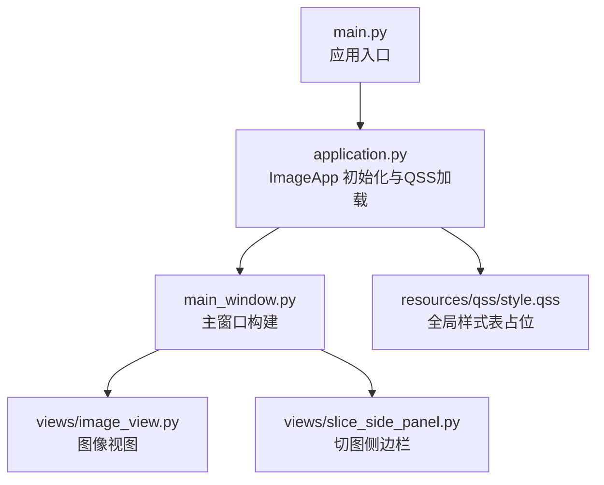
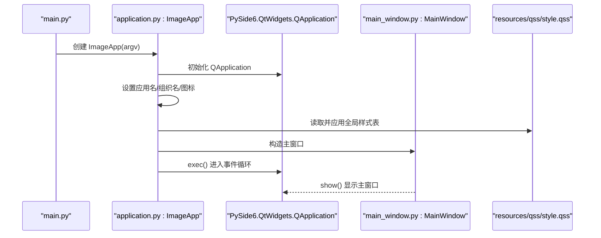
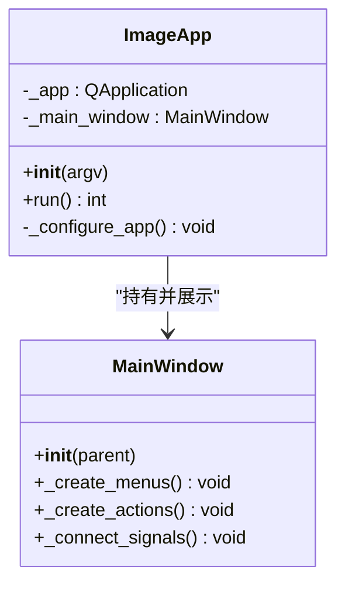
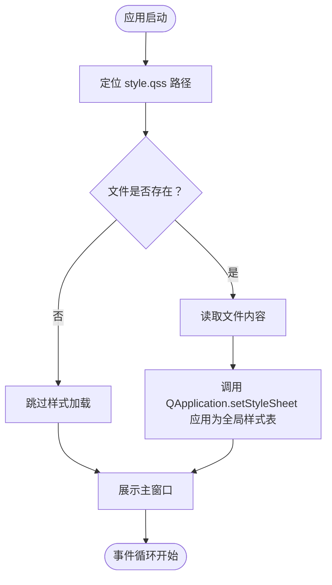
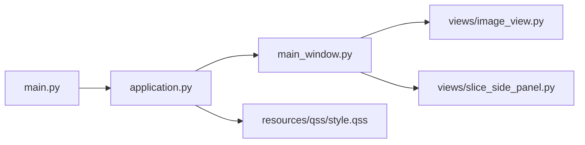

# UI样式管理

<cite>
**本文引用的文件**
- [main.py](file://img_slicer_tool/main.py)
- [application.py](file://img_slicer_tool/app/application.py)
- [main_window.py](file://img_slicer_tool/app/main_window.py)
- [style.qss](file://img_slicer_tool/resources/qss/style.qss)
- [image_view.py](file://img_slicer_tool/views/image_view.py)
- [slice_side_panel.py](file://img_slicer_tool/views/slice_side_panel.py)
</cite>

## 目录
1. [简介](#简介)
2. [项目结构](#项目结构)
3. [核心组件](#核心组件)
4. [架构总览](#架构总览)
5. [详细组件分析](#详细组件分析)
6. [依赖关系分析](#依赖关系分析)
7. [性能考量](#性能考量)
8. [故障排查指南](#故障排查指南)
9. [结论](#结论)
10. [附录](#附录)

## 简介
本文件系统性地文档化 PictureMaster 的 UI 样式管理机制，聚焦于基于 Qt 的 QSS（Qt Style Sheets）技术。当前仓库在 resources/qss/style.qss 中预留了全局样式表入口，尽管文件内容为空，但其设计意图是通过类 CSS 语法统一定义按钮、菜单、对话框等控件外观，从而实现应用主题化与样式与逻辑分离，便于 UI 的维护与迭代。

## 项目结构
- 应用启动入口位于 img_slicer_tool/main.py，负责创建应用实例并运行事件循环。
- 应用主体由 img_slicer_tool/app/application.py 中的 ImageApp 负责初始化 QApplication、设置图标、加载 QSS 全局样式表，并展示主窗口。
- 主窗口由 img_slicer_tool/app/main_window.py 实现，包含菜单栏、工具栏、状态栏及图像视图等 UI 组件。
- 样式资源位于 img_slicer_tool/resources/qss/style.qss，当前为空，用于承载未来样式定义。
- 视图层包括图像显示与切图侧边栏，分别在 img_slicer_tool/views/image_view.py 与 img_slicer_tool/views/slice_side_panel.py 中实现，其中侧边栏通过对象名（objectName）为 QSS 提供可选配点。

图表来源
- [main.py](file://img_slicer_tool/main.py#L1-L13)
- [application.py](file://img_slicer_tool/app/application.py#L1-L35)
- [main_window.py](file://img_slicer_tool/app/main_window.py#L1-L364)
- [style.qss](file://img_slicer_tool/resources/qss/style.qss#L1-L2)
- [image_view.py](file://img_slicer_tool/views/image_view.py#L1-L542)
- [slice_side_panel.py](file://img_slicer_tool/views/slice_side_panel.py#L1-L174)

章节来源
- [main.py](file://img_slicer_tool/main.py#L1-L13)
- [application.py](file://img_slicer_tool/app/application.py#L1-L35)
- [main_window.py](file://img_slicer_tool/app/main_window.py#L1-L364)
- [style.qss](file://img_slicer_tool/resources/qss/style.qss#L1-L2)
- [image_view.py](file://img_slicer_tool/views/image_view.py#L1-L542)
- [slice_side_panel.py](file://img_slicer_tool/views/slice_side_panel.py#L1-L174)

## 核心组件
- ImageApp：负责创建 QApplication、设置应用信息与图标、定位并加载 style.qss 为全局样式表，最后展示主窗口并进入事件循环。
- 主窗口 MainWindow：构建菜单栏、工具栏、状态栏与中央布局，组合图像视图与切图侧边栏。
- 视图组件：
  - ImageView：图像显示与交互（缩放、拖拽、裁剪、切图线绘制），为 QSS 提供可选配点。
  - SliceSidePanel：切图侧边栏，包含模式切换、网格行列设置、手动工具按钮组等，部分控件具备对象名以便 QSS 定位。

章节来源
- [application.py](file://img_slicer_tool/app/application.py#L1-L35)
- [main_window.py](file://img_slicer_tool/app/main_window.py#L1-L364)
- [image_view.py](file://img_slicer_tool/views/image_view.py#L1-L542)
- [slice_side_panel.py](file://img_slicer_tool/views/slice_side_panel.py#L1-L174)

## 架构总览
下图展示了从应用入口到主窗口展示的调用链，以及 QSS 加载的关键节点。

图表来源
- [main.py](file://img_slicer_tool/main.py#L1-L13)
- [application.py](file://img_slicer_tool/app/application.py#L1-L35)
- [main_window.py](file://img_slicer_tool/app/main_window.py#L1-L364)
- [style.qss](file://img_slicer_tool/resources/qss/style.qss#L1-L2)

## 详细组件分析

### ImageApp 类与 QSS 加载流程
- 初始化阶段：创建 QApplication，设置应用名称与组织名，尝试加载应用图标。
- 样式加载：定位 resources/qss/style.qss 文件，若存在则读取其内容并通过 QApplication.setStyleSheet 应用为全局样式表。
- 运行阶段：构造主窗口并调用 exec() 进入事件循环。

图表来源
- [application.py](file://img_slicer_tool/app/application.py#L1-L35)
- [main_window.py](file://img_slicer_tool/app/main_window.py#L1-L364)

章节来源
- [application.py](file://img_slicer_tool/app/application.py#L1-L35)

### 主窗口 MainWindow 的菜单与布局
- 菜单栏：包含“文件”“编辑”“切图”三个菜单项，提供打开图片、退出、切图模式切换、生成网格线、执行切图、设置切图保存路径等功能。
- 中央布局：左侧为切图侧边栏，右侧为图像视图，整体采用无边距与零间距的横向布局。
- 状态栏与操作反馈：在关键操作完成后向状态栏显示提示信息。

章节来源
- [main_window.py](file://img_slicer_tool/app/main_window.py#L1-L364)

### 切图侧边栏 SliceSidePanel 的对象名与可配点
- 侧边栏通过对象名（objectName）为 QSS 提供可选配点，例如：
  - 工具栏容器：sliceSidePanel
  - 执行按钮：executeSliceButton
- 这些对象名使得 QSS 可以针对具体控件进行样式定制，提升主题化灵活性。

章节来源
- [slice_side_panel.py](file://img_slicer_tool/views/slice_side_panel.py#L1-L174)

### ImageView 的交互与可配点
- ImageView 作为图像视图组件，负责图像显示、缩放、拖拽、裁剪与切图线绘制。
- 该组件未直接设置对象名，但可通过父级容器或通用样式规则进行统一美化；同时其内部绘制的切图线与高亮状态也可通过 QSS 的伪状态（如 hover、checked 等）进行视觉增强。

章节来源
- [image_view.py](file://img_slicer_tool/views/image_view.py#L1-L542)

### QSS 文件与样式应用流程
- style.qss 当前为空，但其路径与加载逻辑已在 application.py 中明确：定位到 resources/qss/style.qss 并通过 QApplication.setStyleSheet 应用为全局样式表。
- 由于 QSS 是全局生效的，因此可在该文件中统一定义按钮、菜单、对话框等控件的外观，实现主题化与一致性。

图表来源
- [application.py](file://img_slicer_tool/app/application.py#L1-L35)
- [style.qss](file://img_slicer_tool/resources/qss/style.qss#L1-L2)

## 依赖关系分析
- 启动依赖：main.py 依赖 application.py；application.py 依赖 main_window.py 与 style.qss。
- UI 组件依赖：main_window.py 依赖 views 下的图像视图与切图侧边栏。
- 样式依赖：application.py 依赖 style.qss 的存在与可读性；style.qss 本身为空，留待后续扩展。

图表来源
- [main.py](file://img_slicer_tool/main.py#L1-L13)
- [application.py](file://img_slicer_tool/app/application.py#L1-L35)
- [main_window.py](file://img_slicer_tool/app/main_window.py#L1-L364)
- [style.qss](file://img_slicer_tool/resources/qss/style.qss#L1-L2)
- [image_view.py](file://img_slicer_tool/views/image_view.py#L1-L542)
- [slice_side_panel.py](file://img_slicer_tool/views/slice_side_panel.py#L1-L174)

章节来源
- [main.py](file://img_slicer_tool/main.py#L1-L13)
- [application.py](file://img_slicer_tool/app/application.py#L1-L35)
- [main_window.py](file://img_slicer_tool/app/main_window.py#L1-L364)
- [style.qss](file://img_slicer_tool/resources/qss/style.qss#L1-L2)
- [image_view.py](file://img_slicer_tool/views/image_view.py#L1-L542)
- [slice_side_panel.py](file://img_slicer_tool/views/slice_side_panel.py#L1-L174)

## 性能考量
- QSS 加载时机：在应用初始化阶段一次性加载，避免在运行时频繁读取与解析，降低 UI 渲染抖动风险。
- 样式复杂度：建议将复杂样式拆分为多个模块化的 QSS 片段并在构建时合并，减少单文件体积与解析成本。
- 控件复用：通过对象名与通用样式规则统一控件外观，减少重复定义，提高维护效率。

## 故障排查指南
- 样式未生效
  - 检查 style.qss 路径是否正确且文件可读。
  - 确认 application.py 中的 QApplication.setStyleSheet 是否被调用。
  - 验证控件是否具备可匹配的选择器（如对象名或通用类型）。
- 控件对象名缺失
  - 若需通过 QSS 精确控制某控件，可在对应组件中设置 objectName，并在 QSS 中使用 #id 或 QWidget[type] 等选择器进行匹配。
- 主题切换
  - 建议将颜色、字体、边距等变量抽象为 QSS 变量或分文件管理，便于切换主题时快速替换。

## 结论
PictureMaster 的 UI 样式管理以 QSS 为核心，通过 application.py 在应用初始化阶段加载 style.qss，实现全局样式表的统一管理。尽管当前 style.qss 为空，但其预留了强大的扩展空间，配合控件对象名与通用样式规则，可实现主题化与一致性的 UI 设计。建议在后续开发中逐步完善样式定义，强化样式与逻辑分离，提升 UI 的可维护性与可迭代性。

## 附录

### 实用样式定制示例（概念性指导）
以下示例为概念性说明，不直接展示具体代码内容，请根据实际需要在 style.qss 中编写相应规则。

- 主窗口背景色
  - 使用通用窗口类型选择器或容器选择器，设置背景色与边框。
- 按钮悬停效果
  - 使用伪状态选择器（如 hover），为按钮在悬停时设置不同的背景色或边框。
- 菜单栏字体
  - 使用菜单栏类型选择器，设置字体族、字号与颜色，确保与整体主题一致。
- 切图侧边栏与执行按钮
  - 使用对象名选择器（如 #sliceSidePanel、#executeSliceButton），对侧边栏容器与执行按钮进行统一美化。

章节来源
- [application.py](file://img_slicer_tool/app/application.py#L1-L35)
- [slice_side_panel.py](file://img_slicer_tool/views/slice_side_panel.py#L1-L174)