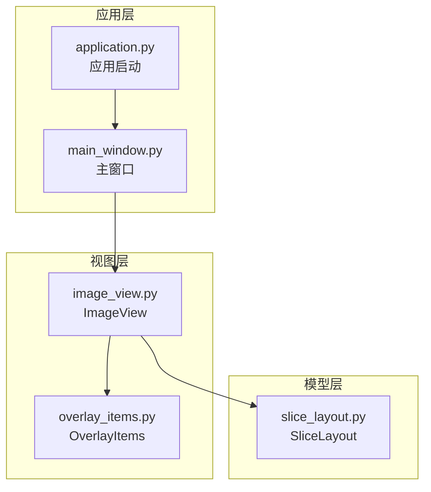
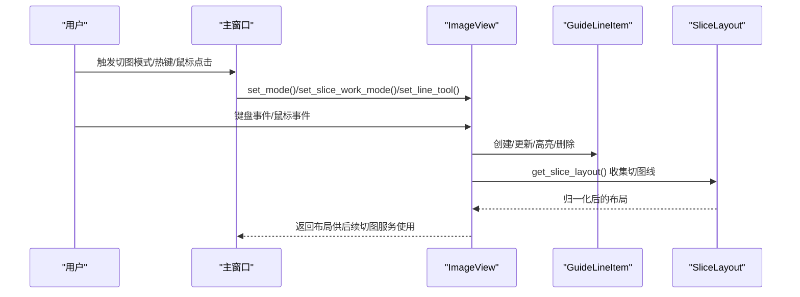
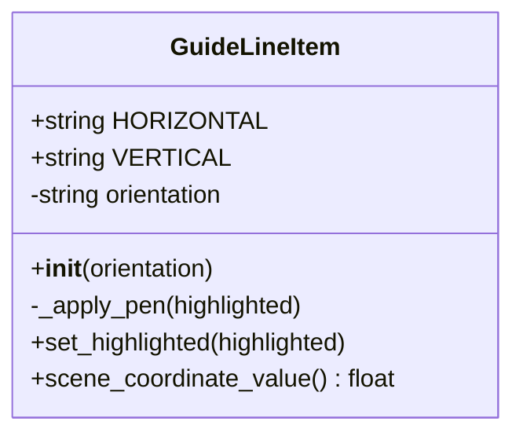
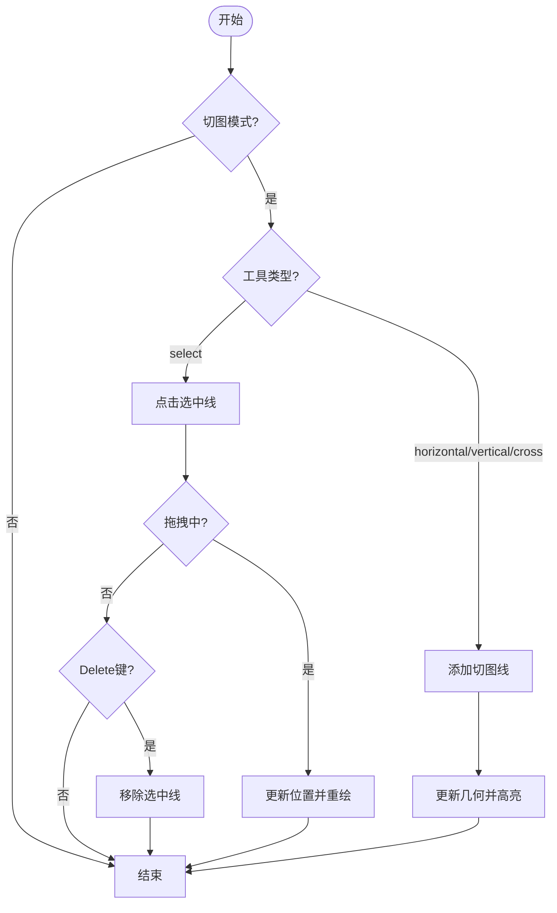
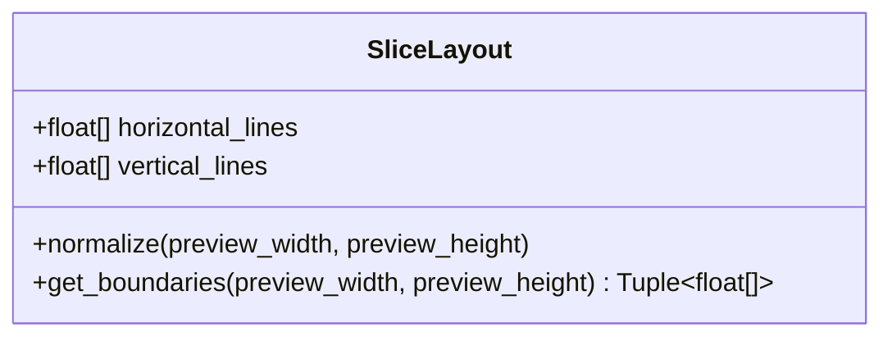
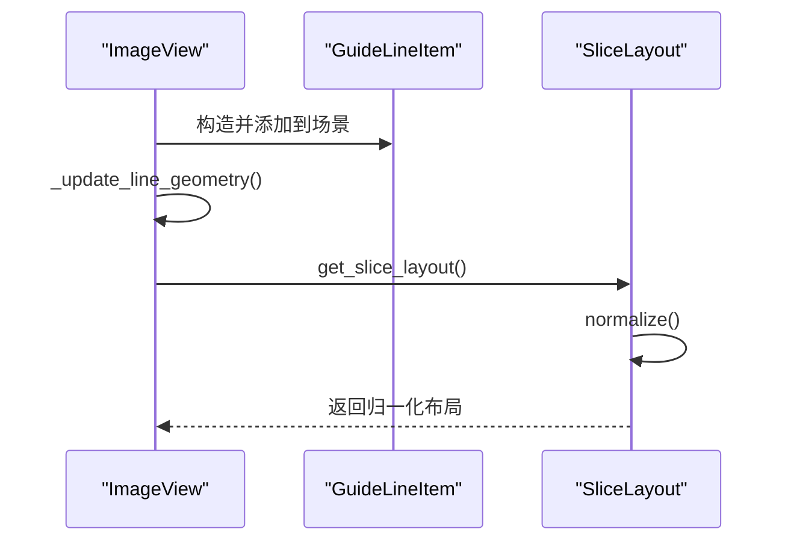
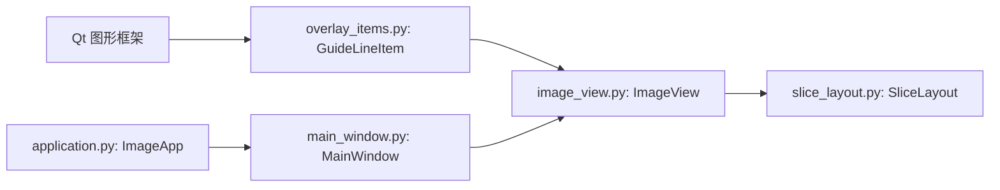

# 切图线组件

<cite>
**本文引用的文件**
- [overlay_items.py](file://img_slicer_tool/views/overlay_items.py)
- [image_view.py](file://img_slicer_tool/views/image_view.py)
- [slice_layout.py](file://img_slicer_tool/models/slice_layout.py)
- [application.py](file://img_slicer_tool/app/application.py)
- [main_window.py](file://img_slicer_tool/app/main_window.py)
- [main.py](file://img_slicer_tool/main.py)
</cite>

## 目录
1. [简介](#简介)
2. [项目结构](#项目结构)
3. [核心组件](#核心组件)
4. [架构总览](#架构总览)
5. [详细组件分析](#详细组件分析)
6. [依赖关系分析](#依赖关系分析)
7. [性能考量](#性能考量)
8. [故障排查指南](#故障排查指南)
9. [结论](#结论)
10. [附录](#附录)

## 简介
本文件系统性地文档化 GuideLineItem 类，该类继承自 QGraphicsLineItem，用于在图像预览视图中绘制“可编辑的切图参考线”。它通过 HORIZONTAL 和 VERTICAL 常量定义方向，支持高亮显示与 Z 值控制，视觉样式为红色虚线边框，Z 值为 9，确保其位于图像之上但低于裁剪框。GuideLineItem 不启用 QGraphicsLineItem 的 ItemIsMovable/ItemIsSelectable，而是由上层 ImageView 统一管理拖拽与选中逻辑；同时提供 scene_coordinate_value 方法，将线段的场景坐标映射为一个标量值（水平线取 Y 坐标均值，垂直线取 X 坐标均值），这是 get_slice_layout 正确收集切图线位置的关键。

## 项目结构
本项目采用分层与功能模块化组织：
- 应用入口与主窗口：负责菜单、动作、状态栏与事件桥接
- 视图层：包含 ImageView（图像视图）与 OverlayItems（覆盖层图形项）
- 模型层：包含 SliceLayout（切图布局数据结构）

图表来源
- [application.py](file://img_slicer_tool/app/application.py#L1-L35)
- [main_window.py](file://img_slicer_tool/app/main_window.py#L1-L364)
- [image_view.py](file://img_slicer_tool/views/image_view.py#L1-L542)
- [overlay_items.py](file://img_slicer_tool/views/overlay_items.py#L1-L64)
- [slice_layout.py](file://img_slicer_tool/models/slice_layout.py#L1-L30)

章节来源
- [application.py](file://img_slicer_tool/app/application.py#L1-L35)
- [main_window.py](file://img_slicer_tool/app/main_window.py#L1-L364)
- [image_view.py](file://img_slicer_tool/views/image_view.py#L1-L542)
- [overlay_items.py](file://img_slicer_tool/views/overlay_items.py#L1-L64)
- [slice_layout.py](file://img_slicer_tool/models/slice_layout.py#L1-L30)

## 核心组件
- GuideLineItem：继承自 QGraphicsLineItem，表示一条可编辑的切图参考线，支持高亮与 Z 值控制，不启用 Qt 默认的可拖拽/可选中标志，交由 ImageView 统一处理。
- ImageView：图像视图，负责切图模式下的交互（热键、鼠标点击、拖拽）、切图线的创建与删除、以及将切图线集合转换为 SliceLayout。
- SliceLayout：数据模型，保存预览坐标系下的水平与垂直切图线集合，并提供归一化与边界计算。

章节来源
- [overlay_items.py](file://img_slicer_tool/views/overlay_items.py#L27-L64)
- [image_view.py](file://img_slicer_tool/views/image_view.py#L236-L304)
- [slice_layout.py](file://img_slicer_tool/models/slice_layout.py#L7-L30)

## 架构总览
下图展示了从用户操作到切图布局生成的端到端流程，包括 GuideLineItem 的创建、拖拽更新、高亮与删除，以及最终的布局归一化。

图表来源
- [main_window.py](file://img_slicer_tool/app/main_window.py#L194-L210)
- [image_view.py](file://img_slicer_tool/views/image_view.py#L94-L109)
- [image_view.py](file://img_slicer_tool/views/image_view.py#L333-L342)
- [image_view.py](file://img_slicer_tool/views/image_view.py#L343-L357)
- [image_view.py](file://img_slicer_tool/views/image_view.py#L358-L366)
- [image_view.py](file://img_slicer_tool/views/image_view.py#L367-L381)
- [image_view.py](file://img_slicer_tool/views/image_view.py#L236-L253)
- [slice_layout.py](file://img_slicer_tool/models/slice_layout.py#L14-L30)

## 详细组件分析

### GuideLineItem 类
- 方向常量：通过 HORIZONTAL 与 VERTICAL 字符串常量定义方向，构造函数校验方向参数，非法值抛出异常。
- 初始化与样式：构造时应用画笔（红色虚线，宽度随高亮变化），设置 Z 值为 9，使其位于图像之上但低于裁剪框；禁用 ItemIsMovable 与 ItemIsSelectable，交由上层统一处理拖拽与选中。
- 高亮机制：提供 set_highlighted 切换高亮，内部通过 _apply_pen 更新画笔样式（高亮时实线加粗，非高亮时虚线细线）。
- 场景坐标映射：scene_coordinate_value 将线段两端点映射到场景坐标，按方向取 Y 坐标均值（水平线）或 X 坐标均值（垂直线），作为该线在场景中的关键标量值，供上层收集切图线位置使用。

图表来源
- [overlay_items.py](file://img_slicer_tool/views/overlay_items.py#L27-L64)

章节来源
- [overlay_items.py](file://img_slicer_tool/views/overlay_items.py#L27-L64)

### ImageView 中的切图线交互
- 创建切图线：
  - 热键：H/V 对应添加水平/垂直线，默认位置取当前场景坐标（无场景时取图像中心）。
  - 鼠标点击：在手动模式下，根据当前工具（horizontal/vertical/cross/select）决定添加哪类线，并以点击位置为基准计算位置。
  - 网格模式：按行列生成固定数量的水平/垂直线。
- 拖拽更新：命中选中线后，记录拖拽索引，在鼠标移动时更新对应切图线的位置并重绘几何。
- 选中与高亮：通过 _select_line_near 与 _find_line_index_near 进行近似命中检测，设置 selected 标志并同步到对应的 GuideLineItem 高亮。
- 删除：Delete 键触发删除当前选中线。
- 几何更新：_update_line_geometry 根据切图线类型与当前图像矩形，设置线段两端点，保证线段完全在图像范围内。
- 清空：clear_cut_lines 移除所有线项与数据。

图表来源
- [image_view.py](file://img_slicer_tool/views/image_view.py#L94-L109)
- [image_view.py](file://img_slicer_tool/views/image_view.py#L309-L318)
- [image_view.py](file://img_slicer_tool/views/image_view.py#L333-L342)
- [image_view.py](file://img_slicer_tool/views/image_view.py#L343-L357)
- [image_view.py](file://img_slicer_tool/views/image_view.py#L367-L381)
- [image_view.py](file://img_slicer_tool/views/image_view.py#L358-L366)
- [image_view.py](file://img_slicer_tool/views/image_view.py#L467-L487)
- [image_view.py](file://img_slicer_tool/views/image_view.py#L397-L418)
- [image_view.py](file://img_slicer_tool/views/image_view.py#L488-L508)

章节来源
- [image_view.py](file://img_slicer_tool/views/image_view.py#L94-L109)
- [image_view.py](file://img_slicer_tool/views/image_view.py#L309-L318)
- [image_view.py](file://img_slicer_tool/views/image_view.py#L333-L342)
- [image_view.py](file://img_slicer_tool/views/image_view.py#L343-L357)
- [image_view.py](file://img_slicer_tool/views/image_view.py#L358-L366)
- [image_view.py](file://img_slicer_tool/views/image_view.py#L367-L381)
- [image_view.py](file://img_slicer_tool/views/image_view.py#L397-L418)
- [image_view.py](file://img_slicer_tool/views/image_view.py#L467-L487)
- [image_view.py](file://img_slicer_tool/views/image_view.py#L488-L508)

### SliceLayout 数据模型
- 结构：包含 horizontal_lines 与 vertical_lines 两个有序列表。
- 归一化：normalize 过滤掉超出图像范围的线，并去重排序，确保后续切片边界计算稳定。
- 边界生成：get_boundaries 在归一化基础上，拼接 0 与图像宽高，得到完整的切片边界坐标序列。

图表来源
- [slice_layout.py](file://img_slicer_tool/models/slice_layout.py#L7-L30)

章节来源
- [slice_layout.py](file://img_slicer_tool/models/slice_layout.py#L7-L30)

### 从创建到布局生成的完整交互流程
- 创建：ImageView 根据热键或鼠标点击调用 _add_manual_line 或网格生成，构造 GuideLineItem 并加入场景，随后更新几何与高亮。
- 拖拽：命中选中线后，拖拽过程中更新切图线位置，再调用 _update_line_geometry 重绘。
- 删除：Delete 键触发 _remove_line_at，移除对应线项与数据。
- 收集：调用 get_slice_layout，遍历 cutLines，依据 GuideLineItem 的方向与 scene_coordinate_value 的标量值，分别写入 SliceLayout 的水平/垂直列表，并进行归一化。

图表来源
- [image_view.py](file://img_slicer_tool/views/image_view.py#L343-L357)
- [image_view.py](file://img_slicer_tool/views/image_view.py#L367-L381)
- [image_view.py](file://img_slicer_tool/views/image_view.py#L236-L253)
- [overlay_items.py](file://img_slicer_tool/views/overlay_items.py#L55-L64)
- [slice_layout.py](file://img_slicer_tool/models/slice_layout.py#L14-L30)

章节来源
- [image_view.py](file://img_slicer_tool/views/image_view.py#L236-L253)
- [overlay_items.py](file://img_slicer_tool/views/overlay_items.py#L55-L64)
- [slice_layout.py](file://img_slicer_tool/models/slice_layout.py#L14-L30)

## 依赖关系分析
- GuideLineItem 依赖 Qt 的图形框架（QGraphicsLineItem、QPen、QColor、QPointF）。
- ImageView 依赖 GuideLineItem 与 SliceLayout，并与主窗口进行事件与状态联动。
- 主窗口负责菜单与动作，驱动 ImageView 的模式切换与工具选择。

图表来源
- [overlay_items.py](file://img_slicer_tool/views/overlay_items.py#L1-L64)
- [image_view.py](file://img_slicer_tool/views/image_view.py#L1-L542)
- [slice_layout.py](file://img_slicer_tool/models/slice_layout.py#L1-L30)
- [main_window.py](file://img_slicer_tool/app/main_window.py#L1-L364)
- [application.py](file://img_slicer_tool/app/application.py#L1-L35)

章节来源
- [overlay_items.py](file://img_slicer_tool/views/overlay_items.py#L1-L64)
- [image_view.py](file://img_slicer_tool/views/image_view.py#L1-L542)
- [slice_layout.py](file://img_slicer_tool/models/slice_layout.py#L1-L30)
- [main_window.py](file://img_slicer_tool/app/main_window.py#L1-L364)
- [application.py](file://img_slicer_tool/app/application.py#L1-L35)

## 性能考量
- 几何更新：每次拖拽或新增都会调用 _update_line_geometry，建议在高频拖拽场景中避免不必要的重绘，可通过减少调用频率或批量更新优化。
- 选中检测：_select_line_near 与 _find_line_index_near 使用阈值距离进行命中检测，阈值过小会增加误判，过大则影响精度，可根据实际 UI 缩放比例动态调整。
- 归一化：normalize 在布局收集阶段执行，时间复杂度与线数量成正比，建议在大量切图线场景下考虑缓存策略或延迟归一化。

## 故障排查指南
- 无法创建切图线
  - 检查是否处于切图模式且工作模式为 manual。
  - 确认 lineTool 设置为 horizontal/vertical/cross/select。
  - 参考路径：[image_view.py](file://img_slicer_tool/views/image_view.py#L333-L342)，[image_view.py](file://img_slicer_tool/views/image_view.py#L309-L318)
- 无法拖拽选中线
  - 确认鼠标点击命中了有效切图线，且未处于网格模式。
  - 检查 _try_begin_line_drag 是否返回 True。
  - 参考路径：[image_view.py](file://img_slicer_tool/views/image_view.py#L467-L477)，[image_view.py](file://img_slicer_tool/views/image_view.py#L488-L508)
- 删除无效
  - Delete 键仅在切图模式且手动模式下生效，并且存在选中线。
  - 参考路径：[image_view.py](file://img_slicer_tool/views/image_view.py#L94-L109)，[image_view.py](file://img_slicer_tool/views/image_view.py#L358-L366)
- 切图结果为空
  - 若没有切图线，get_slice_layout 会返回空布局，需检查 scene_coordinate_value 的方向与边界条件。
  - 参考路径：[image_view.py](file://img_slicer_tool/views/image_view.py#L236-L253)，[overlay_items.py](file://img_slicer_tool/views/overlay_items.py#L55-L64)

章节来源
- [image_view.py](file://img_slicer_tool/views/image_view.py#L94-L109)
- [image_view.py](file://img_slicer_tool/views/image_view.py#L333-L342)
- [image_view.py](file://img_slicer_tool/views/image_view.py#L358-L366)
- [image_view.py](file://img_slicer_tool/views/image_view.py#L467-L477)
- [image_view.py](file://img_slicer_tool/views/image_view.py#L488-L508)
- [image_view.py](file://img_slicer_tool/views/image_view.py#L236-L253)
- [overlay_items.py](file://img_slicer_tool/views/overlay_items.py#L55-L64)

## 结论
GuideLineItem 通过明确的方向常量、清晰的视觉样式与 Z 值控制，配合 ImageView 的统一交互管理，实现了灵活高效的切图参考线编辑体验。scene_coordinate_value 提供稳定的标量映射，使 get_slice_layout 能够可靠地收集切图线位置并生成规范化的布局数据，为后续切片服务提供坚实基础。

## 附录
- 入口程序与应用启动
  - 应用入口：main.py
  - 应用启动：application.py
  - 主窗口：main_window.py
  - 参考路径：
    - [main.py](file://img_slicer_tool/main.py#L1-L13)
    - [application.py](file://img_slicer_tool/app/application.py#L1-L35)
    - [main_window.py](file://img_slicer_tool/app/main_window.py#L1-L364)

章节来源
- [main.py](file://img_slicer_tool/main.py#L1-L13)
- [application.py](file://img_slicer_tool/app/application.py#L1-L35)
- [main_window.py](file://img_slicer_tool/app/main_window.py#L1-L364)