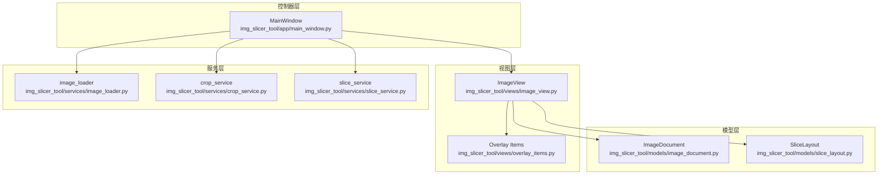
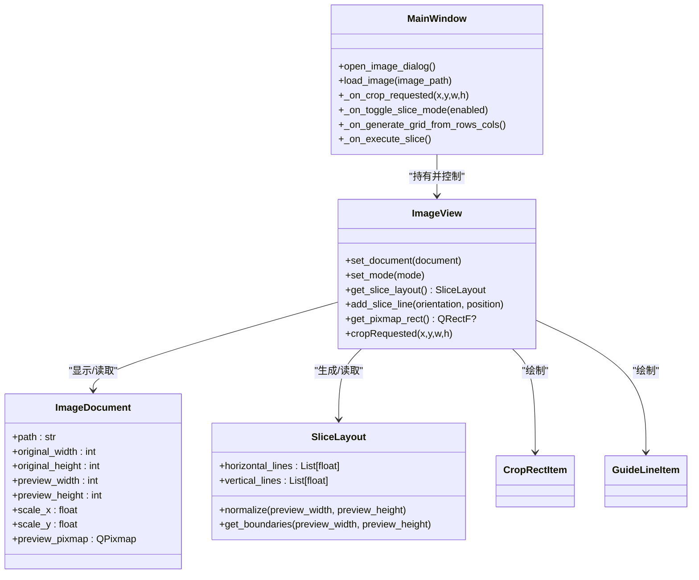
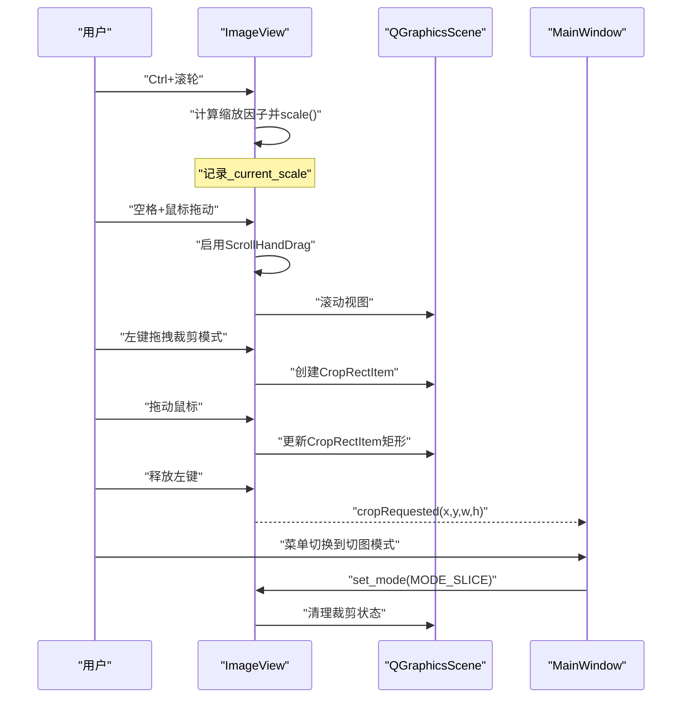
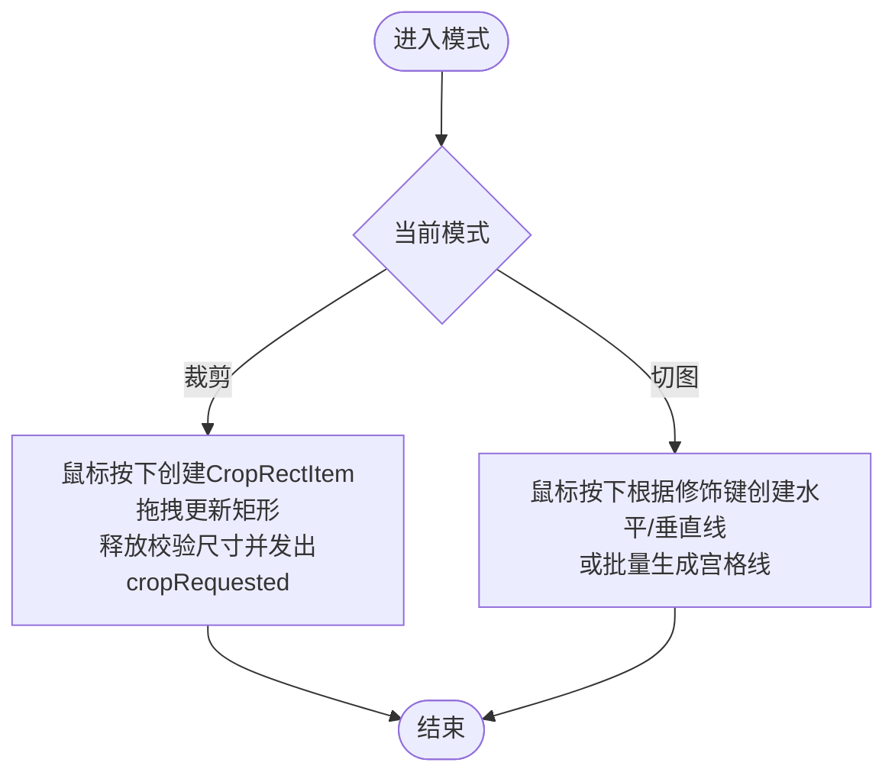
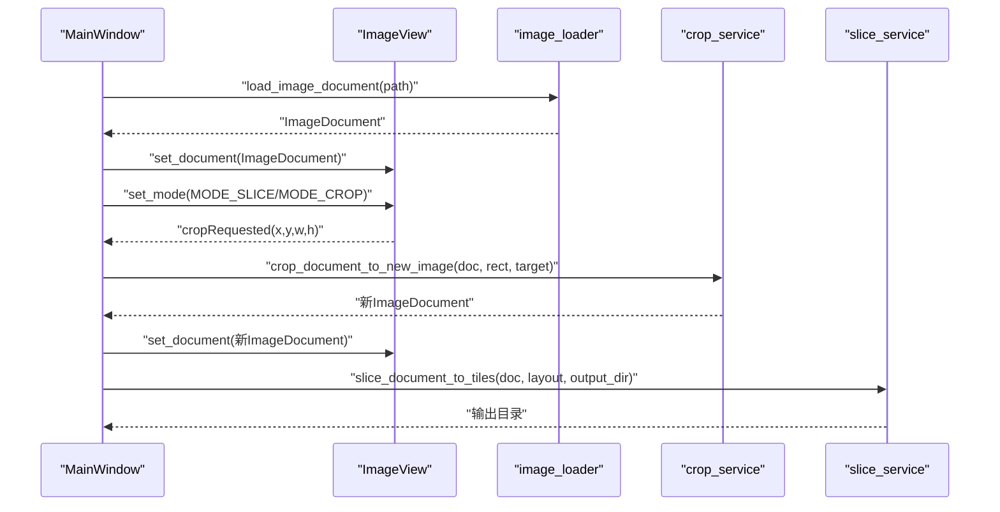
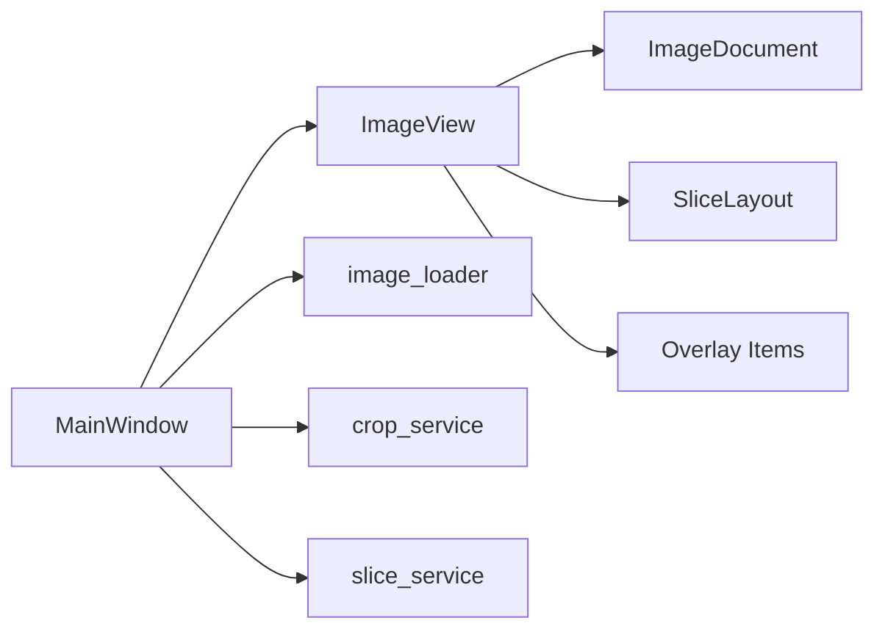

# 图像视图组件

<cite>
**本文引用的文件**
- [img_slicer_tool/views/image_view.py](file://img_slicer_tool/views/image_view.py)
- [img_slicer_tool/views/overlay_items.py](file://img_slicer_tool/views/overlay_items.py)
- [img_slicer_tool/models/image_document.py](file://img_slicer_tool/models/image_document.py)
- [img_slicer_tool/models/slice_layout.py](file://img_slicer_tool/models/slice_layout.py)
- [img_slicer_tool/app/main_window.py](file://img_slicer_tool/app/main_window.py)
- [img_slicer_tool/services/image_loader.py](file://img_slicer_tool/services/image_loader.py)
- [img_slicer_tool/services/crop_service.py](file://img_slicer_tool/services/crop_service.py)
- [img_slicer_tool/services/slice_service.py](file://img_slicer_tool/services/slice_service.py)
</cite>

## 目录
1. [简介](#简介)
2. [项目结构](#项目结构)
3. [核心组件](#核心组件)
4. [架构总览](#架构总览)
5. [详细组件分析](#详细组件分析)
6. [依赖关系分析](#依赖关系分析)
7. [性能考量](#性能考量)
8. [故障排查指南](#故障排查指南)
9. [结论](#结论)

## 简介
本文件系统性文档化 PictureMaster 的 ImageView 组件。该组件继承自 QGraphicsView，承担图像预览、缩放、平移与用户交互职责。重点包括：
- 通过 set_document 加载 ImageDocument 并显示预览图
- Ctrl+滚轮实现缩放、空格+拖动实现平移
- 针对裁剪模式与切图模式的差异化鼠标交互逻辑
- 通过 cropRequested 信号向 MainWindow 传递裁剪区域坐标
- set_mode 切换裁剪/切图模式并清理状态
- get_slice_layout 收集场景中的 GuideLineItem 生成 SliceLayout 数据模型
- 在 MVC 架构中作为 View 角色与控制器通信

## 项目结构
ImageView 位于 views 子模块，配合 overlay_items 提供裁剪矩形与切图辅助线；数据模型由 models 提供，业务逻辑由 services 实现，UI 控制器由 app 的 MainWindow 承担。

图表来源
- [img_slicer_tool/views/image_view.py](file://img_slicer_tool/views/image_view.py#L1-L218)
- [img_slicer_tool/views/overlay_items.py](file://img_slicer_tool/views/overlay_items.py#L1-L57)
- [img_slicer_tool/models/image_document.py](file://img_slicer_tool/models/image_document.py#L1-L18)
- [img_slicer_tool/models/slice_layout.py](file://img_slicer_tool/models/slice_layout.py#L1-L30)
- [img_slicer_tool/app/main_window.py](file://img_slicer_tool/app/main_window.py#L1-L248)
- [img_slicer_tool/services/image_loader.py](file://img_slicer_tool/services/image_loader.py#L1-L68)
- [img_slicer_tool/services/crop_service.py](file://img_slicer_tool/services/crop_service.py#L1-L38)
- [img_slicer_tool/services/slice_service.py](file://img_slicer_tool/services/slice_service.py#L1-L62)

章节来源
- [img_slicer_tool/views/image_view.py](file://img_slicer_tool/views/image_view.py#L1-L218)
- [img_slicer_tool/app/main_window.py](file://img_slicer_tool/app/main_window.py#L1-L248)

## 核心组件
- ImageView：继承 QGraphicsView，负责图像显示、缩放、平移、裁剪与切图交互，并提供 get_slice_layout、add_slice_line、set_mode、set_document 等接口。
- Overlay Items：CropRectItem（半透明裁剪矩形）、GuideLineItem（红虚线切图线，可移动可选中）。
- ImageDocument：封装预览图与原图尺寸、缩放比例、预览 QPixmap。
- SliceLayout：保存预览坐标系下的水平/垂直切图线集合，并提供归一化与边界提取能力。
- MainWindow：控制器，连接 ImageView 信号、触发服务层业务、管理 UI 状态。
- Services：image_loader（加载并生成 ImageDocument）、crop_service（基于预览矩形裁剪）、slice_service（基于切图线导出切片）。

章节来源
- [img_slicer_tool/views/image_view.py](file://img_slicer_tool/views/image_view.py#L1-L218)
- [img_slicer_tool/views/overlay_items.py](file://img_slicer_tool/views/overlay_items.py#L1-L57)
- [img_slicer_tool/models/image_document.py](file://img_slicer_tool/models/image_document.py#L1-L18)
- [img_slicer_tool/models/slice_layout.py](file://img_slicer_tool/models/slice_layout.py#L1-L30)
- [img_slicer_tool/app/main_window.py](file://img_slicer_tool/app/main_window.py#L1-L248)
- [img_slicer_tool/services/image_loader.py](file://img_slicer_tool/services/image_loader.py#L1-L68)
- [img_slicer_tool/services/crop_service.py](file://img_slicer_tool/services/crop_service.py#L1-L38)
- [img_slicer_tool/services/slice_service.py](file://img_slicer_tool/services/slice_service.py#L1-L62)

## 架构总览
ImageView 在 MVC 中扮演 View 角色：
- Model：ImageDocument、SliceLayout
- View：ImageView、Overlay Items
- Controller：MainWindow（负责菜单、快捷键、对话框、调用服务）

图表来源
- [img_slicer_tool/app/main_window.py](file://img_slicer_tool/app/main_window.py#L1-L248)
- [img_slicer_tool/views/image_view.py](file://img_slicer_tool/views/image_view.py#L1-L218)
- [img_slicer_tool/models/image_document.py](file://img_slicer_tool/models/image_document.py#L1-L18)
- [img_slicer_tool/models/slice_layout.py](file://img_slicer_tool/models/slice_layout.py#L1-L30)
- [img_slicer_tool/views/overlay_items.py](file://img_slicer_tool/views/overlay_items.py#L1-L57)

## 详细组件分析

### ImageView 类与交互流程
- 初始化与视图参数：设置渲染提示、拖拽模式、锚点、更新策略等。
- set_document：清空场景、重置变换、重置缩放、清理裁剪状态；从 ImageDocument 获取预览图并居中显示。
- 缩放：仅当 Ctrl 按下时响应滚轮，按比例放大/缩小，记录当前缩放值。
- 平移：空格按下时启用 ScrollHandDrag，松开恢复 NoDrag。
- 键盘删除：Delete 删除场景中的 GuideLineItem。
- 模式切换：set_mode 清理裁剪矩形与拖拽状态，切换内部模式常量。
- 裁剪模式交互：
  - mousePressEvent：在预览图内开始拖拽，创建 CropRectItem，记录起始点。
  - mouseMoveEvent：限制矩形在预览图范围内，更新 CropRectItem。
  - mouseReleaseEvent：若矩形尺寸满足最小值，发出 cropRequested(x,y,w,h)。
- 切图模式交互：
  - mousePressEvent：根据修饰键组合决定创建水平/垂直线；默认同时创建。
  - add_slice_line：在预览图范围内绘制 GuideLineItem。
- 切图布局收集：get_slice_layout 遍历场景项，收集 GuideLineItem 的坐标，归一化后返回 SliceLayout。
- 辅助：get_pixmap_rect 返回预览图场景矩形。

图表来源
- [img_slicer_tool/views/image_view.py](file://img_slicer_tool/views/image_view.py#L59-L175)
- [img_slicer_tool/app/main_window.py](file://img_slicer_tool/app/main_window.py#L168-L178)

章节来源
- [img_slicer_tool/views/image_view.py](file://img_slicer_tool/views/image_view.py#L36-L218)

### 裁剪模式与切图模式的差异化处理
- 裁剪模式：
  - 通过 CropRectItem 实时绘制矩形，拖拽起点与终点形成矩形。
  - 释放时校验最小尺寸，满足则发出 cropRequested。
- 切图模式：
  - 通过 GuideLineItem 添加水平/垂直辅助线，支持 Shift/Ctrl 组合控制方向。
  - 可通过“按行列生成宫格线”批量生成网格线。
  - 通过 get_slice_layout 将场景中的 GuideLineItem 转换为 SliceLayout，用于切图导出。

图表来源
- [img_slicer_tool/views/image_view.py](file://img_slicer_tool/views/image_view.py#L93-L175)
- [img_slicer_tool/views/overlay_items.py](file://img_slicer_tool/views/overlay_items.py#L27-L57)
- [img_slicer_tool/app/main_window.py](file://img_slicer_tool/app/main_window.py#L185-L214)

章节来源
- [img_slicer_tool/views/image_view.py](file://img_slicer_tool/views/image_view.py#L93-L175)
- [img_slicer_tool/views/overlay_items.py](file://img_slicer_tool/views/overlay_items.py#L1-L57)
- [img_slicer_tool/app/main_window.py](file://img_slicer_tool/app/main_window.py#L185-L214)

### 与控制器的通信机制（MVC）
- MainWindow 作为控制器：
  - 通过 _connect_signals 连接 ImageView 的 cropRequested 信号到 _on_crop_requested。
  - 切图模式切换：_on_toggle_slice_mode 调用 set_mode 切换模式。
  - 宫格线生成：_on_generate_grid_from_rows_cols 计算步长并调用 add_slice_line。
  - 执行切图：_on_execute_slice 调用 get_slice_layout，交由 slice_service 导出切片。
- 业务服务：
  - image_loader：加载原图，生成 ImageDocument（包含预览图与缩放比例）。
  - crop_service：将预览坐标转换为原图坐标，执行裁剪并返回新 ImageDocument。
  - slice_service：将预览切图线转换为原图边界，导出切片到目标目录。

图表来源
- [img_slicer_tool/app/main_window.py](file://img_slicer_tool/app/main_window.py#L67-L109)
- [img_slicer_tool/services/image_loader.py](file://img_slicer_tool/services/image_loader.py#L24-L54)
- [img_slicer_tool/services/crop_service.py](file://img_slicer_tool/services/crop_service.py#L13-L38)
- [img_slicer_tool/services/slice_service.py](file://img_slicer_tool/services/slice_service.py#L12-L62)
- [img_slicer_tool/views/image_view.py](file://img_slicer_tool/views/image_view.py#L43-L58)

章节来源
- [img_slicer_tool/app/main_window.py](file://img_slicer_tool/app/main_window.py#L67-L109)
- [img_slicer_tool/services/image_loader.py](file://img_slicer_tool/services/image_loader.py#L1-L68)
- [img_slicer_tool/services/crop_service.py](file://img_slicer_tool/services/crop_service.py#L1-L38)
- [img_slicer_tool/services/slice_service.py](file://img_slicer_tool/services/slice_service.py#L1-L62)

## 依赖关系分析
- ImageView 依赖：
  - 模型：ImageDocument、SliceLayout
  - 视图元素：CropRectItem、GuideLineItem
  - 控制器：MainWindow（通过信号连接）
- MainWindow 依赖：
  - ImageView 的 set_document、set_mode、get_slice_layout、add_slice_line、cropRequested
  - 服务层：image_loader、crop_service、slice_service
- 服务层依赖：
  - PIL Image 进行图像处理
  - utils 中的坐标转换工具（如 preview_rect_to_original_box、preview_lines_to_original_boundaries）

图表来源
- [img_slicer_tool/app/main_window.py](file://img_slicer_tool/app/main_window.py#L1-L248)
- [img_slicer_tool/views/image_view.py](file://img_slicer_tool/views/image_view.py#L1-L218)
- [img_slicer_tool/models/image_document.py](file://img_slicer_tool/models/image_document.py#L1-L18)
- [img_slicer_tool/models/slice_layout.py](file://img_slicer_tool/models/slice_layout.py#L1-L30)
- [img_slicer_tool/views/overlay_items.py](file://img_slicer_tool/views/overlay_items.py#L1-L57)
- [img_slicer_tool/services/image_loader.py](file://img_slicer_tool/services/image_loader.py#L1-L68)
- [img_slicer_tool/services/crop_service.py](file://img_slicer_tool/services/crop_service.py#L1-L38)
- [img_slicer_tool/services/slice_service.py](file://img_slicer_tool/services/slice_service.py#L1-L62)

章节来源
- [img_slicer_tool/app/main_window.py](file://img_slicer_tool/app/main_window.py#L1-L248)
- [img_slicer_tool/views/image_view.py](file://img_slicer_tool/views/image_view.py#L1-L218)

## 性能考量
- 预览图尺寸控制：image_loader 对超大图进行缩放，避免 UI 卡顿。
- 场景更新策略：设置 SmartViewportUpdate，减少不必要的重绘。
- 缩放与平移：仅在 Ctrl 或空格状态下改变行为，避免误触。
- 切图线数量：SliceLayout.normalize 去重与过滤，降低后续处理成本。
- 导出切片：slice_service 按边界遍历裁剪，注意大图导出耗时，建议异步执行并在 UI 中反馈进度。

[本节为通用指导，不涉及具体文件分析]

## 故障排查指南
- 无法加载图片
  - 现象：打开图片报错或无内容
  - 排查：确认文件存在、格式受支持；检查 image_loader 抛出异常
  - 处理：在 MainWindow 中捕获异常并提示
- 无法进行裁剪
  - 现象：释放鼠标未触发裁剪
  - 排查：确认当前模式为裁剪模式；检查最小尺寸阈值；确认 cropRequested 是否被连接
  - 处理：确保 set_mode 正确切换；检查 mouseReleaseEvent 条件
- 切图线无效
  - 现象：导出切片为空或只有整图
  - 排查：确认已添加切图线；检查 get_slice_layout 是否收集到有效坐标；确认 SliceLayout.normalize 后仍有线条
  - 处理：使用“按行列生成宫格线”或手动添加；确认预览图存在
- 切图导出失败
  - 现象：导出报错
  - 排查：确认输出目录存在且可写；确认原始图片存在；检查 slice_service 参数
  - 处理：选择新目录；确认权限；重试

章节来源
- [img_slicer_tool/app/main_window.py](file://img_slicer_tool/app/main_window.py#L88-L109)
- [img_slicer_tool/views/image_view.py](file://img_slicer_tool/views/image_view.py#L155-L175)
- [img_slicer_tool/services/slice_service.py](file://img_slicer_tool/services/slice_service.py#L12-L62)

## 结论
ImageView 作为 MVC 架构中的视图组件，通过清晰的模式切换、直观的交互与稳定的信号通信，实现了图像预览、缩放、平移、裁剪与切图的核心功能。其与 MainWindow 的解耦设计使得控制器能够专注于业务编排，而与服务层协作完成实际的图像处理任务。通过合理利用 SliceLayout 与 Overlay Items，用户可在预览坐标系下高效完成复杂切图工作流。