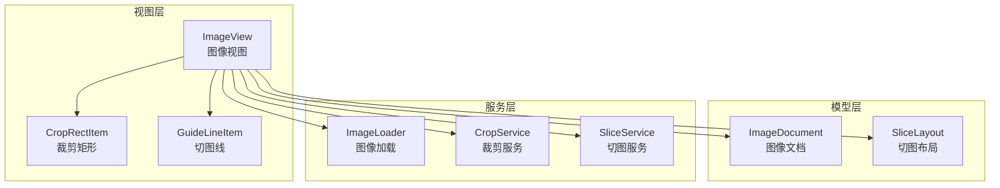
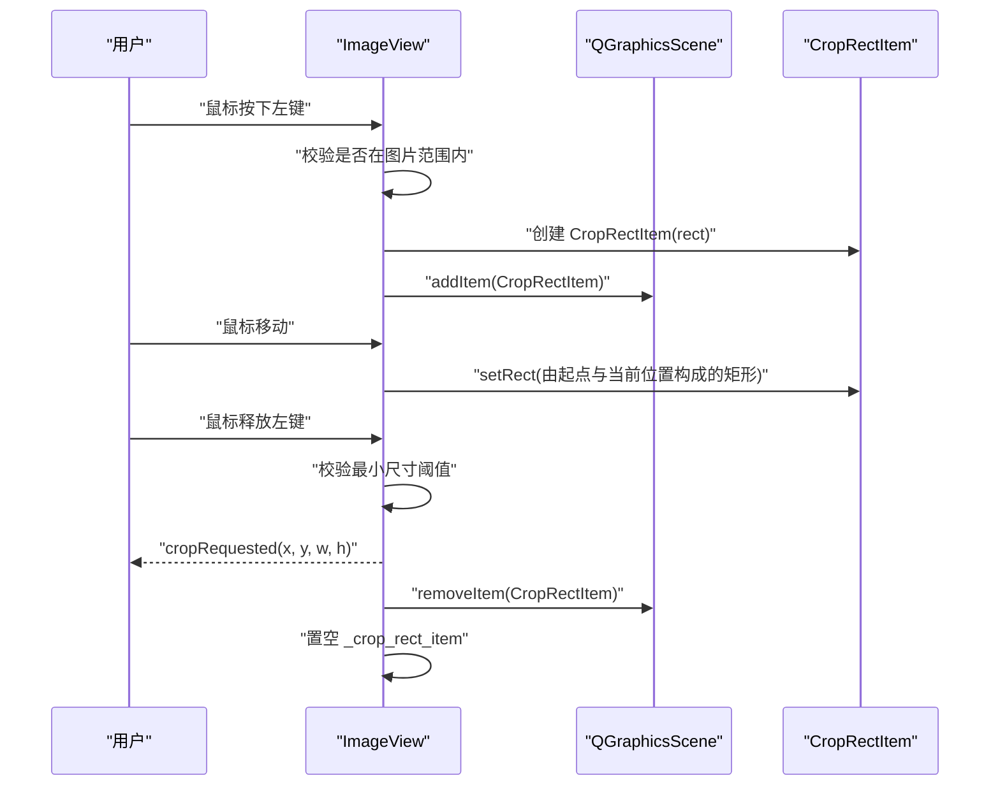
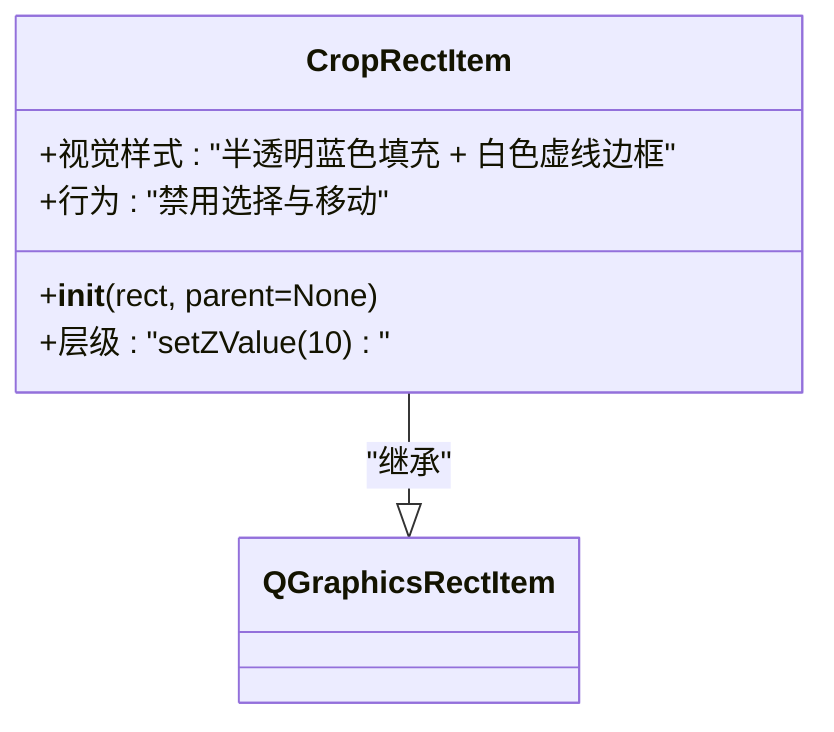
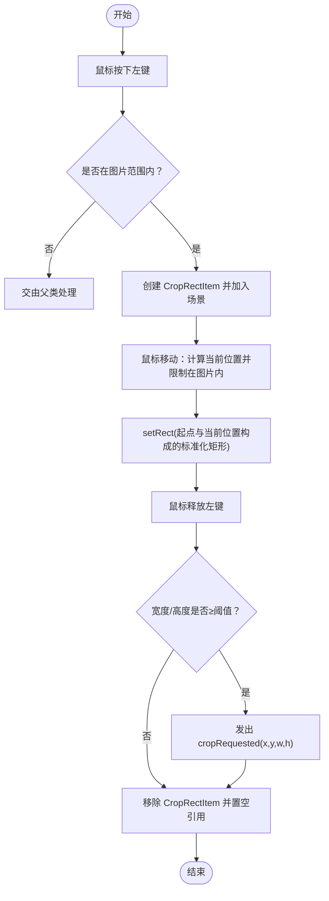
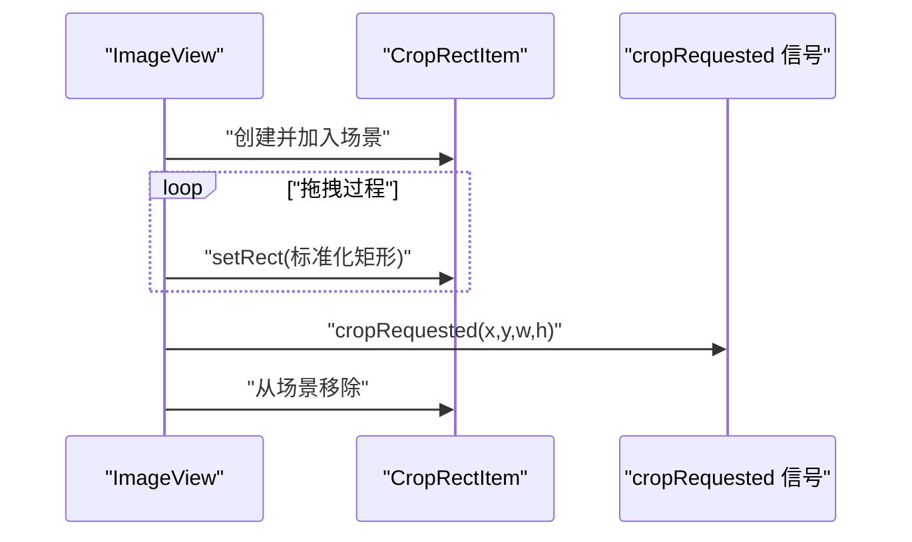
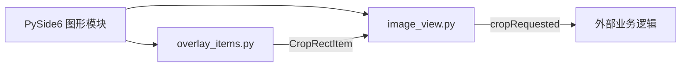

# 裁剪框组件

<cite>
**本文引用的文件列表**
- [img_slicer_tool/views/overlay_items.py](file://img_slicer_tool/views/overlay_items.py)
- [img_slicer_tool/views/image_view.py](file://img_slicer_tool/views/image_view.py)
- [img_slicer_tool/README.md](file://img_slicer_tool/README.md)
</cite>

## 目录
1. [简介](#简介)
2. [项目结构](#项目结构)
3. [核心组件](#核心组件)
4. [架构总览](#架构总览)
5. [详细组件分析](#详细组件分析)
6. [依赖关系分析](#依赖关系分析)
7. [性能考量](#性能考量)
8. [故障排查指南](#故障排查指南)
9. [结论](#结论)

## 简介
本文件系统性地文档化 CropRectItem 组件，该组件继承自 QGraphicsRectItem，用于在图像预览视图中提供可交互的裁剪选择框。其职责是：
- 以半透明蓝色填充与白色虚线边框呈现，确保在图片之上清晰可见；
- 通过 setZValue 将其置于更高图层，避免被其他图元遮挡；
- 通过禁用 ItemIsSelectable 和 ItemIsMovable，确保该矩形仅作为临时视觉反馈，不参与场景选择与拖动；
- 在 ImageView 的裁剪模式下，由用户鼠标拖拽动态创建、更新与销毁，最终通过 cropRequested 信号向外传递裁剪参数。

本文件同时梳理 CropRectItem 在 ImageView 中的完整生命周期：从创建、实时更新到释放销毁；并说明其作为临时视觉反馈组件的设计意图。

**章节来源**
- [img_slicer_tool/README.md](file://img_slicer_tool/README.md#L1-L9)

## 项目结构
本项目采用“视图-模型-服务-应用”分层组织，裁剪框组件位于视图层，与图像视图协同工作：
- 视图层：包含图像视图与覆盖图元（CropRectItem、GuideLineItem 等）；
- 模型层：图像文档与切图布局等数据模型；
- 服务层：图像加载、切图服务等；
- 应用层：主窗口与应用入口。

裁剪框组件位于视图层的 overlay_items.py 文件中，与图像视图 image_view.py 协作，共同完成裁剪交互流程。

**章节来源**
- [img_slicer_tool/views/image_view.py](file://img_slicer_tool/views/image_view.py#L1-L120)
- [img_slicer_tool/views/overlay_items.py](file://img_slicer_tool/views/overlay_items.py#L1-L30)

## 核心组件
- CropRectItem：继承自 QGraphicsRectItem，负责绘制半透明蓝色填充与白色虚线边框，设置 Z 值使其位于图片之上，并禁用选择与移动标志，确保其仅为临时视觉反馈。
- ImageView：图像视图，负责在裁剪模式下创建、更新与销毁 CropRectItem，并在鼠标释放时通过 cropRequested 信号向外传递裁剪参数。

关键职责与行为：
- 视觉样式：半透明蓝色填充、白色虚线边框、Z 值提升；
- 行为约束：禁用选择与移动，避免干扰场景交互；
- 生命周期：在裁剪模式下由 ImageView 动态创建、更新、销毁；
- 事件联动：在 mouseMoveEvent 中随鼠标拖拽实时更新矩形范围，在 mouseReleaseEvent 中触发裁剪请求并销毁自身。

**章节来源**
- [img_slicer_tool/views/overlay_items.py](file://img_slicer_tool/views/overlay_items.py#L8-L25)
- [img_slicer_tool/views/image_view.py](file://img_slicer_tool/views/image_view.py#L154-L235)

## 架构总览
CropRectItem 与 ImageView 的协作关系如下：
- ImageView 在裁剪模式下捕获鼠标按下事件，创建 CropRectItem 并加入场景；
- 在鼠标移动过程中，ImageView 计算当前矩形并调用 CropRectItem.setRect 实时更新；
- 在鼠标释放时，ImageView 校验尺寸阈值并通过 cropRequested 信号发送裁剪参数；
- 最后 ImageView 从场景移除 CropRectItem，完成一次完整的交互周期。

**图表来源**
- [img_slicer_tool/views/image_view.py](file://img_slicer_tool/views/image_view.py#L154-L235)
- [img_slicer_tool/views/overlay_items.py](file://img_slicer_tool/views/overlay_items.py#L8-L25)

## 详细组件分析

### CropRectItem 类分析
- 继承关系：CropRectItem 继承自 QGraphicsRectItem，具备矩形几何属性与图形项的基本能力。
- 视觉样式设置：
  - 半透明蓝色填充：通过设置 QBrush 使用指定 RGBA 值，确保在图片之上有良好对比度与透明感；
  - 白色虚线边框：通过 QPen 设置虚线样式与宽度，突出矩形边界；
  - Z 值提升：通过 setZValue 提升层级，确保始终位于图片之上。
- 行为约束：
  - 禁用选择：setFlag(ItemIsSelectable, False)，防止被场景选择；
  - 禁用移动：setFlag(ItemIsMovable, False)，防止被用户直接拖动；
  - 这些约束使 CropRectItem 成为纯粹的临时视觉反馈，不参与场景交互。

**图表来源**
- [img_slicer_tool/views/overlay_items.py](file://img_slicer_tool/views/overlay_items.py#L8-L25)

**章节来源**
- [img_slicer_tool/views/overlay_items.py](file://img_slicer_tool/views/overlay_items.py#L8-L25)

### ImageView 中的 CropRectItem 生命周期
- 创建阶段：
  - 当用户在裁剪模式下按下左键且位置落在图片范围内时，ImageView 初始化拖拽状态并创建 CropRectItem；
  - 若之前存在旧的 CropRectItem，则先从场景移除再创建新的，确保每次只保留一个临时矩形。
- 更新阶段：
  - 在鼠标移动事件中，ImageView 计算当前场景坐标并将其限制在图片范围内；
  - 以起点与当前位置构造标准化矩形，调用 CropRectItem.setRect 实时更新；
  - 该过程在 mouseMoveEvent 中完成，保证拖拽过程的流畅性。
- 销毁阶段：
  - 在鼠标释放事件中，若满足最小尺寸阈值，ImageView 发出 cropRequested 信号；
  - 随后从场景移除 CropRectItem 并置空内部引用，完成一次交互周期。

**图表来源**
- [img_slicer_tool/views/image_view.py](file://img_slicer_tool/views/image_view.py#L154-L235)

**章节来源**
- [img_slicer_tool/views/image_view.py](file://img_slicer_tool/views/image_view.py#L154-L235)

### 事件联动与数据流
- mousePressEvent：在裁剪模式下初始化拖拽状态与起点，创建 CropRectItem 并加入场景；
- mouseMoveEvent：在拖拽状态下，实时更新 CropRectItem 的矩形范围；
- mouseReleaseEvent：在满足尺寸条件时，发出裁剪请求信号，并移除 CropRectItem。

**图表来源**
- [img_slicer_tool/views/image_view.py](file://img_slicer_tool/views/image_view.py#L154-L235)

**章节来源**
- [img_slicer_tool/views/image_view.py](file://img_slicer_tool/views/image_view.py#L154-L235)

## 依赖关系分析
- CropRectItem 依赖 Qt 图形框架的 QBrush、QPen、QColor、QRectF 与 QGraphicsRectItem；
- ImageView 依赖 CropRectItem 与 QGraphicsScene，负责场景管理与事件处理；
- 二者通过信号与事件进行解耦：ImageView 通过 cropRequested 信号对外暴露裁剪结果，CropRectItem 仅承担视觉反馈职责。

**图表来源**
- [img_slicer_tool/views/overlay_items.py](file://img_slicer_tool/views/overlay_items.py#L1-L30)
- [img_slicer_tool/views/image_view.py](file://img_slicer_tool/views/image_view.py#L1-L60)

**章节来源**
- [img_slicer_tool/views/overlay_items.py](file://img_slicer_tool/views/overlay_items.py#L1-L30)
- [img_slicer_tool/views/image_view.py](file://img_slicer_tool/views/image_view.py#L1-L60)

## 性能考量
- 临时性设计：CropRectItem 仅在拖拽期间存在于场景中，释放后立即移除，避免长期占用内存与渲染资源；
- 事件驱动更新：mouseMoveEvent 中仅调用 setRect，避免复杂计算，保证拖拽流畅；
- 边界限制：在更新矩形时对场景坐标进行边界裁剪，减少无效绘制；
- 层级控制：通过 setZValue 将裁剪矩形置于图片之上，避免额外的层级排序开销。

[本节为通用性能建议，无需特定文件引用]

## 故障排查指南
- 矩形未显示或被遮挡
  - 检查 setZValue 是否正确设置，确保高于图片图层；
  - 检查是否被其他图元覆盖或场景未刷新。
- 矩形无法拖动但也不响应选择
  - 确认已禁用 ItemIsMovable 与 ItemIsSelectable；
  - 确认 ImageView 的裁剪模式与事件处理逻辑正常。
- 裁剪请求未触发
  - 检查 mouseReleaseEvent 中的尺寸阈值判断；
  - 确认 cropRequested 信号连接方是否正确接收。
- 临时矩形未释放
  - 检查 mouseReleaseEvent 结束分支是否执行 removeItem 与置空引用；
  - 确认未在其他分支提前返回导致清理逻辑缺失。

**章节来源**
- [img_slicer_tool/views/overlay_items.py](file://img_slicer_tool/views/overlay_items.py#L8-L25)
- [img_slicer_tool/views/image_view.py](file://img_slicer_tool/views/image_view.py#L154-L235)

## 结论
CropRectItem 通过简洁明确的视觉样式与严格的交互约束，成为 ImageView 裁剪模式下的理想临时视觉反馈组件。其生命周期完全由 ImageView 控制：创建于按下、更新于移动、销毁于释放，并通过 cropRequested 信号将裁剪参数安全地传递给上层业务逻辑。该设计既保证了用户体验的直观与流畅，又避免了不必要的状态持久化与复杂交互，体现了良好的架构分层与职责分离。