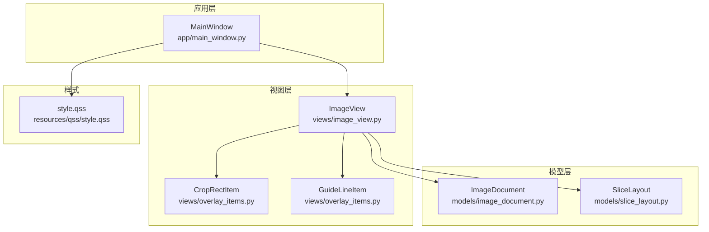
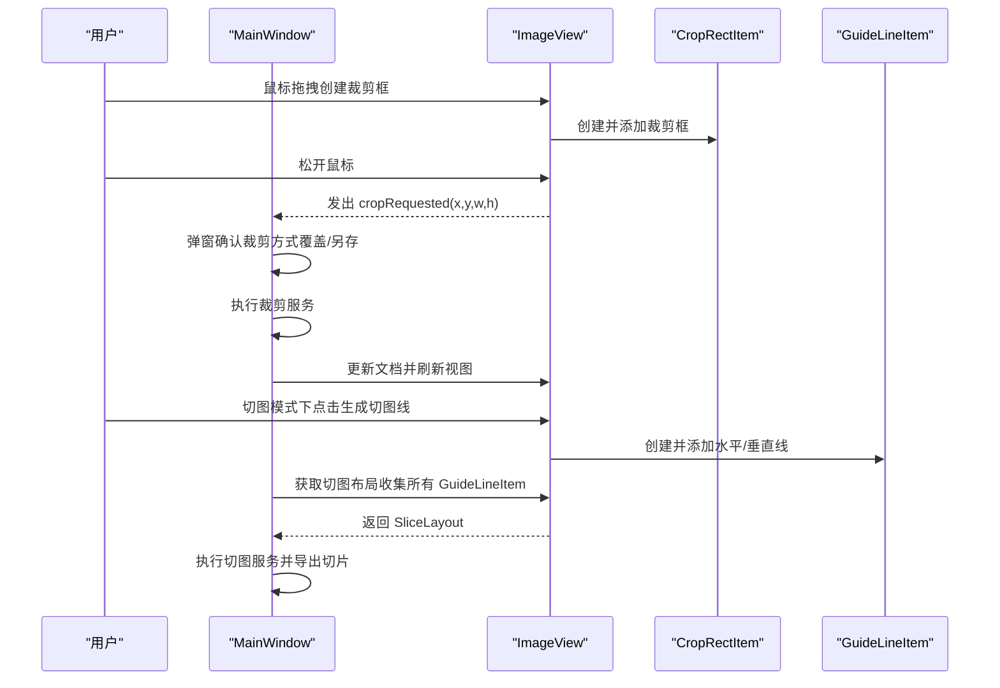
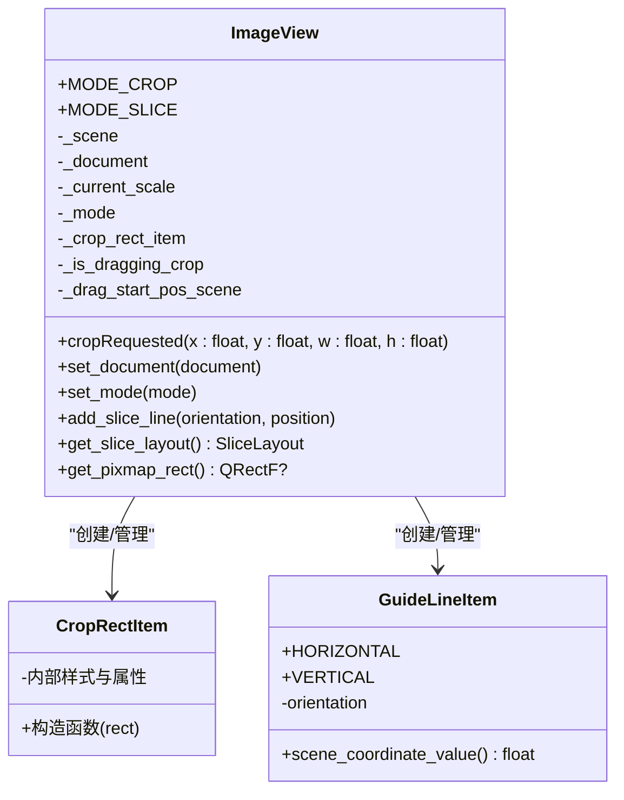
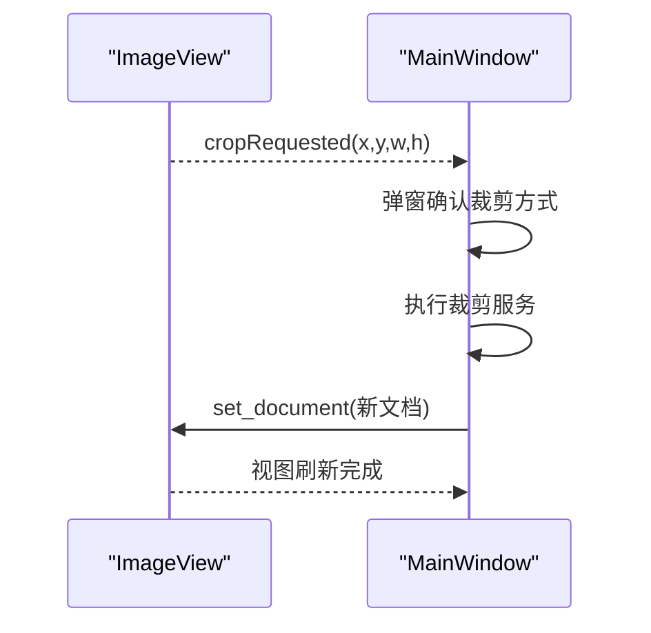
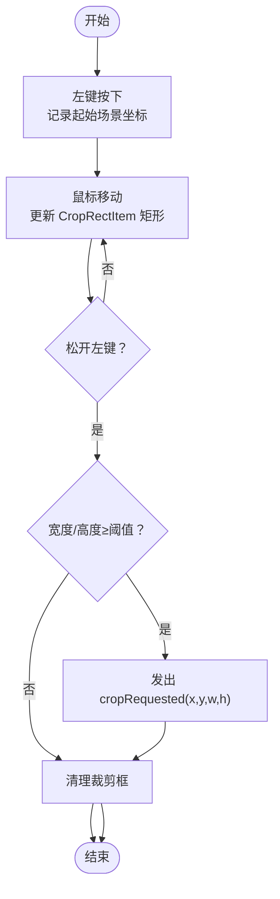
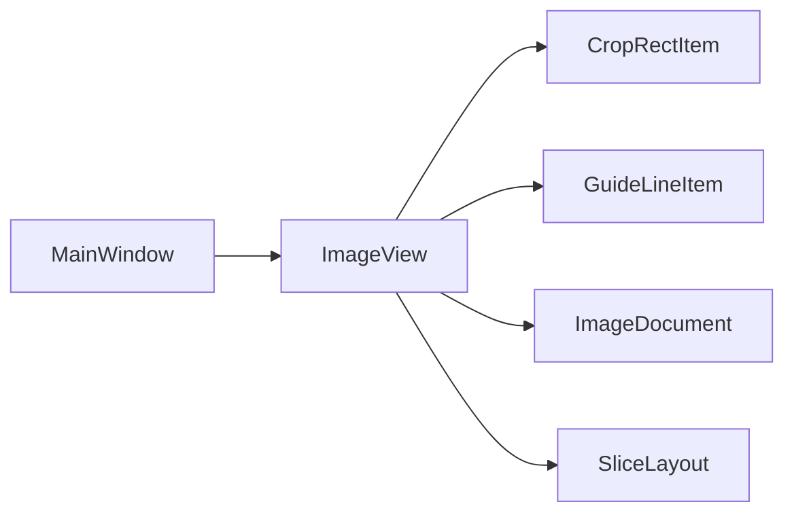

# 视图组件设计

<cite>
**本文引用的文件**
- [img_slicer_tool/views/image_view.py](file://img_slicer_tool/views/image_view.py)
- [img_slicer_tool/views/overlay_items.py](file://img_slicer_tool/views/overlay_items.py)
- [img_slicer_tool/app/main_window.py](file://img_slicer_tool/app/main_window.py)
- [img_slicer_tool/models/image_document.py](file://img_slicer_tool/models/image_document.py)
- [img_slicer_tool/models/slice_layout.py](file://img_slicer_tool/models/slice_layout.py)
- [img_slicer_tool/resources/qss/style.qss](file://img_slicer_tool/resources/qss/style.qss)
</cite>

## 目录
1. [简介](#简介)
2. [项目结构](#项目结构)
3. [核心组件](#核心组件)
4. [架构总览](#架构总览)
5. [详细组件分析](#详细组件分析)
6. [依赖关系分析](#依赖关系分析)
7. [性能考量](#性能考量)
8. [故障排查指南](#故障排查指南)
9. [结论](#结论)
10. [附录](#附录)

## 简介
本章节聚焦 PictureMaster 的 UI 视图层，系统性梳理 ImageView 如何基于 QGraphicsView 实现图像显示、缩放、平移与鼠标事件捕获；Overlay Items 中的 CropRectItem（可拖拽裁剪框）与 GuideLineItem（可编辑切图线）如何作为自定义图形项参与交互；以及这些组件通过信号（如 cropRequested）与 MainWindow 解耦通信的机制。同时说明 QSS 样式表（style.qss）如何统一控制应用外观主题，并给出可扩展的样式建议。

## 项目结构
- 视图层位于 views/：
  - image_view.py：自定义 ImageView，承载图像显示与交互逻辑
  - overlay_items.py：自定义图形项 CropRectItem 与 GuideLineItem
- 应用主窗口位于 app/main_window.py：负责菜单、动作、状态栏与业务流程编排
- 模型层位于 models/：
  - image_document.py：封装图像文档元数据与预览图
  - slice_layout.py：描述切图线布局并提供归一化与边界计算
- 样式资源位于 resources/qss/style.qss：当前为空，预留主题样式扩展

图表来源
- [img_slicer_tool/app/main_window.py](file://img_slicer_tool/app/main_window.py#L1-L120)
- [img_slicer_tool/views/image_view.py](file://img_slicer_tool/views/image_view.py#L1-L218)
- [img_slicer_tool/views/overlay_items.py](file://img_slicer_tool/views/overlay_items.py#L1-L57)
- [img_slicer_tool/models/image_document.py](file://img_slicer_tool/models/image_document.py#L1-L18)
- [img_slicer_tool/models/slice_layout.py](file://img_slicer_tool/models/slice_layout.py#L1-L30)
- [img_slicer_tool/resources/qss/style.qss](file://img_slicer_tool/resources/qss/style.qss#L1-L2)

章节来源
- [img_slicer_tool/app/main_window.py](file://img_slicer_tool/app/main_window.py#L1-L120)
- [img_slicer_tool/views/image_view.py](file://img_slicer_tool/views/image_view.py#L1-L60)
- [img_slicer_tool/views/overlay_items.py](file://img_slicer_tool/views/overlay_items.py#L1-L30)
- [img_slicer_tool/models/image_document.py](file://img_slicer_tool/models/image_document.py#L1-L18)
- [img_slicer_tool/models/slice_layout.py](file://img_slicer_tool/models/slice_layout.py#L1-L30)
- [img_slicer_tool/resources/qss/style.qss](file://img_slicer_tool/resources/qss/style.qss#L1-L2)

## 核心组件
- ImageView：继承 QGraphicsView，负责图像显示、缩放、平移、鼠标事件处理、裁剪请求信号发出、切图线管理与布局收集
- CropRectItem：自定义矩形图形项，用于绘制半透明填充与虚线边框的裁剪框
- GuideLineItem：自定义线段图形项，支持水平/垂直方向、可选中与可移动，用于切图线
- MainWindow：连接 ImageView 的信号，协调裁剪与切图流程，维护当前文档与输出路径
- ImageDocument：封装图像路径、尺寸、缩放比例与预览图
- SliceLayout：保存预览坐标系下的切图线集合，并提供归一化与边界计算

章节来源
- [img_slicer_tool/views/image_view.py](file://img_slicer_tool/views/image_view.py#L1-L218)
- [img_slicer_tool/views/overlay_items.py](file://img_slicer_tool/views/overlay_items.py#L1-L57)
- [img_slicer_tool/app/main_window.py](file://img_slicer_tool/app/main_window.py#L1-L120)
- [img_slicer_tool/models/image_document.py](file://img_slicer_tool/models/image_document.py#L1-L18)
- [img_slicer_tool/models/slice_layout.py](file://img_slicer_tool/models/slice_layout.py#L1-L30)

## 架构总览
下图展示 MainWindow 与 ImageView 的信号连接，以及 ImageView 内部与 Overlay Items 的协作关系。

图表来源
- [img_slicer_tool/app/main_window.py](file://img_slicer_tool/app/main_window.py#L60-L120)
- [img_slicer_tool/views/image_view.py](file://img_slicer_tool/views/image_view.py#L90-L175)
- [img_slicer_tool/views/overlay_items.py](file://img_slicer_tool/views/overlay_items.py#L8-L57)

## 详细组件分析

### ImageView 组件分析
- 继承与初始化
  - 继承 QGraphicsView，初始化场景、文档指针、当前缩放、模式（裁剪/切图）、裁剪矩形项等状态
  - 设置渲染提示、拖拽模式、锚点与视口更新策略
- 图像显示与场景管理
  - set_document：清空场景、重置变换、根据 ImageDocument 的预览图创建 QGraphicsPixmapItem 并设置场景矩形，使用 fitInView 适配显示
- 缩放与平移
  - 鼠标滚轮事件：按住 Ctrl 进行缩放，否则透传给父类
  - 空格键：切换为手型拖拽模式，释放空格恢复默认拖拽模式
- 鼠标事件与交互
  - 左键点击：在裁剪模式下创建 CropRectItem；在切图模式下根据修饰键组合决定生成水平/垂直线或两者
  - 鼠标拖动：实时更新 CropRectItem 的矩形
  - 鼠标释放：当裁剪框尺寸满足最小值时，发出 cropRequested 信号
  - Delete 键：删除选中的 GuideLineItem
- 切图线管理
  - add_slice_line：在指定位置添加水平或垂直 GuideLineItem
  - get_slice_layout：遍历场景中的 GuideLineItem，收集有效坐标，归一化并返回 SliceLayout
- 辅助方法
  - get_pixmap_rect：返回当前预览图的场景矩形
  - set_mode：切换裁剪/切图模式，清理裁剪矩形状态

图表来源
- [img_slicer_tool/views/image_view.py](file://img_slicer_tool/views/image_view.py#L1-L218)
- [img_slicer_tool/views/overlay_items.py](file://img_slicer_tool/views/overlay_items.py#L1-L57)

章节来源
- [img_slicer_tool/views/image_view.py](file://img_slicer_tool/views/image_view.py#L1-L218)
- [img_slicer_tool/models/image_document.py](file://img_slicer_tool/models/image_document.py#L1-L18)
- [img_slicer_tool/models/slice_layout.py](file://img_slicer_tool/models/slice_layout.py#L1-L30)

### CropRectItem 自定义图形项
- 功能定位：用于在裁剪模式下绘制半透明填充与虚线边框的矩形，作为用户拖拽选择区域的视觉反馈
- 样式要点：设置填充颜色与透明度、虚线笔触、Z 值高于切图线、禁用选择与移动标志位
- 交互配合：由 ImageView 在鼠标拖拽过程中动态更新其矩形，最终在释放时触发裁剪请求

章节来源
- [img_slicer_tool/views/overlay_items.py](file://img_slicer_tool/views/overlay_items.py#L8-L26)

### GuideLineItem 自定义图形项
- 功能定位：用于切图模式下的辅助线，支持水平/垂直两种方向
- 可编辑性：设置 ItemIsMovable 与 ItemIsSelectable，允许用户拖动与选中
- 坐标提取：scene_coordinate_value 提供场景坐标系下的中心坐标，便于后续归一化与边界计算
- 与 ImageView 协作：由 ImageView 在点击处创建并加入场景，随后被 MainWindow 收集为 SliceLayout

章节来源
- [img_slicer_tool/views/overlay_items.py](file://img_slicer_tool/views/overlay_items.py#L27-L57)
- [img_slicer_tool/views/image_view.py](file://img_slicer_tool/views/image_view.py#L176-L218)
- [img_slicer_tool/models/slice_layout.py](file://img_slicer_tool/models/slice_layout.py#L1-L30)

### 信号与交互解耦（cropRequested）
- ImageView 在裁剪完成后发出 cropRequested(x, y, w, h)，参数为预览坐标系下的矩形
- MainWindow 订阅该信号，弹窗确认裁剪方式（覆盖原图或另存为），调用裁剪服务并刷新视图
- 该设计将“视图层的交互”与“业务层的执行”解耦，提升模块内聚与可测试性

图表来源
- [img_slicer_tool/views/image_view.py](file://img_slicer_tool/views/image_view.py#L155-L175)
- [img_slicer_tool/app/main_window.py](file://img_slicer_tool/app/main_window.py#L110-L167)

章节来源
- [img_slicer_tool/views/image_view.py](file://img_slicer_tool/views/image_view.py#L155-L175)
- [img_slicer_tool/app/main_window.py](file://img_slicer_tool/app/main_window.py#L110-L167)

### 切图线收集与布局归一化
- ImageView.get_slice_layout 遍历场景中的 GuideLineItem，依据方向提取坐标并过滤到预览矩形范围内
- SliceLayout.normalize 对坐标进行去重、排序与范围过滤，get_boundaries 返回包含边界的坐标序列，便于切图服务生成切片

章节来源
- [img_slicer_tool/views/image_view.py](file://img_slicer_tool/views/image_view.py#L176-L218)
- [img_slicer_tool/models/slice_layout.py](file://img_slicer_tool/models/slice_layout.py#L1-L30)

### 鼠标拖拽裁剪流程（算法流程图）

图表来源
- [img_slicer_tool/views/image_view.py](file://img_slicer_tool/views/image_view.py#L93-L175)

## 依赖关系分析
- 组件耦合
  - ImageView 与 overlay_items：强耦合（直接实例化与管理 CropRectItem/GuideLineItem）
  - MainWindow 与 ImageView：弱耦合（通过信号/槽连接，不直接操作内部状态）
- 外部依赖
  - PySide6 的 QGraphicsView/QGraphicsScene/QGraphicsItem 体系
  - 业务服务：裁剪服务与切图服务由 MainWindow 调用
- 潜在风险
  - 若 overlay_items 的图形项行为变更，需同步评估 ImageView 的交互逻辑
  - 切图线坐标依赖预览图矩形，若预览图尺寸变化需确保归一化逻辑正确

图表来源
- [img_slicer_tool/app/main_window.py](file://img_slicer_tool/app/main_window.py#L1-L120)
- [img_slicer_tool/views/image_view.py](file://img_slicer_tool/views/image_view.py#L1-L218)
- [img_slicer_tool/views/overlay_items.py](file://img_slicer_tool/views/overlay_items.py#L1-L57)
- [img_slicer_tool/models/image_document.py](file://img_slicer_tool/models/image_document.py#L1-L18)
- [img_slicer_tool/models/slice_layout.py](file://img_slicer_tool/models/slice_layout.py#L1-L30)

章节来源
- [img_slicer_tool/app/main_window.py](file://img_slicer_tool/app/main_window.py#L1-L120)
- [img_slicer_tool/views/image_view.py](file://img_slicer_tool/views/image_view.py#L1-L218)
- [img_slicer_tool/views/overlay_items.py](file://img_slicer_tool/views/overlay_items.py#L1-L57)
- [img_slicer_tool/models/image_document.py](file://img_slicer_tool/models/image_document.py#L1-L18)
- [img_slicer_tool/models/slice_layout.py](file://img_slicer_tool/models/slice_layout.py#L1-L30)

## 性能考量
- 场景更新策略
  - 使用 SmartViewportUpdate，减少不必要的重绘
  - fitInView 后重置变换，避免累积缩放误差
- 事件处理
  - 缩放仅在 Ctrl 按下时生效，避免与滚动冲突
  - 空格切换手型拖拽，降低误操作概率
- 图形项管理
  - 裁剪框在释放后立即移除，避免场景中残留项
  - 切图线启用 ItemIsMovable/ItemIsSelectable，但不会影响渲染性能
- 数据结构
  - SliceLayout 使用集合去重与排序，时间复杂度 O(n log n)，适合中小规模切图线数量

[本节为通用性能建议，无需特定文件引用]

## 故障排查指南
- 无法缩放或平移
  - 确认 Ctrl 按下时滚轮缩放，空格键切换手型拖拽
  - 检查是否处于切图模式导致事件被拦截
- 裁剪无效
  - 确认裁剪框尺寸大于最小阈值
  - 确认 cropRequested 是否被 MainWindow 订阅
- 切图线不生效
  - 确认切图模式已开启
  - 确认 GuideLineItem 在预览矩形范围内
- 文档未加载
  - 确认 MainWindow.load_image 成功并调用 ImageView.set_document

章节来源
- [img_slicer_tool/views/image_view.py](file://img_slicer_tool/views/image_view.py#L59-L81)
- [img_slicer_tool/views/image_view.py](file://img_slicer_tool/views/image_view.py#L93-L175)
- [img_slicer_tool/app/main_window.py](file://img_slicer_tool/app/main_window.py#L110-L167)

## 结论
ImageView 通过 QGraphicsView 的事件体系实现了图像的缩放、平移与交互；CropRectItem 与 GuideLineItem 以自定义图形项形式提供直观的可视化反馈；MainWindow 通过信号与槽解耦了业务逻辑，使视图与业务层职责清晰。当前样式资源为空，建议在 style.qss 中集中定义主题色、控件样式与图标风格，以统一界面风格并便于维护。

[本节为总结性内容，无需特定文件引用]

## 附录

### QSS 样式表与主题扩展建议
- 当前状态：style.qss 为空，可用于集中定义全局样式
- 建议范围
  - 主题色：定义主色调、强调色、背景色、文本色
  - 控件样式：按钮、菜单、状态栏、对话框的统一风格
  - 图标与光标：为裁剪框与切图线提供一致的视觉反馈
- 应用方式
  - 在应用启动时加载 QSS 文件并设置到主窗口或全局样式
  - 保持与现有图形项颜色的一致性（例如裁剪框的半透明填充与虚线边框）

章节来源
- [img_slicer_tool/resources/qss/style.qss](file://img_slicer_tool/resources/qss/style.qss#L1-L2)