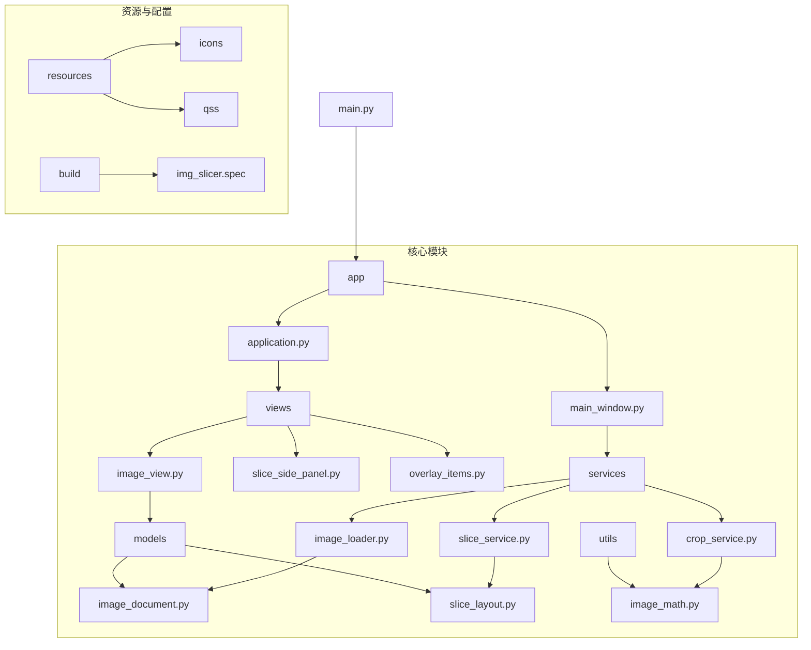
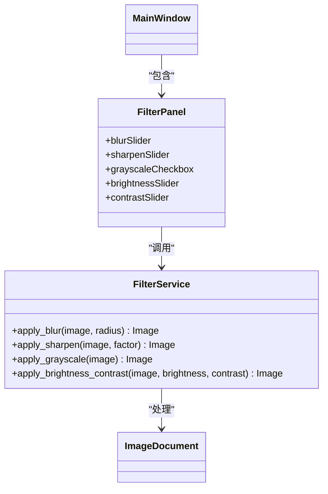
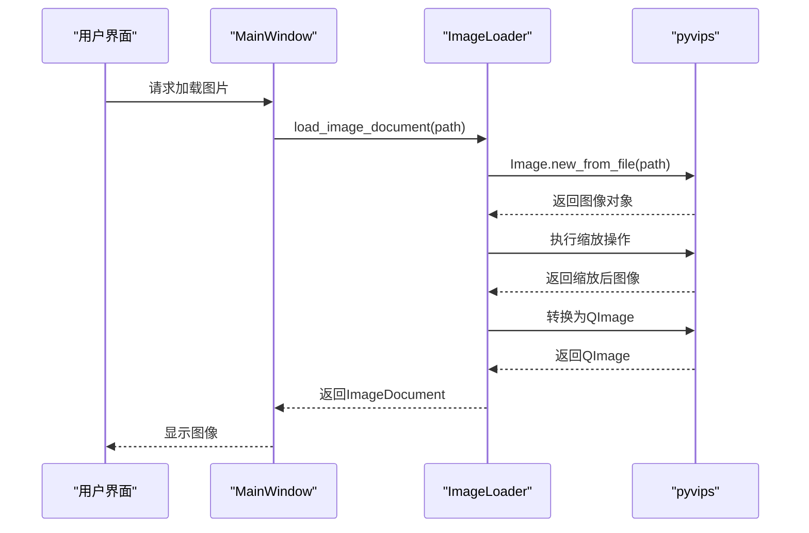
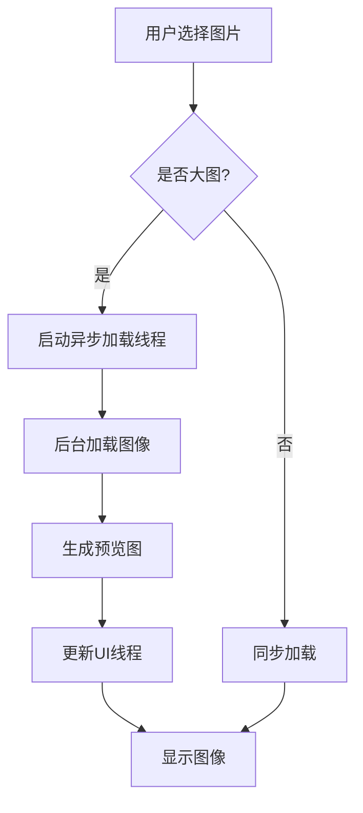
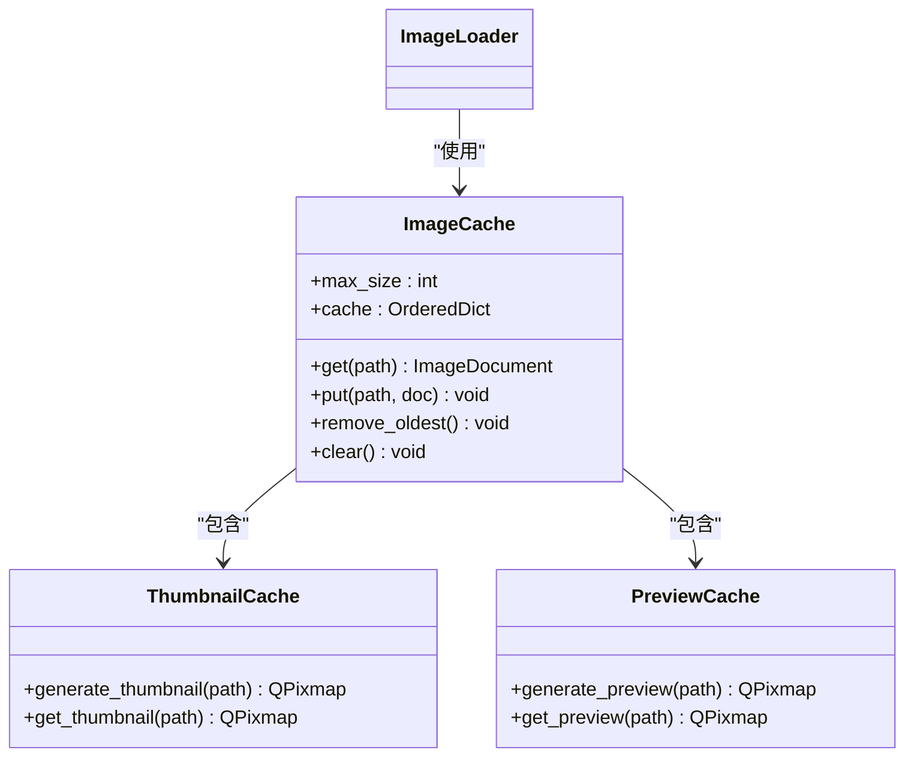
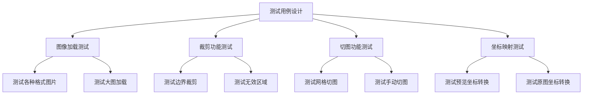
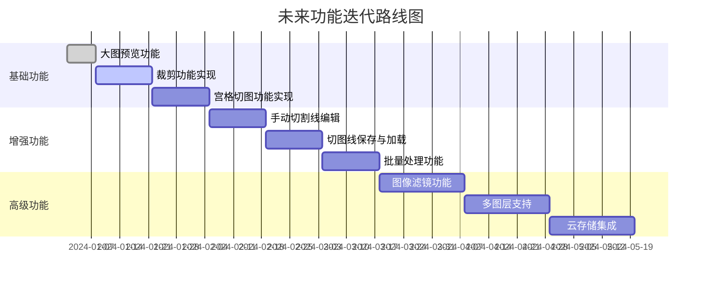

# 开发者指南

<cite>
**本文档引用的文件**  
- [main.py](file://img_slicer_tool/main.py)
- [requirements.txt](file://img_slicer_tool/requirements.txt)
- [application.py](file://img_slicer_tool/app/application.py)
- [main_window.py](file://img_slicer_tool/app/main_window.py)
- [image_view.py](file://img_slicer_tool/views/image_view.py)
- [image_document.py](file://img_slicer_tool/models/image_document.py)
- [image_loader.py](file://img_slicer_tool/services/image_loader.py)
- [crop_service.py](file://img_slicer_tool/services/crop_service.py)
- [slice_service.py](file://img_slicer_tool/services/slice_service.py)
- [slice_layout.py](file://img_slicer_tool/models/slice_layout.py)
- [slice_side_panel.py](file://img_slicer_tool/views/slice_side_panel.py)
- [overlay_items.py](file://img_slicer_tool/views/overlay_items.py)
- [image_math.py](file://img_slicer_tool/utils/image_math.py)
- [projectstart_task_card.md](file://task/projectstart_task_card.md)
</cite>

## 目录
1. [简介](#简介)
2. [项目结构](#项目结构)
3. [开发环境搭建](#开发环境搭建)
4. [代码贡献流程](#代码贡献流程)
5. [模块扩展建议](#模块扩展建议)
6. [性能优化方向](#性能优化方向)
7. [测试策略](#测试策略)
8. [未来功能迭代路径](#未来功能迭代路径)

## 简介
本指南旨在为新开发者提供快速上手与二次开发的全面指导。项目名为"大图裁剪&切图工具"，基于PySide6 + Pillow + pyvips技术栈构建，支持超大图（20k×20k）的裁剪和宫格切图功能。通过预览图机制实现大图流畅显示，提供直观的图形界面和丰富的交互功能。

## 项目结构
项目采用模块化设计，目录结构清晰，各组件职责分明：



**图示来源**
- [main.py](file://img_slicer_tool/main.py#L1-L13)
- [application.py](file://img_slicer_tool/app/application.py#L1-L35)
- [main_window.py](file://img_slicer_tool/app/main_window.py#L1-L364)

**本节来源**
- [img_slicer_tool](file://img_slicer_tool)
- [projectstart_task_card.md](file://task/projectstart_task_card.md#L35-L75)

## 开发环境搭建
### Python版本要求
项目要求使用 **Python 3.10+** 版本，确保兼容所有依赖库的最新特性。

### 虚拟环境创建
建议使用虚拟环境隔离项目依赖：

```bash
python -m venv venv
source venv/bin/activate  # Linux/Mac
venv\Scripts\activate     # Windows
```

### 依赖安装
项目依赖已定义在 `requirements.txt` 文件中，安装命令如下：

```bash
pip install -r requirements.txt
```

主要依赖包括：
- **PySide6==6.7.2**: GUI框架
- **Pillow==10.2.0**: 图像处理
- **pyvips==2.2.1**: 大图处理优化
- **numpy==1.26.4**: 数值计算
- **pyinstaller==6.3.0**: 打包工具
- **loguru==0.7.2**: 日志记录

### PySide6与Pillow验证方法
安装完成后，可通过以下简单脚本验证环境是否正常：

```python
# 验证PySide6
from PySide6.QtWidgets import QApplication, QLabel
app = QApplication([])
label = QLabel("PySide6 is working!")
label.show()
app.exec()

# 验证Pillow
from PIL import Image
img = Image.new('RGB', (100, 100), color='red')
img.save('test.png')
print("Pillow is working!")
```

**本节来源**
- [requirements.txt](file://img_slicer_tool/requirements.txt#L1-L14)
- [projectstart_task_card.md](file://task/projectstart_task_card.md#L26-L30)

## 代码贡献流程
### 分支管理
采用Git Flow工作流：
- `main` 分支：稳定版本
- `develop` 分支：集成开发
- `feature/*` 分支：功能开发
- `hotfix/*` 分支：紧急修复

### 代码风格
遵循PEP8规范，具体要求：
- 使用4个空格缩进
- 行长度不超过79字符
- 使用双引号表示字符串
- 函数和类定义前后各空两行
- 模块级常量使用大写字母

### 提交规范
提交信息采用约定式提交（Conventional Commits）格式：
```
<type>(<scope>): <subject>
<BLANK LINE>
<body>
<BLANK LINE>
<footer>
```

常用类型包括：
- `feat`: 新功能
- `fix`: 修复bug
- `docs`: 文档更新
- `style`: 代码格式调整
- `refactor`: 重构
- `test`: 测试相关
- `chore`: 构建过程或辅助工具变动

### PR审查要求
Pull Request审查标准：
1. 代码功能正确，满足需求
2. 符合代码风格规范
3. 包含必要的单元测试
4. 文档更新完整
5. 无新增的代码异味
6. 性能影响可接受

**本节来源**
- [projectstart_task_card.md](file://task/projectstart_task_card.md)

## 模块扩展建议
### 新增图像滤镜功能
可通过以下步骤实现：

1. 在 `services` 目录下创建 `filter_service.py`
2. 定义滤镜处理函数
3. 在 `views` 中添加滤镜控制UI
4. 在 `main_window.py` 中集成滤镜功能



**图示来源**
- [image_document.py](file://img_slicer_tool/models/image_document.py#L1-L18)
- [main_window.py](file://img_slicer_tool/app/main_window.py#L26-L364)

### 替换图像后端（从Pillow切换至pyvips）
为提升大图性能，可将图像处理后端从Pillow切换至pyvips：

1. 修改 `image_loader.py` 中的图像加载逻辑
2. 更新 `crop_service.py` 和 `slice_service.py` 的处理函数
3. 调整图像坐标映射算法



**图示来源**
- [image_loader.py](file://img_slicer_tool/services/image_loader.py#L1-L68)
- [main_window.py](file://img_slicer_tool/app/main_window.py#L103-L135)

**本节来源**
- [image_loader.py](file://img_slicer_tool/services/image_loader.py#L1-L68)
- [requirements.txt](file://img_slicer_tool/requirements.txt#L6)
- [projectstart_task_card.md](file://task/projectstart_task_card.md#L29)

## 性能优化方向
### 异步加载
当前图像加载为同步操作，可优化为异步加载，避免界面卡顿：



### 缓存机制
实现多级缓存策略提升性能：



**图示来源**
- [image_loader.py](file://img_slicer_tool/services/image_loader.py#L1-L68)
- [image_document.py](file://img_slicer_tool/models/image_document.py#L1-L18)

### 内存优化
针对超大图处理的内存优化策略：
- 使用流式处理而非全图加载
- 实现图像分块处理
- 及时释放不再使用的图像资源
- 采用内存映射技术

**本节来源**
- [image_loader.py](file://img_slicer_tool/services/image_loader.py#L11)
- [projectstart_task_card.md](file://task/projectstart_task_card.md#L14)

## 测试策略
### 单元测试
建议使用Python内置的 `unittest` 框架，覆盖核心功能：



### UI测试框架建议
推荐使用 `pytest-qt` 进行UI自动化测试：

```python
def test_load_image(qtbot):
    """测试图片加载功能"""
    window = MainWindow()
    qtbot.addWidget(window)
    
    # 模拟打开图片
    with qtbot.wait_signal(window._image_view.cropRequested, timeout=5000):
        # 执行打开图片操作
        pass
    
    # 验证图像是否正确加载
    assert window._image_view._document is not None

def test_crop_function(qtbot):
    """测试裁剪功能"""
    # 测试用例实现
    pass
```

**本节来源**
- [image_math.py](file://img_slicer_tool/utils/image_math.py#L1-L76)
- [crop_service.py](file://img_slicer_tool/services/crop_service.py#L1-L38)
- [slice_service.py](file://img_slicer_tool/services/slice_service.py#L1-L62)

## 未来功能迭代路径
根据 `projectstart_task_card.md` 中的任务规划，未来功能迭代路径如下：



具体迭代计划：
1. **第一阶段**：完成基础裁剪和宫格切图功能
2. **第二阶段**：实现手动切割线编辑和保存功能
3. **第三阶段**：增加批量处理和图像滤镜功能
4. **第四阶段**：支持多图层编辑和云存储集成

**本节来源**
- [projectstart_task_card.md](file://task/projectstart_task_card.md#L1-L627)
- [main_window.py](file://img_slicer_tool/app/main_window.py#L53-L68)
- [slice_service.py](file://img_slicer_tool/services/slice_service.py#L1-L62)