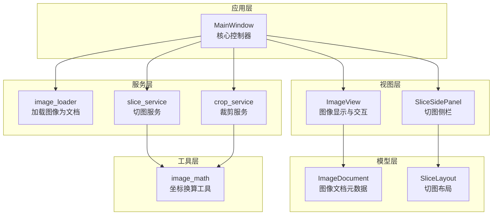
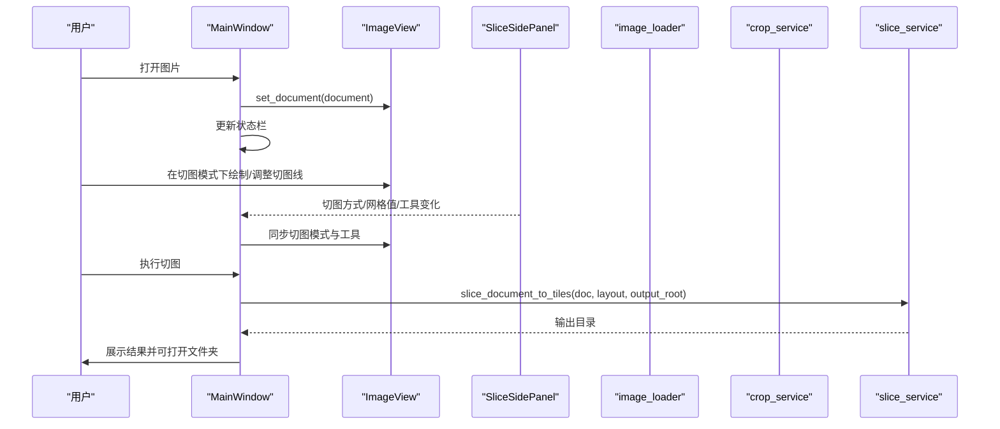
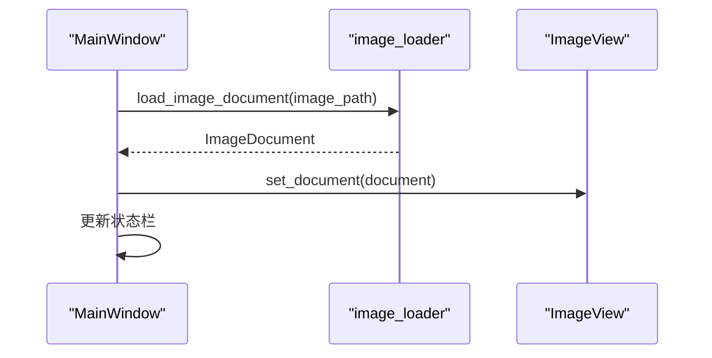
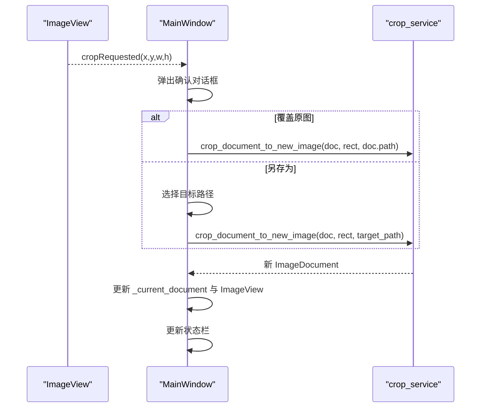
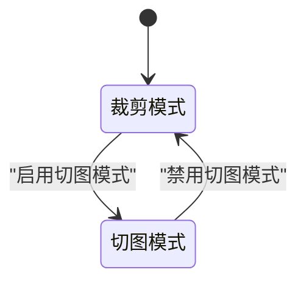
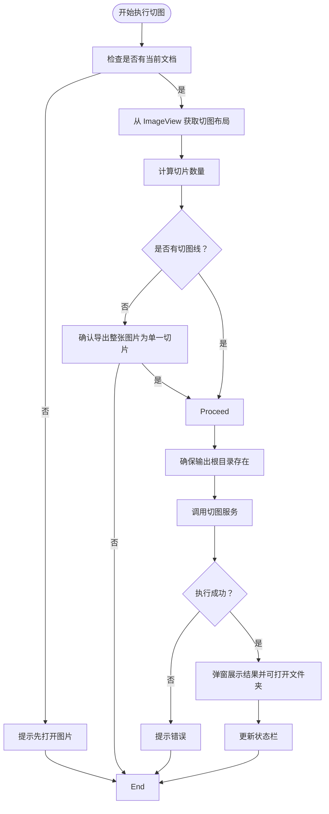
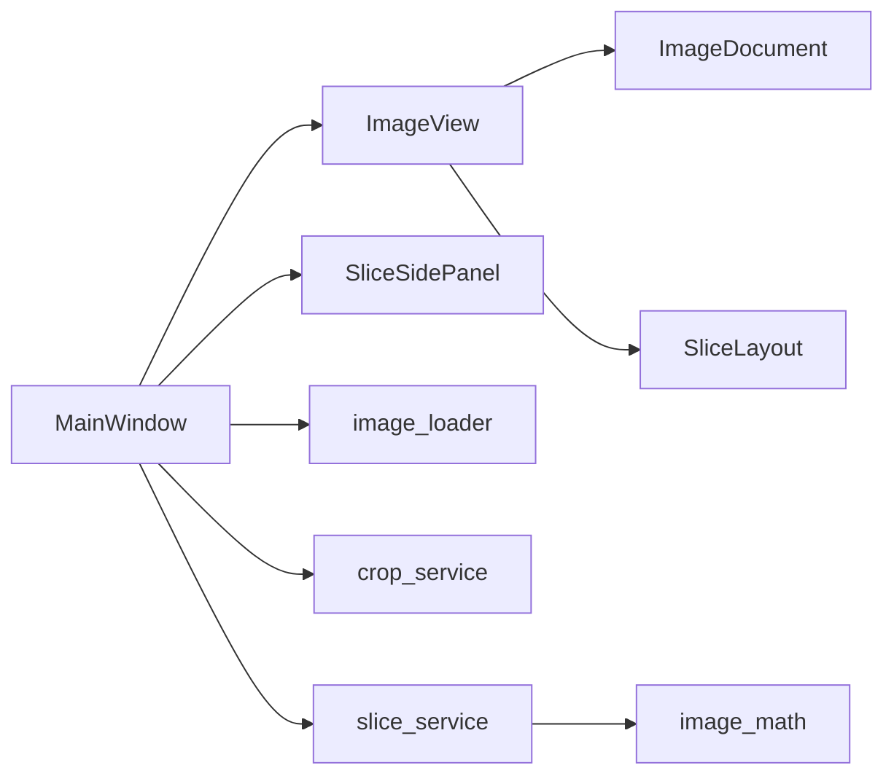

# 主窗口控制逻辑

<cite>
**本文引用的文件**
- [img_slicer_tool/app/main_window.py](file://img_slicer_tool/app/main_window.py)
- [img_slicer_tool/views/image_view.py](file://img_slicer_tool/views/image_view.py)
- [img_slicer_tool/views/slice_side_panel.py](file://img_slicer_tool/views/slice_side_panel.py)
- [img_slicer_tool/models/image_document.py](file://img_slicer_tool/models/image_document.py)
- [img_slicer_tool/models/slice_layout.py](file://img_slicer_tool/models/slice_layout.py)
- [img_slicer_tool/services/image_loader.py](file://img_slicer_tool/services/image_loader.py)
- [img_slicer_tool/services/crop_service.py](file://img_slicer_tool/services/crop_service.py)
- [img_slicer_tool/services/slice_service.py](file://img_slicer_tool/services/slice_service.py)
- [img_slicer_tool/utils/image_math.py](file://img_slicer_tool/utils/image_math.py)
</cite>

## 目录
1. [引言](#引言)
2. [项目结构](#项目结构)
3. [核心组件](#核心组件)
4. [架构总览](#架构总览)
5. [详细组件分析](#详细组件分析)
6. [依赖关系分析](#依赖关系分析)
7. [性能考虑](#性能考虑)
8. [故障排查指南](#故障排查指南)
9. [结论](#结论)

## 引言
本文件围绕 MainWindow 类作为应用核心控制器的技术实现进行深入解析，重点涵盖：
- 如何继承 QMainWindow 并构建 UI 界面（中央 ImageView 的设置、菜单栏与动作的创建）
- 私有方法 _create_actions、_create_menus、_connect_signals 的职责划分与调用关系
- load_image 方法如何协同 image_loader 服务加载 ImageDocument，并更新视图与状态栏
- _current_document 成员变量在裁剪与切图操作中的状态保持机制
- 普通模式与切图模式之间的状态转换流程
- 路径管理 _set_slice_output_root 的设计考量

## 项目结构
该模块采用“视图-模型-服务-工具”分层组织，MainWindow 作为顶层控制器协调视图与服务层，负责用户交互、状态管理和业务流程编排。

图表来源
- [img_slicer_tool/app/main_window.py](file://img_slicer_tool/app/main_window.py#L26-L110)
- [img_slicer_tool/views/image_view.py](file://img_slicer_tool/views/image_view.py#L24-L120)
- [img_slicer_tool/views/slice_side_panel.py](file://img_slicer_tool/views/slice_side_panel.py#L19-L60)
- [img_slicer_tool/models/image_document.py](file://img_slicer_tool/models/image_document.py#L8-L18)
- [img_slicer_tool/models/slice_layout.py](file://img_slicer_tool/models/slice_layout.py#L7-L30)
- [img_slicer_tool/services/image_loader.py](file://img_slicer_tool/services/image_loader.py#L24-L54)
- [img_slicer_tool/services/crop_service.py](file://img_slicer_tool/services/crop_service.py#L13-L38)
- [img_slicer_tool/services/slice_service.py](file://img_slicer_tool/services/slice_service.py#L12-L62)
- [img_slicer_tool/utils/image_math.py](file://img_slicer_tool/utils/image_math.py#L17-L76)

章节来源
- [img_slicer_tool/app/main_window.py](file://img_slicer_tool/app/main_window.py#L26-L110)

## 核心组件
- MainWindow：继承自 QMainWindow，负责初始化 UI、创建动作与菜单、连接信号槽、处理用户交互、协调服务层与视图层。
- ImageView：继承自 QGraphicsView，承载图像显示、裁剪框绘制、切图线绘制与交互（拖拽、删除、缩放、平移等）。
- SliceSidePanel：切图模式左侧工作栏，提供“网格生成”和“手动生成”两种切图方式，以及工具按钮与执行按钮。
- ImageDocument：数据类，封装图像路径、原始尺寸、预览尺寸、缩放比例与预览 QPixmap。
- SliceLayout：数据类，保存预览坐标系下的水平/垂直切图线集合，并提供归一化与边界提取能力。
- image_loader：加载本地图片为 ImageDocument，计算预览尺寸与缩放比。
- crop_service：根据预览矩形裁剪图像，返回新 ImageDocument。
- slice_service：根据 SliceLayout 将图像切分为多块并保存到指定目录。
- image_math：提供预览坐标到原图坐标的换算工具。

章节来源
- [img_slicer_tool/app/main_window.py](file://img_slicer_tool/app/main_window.py#L26-L110)
- [img_slicer_tool/views/image_view.py](file://img_slicer_tool/views/image_view.py#L24-L120)
- [img_slicer_tool/views/slice_side_panel.py](file://img_slicer_tool/views/slice_side_panel.py#L19-L60)
- [img_slicer_tool/models/image_document.py](file://img_slicer_tool/models/image_document.py#L8-L18)
- [img_slicer_tool/models/slice_layout.py](file://img_slicer_tool/models/slice_layout.py#L7-L30)
- [img_slicer_tool/services/image_loader.py](file://img_slicer_tool/services/image_loader.py#L24-L54)
- [img_slicer_tool/services/crop_service.py](file://img_slicer_tool/services/crop_service.py#L13-L38)
- [img_slicer_tool/services/slice_service.py](file://img_slicer_tool/services/slice_service.py#L12-L62)
- [img_slicer_tool/utils/image_math.py](file://img_slicer_tool/utils/image_math.py#L17-L76)

## 架构总览
MainWindow 作为控制器，通过以下方式组织系统：
- 初始化 UI：创建中央布局，左侧为 SliceSidePanel，右侧为主 ImageView；初始隐藏切图面板，绑定切图模式与线工具。
- 创建动作与菜单：文件（打开图片、设置切图保存路径、退出）、编辑（切图模式切换）、切图（按行列生成宫格线、执行切图）。
- 连接信号：将动作触发、视图事件、面板变更与 MainWindow 的处理方法绑定。
- 协同服务：load_image 使用 image_loader 加载 ImageDocument；裁剪使用 crop_service；切图使用 slice_service；坐标换算使用 image_math。

图表来源
- [img_slicer_tool/app/main_window.py](file://img_slicer_tool/app/main_window.py#L102-L135)
- [img_slicer_tool/views/image_view.py](file://img_slicer_tool/views/image_view.py#L65-L85)
- [img_slicer_tool/views/slice_side_panel.py](file://img_slicer_tool/views/slice_side_panel.py#L123-L174)
- [img_slicer_tool/services/slice_service.py](file://img_slicer_tool/services/slice_service.py#L12-L62)

## 详细组件分析

### MainWindow 类与 UI 构建
- 继承与初始化：MainWindow 继承自 QMainWindow，设置标题、窗口大小，并创建中央部件（左侧切图侧栏 + 右侧 ImageView），初始隐藏切图面板并将切图模式与线工具同步到 ImageView。
- 成员变量：
  - _image_view：主图像视图
  - _slice_panel：切图侧栏
  - _current_document：当前 ImageDocument，用于裁剪与切图的状态保持
  - _slice_output_root：切图输出根目录
  - _last_manual_tool：记录上次使用的手动工具类型
- 中央布局：左侧固定宽度的切图侧栏，右侧占满剩余空间的 ImageView。

章节来源
- [img_slicer_tool/app/main_window.py](file://img_slicer_tool/app/main_window.py#L26-L51)

### 动作与菜单创建（_create_actions/_create_menus）
- _create_actions：定义打开图片、退出、切图模式切换、按行列生成宫格线、执行切图、设置切图保存路径等动作，并设置快捷键。
- _create_menus：在菜单栏创建“文件”“编辑”“切图”三个菜单，分别加入上述动作。

章节来源
- [img_slicer_tool/app/main_window.py](file://img_slicer_tool/app/main_window.py#L52-L86)

### 信号连接（_connect_signals）
- 将动作触发、ImageView 的裁剪请求、拖拽事件、切图面板的模式/网格/工具变化与执行请求等信号连接到 MainWindow 的对应处理方法，形成完整的事件链路。

章节来源
- [img_slicer_tool/app/main_window.py](file://img_slicer_tool/app/main_window.py#L87-L101)

### 图像加载与状态更新（load_image）
- load_image 接收本地图片路径，检查存在性，调用 image_loader.load_image_document 获取 ImageDocument，然后：
  - 设置 ImageView 文档并更新 _current_document
  - 在状态栏显示文件名、原始尺寸、预览尺寸信息
- 该方法是裁剪与切图流程的入口，确保后续操作基于同一 ImageDocument。

图表来源
- [img_slicer_tool/app/main_window.py](file://img_slicer_tool/app/main_window.py#L114-L135)
- [img_slicer_tool/services/image_loader.py](file://img_slicer_tool/services/image_loader.py#L24-L54)
- [img_slicer_tool/views/image_view.py](file://img_slicer_tool/views/image_view.py#L65-L85)

章节来源
- [img_slicer_tool/app/main_window.py](file://img_slicer_tool/app/main_window.py#L114-L135)
- [img_slicer_tool/services/image_loader.py](file://img_slicer_tool/services/image_loader.py#L24-L54)
- [img_slicer_tool/views/image_view.py](file://img_slicer_tool/views/image_view.py#L65-L85)

### 裁剪流程（_on_crop_requested）
- 当用户在 ImageView 上拖拽选择区域并释放时，会触发 cropRequested 信号，MainWindow 收到后弹出确认对话框，询问覆盖原图或另存为。
- 根据选择调用 crop_service.croop_document_to_new_image，得到新的 ImageDocument 并更新当前文档与视图，同时更新状态栏。

图表来源
- [img_slicer_tool/app/main_window.py](file://img_slicer_tool/app/main_window.py#L136-L193)
- [img_slicer_tool/services/crop_service.py](file://img_slicer_tool/services/crop_service.py#L13-L38)
- [img_slicer_tool/views/image_view.py](file://img_slicer_tool/views/image_view.py#L223-L233)

章节来源
- [img_slicer_tool/app/main_window.py](file://img_slicer_tool/app/main_window.py#L136-L193)
- [img_slicer_tool/services/crop_service.py](file://img_slicer_tool/services/crop_service.py#L13-L38)
- [img_slicer_tool/views/image_view.py](file://img_slicer_tool/views/image_view.py#L223-L233)

### 切图模式切换与状态保持（_on_toggle_slice_mode）
- 切图模式切换时：
  - 进入切图模式：设置 ImageView 为切图模式，显示切图侧栏，同步切图模式与线工具
  - 退出切图模式：恢复裁剪模式，隐藏切图侧栏
- 状态栏提示切换结果；_current_document 保持不变，确保后续切图操作可用。

图表来源
- [img_slicer_tool/app/main_window.py](file://img_slicer_tool/app/main_window.py#L194-L203)
- [img_slicer_tool/views/image_view.py](file://img_slicer_tool/views/image_view.py#L117-L128)

章节来源
- [img_slicer_tool/app/main_window.py](file://img_slicer_tool/app/main_window.py#L194-L203)
- [img_slicer_tool/views/image_view.py](file://img_slicer_tool/views/image_view.py#L117-L128)

### 宫格线生成（_on_generate_grid_from_rows_cols）
- 从行数与列数输入生成宫格线，自动进入切图模式，设置切图工作模式为“grid”，并在 ImageView 与侧栏上同步网格参数，最后在状态栏提示生成结果。

章节来源
- [img_slicer_tool/app/main_window.py](file://img_slicer_tool/app/main_window.py#L210-L229)
- [img_slicer_tool/views/image_view.py](file://img_slicer_tool/views/image_view.py#L265-L294)
- [img_slicer_tool/views/slice_side_panel.py](file://img_slicer_tool/views/slice_side_panel.py#L123-L140)

### 手动切图与工具切换（_on_slice_work_mode_changed/_on_line_tool_changed）
- _on_slice_work_mode_changed：在“手动”与“网格”之间切换，若从网格切换到手动且存在切图线，会提示是否清除现有网格线；切换后同步 ImageView 的工作模式与工具。
- _on_line_tool_changed：记录上次手动工具类型，当处于手动模式时更新状态栏提示。

章节来源
- [img_slicer_tool/app/main_window.py](file://img_slicer_tool/app/main_window.py#L263-L310)
- [img_slicer_tool/views/image_view.py](file://img_slicer_tool/views/image_view.py#L265-L294)
- [img_slicer_tool/views/slice_side_panel.py](file://img_slicer_tool/views/slice_side_panel.py#L149-L174)

### 网格值变化（_on_grid_values_changed）
- 当网格模式下网格值变化时，同步更新 ImageView 的网格尺寸，并在状态栏提示当前网格规模。

章节来源
- [img_slicer_tool/app/main_window.py](file://img_slicer_tool/app/main_window.py#L295-L299)
- [img_slicer_tool/views/image_view.py](file://img_slicer_tool/views/image_view.py#L289-L294)

### 执行切图（_on_execute_slice）
- 校验当前是否存在 ImageDocument；若无则提示先打开图片。
- 从 ImageView 获取 SliceLayout，计算切片数量；若没有切图线，弹窗确认是否导出整张图片为单一切片。
- 若未设置输出根目录，则默认使用当前图片所在目录并缓存到 _slice_output_root。
- 调用 slice_service.slice_document_to_tiles 执行切图，捕获异常并提示错误；完成后弹窗展示结果并可打开输出文件夹，同时更新状态栏。

图表来源
- [img_slicer_tool/app/main_window.py](file://img_slicer_tool/app/main_window.py#L230-L262)
- [img_slicer_tool/services/slice_service.py](file://img_slicer_tool/services/slice_service.py#L12-L62)
- [img_slicer_tool/utils/image_math.py](file://img_slicer_tool/utils/image_math.py#L50-L76)

章节来源
- [img_slicer_tool/app/main_window.py](file://img_slicer_tool/app/main_window.py#L230-L262)
- [img_slicer_tool/services/slice_service.py](file://img_slicer_tool/services/slice_service.py#L12-L62)
- [img_slicer_tool/utils/image_math.py](file://img_slicer_tool/utils/image_math.py#L50-L76)

### 路径管理（_on_set_slice_output_dir）
- 通过文件对话框选择切图保存根目录，若用户选择了目录则更新 _slice_output_root，并在状态栏提示当前路径。

章节来源
- [img_slicer_tool/app/main_window.py](file://img_slicer_tool/app/main_window.py#L204-L209)

### 模式切换与状态保持机制
- _current_document：贯穿裁剪与切图流程，确保每次操作都基于同一图像文档，避免重复加载带来的性能损耗与状态不一致。
- ImageView 的 set_mode 与 set_slice_work_mode：在不同模式间切换时清理临时状态（如裁剪矩形、拖拽状态），保证 UI 一致性。
- 切图面板与 ImageView 的双向同步：通过信号槽确保面板与视图的模式、网格与工具保持一致。

章节来源
- [img_slicer_tool/app/main_window.py](file://img_slicer_tool/app/main_window.py#L194-L203)
- [img_slicer_tool/views/image_view.py](file://img_slicer_tool/views/image_view.py#L117-L128)
- [img_slicer_tool/views/slice_side_panel.py](file://img_slicer_tool/views/slice_side_panel.py#L123-L174)

## 依赖关系分析
- 控制器依赖视图与服务：
  - MainWindow 依赖 ImageView 与 SliceSidePanel 进行 UI 交互
  - MainWindow 依赖 image_loader、crop_service、slice_service 提供业务能力
  - 切图服务依赖 image_math 进行坐标换算
- 数据模型：
  - ImageDocument 由 image_loader 构造，被 ImageView 与服务层广泛使用
  - SliceLayout 由 ImageView 汇聚切图线，被 slice_service 使用

图表来源
- [img_slicer_tool/app/main_window.py](file://img_slicer_tool/app/main_window.py#L26-L110)
- [img_slicer_tool/views/image_view.py](file://img_slicer_tool/views/image_view.py#L24-L120)
- [img_slicer_tool/views/slice_side_panel.py](file://img_slicer_tool/views/slice_side_panel.py#L19-L60)
- [img_slicer_tool/models/image_document.py](file://img_slicer_tool/models/image_document.py#L8-L18)
- [img_slicer_tool/models/slice_layout.py](file://img_slicer_tool/models/slice_layout.py#L7-L30)
- [img_slicer_tool/services/image_loader.py](file://img_slicer_tool/services/image_loader.py#L24-L54)
- [img_slicer_tool/services/crop_service.py](file://img_slicer_tool/services/crop_service.py#L13-L38)
- [img_slicer_tool/services/slice_service.py](file://img_slicer_tool/services/slice_service.py#L12-L62)
- [img_slicer_tool/utils/image_math.py](file://img_slicer_tool/utils/image_math.py#L17-L76)

## 性能考虑
- 预览尺寸与缩放：image_loader 在加载时计算预览尺寸与缩放比，避免直接加载大图导致内存与渲染压力过大。
- 事件驱动与最小刷新：ImageView 仅在必要时更新切图线与裁剪矩形，减少不必要的重绘。
- 切图前的边界校验：SliceLayout.normalize 与 image_math 的边界换算确保切图区域有效，避免无效切片产生。

章节来源
- [img_slicer_tool/services/image_loader.py](file://img_slicer_tool/services/image_loader.py#L14-L21)
- [img_slicer_tool/models/slice_layout.py](file://img_slicer_tool/models/slice_layout.py#L14-L18)
- [img_slicer_tool/utils/image_math.py](file://img_slicer_tool/utils/image_math.py#L50-L76)

## 故障排查指南
- 打开图片失败：检查文件路径是否存在；查看状态栏错误提示；确认文件格式受支持。
- 裁剪失败：确认裁剪区域有效；检查覆盖原图或另存为路径是否可写；查看错误对话框提示。
- 切图失败：确认已设置输出根目录；检查是否存在有效切图线；查看错误对话框提示。
- 拖拽图片无效：确认拖拽的是本地图片文件且扩展名为受支持格式。

章节来源
- [img_slicer_tool/app/main_window.py](file://img_slicer_tool/app/main_window.py#L114-L135)
- [img_slicer_tool/app/main_window.py](file://img_slicer_tool/app/main_window.py#L136-L193)
- [img_slicer_tool/app/main_window.py](file://img_slicer_tool/app/main_window.py#L230-L262)
- [img_slicer_tool/views/image_view.py](file://img_slicer_tool/views/image_view.py#L141-L153)

## 结论
MainWindow 以清晰的职责划分与事件驱动的方式，将视图、模型与服务层有机整合，实现了从图像加载、裁剪到切图的完整工作流。通过 _current_document 的状态保持、切图模式与工具的双向同步、以及路径管理策略，系统在易用性与稳定性方面表现良好。建议在后续迭代中进一步增强错误恢复与批量处理能力，以提升用户体验。