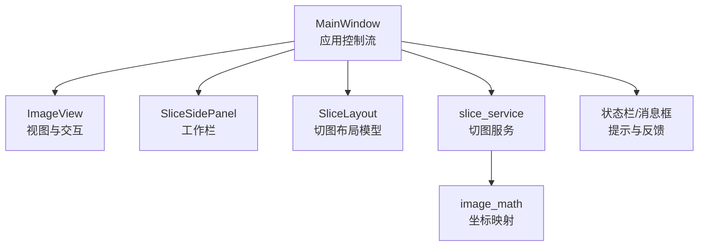
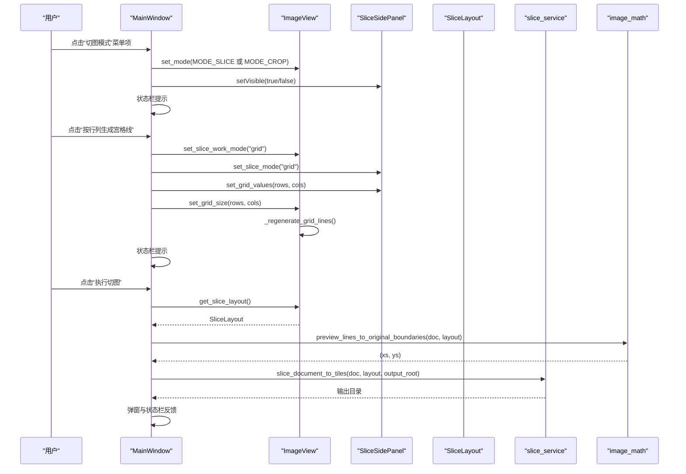
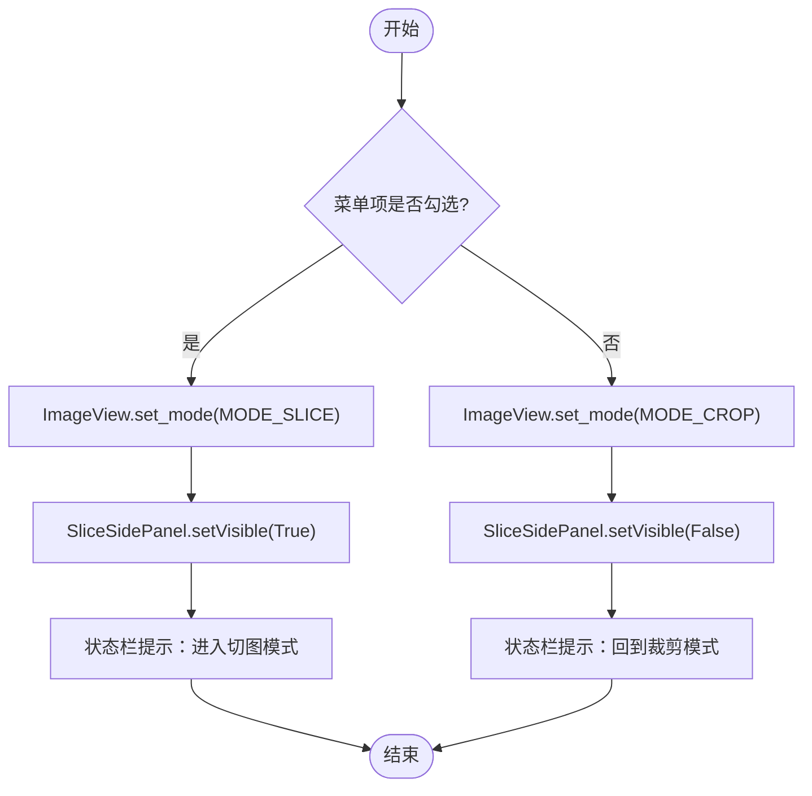
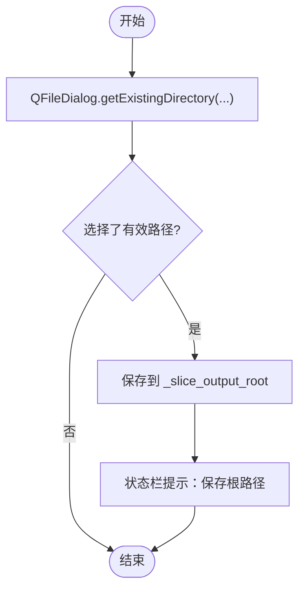
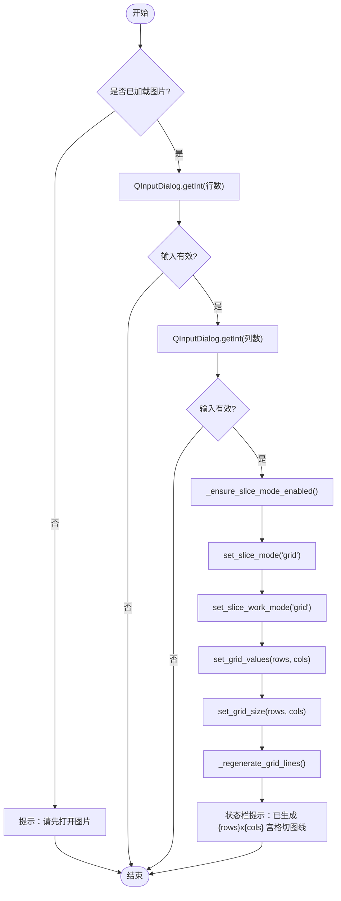
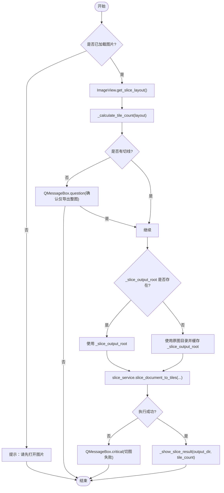
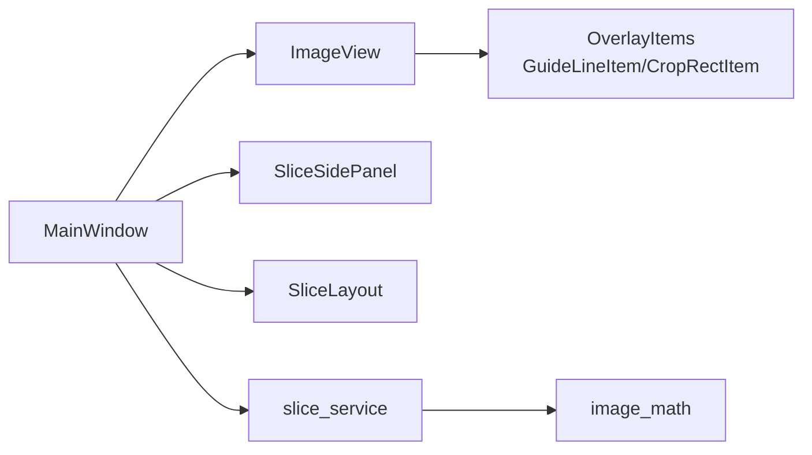

# 切图模式管理

<cite>
**本文引用的文件**
- [main_window.py](file://img_slicer_tool/app/main_window.py)
- [image_view.py](file://img_slicer_tool/views/image_view.py)
- [slice_service.py](file://img_slicer_tool/services/slice_service.py)
- [slice_layout.py](file://img_slicer_tool/models/slice_layout.py)
- [slice_side_panel.py](file://img_slicer_tool/views/slice_side_panel.py)
- [image_math.py](file://img_slicer_tool/utils/image_math.py)
</cite>

## 目录
1. [简介](#简介)
2. [项目结构](#项目结构)
3. [核心组件](#核心组件)
4. [架构总览](#架构总览)
5. [详细组件分析](#详细组件分析)
6. [依赖关系分析](#依赖关系分析)
7. [性能考量](#性能考量)
8. [故障排查指南](#故障排查指南)
9. [结论](#结论)

## 简介
本节聚焦于 MainWindow 类对“切图模式”的管理能力，围绕以下四个关键方法展开：
- _on_toggle_slice_mode：响应菜单项切换，驱动 ImageView 在裁剪模式与切图模式之间切换，并通过状态栏提示当前模式。
- _on_set_slice_output_dir：引导用户选择切图输出根目录，保存至 MainWindow 的成员变量以便后续执行切图时使用。
- _on_generate_grid_from_rows_cols：基于用户输入的行列数，计算宫格线间隔并在预览图上添加水平与垂直切图线。
- _on_execute_slice：汇总当前文档与切图布局，处理无切线时的用户确认，确定输出目录，调用切图服务并反馈结果。

## 项目结构
该功能涉及的主要模块如下：
- 应用层：MainWindow 负责菜单、动作、状态栏与业务流程编排。
- 视图层：ImageView 提供图像显示、交互与切图线管理；SliceSidePanel 提供切图工作栏（网格/手动模式、行列设置、工具选择）。
- 模型层：SliceLayout 描述预览坐标系下的切图线集合。
- 服务层：slice_service 执行实际的切图与文件写入。
- 工具层：image_math 提供预览坐标到原图坐标的映射。

图表来源
- [main_window.py](file://img_slicer_tool/app/main_window.py#L194-L262)
- [image_view.py](file://img_slicer_tool/views/image_view.py#L24-L542)
- [slice_side_panel.py](file://img_slicer_tool/views/slice_side_panel.py#L1-L174)
- [slice_layout.py](file://img_slicer_tool/models/slice_layout.py#L1-L30)
- [slice_service.py](file://img_slicer_tool/services/slice_service.py#L1-L62)
- [image_math.py](file://img_slicer_tool/utils/image_math.py#L1-L76)

章节来源
- [main_window.py](file://img_slicer_tool/app/main_window.py#L1-L120)
- [image_view.py](file://img_slicer_tool/views/image_view.py#L1-L120)
- [slice_side_panel.py](file://img_slicer_tool/views/slice_side_panel.py#L1-L80)
- [slice_layout.py](file://img_slicer_tool/models/slice_layout.py#L1-L30)
- [slice_service.py](file://img_slicer_tool/services/slice_service.py#L1-L30)
- [image_math.py](file://img_slicer_tool/utils/image_math.py#L1-L40)

## 核心组件
- MainWindow：负责菜单创建、动作绑定、状态栏提示、与服务层交互。
- ImageView：负责图像展示、裁剪/切图模式切换、切图线的增删改查、网格自动生成。
- SliceSidePanel：提供切图方式（网格/手动）、行列设置、工具选择等 UI 控件与信号。
- SliceLayout：描述预览坐标系下的水平/垂直切图线集合，并提供标准化与边界提取。
- slice_service：执行切图，将每个切片保存到磁盘，返回输出目录。
- image_math：提供预览坐标到原图坐标的映射，确保切图边界准确落在原图像素网格上。

章节来源
- [main_window.py](file://img_slicer_tool/app/main_window.py#L194-L262)
- [image_view.py](file://img_slicer_tool/views/image_view.py#L24-L120)
- [slice_side_panel.py](file://img_slicer_tool/views/slice_side_panel.py#L1-L80)
- [slice_layout.py](file://img_slicer_tool/models/slice_layout.py#L1-L30)
- [slice_service.py](file://img_slicer_tool/services/slice_service.py#L1-L30)
- [image_math.py](file://img_slicer_tool/utils/image_math.py#L49-L76)

## 架构总览
下图展示了从菜单触发到切图执行的端到端流程，包括 MainWindow 如何协调各组件以及数据在各层之间的传递。

图表来源
- [main_window.py](file://img_slicer_tool/app/main_window.py#L194-L262)
- [image_view.py](file://img_slicer_tool/views/image_view.py#L236-L304)
- [slice_side_panel.py](file://img_slicer_tool/views/slice_side_panel.py#L123-L174)
- [slice_service.py](file://img_slicer_tool/services/slice_service.py#L12-L62)
- [image_math.py](file://img_slicer_tool/utils/image_math.py#L50-L76)

## 详细组件分析

### 方法一：_on_toggle_slice_mode（切换切图/裁剪模式）
- 功能要点
  - 当菜单项被勾选时，切换到切图模式，显示切图侧栏；未勾选时回到裁剪模式，隐藏侧栏。
  - 通过状态栏给出明确提示，帮助用户理解当前工作模式。
- 关键调用链
  - 触发源：菜单项的 toggled 信号。
  - 调用链路：MainWindow._on_toggle_slice_mode -> ImageView.set_mode -> 切换内部状态与 UI 反馈。
- 错误处理与边界
  - 未加载图片时不会影响切换逻辑，但后续操作会进行提示。
- 性能与可用性
  - 仅切换模式与可见性，开销极低；状态栏提示有助于降低误操作风险。

图表来源
- [main_window.py](file://img_slicer_tool/app/main_window.py#L194-L203)
- [image_view.py](file://img_slicer_tool/views/image_view.py#L117-L128)
- [slice_side_panel.py](file://img_slicer_tool/views/slice_side_panel.py#L123-L134)

章节来源
- [main_window.py](file://img_slicer_tool/app/main_window.py#L194-L203)
- [image_view.py](file://img_slicer_tool/views/image_view.py#L117-L128)

### 方法二：_on_set_slice_output_dir（设置切图保存根目录）
- 功能要点
  - 使用系统文件对话框选择目录，将路径保存在 MainWindow._slice_output_root 中，供后续执行切图使用。
  - 成功选择后通过状态栏提示当前保存根路径。
- 关键调用链
  - 触发源：菜单项“设置切图保存路径...”。
  - 调用链路：QFileDialog.getExistingDirectory -> MainWindow._slice_output_root -> 状态栏提示。
- 错误处理与边界
  - 用户取消选择时不做任何更改。
- 性能与可用性
  - 仅一次对话框交互，无额外 IO 开销。

图表来源
- [main_window.py](file://img_slicer_tool/app/main_window.py#L204-L209)

章节来源
- [main_window.py](file://img_slicer_tool/app/main_window.py#L204-L209)

### 方法三：_on_generate_grid_from_rows_cols（按行列生成宫格线）
- 功能要点
  - 通过两个 QInputDialog 获取行数与列数（范围限制在 1~100）。
  - 自动启用切图模式并切换到“网格模式”，更新工作栏与 ImageView 的网格大小。
  - 通过 ImageView._regenerate_grid_lines 在预览图上生成水平与垂直切图线。
  - 通过状态栏提示生成的宫格规模。
- 关键调用链
  - 触发源：菜单项“按行列生成宫格线”。
  - 调用链路：QInputDialog.getInt -> MainWindow._ensure_slice_mode_enabled -> SliceSidePanel.set_slice_mode("grid") -> ImageView.set_slice_work_mode("grid") -> SliceSidePanel.set_grid_values -> ImageView.set_grid_size -> ImageView._regenerate_grid_lines。
- 错误处理与边界
  - 未加载图片时直接提示并返回。
  - 用户取消任一输入框均终止流程。
- 性能与可用性
  - 生成宫格线为纯内存操作，复杂度与行列数成正比；状态栏即时反馈提升交互体验。

图表来源
- [main_window.py](file://img_slicer_tool/app/main_window.py#L210-L229)
- [image_view.py](file://img_slicer_tool/views/image_view.py#L265-L304)
- [slice_side_panel.py](file://img_slicer_tool/views/slice_side_panel.py#L123-L139)

章节来源
- [main_window.py](file://img_slicer_tool/app/main_window.py#L210-L229)
- [image_view.py](file://img_slicer_tool/views/image_view.py#L441-L466)

### 方法四：_on_execute_slice（执行切图）
- 功能要点
  - 校验当前文档是否存在；若无则提示并返回。
  - 从 ImageView 获取 SliceLayout；根据布局计算切片数量。
  - 若布局中无任何切线，弹出确认对话框，用户拒绝则终止。
  - 确定输出目录：优先使用 MainWindow._slice_output_root，若为空则回退到原图所在目录并缓存。
  - 调用 slice_service.slice_document_to_tiles 执行切图，捕获异常并提示。
  - 通过消息框与状态栏反馈切图结果（切片数量与输出目录），并可一键打开输出文件夹。
- 关键调用链
  - 触发源：菜单项“执行切图”或工作栏按钮。
  - 调用链路：MainWindow._on_execute_slice -> ImageView.get_slice_layout -> image_math.preview_lines_to_original_boundaries -> slice_service.slice_document_to_tiles -> MainWindow._show_slice_result。
- 错误处理与边界
  - 无切线时的二次确认避免误操作。
  - 输出目录为空时自动回退到原图目录并缓存，减少重复选择。
  - 切图过程异常统一捕获并提示。
- 性能与可用性
  - 切图服务按宫格遍历裁剪并保存，时间复杂度与切片数量成正比；JPEG 优化参数保证质量与体积平衡。

图表来源
- [main_window.py](file://img_slicer_tool/app/main_window.py#L230-L262)
- [image_view.py](file://img_slicer_tool/views/image_view.py#L236-L254)
- [slice_service.py](file://img_slicer_tool/services/slice_service.py#L12-L62)
- [image_math.py](file://img_slicer_tool/utils/image_math.py#L50-L76)

章节来源
- [main_window.py](file://img_slicer_tool/app/main_window.py#L230-L262)
- [image_view.py](file://img_slicer_tool/views/image_view.py#L236-L254)
- [slice_service.py](file://img_slicer_tool/services/slice_service.py#L12-L62)
- [image_math.py](file://img_slicer_tool/utils/image_math.py#L50-L76)

## 依赖关系分析
- 组件耦合
  - MainWindow 对 ImageView、SliceSidePanel、SliceLayout、slice_service、image_math 存在直接依赖，承担编排职责。
  - ImageView 内部维护切图线集合与网格生成逻辑，与 OverlayItems 协作渲染。
  - SliceLayout 作为纯数据结构，提供标准化与边界提取。
  - slice_service 依赖 PIL 进行图像裁剪与保存。
- 信号与槽
  - MainWindow 通过信号连接 ImageView 与 SliceSidePanel 的事件，形成松耦合的交互。
- 外部依赖
  - PyQt6（PySide6）用于 GUI；Pillow 用于图像处理。

图表来源
- [main_window.py](file://img_slicer_tool/app/main_window.py#L87-L101)
- [image_view.py](file://img_slicer_tool/views/image_view.py#L1-L60)
- [slice_service.py](file://img_slicer_tool/services/slice_service.py#L1-L20)
- [image_math.py](file://img_slicer_tool/utils/image_math.py#L1-L20)

章节来源
- [main_window.py](file://img_slicer_tool/app/main_window.py#L87-L101)
- [image_view.py](file://img_slicer_tool/views/image_view.py#L1-L60)
- [slice_service.py](file://img_slicer_tool/services/slice_service.py#L1-L20)
- [image_math.py](file://img_slicer_tool/utils/image_math.py#L1-L20)

## 性能考量
- 切图复杂度
  - 切片数量与行列数近似成正比，建议合理设置行列数以控制输出规模。
- 坐标映射
  - 预览坐标到原图坐标的映射采用四舍五入与边界裁剪，确保像素级精度。
- 文件写入
  - JPEG 保存时设置质量与子采样参数，兼顾质量与体积；PNG 等其他格式保持默认策略。
- UI 响应
  - 切图过程在后台执行，完成后统一反馈，避免阻塞主线程。

## 故障排查指南
- 无法生成宫格线
  - 检查是否已加载图片且已启用切图模式；确认行列输入有效。
- 执行切图无输出
  - 确认已设置切图保存根目录或允许回退到原图目录；检查输出目录权限。
- 切图失败
  - 查看错误提示窗口；确认原图文件存在且可读；检查布局是否有效。
- 无切线时误操作
  - 系统会在无切线时弹出确认对话框，请谨慎选择“继续”。

章节来源
- [main_window.py](file://img_slicer_tool/app/main_window.py#L230-L262)
- [image_view.py](file://img_slicer_tool/views/image_view.py#L236-L304)
- [slice_service.py](file://img_slicer_tool/services/slice_service.py#L12-L62)

## 结论
MainWindow 对切图模式的管理以清晰的菜单与状态栏提示为核心，结合 ImageView 的切图线管理与 SliceSidePanel 的工作栏，实现了从“网格生成”到“执行切图”的完整闭环。通过合理的输入校验、确认对话框与错误处理，系统在易用性与稳定性之间取得良好平衡。建议在大规模切图前预先设置输出根目录，以减少重复选择成本。