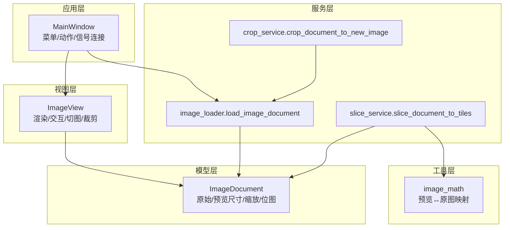
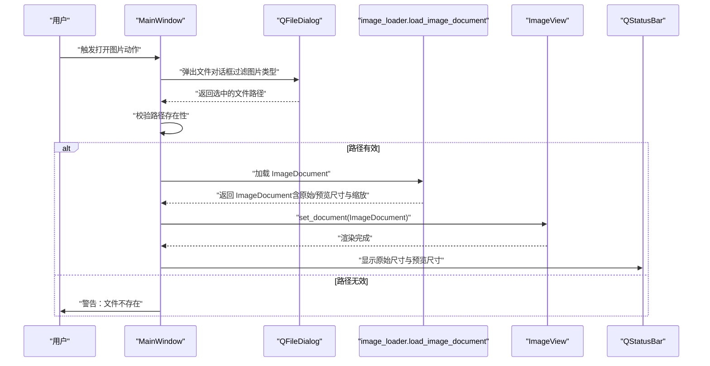
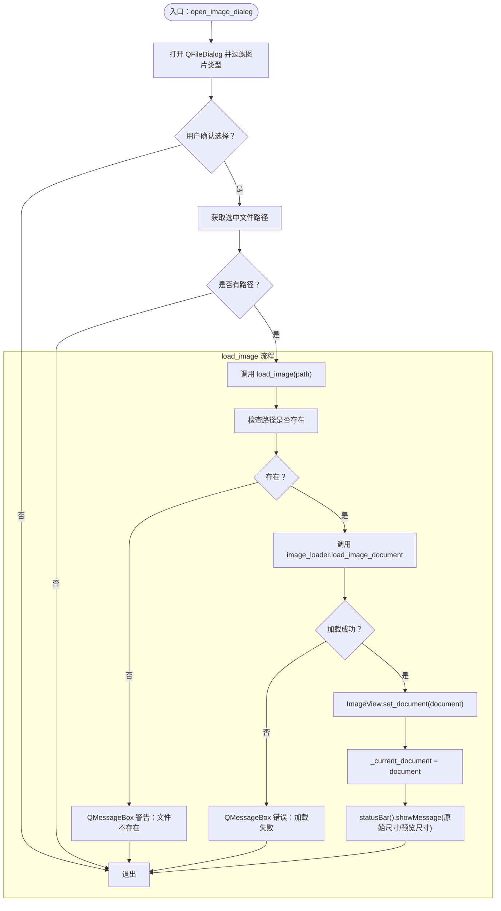
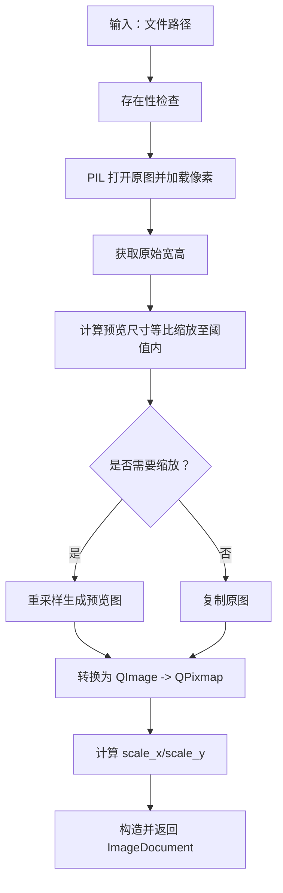
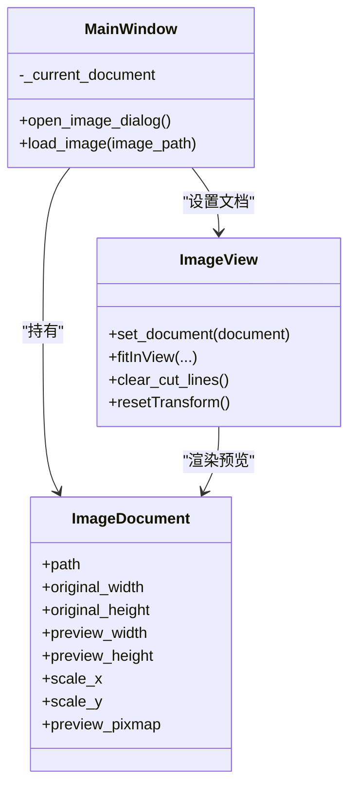
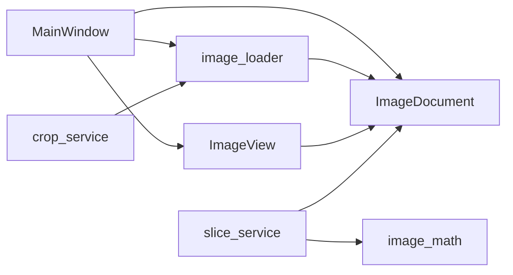

# 图像加载控制

<cite>
**本文引用的文件**
- [img_slicer_tool/app/main_window.py](file://img_slicer_tool/app/main_window.py)
- [img_slicer_tool/services/image_loader.py](file://img_slicer_tool/services/image_loader.py)
- [img_slicer_tool/views/image_view.py](file://img_slicer_tool/views/image_view.py)
- [img_slicer_tool/models/image_document.py](file://img_slicer_tool/models/image_document.py)
- [img_slicer_tool/utils/image_math.py](file://img_slicer_tool/utils/image_math.py)
- [img_slicer_tool/services/crop_service.py](file://img_slicer_tool/services/crop_service.py)
- [img_slicer_tool/services/slice_service.py](file://img_slicer_tool/services/slice_service.py)
- [img_slicer_tool/models/slice_layout.py](file://img_slicer_tool/models/slice_layout.py)
</cite>

## 目录
1. [简介](#简介)
2. [项目结构](#项目结构)
3. [核心组件](#核心组件)
4. [架构总览](#架构总览)
5. [详细组件分析](#详细组件分析)
6. [依赖关系分析](#依赖关系分析)
7. [性能考量](#性能考量)
8. [故障排查指南](#故障排查指南)
9. [结论](#结论)

## 简介
本节聚焦于 MainWindow 类中“图像加载”的控制逻辑，围绕以下目标展开：
- open_image_dialog 方法如何通过 QFileDialog 实现文件选择并验证路径有效性
- load_image 方法的完整执行流程：从调用服务层加载 ImageDocument，到将文档传递给 ImageView 显示，再到更新 _current_document 状态与状态栏信息
- 加载失败时如何通过 QMessageBox 向用户展示友好错误提示
- 从用户点击菜单到图像成功显示的完整数据流与交互序列
- statusBar().showMessage 中显示的“原始尺寸”与“预览尺寸”差异及其对用户体验的影响

## 项目结构
该功能涉及的主要模块如下：
- 应用层：MainWindow 负责菜单、动作绑定、事件处理与状态栏提示
- 视图层：ImageView 负责渲染 ImageDocument 的预览图、交互与切图/裁剪绘制
- 模型层：ImageDocument 描述图像的原始尺寸、预览尺寸、缩放比例与预览位图
- 服务层：image_loader 提供加载与预览图生成；crop_service/slice_service 提供裁剪与切图能力
- 工具层：image_math 提供预览坐标到原图坐标的映射

图表来源
- [img_slicer_tool/app/main_window.py](file://img_slicer_tool/app/main_window.py#L102-L135)
- [img_slicer_tool/services/image_loader.py](file://img_slicer_tool/services/image_loader.py#L24-L55)
- [img_slicer_tool/views/image_view.py](file://img_slicer_tool/views/image_view.py#L65-L82)
- [img_slicer_tool/models/image_document.py](file://img_slicer_tool/models/image_document.py#L8-L18)
- [img_slicer_tool/utils/image_math.py](file://img_slicer_tool/utils/image_math.py#L17-L76)
- [img_slicer_tool/services/crop_service.py](file://img_slicer_tool/services/crop_service.py#L13-L38)
- [img_slicer_tool/services/slice_service.py](file://img_slicer_tool/services/slice_service.py#L12-L62)

章节来源
- [img_slicer_tool/app/main_window.py](file://img_slicer_tool/app/main_window.py#L102-L135)
- [img_slicer_tool/services/image_loader.py](file://img_slicer_tool/services/image_loader.py#L24-L55)
- [img_slicer_tool/views/image_view.py](file://img_slicer_tool/views/image_view.py#L65-L82)
- [img_slicer_tool/models/image_document.py](file://img_slicer_tool/models/image_document.py#L8-L18)
- [img_slicer_tool/utils/image_math.py](file://img_slicer_tool/utils/image_math.py#L17-L76)
- [img_slicer_tool/services/crop_service.py](file://img_slicer_tool/services/crop_service.py#L13-L38)
- [img_slicer_tool/services/slice_service.py](file://img_slicer_tool/services/slice_service.py#L12-L62)

## 核心组件
- MainWindow.open_image_dialog：使用 QFileDialog 打开文件对话框，过滤图片类型，获取用户选择的文件路径并调用 load_image
- MainWindow.load_image：校验路径存在性，调用 image_loader.load_image_document 获取 ImageDocument，设置 ImageView 文档与当前文档，更新状态栏显示原始尺寸与预览尺寸
- ImageView.set_document：接收 ImageDocument，创建场景与预览图，自适应窗口并重置缩放
- ImageDocument：承载原始尺寸、预览尺寸、缩放比例与预览位图
- image_loader.load_image_document：读取原图，计算预览尺寸与缩放比例，生成预览 QImage/Pixmap 并封装为 ImageDocument
- image_math：提供预览坐标到原图坐标的映射，用于裁剪与切图

章节来源
- [img_slicer_tool/app/main_window.py](file://img_slicer_tool/app/main_window.py#L102-L135)
- [img_slicer_tool/views/image_view.py](file://img_slicer_tool/views/image_view.py#L65-L82)
- [img_slicer_tool/models/image_document.py](file://img_slicer_tool/models/image_document.py#L8-L18)
- [img_slicer_tool/services/image_loader.py](file://img_slicer_tool/services/image_loader.py#L24-L55)
- [img_slicer_tool/utils/image_math.py](file://img_slicer_tool/utils/image_math.py#L17-L76)

## 架构总览
下图展示了从用户点击“打开图片”菜单项到图像成功显示的端到端流程，包括错误处理与状态栏提示。

图表来源
- [img_slicer_tool/app/main_window.py](file://img_slicer_tool/app/main_window.py#L102-L135)
- [img_slicer_tool/services/image_loader.py](file://img_slicer_tool/services/image_loader.py#L24-L55)
- [img_slicer_tool/views/image_view.py](file://img_slicer_tool/views/image_view.py#L65-L82)

## 详细组件分析

### 组件A：MainWindow.open_image_dialog 与 load_image
- open_image_dialog 使用 QFileDialog 设置标题、文件模式与名称过滤器，调用 exec 后从 selectedFiles 获取路径，若存在则调用 load_image
- load_image 先检查路径是否存在，不存在则通过 QMessageBox 弹出“错误：文件不存在”
- 成功后调用 services.image_loader.load_image_document 加载 ImageDocument
- 将 ImageDocument 传入 ImageView.set_document 进行显示，并更新 _current_document
- 最后通过 statusBar().showMessage 展示“加载成功：文件名 + 原始尺寸 + 预览尺寸”，持续时间约 5 秒

图表来源
- [img_slicer_tool/app/main_window.py](file://img_slicer_tool/app/main_window.py#L102-L135)
- [img_slicer_tool/services/image_loader.py](file://img_slicer_tool/services/image_loader.py#L24-L55)
- [img_slicer_tool/views/image_view.py](file://img_slicer_tool/views/image_view.py#L65-L82)

章节来源
- [img_slicer_tool/app/main_window.py](file://img_slicer_tool/app/main_window.py#L102-L135)

### 组件B：image_loader.load_image_document 的实现要点
- 输入校验：若路径不存在直接抛出异常
- 使用 PIL.Image 打开原图并加载像素，获取原始宽高
- 计算预览尺寸：当任一边超过阈值时按等比缩放至最大边不超过阈值，否则保持原尺寸
- 若有缩放，使用 Lanczos 重采样生成预览图；否则复制原图
- 将预览图转换为 QImage 再转为 QPixmap，作为预览位图
- 计算 scale_x = original_width / preview_width、scale_y = original_height / preview_height
- 返回 ImageDocument（包含 path、original_width/height、preview_width/height、scale_x/y、preview_pixmap）

图表来源
- [img_slicer_tool/services/image_loader.py](file://img_slicer_tool/services/image_loader.py#L14-L55)
- [img_slicer_tool/models/image_document.py](file://img_slicer_tool/models/image_document.py#L8-L18)

章节来源
- [img_slicer_tool/services/image_loader.py](file://img_slicer_tool/services/image_loader.py#L24-L55)
- [img_slicer_tool/models/image_document.py](file://img_slicer_tool/models/image_document.py#L8-L18)

### 组件C：ImageView.set_document 的渲染与交互初始化
- 清理现有切图线与裁剪矩形，重置变换与缩放
- 从 ImageDocument 取出预览位图，加入场景并设置场景矩形
- fitInView 保持纵横比自适应窗口
- 若处于切图模式且网格模式，则重新生成网格线

图表来源
- [img_slicer_tool/app/main_window.py](file://img_slicer_tool/app/main_window.py#L114-L135)
- [img_slicer_tool/views/image_view.py](file://img_slicer_tool/views/image_view.py#L65-L82)
- [img_slicer_tool/models/image_document.py](file://img_slicer_tool/models/image_document.py#L8-L18)

章节来源
- [img_slicer_tool/views/image_view.py](file://img_slicer_tool/views/image_view.py#L65-L82)

### 组件D：状态栏尺寸信息与用户体验影响
- MainWindow 在加载成功后通过 statusBar().showMessage 输出三段信息：
  - 文件名
  - 原始尺寸：document.original_width x document.original_height
  - 预览尺寸：document.preview_width x document.preview_height
- 当原图尺寸较大时，预览尺寸会小于原始尺寸，二者差值越大，用户在 UI 上看到的图像越小，滚动与缩放需求越高；同时预览尺寸也会影响后续裁剪与切图的坐标映射精度（由 scale_x/scale_y 决定）
- 对用户体验的影响：
  - 正面：用户能直观了解当前图像的“真实大小”与“界面显示大小”，便于判断是否需要放大查看细节
  - 负面：大图预览尺寸过小可能降低操作效率，建议配合 Ctrl+滚轮缩放与空格拖拽

章节来源
- [img_slicer_tool/app/main_window.py](file://img_slicer_tool/app/main_window.py#L114-L135)
- [img_slicer_tool/services/image_loader.py](file://img_slicer_tool/services/image_loader.py#L42-L54)

### 组件E：错误处理与用户反馈
- 路径不存在：MainWindow.load_image 直接弹出警告消息框
- 加载异常：捕获异常并弹出严重错误消息框，提示“加载图片出错”
- 裁剪/切图失败：同样通过 QMessageBox.critical 提示具体错误，避免程序崩溃
- 交互提示：状态栏在不同模式切换、网格生成、切图结果等节点给出简短提示，帮助用户理解当前状态

章节来源
- [img_slicer_tool/app/main_window.py](file://img_slicer_tool/app/main_window.py#L114-L135)
- [img_slicer_tool/services/crop_service.py](file://img_slicer_tool/services/crop_service.py#L13-L38)
- [img_slicer_tool/services/slice_service.py](file://img_slicer_tool/services/slice_service.py#L12-L62)

## 依赖关系分析
- MainWindow 依赖：
  - QFileDialog/QMessageBox/QStatusBar：用于文件选择、错误提示与状态栏信息
  - services.image_loader：负责加载与预览图生成
  - views.image_view：负责渲染与交互
  - models.image_document：承载图像元数据
- image_loader 依赖：
  - PIL.Image：读取与重采样
  - PySide6.QtGui.QImage/QPixmap：预览位图
  - models.image_document：封装结果
- image_math 依赖：
  - models.image_document：提供 scale_x/scale_y
  - models.slice_layout：提供预览坐标系的切图线集合

图表来源
- [img_slicer_tool/app/main_window.py](file://img_slicer_tool/app/main_window.py#L102-L135)
- [img_slicer_tool/services/image_loader.py](file://img_slicer_tool/services/image_loader.py#L24-L55)
- [img_slicer_tool/views/image_view.py](file://img_slicer_tool/views/image_view.py#L65-L82)
- [img_slicer_tool/models/image_document.py](file://img_slicer_tool/models/image_document.py#L8-L18)
- [img_slicer_tool/utils/image_math.py](file://img_slicer_tool/utils/image_math.py#L17-L76)
- [img_slicer_tool/services/crop_service.py](file://img_slicer_tool/services/crop_service.py#L13-L38)
- [img_slicer_tool/services/slice_service.py](file://img_slicer_tool/services/slice_service.py#L12-L62)

章节来源
- [img_slicer_tool/app/main_window.py](file://img_slicer_tool/app/main_window.py#L102-L135)
- [img_slicer_tool/services/image_loader.py](file://img_slicer_tool/services/image_loader.py#L24-L55)
- [img_slicer_tool/views/image_view.py](file://img_slicer_tool/views/image_view.py#L65-L82)
- [img_slicer_tool/models/image_document.py](file://img_slicer_tool/models/image_document.py#L8-L18)
- [img_slicer_tool/utils/image_math.py](file://img_slicer_tool/utils/image_math.py#L17-L76)
- [img_slicer_tool/services/crop_service.py](file://img_slicer_tool/services/crop_service.py#L13-L38)
- [img_slicer_tool/services/slice_service.py](file://img_slicer_tool/services/slice_service.py#L12-L62)

## 性能考量
- 预览尺寸阈值：image_loader 中对预览尺寸的最大边进行限制，避免超大图导致内存与渲染压力过大
- 缩放策略：采用 Lanczos 重采样生成预览图，兼顾质量与性能
- 交互优化：ImageView.fitInView 与缩放/平移结合，提升大图浏览体验
- I/O 与异常：对文件存在性与异常进行早发现早提示，减少无效尝试

[本节为通用性能讨论，无需列出具体文件来源]

## 故障排查指南
- “文件不存在”提示：确认所选路径是否存在；若通过拖拽，请确保文件扩展名受支持
- “加载失败”提示：检查文件格式与完整性；必要时更换图片或升级 Pillow/Qt 版本
- 大图显示过小：使用 Ctrl+滚轮放大或空格+拖拽查看细节；也可考虑调整预览阈值（需修改源码）
- 状态栏信息不一致：确认是否在裁剪/切图后刷新了当前文档；必要时重新打开图片

章节来源
- [img_slicer_tool/app/main_window.py](file://img_slicer_tool/app/main_window.py#L114-L135)
- [img_slicer_tool/services/image_loader.py](file://img_slicer_tool/services/image_loader.py#L24-L55)
- [img_slicer_tool/views/image_view.py](file://img_slicer_tool/views/image_view.py#L65-L82)

## 结论
MainWindow 的图像加载控制逻辑清晰、职责明确：通过 QFileDialog 选择文件，校验路径后交由 image_loader 生成 ImageDocument，再由 ImageView 渲染并更新状态栏信息。该设计在保证用户体验的同时，通过预览尺寸与缩放比例的分离，使用户既能快速浏览大图，又能精确进行裁剪与切图。建议在后续版本中进一步优化大图预览策略与错误提示的可定制化。