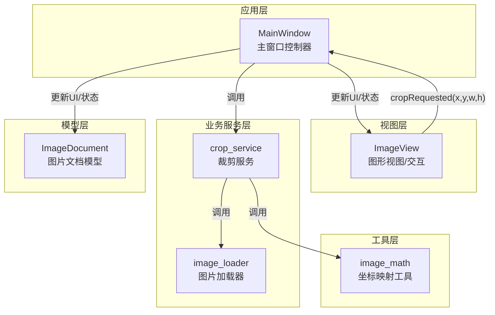
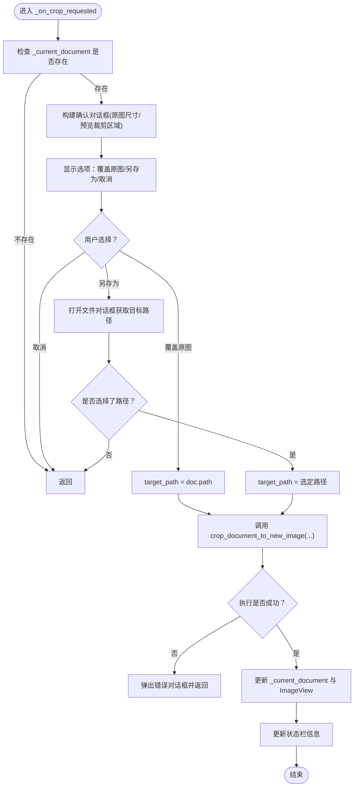
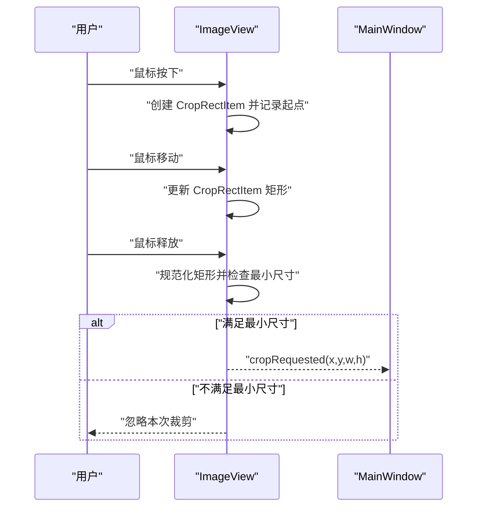
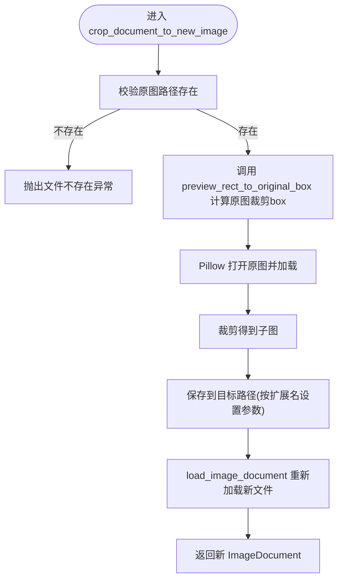
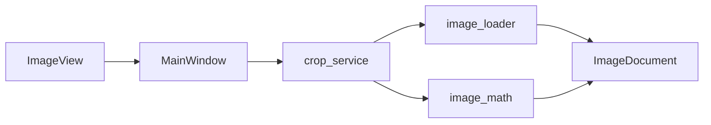

# 裁剪操作调度

<cite>
**本文引用的文件**
- [img_slicer_tool/app/main_window.py](file://img_slicer_tool/app/main_window.py)
- [img_slicer_tool/views/image_view.py](file://img_slicer_tool/views/image_view.py)
- [img_slicer_tool/services/crop_service.py](file://img_slicer_tool/services/crop_service.py)
- [img_slicer_tool/utils/image_math.py](file://img_slicer_tool/utils/image_math.py)
- [img_slicer_tool/services/image_loader.py](file://img_slicer_tool/services/image_loader.py)
- [img_slicer_tool/models/image_document.py](file://img_slicer_tool/models/image_document.py)
</cite>

## 目录
1. [简介](#简介)
2. [项目结构](#项目结构)
3. [核心组件](#核心组件)
4. [架构总览](#架构总览)
5. [详细组件分析](#详细组件分析)
6. [依赖关系分析](#依赖关系分析)
7. [性能考量](#性能考量)
8. [故障排查指南](#故障排查指南)
9. [结论](#结论)

## 简介
本节聚焦于 MainWindow 类中“裁剪”功能的调度机制，系统性解析从 ImageView 触发裁剪请求到最终更新界面与文档状态的完整流程。重点包括：
- _on_crop_requested 如何接收来自 ImageView 的裁剪请求坐标（x, y, w, h）
- 基于 _current_document 的安全检查
- 构建包含原图尺寸与预览裁剪区域信息的交互式 QMessageBox，并提供“覆盖原图”“另存为”“取消”三选项
- 用户选择不同选项后的处理逻辑（覆盖直接使用原图路径；另存为通过 QFileDialog 获取目标路径）
- crop_document_to_new_image 服务调用的参数传递过程
- 成功裁剪后如何更新 _current_document 与 ImageView 以反映新状态
- 异常处理机制与错误反馈策略

## 项目结构
围绕裁剪功能的相关模块与职责如下：
- 应用层（app）：MainWindow 负责菜单、动作、状态管理与事件调度
- 视图层（views）：ImageView 负责绘制、交互与裁剪区域可视化，并发出 cropRequested 信号
- 业务服务层（services）：crop_service 提供裁剪核心逻辑；image_loader 提供文档加载能力
- 工具层（utils）：image_math 提供预览坐标到原图坐标的映射
- 模型层（models）：ImageDocument 描述图片文档的元数据与预览图



图表来源
- [img_slicer_tool/app/main_window.py](file://img_slicer_tool/app/main_window.py#L87-L101)
- [img_slicer_tool/views/image_view.py](file://img_slicer_tool/views/image_view.py#L24-L31)
- [img_slicer_tool/services/crop_service.py](file://img_slicer_tool/services/crop_service.py#L12-L36)
- [img_slicer_tool/utils/image_math.py](file://img_slicer_tool/utils/image_math.py#L17-L48)
- [img_slicer_tool/services/image_loader.py](file://img_slicer_tool/services/image_loader.py#L24-L55)
- [img_slicer_tool/models/image_document.py](file://img_slicer_tool/models/image_document.py#L8-L18)

章节来源
- [img_slicer_tool/app/main_window.py](file://img_slicer_tool/app/main_window.py#L26-L101)
- [img_slicer_tool/views/image_view.py](file://img_slicer_tool/views/image_view.py#L24-L31)
- [img_slicer_tool/services/crop_service.py](file://img_slicer_tool/services/crop_service.py#L12-L36)
- [img_slicer_tool/utils/image_math.py](file://img_slicer_tool/utils/image_math.py#L17-L48)
- [img_slicer_tool/services/image_loader.py](file://img_slicer_tool/services/image_loader.py#L24-L55)
- [img_slicer_tool/models/image_document.py](file://img_slicer_tool/models/image_document.py#L8-L18)

## 核心组件
- MainWindow：负责连接信号、处理裁剪请求、弹窗确认、调用服务、更新状态与界面
- ImageView：负责鼠标交互绘制裁剪框并在释放时发出 cropRequested 信号
- crop_service：执行裁剪、写入新文件、重新加载为新文档
- image_math：将预览坐标映射到原图坐标，保证裁剪 box 在有效范围内
- image_loader：根据新文件路径加载 ImageDocument
- ImageDocument：承载图片路径、原图尺寸、预览尺寸、缩放比例与预览图

章节来源
- [img_slicer_tool/app/main_window.py](file://img_slicer_tool/app/main_window.py#L26-L101)
- [img_slicer_tool/views/image_view.py](file://img_slicer_tool/views/image_view.py#L154-L235)
- [img_slicer_tool/services/crop_service.py](file://img_slicer_tool/services/crop_service.py#L12-L36)
- [img_slicer_tool/utils/image_math.py](file://img_slicer_tool/utils/image_math.py#L17-L48)
- [img_slicer_tool/services/image_loader.py](file://img_slicer_tool/services/image_loader.py#L24-L55)
- [img_slicer_tool/models/image_document.py](file://img_slicer_tool/models/image_document.py#L8-L18)

## 架构总览
下图展示从用户在 ImageView 上拖拽选择裁剪区域，到 MainWindow 处理并调用服务完成裁剪的端到端流程。

```mermaid
sequenceDiagram
participant U as "用户"
participant IV as "ImageView"
participant MW as "MainWindow"
participant CS as "crop_service"
participant IM as "image_math"
participant IL as "image_loader"
participant ID as "ImageDocument"
U->>IV : "拖拽选择裁剪区域"
IV-->>MW : "cropRequested(x,y,w,h)"
MW->>MW : "安全检查(_current_document 是否存在)"
MW->>MW : "构建确认对话框(含原图尺寸/预览裁剪区域)"
MW->>U : "显示选项：覆盖原图/另存为/取消"
alt "用户选择“覆盖原图”"
MW->>MW : "target_path = doc.path"
else "用户选择“另存为”"
MW->>U : "打开文件对话框"
U-->>MW : "返回目标路径"
MW->>MW : "target_path = 选定路径"
else "用户选择“取消”"
MW-->>U : "终止流程"
exit
end
MW->>CS : "crop_document_to_new_image(doc, preview_rect, target_path)"
CS->>IM : "preview_rect_to_original_box(doc, x,y,w,h)"
IM-->>CS : "返回原图裁剪box"
CS->>IL : "load_image_document(target_path)"
IL-->>CS : "返回新ImageDocument"
CS-->>MW : "返回新ImageDocument"
MW->>MW : "更新 _current_document 与状态栏"
MW->>IV : "set_document(new_doc)"
MW-->>U : "提示裁剪完成"
```

图表来源
- [img_slicer_tool/views/image_view.py](file://img_slicer_tool/views/image_view.py#L223-L235)
- [img_slicer_tool/app/main_window.py](file://img_slicer_tool/app/main_window.py#L136-L192)
- [img_slicer_tool/services/crop_service.py](file://img_slicer_tool/services/crop_service.py#L12-L36)
- [img_slicer_tool/utils/image_math.py](file://img_slicer_tool/utils/image_math.py#L17-L48)
- [img_slicer_tool/services/image_loader.py](file://img_slicer_tool/services/image_loader.py#L24-L55)

## 详细组件分析

### MainWindow._on_crop_requested：裁剪请求处理与交互
- 输入：来自 ImageView 的裁剪请求坐标 (x, y, w, h)
- 安全检查：若 _current_document 为空则直接返回，避免空指针
- 信息展示：在确认对话框中展示原图尺寸与预览裁剪区域尺寸，帮助用户确认
- 选项处理：
  - “覆盖原图”：直接使用原图路径作为目标路径
  - “另存为”：通过 QFileDialog.getSaveFileName 获取新路径；若未选择则中止
  - “取消”：直接返回，不执行裁剪
- 服务调用：调用 crop_document_to_new_image(doc, preview_rect, target_path)
- 成功后更新：
  - 更新 _current_document 为新文档
  - 调用 ImageView.set_document(new_doc) 刷新界面
  - 更新状态栏显示新文档的尺寸信息



图表来源
- [img_slicer_tool/app/main_window.py](file://img_slicer_tool/app/main_window.py#L136-L192)

章节来源
- [img_slicer_tool/app/main_window.py](file://img_slicer_tool/app/main_window.py#L136-L192)

### ImageView：裁剪区域生成与信号发射
- 交互流程：
  - 鼠标按下：记录起始点并创建 CropRectItem
  - 鼠标移动：随鼠标拖动更新 CropRectItem 的矩形
  - 鼠标释放：当矩形宽度/高度均达到最小阈值时，规范化矩形并发射 cropRequested(x, y, w, h)
- 信号定义：cropRequested(float, float, float, float) 由 ImageView 发出
- 与 MainWindow 的连接：MainWindow._connect_signals 中绑定 cropRequested -> _on_crop_requested



图表来源
- [img_slicer_tool/views/image_view.py](file://img_slicer_tool/views/image_view.py#L154-L235)
- [img_slicer_tool/app/main_window.py](file://img_slicer_tool/app/main_window.py#L87-L101)

章节来源
- [img_slicer_tool/views/image_view.py](file://img_slicer_tool/views/image_view.py#L154-L235)
- [img_slicer_tool/app/main_window.py](file://img_slicer_tool/app/main_window.py#L87-L101)

### crop_service：裁剪核心逻辑与新文档生成
- 参数：doc（当前 ImageDocument）、preview_rect（预览坐标 x,y,w,h）、target_path（目标路径）
- 关键步骤：
  - 校验原图路径是否存在
  - 使用 image_math.preview_rect_to_original_box 将预览坐标映射到原图坐标，得到裁剪 box
  - 使用 Pillow 打开原图并裁剪，针对 JPEG 设置高质量参数
  - 保存到目标路径
  - 通过 image_loader.load_image_document 加载新文件为新 ImageDocument 返回
- 返回：新的 ImageDocument，用于更新 UI 与状态



图表来源
- [img_slicer_tool/services/crop_service.py](file://img_slicer_tool/services/crop_service.py#L12-L36)
- [img_slicer_tool/utils/image_math.py](file://img_slicer_tool/utils/image_math.py#L17-L48)
- [img_slicer_tool/services/image_loader.py](file://img_slicer_tool/services/image_loader.py#L24-L55)

章节来源
- [img_slicer_tool/services/crop_service.py](file://img_slicer_tool/services/crop_service.py#L12-L36)
- [img_slicer_tool/utils/image_math.py](file://img_slicer_tool/utils/image_math.py#L17-L48)
- [img_slicer_tool/services/image_loader.py](file://img_slicer_tool/services/image_loader.py#L24-L55)

### image_math：预览坐标到原图坐标的映射
- 输入：doc（包含 scale_x/scale_y）、预览矩形 (x, y, w, h)
- 输出：原图裁剪 box (x1, y1, x2, y2)
- 安全校验：
  - 宽高必须为正数
  - 映射后坐标需在原图有效范围内
  - 最终 box 必须满足 x2 > x1 且 y2 > y1
- 异常：上述任一条件不满足时抛出异常，由上层捕获并提示用户

章节来源
- [img_slicer_tool/utils/image_math.py](file://img_slicer_tool/utils/image_math.py#L17-L48)

### image_loader：新文档加载
- 输入：目标文件路径
- 功能：读取原图尺寸，计算预览尺寸与缩放比，生成预览 QImage/QPixmap，构造 ImageDocument
- 用途：裁剪完成后用于替换当前文档

章节来源
- [img_slicer_tool/services/image_loader.py](file://img_slicer_tool/services/image_loader.py#L24-L55)
- [img_slicer_tool/models/image_document.py](file://img_slicer_tool/models/image_document.py#L8-L18)

## 依赖关系分析
- MainWindow 依赖：
  - ImageView 的 cropRequested 信号
  - crop_service 的裁剪服务
  - image_loader 的文档加载
- ImageView 依赖：
  - OverlayItems（如 CropRectItem）用于可视化裁剪框
  - ImageDocument 元数据用于坐标映射
- crop_service 依赖：
  - image_math 的坐标映射
  - image_loader 的文档重建
- image_math 依赖：
  - ImageDocument 的 scale_x/scale_y
- image_loader 依赖：
  - Pillow 与 Qt 图像类型转换



图表来源
- [img_slicer_tool/app/main_window.py](file://img_slicer_tool/app/main_window.py#L87-L101)
- [img_slicer_tool/views/image_view.py](file://img_slicer_tool/views/image_view.py#L24-L31)
- [img_slicer_tool/services/crop_service.py](file://img_slicer_tool/services/crop_service.py#L12-L36)
- [img_slicer_tool/utils/image_math.py](file://img_slicer_tool/utils/image_math.py#L17-L48)
- [img_slicer_tool/services/image_loader.py](file://img_slicer_tool/services/image_loader.py#L24-L55)
- [img_slicer_tool/models/image_document.py](file://img_slicer_tool/models/image_document.py#L8-L18)

章节来源
- [img_slicer_tool/app/main_window.py](file://img_slicer_tool/app/main_window.py#L87-L101)
- [img_slicer_tool/views/image_view.py](file://img_slicer_tool/views/image_view.py#L24-L31)
- [img_slicer_tool/services/crop_service.py](file://img_slicer_tool/services/crop_service.py#L12-L36)
- [img_slicer_tool/utils/image_math.py](file://img_slicer_tool/utils/image_math.py#L17-L48)
- [img_slicer_tool/services/image_loader.py](file://img_slicer_tool/services/image_loader.py#L24-L55)
- [img_slicer_tool/models/image_document.py](file://img_slicer_tool/models/image_document.py#L8-L18)

## 性能考量
- 预览尺寸与缩放比：image_loader 在加载时会根据最大边长限制生成预览图，降低渲染与交互成本
- 裁剪写入优化：对 JPEG 扩展名设置高质量参数，兼顾体积与质量
- UI 更新：裁剪完成后一次性更新 _current_document 与 ImageView，避免多次重绘

章节来源
- [img_slicer_tool/services/image_loader.py](file://img_slicer_tool/services/image_loader.py#L14-L22)
- [img_slicer_tool/services/image_loader.py](file://img_slicer_tool/services/image_loader.py#L24-L55)
- [img_slicer_tool/services/crop_service.py](file://img_slicer_tool/services/crop_service.py#L28-L33)

## 故障排查指南
- 常见问题与定位：
  - 无当前文档：MainWindow._on_crop_requested 在 _current_document 为空时直接返回，检查是否已打开图片
  - 无效裁剪区域：当裁剪框过小时不会触发 cropRequested；检查最小尺寸阈值与预览坐标范围
  - 原图路径不存在：crop_service 在打开原图前校验路径，若不存在会抛出异常；确认 doc.path 是否正确
  - 坐标映射异常：image_math 对宽高与边界进行严格校验，若非法会抛出异常；检查预览矩形是否越界
  - 另存为未选择路径：MainWindow._on_crop_requested 在未选择路径时直接返回；确保用户选择了目标路径
- 错误反馈：
  - MainWindow 在服务调用失败时弹出“裁剪失败”的错误对话框，包含具体异常信息
  - ImageView 在无效文件拖拽时弹出警告对话框
  - image_loader 在加载失败时弹出“加载失败”的错误对话框

章节来源
- [img_slicer_tool/app/main_window.py](file://img_slicer_tool/app/main_window.py#L114-L134)
- [img_slicer_tool/app/main_window.py](file://img_slicer_tool/app/main_window.py#L177-L181)
- [img_slicer_tool/views/image_view.py](file://img_slicer_tool/views/image_view.py#L141-L153)
- [img_slicer_tool/services/crop_service.py](file://img_slicer_tool/services/crop_service.py#L19-L24)
- [img_slicer_tool/utils/image_math.py](file://img_slicer_tool/utils/image_math.py#L26-L47)

## 结论
本节系统梳理了 MainWindow 中裁剪功能的调度机制：从 ImageView 的交互到 MainWindow 的确认与服务调用，再到新文档的生成与界面刷新，形成清晰的职责分层与错误处理闭环。通过预览坐标到原图坐标的精确映射与严格的边界校验，确保裁剪结果的准确性与安全性；通过统一的异常反馈与状态更新，提升用户体验与系统的健壮性。