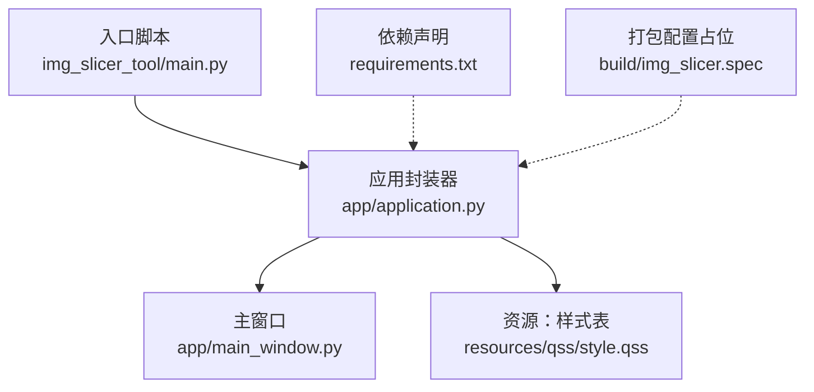
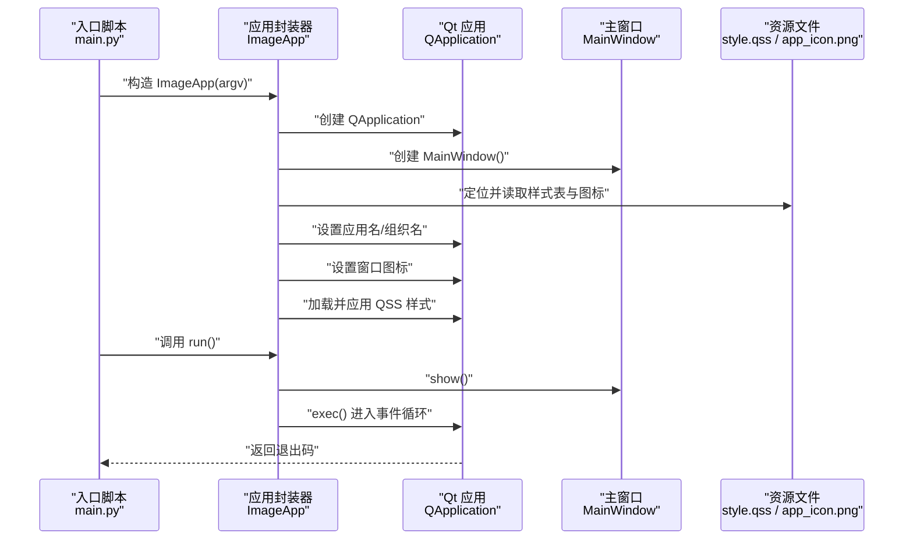
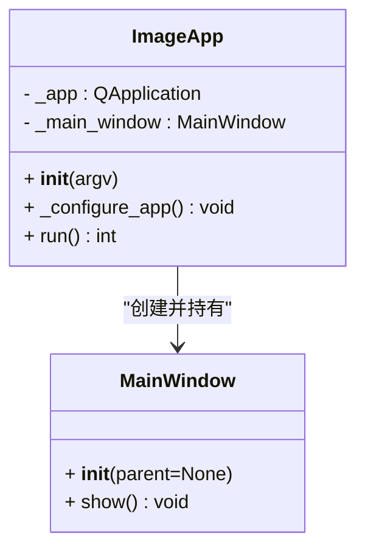
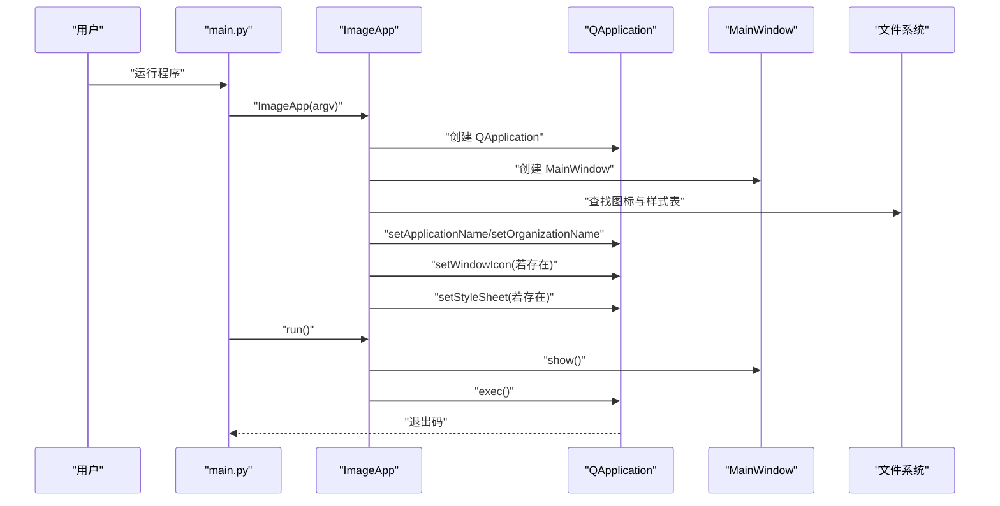
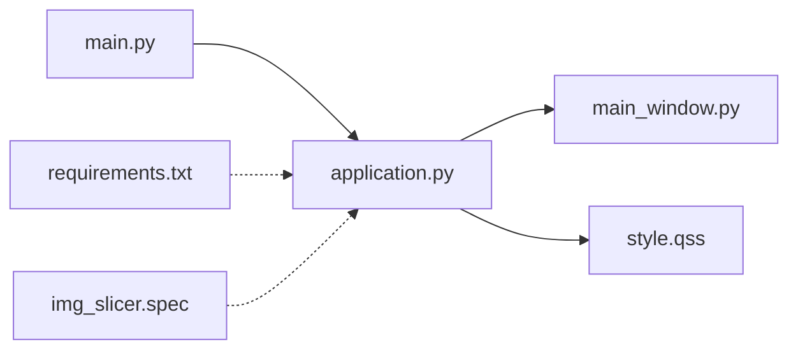
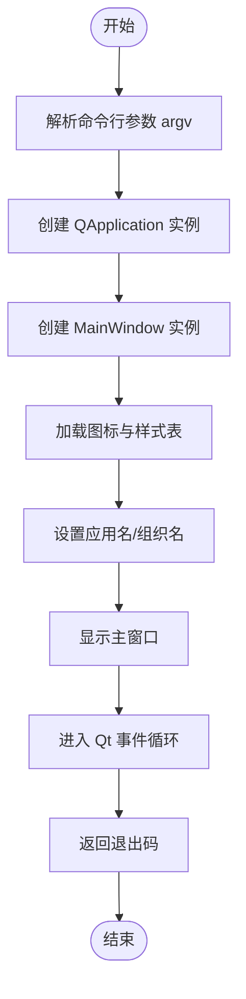

# 应用启动流程

<cite>
**本文引用的文件**
- [main.py](file://img_slicer_tool/main.py)
- [application.py](file://img_slicer_tool/app/application.py)
- [main_window.py](file://img_slicer_tool/app/main_window.py)
- [style.qss](file://img_slicer_tool/resources/qss/style.qss)
- [requirements.txt](file://img_slicer_tool/requirements.txt)
- [img_slicer.spec](file://img_slicer_tool/build/img_slicer.spec)
</cite>

## 目录
1. [简介](#简介)
2. [项目结构](#项目结构)
3. [核心组件](#核心组件)
4. [架构总览](#架构总览)
5. [详细组件分析](#详细组件分析)
6. [依赖关系分析](#依赖关系分析)
7. [性能考量](#性能考量)
8. [故障排查指南](#故障排查指南)
9. [结论](#结论)
10. [附录](#附录)

## 简介
本文件围绕 PictureMaster 的应用启动流程展开，重点说明从入口脚本 main.py 调用 ImageApp 类开始的完整初始化过程。内容涵盖：
- ImageApp.__init__ 如何接收命令行参数、创建 QApplication 实例、初始化 MainWindow 对象，并通过 _configure_app 方法加载 QSS 样式表与应用图标；
- ImageApp.run 如何启动 Qt 主事件循环并返回退出码；
- 模块间依赖注入机制与为何将 MainWindow 创建在 ImageApp 内部；
- 启动时序图，展示组件创建顺序与生命周期管理；
- 常见启动问题排查指南（样式表未生效、图标加载失败等）。

## 项目结构
该应用采用“入口脚本 + 应用封装器 + 主窗口”的分层组织方式：
- 入口脚本负责解析命令行参数并创建应用实例；
- 应用封装器负责 Qt 应用级配置（名称、组织、图标、样式），以及主窗口的创建与显示；
- 主窗口承载 UI 组件与业务逻辑交互。

图表来源
- [main.py](file://img_slicer_tool/main.py#L1-L13)
- [application.py](file://img_slicer_tool/app/application.py#L1-L35)
- [main_window.py](file://img_slicer_tool/app/main_window.py#L1-L364)
- [style.qss](file://img_slicer_tool/resources/qss/style.qss#L1-L2)
- [requirements.txt](file://img_slicer_tool/requirements.txt#L1-L14)
- [img_slicer.spec](file://img_slicer_tool/build/img_slicer.spec#L1-L2)

章节来源
- [main.py](file://img_slicer_tool/main.py#L1-L13)
- [application.py](file://img_slicer_tool/app/application.py#L1-L35)
- [main_window.py](file://img_slicer_tool/app/main_window.py#L1-L364)
- [style.qss](file://img_slicer_tool/resources/qss/style.qss#L1-L2)
- [requirements.txt](file://img_slicer_tool/requirements.txt#L1-L14)
- [img_slicer.spec](file://img_slicer_tool/build/img_slicer.spec#L1-L2)

## 核心组件
- 入口函数 main：从 sys.argv 构造 ImageApp 实例，并以 app.run() 的返回值作为进程退出码退出。
- ImageApp：封装 QApplication、MainWindow 的创建与配置；提供 run() 启动事件循环。
- MainWindow：继承自 QMainWindow，负责菜单、动作、布局与业务交互。

章节来源
- [main.py](file://img_slicer_tool/main.py#L1-L13)
- [application.py](file://img_slicer_tool/app/application.py#L1-L35)
- [main_window.py](file://img_slicer_tool/app/main_window.py#L1-L364)

## 架构总览
下图展示了从入口到主窗口显示的启动时序，以及样式表与图标的加载时机。

图表来源
- [main.py](file://img_slicer_tool/main.py#L1-L13)
- [application.py](file://img_slicer_tool/app/application.py#L1-L35)
- [main_window.py](file://img_slicer_tool/app/main_window.py#L1-L364)
- [style.qss](file://img_slicer_tool/resources/qss/style.qss#L1-L2)

## 详细组件分析

### 入口脚本 main.py
- 负责将 sys.argv 传递给 ImageApp；
- 以 app.run() 的返回值作为 sys.exit 的参数，确保退出码正确传递。

章节来源
- [main.py](file://img_slicer_tool/main.py#L1-L13)

### ImageApp 类
- 初始化阶段
  - 接收命令行参数 argv 并转换为列表，创建 QApplication 实例；
  - 直接创建 MainWindow 实例；
  - 调用 _configure_app 完成应用级配置（名称、组织、图标、样式）。
- 配置阶段
  - 设置应用名与组织名；
  - 解析资源路径，若图标与样式存在则分别设置窗口图标与样式表；
  - 若资源缺失，保持默认行为。
- 运行阶段
  - 显示主窗口；
  - 启动 Qt 事件循环并返回退出码。

图表来源
- [application.py](file://img_slicer_tool/app/application.py#L1-L35)
- [main_window.py](file://img_slicer_tool/app/main_window.py#L1-L364)

章节来源
- [application.py](file://img_slicer_tool/app/application.py#L1-L35)

### MainWindow 类
- 继承自 QMainWindow，负责：
  - 初始化界面布局（左右分割：侧边面板 + 图像视图）；
  - 创建菜单与动作（打开图片、退出、切图模式切换、生成宫格线、执行切图、设置输出目录等）；
  - 连接信号与槽，处理用户交互与业务流程（加载图片、裁剪、切图、结果展示等）。

章节来源
- [main_window.py](file://img_slicer_tool/app/main_window.py#L1-L364)

### 依赖注入与封装策略
- 为什么 MainWindow 在 ImageApp 内部创建？
  - ImageApp 作为应用生命周期的唯一入口，集中管理 QApplication 与 MainWindow 的创建与配置；
  - 将 MainWindow 的创建置于 ImageApp 内部，避免外部耦合，便于统一初始化与资源加载；
  - 通过构造函数直接创建 MainWindow，简化调用方复杂度，符合“应用封装器”职责边界。

章节来源
- [application.py](file://img_slicer_tool/app/application.py#L1-L35)
- [main_window.py](file://img_slicer_tool/app/main_window.py#L1-L364)

### 启动流程时序图

图表来源
- [main.py](file://img_slicer_tool/main.py#L1-L13)
- [application.py](file://img_slicer_tool/app/application.py#L1-L35)
- [main_window.py](file://img_slicer_tool/app/main_window.py#L1-L364)

## 依赖关系分析
- 外部依赖
  - PySide6：提供 QApplication、QMainWindow、QIcon、QMessageBox 等 UI 组件；
  - Pillow、pyvips、numpy：图像处理相关（在业务服务中使用）；
  - pyinstaller：打包工具（用于构建可执行文件）。
- 内部依赖
  - main.py 依赖 application.py；
  - application.py 依赖 main_window.py；
  - application.py 依赖资源文件（图标与样式表）。

图表来源
- [main.py](file://img_slicer_tool/main.py#L1-L13)
- [application.py](file://img_slicer_tool/app/application.py#L1-L35)
- [main_window.py](file://img_slicer_tool/app/main_window.py#L1-L364)
- [style.qss](file://img_slicer_tool/resources/qss/style.qss#L1-L2)
- [requirements.txt](file://img_slicer_tool/requirements.txt#L1-L14)
- [img_slicer.spec](file://img_slicer_tool/build/img_slicer.spec#L1-L2)

章节来源
- [requirements.txt](file://img_slicer_tool/requirements.txt#L1-L14)
- [img_slicer.spec](file://img_slicer_tool/build/img_slicer.spec#L1-L2)

## 性能考量
- 资源加载
  - 图标与样式表在应用启动时一次性读取并应用，避免运行期重复 IO；
  - 若资源文件较大，建议在开发阶段进行压缩与优化。
- 事件循环
  - run() 中先显示主窗口再进入 exec()，确保用户界面尽快可见；
  - 事件循环阻塞于 exec()，退出时返回整数退出码，便于上层进程监控。

[本节为通用指导，无需列出具体文件来源]

## 故障排查指南
- 样式表未生效
  - 检查资源路径是否正确（相对路径基于 application.py 所在目录）；
  - 确认 style.qss 文件存在且可读；
  - 若样式为空或语法错误，可能导致样式未应用。
  - 参考路径与读取逻辑：[application.py](file://img_slicer_tool/app/application.py#L1-L35)，[style.qss](file://img_slicer_tool/resources/qss/style.qss#L1-L2)
- 图标加载失败
  - 检查图标文件是否存在且为可识别格式；
  - 确认图标路径拼接正确；
  - 若路径不存在，应用将继续运行但无窗口图标。
  - 参考路径与读取逻辑：[application.py](file://img_slicer_tool/app/application.py#L1-L35)
- 退出码异常
  - 确保入口脚本以 app.run() 返回值作为 sys.exit 参数；
  - 参考入口逻辑：[main.py](file://img_slicer_tool/main.py#L1-L13)
- 依赖缺失导致启动失败
  - 确认 PySide6 等依赖已安装；
  - 参考依赖声明：[requirements.txt](file://img_slicer_tool/requirements.txt#L1-L14)

章节来源
- [application.py](file://img_slicer_tool/app/application.py#L1-L35)
- [main.py](file://img_slicer_tool/main.py#L1-L13)
- [requirements.txt](file://img_slicer_tool/requirements.txt#L1-L14)

## 结论
本应用采用简洁清晰的启动流程：入口脚本负责参数传递与退出码回收，应用封装器负责 Qt 应用级配置与主窗口创建，主窗口承载 UI 与业务交互。通过将 MainWindow 的创建封装在 ImageApp 内部，实现了良好的内聚与低耦合。启动时序明确，资源加载与事件循环分离，便于维护与扩展。

[本节为总结性内容，无需列出具体文件来源]

## 附录
- 启动流程算法示意（用于理解控制流）

图表来源
- [main.py](file://img_slicer_tool/main.py#L1-L13)
- [application.py](file://img_slicer_tool/app/application.py#L1-L35)
- [main_window.py](file://img_slicer_tool/app/main_window.py#L1-L364)