# 技术架构设计

<cite>
**本文档引用文件**  
- [main.py](file://main.py)
- [application.py](file://app/application.py)
- [main_window.py](file://app/main_window.py)
- [image_view.py](file://views/image_view.py)
- [image_loader.py](file://services/image_loader.py)
- [crop_service.py](file://services/crop_service.py)
- [slice_service.py](file://services/slice_service.py)
- [image_document.py](file://models/image_document.py)
- [slice_layout.py](file://models/slice_layout.py)
- [overlay_items.py](file://views/overlay_items.py)
- [image_math.py](file://utils/image_math.py)
- [style.qss](file://resources/qss/style.qss)
</cite>

## 目录
1. [项目结构](#项目结构)
2. [程序启动流程](#程序启动流程)
3. [MVC架构设计](#mvc架构设计)
4. [模块间依赖注入机制](#模块间依赖注入机制)
5. [事件驱动通信机制](#事件驱动通信机制)
6. [系统上下文图](#系统上下文图)
7. [组件交互图](#组件交互图)
8. [架构优势分析](#架构优势分析)
9. [未来演进方向](#未来演进方向)

## 项目结构

PictureMaster项目采用清晰的分层架构，将代码组织为多个功能模块，便于维护和扩展。项目主要分为以下几个目录：

- `app/`：应用程序核心模块，包含主窗口和应用对象
- `models/`：数据模型层，定义核心数据结构
- `services/`：业务逻辑服务层，处理图像处理核心功能
- `views/`：视图层，负责用户界面和交互
- `utils/`：工具类模块，提供通用功能
- `resources/qss/`：资源文件，包含样式表

这种分层结构体现了MVC（Model-View-Controller）设计模式的思想，实现了关注点分离。

**Section sources**
- [main.py](file://main.py)
- [application.py](file://app/application.py)
- [main_window.py](file://app/main_window.py)

## 程序启动流程

PictureMaster的启动流程从`main.py`文件开始，遵循标准的PySide6应用程序初始化模式。程序首先创建`ImageApp`应用对象，然后加载QSS样式表，最后创建并显示`MainWindow`主窗口。

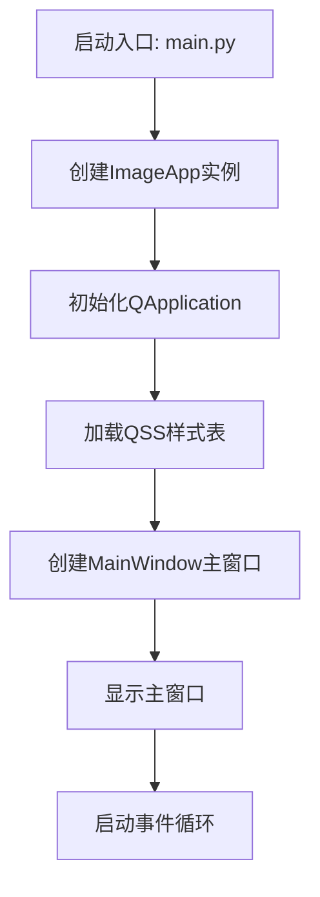

**Diagram sources**
- [main.py](file://main.py#L6-L12)
- [application.py](file://app/application.py#L13-L34)

**Section sources**
- [main.py](file://main.py#L6-L12)
- [application.py](file://app/application.py#L13-L34)

## MVC架构设计

PictureMaster采用MVC（Model-View-Controller）设计模式，实现了良好的解耦和职责分离。

### 模型层（Model）

模型层由`models/`目录下的`image_document.py`和`slice_layout.py`文件组成，使用Python的dataclass定义核心数据结构：

- `ImageDocument`：封装图像的元数据，包括原始尺寸、预览尺寸、缩放比例和预览像素图
- `SliceLayout`：表示切图布局，包含水平和垂直切割线的坐标

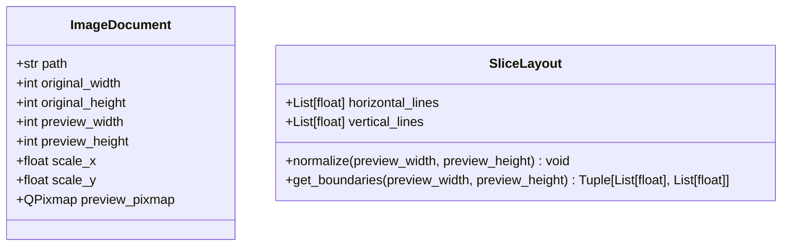

**Diagram sources**
- [image_document.py](file://models/image_document.py#L9-L18)
- [slice_layout.py](file://models/slice_layout.py#L8-L30)

### 视图层（View）

视图层由`views/`目录下的组件构成，主要负责用户界面的展示和交互：

- `ImageView`：继承自`QGraphicsView`，是核心的图像显示组件，处理鼠标事件、拖拽操作和缩放功能
- `CropRectItem`和`GuideLineItem`：自定义的图形项，分别用于显示裁剪区域和切割线

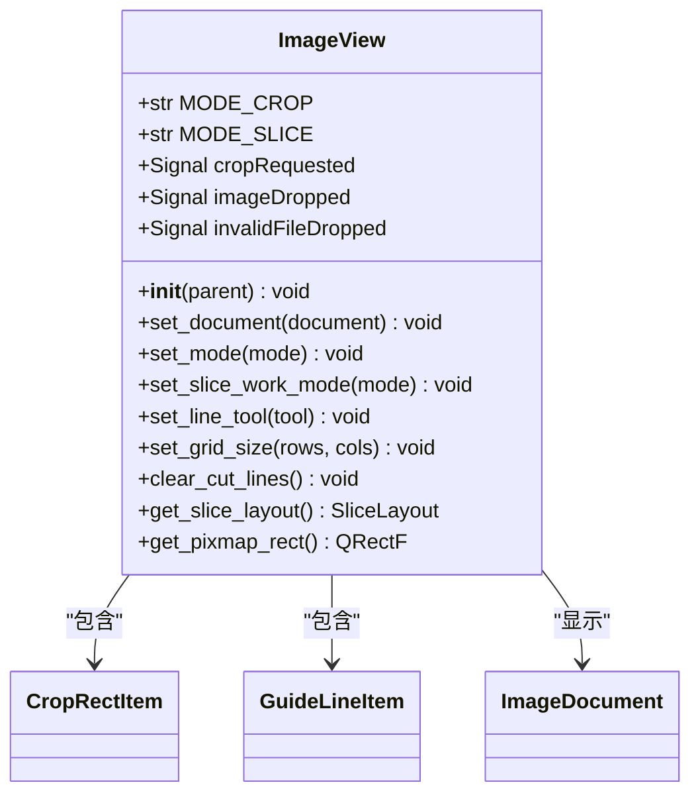

**Diagram sources**
- [image_view.py](file://views/image_view.py#L24-L542)
- [overlay_items.py](file://views/overlay_items.py#L8-L64)

### 控制器层（Controller）

`MainWindow`类作为MVC模式中的控制器，协调视图和模型之间的交互。它负责：

- 创建和管理UI组件
- 处理用户操作（菜单、按钮等）
- 协调服务模块执行业务逻辑
- 管理应用程序状态

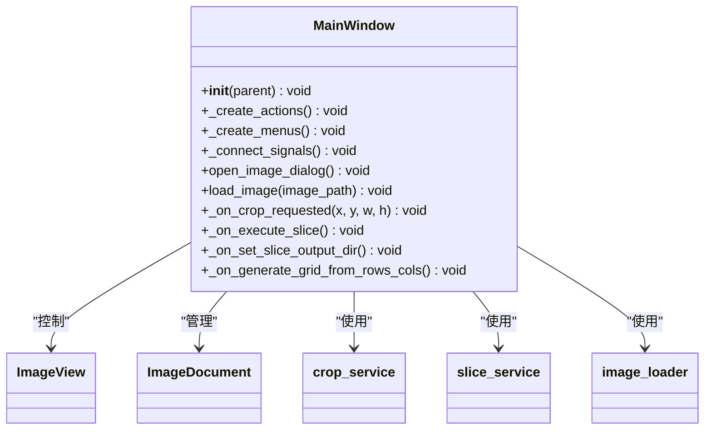

**Diagram sources**
- [main_window.py](file://app/main_window.py#L26-L364)

## 模块间依赖注入方式

PictureMaster采用构造函数注入的方式实现模块间的依赖管理，确保了组件之间的松耦合。

### 服务模块的依赖注入

服务模块（`image_loader`、`crop_service`、`slice_service`）通过函数参数接收所需的依赖，而不是直接实例化。这种设计使得服务模块更加独立和可测试。

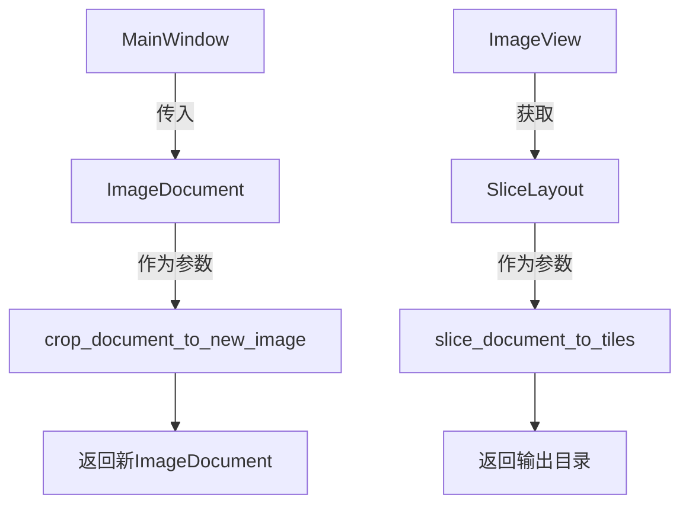

**Diagram sources**
- [crop_service.py](file://services/crop_service.py#L13-L38)
- [slice_service.py](file://services/slice_service.py#L12-L62)
- [image_loader.py](file://services/image_loader.py#L24-L54)

### 视图组件的依赖关系

`MainWindow`在初始化时创建`ImageView`实例，并通过方法调用与其交互，而不是直接访问其内部状态。这种设计遵循了"告诉，不要询问"（Tell, Don't Ask）的原则。

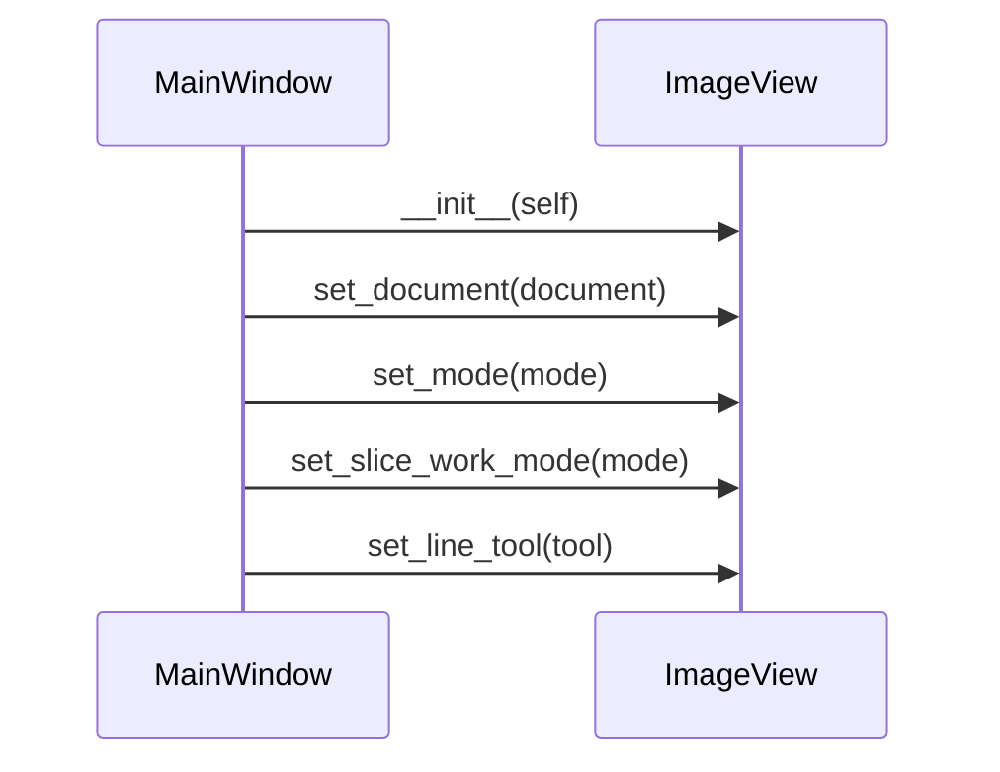

**Diagram sources**
- [main_window.py](file://app/main_window.py#L32-L40)
- [image_view.py](file://views/image_view.py#L65-L82)

**Section sources**
- [main_window.py](file://app/main_window.py#L32-L40)
- [image_view.py](file://views/image_view.py#L65-L82)

## 事件驱动通信机制

PictureMaster充分利用PySide6的信号与槽机制，实现了组件间的松耦合通信。

### 信号定义与发射

`ImageView`类定义了多个自定义信号，用于通知外部事件的发生：

- `cropRequested`：当用户完成裁剪区域选择时发射
- `imageDropped`：当用户拖拽图片到视图时发射
- `invalidFileDropped`：当用户拖拽不支持的文件时发射

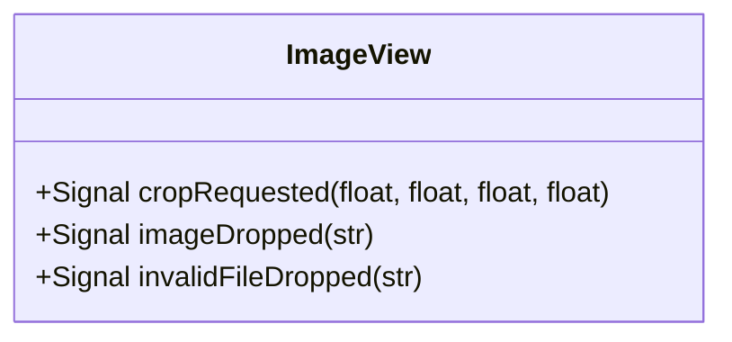

**Diagram sources**
- [image_view.py](file://views/image_view.py#L28-L30)

### 信号连接与处理

`MainWindow`在`_connect_signals`方法中将`ImageView`的信号连接到相应的槽函数，实现了事件的响应处理。

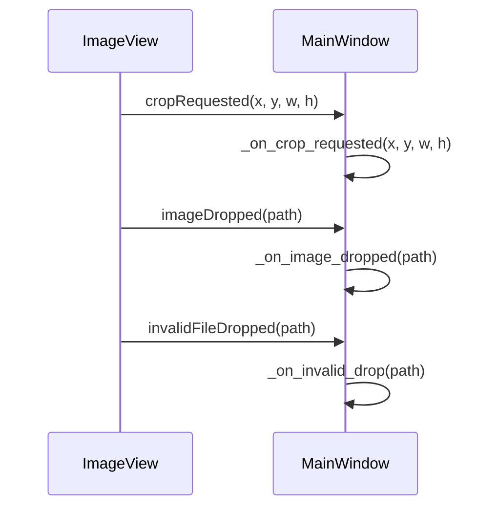

**Diagram sources**
- [main_window.py](file://app/main_window.py#L87-L101)

### 事件处理流程

以裁剪功能为例，完整的事件处理流程如下：

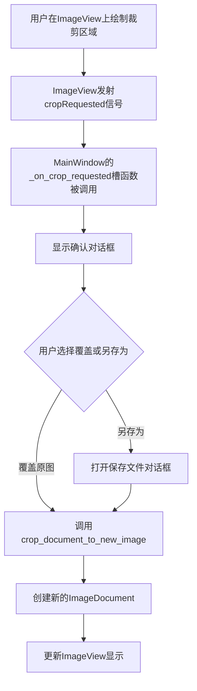

**Diagram sources**
- [image_view.py](file://views/image_view.py#L227-L231)
- [main_window.py](file://app/main_window.py#L136-L192)

**Section sources**
- [image_view.py](file://views/image_view.py#L227-L231)
- [main_window.py](file://app/main_window.py#L136-L192)

## 系统上下文图

系统上下文图展示了PictureMaster与外部环境的交互关系：

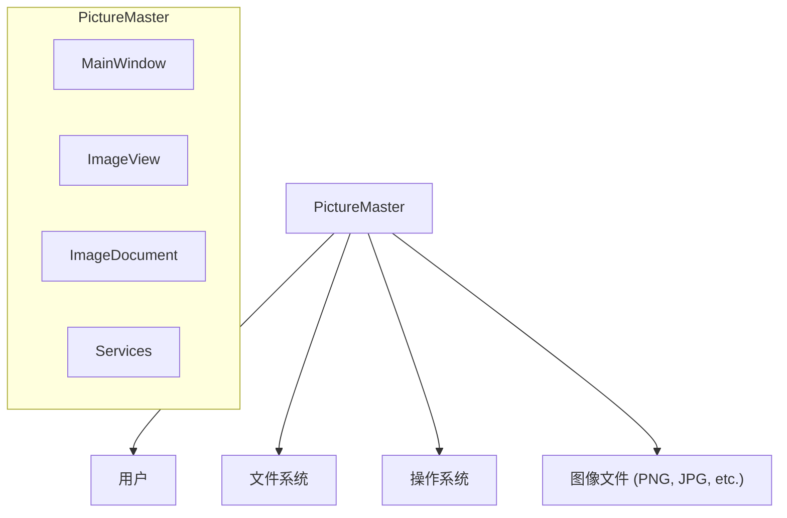

**Diagram sources**
- [main_window.py](file://app/main_window.py)
- [image_view.py](file://views/image_view.py)
- [image_document.py](file://models/image_document.py)

## 组件交互图

组件交互图详细展示了PictureMaster内部各组件之间的协作关系：

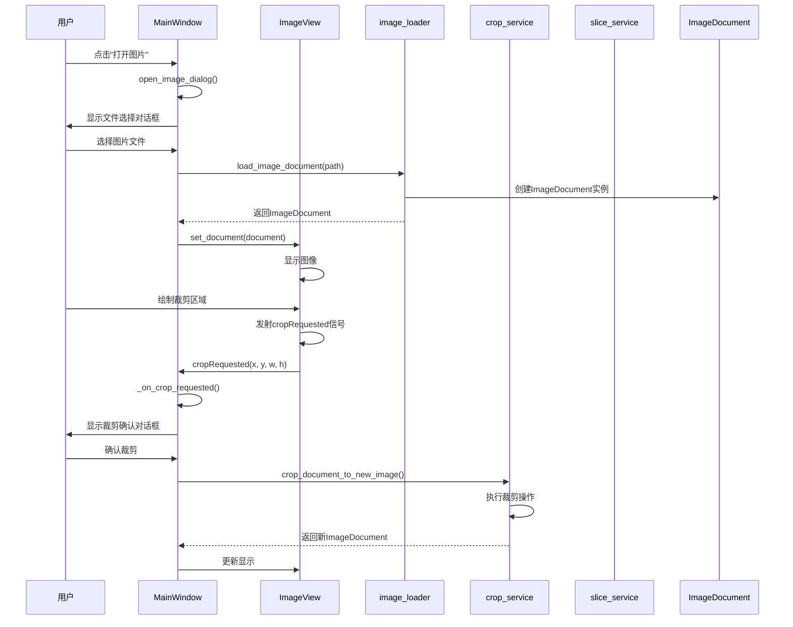

**Diagram sources**
- [main_window.py](file://app/main_window.py)
- [image_view.py](file://views/image_view.py)
- [image_loader.py](file://services/image_loader.py)
- [crop_service.py](file://services/crop_service.py)

## 架构优势分析

PictureMaster的架构设计具有以下显著优势：

### 可维护性

通过MVC模式的分层设计，各组件职责明确，代码结构清晰。当需要修改某一功能时，开发者可以快速定位到相关模块，而不会影响其他部分。

### 可扩展性

模块间的松耦合设计使得添加新功能变得容易。例如，可以轻松添加新的切图模式或图像处理功能，而无需修改现有代码的核心逻辑。

### 可测试性

服务模块（`image_loader`、`crop_service`、`slice_service`）的纯函数设计使得它们易于进行单元测试。视图组件的信号机制也便于模拟用户交互进行测试。

### 用户体验

事件驱动的架构确保了UI的响应性，复杂的图像处理操作在后台执行，不会阻塞用户界面，提供了流畅的用户体验。

**Section sources**
- [main_window.py](file://app/main_window.py)
- [image_view.py](file://views/image_view.py)
- [services](file://services/)

## 未来演进方向

基于当前的架构设计，PictureMaster可以向以下方向演进：

### 插件化架构

当前的架构已经为插件化奠定了良好基础。可以通过以下方式实现插件化：

1. 定义标准的插件接口
2. 创建插件管理器负责加载和管理插件
3. 使用信号机制实现插件与主程序的通信

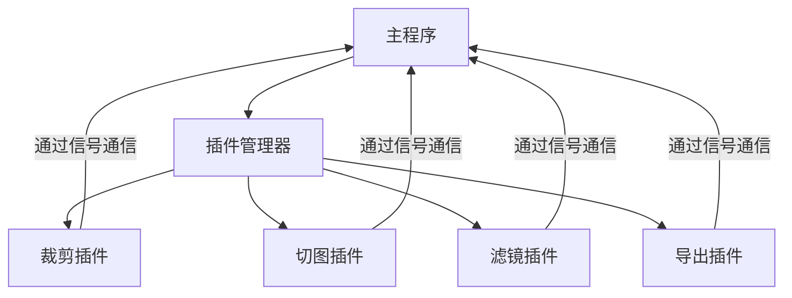

### 微服务架构

对于更复杂的功能，可以将某些服务模块独立为微服务，通过API进行通信，提高系统的可伸缩性和可靠性。

### 云集成

利用当前良好的模块化设计，可以轻松集成云存储服务，实现图像的云端存储和共享功能。

**Section sources**
- [main_window.py](file://app/main_window.py)
- [services](file://services/)
- [image_view.py](file://views/image_view.py)