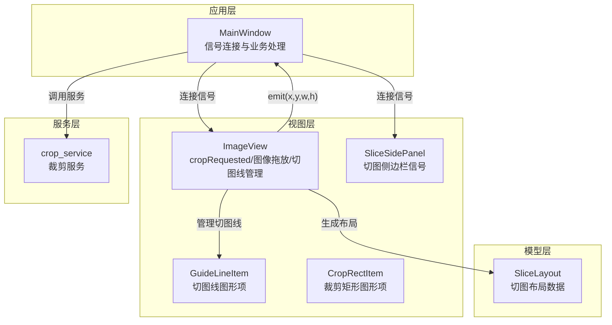
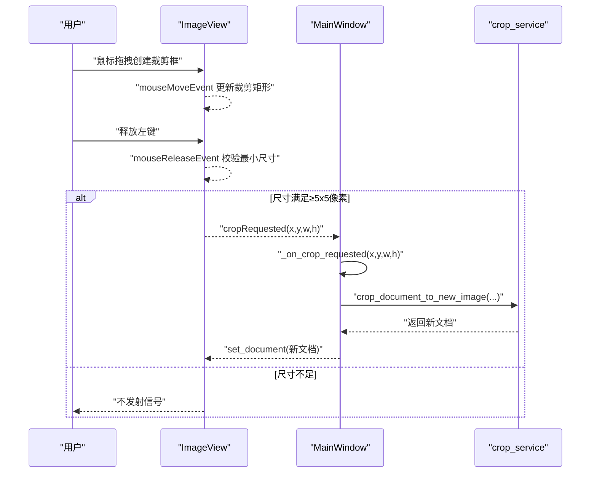
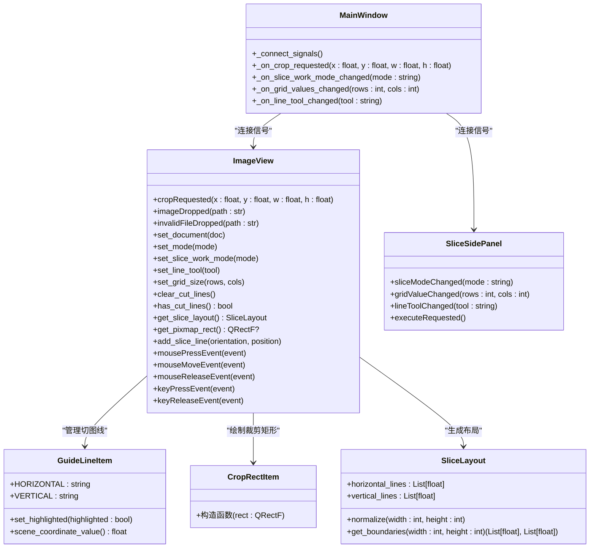

# 信号与槽机制

<cite>
**本文引用的文件**
- [img_slicer_tool/views/image_view.py](file://img_slicer_tool/views/image_view.py)
- [img_slicer_tool/views/overlay_items.py](file://img_slicer_tool/views/overlay_items.py)
- [img_slicer_tool/app/main_window.py](file://img_slicer_tool/app/main_window.py)
- [img_slicer_tool/views/slice_side_panel.py](file://img_slicer_tool/views/slice_side_panel.py)
- [img_slicer_tool/models/slice_layout.py](file://img_slicer_tool/models/slice_layout.py)
- [img_slicer_tool/services/crop_service.py](file://img_slicer_tool/services/crop_service.py)
</cite>

## 目录
1. [引言](#引言)
2. [项目结构](#项目结构)
3. [核心组件](#核心组件)
4. [架构总览](#架构总览)
5. [详细组件分析](#详细组件分析)
6. [依赖关系分析](#依赖关系分析)
7. [性能考量](#性能考量)
8. [故障排查指南](#故障排查指南)
9. [结论](#结论)

## 引言
本章节系统性梳理 PictureMaster 中基于 PySide6 的信号与槽通信机制，重点围绕以下目标展开：
- ImageView 类如何定义 cropRequested 信号，并在用户完成裁剪框拖拽后发射预览坐标（x, y, w, h）
- MainWindow 如何在 _connect_signals 方法中连接该信号至 _on_crop_requested 槽函数
- GuideLineItem 与 ImageView 之间的交互如何触发切图线布局更新，包括 add_slice_line 方法的调用流程
- keyPressEvent 和 mouseReleaseEvent 等事件处理函数如何协同工作以实现用户交互反馈
- 提供信号连接的代码示例路径、信号发射条件（如最小尺寸 5x5 像素限制）与参数传递机制
- 给出调试建议，如信号未连接或参数类型不匹配时的排查方法

## 项目结构
本项目采用“视图-模型-服务-应用”分层组织，其中与信号与槽直接相关的关键模块如下：
- 视图层：ImageView（图像视图）、OverlayItems（覆盖项，包含 GuideLineItem/CropRectItem）、SliceSidePanel（切图侧边栏）
- 应用层：MainWindow（主窗口，负责信号连接与业务逻辑）
- 模型层：SliceLayout（切图布局数据结构）
- 服务层：crop_service（裁剪服务）

图表来源
- [img_slicer_tool/app/main_window.py](file://img_slicer_tool/app/main_window.py#L87-L101)
- [img_slicer_tool/views/image_view.py](file://img_slicer_tool/views/image_view.py#L24-L31)
- [img_slicer_tool/views/overlay_items.py](file://img_slicer_tool/views/overlay_items.py#L27-L64)
- [img_slicer_tool/views/slice_side_panel.py](file://img_slicer_tool/views/slice_side_panel.py#L19-L26)
- [img_slicer_tool/models/slice_layout.py](file://img_slicer_tool/models/slice_layout.py#L7-L30)
- [img_slicer_tool/services/crop_service.py](file://img_slicer_tool/services/crop_service.py#L13-L38)

章节来源
- [img_slicer_tool/app/main_window.py](file://img_slicer_tool/app/main_window.py#L26-L101)
- [img_slicer_tool/views/image_view.py](file://img_slicer_tool/views/image_view.py#L24-L31)
- [img_slicer_tool/views/overlay_items.py](file://img_slicer_tool/views/overlay_items.py#L27-L64)
- [img_slicer_tool/views/slice_side_panel.py](file://img_slicer_tool/views/slice_side_panel.py#L19-L26)
- [img_slicer_tool/models/slice_layout.py](file://img_slicer_tool/models/slice_layout.py#L7-L30)
- [img_slicer_tool/services/crop_service.py](file://img_slicer_tool/services/crop_service.py#L13-L38)

## 核心组件
- ImageView：定义并发射 cropRequested 信号；管理裁剪矩形与切图线；响应键盘与鼠标事件；提供切图布局收集能力
- OverlayItems：包含 GuideLineItem 与 CropRectItem，用于渲染切图线与裁剪矩形
- SliceSidePanel：发出切图模式、网格参数、工具选择等信号
- MainWindow：集中连接所有信号，实现业务处理（裁剪、切图、模式切换等）
- SliceLayout：封装预览坐标系下的切图线布局，提供标准化与边界计算
- crop_service：执行裁剪并返回新文档

章节来源
- [img_slicer_tool/views/image_view.py](file://img_slicer_tool/views/image_view.py#L24-L31)
- [img_slicer_tool/views/overlay_items.py](file://img_slicer_tool/views/overlay_items.py#L27-L64)
- [img_slicer_tool/views/slice_side_panel.py](file://img_slicer_tool/views/slice_side_panel.py#L19-L26)
- [img_slicer_tool/app/main_window.py](file://img_slicer_tool/app/main_window.py#L87-L101)
- [img_slicer_tool/models/slice_layout.py](file://img_slicer_tool/models/slice_layout.py#L7-L30)
- [img_slicer_tool/services/crop_service.py](file://img_slicer_tool/services/crop_service.py#L13-L38)

## 架构总览
下图展示了 MainWindow 与 ImageView 之间通过信号与槽建立的连接关系，以及关键事件流：

图表来源
- [img_slicer_tool/views/image_view.py](file://img_slicer_tool/views/image_view.py#L185-L235)
- [img_slicer_tool/app/main_window.py](file://img_slicer_tool/app/main_window.py#L87-L101)
- [img_slicer_tool/services/crop_service.py](file://img_slicer_tool/services/crop_service.py#L13-L38)

章节来源
- [img_slicer_tool/views/image_view.py](file://img_slicer_tool/views/image_view.py#L185-L235)
- [img_slicer_tool/app/main_window.py](file://img_slicer_tool/app/main_window.py#L87-L101)
- [img_slicer_tool/services/crop_service.py](file://img_slicer_tool/services/crop_service.py#L13-L38)

## 详细组件分析

### ImageView 与裁剪信号：cropRequested
- 信号定义：在类初始化处声明 cropRequested 信号，参数为四个浮点数（x, y, w, h），代表预览坐标系下的矩形
- 发射条件：在鼠标释放事件中，当裁剪矩形宽度与高度均不小于 5 像素时，才发射信号
- 参数来源：从裁剪矩形的几何属性获取，确保传入的是预览坐标系的矩形参数
- 关键路径参考：
  - 信号声明位置：[img_slicer_tool/views/image_view.py](file://img_slicer_tool/views/image_view.py#L24-L31)
  - 鼠标事件与发射逻辑：[img_slicer_tool/views/image_view.py](file://img_slicer_tool/views/image_view.py#L185-L235)

章节来源
- [img_slicer_tool/views/image_view.py](file://img_slicer_tool/views/image_view.py#L24-L31)
- [img_slicer_tool/views/image_view.py](file://img_slicer_tool/views/image_view.py#L185-L235)

### MainWindow 与信号连接：_connect_signals 与 _on_crop_requested
- 信号连接：MainWindow 在 _connect_signals 中将 _image_view.cropRequested 连接到 _on_crop_requested
- 槽函数职责：弹窗确认裁剪区域，根据用户选择决定覆盖原图或另存为，随后调用裁剪服务生成新文档，并刷新视图
- 关键路径参考：
  - 信号连接位置：[img_slicer_tool/app/main_window.py](file://img_slicer_tool/app/main_window.py#L87-L101)
  - 槽函数实现位置：[img_slicer_tool/app/main_window.py](file://img_slicer_tool/app/main_window.py#L136-L193)
  - 裁剪服务调用：[img_slicer_tool/services/crop_service.py](file://img_slicer_tool/services/crop_service.py#L13-L38)

章节来源
- [img_slicer_tool/app/main_window.py](file://img_slicer_tool/app/main_window.py#L87-L101)
- [img_slicer_tool/app/main_window.py](file://img_slicer_tool/app/main_window.py#L136-L193)
- [img_slicer_tool/services/crop_service.py](file://img_slicer_tool/services/crop_service.py#L13-L38)

### GuideLineItem 与切图线布局更新
- 切图线渲染：GuideLineItem 作为 QGraphicsLineItem 子类，支持高亮与绘制样式切换
- 添加切图线：ImageView 提供 add_slice_line 与内部 _add_manual_line，将新线加入 cutLines 并创建对应的 GuideLineItem，随后调用 _update_line_geometry 更新其几何
- 布局收集：ImageView.get_slice_layout 将当前切图线转换为 SliceLayout，进行标准化与边界计算
- 关键路径参考：
  - GuideLineItem 定义：[img_slicer_tool/views/overlay_items.py](file://img_slicer_tool/views/overlay_items.py#L27-L64)
  - 添加切图线流程：[img_slicer_tool/views/image_view.py](file://img_slicer_tool/views/image_view.py#L333-L357)
  - 几何更新与高亮：[img_slicer_tool/views/image_view.py](file://img_slicer_tool/views/image_view.py#L367-L389)
  - 布局收集与标准化：[img_slicer_tool/views/image_view.py](file://img_slicer_tool/views/image_view.py#L236-L254)，[img_slicer_tool/models/slice_layout.py](file://img_slicer_tool/models/slice_layout.py#L7-L30)

章节来源
- [img_slicer_tool/views/overlay_items.py](file://img_slicer_tool/views/overlay_items.py#L27-L64)
- [img_slicer_tool/views/image_view.py](file://img_slicer_tool/views/image_view.py#L333-L357)
- [img_slicer_tool/views/image_view.py](file://img_slicer_tool/views/image_view.py#L367-L389)
- [img_slicer_tool/views/image_view.py](file://img_slicer_tool/views/image_view.py#L236-L254)
- [img_slicer_tool/models/slice_layout.py](file://img_slicer_tool/models/slice_layout.py#L7-L30)

### 键盘与鼠标事件协同：keyPressEvent 与 mouseReleaseEvent
- 键盘事件：
  - 空格键：切换滚动手型拖拽模式
  - Delete 键：在切图模式且手动模式下删除选中切图线
  - H/V 键：快速添加水平/垂直切图线
- 鼠标事件：
  - mousePressEvent：开始裁剪矩形或处理切图线选择/添加
  - mouseMoveEvent：拖拽更新裁剪矩形或拖拽移动切图线
  - mouseReleaseEvent：结束裁剪矩形并发射 cropRequested（满足最小尺寸条件）
- 关键路径参考：
  - 键盘事件处理：[img_slicer_tool/views/image_view.py](file://img_slicer_tool/views/image_view.py#L94-L116)
  - 鼠标事件处理与裁剪发射：[img_slicer_tool/views/image_view.py](file://img_slicer_tool/views/image_view.py#L154-L235)

章节来源
- [img_slicer_tool/views/image_view.py](file://img_slicer_tool/views/image_view.py#L94-L116)
- [img_slicer_tool/views/image_view.py](file://img_slicer_tool/views/image_view.py#L154-L235)

### 切图侧边栏信号与模式联动
- SliceSidePanel 定义多个信号：sliceModeChanged、gridValueChanged、lineToolChanged、executeRequested
- MainWindow 通过 _connect_signals 连接这些信号，驱动 ImageView 的工作模式、网格参数与工具切换
- 关键路径参考：
  - 信号定义与发射：[img_slicer_tool/views/slice_side_panel.py](file://img_slicer_tool/views/slice_side_panel.py#L19-L26)
  - 信号连接与处理：[img_slicer_tool/app/main_window.py](file://img_slicer_tool/app/main_window.py#L87-L101)

章节来源
- [img_slicer_tool/views/slice_side_panel.py](file://img_slicer_tool/views/slice_side_panel.py#L19-L26)
- [img_slicer_tool/app/main_window.py](file://img_slicer_tool/app/main_window.py#L87-L101)

### 类关系图（代码级）

图表来源
- [img_slicer_tool/views/image_view.py](file://img_slicer_tool/views/image_view.py#L24-L31)
- [img_slicer_tool/views/overlay_items.py](file://img_slicer_tool/views/overlay_items.py#L27-L64)
- [img_slicer_tool/views/slice_side_panel.py](file://img_slicer_tool/views/slice_side_panel.py#L19-L26)
- [img_slicer_tool/app/main_window.py](file://img_slicer_tool/app/main_window.py#L87-L101)
- [img_slicer_tool/models/slice_layout.py](file://img_slicer_tool/models/slice_layout.py#L7-L30)

## 依赖关系分析
- 低耦合高内聚：MainWindow 仅通过信号连接与视图交互，业务逻辑集中在服务层
- 事件驱动：用户操作通过事件回调触发，最终由信号发射与槽函数处理
- 数据流向：用户输入 → 事件处理 → 信号发射 → 槽函数 → 服务层处理 → 视图更新

图表来源
- [img_slicer_tool/views/image_view.py](file://img_slicer_tool/views/image_view.py#L94-L235)
- [img_slicer_tool/app/main_window.py](file://img_slicer_tool/app/main_window.py#L87-L101)
- [img_slicer_tool/services/crop_service.py](file://img_slicer_tool/services/crop_service.py#L13-L38)

章节来源
- [img_slicer_tool/views/image_view.py](file://img_slicer_tool/views/image_view.py#L94-L235)
- [img_slicer_tool/app/main_window.py](file://img_slicer_tool/app/main_window.py#L87-L101)
- [img_slicer_tool/services/crop_service.py](file://img_slicer_tool/services/crop_service.py#L13-L38)

## 性能考量
- 事件处理开销：裁剪矩形与切图线的频繁更新应避免不必要的重绘，可通过合理使用 QGraphicsScene 的视口更新策略
- 布局标准化：SliceLayout.normalize 会去重与过滤无效线条，减少后续切图计算量
- 最小尺寸校验：在 mouseReleaseEvent 中提前过滤无效矩形，避免无意义的业务调用

[本节为通用指导，无需列出具体文件来源]

## 故障排查指南
- 信号未连接
  - 现象：用户完成裁剪但未弹出确认对话框
  - 排查要点：确认 MainWindow._connect_signals 是否在构造阶段被调用；确认连接语句顺序是否正确；确认信号名称与参数类型一致
  - 参考路径：[img_slicer_tool/app/main_window.py](file://img_slicer_tool/app/main_window.py#L87-L101)
- 参数类型不匹配
  - 现象：槽函数签名与信号不一致导致连接失败或运行时报错
  - 排查要点：核对 cropRequested(x,y,w,h) 的浮点参数与槽函数签名一致；确保在 mouseReleaseEvent 中传入的参数类型正确
  - 参考路径：[img_slicer_tool/views/image_view.py](file://img_slicer_tool/views/image_view.py#L24-L31)，[img_slicer_tool/views/image_view.py](file://img_slicer_tool/views/image_view.py#L221-L231)
- 最小尺寸限制导致未发射
  - 现象：裁剪框过小未触发裁剪
  - 排查要点：检查 mouseReleaseEvent 中的尺寸判断逻辑；确认预览坐标系与实际像素尺寸换算
  - 参考路径：[img_slicer_tool/views/image_view.py](file://img_slicer_tool/views/image_view.py#L221-L231)
- 切图线未更新
  - 现象：添加/拖拽切图线后界面未反映
  - 排查要点：确认 _add_manual_line 后调用了 _update_line_geometry；确认 _update_line_geometry 正确映射到 GuideLineItem 的 setLine
  - 参考路径：[img_slicer_tool/views/image_view.py](file://img_slicer_tool/views/image_view.py#L333-L357)，[img_slicer_tool/views/image_view.py](file://img_slicer_tool/views/image_view.py#L367-L389)，[img_slicer_tool/views/overlay_items.py](file://img_slicer_tool/views/overlay_items.py#L27-L64)
- 切图布局为空
  - 现象：执行切图时提示只导出整张图片
  - 排查要点：确认 ImageView.get_slice_layout 已收集有效切图线；确认 SliceLayout.normalize 过滤了越界线条
  - 参考路径：[img_slicer_tool/views/image_view.py](file://img_slicer_tool/views/image_view.py#L236-L254)，[img_slicer_tool/models/slice_layout.py](file://img_slicer_tool/models/slice_layout.py#L14-L30)

章节来源
- [img_slicer_tool/app/main_window.py](file://img_slicer_tool/app/main_window.py#L87-L101)
- [img_slicer_tool/views/image_view.py](file://img_slicer_tool/views/image_view.py#L24-L31)
- [img_slicer_tool/views/image_view.py](file://img_slicer_tool/views/image_view.py#L221-L231)
- [img_slicer_tool/views/image_view.py](file://img_slicer_tool/views/image_view.py#L333-L357)
- [img_slicer_tool/views/image_view.py](file://img_slicer_tool/views/image_view.py#L367-L389)
- [img_slicer_tool/views/overlay_items.py](file://img_slicer_tool/views/overlay_items.py#L27-L64)
- [img_slicer_tool/views/image_view.py](file://img_slicer_tool/views/image_view.py#L236-L254)
- [img_slicer_tool/models/slice_layout.py](file://img_slicer_tool/models/slice_layout.py#L14-L30)

## 结论
本项目通过清晰的信号与槽设计实现了用户交互与业务处理的解耦。ImageView 负责事件处理与信号发射，MainWindow 负责业务编排与服务调用，OverlayItems 提供可视化元素，SliceSidePanel 提供模式与参数控制。最小尺寸校验、布局标准化与高亮反馈共同保证了良好的用户体验与稳定的性能表现。建议在扩展新功能时遵循现有信号命名与参数约定，保持连接顺序与类型一致性，以降低维护成本。