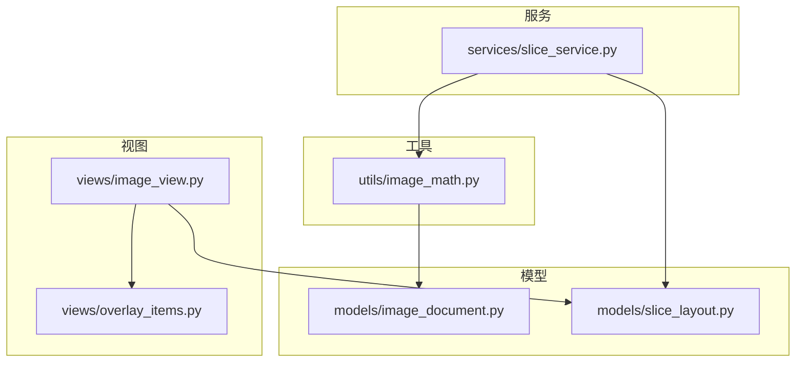
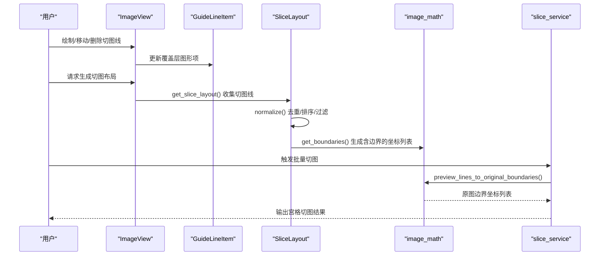
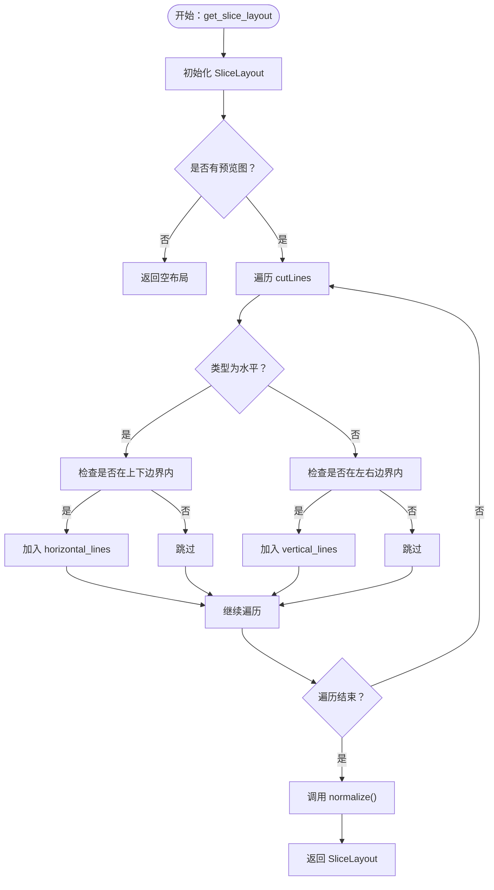
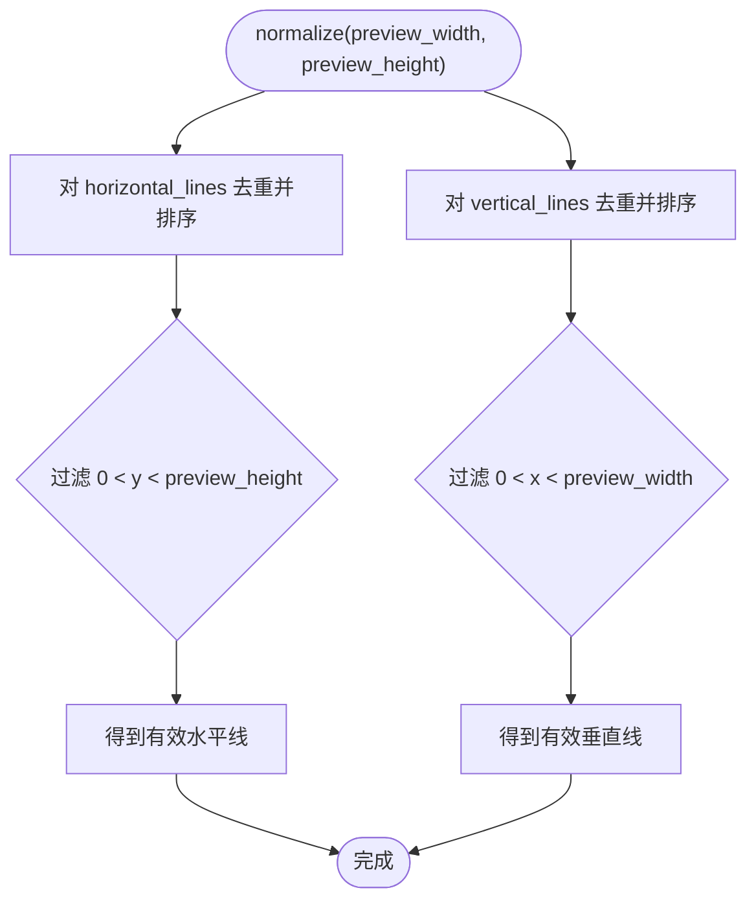
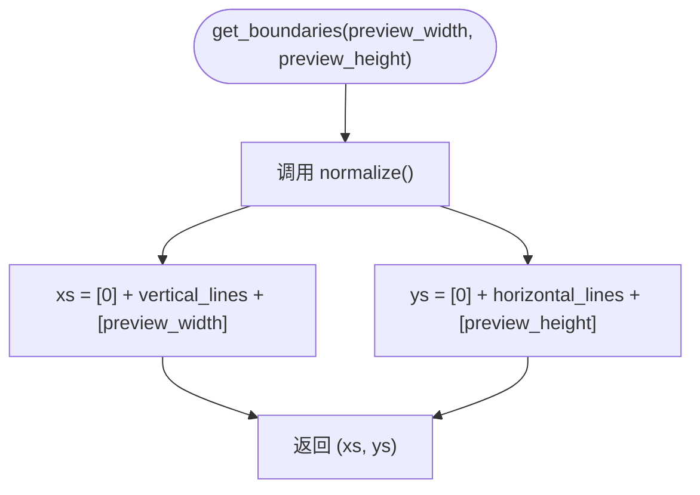
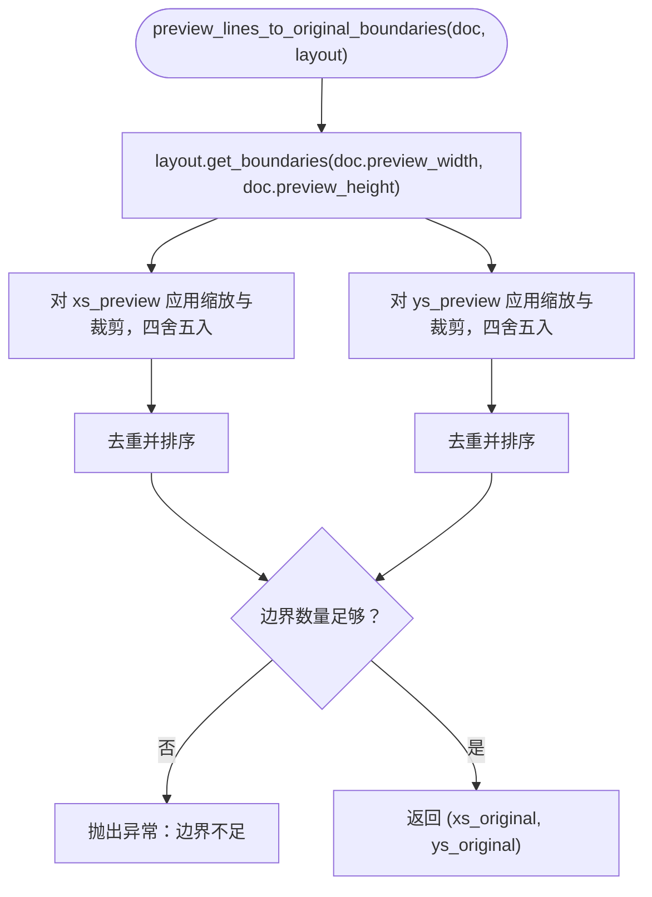
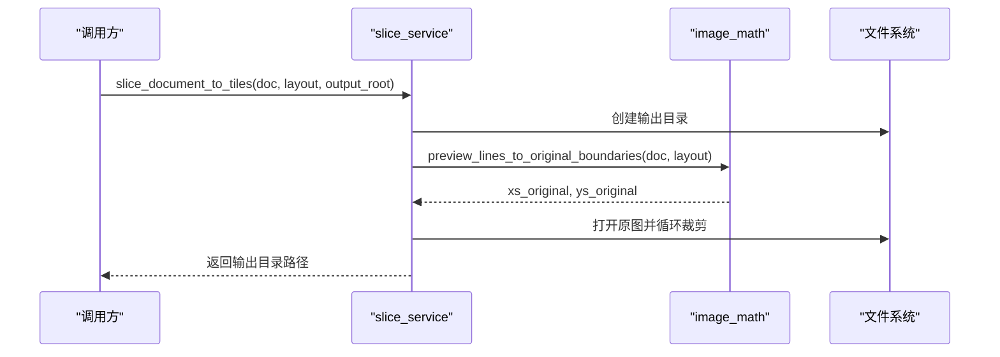
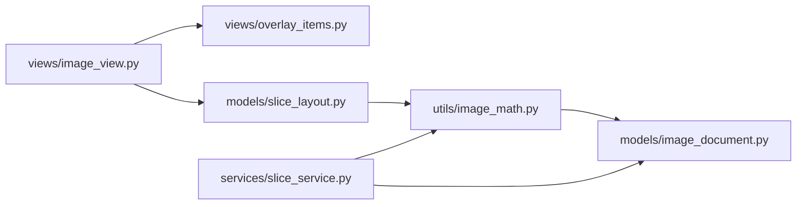

# 切图布局归一化

<cite>
**本文引用的文件**
- [models/slice_layout.py](file://img_slicer_tool/models/slice_layout.py)
- [views/image_view.py](file://img_slicer_tool/views/image_view.py)
- [views/overlay_items.py](file://img_slicer_tool/views/overlay_items.py)
- [utils/image_math.py](file://img_slicer_tool/utils/image_math.py)
- [services/slice_service.py](file://img_slicer_tool/services/slice_service.py)
- [models/image_document.py](file://img_slicer_tool/models/image_document.py)
</cite>

## 目录
1. [引言](#引言)
2. [项目结构](#项目结构)
3. [核心组件](#核心组件)
4. [架构总览](#架构总览)
5. [详细组件分析](#详细组件分析)
6. [依赖关系分析](#依赖关系分析)
7. [性能考量](#性能考量)
8. [故障排查指南](#故障排查指南)
9. [结论](#结论)

## 引言
本文件围绕“切图布局归一化”的主题，系统梳理从用户在预览画布中绘制或生成切图线，到最终形成可用于批量切图的“归一化边界坐标列表”的完整流程。重点解释以下三点：
- ImageView 的 get_slice_layout 如何遍历场景中的 GuideLineItem 图形项，收集其在预览坐标系下的位置信息，并填充到 SliceLayout 对象中。
- SliceLayout.normalize 的实现细节：如何对收集到的水平线和垂直线进行去重、排序，并过滤掉位于预览图边界之外的无效线条。
- get_boundaries 如何在归一化后，为切图算法生成包含图像边缘的完整边界坐标列表，确保切图数据的准确性和一致性，为后续批量切图提供可靠的数据基础。

## 项目结构
本仓库采用按职责分层的组织方式：
- models：数据模型，如 ImageDocument、SliceLayout。
- views：UI 视图与覆盖层，如 ImageView、GuideLineItem。
- services：业务服务，如切图服务 slice_service。
- utils：工具模块，如坐标转换 image_math。
- app/main_window.py：应用入口与主窗口逻辑（与本文主题相关处略）。

图表来源
- [models/slice_layout.py](file://img_slicer_tool/models/slice_layout.py#L1-L30)
- [views/image_view.py](file://img_slicer_tool/views/image_view.py#L1-L542)
- [views/overlay_items.py](file://img_slicer_tool/views/overlay_items.py#L1-L64)
- [utils/image_math.py](file://img_slicer_tool/utils/image_math.py#L1-L76)
- [services/slice_service.py](file://img_slicer_tool/services/slice_service.py#L1-L62)
- [models/image_document.py](file://img_slicer_tool/models/image_document.py#L1-L18)

章节来源
- [models/slice_layout.py](file://img_slicer_tool/models/slice_layout.py#L1-L30)
- [views/image_view.py](file://img_slicer_tool/views/image_view.py#L1-L542)
- [views/overlay_items.py](file://img_slicer_tool/views/overlay_items.py#L1-L64)
- [utils/image_math.py](file://img_slicer_tool/utils/image_math.py#L1-L76)
- [services/slice_service.py](file://img_slicer_tool/services/slice_service.py#L1-L62)
- [models/image_document.py](file://img_slicer_tool/models/image_document.py#L1-L18)

## 核心组件
- SliceLayout：在预览坐标系下保存水平线与垂直线集合，并提供 normalize 与 get_boundaries 方法，用于归一化与生成完整边界。
- ImageView：负责管理切图线数据 cutLines、渲染 GuideLineItem、收集切图线并生成 SliceLayout。
- GuideLineItem：表示一条横线或竖线的覆盖层图形项，提供场景坐标读取能力。
- image_math：提供预览坐标到原图坐标的转换，以及将预览线布局转换为原图边界坐标列表。
- slice_service：批量切图服务，调用 image_math 将预览边界映射到原图，然后对原图进行宫格裁剪。

章节来源
- [models/slice_layout.py](file://img_slicer_tool/models/slice_layout.py#L1-L30)
- [views/image_view.py](file://img_slicer_tool/views/image_view.py#L236-L253)
- [views/overlay_items.py](file://img_slicer_tool/views/overlay_items.py#L27-L64)
- [utils/image_math.py](file://img_slicer_tool/utils/image_math.py#L50-L76)
- [services/slice_service.py](file://img_slicer_tool/services/slice_service.py#L12-L62)

## 架构总览
下图展示了从用户交互到批量切图的关键调用链路与数据流。

图表来源
- [views/image_view.py](file://img_slicer_tool/views/image_view.py#L236-L253)
- [models/slice_layout.py](file://img_slicer_tool/models/slice_layout.py#L14-L29)
- [utils/image_math.py](file://img_slicer_tool/utils/image_math.py#L50-L76)
- [services/slice_service.py](file://img_slicer_tool/services/slice_service.py#L12-L62)

## 详细组件分析

### ImageView.get_slice_layout：从 GuideLineItem 收集切图线
- 数据来源：ImageView 内部维护的切图线数组 cutLines，其中每条线包含类型（水平/垂直）与位置（预览坐标系）。
- 过滤策略：
  - 水平线仅在预览图上下边界范围内有效；垂直线仅在左右边界范围内有效。
  - 通过比较 line["pos"] 与 pixmap_rect 的边界，剔除越界的线。
- 填充策略：将满足范围条件的线位置分别追加到 SliceLayout 的 horizontal_lines 或 vertical_lines。
- 归一化：在收集完成后调用 layout.normalize，统一进行去重、排序与边界外过滤。

图表来源
- [views/image_view.py](file://img_slicer_tool/views/image_view.py#L236-L253)

章节来源
- [views/image_view.py](file://img_slicer_tool/views/image_view.py#L236-L253)

### SliceLayout.normalize：去重、排序与边界过滤
- 输入：预览宽度与高度。
- 处理逻辑：
  - 水平线：去重（集合）、排序（升序）、过滤（仅保留 0 < y < preview_height 的值）。
  - 垂直线：去重（集合）、排序（升序）、过滤（仅保留 0 < x < preview_width 的值）。
- 输出：更新 horizontal_lines 与 vertical_lines，保证无重复、有序且在有效区域内。

图表来源
- [models/slice_layout.py](file://img_slicer_tool/models/slice_layout.py#L14-L17)

章节来源
- [models/slice_layout.py](file://img_slicer_tool/models/slice_layout.py#L14-L17)

### SliceLayout.get_boundaries：生成含边界的完整坐标列表
- 步骤：
  - 先调用 normalize，确保水平线与垂直线处于有效区间且无重复。
  - 在水平方向拼接：[0, 水平线列表, preview_height]。
  - 在垂直方向拼接：[0, 垂直线列表, preview_width]。
- 输出：xs（垂直边界列表）、ys（水平边界列表），作为后续切图的网格边界。

图表来源
- [models/slice_layout.py](file://img_slicer_tool/models/slice_layout.py#L19-L29)

章节来源
- [models/slice_layout.py](file://img_slicer_tool/models/slice_layout.py#L19-L29)

### 预览坐标到原图坐标的映射：image_math.preview_lines_to_original_boundaries
- 输入：ImageDocument（包含 scale_x、scale_y、preview_width、preview_height）与 SliceLayout（预览坐标系的切图线）。
- 步骤：
  - 调用 layout.get_boundaries 获取含边界的预览坐标列表。
  - 将每个预览坐标乘以对应缩放因子并四舍五入，同时裁剪到原图有效范围。
  - 对结果去重并排序，确保边界严格递增且在原图范围内。
  - 校验边界数量，至少需要两个不同的 x 坐标与两个不同的 y 坐标才能形成有效宫格。
- 输出：xs_original、ys_original（原图坐标系的边界列表）。

图表来源
- [utils/image_math.py](file://img_slicer_tool/utils/image_math.py#L50-L76)
- [models/slice_layout.py](file://img_slicer_tool/models/slice_layout.py#L19-L29)
- [models/image_document.py](file://img_slicer_tool/models/image_document.py#L1-L18)

章节来源
- [utils/image_math.py](file://img_slicer_tool/utils/image_math.py#L50-L76)
- [models/slice_layout.py](file://img_slicer_tool/models/slice_layout.py#L19-L29)
- [models/image_document.py](file://img_slicer_tool/models/image_document.py#L1-L18)

### 切图服务：slice_service.slice_document_to_tiles
- 输入：ImageDocument、SliceLayout（预览坐标系）、输出根目录。
- 步骤：
  - 创建输出目录，按原图名建立子目录。
  - 调用 image_math 将预览边界映射到原图边界。
  - 打开原图，按边界生成宫格，逐个裁剪并保存。
- 输出：实际使用的输出子目录路径。

图表来源
- [services/slice_service.py](file://img_slicer_tool/services/slice_service.py#L12-L62)
- [utils/image_math.py](file://img_slicer_tool/utils/image_math.py#L50-L76)

章节来源
- [services/slice_service.py](file://img_slicer_tool/services/slice_service.py#L12-L62)

## 依赖关系分析
- ImageView 依赖 OverlayItems（GuideLineItem）以渲染与管理切图线；同时依赖 SliceLayout 生成布局。
- SliceLayout 由 ImageView 在收集阶段填充，随后被 image_math 与 slice_service 使用。
- image_math 依赖 ImageDocument 提供缩放比例与预览尺寸，将预览坐标映射到原图坐标。
- slice_service 依赖 image_math 与 ImageDocument，完成批量切图。

图表来源
- [views/image_view.py](file://img_slicer_tool/views/image_view.py#L1-L542)
- [views/overlay_items.py](file://img_slicer_tool/views/overlay_items.py#L1-L64)
- [models/slice_layout.py](file://img_slicer_tool/models/slice_layout.py#L1-L30)
- [utils/image_math.py](file://img_slicer_tool/utils/image_math.py#L1-L76)
- [services/slice_service.py](file://img_slicer_tool/services/slice_service.py#L1-L62)
- [models/image_document.py](file://img_slicer_tool/models/image_document.py#L1-L18)

章节来源
- [views/image_view.py](file://img_slicer_tool/views/image_view.py#L1-L542)
- [views/overlay_items.py](file://img_slicer_tool/views/overlay_items.py#L1-L64)
- [models/slice_layout.py](file://img_slicer_tool/models/slice_layout.py#L1-L30)
- [utils/image_math.py](file://img_slicer_tool/utils/image_math.py#L1-L76)
- [services/slice_service.py](file://img_slicer_tool/services/slice_service.py#L1-L62)
- [models/image_document.py](file://img_slicer_tool/models/image_document.py#L1-L18)

## 性能考量
- 去重与排序：
  - 使用集合去重的时间复杂度为 O(n)，随后排序为 O(n log n)。整体对单类线条为 O(n log n)。
- 过滤边界外线条：
  - 单次遍历即可完成，时间复杂度 O(n)。
- 预览到原图映射：
  - 线性遍历 xs/ys 并做乘法与裁剪，时间复杂度 O(m)（m 为边界点数）。
- 总体复杂度：
  - 若预览线条总数为 n，则总体复杂度约为 O(n log n)（主导来自去重后的排序）。
- 优化建议：
  - 在 UI 层尽量减少重复添加相同位置的线条，降低后续去重成本。
  - 对大量线条场景，可在前端进行更严格的输入约束与预过滤。

## 故障排查指南
- 切图结果为空或报错“边界不足”：
  - 检查是否正确生成了水平/垂直线条，确认它们都在预览图边界内。
  - 确认 normalize 后仍有有效线条，避免全被过滤。
  - 参考路径：[models/slice_layout.py](file://img_slicer_tool/models/slice_layout.py#L14-L17)、[utils/image_math.py](file://img_slicer_tool/utils/image_math.py#L69-L76)
- 预览坐标与原图坐标不一致：
  - 确认 ImageDocument 的 scale_x/scale_y 是否正确计算。
  - 检查映射函数中是否进行了正确的四舍五入与裁剪。
  - 参考路径：[models/image_document.py](file://img_slicer_tool/models/image_document.py#L1-L18)、[utils/image_math.py](file://img_slicer_tool/utils/image_math.py#L50-L76)
- 切图服务未生成文件：
  - 确认输出根目录存在且可写。
  - 检查原图路径是否存在。
  - 参考路径：[services/slice_service.py](file://img_slicer_tool/services/slice_service.py#L12-L62)

章节来源
- [models/slice_layout.py](file://img_slicer_tool/models/slice_layout.py#L14-L17)
- [utils/image_math.py](file://img_slicer_tool/utils/image_math.py#L50-L76)
- [models/image_document.py](file://img_slicer_tool/models/image_document.py#L1-L18)
- [services/slice_service.py](file://img_slicer_tool/services/slice_service.py#L12-L62)

## 结论
通过 ImageView 的 get_slice_layout 与 SliceLayout 的 normalize/get_boundaries，系统实现了从用户交互到预览坐标系的规范布局；再借助 image_math 的预览到原图映射，最终形成稳定的原图边界坐标列表。该流程确保：
- 数据一致性：去重、排序与边界过滤保证线条集合稳定。
- 准确性：预览与原图坐标映射严格遵循缩放比例与裁剪规则。
- 可靠性：批量切图服务基于上述边界进行宫格裁剪，避免越界与无效区域。