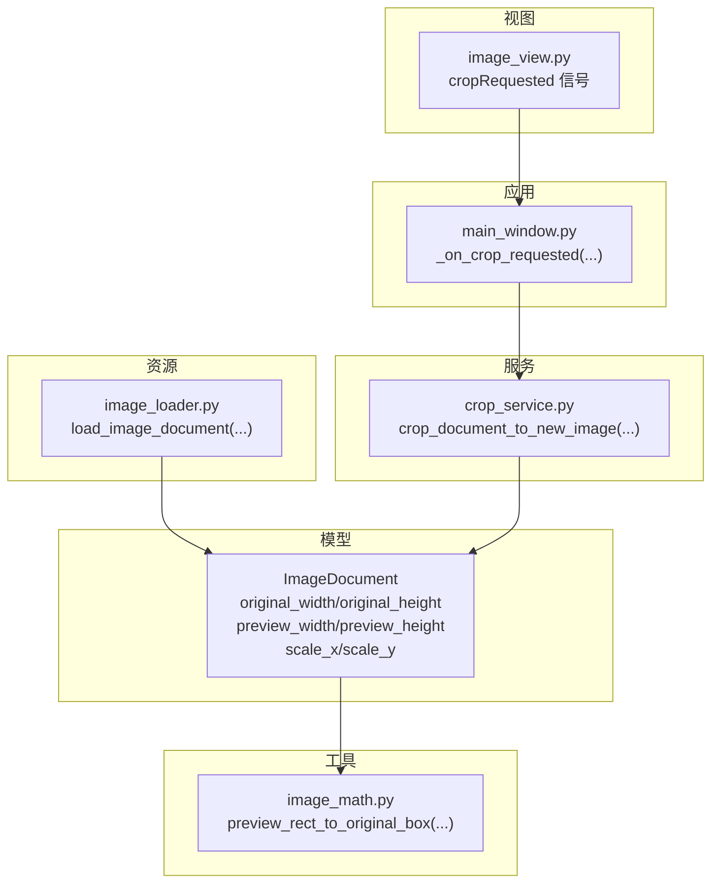
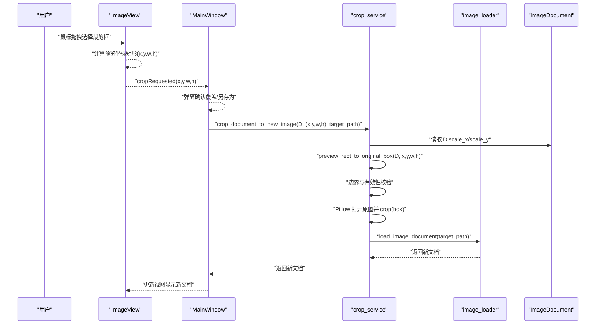
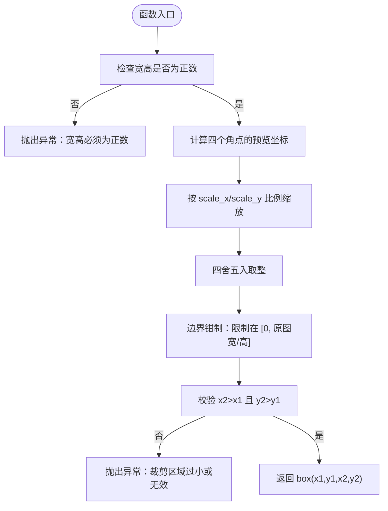
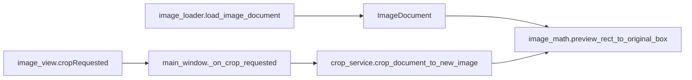

# 坐标映射机制

<cite>
**本文引用的文件**
- [img_slicer_tool/utils/image_math.py](file://img_slicer_tool/utils/image_math.py)
- [img_slicer_tool/models/image_document.py](file://img_slicer_tool/models/image_document.py)
- [img_slicer_tool/services/image_loader.py](file://img_slicer_tool/services/image_loader.py)
- [img_slicer_tool/views/image_view.py](file://img_slicer_tool/views/image_view.py)
- [img_slicer_tool/services/crop_service.py](file://img_slicer_tool/services/crop_service.py)
- [img_slicer_tool/app/main_window.py](file://img_slicer_tool/app/main_window.py)
</cite>

## 目录
1. [引言](#引言)
2. [项目结构](#项目结构)
3. [核心组件](#核心组件)
4. [架构总览](#架构总览)
5. [详细组件分析](#详细组件分析)
6. [依赖关系分析](#依赖关系分析)
7. [性能考量](#性能考量)
8. [故障排查指南](#故障排查指南)
9. [结论](#结论)

## 引言
本文件聚焦 PictureMaster 中“预览坐标到原图坐标”的映射原理，系统性解析以下问题：
- 如何利用 ImageDocument 的 scale_x 和 scale_y 将预览图上的浮点坐标（x, y, w, h）转换为原图整数像素 box（x1, y1, x2, y2）。
- 函数内部的边界检查与有效性校验逻辑，确保转换结果不越界且有效。
- 从 ImageView 发出的 cropRequested 信号参数到最终传给 crop_service 的原图 box 的完整调用链路。

## 项目结构
围绕坐标映射的相关文件组织如下：
- 数据模型：ImageDocument（包含 original_width/original_height、preview_width/preview_height、scale_x/scale_y、preview_pixmap）
- 数学工具：image_math.py（提供预览坐标到原图 box 的转换函数）
- 视图层：image_view.py（负责捕获用户拖拽裁剪框，发出 cropRequested 信号）
- 应用层：main_window.py（接收信号，弹窗确认，调用裁剪服务）
- 服务层：crop_service.py（读取原图，执行裁剪，生成新文档）
- 资源加载：image_loader.py（计算预览尺寸与缩放比，构造 ImageDocument）

图表来源
- [img_slicer_tool/models/image_document.py](file://img_slicer_tool/models/image_document.py#L8-L17)
- [img_slicer_tool/utils/image_math.py](file://img_slicer_tool/utils/image_math.py#L17-L48)
- [img_slicer_tool/views/image_view.py](file://img_slicer_tool/views/image_view.py#L24-L31)
- [img_slicer_tool/app/main_window.py](file://img_slicer_tool/app/main_window.py#L136-L193)
- [img_slicer_tool/services/crop_service.py](file://img_slicer_tool/services/crop_service.py#L13-L38)
- [img_slicer_tool/services/image_loader.py](file://img_slicer_tool/services/image_loader.py#L24-L54)

章节来源
- [img_slicer_tool/utils/image_math.py](file://img_slicer_tool/utils/image_math.py#L17-L48)
- [img_slicer_tool/models/image_document.py](file://img_slicer_tool/models/image_document.py#L8-L17)
- [img_slicer_tool/services/image_loader.py](file://img_slicer_tool/services/image_loader.py#L24-L54)
- [img_slicer_tool/views/image_view.py](file://img_slicer_tool/views/image_view.py#L24-L31)
- [img_slicer_tool/app/main_window.py](file://img_slicer_tool/app/main_window.py#L136-L193)
- [img_slicer_tool/services/crop_service.py](file://img_slicer_tool/services/crop_service.py#L13-L38)

## 核心组件
- ImageDocument：承载原图与预览图的尺寸信息及缩放比，是坐标映射的“基准单位”。
- image_math.preview_rect_to_original_box：核心转换函数，将预览坐标矩形映射为原图 box，并进行边界与有效性校验。
- image_loader.load_image_document：负责计算预览尺寸与缩放比，构造 ImageDocument。
- ImageView.cropRequested：由用户在预览图上拖拽选择区域后发出，携带预览坐标系的矩形参数。
- MainWindow._on_crop_requested：接收信号，弹窗确认，调用裁剪服务。
- crop_service.crop_document_to_new_image：读取原图，执行裁剪，生成新文档。

章节来源
- [img_slicer_tool/models/image_document.py](file://img_slicer_tool/models/image_document.py#L8-L17)
- [img_slicer_tool/utils/image_math.py](file://img_slicer_tool/utils/image_math.py#L17-L48)
- [img_slicer_tool/services/image_loader.py](file://img_slicer_tool/services/image_loader.py#L24-L54)
- [img_slicer_tool/views/image_view.py](file://img_slicer_tool/views/image_view.py#L24-L31)
- [img_slicer_tool/app/main_window.py](file://img_slicer_tool/app/main_window.py#L136-L193)
- [img_slicer_tool/services/crop_service.py](file://img_slicer_tool/services/crop_service.py#L13-L38)

## 架构总览
下面的序列图展示了从用户在 ImageView 上拖拽选择裁剪区域，到最终在原图上执行裁剪的完整流程。

图表来源
- [img_slicer_tool/views/image_view.py](file://img_slicer_tool/views/image_view.py#L24-L31)
- [img_slicer_tool/app/main_window.py](file://img_slicer_tool/app/main_window.py#L136-L193)
- [img_slicer_tool/services/crop_service.py](file://img_slicer_tool/services/crop_service.py#L13-L38)
- [img_slicer_tool/utils/image_math.py](file://img_slicer_tool/utils/image_math.py#L17-L48)
- [img_slicer_tool/services/image_loader.py](file://img_slicer_tool/services/image_loader.py#L24-L54)
- [img_slicer_tool/models/image_document.py](file://img_slicer_tool/models/image_document.py#L8-L17)

## 详细组件分析

### 预览坐标到原图 box 的映射原理
- 输入：预览坐标系的矩形（x, y, w, h），以及 ImageDocument（包含 original_width/original_height、preview_width/preview_height、scale_x/scale_y）。
- 输出：原图像素坐标 box（x1, y1, x2, y2），均为整数。
- 关键步骤：
  1) 参数校验：w <= 0 或 h <= 0 时抛出异常，防止无效区域。
  2) 计算四个角点的预览坐标：(x1_preview, y1_preview)、(x2_preview, y2_preview)。
  3) 比例缩放：x1 = round(x1_preview * scale_x)，y1 = round(y1_preview * scale_y)，x2 = round(x2_preview * scale_x)，y2 = round(x2_preview * scale_y)。
  4) 四舍五入取整：保证得到整数像素坐标。
  5) 边界钳制：将坐标限制在 [0, original_width] 与 [0, original_height] 范围内。
  6) 有效性校验：若 x2 <= x1 或 y2 <= y1，则抛出异常，确保裁剪区域有效。
  7) 返回 box（x1, y1, x2, y2）。

图表来源
- [img_slicer_tool/utils/image_math.py](file://img_slicer_tool/utils/image_math.py#L17-L48)

章节来源
- [img_slicer_tool/utils/image_math.py](file://img_slicer_tool/utils/image_math.py#L17-L48)

### ImageDocument 的 scale_x 与 scale_y 的来源与作用
- scale_x = original_width / preview_width
- scale_y = original_height / preview_height
- 作用：将预览坐标系的浮点值映射到原图像素坐标系；由于预览图可能小于原图，scale_x/scale_y 通常大于等于 1。

章节来源
- [img_slicer_tool/services/image_loader.py](file://img_slicer_tool/services/image_loader.py#L42-L43)
- [img_slicer_tool/models/image_document.py](file://img_slicer_tool/models/image_document.py#L11-L16)

### ImageView 的 cropRequested 信号与参数
- 信号定义：cropRequested(float, float, float, float)
- 触发时机：用户在预览图上拖拽结束，且矩形满足最小尺寸要求时，发出 (x, y, w, h)。
- 参数含义：预览坐标系下的矩形左上角与宽高，均为浮点数。

章节来源
- [img_slicer_tool/views/image_view.py](file://img_slicer_tool/views/image_view.py#L24-L31)
- [img_slicer_tool/views/image_view.py](file://img_slicer_tool/views/image_view.py#L223-L229)

### MainWindow 接收信号并调用裁剪服务
- 连接：MainWindow._connect_signals 中连接 _image_view.cropRequested -> _on_crop_requested。
- 处理：弹窗确认（覆盖原图/另存为），准备 preview_rect = (x, y, w, h)，调用 crop_document_to_new_image。
- 更新：成功后更新 _current_document 并刷新视图。

章节来源
- [img_slicer_tool/app/main_window.py](file://img_slicer_tool/app/main_window.py#L87-L101)
- [img_slicer_tool/app/main_window.py](file://img_slicer_tool/app/main_window.py#L136-L193)

### crop_service 的裁剪流程
- 参数：doc（ImageDocument）、preview_rect（预览坐标矩形）、target_path（保存路径）。
- 步骤：
  1) 校验原图路径存在。
  2) 调用 preview_rect_to_original_box 将预览矩形转换为原图 box。
  3) 使用 Pillow 打开原图并 crop(box)，保存到目标路径。
  4) 重新加载新图生成新文档并返回。

章节来源
- [img_slicer_tool/services/crop_service.py](file://img_slicer_tool/services/crop_service.py#L13-L38)
- [img_slicer_tool/utils/image_math.py](file://img_slicer_tool/utils/image_math.py#L17-L48)

### 边界检查与有效性校验
- 宽高校验：w <= 0 或 h <= 0 直接抛异常，避免无效裁剪区域。
- 顺序校验：x2 <= x1 或 y2 <= y1 抛异常，确保矩形有效。
- 边界钳制：将坐标限制在 [0, original_width] 与 [0, original_height]，防止越界。

章节来源
- [img_slicer_tool/utils/image_math.py](file://img_slicer_tool/utils/image_math.py#L26-L47)

## 依赖关系分析
- image_math.preview_rect_to_original_box 依赖 ImageDocument 的 scale_x/scale_y。
- crop_service.crop_document_to_new_image 依赖 image_math.preview_rect_to_original_box。
- ImageView 与 MainWindow 之间通过信号连接，形成 UI 与业务层的解耦。
- image_loader 负责构造 ImageDocument，提供 scale_x/scale_y 的来源。

图表来源
- [img_slicer_tool/services/image_loader.py](file://img_slicer_tool/services/image_loader.py#L24-L54)
- [img_slicer_tool/models/image_document.py](file://img_slicer_tool/models/image_document.py#L8-L17)
- [img_slicer_tool/utils/image_math.py](file://img_slicer_tool/utils/image_math.py#L17-L48)
- [img_slicer_tool/views/image_view.py](file://img_slicer_tool/views/image_view.py#L24-L31)
- [img_slicer_tool/app/main_window.py](file://img_slicer_tool/app/main_window.py#L136-L193)
- [img_slicer_tool/services/crop_service.py](file://img_slicer_tool/services/crop_service.py#L13-L38)

## 性能考量
- 预览尺寸与缩放比：image_loader 在预览尺寸超过阈值时会等比缩小，从而降低内存占用与渲染压力；scale_x/scale_y 为常量，转换过程为 O(1)。
- 四舍五入与边界钳制：均为常量时间操作，对性能影响可忽略。
- 裁剪操作：Pillow 的 crop 与保存为 I/O 密集型，受磁盘写入速度影响。

## 故障排查指南
- 抛出“宽高必须为正数”异常
  - 可能原因：用户拖拽距离过短，导致 w 或 h 过小。
  - 解决建议：确保拖拽矩形宽度与高度均满足最小尺寸要求。
- 抛出“裁剪区域过小或无效”异常
  - 可能原因：x2 <= x1 或 y2 <= y1，常见于拖拽方向不正确或矩形极小。
  - 解决建议：重新拖拽，确保矩形有效且方向正确。
- 裁剪结果越界或被裁掉一部分
  - 可能原因：预览坐标超出预览图边界，但被钳制到 [0, 原图宽/高]。
  - 解决建议：在预览图中尽量靠近中心区域拖拽，或调整预览视图缩放后再试。

章节来源
- [img_slicer_tool/utils/image_math.py](file://img_slicer_tool/utils/image_math.py#L26-L47)
- [img_slicer_tool/views/image_view.py](file://img_slicer_tool/views/image_view.py#L223-L229)

## 结论
- 预览坐标到原图坐标的映射以 ImageDocument 的 scale_x/scale_y 为核心，通过比例缩放与四舍五入取整实现。
- 函数内部严格进行宽高与有效性校验，并对坐标进行边界钳制，确保转换结果合法且不越界。
- 从 ImageView 的 cropRequested 信号到 crop_service 的完整调用链清晰、职责分明，便于维护与扩展。