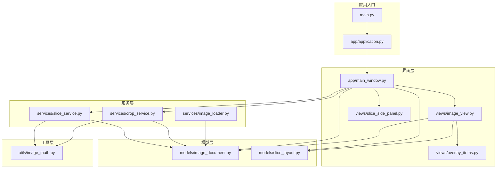
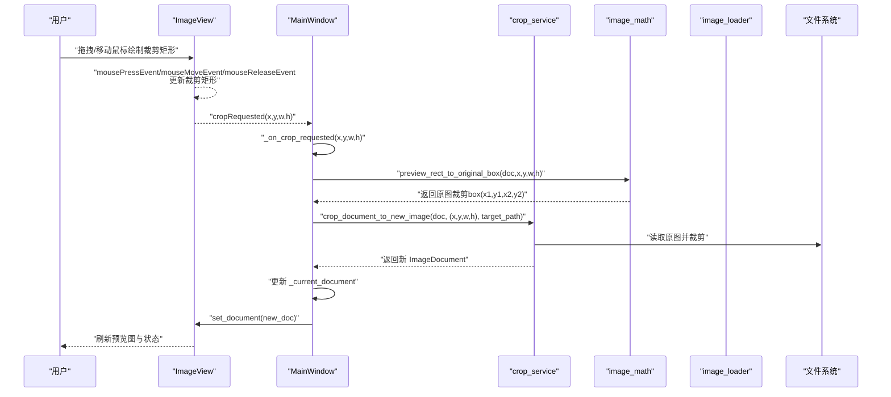
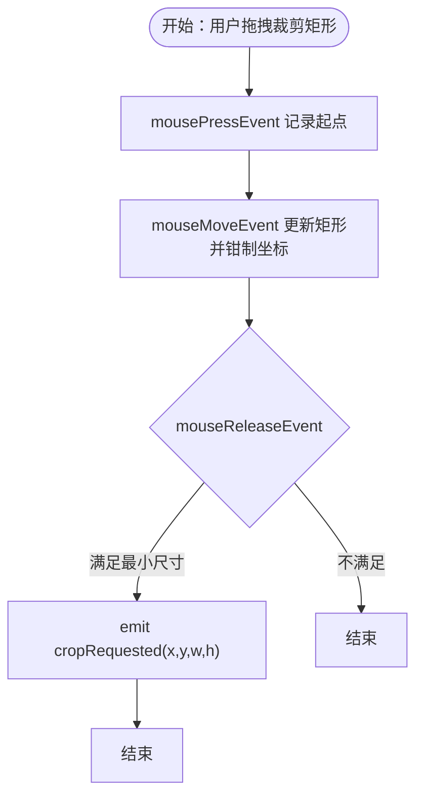
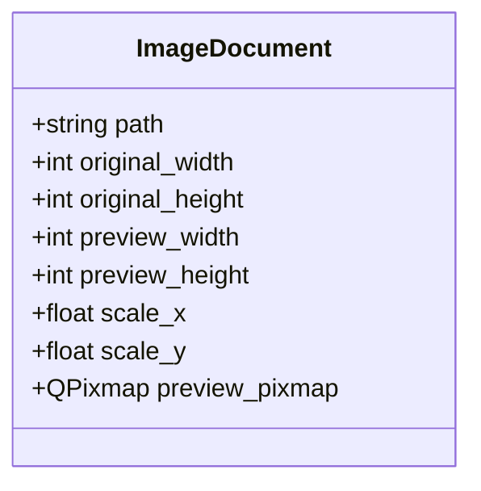
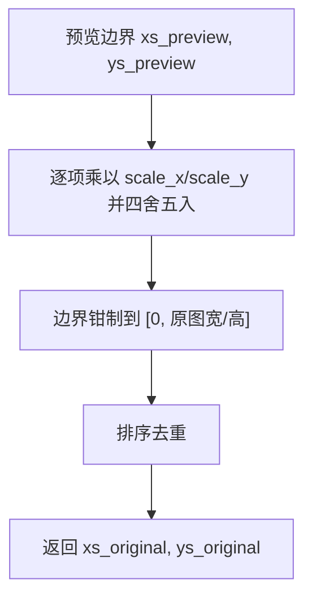
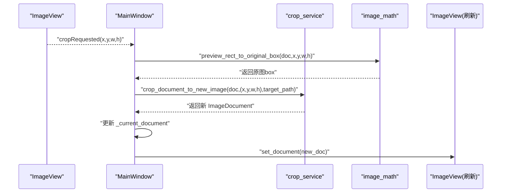
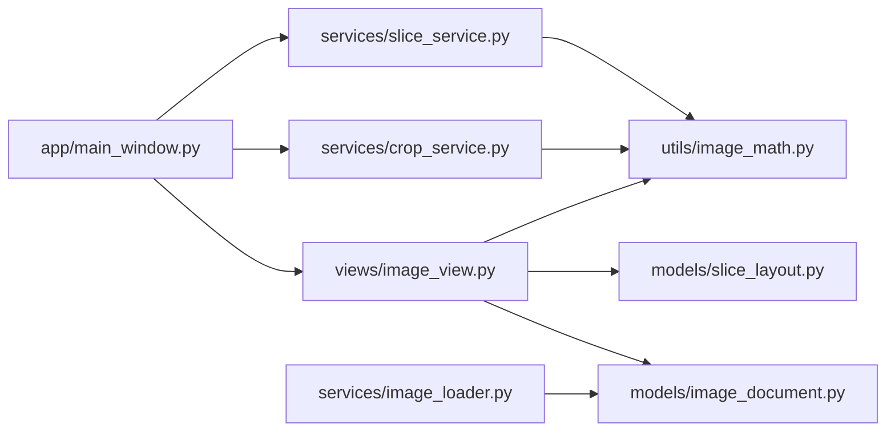

# 数据流传递

<cite>
**本文引用的文件**
- [main.py](file://img_slicer_tool/main.py)
- [application.py](file://img_slicer_tool/app/application.py)
- [main_window.py](file://img_slicer_tool/app/main_window.py)
- [image_view.py](file://img_slicer_tool/views/image_view.py)
- [overlay_items.py](file://img_slicer_tool/views/overlay_items.py)
- [slice_side_panel.py](file://img_slicer_tool/views/slice_side_panel.py)
- [image_document.py](file://img_slicer_tool/models/image_document.py)
- [slice_layout.py](file://img_slicer_tool/models/slice_layout.py)
- [image_loader.py](file://img_slicer_tool/services/image_loader.py)
- [image_math.py](file://img_slicer_tool/utils/image_math.py)
- [crop_service.py](file://img_slicer_tool/services/crop_service.py)
- [slice_service.py](file://img_slicer_tool/services/slice_service.py)
</cite>

## 目录
1. [引言](#引言)
2. [项目结构](#项目结构)
3. [核心组件](#核心组件)
4. [架构总览](#架构总览)
5. [详细组件分析](#详细组件分析)
6. [依赖关系分析](#依赖关系分析)
7. [性能考量](#性能考量)
8. [故障排查指南](#故障排查指南)
9. [结论](#结论)

## 引言
本文件围绕 PictureMaster 应用中的“数据流传递”主题，系统梳理从用户交互到数据模型、再到服务层的完整流程。重点包括：
- ImageView 如何通过 get_slice_layout 收集 GuideLineItem 的预览坐标并归一化为 SliceLayout；
- 预览坐标到原图坐标的映射原理（image_math.py 中的比例计算）；
- ImageDocument 在 load_image、set_document 以及裁切操作中作为核心数据载体的传递与更新；
- cropRequested 信号从 ImageView 传入 MainWindow 的 _on_crop_requested 并驱动服务调用；
- 数据流中的边界检查与状态同步（如 _current_document 的更新）。

## 项目结构
应用采用分层组织：视图层（views）、模型层（models）、服务层（services）、工具层（utils）、应用入口（app/main.py）与入口脚本（main.py）。

图表来源
- [main.py](file://img_slicer_tool/main.py#L1-L13)
- [application.py](file://img_slicer_tool/app/application.py)
- [main_window.py](file://img_slicer_tool/app/main_window.py#L1-L364)
- [image_view.py](file://img_slicer_tool/views/image_view.py#L1-L542)
- [overlay_items.py](file://img_slicer_tool/views/overlay_items.py#L1-L64)
- [slice_side_panel.py](file://img_slicer_tool/views/slice_side_panel.py#L1-L174)
- [image_document.py](file://img_slicer_tool/models/image_document.py#L1-L18)
- [slice_layout.py](file://img_slicer_tool/models/slice_layout.py#L1-L30)
- [image_loader.py](file://img_slicer_tool/services/image_loader.py#L1-L68)
- [image_math.py](file://img_slicer_tool/utils/image_math.py#L1-L76)
- [crop_service.py](file://img_slicer_tool/services/crop_service.py#L1-L38)
- [slice_service.py](file://img_slicer_tool/services/slice_service.py#L1-L62)

章节来源
- [main.py](file://img_slicer_tool/main.py#L1-L13)
- [application.py](file://img_slicer_tool/app/application.py)
- [main_window.py](file://img_slicer_tool/app/main_window.py#L1-L364)
- [image_view.py](file://img_slicer_tool/views/image_view.py#L1-L542)
- [image_document.py](file://img_slicer_tool/models/image_document.py#L1-L18)
- [slice_layout.py](file://img_slicer_tool/models/slice_layout.py#L1-L30)
- [image_loader.py](file://img_slicer_tool/services/image_loader.py#L1-L68)
- [image_math.py](file://img_slicer_tool/utils/image_math.py#L1-L76)
- [crop_service.py](file://img_slicer_tool/services/crop_service.py#L1-L38)
- [slice_service.py](file://img_slicer_tool/services/slice_service.py#L1-L62)

## 核心组件
- ImageDocument：承载原图尺寸、预览尺寸、缩放比例与预览 QPixmap 的数据载体。
- SliceLayout：保存预览坐标系下的切图线布局，并提供归一化与边界扩展能力。
- ImageView：负责渲染预览图、维护切图线集合、处理用户交互、发出 cropRequested 信号。
- MainWindow：连接信号、协调视图与服务、管理当前文档状态 _current_document。
- image_math：提供预览坐标到原图坐标的映射与切图边界计算。
- crop_service/slice_service：封装裁剪与切图的具体业务逻辑。

章节来源
- [image_document.py](file://img_slicer_tool/models/image_document.py#L1-L18)
- [slice_layout.py](file://img_slicer_tool/models/slice_layout.py#L1-L30)
- [image_view.py](file://img_slicer_tool/views/image_view.py#L1-L542)
- [main_window.py](file://img_slicer_tool/app/main_window.py#L1-L364)
- [image_math.py](file://img_slicer_tool/utils/image_math.py#L1-L76)
- [crop_service.py](file://img_slicer_tool/services/crop_service.py#L1-L38)
- [slice_service.py](file://img_slicer_tool/services/slice_service.py#L1-L62)

## 架构总览
下图展示从用户在 ImageView 上绘制裁剪矩形，到 MainWindow 接收信号并调用裁剪服务，最终更新当前文档状态的端到端流程。

图表来源
- [image_view.py](file://img_slicer_tool/views/image_view.py#L154-L235)
- [main_window.py](file://img_slicer_tool/app/main_window.py#L136-L193)
- [crop_service.py](file://img_slicer_tool/services/crop_service.py#L1-L38)
- [image_math.py](file://img_slicer_tool/utils/image_math.py#L17-L48)
- [image_loader.py](file://img_slicer_tool/services/image_loader.py#L24-L55)

## 详细组件分析

### ImageView：切图线收集与裁剪信号
- 切图线收集
  - ImageView 维护内部切图线集合 cutLines 与对应的图形项 _line_items。
  - get_slice_layout 将 cutLines 中的预览坐标过滤并归一化为 SliceLayout，随后调用 SliceLayout.normalize 进行去重与范围过滤。
  - 归一化时仅保留位于预览图范围内的有效坐标，避免越界。
- 预览坐标到原图坐标的映射
  - 当用户释放鼠标时，若裁剪矩形满足最小尺寸要求，则发出 cropRequested(x,y,w,h) 信号。
  - MainWindow 接收后调用 image_math.preview_rect_to_original_box 将预览矩形映射为原图 box。
- 边界检查
  - ImageView 在 mouseMoveEvent 中对拖拽点进行边界钳制，确保裁剪矩形始终在预览图范围内。
  - image_math 对映射后的坐标再次进行边界钳制，保证最终 box 不越界。

图表来源
- [image_view.py](file://img_slicer_tool/views/image_view.py#L154-L235)

章节来源
- [image_view.py](file://img_slicer_tool/views/image_view.py#L236-L253)
- [image_view.py](file://img_slicer_tool/views/image_view.py#L185-L235)
- [image_math.py](file://img_slicer_tool/utils/image_math.py#L17-L48)

### ImageDocument：核心数据载体
- ImageDocument 以数据类形式保存：
  - 原始尺寸 original_width/original_height
  - 预览尺寸 preview_width/preview_height
  - 缩放比例 scale_x/scale_y
  - 预览 QPixmap preview_pixmap
- 加载流程
  - image_loader.load_image_document 读取原图，计算预览尺寸与缩放比例，生成预览 QPixmap，并构造 ImageDocument 返回。
- 使用场景
  - MainWindow.load_image 调用 image_loader 后，将返回的 ImageDocument 传给 ImageView.set_document 渲染；同时更新 _current_document。
  - 裁剪与切图服务均以 ImageDocument 为输入，结合 scale_x/scale_y 实现坐标映射。

图表来源
- [image_document.py](file://img_slicer_tool/models/image_document.py#L1-L18)
- [image_loader.py](file://img_slicer_tool/services/image_loader.py#L24-L55)

章节来源
- [image_document.py](file://img_slicer_tool/models/image_document.py#L1-L18)
- [image_loader.py](file://img_slicer_tool/services/image_loader.py#L14-L55)
- [main_window.py](file://img_slicer_tool/app/main_window.py#L114-L135)

### SliceLayout：预览坐标到原图边界的转换
- SliceLayout 保存水平与垂直切图线列表，并提供 normalize 与 get_boundaries 方法。
- get_boundaries 在 normalize 基础上，自动加入左右边界 0 与宽度、上下边界 0 与高度，形成闭区间边界序列。
- image_math.preview_lines_to_original_boundaries 将预览边界映射到原图边界：
  - 对每个边界乘以 scale_x 或 scale_y 并四舍五入取整；
  - 再进行边界钳制，确保不超过原图尺寸；
  - 最终排序去重，得到可用于切图的原图边界列表。

图表来源
- [slice_layout.py](file://img_slicer_tool/models/slice_layout.py#L14-L30)
- [image_math.py](file://img_slicer_tool/utils/image_math.py#L50-L76)

章节来源
- [slice_layout.py](file://img_slicer_tool/models/slice_layout.py#L1-L30)
- [image_math.py](file://img_slicer_tool/utils/image_math.py#L50-L76)

### MainWindow：信号接收与状态同步
- 信号连接
  - MainWindow 在初始化时连接 ImageView 的 cropRequested、imageDropped、invalidFileDropped 等信号。
- 裁剪流程
  - _on_crop_requested 接收预览矩形参数，弹窗确认后根据用户选择决定覆盖原图或另存为；
  - 调用 crop_service.crop_document_to_new_image 执行裁剪，返回新 ImageDocument；
  - 更新 _current_document 并调用 ImageView.set_document 刷新界面。
- 切图流程
  - _on_execute_slice 获取当前 ImageView 的 SliceLayout，调用 slice_service.slice_document_to_tiles 导出切片；
  - 成功后提示输出目录与切片数量。

图表来源
- [main_window.py](file://img_slicer_tool/app/main_window.py#L87-L101)
- [main_window.py](file://img_slicer_tool/app/main_window.py#L136-L193)
- [crop_service.py](file://img_slicer_tool/services/crop_service.py#L13-L38)
- [image_math.py](file://img_slicer_tool/utils/image_math.py#L17-L48)

章节来源
- [main_window.py](file://img_slicer_tool/app/main_window.py#L87-L101)
- [main_window.py](file://img_slicer_tool/app/main_window.py#L136-L193)
- [main_window.py](file://img_slicer_tool/app/main_window.py#L230-L262)

### 预览坐标到原图坐标的映射原理
- 比例关系
  - scale_x = original_width / preview_width
  - scale_y = original_height / preview_height
- 预览矩形到原图 box
  - 将预览矩形的四个顶点分别乘以 scale_x/scale_y 得到原图坐标；
  - 对结果进行四舍五入取整；
  - 再次进行边界钳制，确保不越界；
  - 若宽或高非正数，或映射后出现无效区域，抛出异常。
- 预览边界到原图边界
  - 对预览边界序列逐项乘以 scale_x/scale_y 并四舍五入；
  - 边界钳制后排序去重，得到可用于切图的原图边界。

章节来源
- [image_loader.py](file://img_slicer_tool/services/image_loader.py#L42-L53)
- [image_math.py](file://img_slicer_tool/utils/image_math.py#L17-L48)
- [image_math.py](file://img_slicer_tool/utils/image_math.py#L50-L76)

### 边界检查与状态同步机制
- 边界检查
  - ImageView 在 mouseMoveEvent 中对拖拽点进行钳制，保证裁剪矩形始终在预览图范围内；
  - image_math 在映射后再次进行边界钳制，防止越界；
  - crop_service/slice_service 在执行前会检查输入有效性（如路径存在性、输出目录等），并在必要时抛出异常。
- 状态同步
  - MainWindow 在裁剪完成后更新 _current_document，并调用 ImageView.set_document 刷新界面；
  - ImageView.set_document 清空现有切图线、重置缩放与拖拽状态，确保 UI 与数据一致。

章节来源
- [image_view.py](file://img_slicer_tool/views/image_view.py#L185-L208)
- [image_view.py](file://img_slicer_tool/views/image_view.py#L209-L235)
- [image_math.py](file://img_slicer_tool/utils/image_math.py#L17-L48)
- [crop_service.py](file://img_slicer_tool/services/crop_service.py#L13-L38)
- [main_window.py](file://img_slicer_tool/app/main_window.py#L177-L193)
- [image_view.py](file://img_slicer_tool/views/image_view.py#L65-L85)

## 依赖关系分析
- 视图层依赖模型层与工具层：
  - ImageView 依赖 ImageDocument 与 SliceLayout，并使用 image_math 进行坐标映射；
  - OverlayItems 提供裁剪矩形与切图线的可视化元素。
- 控制器层（MainWindow）连接视图与服务：
  - 通过信号槽连接 ImageView 与服务层；
  - 调用 image_loader 生成 ImageDocument，再交由服务层处理。
- 服务层依赖模型层与工具层：
  - crop_service/slice_service 读取原图并执行裁剪/切图；
  - 两者均依赖 image_math 进行坐标映射。

图表来源
- [image_view.py](file://img_slicer_tool/views/image_view.py#L1-L542)
- [main_window.py](file://img_slicer_tool/app/main_window.py#L1-L364)
- [image_document.py](file://img_slicer_tool/models/image_document.py#L1-L18)
- [slice_layout.py](file://img_slicer_tool/models/slice_layout.py#L1-L30)
- [image_math.py](file://img_slicer_tool/utils/image_math.py#L1-L76)
- [crop_service.py](file://img_slicer_tool/services/crop_service.py#L1-L38)
- [slice_service.py](file://img_slicer_tool/services/slice_service.py#L1-L62)
- [image_loader.py](file://img_slicer_tool/services/image_loader.py#L1-L68)

章节来源
- [image_view.py](file://img_slicer_tool/views/image_view.py#L1-L542)
- [main_window.py](file://img_slicer_tool/app/main_window.py#L1-L364)
- [image_loader.py](file://img_slicer_tool/services/image_loader.py#L1-L68)
- [image_math.py](file://img_slicer_tool/utils/image_math.py#L1-L76)
- [crop_service.py](file://img_slicer_tool/services/crop_service.py#L1-L38)
- [slice_service.py](file://img_slicer_tool/services/slice_service.py#L1-L62)

## 性能考量
- 预览尺寸与缩放比
  - image_loader 在加载时根据最大预览尺寸计算预览尺寸与缩放比，避免大图直接渲染导致内存与渲染压力过大。
- 切图边界计算
  - SliceLayout.normalize 与 image_math.preview_lines_to_original_boundaries 均包含排序与去重步骤，建议在批量生成网格时尽量减少重复边界，降低后续切图循环次数。
- 事件处理
  - ImageView 在 mouseMoveEvent 中进行边界钳制与矩形更新，应避免频繁创建临时对象，保持 UI 流畅。

[本节为通用性能建议，不直接分析具体文件，故无章节来源]

## 故障排查指南
- 裁剪区域无效或过小
  - 现象：抛出“裁剪宽高必须为正数”或“裁剪区域过小或无效”异常。
  - 排查：确认 ImageView 的裁剪矩形满足最小尺寸要求；检查预览坐标是否越界。
- 原图路径不存在
  - 现象：裁剪或切图时报错“原始图片路径不存在”。
  - 排查：确认 ImageDocument.path 是否正确；确认文件是否存在。
- 输出目录为空
  - 现象：切图时报错“输出根路径不能为空”。
  - 排查：确认 MainWindow 中已设置切图保存根目录。
- 切图边界不足
  - 现象：映射后 xs_original 或 ys_original 数量不足，无法生成宫格。
  - 排查：确认 SliceLayout 中是否存在有效切图线；检查预览尺寸与边界是否合理。

章节来源
- [image_math.py](file://img_slicer_tool/utils/image_math.py#L17-L48)
- [image_math.py](file://img_slicer_tool/utils/image_math.py#L50-L76)
- [crop_service.py](file://img_slicer_tool/services/crop_service.py#L13-L38)
- [slice_service.py](file://img_slicer_tool/services/slice_service.py#L12-L62)
- [main_window.py](file://img_slicer_tool/app/main_window.py#L204-L229)

## 结论
PictureMaster 的数据流以 ImageDocument 为核心载体，在 ImageView 与 MainWindow 之间通过信号与事件进行解耦传递。ImageView 负责采集预览坐标并归一化为 SliceLayout，MainWindow 负责接收裁剪请求并协调服务层完成坐标映射与文件写入，最终通过 set_document 同步界面状态。image_math 提供了可靠的预览到原图坐标映射与边界计算，配合严格的边界检查与异常处理，保障了数据流的正确性与稳定性。