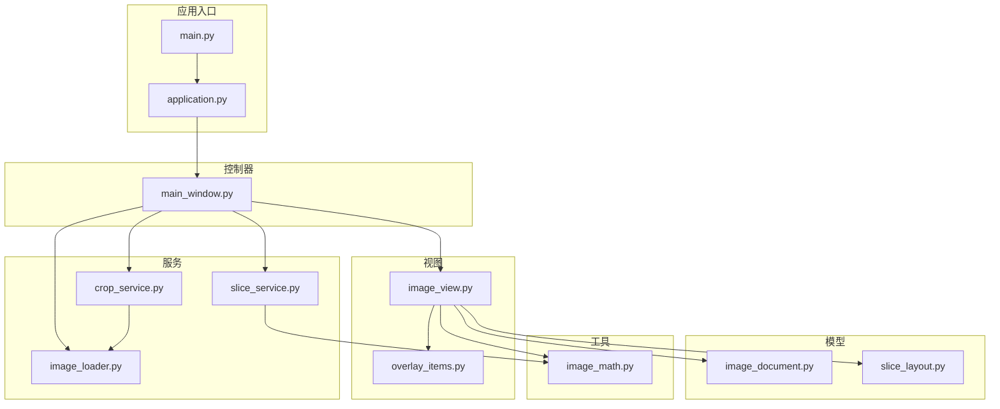
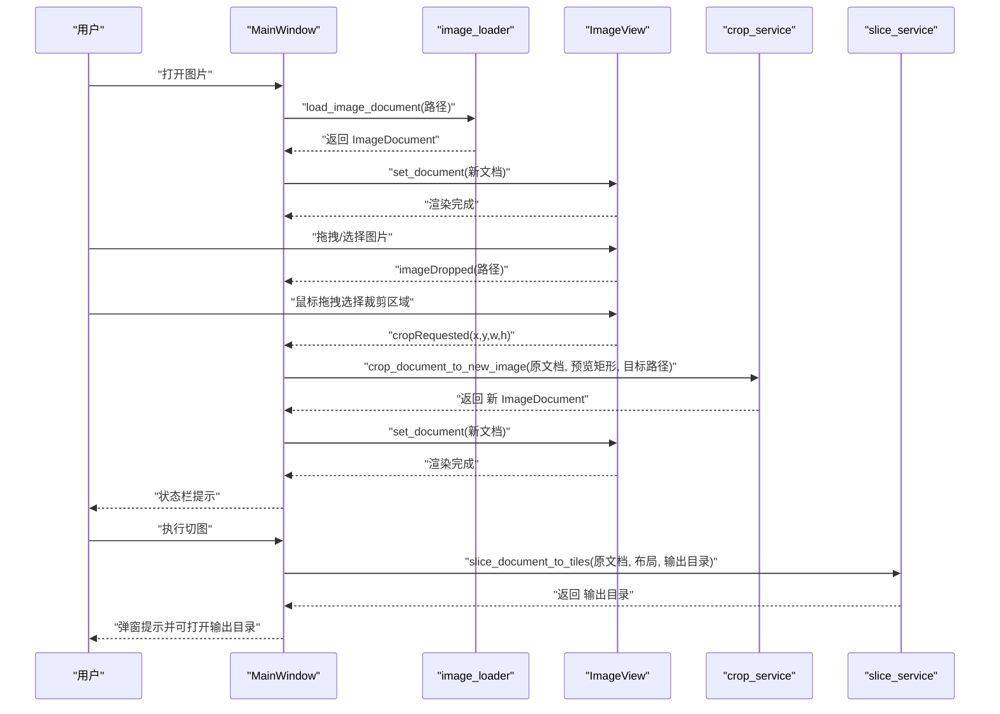
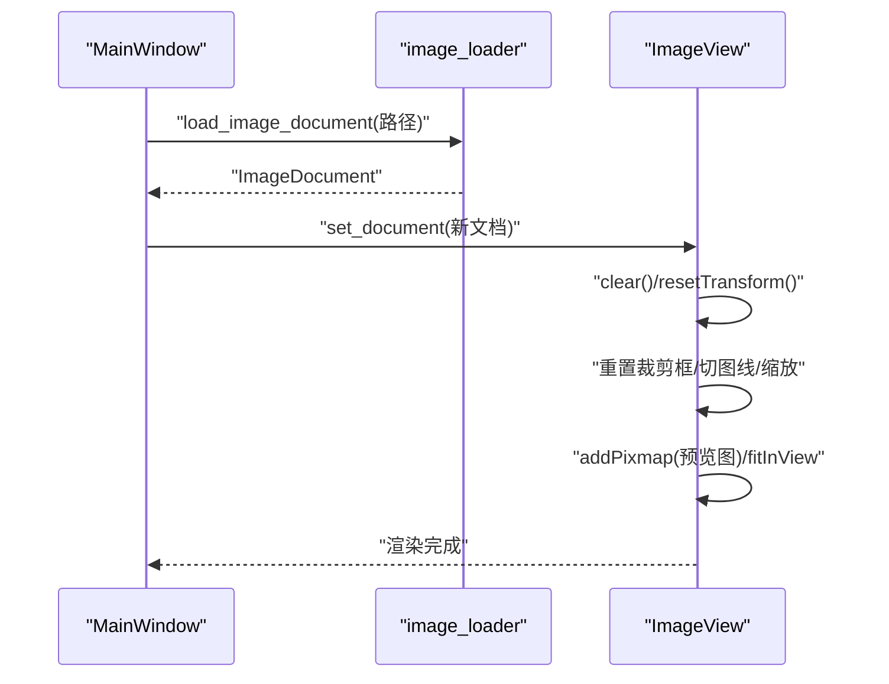
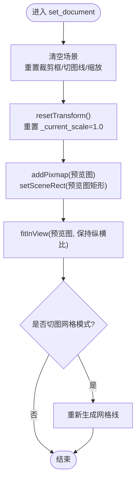
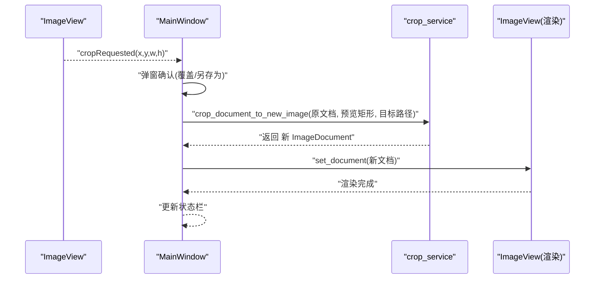
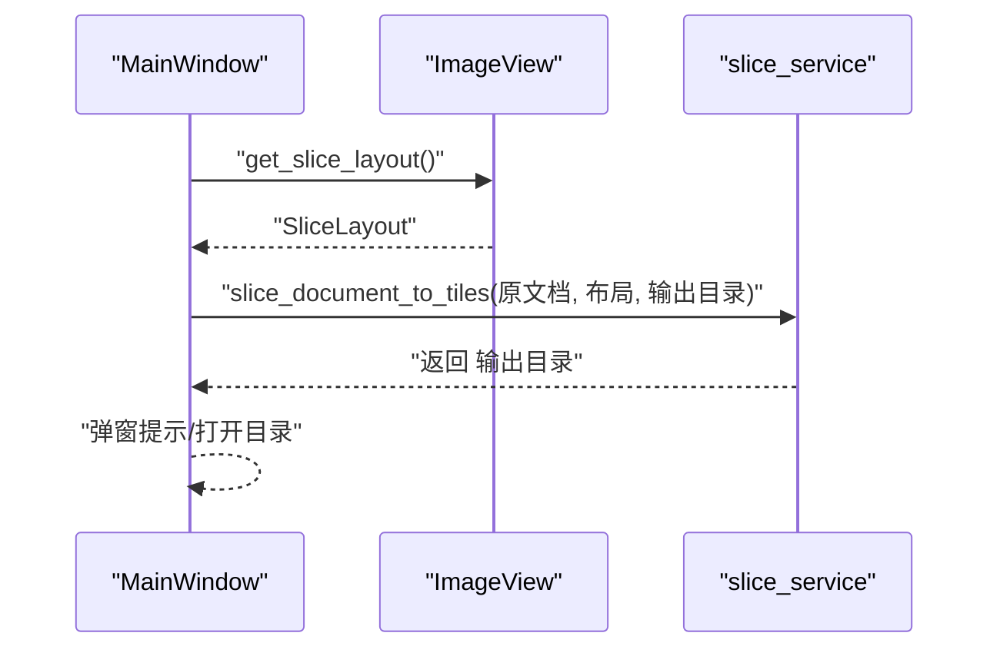
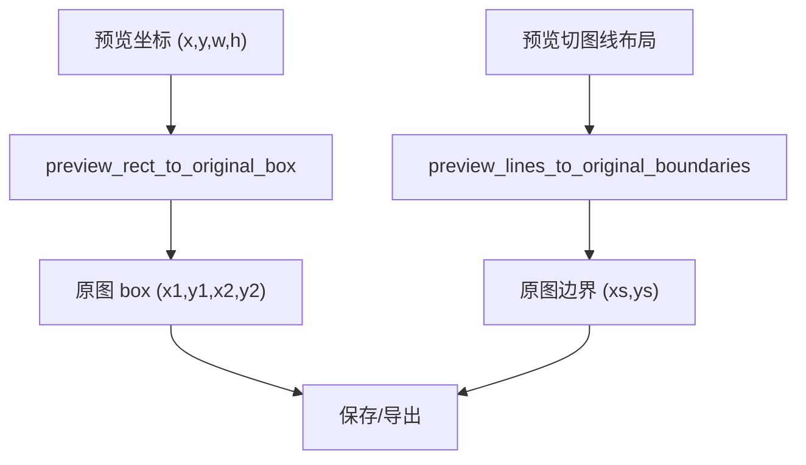
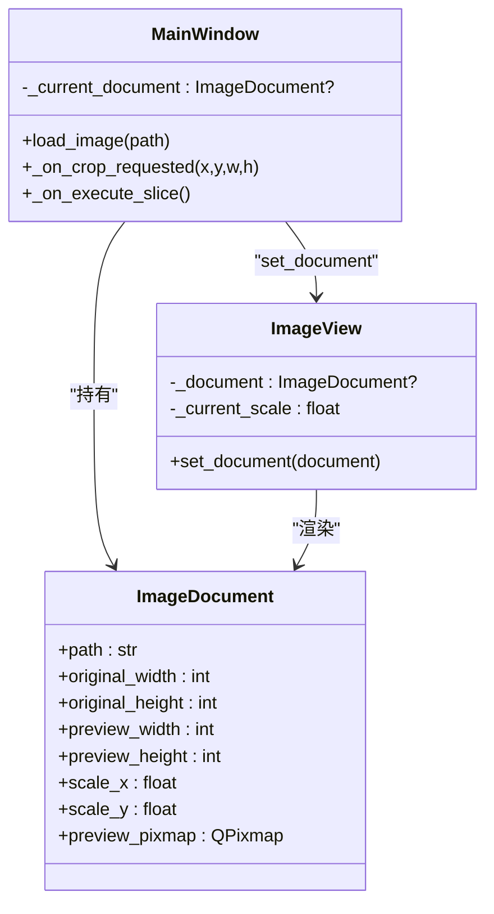
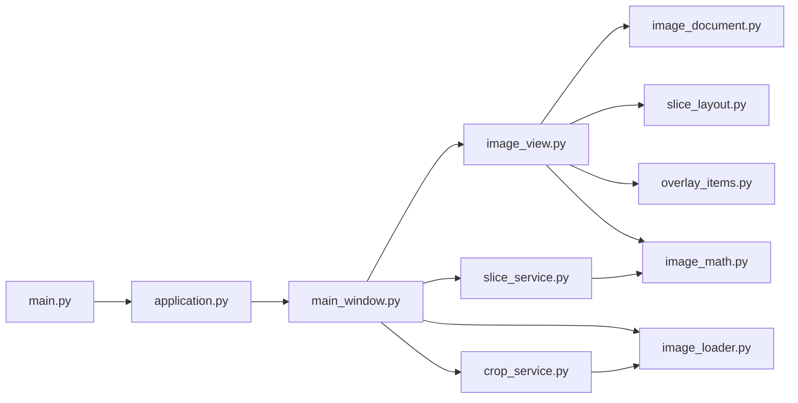

# 文档状态同步

<cite>
**本文引用的文件**
- [main.py](file://img_slicer_tool/main.py)
- [application.py](file://img_slicer_tool/app/application.py)
- [main_window.py](file://img_slicer_tool/app/main_window.py)
- [image_view.py](file://img_slicer_tool/views/image_view.py)
- [image_document.py](file://img_slicer_tool/models/image_document.py)
- [image_loader.py](file://img_slicer_tool/services/image_loader.py)
- [crop_service.py](file://img_slicer_tool/services/crop_service.py)
- [slice_service.py](file://img_slicer_tool/services/slice_service.py)
- [image_math.py](file://img_slicer_tool/utils/image_math.py)
- [slice_layout.py](file://img_slicer_tool/models/slice_layout.py)
- [overlay_items.py](file://img_slicer_tool/views/overlay_items.py)
</cite>

## 目录
1. [引言](#引言)
2. [项目结构](#项目结构)
3. [核心组件](#核心组件)
4. [架构总览](#架构总览)
5. [详细组件分析](#详细组件分析)
6. [依赖关系分析](#依赖关系分析)
7. [性能考量](#性能考量)
8. [故障排查指南](#故障排查指南)
9. [结论](#结论)

## 引言
本文件围绕“ImageDocument”对象在应用中的状态同步机制展开，重点说明以下流程与要点：
- 用户通过文件对话框加载新图像时，image_loader 服务如何创建新的 ImageDocument 实例，并通过 MainWindow 的 set_document 将其传递给 ImageView。
- ImageView.set_document 如何清空当前场景、重置内部状态（缩放比例、裁剪框等），并根据新的 ImageDocument 重新渲染预览图。
- 在裁剪或切图操作完成后，应用状态如何更新；裁剪后是否创建新的 ImageDocument 来表示结果图像。
- 强调 _current_document 作为核心数据载体，在视图、控制器和服务之间传递时，如何保持数据一致性。

## 项目结构
应用采用分层设计：应用入口负责初始化 UI 应用与主窗口；主窗口承担控制器职责，协调视图与服务；视图负责交互与渲染；模型承载数据；服务提供业务能力；工具模块提供坐标换算等辅助能力。

图表来源
- [main.py](file://img_slicer_tool/main.py#L1-L13)
- [application.py](file://img_slicer_tool/app/application.py#L1-L35)
- [main_window.py](file://img_slicer_tool/app/main_window.py#L1-L364)
- [image_view.py](file://img_slicer_tool/views/image_view.py#L1-L542)
- [image_document.py](file://img_slicer_tool/models/image_document.py#L1-L18)
- [image_loader.py](file://img_slicer_tool/services/image_loader.py#L1-L68)
- [crop_service.py](file://img_slicer_tool/services/crop_service.py#L1-L38)
- [slice_service.py](file://img_slicer_tool/services/slice_service.py#L1-L62)
- [image_math.py](file://img_slicer_tool/utils/image_math.py#L1-L76)
- [slice_layout.py](file://img_slicer_tool/models/slice_layout.py#L1-L30)
- [overlay_items.py](file://img_slicer_tool/views/overlay_items.py#L1-L64)

章节来源
- [main.py](file://img_slicer_tool/main.py#L1-L13)
- [application.py](file://img_slicer_tool/app/application.py#L1-L35)
- [main_window.py](file://img_slicer_tool/app/main_window.py#L1-L364)

## 核心组件
- ImageDocument：承载图像元信息与预览图，包含原始尺寸、预览尺寸、缩放因子以及预览 QPixmap。
- ImageView：图形视图，负责渲染预览图、管理裁剪框与切图线、处理用户交互并发出信号。
- MainWindow：应用控制器，负责文件对话框、状态栏消息、裁剪与切图的执行，维护 _current_document。
- image_loader：加载图像并构建 ImageDocument。
- crop_service：基于预览坐标执行裁剪，返回新的 ImageDocument。
- slice_service：基于切图布局生成切片并保存，返回输出目录。
- image_math：提供预览坐标与原图坐标的换算工具。
- SliceLayout：保存预览坐标系下的切图线布局。
- OverlayItems：裁剪矩形与切图线的可视化项。

章节来源
- [image_document.py](file://img_slicer_tool/models/image_document.py#L1-L18)
- [image_view.py](file://img_slicer_tool/views/image_view.py#L1-L542)
- [main_window.py](file://img_slicer_tool/app/main_window.py#L1-L364)
- [image_loader.py](file://img_slicer_tool/services/image_loader.py#L1-L68)
- [crop_service.py](file://img_slicer_tool/services/crop_service.py#L1-L38)
- [slice_service.py](file://img_slicer_tool/services/slice_service.py#L1-L62)
- [image_math.py](file://img_slicer_tool/utils/image_math.py#L1-L76)
- [slice_layout.py](file://img_slicer_tool/models/slice_layout.py#L1-L30)
- [overlay_items.py](file://img_slicer_tool/views/overlay_items.py#L1-L64)

## 架构总览
下图展示从用户触发到状态更新的关键交互路径，包括文件加载、裁剪与切图后的状态同步。

图表来源
- [main_window.py](file://img_slicer_tool/app/main_window.py#L102-L135)
- [image_loader.py](file://img_slicer_tool/services/image_loader.py#L24-L54)
- [image_view.py](file://img_slicer_tool/views/image_view.py#L65-L82)
- [crop_service.py](file://img_slicer_tool/services/crop_service.py#L13-L37)
- [slice_service.py](file://img_slicer_tool/services/slice_service.py#L12-L61)

## 详细组件分析

### 文件加载与 ImageDocument 创建
- 用户通过文件对话框选择图片，MainWindow 调用 image_loader.load_image_document 加载图像，构建 ImageDocument。
- MainWindow 将 ImageDocument 传入 ImageView.set_document 进行渲染，并更新状态栏。
- ImageView.set_document 清空场景、重置内部状态（缩放、裁剪框、切图线等），并以新文档的预览图重建场景。

图表来源
- [main_window.py](file://img_slicer_tool/app/main_window.py#L114-L135)
- [image_loader.py](file://img_slicer_tool/services/image_loader.py#L24-L54)
- [image_view.py](file://img_slicer_tool/views/image_view.py#L65-L82)

章节来源
- [main_window.py](file://img_slicer_tool/app/main_window.py#L102-L135)
- [image_loader.py](file://img_slicer_tool/services/image_loader.py#L24-L54)
- [image_view.py](file://img_slicer_tool/views/image_view.py#L65-L82)

### ImageView.set_document 的状态同步机制
- 清空当前场景与所有临时绘制项（裁剪框、切图线）。
- 重置变换与缩放，确保新文档以默认缩放显示。
- 重置内部状态：裁剪拖拽标志、上次场景位置、当前缩放值等。
- 使用新文档的预览图重建场景，设置场景矩形并自适应视图。
- 若处于切图网格模式，则重新生成网格线。

图表来源
- [image_view.py](file://img_slicer_tool/views/image_view.py#L65-L82)
- [image_view.py](file://img_slicer_tool/views/image_view.py#L441-L466)

章节来源
- [image_view.py](file://img_slicer_tool/views/image_view.py#L65-L82)
- [image_view.py](file://img_slicer_tool/views/image_view.py#L441-L466)

### 裁剪操作的状态更新
- 用户在 ImageView 中拖拽选择裁剪区域，释放鼠标时发出 cropRequested 信号。
- MainWindow 接收信号后弹出确认对话框，询问覆盖原图或另存为。
- 调用 crop_service.crop_document_to_new_image 执行裁剪，返回新的 ImageDocument。
- 更新 _current_document 并再次调用 ImageView.set_document 渲染新文档。
- 状态栏提示裁剪完成及新文档尺寸信息。

图表来源
- [image_view.py](file://img_slicer_tool/views/image_view.py#L223-L231)
- [main_window.py](file://img_slicer_tool/app/main_window.py#L136-L193)
- [crop_service.py](file://img_slicer_tool/services/crop_service.py#L13-L37)
- [image_view.py](file://img_slicer_tool/views/image_view.py#L65-L82)

章节来源
- [image_view.py](file://img_slicer_tool/views/image_view.py#L223-L231)
- [main_window.py](file://img_slicer_tool/app/main_window.py#L136-L193)
- [crop_service.py](file://img_slicer_tool/services/crop_service.py#L13-L37)
- [image_view.py](file://img_slicer_tool/views/image_view.py#L65-L82)

### 切图操作的状态更新
- 用户在切图模式下配置网格或手动切图线，生成 SliceLayout。
- MainWindow 收集布局并调用 slice_service.slice_document_to_tiles 导出切片。
- 返回输出目录并在状态栏提示结果；可选择打开输出文件夹。

图表来源
- [main_window.py](file://img_slicer_tool/app/main_window.py#L230-L262)
- [image_view.py](file://img_slicer_tool/views/image_view.py#L236-L254)
- [slice_service.py](file://img_slicer_tool/services/slice_service.py#L12-L61)

章节来源
- [main_window.py](file://img_slicer_tool/app/main_window.py#L230-L262)
- [image_view.py](file://img_slicer_tool/views/image_view.py#L236-L254)
- [slice_service.py](file://img_slicer_tool/services/slice_service.py#L12-L61)

### 坐标换算与预览一致性
- 预览坐标与原图坐标通过 image_math 提供的工具函数进行换算。
- 裁剪时将预览矩形映射到原图 box；切图时将预览线布局映射到原图边界。
- ImageDocument 内部的 scale_x/scale_y 保证了预览与原图之间的线性映射关系。

图表来源
- [image_math.py](file://img_slicer_tool/utils/image_math.py#L17-L48)
- [image_math.py](file://img_slicer_tool/utils/image_math.py#L50-L76)
- [image_document.py](file://img_slicer_tool/models/image_document.py#L1-L18)

章节来源
- [image_math.py](file://img_slicer_tool/utils/image_math.py#L17-L48)
- [image_math.py](file://img_slicer_tool/utils/image_math.py#L50-L76)
- [image_document.py](file://img_slicer_tool/models/image_document.py#L1-L18)

### _current_document 的一致性保障
- MainWindow 维护 _current_document，作为当前工作图像的唯一数据源。
- 所有状态更新（加载新图、裁剪后生成新文档、切图导出）均以 _current_document 为基准。
- 视图层通过 set_document 与 _current_document 同步，确保 UI 与数据一致。
- 服务层在需要时读取 _current_document 的元信息（路径、尺寸、缩放）进行换算与保存。

图表来源
- [main_window.py](file://img_slicer_tool/app/main_window.py#L44-L46)
- [main_window.py](file://img_slicer_tool/app/main_window.py#L114-L135)
- [image_view.py](file://img_slicer_tool/views/image_view.py#L65-L82)
- [image_document.py](file://img_slicer_tool/models/image_document.py#L1-L18)

章节来源
- [main_window.py](file://img_slicer_tool/app/main_window.py#L44-L46)
- [main_window.py](file://img_slicer_tool/app/main_window.py#L114-L135)
- [image_view.py](file://img_slicer_tool/views/image_view.py#L65-L82)
- [image_document.py](file://img_slicer_tool/models/image_document.py#L1-L18)

## 依赖关系分析
- 控制器依赖视图与服务：MainWindow 依赖 ImageView 的事件与状态，依赖 image_loader、crop_service、slice_service 提供业务能力。
- 视图依赖模型与工具：ImageView 依赖 ImageDocument、SliceLayout、OverlayItems；依赖 image_math 进行坐标换算。
- 服务依赖模型与工具：crop_service、slice_service 依赖 ImageDocument 与 image_math；slice_service 依赖 SliceLayout。
- 入口依赖控制器：main.py 通过 application.py 初始化 MainWindow 并运行应用。

图表来源
- [main.py](file://img_slicer_tool/main.py#L1-L13)
- [application.py](file://img_slicer_tool/app/application.py#L1-L35)
- [main_window.py](file://img_slicer_tool/app/main_window.py#L1-L364)
- [image_view.py](file://img_slicer_tool/views/image_view.py#L1-L542)
- [image_document.py](file://img_slicer_tool/models/image_document.py#L1-L18)
- [slice_layout.py](file://img_slicer_tool/models/slice_layout.py#L1-L30)
- [overlay_items.py](file://img_slicer_tool/views/overlay_items.py#L1-L64)
- [image_loader.py](file://img_slicer_tool/services/image_loader.py#L1-L68)
- [crop_service.py](file://img_slicer_tool/services/crop_service.py#L1-L38)
- [slice_service.py](file://img_slicer_tool/services/slice_service.py#L1-L62)
- [image_math.py](file://img_slicer_tool/utils/image_math.py#L1-L76)

章节来源
- [main.py](file://img_slicer_tool/main.py#L1-L13)
- [application.py](file://img_slicer_tool/app/application.py#L1-L35)
- [main_window.py](file://img_slicer_tool/app/main_window.py#L1-L364)
- [image_view.py](file://img_slicer_tool/views/image_view.py#L1-L542)
- [image_loader.py](file://img_slicer_tool/services/image_loader.py#L1-L68)
- [crop_service.py](file://img_slicer_tool/services/crop_service.py#L1-L38)
- [slice_service.py](file://img_slicer_tool/services/slice_service.py#L1-L62)
- [image_math.py](file://img_slicer_tool/utils/image_math.py#L1-L76)
- [image_document.py](file://img_slicer_tool/models/image_document.py#L1-L18)
- [slice_layout.py](file://img_slicer_tool/models/slice_layout.py#L1-L30)
- [overlay_items.py](file://img_slicer_tool/views/overlay_items.py#L1-L64)

## 性能考量
- 预览图尺寸控制：image_loader 在加载时根据最大尺寸阈值生成预览图，避免大图直接渲染导致内存与 UI 卡顿。
- 缩放与变换：ImageView 默认 fitInView，配合 resetTransform 与 _current_scale，减少复杂变换累积带来的误差。
- 坐标换算：预览与原图的线性映射由 scale_x/scale_y 保证，避免重复计算与误差放大。
- 切图导出：批量保存前先计算边界并过滤无效区域，减少无效写入。

[本节为通用性能建议，无需特定文件引用]

## 故障排查指南
- 加载失败：检查文件是否存在与格式支持；MainWindow 在加载异常时弹出错误提示。
- 裁剪失败：确认预览矩形有效且非空；crop_service 会基于预览坐标映射到原图 box 并保存；若目标路径为空则中断。
- 切图失败：确认输出目录存在且布局有效；slice_service 会在边界不足时报错。
- 拖拽无效：确保拖入的是本地文件且扩展名受支持；ImageView 会区分有效与无效文件并提示。

章节来源
- [main_window.py](file://img_slicer_tool/app/main_window.py#L114-L135)
- [main_window.py](file://img_slicer_tool/app/main_window.py#L136-L193)
- [main_window.py](file://img_slicer_tool/app/main_window.py#L230-L262)
- [image_view.py](file://img_slicer_tool/views/image_view.py#L141-L153)
- [image_view.py](file://img_slicer_tool/views/image_view.py#L526-L529)

## 结论
- ImageDocument 是应用状态的核心载体，贯穿加载、裁剪、切图全流程。
- MainWindow 通过 _current_document 统一管理当前工作图像，确保视图与服务的数据一致性。
- ImageView.set_document 负责状态同步与渲染重建，确保 UI 与数据同步。
- 裁剪后会创建新的 ImageDocument 表示结果图像，并通过 set_document 更新视图。
- 坐标换算通过 image_math 与 ImageDocument 的 scale_x/scale_y 保证预览与原图一致。