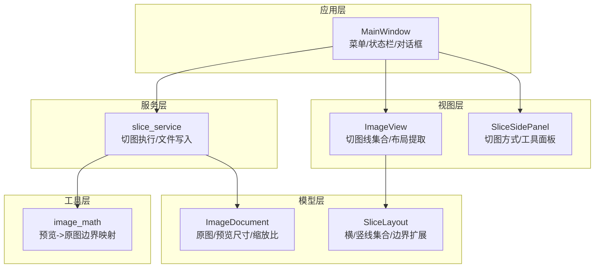
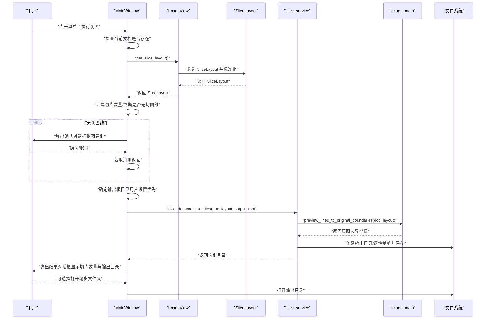
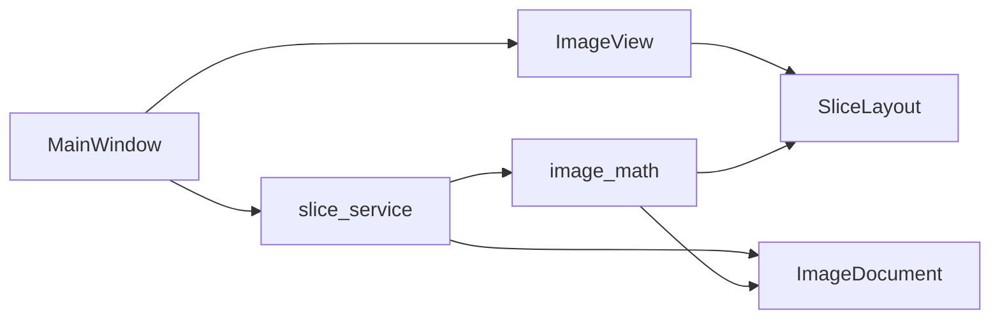

# 切图服务调用

<cite>
**本文引用的文件**
- [img_slicer_tool/app/main_window.py](file://img_slicer_tool/app/main_window.py)
- [img_slicer_tool/views/image_view.py](file://img_slicer_tool/views/image_view.py)
- [img_slicer_tool/models/slice_layout.py](file://img_slicer_tool/models/slice_layout.py)
- [img_slicer_tool/services/slice_service.py](file://img_slicer_tool/services/slice_service.py)
- [img_slicer_tool/utils/image_math.py](file://img_slicer_tool/utils/image_math.py)
- [img_slicer_tool/models/image_document.py](file://img_slicer_tool/models/image_document.py)
- [img_slicer_tool/views/slice_side_panel.py](file://img_slicer_tool/views/slice_side_panel.py)
</cite>

## 目录
1. [简介](#简介)
2. [项目结构](#项目结构)
3. [核心组件](#核心组件)
4. [架构总览](#架构总览)
5. [详细组件分析](#详细组件分析)
6. [依赖关系分析](#依赖关系分析)
7. [性能考量](#性能考量)
8. [故障排查指南](#故障排查指南)
9. [结论](#结论)

## 简介
本文件围绕 MainWindow 中的 _on_execute_slice 方法，系统性阐述其对 slice_document_to_tiles 切图服务的调用流程。重点包括：
- get_slice_layout 如何从 ImageView 收集当前切图线布局（SliceLayout），并将其标准化与边界扩展；
- 当用户未设置切图线时的默认行为（整图导出）及确认对话框交互；
- _slice_output_root 的保存路径优先级逻辑（用户设置路径优先于图片所在目录）；
- 服务执行成功后的结果目录回显机制；
- 异常处理与用户反馈的集成方式；
- 绘制从菜单触发到切图完成的完整调用时序图。

## 项目结构
该功能涉及的主要模块与职责如下：
- 应用层：MainWindow 负责菜单、状态栏、对话框与信号连接；负责组织调用链与用户交互。
- 视图层：ImageView 负责展示图像、维护切图线集合、提供 get_slice_layout 获取布局；SliceSidePanel 提供切图方式与工具面板。
- 模型层：ImageDocument 描述图像元信息；SliceLayout 描述预览坐标系下的切图线布局。
- 服务层：slice_service 执行切图，生成子图并写入磁盘。
- 工具层：image_math 提供预览坐标到原图坐标的映射与边界计算。

图表来源
- [img_slicer_tool/app/main_window.py](file://img_slicer_tool/app/main_window.py#L230-L261)
- [img_slicer_tool/views/image_view.py](file://img_slicer_tool/views/image_view.py#L236-L253)
- [img_slicer_tool/models/slice_layout.py](file://img_slicer_tool/models/slice_layout.py#L7-L30)
- [img_slicer_tool/services/slice_service.py](file://img_slicer_tool/services/slice_service.py#L12-L62)
- [img_slicer_tool/utils/image_math.py](file://img_slicer_tool/utils/image_math.py#L50-L76)
- [img_slicer_tool/models/image_document.py](file://img_slicer_tool/models/image_document.py#L8-L18)
- [img_slicer_tool/views/slice_side_panel.py](file://img_slicer_tool/views/slice_side_panel.py#L1-L174)

章节来源
- [img_slicer_tool/app/main_window.py](file://img_slicer_tool/app/main_window.py#L230-L261)
- [img_slicer_tool/views/image_view.py](file://img_slicer_tool/views/image_view.py#L236-L253)
- [img_slicer_tool/models/slice_layout.py](file://img_slicer_tool/models/slice_layout.py#L7-L30)
- [img_slicer_tool/services/slice_service.py](file://img_slicer_tool/services/slice_service.py#L12-L62)
- [img_slicer_tool/utils/image_math.py](file://img_slicer_tool/utils/image_math.py#L50-L76)
- [img_slicer_tool/models/image_document.py](file://img_slicer_tool/models/image_document.py#L8-L18)
- [img_slicer_tool/views/slice_side_panel.py](file://img_slicer_tool/views/slice_side_panel.py#L1-L174)

## 核心组件
- MainWindow._on_execute_slice：入口方法，负责读取当前文档、获取切图布局、决定输出路径、调用切图服务并回显结果。
- ImageView.get_slice_layout：从内部切图线集合构造 SliceLayout，并进行预览坐标标准化与边界扩展。
- SliceLayout.normalize/get_boundaries：对横竖线进行去重、过滤与边界扩展，形成可用于切图的边界序列。
- slice_service.slice_document_to_tiles：根据原图路径、布局与输出根目录生成子图并保存。
- image_math.preview_lines_to_original_boundaries：将预览坐标系的边界映射到原图坐标系。
- ImageDocument：承载原图尺寸、预览尺寸与缩放比例等关键信息，用于坐标映射。
- SliceSidePanel：提供“执行切图”按钮与切图方式/工具面板，触发 MainWindow 的执行逻辑。

章节来源
- [img_slicer_tool/app/main_window.py](file://img_slicer_tool/app/main_window.py#L230-L261)
- [img_slicer_tool/views/image_view.py](file://img_slicer_tool/views/image_view.py#L236-L253)
- [img_slicer_tool/models/slice_layout.py](file://img_slicer_tool/models/slice_layout.py#L7-L30)
- [img_slicer_tool/services/slice_service.py](file://img_slicer_tool/services/slice_service.py#L12-L62)
- [img_slicer_tool/utils/image_math.py](file://img_slicer_tool/utils/image_math.py#L50-L76)
- [img_slicer_tool/models/image_document.py](file://img_slicer_tool/models/image_document.py#L8-L18)
- [img_slicer_tool/views/slice_side_panel.py](file://img_slicer_tool/views/slice_side_panel.py#L1-L174)

## 架构总览
下图展示了从菜单触发到切图完成的端到端调用时序，涵盖 MainWindow、ImageView、SliceLayout、slice_service 与 image_math 的协作关系。

图表来源
- [img_slicer_tool/app/main_window.py](file://img_slicer_tool/app/main_window.py#L230-L261)
- [img_slicer_tool/views/image_view.py](file://img_slicer_tool/views/image_view.py#L236-L253)
- [img_slicer_tool/models/slice_layout.py](file://img_slicer_tool/models/slice_layout.py#L7-L30)
- [img_slicer_tool/services/slice_service.py](file://img_slicer_tool/services/slice_service.py#L12-L62)
- [img_slicer_tool/utils/image_math.py](file://img_slicer_tool/utils/image_math.py#L50-L76)

## 详细组件分析

### MainWindow._on_execute_slice：切图入口与交互控制
- 输入来源：当前 ImageDocument、ImageView 的切图布局、用户设置的输出根目录。
- 关键步骤：
  - 校验当前文档存在性；
  - 通过 ImageView.get_slice_layout 获取 SliceLayout；
  - 计算切片数量（用于提示与统计）；
  - 若无切图线，弹出确认对话框，确认后继续，否则终止；
  - 决定输出根目录：优先使用用户设置的 _slice_output_root，若为空则回退到图片所在目录；
  - 调用 slice_document_to_tiles 执行切图；
  - 捕获异常并以消息框反馈；
  - 成功后弹出结果对话框，显示切片数量与输出目录，并可一键打开文件夹。
- 用户反馈：使用 QMessageBox 进行提示、确认与错误弹窗；状态栏显示简要信息。

章节来源
- [img_slicer_tool/app/main_window.py](file://img_slicer_tool/app/main_window.py#L230-L261)
- [img_slicer_tool/app/main_window.py](file://img_slicer_tool/app/main_window.py#L342-L359)
- [img_slicer_tool/app/main_window.py](file://img_slicer_tool/app/main_window.py#L204-L209)

### ImageView.get_slice_layout：从切图线集合构建 SliceLayout
- 数据来源：内部维护的切图线集合（横/竖线），限定在当前预览图矩形范围内；
- 处理流程：
  - 遍历切图线，按类型分别加入 SliceLayout 的横/竖线列表；
  - 调用 SliceLayout.normalize 进行去重与过滤（仅保留有效范围内的线）；
  - 返回标准化后的 SliceLayout。
- 辅助能力：提供 get_pixmap_rect 获取预览图矩形，用于坐标约束与边界扩展。

章节来源
- [img_slicer_tool/views/image_view.py](file://img_slicer_tool/views/image_view.py#L236-L253)
- [img_slicer_tool/models/slice_layout.py](file://img_slicer_tool/models/slice_layout.py#L14-L30)

### SliceLayout：布局数据结构与边界扩展
- 字段：horizontal_lines、vertical_lines；
- 方法：
  - normalize：去重并过滤无效线（超出预览图范围的线被剔除）；
  - get_boundaries：在 xs、ys 两端追加 0 与宽/高，形成闭区间边界序列；
- 作用：为切图服务提供统一的边界描述，确保覆盖全图且顺序正确。

章节来源
- [img_slicer_tool/models/slice_layout.py](file://img_slicer_tool/models/slice_layout.py#L7-L30)

### slice_service.slice_document_to_tiles：切图执行与文件写入
- 输入：ImageDocument、SliceLayout、输出根目录；
- 校验：原始图片存在性与输出根目录非空；
- 输出目录：以原图名作为子目录名创建；
- 坐标映射：调用 image_math.preview_lines_to_original_boundaries 将预览边界映射到原图边界；
- 切图循环：遍历边界对，裁剪并保存为带行列编号的文件；
- 文件格式：保持原图扩展名，对 JPEG 设置质量参数；
- 返回值：输出目录路径。

章节来源
- [img_slicer_tool/services/slice_service.py](file://img_slicer_tool/services/slice_service.py#L12-L62)
- [img_slicer_tool/utils/image_math.py](file://img_slicer_tool/utils/image_math.py#L50-L76)

### image_math.preview_lines_to_original_boundaries：坐标映射
- 输入：ImageDocument（包含缩放比例）、SliceLayout；
- 步骤：将预览边界乘以 scale_x/scale_y 并四舍五入，限制在原图范围内，去重排序；
- 校验：若边界不足（xs/y 不足两个点），抛出异常，防止无效切图。
- 输出：原图坐标下的 xs、ys 边界列表。

章节来源
- [img_slicer_tool/utils/image_math.py](file://img_slicer_tool/utils/image_math.py#L50-L76)
- [img_slicer_tool/models/image_document.py](file://img_slicer_tool/models/image_document.py#L8-L18)

### 切图线生成与工作模式
- SliceSidePanel 提供“网格生成”和“手动生成”两种模式；
- 网格模式：通过行列数值生成横/竖线；
- 手动模式：通过工具按钮选择横线/竖线/十字线，点击图像位置添加；
- 手动模式下支持选择、拖拽调整与删除切图线；
- 切图前会根据当前模式与工具更新 ImageView 的切图线集合。

章节来源
- [img_slicer_tool/views/slice_side_panel.py](file://img_slicer_tool/views/slice_side_panel.py#L1-L174)
- [img_slicer_tool/views/image_view.py](file://img_slicer_tool/views/image_view.py#L265-L304)
- [img_slicer_tool/views/image_view.py](file://img_slicer_tool/views/image_view.py#L333-L342)
- [img_slicer_tool/views/image_view.py](file://img_slicer_tool/views/image_view.py#L441-L466)

## 依赖关系分析
- MainWindow 依赖 ImageView 获取布局、依赖 slice_service 执行切图、依赖 QMessageBox 进行交互；
- ImageView 依赖 SliceLayout 存储布局、依赖 image_math 进行坐标映射；
- slice_service 依赖 ImageDocument 与 SliceLayout，并调用 image_math；
- image_math 依赖 ImageDocument 与 SliceLayout。

图表来源
- [img_slicer_tool/app/main_window.py](file://img_slicer_tool/app/main_window.py#L230-L261)
- [img_slicer_tool/views/image_view.py](file://img_slicer_tool/views/image_view.py#L236-L253)
- [img_slicer_tool/services/slice_service.py](file://img_slicer_tool/services/slice_service.py#L12-L62)
- [img_slicer_tool/utils/image_math.py](file://img_slicer_tool/utils/image_math.py#L50-L76)
- [img_slicer_tool/models/image_document.py](file://img_slicer_tool/models/image_document.py#L8-L18)
- [img_slicer_tool/models/slice_layout.py](file://img_slicer_tool/models/slice_layout.py#L7-L30)

## 性能考量
- 切图复杂度：O(R×C)，其中 R、C 分别为横/竖边界数量；边界数量受网格行列数与手动线数量影响；
- 坐标映射：线性时间，与边界数量成正比；
- I/O 开销：每张切片一次写入，建议避免过大的网格导致大量小文件；
- 缩放与边界：预览坐标到原图坐标的映射为常数时间，整体开销较小；
- 建议：合理设置网格行列数，避免过多切片；JPEG 保存时的质量参数已在服务层设置，无需额外优化。

## 故障排查指南
- 无切图线时仍执行切图：
  - 现象：弹出确认对话框，确认后仅导出整图；
  - 处理：在 ImageView 中添加横/竖线或切换到网格模式生成切图线。
- 输出路径为空：
  - 现象：自动回退到图片所在目录；
  - 处理：通过菜单设置“切图保存路径”，确保路径存在且可写。
- 切图失败：
  - 现象：弹出错误对话框；
  - 可能原因：原图不存在、输出目录不可写、边界不足；
  - 处理：检查原图路径、输出目录权限、切图线数量与有效性。
- 结果目录未显示：
  - 现象：成功后弹出结果对话框，可选择打开输出文件夹；
  - 处理：点击“打开输出文件夹”或手动前往输出目录查看。

章节来源
- [img_slicer_tool/app/main_window.py](file://img_slicer_tool/app/main_window.py#L239-L249)
- [img_slicer_tool/app/main_window.py](file://img_slicer_tool/app/main_window.py#L250-L259)
- [img_slicer_tool/services/slice_service.py](file://img_slicer_tool/services/slice_service.py#L19-L24)
- [img_slicer_tool/utils/image_math.py](file://img_slicer_tool/utils/image_math.py#L72-L76)
- [img_slicer_tool/app/main_window.py](file://img_slicer_tool/app/main_window.py#L342-L359)

## 结论
- MainWindow._on_execute_slice 是切图流程的中枢，串联了布局获取、交互确认、路径决策、服务调用与结果回显；
- ImageView.get_slice_layout 将用户绘制的切图线转化为标准化的 SliceLayout，是切图准确性的关键；
- 当无切图线时，默认整图导出并通过确认对话框保障用户体验；
- 输出根目录优先采用用户设置，未设置时回退到图片所在目录，保证灵活性；
- 服务层负责坐标映射与文件写入，异常通过消息框反馈，便于快速定位问题；
- 通过时序图可以清晰看到从菜单触发到切图完成的完整链路，有助于理解各组件职责与耦合关系。